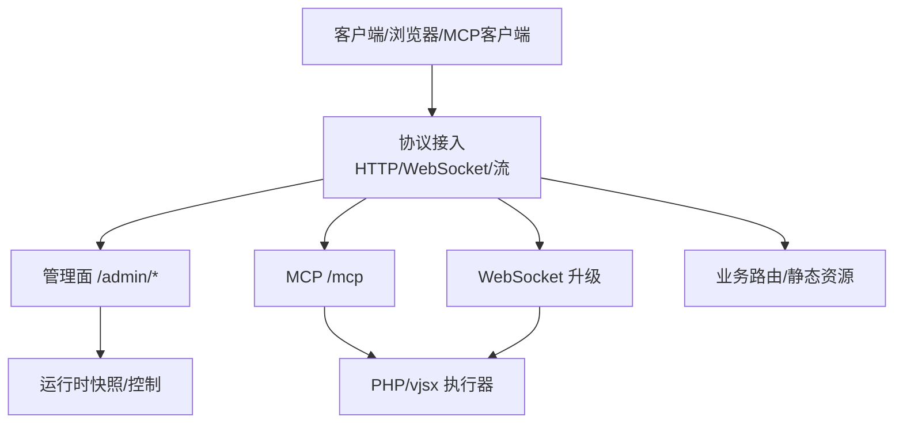
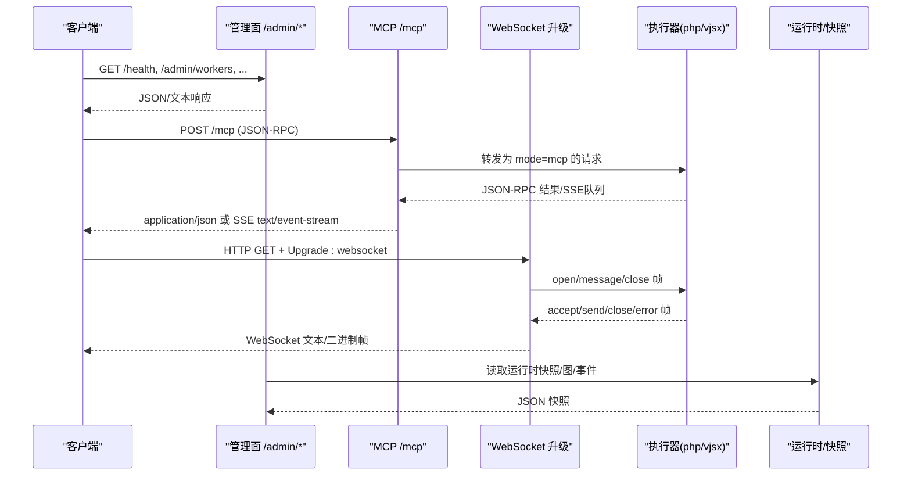
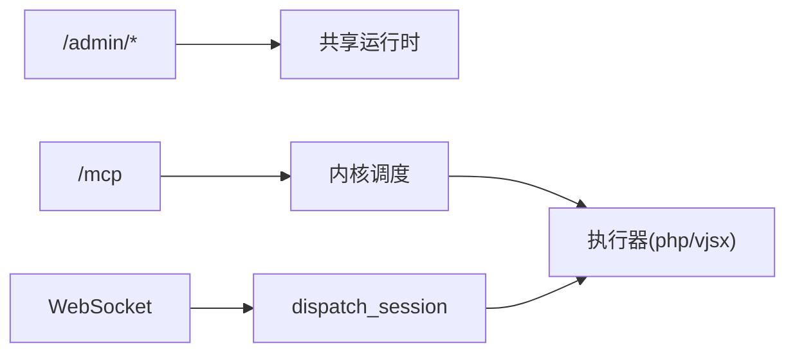

# API 参考

<cite>
**本文引用的文件**   
- [README.md](file://README.md)
- [admin_server.v](file://src/admin_server.v)
- [mcp_runtime.v](file://src/mcp_runtime.v)
- [WEBSOCKET_MVP_PLAN.md](file://docs/WEBSOCKET_MVP_PLAN.md)
- [WEBSOCKET_PHASE2_IMPLEMENTATION_PLAN.md](file://docs/WEBSOCKET_PHASE2_IMPLEMENTATION_PLAN.md)
- [MCP.md](file://docs/MCP.md)
- [MCP_MVP_PLAN.md](file://docs/MCP_MVP_PLAN.md)
- [ws/runtime.v](file://src/ws/runtime.v)
- [ws/dispatch_session.v](file://src/ws/dispatch_session.v)
- [examples/config/mcp.toml](file://examples/config/mcp.toml)
- [examples/config/websocket-echo.toml](file://examples/config/websocket-echo.toml)
- [examples/public/websocket_echo_app.js](file://examples/public/websocket_echo_app.js)
</cite>

## 目录
1. [简介](#简介)
2. [项目结构](#项目结构)
3. [核心组件](#核心组件)
4. [架构总览](#架构总览)
5. [详细组件分析](#详细组件分析)
6. [依赖关系分析](#依赖关系分析)
7. [性能与限流](#性能与限流)
8. [故障排查指南](#故障排查指南)
9. [结论](#结论)
10. [附录：客户端集成与调试](#附录客户端集成与调试)

## 简介
本参考文档面向 vhttpd 的对外 API，覆盖三类接口：
- HTTP REST API（含健康检查、管理面、网关发送等）
- WebSocket API（连接建立、消息格式、事件类型、实时交互模式）
- MCP JSON-RPC API（Streamable HTTP 传输、会话管理、工具调用）

文档提供请求/响应示例、错误码说明、安全与限流建议，以及客户端集成与调试方法。

## 项目结构
vhttpd 将协议接入与运行时能力解耦：HTTP/WebSocket/流式传输由 ingress 层统一接入，再分发到逻辑执行器（php-worker、vjsx 等），并通过 admin 面暴露运行态观测与控制能力。MCP 作为 Streamable HTTP 协议在 /mcp 路径上实现；WebSocket 通过 Upgrade 机制桥接到 worker；管理面集中在 /admin/*。

图表来源
- [README.md:84-126](file://README.md#L84-L126)
- [admin_server.v:111-141](file://src/admin_server.v#L111-L141)
- [mcp_runtime.v:134-138](file://src/mcp_runtime.v#L134-L138)
- [ws/dispatch_session.v:1-35](file://src/ws/dispatch_session.v#L1-L35)

章节来源
- [README.md:84-126](file://README.md#L84-L126)

## 核心组件
- 管理面 API：健康检查、工作进程、统计、运行时快照、计划替换、事件投递、上游/WS/MCP 状态查询等
- MCP 服务：POST /mcp 接收 JSON-RPC，支持 initialize、tools/resources/prompts 等，SSE 推送通知
- WebSocket：基于 Upgrade 的长连接，文本帧双向通信，房间与会元数据管理能力
- 网关发送：面向外部 provider 的上行发送接口（如 Feishu）

章节来源
- [README.md:1147-1221](file://README.md#L1147-L1221)
- [admin_server.v:111-141](file://src/admin_server.v#L111-L141)
- [mcp_runtime.v:11-132](file://src/mcp_runtime.v#L11-L132)
- [WEBSOCKET_MVP_PLAN.md:123-224](file://docs/WEBSOCKET_MVP_PLAN.md#L123-L224)

## 架构总览
下图展示从客户端到执行器的关键路径与管理面观测点。

图表来源
- [admin_server.v:111-141](file://src/admin_server.v#L111-L141)
- [mcp_runtime.v:11-132](file://src/mcp_runtime.v#L11-L132)
- [ws/dispatch_session.v:1-35](file://src/ws/dispatch_session.v#L1-L35)
- [README.md:1147-1221](file://README.md#L1147-L1221)

## 详细组件分析

### HTTP REST API（管理面与网关）
- 认证模型
  - 当未配置 token 时，管理端点在管理端口开放
  - 配置 token 后，需在请求头 x-vhttpd-admin-token 或查询参数 admin_token 中携带
  - 缺失或无效返回 403 Forbidden
- 端口暴露策略
  - admin-port=0：/admin/* 在服务端口提供
  - admin-port>0：/admin/* 仅在服务端口返回 404，改由独立管理端口提供

常用端点（节选）
- GET /health
  - 用途：健康检查
  - 响应：200 OK
- GET /admin/workers
  - 用途：工作进程池快照
  - 响应：application/json; charset=utf-8
- GET /admin/stats
  - 用途：进程级统计
  - 响应：application/json; charset=utf-8
- GET /admin/runtime
  - 用途：运行时能力与活跃连接/会话计数
  - 响应：application/json; charset=utf-8
- GET /admin/runtime/upstreams
  - 用途：阶段3上游会话摘要
  - 可选参数：details=1, limit, offset
  - 响应：application/json; charset=utf-8
- GET /admin/runtime/websockets
  - 用途：活跃 WS 连接与房间快照
  - 可选参数：details=1, limit, offset, room, conn_id
  - 响应：application/json; charset=utf-8
- GET /admin/runtime/mcp
  - 用途：活跃 MCP 会话快照
  - 可选参数：details=1, limit, offset, session_id, protocol_version
  - 响应：application/json; charset=utf-8
- DELETE /mcp
  - 用途：终止单个 MCP 会话
  - 必需：Mcp-Session-Id 头或 session_id 查询
  - 响应：application/json; charset=utf-8
- POST /admin/workers/restart?id=<worker_id>
  - 用途：重启指定 worker
  - 响应：JSON
- POST /admin/workers/restart/all
  - 用途：重启所有 managed workers
  - 响应：JSON

认证与鉴权
- 使用 x-vhttpd-admin-token 或 ?admin_token=...
- 失败返回 403 Forbidden

章节来源
- [README.md:1147-1221](file://README.md#L1147-L1221)
- [admin_server.v:101-141](file://src/admin_server.v#L101-L141)

### WebSocket API
- 连接建立
  - 标准 HTTP GET + Upgrade: websocket 握手
  - 校验必要头部（Upgrade、Connection、Sec-WebSocket-Key）
- 帧协议（vhttpd ↔ php-worker）
  - vhttpd → worker：open、message、close
  - worker → vhttpd：accept、send、close、error
- 消息格式（示例）
  - open：包含 path、query、headers、remote_addr、request_id、trace_id 等
  - message：opcode=text/binary，data 为负载
  - close：code、reason
  - send：opcode、data
  - error：error_class、error
- 第二阶段增强（websocket_dispatch）
  - 新增 result/error 响应帧，commands 列表支持 broadcast、send、join、leave、set_meta、clear_meta 等命令
- 房间与会元数据
  - join/leave 房间
  - set_meta/clear_meta 维护连接元数据
  - presence_snapshot 获取成员与用户列表

章节来源
- [WEBSOCKET_MVP_PLAN.md:123-224](file://docs/WEBSOCKET_MVP_PLAN.md#L123-L224)
- [WEBSOCKET_PHASE2_IMPLEMENTATION_PLAN.md:254-327](file://docs/WEBSOCKET_PHASE2_IMPLEMENTATION_PLAN.md#L254-L327)
- [ws/runtime.v:259-343](file://src/ws/runtime.v#L259-L343)
- [ws/dispatch_session.v:1-35](file://src/ws/dispatch_session.v#L1-L35)

### MCP JSON-RPC API（Streamable HTTP）
- 传输方式
  - POST /mcp：接收 JSON-RPC 请求，返回 application/json
  - GET /mcp：SSE 推送（text/event-stream），用于服务端通知与采样
  - DELETE /mcp：按会话终止
- 会话管理
  - 通过 Mcp-Session-Id 维持会话
  - initialize 可创建新会话并记录客户端能力
  - 支持 sampling 能力策略（warn/drop/error）
- 典型方法
  - initialize、ping
  - tools/list、tools/call
  - resources/list、resources/read
  - prompts/list、prompts/get
- 请求/响应要点
  - 请求体为标准 JSON-RPC 2.0
  - 响应可能包含 commands 与 messages 队列（SSE）
  - 错误类：empty_body、origin_forbidden、worker_unavailable、bad_gateway 等
- 安全与策略
  - Origin 白名单校验
  - 协议版本协商（MCP-Protocol-Version）
  - 采样能力声明与策略控制

章节来源
- [MCP.md:12-97](file://docs/MCP.md#L12-L97)
- [MCP_MVP_PLAN.md:234-331](file://docs/MCP_MVP_PLAN.md#L234-L331)
- [mcp_runtime.v:11-132](file://src/mcp_runtime.v#L11-L132)
- [examples/config/mcp.toml:24-32](file://examples/config/mcp.toml#L24-L32)

## 依赖关系分析
- 管理面与运行时
  - 管理端点通过共享运行时对象读取快照与执行控制操作
- MCP 与执行器
  - /mcp 请求经内核调度至 PHP/vjsx 执行器，mode=mcp
- WebSocket 与执行器
  - 升级后的连接通过 dispatch session 桥接到 worker，双向帧交换

图表来源
- [admin_server.v:111-141](file://src/admin_server.v#L111-L141)
- [mcp_runtime.v:40-57](file://src/mcp_runtime.v#L40-L57)
- [ws/dispatch_session.v:1-35](file://src/ws/dispatch_session.v#L1-L35)

章节来源
- [admin_server.v:111-141](file://src/admin_server.v#L111-L141)
- [mcp_runtime.v:40-57](file://src/mcp_runtime.v#L40-L57)
- [ws/dispatch_session.v:1-35](file://src/ws/dispatch_session.v#L1-L35)

## 性能与限流
- 并发与队列
  - WebSocket 存在 pending 队列与生命周期控制，避免在 closing/closed 阶段写入
  - MCP 支持 max_sessions、max_pending_messages、session_ttl_seconds 等策略
- 超时与重试
  - worker 读超时、重启退避等参数影响整体吞吐与稳定性
- 建议
  - 合理设置 pool_size、read_timeout_ms、queue_capacity、queue_timeout_ms
  - 对 SSE/WS 场景关注 pending 队列长度与清理策略
  - 对 MCP 启用合理的 sampling_capability_policy 与 allowed_origins

章节来源
- [ws/runtime.v:103-133](file://src/ws/runtime.v#L103-L133)
- [examples/config/mcp.toml:24-32](file://examples/config/mcp.toml#L24-L32)
- [README.md:468-502](file://README.md#L468-L502)

## 故障排查指南
- 管理面鉴权失败
  - 现象：403 Forbidden
  - 排查：确认 x-vhttpd-admin-token 或 ?admin_token 是否正确
- MCP 初始化失败
  - 现象：400 empty_body、403 origin_forbidden、501 worker_unavailable
  - 排查：检查请求体是否为合法 JSON-RPC、Origin 是否在白名单、是否启用逻辑执行器
- WebSocket 握手失败
  - 现象：非 101 切换
  - 排查：确保 GET + Upgrade: websocket + Connection: Upgrade + Sec-WebSocket-Key 齐全
- 连接关闭与重连
  - 现象：close 帧或异常断开
  - 排查：观察 worker 侧 error 帧与 reason，检查网络与 worker 存活

章节来源
- [admin_server.v:101-141](file://src/admin_server.v#L101-L141)
- [mcp_runtime.v:18-39](file://src/mcp_runtime.v#L18-L39)
- [WEBSOCKET_MVP_PLAN.md:112-122](file://docs/WEBSOCKET_MVP_PLAN.md#L112-L122)

## 结论
vhttpd 以统一的协议接入层承载 HTTP、WebSocket 与 MCP，配合多执行器与丰富的管理面能力，形成可扩展的运行时平台。通过清晰的认证与安全策略、完善的运行时观测与诊断接口，便于在生产环境中稳定集成与运维。

## 附录：客户端集成与调试
- 管理面
  - 使用 cURL 或浏览器访问 /admin/*，带上 x-vhttpd-admin-token 或 ?admin_token=...
- WebSocket
  - 使用浏览器控制台或示例页面 examples/public/websocket_echo_app.js 进行连接与收发测试
  - 参考 websocket-echo.toml 启动最小可用环境
- MCP
  - 使用任意 JSON-RPC 客户端向 POST /mcp 发送 initialize 与工具调用
  - 通过 GET /mcp 订阅 SSE 通知，注意 Mcp-Session-Id 与协议版本
  - 参考 mcp.toml 配置 allowed_origins 与采样策略

章节来源
- [examples/public/websocket_echo_app.js:1-45](file://examples/public/websocket_echo_app.js#L1-L45)
- [examples/config/websocket-echo.toml:1-28](file://examples/config/websocket-echo.toml#L1-L28)
- [examples/config/mcp.toml:1-39](file://examples/config/mcp.toml#L1-L39)