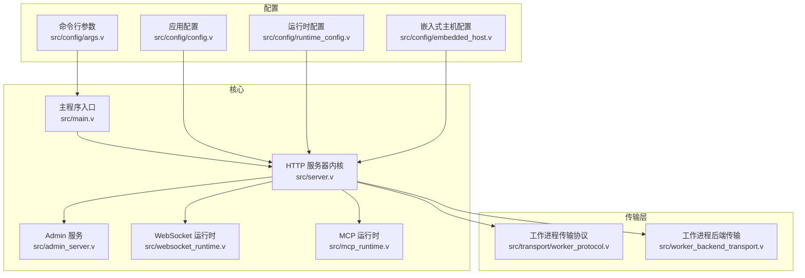
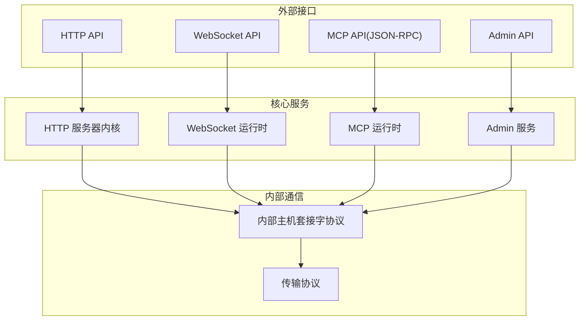
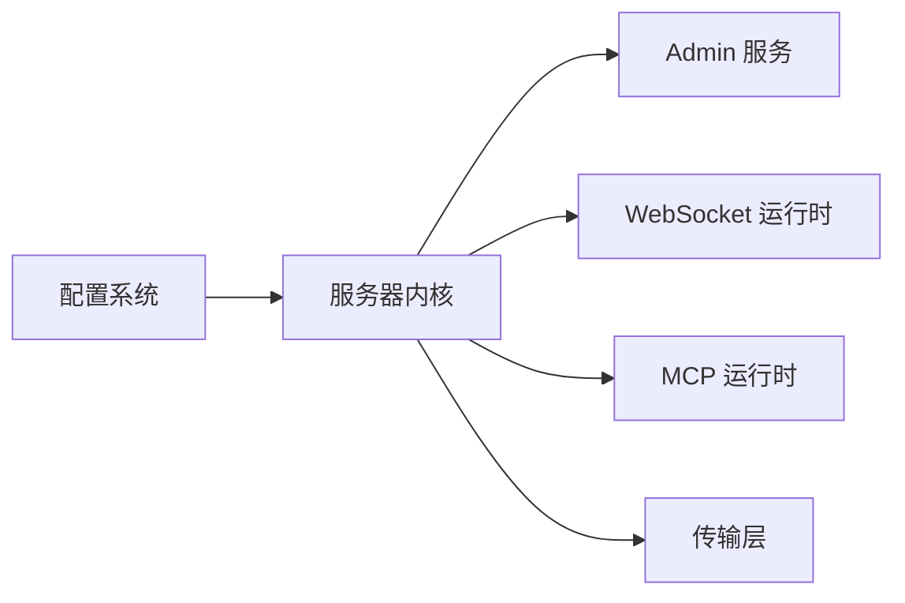

# API 参考

<cite>
**本文引用的文件**
- [README.md](file://README.md)
- [INTERNAL_HOST_SOCKET_PROTOCOL.md](file://docs/INTERNAL_HOST_SOCKET_PROTOCOL.md)
- [MCP.md](file://docs/MCP.md)
- [MCP_APP_API.md](file://docs/MCP_APP_API.md)
- [WEBSOCKET_EVENT_BUS_PLAN.md](file://docs/WEBSOCKET_EVENT_BUS_PLAN.md)
- [WEBSOCKET_MESSAGE_DISPATCH_PLAN.md](file://docs/WEBSOCKET_MESSAGE_DISPATCH_PLAN.md)
- [WEBSOCKET_MVP_PLAN.md](file://docs/WEBSOCKET_MVP_PLAN.md)
- [WEBSOCKET_PHASE2_IMPLEMENTATION_PLAN.md](file://docs/WEBSOCKET_PHASE2_IMPLEMENTATION_PLAN.md)
- [WEBSOCKET_UPSTREAM_PLAN.md](file://docs/WEBSOCKET_UPSTREAM_PLAN.md)
- [codex_stream_message.md](file://docs/codex_stream_message.md)
- [transport_contract.md](file://docs/transport_contract.md)
- [admin_server.v](file://src/admin_server.v)
- [internal_admin.v](file://src/internal_admin.v)
- [websocket_runtime.v](file://src/websocket_runtime.v)
- [mcp_runtime.v](file://src/mcp_runtime.v)
- [server.v](file://src/server.v)
- [worker_backend_transport.v](file://src/worker_backend_transport.v)
- [worker_protocol.v](file://src/transport/worker_protocol.v)
- [vhttpd.toml](file://vhttpd.toml)
- [config.v](file://src/config/config.v)
- [runtime_config.v](file://src/config/runtime_config.v)
- [embedded_host.v](file://src/config/embedded_host.v)
- [args.v](file://src/config/args.v)
- [app.php](file://examples/hello-app.php)
- [mcp-app.php](file://examples/mcp-app.php)
- [mcp-feishu-app.php](file://examples/mcp-feishu-app.php)
- [websocket_echo_app.php](file://examples/websocket_echo_app.php)
- [codexbot-app/app.php](file://examples/codexbot-app/app.php)
- [codexbot-app/views/admin_dashboard.html](file://examples/codexbot-app/views/admin_dashboard.html)
- [codexbot-app/views/admin_live_page.html](file://examples/codexbot-app/views/admin_live_page.html)
- [codexbot-app/views/admin_live_panel.html](file://examples/codexbot-app/views/admin_live_panel.html)
- [config/hello.toml](file://examples/config/hello.toml)
- [config/mcp.toml](file://examples/config/mcp.toml)
- [config/websocket-echo.toml](file://examples/config/websocket-echo.toml)
</cite>

## 目录
1. [简介](#简介)
2. [项目结构](#项目结构)
3. [核心组件](#核心组件)
4. [架构总览](#架构总览)
5. [详细组件分析](#详细组件分析)
6. [依赖关系分析](#依赖关系分析)
7. [性能考虑](#性能考虑)
8. [故障排查指南](#故障排查指南)
9. [结论](#结论)
10. [附录](#附录)

## 简介
本文件为 vhttpd 的全面 API 参考，覆盖以下 API 类别与主题：
- Admin API：运行时状态查询、工作进程控制、调试接口
- HTTP API：请求/响应规范、错误码定义
- WebSocket API：连接协议、消息格式、事件类型
- MCP API（JSON-RPC）：工具调用、能力协商机制
- 内部主机套接字协议：用于理解 vhttpd 内部通信机制
- 认证、速率限制、版本兼容性等通用主题

本参考面向 API 使用者与集成开发者，提供参数说明、返回值格式与使用示例指引，并通过图示帮助理解数据流与交互。

## 项目结构
vhttpd 采用模块化设计，核心由“服务器内核 + 运行时模块 + 传输层 + 配置系统”构成。Admin API 与内部管理通道在独立模块中实现；HTTP/WebSocket/MCP 等对外接口由运行时模块承载；内部通信通过“内部主机套接字协议”完成。

图表来源
- [server.v](file://src/server.v)
- [admin_server.v](file://src/admin_server.v)
- [websocket_runtime.v](file://src/websocket_runtime.v)
- [mcp_runtime.v](file://src/mcp_runtime.v)
- [worker_protocol.v](file://src/transport/worker_protocol.v)
- [worker_backend_transport.v](file://src/worker_backend_transport.v)
- [config.v](file://src/config/config.v)
- [runtime_config.v](file://src/config/runtime_config.v)
- [embedded_host.v](file://src/config/embedded_host.v)
- [args.v](file://src/config/args.v)

章节来源
- [README.md](file://README.md)
- [server.v](file://src/server.v)
- [admin_server.v](file://src/admin_server.v)
- [websocket_runtime.v](file://src/websocket_runtime.v)
- [mcp_runtime.v](file://src/mcp_runtime.v)
- [worker_protocol.v](file://src/transport/worker_protocol.v)
- [worker_backend_transport.v](file://src/worker_backend_transport.v)
- [config.v](file://src/config/config.v)
- [runtime_config.v](file://src/config/runtime_config.v)
- [embedded_host.v](file://src/config/embedded_host.v)
- [args.v](file://src/config/args.v)

## 核心组件
- Admin 服务：提供运行时状态查询、工作进程控制、调试接口等管理能力
- WebSocket 运行时：负责连接建立、消息分发、事件广播
- MCP 运行时：承载 JSON-RPC 工具调用与能力协商
- 传输层：封装工作进程间通信协议与帧格式
- 配置系统：加载应用配置、运行时配置与嵌入式主机设置

章节来源
- [admin_server.v](file://src/admin_server.v)
- [websocket_runtime.v](file://src/websocket_runtime.v)
- [mcp_runtime.v](file://src/mcp_runtime.v)
- [worker_protocol.v](file://src/transport/worker_protocol.v)
- [config.v](file://src/config/config.v)
- [runtime_config.v](file://src/config/runtime_config.v)
- [embedded_host.v](file://src/config/embedded_host.v)
- [args.v](file://src/config/args.v)

## 架构总览
下图展示 Admin API、HTTP API、WebSocket API、MCP API 以及内部主机套接字协议之间的交互关系与数据流向。

图表来源
- [server.v](file://src/server.v)
- [websocket_runtime.v](file://src/websocket_runtime.v)
- [mcp_runtime.v](file://src/mcp_runtime.v)
- [admin_server.v](file://src/admin_server.v)
- [INTERNAL_HOST_SOCKET_PROTOCOL.md](file://docs/INTERNAL_HOST_SOCKET_PROTOCOL.md)
- [transport_contract.md](file://docs/transport_contract.md)

## 详细组件分析

### Admin API
Admin API 提供对运行时状态的查询、工作进程的控制与调试能力。典型场景包括：
- 查询当前运行实例数、负载与健康状态
- 控制工作进程启停、重启与扩容缩容
- 获取内部日志与诊断信息

请求与响应规范
- 方法：HTTP GET/POST
- 路径：/admin/*
- 认证：可选（取决于部署配置）
- 响应：JSON 结构，包含状态码、消息与数据体

典型端点
- GET /admin/status
  - 功能：查询运行时状态
  - 请求参数：无
  - 返回字段：运行实例数、负载、健康状态、时间戳
- POST /admin/workers/restart
  - 功能：重启工作进程
  - 请求参数：无
  - 返回字段：操作结果与进度
- GET /admin/diagnose
  - 功能：获取诊断信息
  - 请求参数：无
  - 返回字段：内部日志摘要、内存与 CPU 指标

使用示例
- 使用 curl 查询状态
  - curl -s http://localhost:8080/admin/status
- 使用浏览器访问诊断页面
  - 打开 http://localhost:8080/admin/diagnose

章节来源
- [admin_server.v](file://src/admin_server.v)
- [internal_admin.v](file://src/internal_admin.v)
- [vhttpd.toml](file://vhttpd.toml)

### HTTP API
HTTP API 是 vhttpd 对外的主要接口，支持静态资源、动态路由与流式响应。请求/响应规范如下：
- 方法：GET/POST/PUT/DELETE 等标准方法
- 路径：/ 或应用自定义路由
- 头部：Content-Type、Authorization 等
- 响应：JSON 或二进制流，错误码遵循统一约定

请求格式
- 路径参数：通过 URL 指定
- 查询参数：通过 ?key=value&... 指定
- 请求体：application/json 或 multipart/form-data

响应结构
- 成功：{ "code": 0, "message": "success", "data": {...} }
- 失败：{ "code": N, "message": "...", "data": null }

错误码定义
- 0：成功
- 1xxx：通用错误
- 2xxx：业务错误
- 3xxx：鉴权/权限错误
- 4xxx：参数/请求错误
- 5xxx：服务器内部错误

使用示例
- 发送 JSON 请求
  - curl -X POST http://localhost:8080/ -H "Content-Type: application/json" -d '{...}'
- 获取流式响应
  - curl -N http://localhost:8080/stream

章节来源
- [server.v](file://src/server.v)
- [transport_contract.md](file://docs/transport_contract.md)
- [config.v](file://src/config/config.v)

### WebSocket API
WebSocket API 支持实时双向通信，适用于聊天、通知与事件总线等场景。协议要点：
- 协议升级：GET /ws 以进行 HTTP 到 WebSocket 的升级
- 消息格式：文本或二进制帧，建议使用 JSON 文本帧
- 事件类型：消息推送、心跳、连接状态变更、业务事件

消息格式
- 心跳：{"type":"ping"} / {"type":"pong"}
- 业务事件：{"type":"event","event":"...","payload":{}}

事件类型
- 连接事件：connected、disconnected
- 业务事件：chat.message、notification.update、stream.chunk

使用示例
- 连接与订阅
  - ws://localhost:8080/ws?subscribe=chat
- 发送消息
  - {"type":"message","content":"hello"}

章节来源
- [websocket_runtime.v](file://src/websocket_runtime.v)
- [WEBSOCKET_MVP_PLAN.md](file://docs/WEBSOCKET_MVP_PLAN.md)
- [WEBSOCKET_MESSAGE_DISPATCH_PLAN.md](file://docs/WEBSOCKET_MESSAGE_DISPATCH_PLAN.md)
- [WEBSOCKET_EVENT_BUS_PLAN.md](file://docs/WEBSOCKET_EVENT_BUS_PLAN.md)
- [WEBSOCKET_PHASE2_IMPLEMENTATION_PLAN.md](file://docs/WEBSOCKET_PHASE2_IMPLEMENTATION_PLAN.md)
- [WEBSOCKET_UPSTREAM_PLAN.md](file://docs/WEBSOCKET_UPSTREAM_PLAN.md)

### MCP API（JSON-RPC）
MCP API 基于 JSON-RPC，用于工具调用与能力协商。核心流程：
- 初始化：initialize 请求，协商版本与能力
- 工具调用：tool/call 请求，携带工具名与参数
- 通知：server 通过通知推送进度与结果

JSON-RPC 规范
- 请求对象：包含 jsonrpc、id、method、params
- 响应对象：包含 jsonrpc、id、result 或 error
- 错误对象：包含 code、message、data

能力协商
- initializeParams：声明支持的能力集合
- initializeResponse：确认能力与版本

工具调用
- tool/call：调用指定工具，返回 tool/result 或 tool/error 通知

使用示例
- 初始化
  - {"jsonrpc":"2.0","id":1,"method":"initialize","params":{...}}
- 调用工具
  - {"jsonrpc":"2.0","id":2,"method":"tool/call","params":{"name":"...","arguments":{}}}

章节来源
- [mcp_runtime.v](file://src/mcp_runtime.v)
- [MCP.md](file://docs/MCP.md)
- [MCP_APP_API.md](file://docs/MCP_APP_API.md)

### 内部主机套接字协议
内部主机套接字协议用于 vhttpd 内部组件间的高效通信，支持多路复用与流控。协议要点：
- 帧格式：包含类型、长度、序列号、负载
- 多路复用：通过会话 ID 实现多路并发
- 流控：基于窗口大小与背压机制
- 错误处理：统一错误码与重试策略

典型交互
- 握手：建立会话并交换元数据
- 数据：按帧发送请求/响应
- 关闭：优雅断开并清理资源

章节来源
- [INTERNAL_HOST_SOCKET_PROTOCOL.md](file://docs/INTERNAL_HOST_SOCKET_PROTOCOL.md)
- [worker_protocol.v](file://src/transport/worker_protocol.v)
- [worker_backend_transport.v](file://src/worker_backend_transport.v)

## 依赖关系分析
- Admin 服务依赖服务器内核与配置系统，提供运行时管理能力
- WebSocket 与 MCP 作为扩展服务，通过统一内核接入
- 传输层为各服务提供稳定的数据通道
- 配置系统贯穿启动与运行期，决定行为与边界

图表来源
- [config.v](file://src/config/config.v)
- [server.v](file://src/server.v)
- [admin_server.v](file://src/admin_server.v)
- [websocket_runtime.v](file://src/websocket_runtime.v)
- [mcp_runtime.v](file://src/mcp_runtime.v)
- [worker_protocol.v](file://src/transport/worker_protocol.v)

章节来源
- [config.v](file://src/config/config.v)
- [server.v](file://src/server.v)
- [admin_server.v](file://src/admin_server.v)
- [websocket_runtime.v](file://src/websocket_runtime.v)
- [mcp_runtime.v](file://src/mcp_runtime.v)
- [worker_protocol.v](file://src/transport/worker_protocol.v)

## 性能考虑
- 连接池与复用：合理配置连接上限与空闲超时，避免频繁握手
- 流式传输：对大响应采用分块传输，降低内存峰值
- 背压与限速：在高负载时启用限速与排队策略
- 缓存与压缩：对静态资源启用缓存与压缩，减少带宽占用
- 日志采样：生产环境建议开启日志采样，避免 I/O 抖动

## 故障排查指南
常见问题与定位步骤
- 无法连接 Admin 接口
  - 检查监听地址与端口配置
  - 确认防火墙与代理设置
- WebSocket 断连
  - 查看心跳与 ping/pong 是否正常
  - 检查客户端订阅参数是否正确
- MCP 工具调用失败
  - 核对工具名与参数结构
  - 查看初始化能力是否满足需求
- 内部通信异常
  - 检查内部主机套接字协议的帧格式与序列号
  - 关注流控与背压指标

章节来源
- [admin_server.v](file://src/admin_server.v)
- [websocket_runtime.v](file://src/websocket_runtime.v)
- [mcp_runtime.v](file://src/mcp_runtime.v)
- [INTERNAL_HOST_SOCKET_PROTOCOL.md](file://docs/INTERNAL_HOST_SOCKET_PROTOCOL.md)

## 结论
vhttpd 的 API 生态以统一的服务器内核为核心，Admin、HTTP、WebSocket、MCP 与内部主机套接字协议协同工作，既满足外部集成需求，又保证内部通信的高性能与稳定性。建议在生产环境中结合配置系统与监控体系，持续优化性能与可靠性。

## 附录

### 认证机制
- Admin 接口：可选认证，建议启用基于令牌或双向 TLS 的认证方式
- HTTP 接口：支持 Bearer Token、Basic Auth 或自定义头部
- WebSocket 接口：通过查询参数或 Upgrade 头传递认证信息
- MCP 接口：支持 OAuth 或自定义鉴权方案

章节来源
- [admin_server.v](file://src/admin_server.v)
- [websocket_runtime.v](file://src/websocket_runtime.v)
- [mcp_runtime.v](file://src/mcp_runtime.v)

### 速率限制
- 全局限流：基于 IP 或令牌的 QPS 限制
- 路由级限流：针对特定端点设置配额
- 用户级限流：基于用户标识的差异化配额
- 退避策略：指数退避与滑动窗口相结合

章节来源
- [server.v](file://src/server.v)

### 版本兼容性
- HTTP API：语义化版本控制，PATCH 与 MINOR 变更向后兼容
- WebSocket API：版本通过查询参数或协议版本协商
- MCP API：遵循 JSON-RPC 2.0，能力协商确保兼容性
- 内部协议：向后兼容，新增字段采用可选方式

章节来源
- [transport_contract.md](file://docs/transport_contract.md)
- [MCP.md](file://docs/MCP.md)

### 使用示例索引
- Admin API
  - 查询状态：curl -s http://localhost:8080/admin/status
  - 诊断信息：打开 http://localhost:8080/admin/diagnose
- HTTP API
  - 发送 JSON：curl -X POST http://localhost:8080/ -H "Content-Type: application/json" -d '{...}'
  - 流式响应：curl -N http://localhost:8080/stream
- WebSocket API
  - 连接：ws://localhost:8080/ws?subscribe=chat
  - 发送消息：{"type":"message","content":"hello"}
- MCP API
  - 初始化：{"jsonrpc":"2.0","id":1,"method":"initialize","params":{...}}
  - 工具调用：{"jsonrpc":"2.0","id":2,"method":"tool/call","params":{"name":"...","arguments":{}}}

章节来源
- [admin_server.v](file://src/admin_server.v)
- [websocket_runtime.v](file://src/websocket_runtime.v)
- [mcp_runtime.v](file://src/mcp_runtime.v)
- [server.v](file://src/server.v)