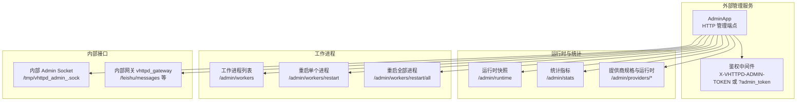
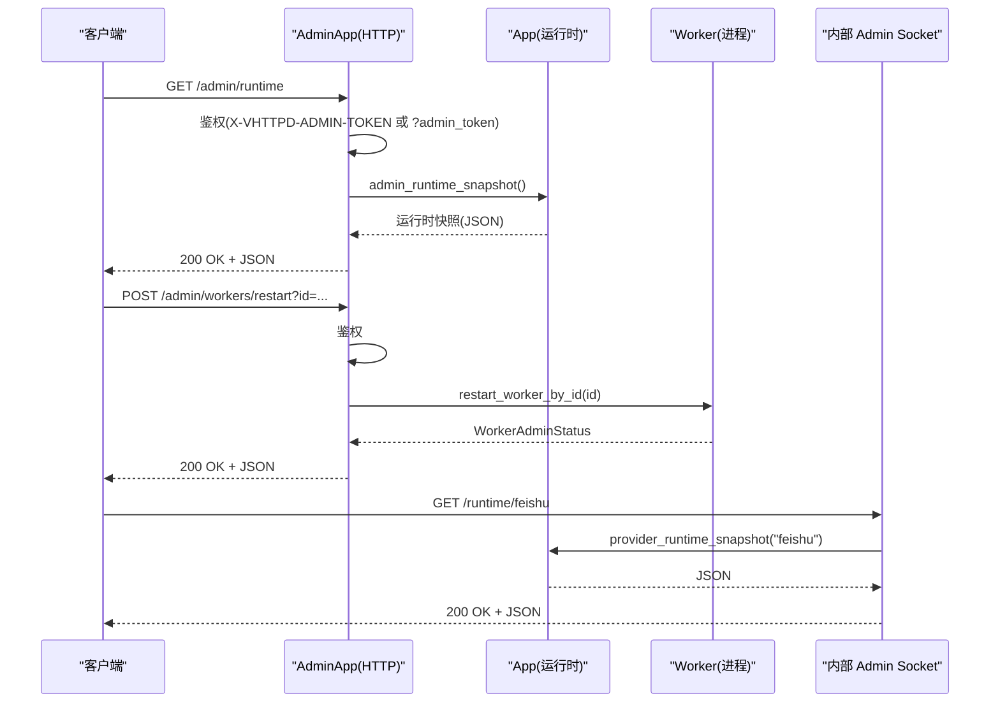
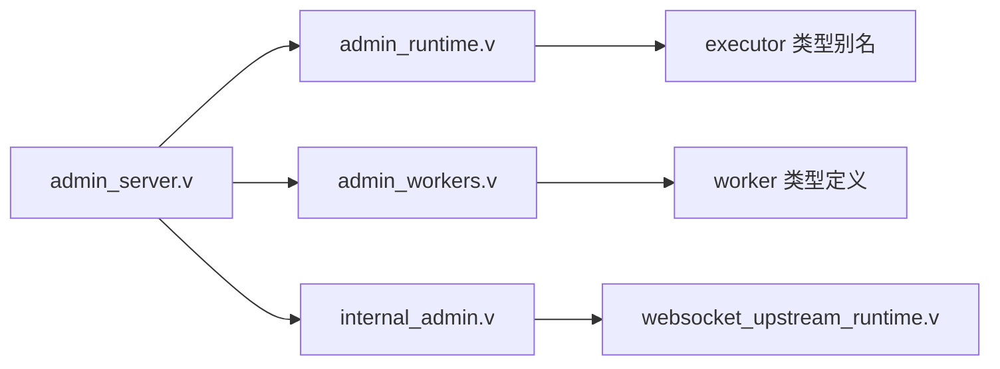

# 管理 API

<cite>
**本文引用的文件**
- [src/admin_server.v](file://src/admin_server.v)
- [src/admin_runtime.v](file://src/admin_runtime.v)
- [src/admin_workers.v](file://src/admin_workers.v)
- [src/internal_admin.v](file://src/internal_admin.v)
- [src/main.v](file://src/main.v)
- [src/websocket_upstream_runtime.v](file://src/websocket_upstream_runtime.v)
</cite>

## 目录
1. [简介](#简介)
2. [项目结构](#项目结构)
3. [核心组件](#核心组件)
4. [架构总览](#架构总览)
5. [详细组件分析](#详细组件分析)
6. [依赖关系分析](#依赖关系分析)
7. [性能考量](#性能考量)
8. [故障排查指南](#故障排查指南)
9. [结论](#结论)
10. [附录](#附录)

## 简介
本文件为 vhttpd 管理 API 的权威文档，覆盖运行时状态查询、工作进程管理、调试接口与内部网关能力。内容包括：
- 所有管理端点的 HTTP 方法、URL 路径、请求参数与响应格式
- 认证机制与访问控制（基于令牌）
- 健康检查、运行时快照、统计指标、上游连接、Websocket 会话、MCP 会话、提供商实例与运行时详情
- 内部 Admin Socket 与内部网关（vhttpd_gateway）能力
- 请求/响应示例与错误码说明
- 常见管理任务操作指南与最佳实践

## 项目结构
管理 API 主要由以下模块组成：
- 外部 Admin 服务：对外暴露 HTTP 管理端点，负责鉴权、路由与响应封装
- 运行时快照与统计：聚合运行时状态、统计指标与活跃资源计数
- 工作进程管理：查询与重启工作进程
- 内部 Admin Socket：Unix Domain Socket 接口，供内部组件调用
- 内部网关：支持二进制上传与 WebSocket 上游发送等能力

**图表来源**
- [src/admin_server.v: 75-587:75-587](file://src/admin_server.v#L75-L587)
- [src/admin_runtime.v: 151-322:151-322](file://src/admin_runtime.v#L151-L322)
- [src/admin_workers.v: 45-154:45-154](file://src/admin_workers.v#L45-L154)
- [src/internal_admin.v: 22-316:22-316](file://src/internal_admin.v#L22-L316)

**章节来源**
- [src/admin_server.v: 1-588:1-588](file://src/admin_server.v#L1-L588)
- [src/admin_runtime.v: 1-323:1-323](file://src/admin_runtime.v#L1-L323)
- [src/admin_workers.v: 1-155:1-155](file://src/admin_workers.v#L1-L155)
- [src/internal_admin.v: 1-317:1-317](file://src/internal_admin.v#L1-L317)

## 核心组件
- AdminApp：对外 HTTP 管理服务，内置鉴权逻辑与统一响应封装
- 运行时快照与统计：聚合 HTTP、工作队列、上游计划、MCP、飞书等指标
- 工作进程管理：查询进程池状态与重启策略
- 内部 Admin Socket：Unix Domain Socket，支持 GET 查询与二进制上传
- 内部网关：支持 POST 发送消息与图片上传等

**章节来源**
- [src/admin_server.v: 8-63:8-63](file://src/admin_server.v#L8-L63)
- [src/admin_runtime.v: 16-126:16-126](file://src/admin_runtime.v#L16-L126)
- [src/admin_workers.v: 7-44:7-44](file://src/admin_workers.v#L7-L44)
- [src/internal_admin.v: 7-32:7-32](file://src/internal_admin.v#L7-L32)

## 架构总览
管理 API 的请求流分为两类：
- 外部 HTTP：AdminApp 接收请求，执行鉴权后调用 App 的运行时快照或工作进程管理函数
- 内部 Unix Socket：内部组件通过 Admin Socket 发起请求，支持更丰富的查询与二进制上传

**图表来源**
- [src/admin_server.v: 124-147:124-147](file://src/admin_server.v#L124-L147)
- [src/admin_workers.v: 89-127:89-127](file://src/admin_workers.v#L89-L127)
- [src/internal_admin.v: 109-171:109-171](file://src/internal_admin.v#L109-L171)

## 详细组件分析

### 认证与访问控制
- 支持两种方式传递管理令牌：
  - 请求头：X-VHTTPD-ADMIN-TOKEN
  - 查询参数：admin_token
- 若未配置令牌，所有请求视为已授权
- 未授权时返回 403 Forbidden

**章节来源**
- [src/admin_server.v: 41-63:41-63](file://src/admin_server.v#L41-L63)
- [src/admin_runtime.v: 153-156:153-156](file://src/admin_runtime.v#L153-L156)

### 健康检查
- 端点：GET /admin
- 行为：返回 200 OK，响应体为纯文本“OK”
- 用途：用于探测 Admin 服务可用性

**章节来源**
- [src/admin_server.v: 69-73:69-73](file://src/admin_server.v#L69-L73)

### 运行时状态查询

#### 运行时快照
- 端点：GET /admin/runtime
- 功能：返回系统启动时间、运行时能力、活跃连接数、统计指标等
- 响应字段（节选）：启动时间、运行时能力集合、工作池摘要、逻辑执行器摘要、活跃计数、HTTP/Worker/MCP/飞书统计
- 查询参数：无
- 响应类型：JSON

**章节来源**
- [src/admin_server.v: 124-147:124-147](file://src/admin_server.v#L124-L147)
- [src/admin_runtime.v: 67-126:67-126](file://src/admin_runtime.v#L67-L126)

#### 统计指标
- 端点：GET /admin/stats
- 功能：返回 HTTP、Worker、Upstream、MCP、飞书等累计统计
- 响应字段（节选）：HTTP 请求总数/错误数/超时数/流总数；Worker 等待/拒绝/超时总数；Upstream 计划总数/失败数；MCP 会话过期/驱逐/丢弃/采样告警/丢弃/错误总数；飞书连接尝试/成功/接收帧/确认事件/发送数/发送错误数；管理动作总数
- 响应类型：JSON

**章节来源**
- [src/admin_server.v: 99-122:99-122](file://src/admin_server.v#L99-L122)
- [src/admin_runtime.v: 16-61:16-61](file://src/admin_runtime.v#L16-L61)

#### 提供商与运行时
- 端点：GET /admin/providers
- 功能：返回已注册提供商名称数组
- 响应类型：JSON

- 端点：GET /admin/providers/specs
- 功能：返回提供商规格快照
- 响应类型：JSON

- 端点：GET /admin/providers/runtimes
- 功能：返回提供商运行时快照
- 响应类型：JSON

**章节来源**
- [src/admin_server.v: 152-176:152-176](file://src/admin_server.v#L152-L176)
- [src/admin_server.v: 203-226:203-226](file://src/admin_server.v#L203-L226)
- [src/admin_server.v: 228-251:228-251](file://src/admin_server.v#L228-L251)
- [src/admin_runtime.v: 280-322:280-322](file://src/admin_runtime.v#L280-L322)

#### 运行时细分视图

##### 上游连接
- 端点：GET /admin/runtime/upstreams
- 查询参数：
  - details：布尔，是否包含详细信息
  - limit：整数，默认 100，最大 1000
  - offset：整数，默认 0
  - role：字符串，按角色过滤
  - provider：字符串，按提供商过滤
- 响应类型：JSON

**章节来源**
- [src/admin_server.v: 253-282:253-282](file://src/admin_server.v#L253-L282)
- [src/admin_runtime.v: 173-199:173-199](file://src/admin_runtime.v#L173-L199)

##### Websocket 会话
- 端点：GET /admin/runtime/websockets
- 查询参数：
  - details：布尔
  - limit：默认 100，最大 1000
  - offset：默认 0
  - room：房间过滤
  - conn_id：连接 ID 过滤
- 响应类型：JSON

**章节来源**
- [src/admin_server.v: 284-313:284-313](file://src/admin_server.v#L284-L313)
- [src/admin_runtime.v: 201-227:201-227](file://src/admin_runtime.v#L201-L227)

##### MCP 会话
- 端点：GET /admin/runtime/mcp
- 查询参数：
  - details：布尔
  - limit：默认 100，最大 1000
  - offset：默认 0
  - session_id：会话 ID 过滤
  - protocol_version：协议版本过滤
- 响应类型：JSON

**章节来源**
- [src/admin_server.v: 315-344:315-344](file://src/admin_server.v#L315-L344)
- [src/admin_runtime.v: 229-255:231-255](file://src/admin_runtime.v#L231-L255)

##### 提供商实例
- 端点：GET /admin/runtime/provider-instances
- 查询参数：
  - provider：提供商过滤
- 响应类型：JSON

**章节来源**
- [src/admin_server.v: 346-370:346-370](file://src/admin_server.v#L346-L370)
- [src/admin_runtime.v: 257-278:257-278](file://src/admin_runtime.v#L257-L278)

##### 飞书运行时
- 端点：GET /admin/runtime/feishu
- 响应类型：JSON

##### 数据库运行时
- 端点：GET /admin/runtime/db
- 响应类型：JSON

**章节来源**
- [src/admin_server.v: 372-420:372-420](file://src/admin_server.v#L372-L420)
- [src/admin_runtime.v: 280-300:280-300](file://src/admin_runtime.v#L280-L300)

##### 飞书聊天记录
- 端点：GET /admin/runtime/feishu/chats
- 查询参数：
  - limit：默认 100，最大 1000
  - offset：默认 0
  - instance：实例过滤
  - chat_type：聊天类型过滤
  - chat_id：聊天 ID 过滤
- 响应类型：JSON

**章节来源**
- [src/admin_server.v: 422-451:422-451](file://src/admin_server.v#L422-L451)

##### 飞书消息发送（POST）
- 端点：POST /admin/runtime/feishu/messages
- 请求体：飞书消息发送请求对象（JSON）
- 成功响应：包含 ok 与 message_id
- 错误响应：包含 error 字段
- 常见错误码：400（无效 JSON）、403（未授权）、502（上游错误）

**章节来源**
- [src/admin_server.v: 453-491:453-491](file://src/admin_server.v#L453-L491)

### 工作进程管理

#### 列表
- 端点：GET /admin/workers
- 响应字段：自动启动、池大小、轮询索引、最大请求数、套接字列表、工作进程数组（含 ID、套接字、存活、PID、RSS、是否降级、在途请求数、已服务请求数、重启次数、下次重试时间）
- 响应类型：JSON

**章节来源**
- [src/admin_server.v: 75-97:75-97](file://src/admin_server.v#L75-L97)
- [src/admin_workers.v: 45-65:45-65](file://src/admin_workers.v#L45-L65)

#### 重启单个
- 端点：POST /admin/workers/restart
- 查询参数：id（必填，工作进程 ID）
- 成功响应：包含 ok、mode 与 worker 状态
- 错误响应：400（缺少 id）、404（未找到进程）
- 常见错误码：400、404

**章节来源**
- [src/admin_server.v: 493-533:493-533](file://src/admin_server.v#L493-L533)
- [src/admin_workers.v: 89-127:89-127](file://src/admin_workers.v#L89-L127)

#### 重启全部
- 端点：POST /admin/workers/restart/all
- 查询参数：force（可选，布尔）
- 成功响应：包含 ok、mode、restarted、force
- 常见错误码：200（成功）

**章节来源**
- [src/admin_server.v: 535-564:535-564](file://src/admin_server.v#L535-L564)
- [src/admin_workers.v: 129-154:129-154](file://src/admin_workers.v#L129-L154)

### 内部 Admin Socket 与内部网关

#### 内部 Admin Socket
- 默认路径：/tmp/vhttpd_admin_<pid>.sock
- 支持的 GET 路径：
  - /executors：逻辑执行器规格
  - /runtime：运行时快照
  - /runtime/provider-instances：提供商实例快照
  - /runtime/feishu：飞书运行时
  - /runtime/db：数据库运行时
  - /runtime/feishu/chats：飞书聊天记录
  - /runtime/upstreams/websocket：WebSocket 上游会话
  - /runtime/upstreams/websocket/events：WebSocket 上游事件
  - /runtime/upstreams/websocket/activities：WebSocket 上游活动
- 返回：JSON 响应或错误对象（status、headers、body、error）

**章节来源**
- [src/internal_admin.v: 22-32:22-32](file://src/internal_admin.v#L22-L32)
- [src/internal_admin.v: 109-171:109-171](file://src/internal_admin.v#L109-L171)

#### 内部网关 vhttpd_gateway
- 支持的 POST 路径：
  - /upstreams/websocket/send 或 /feishu/messages：发送消息
  - /feishu/images：上传图片（支持二进制载荷）
- 行为：解析请求体，调用相应运行时方法，返回 JSON 或错误对象
- 二进制上传：当 content_length > 0 时，要求紧随其后的二进制帧长度匹配

**章节来源**
- [src/internal_admin.v: 178-243:178-243](file://src/internal_admin.v#L178-L243)
- [src/websocket_upstream_runtime.v: 47-637:47-637](file://src/websocket_upstream_runtime.v#L47-L637)

### 请求/响应示例与错误码

- 示例：获取运行时快照
  - 请求：GET /admin/runtime
  - 成功响应：200，JSON 包含运行时摘要
  - 未授权：403，JSON 包含 error 字段

- 示例：重启单个工作进程
  - 请求：POST /admin/workers/restart?id=1
  - 成功响应：200，JSON 包含 ok、mode、worker
  - 缺少参数：400，JSON 包含 error
  - 未找到：404，JSON 包含 error

- 示例：发送飞书消息
  - 请求：POST /admin/runtime/feishu/messages（JSON 请求体）
  - 成功响应：200，JSON 包含 ok、message_id
  - 无效 JSON：400，JSON 包含 error
  - 上游错误：502，JSON 包含 error

- 示例：内部 Admin Socket 查询
  - 请求：GET /runtime/feishu
  - 成功响应：200，JSON
  - 未找到：404，JSON 包含 error

**章节来源**
- [src/admin_server.v: 124-147:124-147](file://src/admin_server.v#L124-L147)
- [src/admin_server.v: 493-533:493-533](file://src/admin_server.v#L493-L533)
- [src/admin_server.v: 453-491:453-491](file://src/admin_server.v#L453-L491)
- [src/internal_admin.v: 109-171:109-171](file://src/internal_admin.v#L109-L171)

## 依赖关系分析

**图表来源**
- [src/admin_server.v: 1-L588:1-588](file://src/admin_server.v#L1-L588)
- [src/admin_runtime.v: 1-L323:1-323](file://src/admin_runtime.v#L1-L323)
- [src/admin_workers.v: 1-L155:1-155](file://src/admin_workers.v#L1-L155)
- [src/internal_admin.v: 1-L317:1-317](file://src/internal_admin.v#L1-L317)
- [src/websocket_upstream_runtime.v: 1-L663:1-663](file://src/websocket_upstream_runtime.v#L1-L663)

**章节来源**
- [src/admin_server.v: 1-L588:1-588](file://src/admin_server.v#L1-L588)
- [src/admin_runtime.v: 1-L323:1-323](file://src/admin_runtime.v#L1-L323)
- [src/admin_workers.v: 1-L155:1-155](file://src/admin_workers.v#L1-L155)
- [src/internal_admin.v: 1-L317:1-317](file://src/internal_admin.v#L1-L317)
- [src/websocket_upstream_runtime.v: 1-L663:1-663](file://src/websocket_upstream_runtime.v#L1-L663)

## 性能考量
- 分页与限制：运行时查询普遍支持 limit（默认 100，最大 1000）与 offset，避免一次性返回大量数据
- 细粒度过滤：如 role、provider、room、conn_id、session_id、chat_type、chat_id 等参数用于缩小结果集
- 指标聚合：统计接口返回累计值，便于外部监控系统进行差分计算
- 内部 Admin Socket：适合高吞吐场景下的内部组件调用，减少 HTTP 层开销

[本节为通用建议，不直接分析具体文件]

## 故障排查指南
- 403 未授权
  - 检查 X-VHTTPD-ADMIN-TOKEN 请求头或 ?admin_token 查询参数
  - 确认令牌与配置一致
- 400 参数错误
  - 重启单个进程缺少 id
  - 发送飞书消息时请求体非有效 JSON
  - 二进制上传缺少二进制帧或长度不匹配
- 404 未找到
  - 重启单个进程时 id 不存在
  - 内部 Admin Socket 路径不支持
- 502 上游错误
  - 飞书消息发送失败，检查提供商运行时状态与网络连通性

**章节来源**
- [src/admin_server.v: 493-533:493-533](file://src/admin_server.v#L493-L533)
- [src/admin_server.v: 453-491:453-491](file://src/admin_server.v#L453-L491)
- [src/internal_admin.v: 178-243:178-243](file://src/internal_admin.v#L178-L243)

## 结论
vhttpd 管理 API 提供了全面的运行时观测与运维能力，涵盖统计、快照、提供商与上游视图、工作进程管理以及内部 Admin Socket 与网关。通过统一的鉴权机制与清晰的错误码，便于自动化工具集成与生产环境监控。

[本节为总结，不直接分析具体文件]

## 附录

### 认证与追踪
- 认证：X-VHTTPD-ADMIN-TOKEN 或 ?admin_token
- 追踪：服务端会设置 x-vhttpd-trace-id 响应头，便于链路追踪

**章节来源**
- [src/admin_server.v: 41-63:41-63](file://src/admin_server.v#L41-L63)
- [src/main.v: 221-254:221-254](file://src/main.v#L221-L254)

### 常见管理任务与最佳实践
- 周期性采集：使用 /admin/runtime 与 /admin/stats 获取整体健康状况
- 快速定位：结合 /admin/runtime/upstreams、/admin/runtime/websockets、/admin/runtime/mcp 的过滤参数快速缩小范围
- 安全重启：优先使用 /admin/workers/restart/all 并配合 force 参数评估影响
- 内部集成：内部组件优先使用内部 Admin Socket 与 vhttpd_gateway，降低 HTTP 开销

[本节为通用建议，不直接分析具体文件]