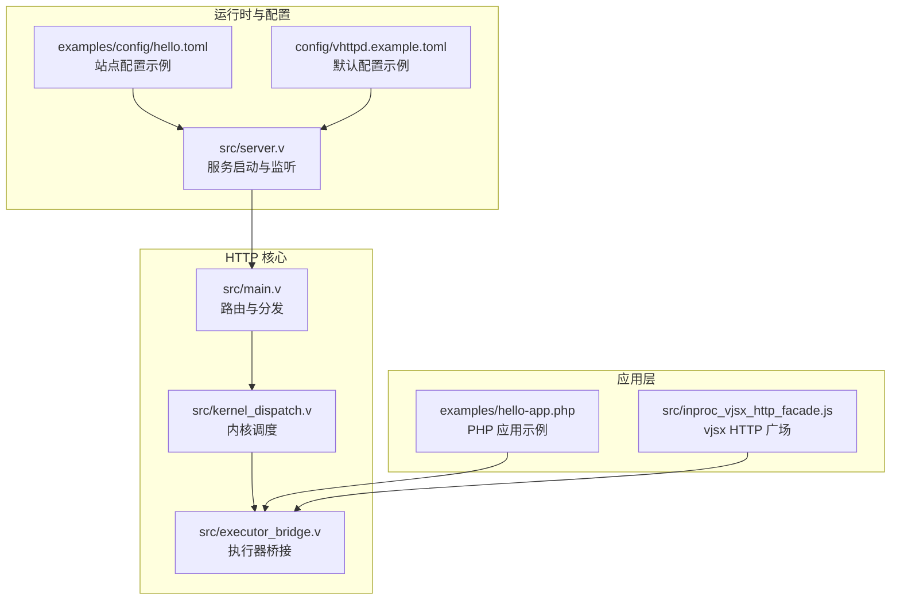
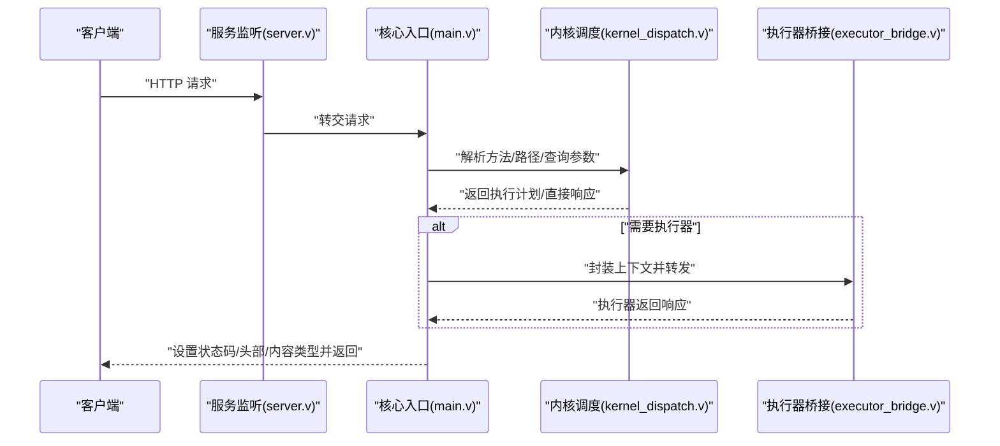
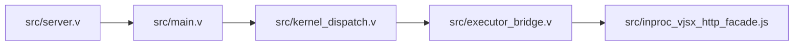
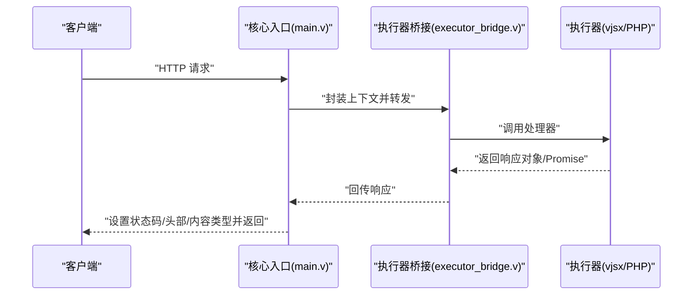

# HTTP API

<cite>
**本文引用的文件**
- [src/main.v](file://src/main.v)
- [src/server.v](file://src/server.v)
- [src/kernel_dispatch.v](file://src/kernel_dispatch.v)
- [src/executor_bridge.v](file://src/executor_bridge.v)
- [src/inproc_vjsx_http_facade.js](file://src/inproc_vjsx_http_facade.js)
- [config/vhttpd.example.toml](file://config/vhttpd.example.toml)
- [examples/config/hello.toml](file://examples/config/hello.toml)
- [examples/hello-app.php](file://examples/hello-app.php)
</cite>

## 目录
1. [简介](#简介)
2. [项目结构](#项目结构)
3. [核心组件](#核心组件)
4. [架构总览](#架构总览)
5. [详细组件分析](#详细组件分析)
6. [依赖关系分析](#依赖关系分析)
7. [性能考虑](#性能考虑)
8. [故障排查指南](#故障排查指南)
9. [结论](#结论)
10. [附录](#附录)

## 简介
本文件为 vhttpd 的 HTTP API 全面文档，覆盖请求处理流程（路由、参数解析、响应生成）、支持的 HTTP 方法与 URL 模式、内容类型、请求头与查询参数规范、响应状态码与错误格式、重定向规则、与执行器的交互机制与数据流转，并提供典型请求/响应示例与常见使用场景。

## 项目结构
vhttpd 的 HTTP 层由核心入口与路由分发、内核调度、执行器桥接以及内置的 vjsx HTTP 广场（facade）组成。配置通过 TOML 文件定义站点与应用映射；示例应用展示了 PHP 与 vjsx 的集成方式。

图表来源
- [src/main.v](file://src/main.v)
- [src/server.v](file://src/server.v)
- [src/kernel_dispatch.v](file://src/kernel_dispatch.v)
- [src/executor_bridge.v](file://src/executor_bridge.v)
- [src/inproc_vjsx_http_facade.js](file://src/inproc_vjsx_http_facade.js)
- [examples/config/hello.toml](file://examples/config/hello.toml)
- [config/vhttpd.example.toml](file://config/vhttpd.example.toml)
- [examples/hello-app.php](file://examples/hello-app.php)

章节来源
- [src/main.v](file://src/main.v)
- [src/server.v](file://src/server.v)
- [src/kernel_dispatch.v](file://src/kernel_dispatch.v)
- [src/executor_bridge.v](file://src/executor_bridge.v)
- [src/inproc_vjsx_http_facade.js](file://src/inproc_vjsx_http_facade.js)
- [examples/config/hello.toml](file://examples/config/hello.toml)
- [config/vhttpd.example.toml](file://config/vhttpd.example.toml)
- [examples/hello-app.php](file://examples/hello-app.php)

## 核心组件
- 路由与分发：在核心入口中实现基础路由与状态页逻辑，支持 GET /health、/users/{id} 等路径与方法约束，并返回标准化响应。
- 内核调度：负责将请求转换为可执行计划或直接生成响应，同时记录追踪 ID 与指标事件。
- 执行器桥接：连接 HTTP 层与执行器（如 PHP 或 vjsx），封装上下文、请求 ID、追踪 ID、自定义头部等。
- vjsx HTTP 广场：提供统一的响应构造器（ok/json/html/accepted/noContent/badRequest/notFound/problem 等）与错误包装机制，确保一致的错误输出与内容类型设置。
- 配置系统：通过 TOML 定义站点、应用与上游行为，示例配置展示如何将路径前缀映射到具体应用。

章节来源
- [src/main.v](file://src/main.v)
- [src/kernel_dispatch.v](file://src/kernel_dispatch.v)
- [src/executor_bridge.v](file://src/executor_bridge.v)
- [src/inproc_vjsx_http_facade.js](file://src/inproc_vjsx_http_facade.js)
- [examples/config/hello.toml](file://examples/config/hello.toml)
- [config/vhttpd.example.toml](file://config/vhttpd.example.toml)

## 架构总览
vhttpd 的 HTTP 请求从服务监听开始，进入核心入口进行路由与分发，随后通过内核调度决定是直接返回静态结果还是交由执行器处理。执行器通过桥接层与 HTTP 层交互，最终将响应写回客户端。

图表来源
- [src/server.v](file://src/server.v)
- [src/main.v](file://src/main.v)
- [src/kernel_dispatch.v](file://src/kernel_dispatch.v)
- [src/executor_bridge.v](file://src/executor_bridge.v)

## 详细组件分析

### 路由与分发（核心入口）
- 支持的路径与方法
  - /health：仅允许 GET，返回 200 OK 与纯文本。
  - /users/{id}：仅允许 GET，返回 200 与 JSON，其中 user 字段为路径中的 id。
  - /panic：返回 500 Internal Server Error。
  - 其他未匹配路径返回 404 Not Found。
- 查询参数
  - /dispatch 接口支持 method 与 path 查询参数，用于动态分发测试。
- 响应内容类型
  - 明确设置 content-type，如 text/plain; charset=utf-8、application/json; charset=utf-8。
- 头部与追踪
  - 在响应中设置 x-vhttpd-trace-id 头部，便于端到端追踪。
- 事件上报
  - 触发 http.request 事件，包含 method、path、status、request_id、duration_ms 等字段。

章节来源
- [src/main.v](file://src/main.v)

### 内核调度与执行器桥接
- 解析与规范化
  - 对请求路径进行规范化（补全前导斜杠、去除尾随斜杠）。
  - 将查询字符串解析为键值映射，仅保留首个值。
  - 合理过滤与应用自定义头部，避免覆盖关键头部。
- 执行计划
  - 当存在上游计划时，按计划执行并返回响应。
  - 否则直接返回响应对象（含状态码、头部、正文）。
- 追踪与指标
  - 记录 trace_id、request_id、耗时等信息，便于可观测性。

章节来源
- [src/kernel_dispatch.v](file://src/kernel_dispatch.v)
- [src/main.v](file://src/main.v)

### vjsx HTTP 广场（响应构造与错误包装）
- 响应构造器
  - ok(value)/json(value,status)/html(body,status)/send(body,status)
  - created(value)/accepted(value)/noContent()
  - badRequest(value)/unprocessableEntity(value)/notFound(value)
  - problem(status,title,detail,extra)：生成符合 Problem+JSON 的错误载荷
- 错误包装
  - 统一捕获同步与异步错误，渲染堆栈或消息，必要时附加 JSON 字符串化错误对象，保证日志与错误输出一致。
- 上下文与能力
  - 提供运行时上下文（provider、executor、laneId、requestId、traceId、dispatchKind、method、path 等）。
  - 提供文件读取、配置读取、HTTP 发起、桥接分发、WebSocket 分发等能力占位（返回回退值）。

章节来源
- [src/inproc_vjsx_http_facade.js](file://src/inproc_vjsx_http_facade.js)

### 配置与站点映射
- 默认配置示例
  - vhttpd.example.toml 展示了基本的监听地址、TLS、站点与应用映射等。
- 示例站点配置
  - hello.toml 展示了如何将特定路径前缀映射到 PHP 或 vjsx 应用。
- 应用示例
  - hello-app.php 展示了 PHP 应用的基本结构与入口。

章节来源
- [config/vhttpd.example.toml](file://config/vhttpd.example.toml)
- [examples/config/hello.toml](file://examples/config/hello.toml)
- [examples/hello-app.php](file://examples/hello-app.php)

## 依赖关系分析
- 服务监听依赖核心入口进行请求转交。
- 核心入口依赖内核调度以决定执行路径。
- 内核调度与执行器桥接共同完成执行器交互。
- vjsx HTTP 广场作为执行器侧的响应构造与错误包装工具被桥接层使用。

图表来源
- [src/server.v](file://src/server.v)
- [src/main.v](file://src/main.v)
- [src/kernel_dispatch.v](file://src/kernel_dispatch.v)
- [src/executor_bridge.v](file://src/executor_bridge.v)
- [src/inproc_vjsx_http_facade.js](file://src/inproc_vjsx_http_facade.js)

## 性能考虑
- 路由与分发采用简单前缀匹配与方法约束，适合轻量级路由需求。
- 对于高并发场景，建议结合上游代理（如反向代理）与合适的执行器池化策略。
- 使用 HEAD 方法时，响应体为空，有助于减少带宽占用。
- 通过 x-vhttpd-trace-id 与 http.request 事件，便于端到端性能观测与瓶颈定位。

## 故障排查指南
- 常见状态码
  - 200：成功（如 /health、/users/{id}）。
  - 404：未找到路径。
  - 405：方法不允许（如 /health 不允许除 GET 外的方法）。
  - 500：内部错误（如 /panic）。
- 错误格式
  - 使用 problem(status,title,detail,extra) 生成标准错误载荷，包含 status 与 title 字段。
  - 异步错误会被统一包装，必要时输出堆栈或消息。
- 重定向规则
  - 代码中未实现显式的 HTTP 重定向逻辑；若需重定向，请在执行器侧返回 3xx 状态码与 Location 头。
- 日志与追踪
  - 关注服务日志中的请求与响应信息，结合 x-vhttpd-trace-id 与 http.request 事件进行问题定位。

章节来源
- [src/main.v](file://src/main.v)
- [src/inproc_vjsx_http_facade.js](file://src/inproc_vjsx_http_facade.js)

## 结论
vhttpd 的 HTTP API 提供了简洁而清晰的路由与分发机制，配合内核调度与执行器桥接，能够快速集成 PHP 与 vjsx 应用。通过统一的响应构造器与错误包装，确保了响应一致性与可观测性。对于更复杂的路由与中间件需求，可在执行器侧扩展或结合上游代理实现。

## 附录

### API 参考

- 健康检查
  - 方法：GET
  - 路径：/health
  - 成功响应：200 OK，正文为纯文本“OK”
  - 其他响应：405 Method Not Allowed（非 GET）

- 用户详情
  - 方法：GET
  - 路径：/users/{id}
  - 成功响应：200 OK，正文为 JSON，包含 user 字段为 {id}
  - 其他响应：405 Method Not Allowed（非 GET）

- 动态分发（调试）
  - 方法：GET
  - 路径：/dispatch
  - 查询参数：
    - method：HTTP 方法，默认 GET
    - path：请求路径，默认 /health
  - 成功响应：根据目标路径与方法返回对应结果
  - 其他响应：404/405/500 等

- 通用错误
  - 方法：任意
  - 路径：任意未匹配路径
  - 响应：404 Not Found

- 特殊路径
  - 路径：/panic
  - 响应：500 Internal Server Error

章节来源
- [src/main.v](file://src/main.v)

### 请求与响应规范

- 请求头
  - Host：用于识别主机与端口（若缺失，将从 Host 头提取）。
  - 其他：自定义头部将透传（除 content-type、content-length、server、x-request-id 等关键头部外）。

- 查询参数
  - /dispatch 支持 method 与 path。
  - 其他路径的查询参数将被解析为键值映射（仅取首个值）。

- 请求体
  - 本仓库未实现对请求体的解析与处理，如需，请在执行器侧自行解析。

- 响应头
  - content-type：由响应构造器或执行器设置。
  - x-vhttpd-trace-id：始终设置，便于追踪。
  - 自定义头部：除关键头部外，其余头部将透传。

- 响应体
  - 文本：text/plain; charset=utf-8
  - JSON：application/json; charset=utf-8
  - HTML：text/html; charset=utf-8

章节来源
- [src/main.v](file://src/main.v)
- [src/inproc_vjsx_http_facade.js](file://src/inproc_vjsx_http_facade.js)

### 与执行器的交互机制

图表来源
- [src/main.v](file://src/main.v)
- [src/executor_bridge.v](file://src/executor_bridge.v)

### 实际使用场景与示例

- 场景一：健康检查
  - 请求：GET /health
  - 响应：200 OK，正文为“OK”，content-type 为 text/plain

- 场景二：用户详情
  - 请求：GET /users/123
  - 响应：200 OK，正文为 {"user":"123"}，content-type 为 application/json

- 场景三：动态分发
  - 请求：GET /dispatch?method=GET&path=/health
  - 响应：200 OK，正文为“OK”，content-type 为 text/plain

- 场景四：错误处理
  - 请求：GET /unknown
  - 响应：404 Not Found，正文为“Not Found”，content-type 为 text/plain

- 场景五：vjsx 响应构造
  - 在 vjsx 处理器中使用 ok/json/html/accepted/noContent/badRequest/notFound/problem 等方法构造响应，自动设置 content-type 与状态码。

章节来源
- [src/main.v](file://src/main.v)
- [src/inproc_vjsx_http_facade.js](file://src/inproc_vjsx_http_facade.js)