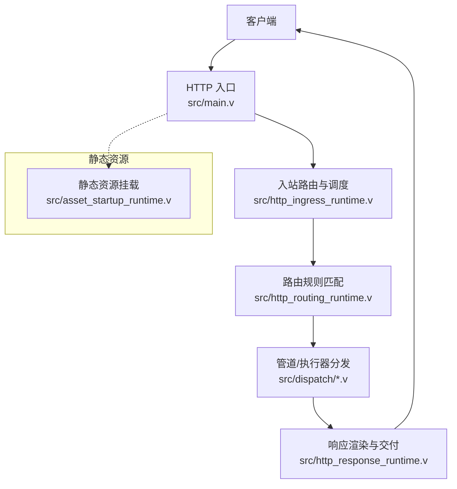
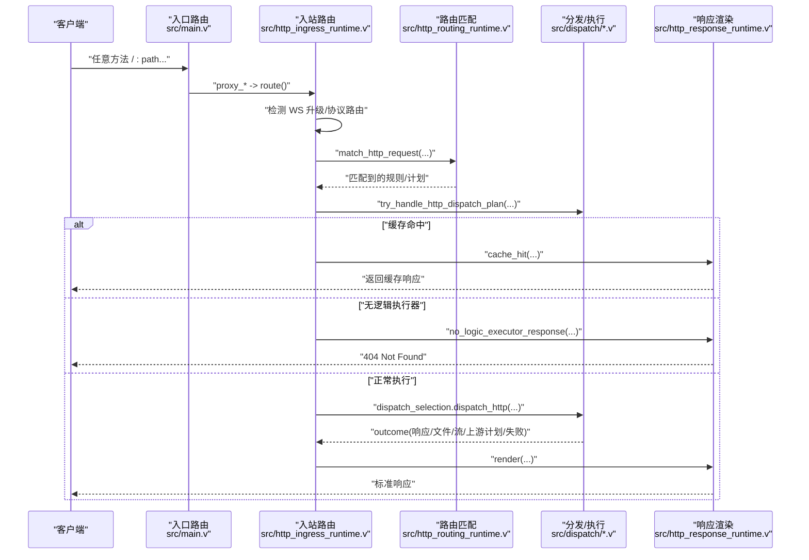
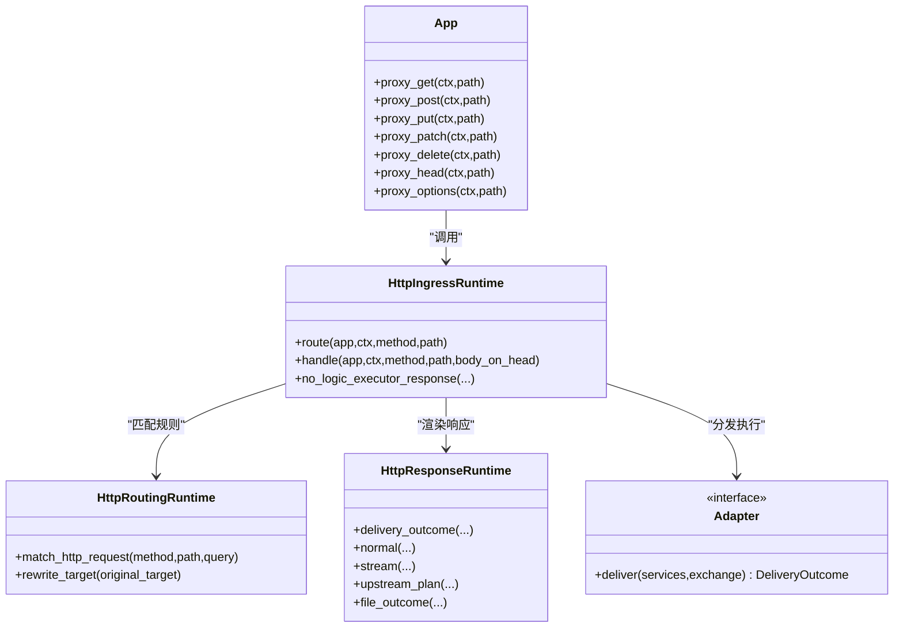

# HTTP REST API

<cite>
**本文引用的文件**   
- [src/main.v](file://src/main.v)
- [src/http_ingress_runtime.v](file://src/http_ingress_runtime.v)
- [src/http_response_runtime.v](file://src/http_response_runtime.v)
- [src/http_routing_runtime.v](file://src/http_routing_runtime.v)
- [src/protocol_http_request.v](file://src/protocol_http_request.v)
- [src/dispatch/adapter.v](file://src/dispatch/adapter.v)
- [src/dispatch/pipeline.v](file://src/dispatch/pipeline.v)
- [src/admin_runtime.v](file://src/admin_runtime.v)
- [src/asset_startup_runtime.v](file://src/asset_startup_runtime.v)
- [config/vhttpd.example.toml](file://config/vhttpd.example.toml)
- [README.md](file://README.md)
</cite>

## 目录
1. [简介](#简介)
2. [项目结构](#项目结构)
3. [核心组件](#核心组件)
4. [架构总览](#架构总览)
5. [详细组件分析](#详细组件分析)
6. [依赖关系分析](#依赖关系分析)
7. [性能与缓存策略](#性能与缓存策略)
8. [安全与响应头配置](#安全与响应头配置)
9. [客户端集成示例与调试方法](#客户端集成示例与调试方法)
10. [故障排查指南](#故障排查指南)
11. [结论](#结论)

## 简介
本文件为 vhttpd 的 HTTP REST API 文档，覆盖以下范围：
- 数据面通用路由与请求处理流程（GET/POST/PUT/PATCH/DELETE/HEAD/OPTIONS）
- 管理面公开端点清单、参数与返回结构
- 静态资源服务与缓存策略
- 安全相关响应头建议与注入机制
- 错误码与错误分类、诊断信息
- 客户端集成要点与调试方法

vhttpd 的数据面采用“通配路由 + 运行时计划匹配”的方式：所有路径由统一入口接收，随后根据编译后的运行期计划进行匹配、执行与渲染。管理面提供一组 JSON API，用于查看运行时状态、事件、工作进程、WebSocket/MCP 会话等。

## 项目结构
从 HTTP 请求到响应的关键代码位置如下：
- 入口与通配路由：src/main.v
- 入站路由与调度：src/http_ingress_runtime.v
- 路由规则与匹配：src/http_routing_runtime.v
- 响应渲染与交付：src/http_response_runtime.v
- 协议请求封装：src/protocol_http_request.v
- 分发结果类型与适配器契约：src/dispatch/adapter.v, src/dispatch/pipeline.v
- 管理面 API：src/admin_runtime.v
- 静态资源挂载与中间件：src/asset_startup_runtime.v
- 示例配置：config/vhttpd.example.toml

图表来源
- [src/main.v:83-116](file://src/main.v#L83-L116)
- [src/http_ingress_runtime.v:31-139](file://src/http_ingress_runtime.v#L31-L139)
- [src/http_routing_runtime.v:103-245](file://src/http_routing_runtime.v#L103-L245)
- [src/dispatch/adapter.v:17-127](file://src/dispatch/adapter.v#L17-L127)
- [src/http_response_runtime.v:54-129](file://src/http_response_runtime.v#L54-L129)
- [src/asset_startup_runtime.v:7-32](file://src/asset_startup_runtime.v#L7-L32)

章节来源
- [src/main.v:83-116](file://src/main.v#L83-L116)
- [src/http_ingress_runtime.v:31-139](file://src/http_ingress_runtime.v#L31-L139)
- [src/http_routing_runtime.v:103-245](file://src/http_routing_runtime.v#L103-L245)
- [src/dispatch/adapter.v:17-127](file://src/dispatch/adapter.v#L17-L127)
- [src/http_response_runtime.v:54-129](file://src/http_response_runtime.v#L54-L129)
- [src/asset_startup_runtime.v:7-32](file://src/asset_startup_runtime.v#L7-L32)

## 核心组件
- 入口与通配路由：将所有 HTTP 方法映射到统一处理器，并转发至入站路由模块。
- 入站路由：解析目标、识别 WebSocket 升级、尝试协议层路由、构造标准化请求、调用管道匹配与执行。
- 路由规则：支持方法、主机、路径（含正则）、请求头、查询参数等多维匹配；支持重写、静态根、缓存控制、必需头、拒绝查询参数等。
- 响应渲染：统一设置追踪 ID、管线 ID、错误分类、内容类型、缓存头、路由级响应头等，并输出文本或文件。
- 分发结果：定义 response/file/stream_plan/session_plan/relay_delivery/failure 等结果类型，贯穿渲染与交付。
- 管理面 API：提供运行时快照、事件、工作进程、WebSocket/MCP 等查询与控制接口。
- 静态资源：可选挂载静态目录，并为指定前缀自动注入 Cache-Control。

章节来源
- [src/main.v:83-116](file://src/main.v#L83-L116)
- [src/http_ingress_runtime.v:31-139](file://src/http_ingress_runtime.v#L31-L139)
- [src/http_routing_runtime.v:12-51](file://src/http_routing_runtime.v#L12-L51)
- [src/http_routing_runtime.v:181-245](file://src/http_routing_runtime.v#L181-L245)
- [src/http_response_runtime.v:54-129](file://src/http_response_runtime.v#L54-L129)
- [src/dispatch/adapter.v:17-127](file://src/dispatch/adapter.v#L17-L127)
- [src/admin_runtime.v:7-673](file://src/admin_runtime.v#L7-L673)
- [src/asset_startup_runtime.v:7-32](file://src/asset_startup_runtime.v#L7-L32)

## 架构总览
下图展示一次典型 HTTP 请求在 vhttpd 中的流转过程，包括路由匹配、管道执行、缓存命中、流式/上游计划、以及最终响应渲染。

图表来源
- [src/main.v:83-116](file://src/main.v#L83-L116)
- [src/http_ingress_runtime.v:31-139](file://src/http_ingress_runtime.v#L31-L139)
- [src/http_routing_runtime.v:103-245](file://src/http_routing_runtime.v#L103-L245)
- [src/dispatch/adapter.v:17-127](file://src/dispatch/adapter.v#L17-L127)
- [src/http_response_runtime.v:54-129](file://src/http_response_runtime.v#L54-L129)

## 详细组件分析

### 数据面通用路由与请求处理
- 支持的 HTTP 方法与 URL 模式
  - 方法：GET、POST、PUT、PATCH、DELETE、HEAD、OPTIONS
  - URL 模式：/:path...（通配所有路径）
- 请求处理要点
  - 统一入口将请求转交给 HttpIngressRuntime.route
  - 若检测到 WebSocket 升级，则走 WS 代理流程
  - 否则进入 HTTP 管道匹配与执行
  - 对 GET/HEAD 且存在目录时，可能触发 301 重定向到带尾斜杠的路径
  - 支持按规则启用边缘响应缓存（仅 GET/HEAD，且满足条件）
  - 若无逻辑执行器，返回 404
  - 通过引擎选择后派发至具体执行器（如 PHP、VJSX 等），再渲染响应

章节来源
- [src/main.v:83-116](file://src/main.v#L83-L116)
- [src/http_ingress_runtime.v:31-139](file://src/http_ingress_runtime.v#L31-L139)
- [src/http_routing_runtime.v:305-318](file://src/http_routing_runtime.v#L305-L318)
- [src/http_routing_runtime.v:399-412](file://src/http_routing_runtime.v#L399-L412)

### 路由匹配规则
- 匹配维度
  - 方法：method 列表匹配，支持 * 通配
  - 主机：host 列表匹配（大小写不敏感）
  - 路径：精确、前缀*、后缀* 或正则表达式
  - 请求头：键值匹配，支持 * 通配
  - 查询参数：键值匹配，支持 * 通配
- 行为特性
  - 支持 rewrite 与 rewrite_strip_prefix，保留原始 query
  - 可配置 required_headers 与 denied_query_patterns
  - 可配置 root（静态根）、response_headers、cache_control、response_cache_ttl_ms 等

章节来源
- [src/http_routing_runtime.v:181-245](file://src/http_routing_runtime.v#L181-L245)
- [src/http_routing_runtime.v:277-303](file://src/http_routing_runtime.v#L277-L303)
- [src/http_routing_runtime.v:464-482](file://src/http_routing_runtime.v#L464-L482)

### 请求与响应模型
- 协议请求封装
  - 包含 method、target、normalized_target、query、headers、body、request_id、trace_id、start_ms
- 分发结果类型
  - response：普通响应
  - file：静态文件
  - accepted_event：异步接受（202）
  - stream_plan：流式计划
  - session_plan：会话计划
  - relay_delivery：中继投递
  - failure：失败（携带 error_class）

章节来源
- [src/protocol_http_request.v:6-31](file://src/protocol_http_request.v#L6-L31)
- [src/dispatch/adapter.v:17-127](file://src/dispatch/adapter.v#L17-L127)

### 响应渲染与头部注入
- 通用响应头
  - x-vhttpd-trace-id：追踪 ID
  - x-vhttpd-pipeline：匹配的管线 ID
  - x-vhttpd-error-class：错误分类（失败时）
  - cache-control：来自规则或缓存命中
  - content-type：默认 text/plain; charset=utf-8，可由 outcome.headers 覆盖
- HEAD 与 204/304 特殊处理：不发送 body
- 文件响应：直接输出文件，并应用路由级响应头
- 事件上报：记录 method、path、status、duration_ms、pipeline、ingress、policies、error_class、error 等字段

章节来源
- [src/http_response_runtime.v:54-129](file://src/http_response_runtime.v#L54-L129)
- [src/http_response_runtime.v:228-264](file://src/http_response_runtime.v#L228-L264)
- [src/http_response_runtime.v:340-368](file://src/http_response_runtime.v#L340-L368)

### 管理面 API 清单
以下为管理面公开端点（通常监听独立的管理端口，需鉴权）。所有返回均为 JSON，Content-Type 为 application/json; charset=utf-8。

- 健康检查
  - GET /health
    - 说明：数据面存活检查
    - 状态码：200 OK
- 运行时概览
  - GET /admin/runtime
    - 说明：运行时能力与连接/会话计数
    - 状态码：200 OK
- 运行时计划
  - GET /admin/runtime/plan
    - 说明：当前运行期计划 JSON
    - 状态码：200 OK
- 事件日志
  - GET /admin/events?limit=1..1000
    - 说明：事件列表
    - 状态码：200 OK
- 运行时图
  - GET /admin/runtime/graph
    - 说明：运行时拓扑图
    - 状态码：200 OK
- Schema 目录与详情
  - GET /admin/schema
    - 说明：Schema 目录
    - 状态码：200 OK
  - GET /admin/schema/:domain
    - 说明：域 Schema
    - 状态码：200 OK / 404
  - GET /admin/schema/:domain/:kind
    - 说明：域内类型 Schema
    - 状态码：200 OK / 404
- 草稿管理
  - GET /admin/drafts
    - 说明：列出草稿
    - 状态码：200 OK
  - POST /admin/config/files/draft?path=...
    - 说明：打开配置文件草稿
    - 状态码：200 OK / 422
  - POST /admin/drafts?id=...
    - 说明：保存草稿
    - 状态码：200 OK / 400
  - GET /admin/drafts/:id
    - 说明：获取草稿
    - 状态码：200 OK / 404
  - PUT /admin/drafts/:id
    - 说明：更新草稿
    - 状态码：200 OK / 400
  - DELETE /admin/drafts/:id
    - 说明：删除草稿
    - 状态码：200 OK / 400
  - POST /admin/drafts/:id/validate
    - 说明：校验草稿
    - 状态码：200 OK / 422
  - GET /admin/drafts/:id/diff
    - 说明：预览差异
    - 状态码：200 OK / 422
  - POST /admin/drafts/:id/publish?path=...
    - 说明：发布草稿
    - 状态码：200 OK / 422
- 运行时计划替换
  - GET /admin/runtime/plan/replacement?config=...
    - 说明：预览替换
    - 状态码：200 OK / 400
  - GET /admin/runtime/plan/replacement/state
    - 说明：替换状态
    - 状态码：200 OK
  - POST /admin/runtime/plan/replacement/apply?config=...
    - 说明：应用替换
    - 状态码：200 OK / 400
  - POST /admin/runtime/plan/replacement/finalize
    - 说明：确认完成
    - 状态码：200 OK
  - POST /admin/runtime/plan/replacement/cancel
    - 说明：取消替换
    - 状态码：200 OK
- 转换器
  - GET /admin/runtime/transformers
    - 说明：转换器快照
    - 状态码：200 OK
- 上游会话
  - GET /admin/runtime/upstreams?details=0|1&limit=&offset=&role=&provider=
    - 说明：活跃上游会话
    - 状态码：200 OK
- WebSocket 会话
  - GET /admin/runtime/websockets?details=0|1&limit=&offset=&room=&conn_id=
    - 说明：活跃 WebSocket 连接与房间快照
    - 状态码：200 OK
- MCP 会话
  - GET /admin/runtime/mcp?details=0|1&limit=&offset=&session_id=&protocol_version=
    - 说明：活跃 MCP 会话快照
    - 状态码：200 OK
- Provider 实例
  - GET /admin/runtime/provider-instances?provider=
    - 说明：Provider 实例列表
    - 状态码：200 OK
  - POST /admin/runtime/provider-instances
    - 说明：新增/更新 Provider 实例（JSON Body）
    - 状态码：200 OK / 400 / 422
- 运行时事件投递
  - POST /admin/runtime/events
    - 说明：投递运行时事件
    - 状态码：202 Accepted
- 特定 Provider 运行时
  - GET /admin/runtime/codex
  - GET /admin/runtime/feishu
  - GET /admin/runtime/db
  - GET /admin/runtime/cache
    - 说明：对应 Provider 运行时快照
    - 状态码：200 OK

注意：
- 部分端点需要管理员令牌鉴权（例如前端 UI 使用 x-vhttpd-admin-token 请求头）
- 分页参数 limit/offset 有上限约束（例如 events 默认 100，最大 1000）

章节来源
- [README.md:1147-1185](file://README.md#L1147-L1185)
- [src/admin_runtime.v:7-673](file://src/admin_runtime.v#L7-L673)
- [admin/ui/app.js:1-41](file://admin/ui/app.js#L1-L41)

### 静态文件服务与缓存
- 静态资源挂载
  - 可通过配置启用 assets，并在启动时挂载到指定前缀（如 /assets）
  - 支持为静态前缀统一注入 Cache-Control
- 路由级静态根
  - 规则可配置 root 作为静态根，优先于全局 assets_root/worker_root
- 目录重定向
  - 对 GET/HEAD 访问不带尾斜杠的目录路径，返回 301 重定向到带尾斜杠路径

章节来源
- [src/asset_startup_runtime.v:7-32](file://src/asset_startup_runtime.v#L7-L32)
- [src/http_routing_runtime.v:124-132](file://src/http_routing_runtime.v#L124-L132)
- [src/http_routing_runtime.v:305-318](file://src/http_routing_runtime.v#L305-L318)
- [config/vhttpd.example.toml:43-48](file://config/vhttpd.example.toml#L43-L48)

### 错误处理与状态码
- 常见状态码
  - 200：成功
  - 202：已接受（异步事件投递）
  - 301：目录重定向
  - 400：请求参数/格式错误
  - 404：未找到（无匹配规则或无逻辑执行器）
  - 422：校验失败（如草稿校验、发布预览不允许）
  - 500：内部错误（如中继跟踪失败）
  - 501：功能不支持（如中继完成策略不支持）
  - 503：不可用（如中继载体不可用）
- 错误分类
  - 通过 transport.classify_worker_backend_error 将后端错误归类，并在响应头中附带 x-vhttpd-error-class
- 失败结果
  - delivery_failure_outcome 携带 status、error、error_class

章节来源
- [src/http_response_runtime.v:48-52](file://src/http_response_runtime.v#L48-L52)
- [src/dispatch/adapter.v:120-127](file://src/dispatch/adapter.v#L120-L127)
- [src/http_response_runtime.v:150-179](file://src/http_response_runtime.v#L150-L179)

## 依赖关系分析
- 入口与入站路由
  - main.v 将各 HTTP 方法统一转发到 http_ingress_runtime.v 的 route 函数
- 路由匹配与规则
  - http_routing_runtime.v 提供规则结构与匹配逻辑，供入站路由调用
- 分发与结果
  - dispatch/adapter.v 定义 DeliveryOutcome 及各类结果构造器
  - dispatch/pipeline.v 定义管道描述与能力校验
- 响应渲染
  - http_response_runtime.v 负责统一设置响应头、缓存、文件输出、流式与上游计划处理

图表来源
- [src/main.v:83-116](file://src/main.v#L83-L116)
- [src/http_ingress_runtime.v:31-139](file://src/http_ingress_runtime.v#L31-L139)
- [src/http_routing_runtime.v:103-245](file://src/http_routing_runtime.v#L103-L245)
- [src/http_response_runtime.v:54-129](file://src/http_response_runtime.v#L54-L129)
- [src/dispatch/adapter.v:129-137](file://src/dispatch/adapter.v#L129-L137)

## 性能与缓存策略
- 边缘响应缓存
  - 仅对 GET/HEAD 生效
  - 当请求携带 Authorization 或 Cookie（且未被忽略）时，会旁路缓存
  - 当响应包含 Set-Cookie 或 Cache-Control 指令 no-store/no-cache/private/max-age=0/s-maxage=0 时，不会写入缓存
  - 命中时返回 x-vhttpd-cache=hit，未命中时可能返回 x-vhttpd-cache-reason 原因
- 静态资源缓存
  - 可在 assets 配置中设置统一的 Cache-Control，并通过中间件为静态前缀注入
- 目录重定向
  - 对目录路径缺少尾斜杠的请求返回 301，减少后续重复请求

章节来源
- [src/http_routing_runtime.v:399-443](file://src/http_routing_runtime.v#L399-L443)
- [src/http_response_runtime.v:33-46](file://src/http_response_runtime.v#L33-L46)
- [src/asset_startup_runtime.v:15-32](file://src/asset_startup_runtime.v#L15-L32)
- [src/http_routing_runtime.v:305-318](file://src/http_routing_runtime.v#L305-L318)

## 安全与响应头配置
- 内置响应头
  - x-vhttpd-trace-id：追踪 ID
  - x-vhttpd-pipeline：管线 ID
  - x-vhttpd-error-class：错误分类
  - x-vhttpd-cache/x-vhttpd-cache-reason：缓存命中与原因
- 路由级响应头
  - 可通过规则的 response_headers 注入自定义响应头
- 安全头建议
  - 建议在配置中添加 Content-Security-Policy、X-Frame-Options、X-Content-Type-Options、Referrer-Policy、Permissions-Policy 等以加固站点安全
- CORS
  - 未在源码中发现显式的 CORS 中间件实现；如需跨域，请在反向代理层或通过路由级响应头添加相应 CORS 头

章节来源
- [src/http_response_runtime.v:104-114](file://src/http_response_runtime.v#L104-L114)
- [src/http_routing_runtime.v:455-462](file://src/http_routing_runtime.v#L455-L462)
- [php/package/src/VHttpd/WordPress/Profiler.php:1176-1197](file://php/package/src/VHttpd/WordPress/Profiler.php#L1176-L1197)

## 客户端集成示例与调试方法
- 基本请求
  - 使用任意 HTTP 客户端向数据面地址发起请求，路径遵循 /:path... 通配
  - 对于 GET/HEAD，可利用边缘缓存提升性能
- 鉴权与管理面
  - 管理面端点通常需要 x-vhttpd-admin-token 请求头
  - 参考 admin UI 的 authHeaders 实现
- 调试
  - 关注响应头 x-vhttpd-trace-id、x-vhttpd-pipeline、x-vhttpd-error-class、x-vhttpd-cache、x-vhttpd-cache-reason
  - 使用 /admin/events 查看最近事件，结合 trace_id 定位问题
  - 使用 /admin/runtime/* 系列端点观察运行时状态

章节来源
- [admin/ui/app.js:33-41](file://admin/ui/app.js#L33-L41)
- [src/http_response_runtime.v:104-114](file://src/http_response_runtime.v#L104-L114)
- [README.md:1147-1185](file://README.md#L1147-L1185)

## 故障排查指南
- 常见问题
  - 404：未匹配到规则或无逻辑执行器
  - 503：中继载体不可用
  - 501：中继完成策略不支持
  - 500：中继跟踪失败或其他内部错误
- 定位步骤
  - 检查响应头 x-vhttpd-error-class 与 x-vhttpd-trace-id
  - 查看 /admin/events 中对应 trace_id 的事件
  - 使用 /admin/runtime/* 查看相关子系统状态（WebSocket/MCP/Upstreams）
  - 若涉及静态资源，确认 assets 挂载与 Cache-Control 配置

章节来源
- [src/http_response_runtime.v:48-52](file://src/http_response_runtime.v#L48-L52)
- [src/http_response_runtime.v:150-179](file://src/http_response_runtime.v#L150-L179)
- [src/admin_runtime.v:37-58](file://src/admin_runtime.v#L37-L58)

## 结论
vhttpd 的 HTTP REST API 基于“通配入口 + 运行时计划匹配”的架构，具备灵活的路由匹配、丰富的响应渲染能力与完善的诊断信息。通过边缘缓存、静态资源服务与安全头注入，能够在保证性能的同时提升安全性与可观测性。管理面 API 提供了全面的运行时可视性与可控性，便于运维与排障。