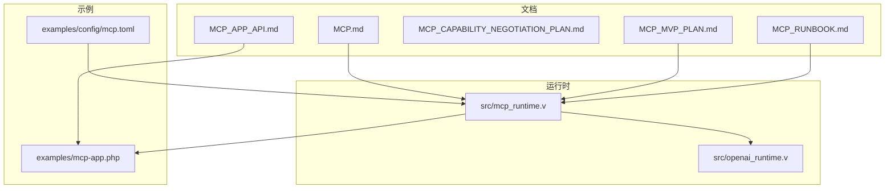
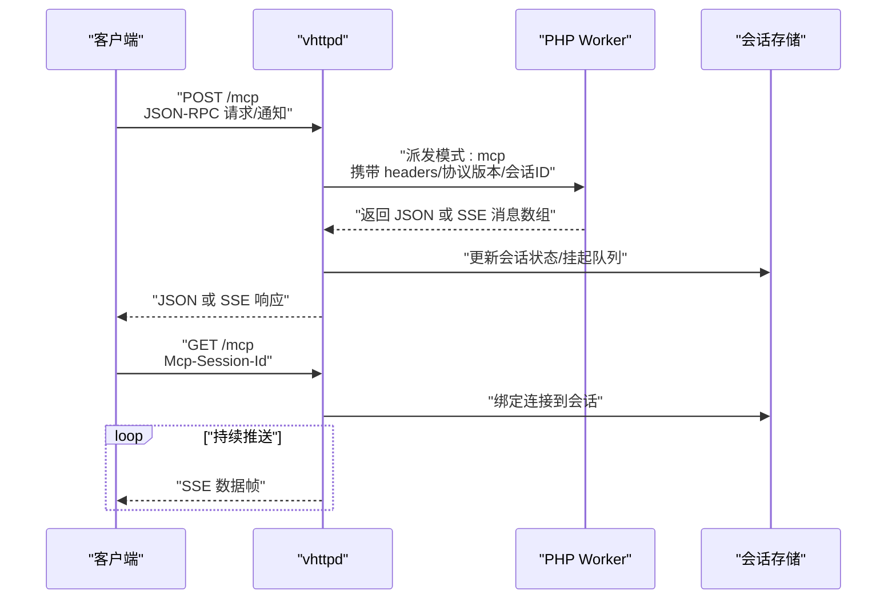
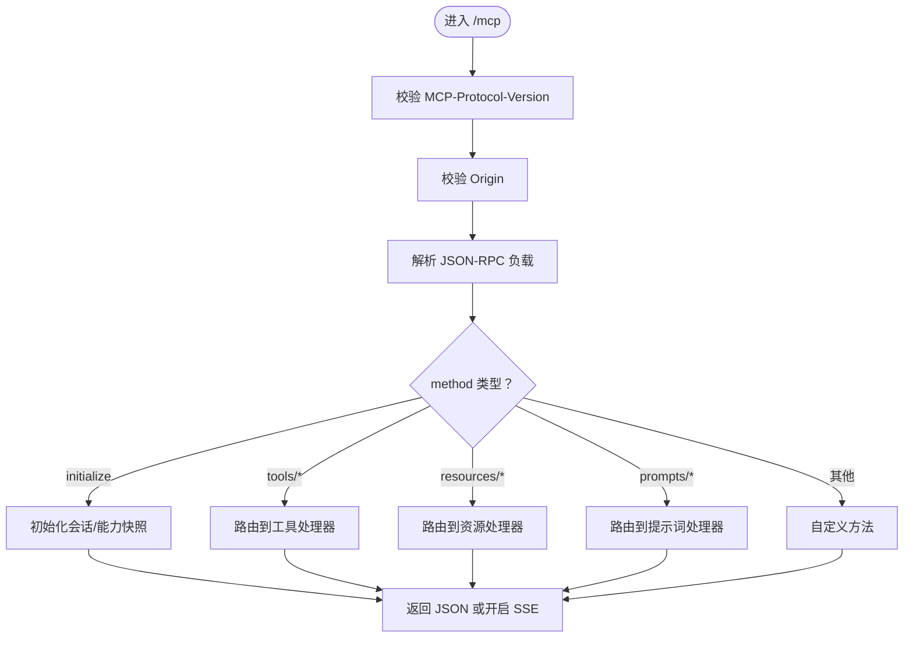
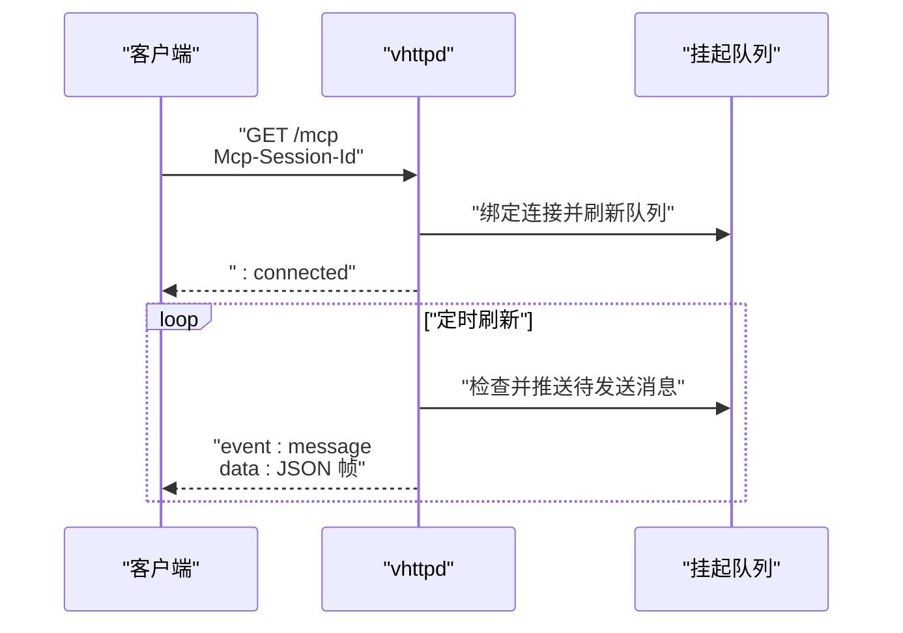
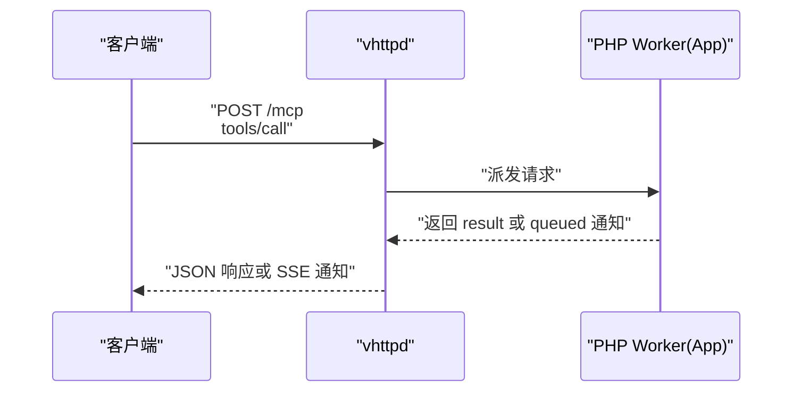
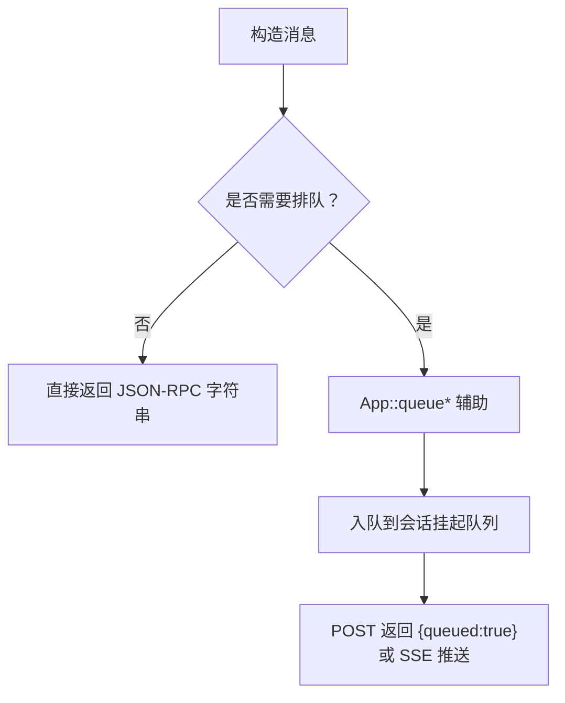
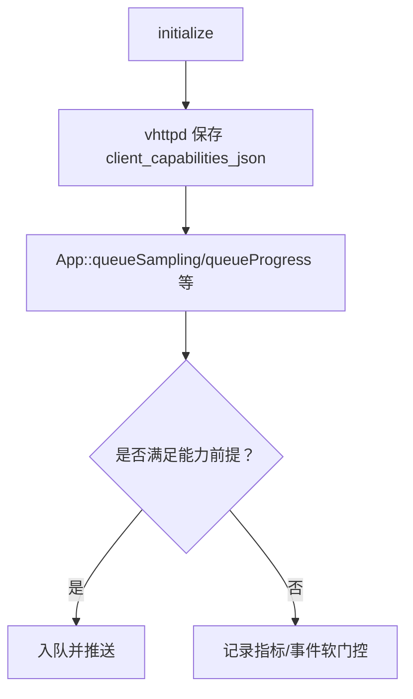
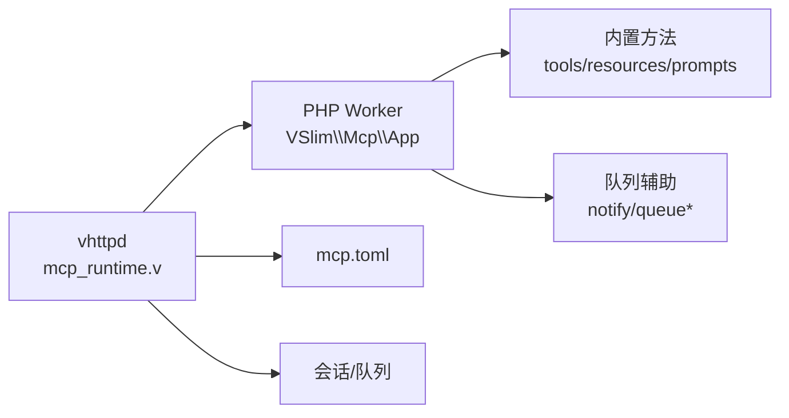

# MCP API

<cite>
**本文引用的文件**
- [MCP.md](file://docs/MCP.md)
- [MCP_APP_API.md](file://docs/MCP_APP_API.md)
- [MCP_CAPABILITY_NEGOTIATION_PLAN.md](file://docs/MCP_CAPABILITY_NEGOTIATION_PLAN.md)
- [MCP_MVP_PLAN.md](file://docs/MCP_MVP_PLAN.md)
- [MCP_RUNBOOK.md](file://docs/MCP_RUNBOOK.md)
- [mcp-app.php](file://examples/mcp-app.php)
- [mcp.toml](file://examples/config/mcp.toml)
- [mcp-runtime.v](file://src/mcp_runtime.v)
- [openai_runtime.v](file://src/openai_runtime.v)
</cite>

## 目录
1. [简介](#简介)
2. [项目结构](#项目结构)
3. [核心组件](#核心组件)
4. [架构总览](#架构总览)
5. [详细组件分析](#详细组件分析)
6. [依赖分析](#依赖分析)
7. [性能考量](#性能考量)
8. [故障排查指南](#故障排查指南)
9. [结论](#结论)
10. [附录](#附录)

## 简介
本文件面向 vhttpd 的 MCP（Model Context Protocol）API，系统化阐述其基于 Streamable HTTP 的 JSON-RPC 规范与运行时实现，涵盖通知、请求与响应格式、工具调用机制、能力协商与权限管理、服务器发现与认证配置、工具注册与调用、状态查询、错误处理与重试、超时管理，以及与 OpenAI API 的集成关系与兼容性考虑。文档同时提供客户端集成步骤与调试指南。

## 项目结构
- 文档层：MCP 总览、应用 API、能力协商计划、MVP 规划、运行手册等，构成规范与实施的权威参考。
- 示例层：PHP 用户态示例与配置，展示工具、资源、提示词注册与调试方法。
- 运行时层：vhttpd 的 MCP 运行时实现，负责传输、会话、SSE 流、队列与可观测性。

**图示来源**
- [MCP.md:1-185](file://docs/MCP.md#L1-L185)
- [MCP_APP_API.md:1-306](file://docs/MCP_APP_API.md#L1-L306)
- [MCP_MVP_PLAN.md:1-487](file://docs/MCP_MVP_PLAN.md#L1-L487)
- [MCP_RUNBOOK.md:1-291](file://docs/MCP_RUNBOOK.md#L1-L291)
- [mcp-app.php:1-140](file://examples/mcp-app.php#L1-L140)
- [mcp.toml:1-39](file://examples/config/mcp.toml#L1-L39)
- [mcp-runtime.v:394-827](file://src/mcp_runtime.v#L394-L827)
- [openai_runtime.v](file://src/openai_runtime.v)

**章节来源**
- [MCP.md:1-185](file://docs/MCP.md#L1-L185)
- [MCP_MVP_PLAN.md:1-487](file://docs/MCP_MVP_PLAN.md#L1-L487)
- [MCP_RUNBOOK.md:1-291](file://docs/MCP_RUNBOOK.md#L1-L291)

## 核心组件
- vhttpd MCP 运行时：负责 HTTP/SSE 传输、会话生命周期、版本与来源校验、删除会话、队列与可观测性。
- PHP 用户态 VSlim\Mcp\App：提供工具、资源、提示词注册与内置方法，以及通知、请求、采样等队列辅助。
- 配置与示例：通过 mcp.toml 控制会话上限、挂起消息数、TTL、允许的 Origin 与采样策略。

关键要点
- 仅实现 Streamable HTTP，不包含 stdio。
- 采样（sampling）作为请求转发而非本地推理。
- 会话状态与队列存储在 vhttpd，不在 PHP worker 内存中。

**章节来源**
- [MCP.md:12-120](file://docs/MCP.md#L12-L120)
- [MCP_MVP_PLAN.md:169-233](file://docs/MCP_MVP_PLAN.md#L169-L233)
- [mcp-runtime.v:116-210](file://src/mcp_runtime.v#L116-L210)
- [mcp-runtime.v:394-430](file://src/mcp_runtime.v#L394-L430)

## 架构总览
MCP 在 vhttpd 中采用“传输/会话归属 vhttpd，业务语义归属 PHP worker”的分层设计。JSON-RPC 请求通过 POST /mcp 进入；GET /mcp 建立 SSE 会话流；会话元信息与挂起消息由 vhttpd 维护；PHP worker 仅负责方法处理与返回消息体及队列指令。

**图示来源**
- [MCP_MVP_PLAN.md:193-214](file://docs/MCP_MVP_PLAN.md#L193-L214)
- [mcp-runtime.v:564-614](file://src/mcp_runtime.v#L564-L614)
- [mcp-runtime.v:797-827](file://src/mcp_runtime.v#L797-L827)

**章节来源**
- [MCP_MVP_PLAN.md:169-233](file://docs/MCP_MVP_PLAN.md#L169-L233)
- [mcp-runtime.v:564-614](file://src/mcp_runtime.v#L564-L614)
- [mcp-runtime.v:797-827](file://src/mcp_runtime.v#L797-L827)

## 详细组件分析

### JSON-RPC 规范与消息格式
- 消息类型
  - 请求（request）：包含 jsonrpc、id、method、params。
  - 响应（response）：包含 jsonrpc、id、result 或 error。
  - 通知（notification）：包含 jsonrpc、method、params，无 id。
- 版本与来源
  - 必须携带 MCP-Protocol-Version。
  - HTTP 传输需校验 Origin。
- 响应模式
  - JSON-only：POST 返回 application/json。
  - SSE：POST 可返回 text/event-stream；GET /mcp 建立长连。

**图示来源**
- [MCP_MVP_PLAN.md:154-167](file://docs/MCP_MVP_PLAN.md#L154-L167)
- [mcp-runtime.v:544-575](file://src/mcp_runtime.v#L544-L575)

**章节来源**
- [MCP_MVP_PLAN.md:154-167](file://docs/MCP_MVP_PLAN.md#L154-L167)
- [mcp-runtime.v:544-575](file://src/mcp_runtime.v#L544-L575)

### 会话与 SSE 流
- 会话标识：Mcp-Session-Id。
- GET /mcp：升级为 text/event-stream，维持 keepalive。
- 队列与刷新：vhttpd 将 PHP worker 返回的消息入队，并在 SSE 流中逐条推送。

**图示来源**
- [mcp-runtime.v:797-827](file://src/mcp_runtime.v#L797-L827)
- [mcp-runtime.v:394-397](file://src/mcp_runtime.v#L394-L397)

**章节来源**
- [mcp-runtime.v:797-827](file://src/mcp_runtime.v#L797-L827)
- [mcp-runtime.v:394-397](file://src/mcp_runtime.v#L394-L397)

### 工具调用机制
- 内置工具：tools/list、tools/call。
- 注册方式：VSlim\Mcp\App::tool(...) 自动接入内置方法。
- 调用流程：客户端发起 tools/call，vhttpd 转发至 PHP worker，worker 执行并返回结果或排队通知。

**图示来源**
- [MCP_APP_API.md:87-93](file://docs/MCP_APP_API.md#L87-L93)
- [mcp-app.php:13-31](file://examples/mcp-app.php#L13-L31)

**章节来源**
- [MCP_APP_API.md:87-93](file://docs/MCP_APP_API.md#L87-L93)
- [mcp-app.php:13-31](file://examples/mcp-app.php#L13-L31)

### 资源与提示词
- 资源：resources/list、resources/read，通过 App::resource(...) 注册。
- 提示词：prompts/list、prompts/get，通过 App::prompt(...) 注册。
- 二者均自动接入对应内置方法。

**章节来源**
- [MCP_APP_API.md:94-107](file://docs/MCP_APP_API.md#L94-L107)
- [mcp-app.php:31-66](file://examples/mcp-app.php#L31-L66)

### 通知与请求构建
- 通知：App::notification(...) 生成 JSON-RPC 通知字符串。
- 请求：App::request(...) 生成 JSON-RPC 请求字符串。
- 队列：App::notify(...)、App::queueNotification(...)、App::queueRequest(...)、App::queueSampling(...)、App::queueProgress(...)、App::queueLog(...) 将消息排入当前会话队列并返回标准响应体。

**图示来源**
- [MCP_APP_API.md:112-127](file://docs/MCP_APP_API.md#L112-L127)
- [MCP_APP_API.md:171-222](file://docs/MCP_APP_API.md#L171-L222)

**章节来源**
- [MCP_APP_API.md:108-222](file://docs/MCP_APP_API.md#L108-L222)
- [mcp-app.php:66-135](file://examples/mcp-app.php#L66-L135)

### 能力协商与权限管理
- 服务端能力声明：App::capability(...) / capabilities(...) 显式声明；未显式声明时由已注册项自动推导。
- 客户端能力摄入：vhttpd 在 initialize 时保存 initialize.params.capabilities 到会话。
- 运行期门控：当前对 sampling 实施软门控（warn），未声明 sampling 时记录指标与事件但不硬失败；后续可扩展到进度/日志/请求等。

**图示来源**
- [MCP_CAPABILITY_NEGOTIATION_PLAN.md:119-136](file://docs/MCP_CAPABILITY_NEGOTIATION_PLAN.md#L119-L136)
- [MCP_CAPABILITY_NEGOTIATION_PLAN.md:137-176](file://docs/MCP_CAPABILITY_NEGOTIATION_PLAN.md#L137-L176)

**章节来源**
- [MCP_CAPABILITY_NEGOTIATION_PLAN.md:1-262](file://docs/MCP_CAPABILITY_NEGOTIATION_PLAN.md#L1-L262)

### 服务器发现、认证与配置
- 服务器发现：通过 /mcp 端点与 SSE 流进行交互。
- 认证与来源控制：必须设置 MCP-Protocol-Version；HTTP 传输需校验 Origin；支持 allowed_origins 白名单；DELETE /mcp 支持终止会话。
- 配置项：max_sessions、max_pending_messages、session_ttl_seconds、sampling_capability_policy、allowed_origins。

**章节来源**
- [MCP_MVP_PLAN.md:423-432](file://docs/MCP_MVP_PLAN.md#L423-L432)
- [mcp-runtime.v:399-413](file://src/mcp_runtime.v#L399-L413)
- [mcp-runtime.v:415-430](file://src/mcp_runtime.v#L415-L430)
- [mcp.toml:24-32](file://examples/config/mcp.toml#L24-L32)

### 错误处理、重试与超时
- 错误处理
  - Origin 校验失败：返回 403。
  - 空负载：返回 400。
  - 派发失败：返回 502 并记录错误类别。
- 重试与超时
  - SSE keepalive：每 15 秒发送一次心跳。
  - 会话 TTL：超过 TTL 自动清理。
  - 队列上限：超过最大挂起消息数时截断。
- 采样策略：warn/drop/error 三种模式影响入队行为与错误码。

**章节来源**
- [mcp-runtime.v:530-543](file://src/mcp_runtime.v#L530-L543)
- [mcp-runtime.v:549-563](file://src/mcp_runtime.v#L549-L563)
- [mcp-runtime.v:576-600](file://src/mcp_runtime.v#L576-L600)
- [mcp-runtime.v:806-816](file://src/mcp_runtime.v#L806-L816)
- [mcp.toml:28-32](file://examples/config/mcp.toml#L28-L32)
- [MCP_RUNBOOK.md:263-284](file://docs/MCP_RUNBOOK.md#L263-L284)

### 与 OpenAI API 的集成关系与兼容性
- vhttpd 本身不执行模型推理，采样（sampling）作为请求转发。
- openai_runtime.v 提供与 OpenAI 生态的对接能力，可用于上游模型调用与聚合。
- 兼容性建议：遵循 MCP 2025-11-05 协议版本；在客户端声明所需能力；通过 SSE 与 JSON 混合模式适配不同场景。

**章节来源**
- [MCP.md:63-70](file://docs/MCP.md#L63-L70)
- [openai_runtime.v](file://src/openai_runtime.v)

## 依赖分析
- vhttpd 与 PHP Worker 的契约：通过 mode=mcp 的 envelope 传递请求上下文（方法、路径、头部、协议版本、JSON-RPC 负载、会话 ID）。
- 会话与队列：vhttpd 维护会话状态、SSE 连接与挂起消息队列。
- 配置耦合：mcp.toml 的各项参数直接影响运行时行为（会话上限、挂起消息数、TTL、Origin 白名单、采样策略）。

**图示来源**
- [MCP_MVP_PLAN.md:234-310](file://docs/MCP_MVP_PLAN.md#L234-L310)
- [mcp-runtime.v:116-158](file://src/mcp_runtime.v#L116-L158)
- [mcp.toml:24-32](file://examples/config/mcp.toml#L24-L32)

**章节来源**
- [MCP_MVP_PLAN.md:234-310](file://docs/MCP_MVP_PLAN.md#L234-L310)
- [mcp-runtime.v:116-158](file://src/mcp_runtime.v#L116-L158)
- [mcp.toml:24-32](file://examples/config/mcp.toml#L24-L32)

## 性能考量
- 会话与队列限制：合理设置 max_sessions、max_pending_messages、session_ttl_seconds，避免内存膨胀。
- SSE 心跳：keepalive 降低连接中断风险，但会带来额外网络开销。
- 能力门控：软门控减少不必要的错误传播，提升稳定性。

[本节为通用指导，无需特定文件来源]

## 故障排查指南
- 常见问题
  - 无法提取 Mcp-Session-Id：注意头文件中键名为小写 mcp-session-id。
  - GET /mcp 缺少会话 ID：返回 400/404。
  - 修改代码后未重启：可能导致运行时异常。
  - 采样软警告：确认采样策略与客户端能力声明。
- 操作步骤
  - 初始化并提取会话 ID。
  - 通过 /admin/runtime/mcp 查看会话详情与客户端能力快照。
  - 触发 debug/notify、debug/sample 验证队列与 SSE。
  - 使用 DELETE /mcp 终止会话。

**章节来源**
- [MCP_RUNBOOK.md:218-284](file://docs/MCP_RUNBOOK.md#L218-L284)

## 结论
vhttpd 的 MCP 实现聚焦于可靠的传输与会话管理，将业务语义委托给 PHP 用户态，既满足 MCP Streamable HTTP 的核心要求，又为后续能力协商、安全加固与可观测性增强预留空间。通过清晰的配置与运行手册，开发者可快速集成工具、资源与提示词，并在 SSE 与 JSON 模式间灵活切换。

[本节为总结性内容，无需特定文件来源]

## 附录

### 客户端集成步骤（概要）
- 启动 vhttpd 并加载 mcp.toml。
- 发送 initialize 请求，声明客户端能力。
- 从响应头提取 Mcp-Session-Id。
- 通过 GET /mcp 建立 SSE 流。
- 发送 tools/call、resources/read、prompts/get 等请求。
- 使用 debug/* 方法验证通知与采样队列。

**章节来源**
- [MCP_RUNBOOK.md:16-15](file://docs/MCP_RUNBOOK.md#L16-L15)

### 关键配置项速览
- mcp.max_sessions：最大会话数。
- mcp.max_pending_messages：每个会话最大挂起消息数。
- mcp.session_ttl_seconds：会话 TTL。
- mcp.sampling_capability_policy：采样能力策略（warn/drop/error）。
- mcp.allowed_origins：允许的 Origin 白名单。

**章节来源**
- [mcp.toml:24-32](file://examples/config/mcp.toml#L24-L32)