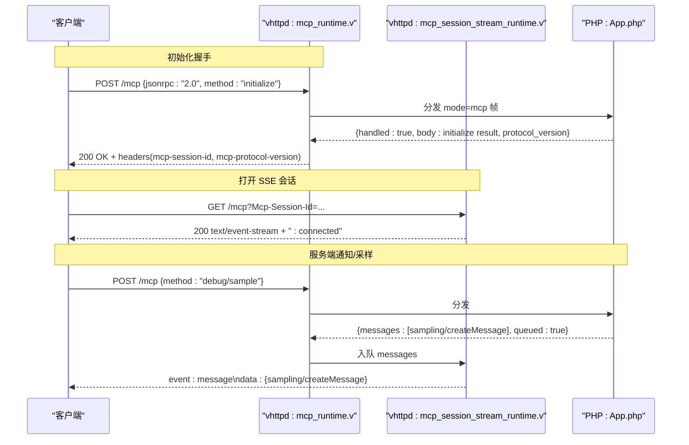
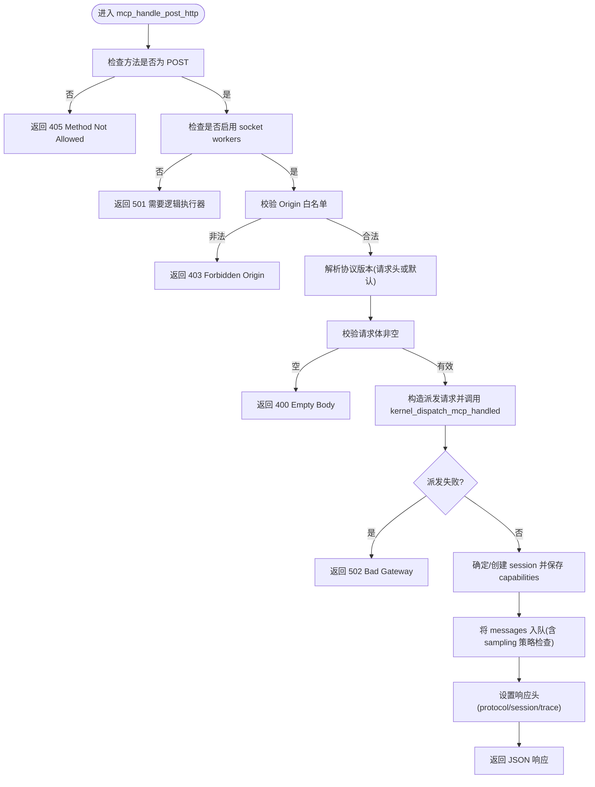
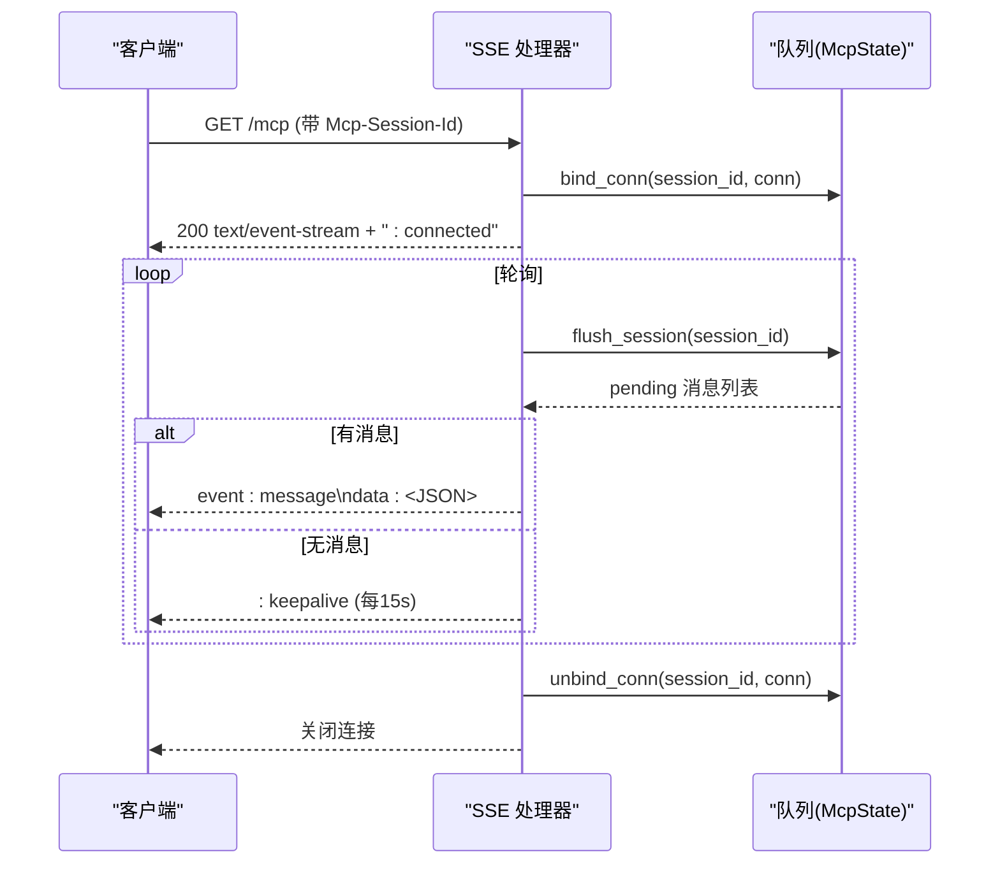
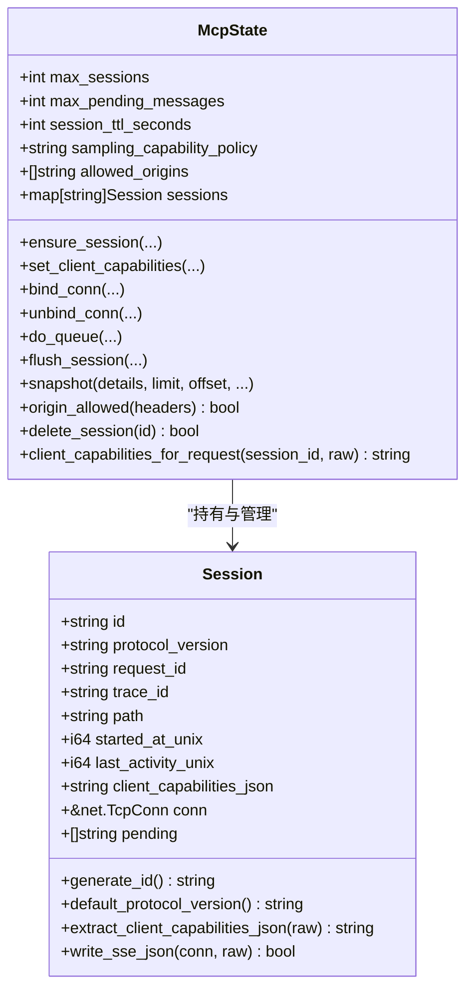
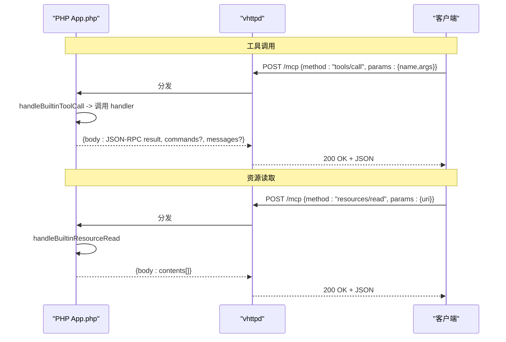
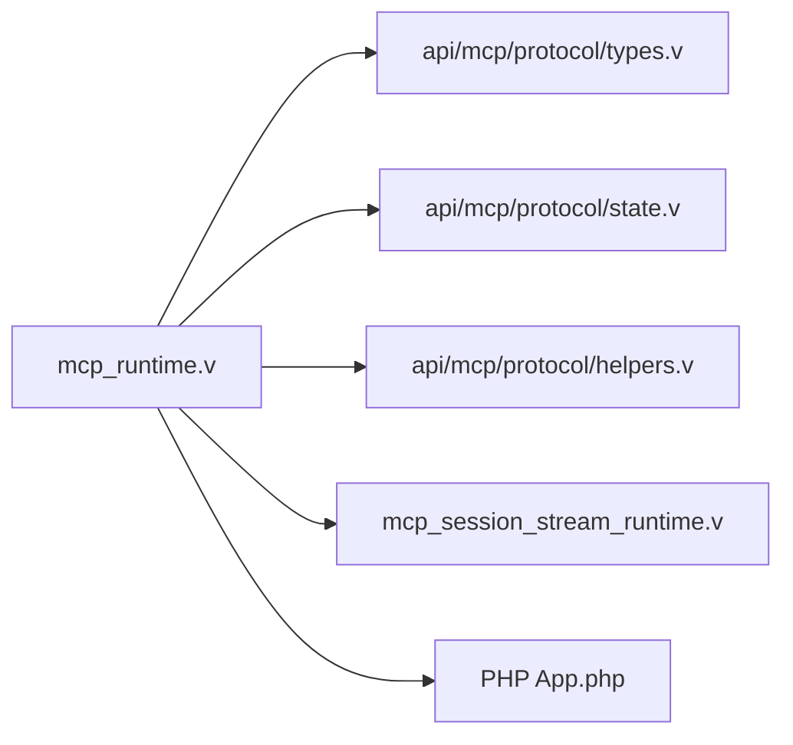

# MCP JSON-RPC API

<cite>
**本文引用的文件列表**
- [MCP.md](file://docs/MCP.md)
- [MCP_APP_API.md](file://docs/MCP_APP_API.md)
- [MCP_MVP_PLAN.md](file://docs/MCP_MVP_PLAN.md)
- [mcp_runtime.v](file://src/mcp_runtime.v)
- [mcp_session_stream_runtime.v](file://src/mcp_session_stream_runtime.v)
- [types.v](file://src/api/mcp/protocol/types.v)
- [state.v](file://src/api/mcp/protocol/state.v)
- [helpers.v](file://src/api/mcp/protocol/helpers.v)
- [App.php](file://php/package/src/VSlim/Mcp/App.php)
</cite>

## 目录
1. [简介](#简介)
2. [项目结构](#项目结构)
3. [核心组件](#核心组件)
4. [架构总览](#架构总览)
5. [详细组件分析](#详细组件分析)
6. [依赖关系分析](#依赖关系分析)
7. [性能与容量规划](#性能与容量规划)
8. [故障排查指南](#故障排查指南)
9. [结论](#结论)
10. [附录：JSON-RPC 消息示例与集成要点](#附录json-rpc-消息示例与集成要点)

## 简介
本文件面向在 vhttpd 中实现和集成 MCP（Model Context Protocol）的开发者，聚焦于 MCP 基于 Streamable HTTP 的 JSON-RPC 通信规范。内容覆盖初始化握手、会话管理、工具调用、资源访问、通知与进度、采样能力协商、流式传输、错误处理、版本兼容性与部署调优等。文档同时给出端到端交互序列图、类图与流程图，帮助读者快速理解并落地使用。

## 项目结构
vhttpd 对 MCP 的支持采用“transport/runtime 与业务逻辑分离”的分层设计：
- vhttpd 负责 HTTP/SSE 传输、会话生命周期、协议版本校验、Origin 白名单、队列与 flush、管理面快照等
- PHP worker 负责 JSON-RPC 方法路由、内置能力（tools/resources/prompts）、自定义方法、消息构造与排队
- 用户态通过 VSlim\Mcp\App 注册能力与构建消息

```mermaid
graph TB
Client["客户端"] --> |POST /mcp| VHTTPD["vhttpd: mcp_runtime.v"]
Client --> |GET /mcp (SSE)| VHTTPD
VHTTPD --> |调度| Worker["PHP worker: App.php"]
Worker --> |返回 JSON-RPC body + messages[]| VHTTPD
VHTTPD --> |SSE event: message| Client
VHTTPD --> |管理面| Admin["/admin/runtime/mcp"]
```

图表来源
- [mcp_runtime.v:1-138](file://src/mcp_runtime.v#L1-L138)
- [mcp_session_stream_runtime.v:40-86](file://src/mcp_session_stream_runtime.v#L40-L86)
- [App.php:442-773](file://php/package/src/VSlim/Mcp/App.php#L442-L773)

章节来源
- [MCP.md:1-185](file://docs/MCP.md#L1-L185)
- [MCP_MVP_PLAN.md:167-377](file://docs/MCP_MVP_PLAN.md#L167-L377)

## 核心组件
- 运行时入口与 POST 处理：解析请求头、校验 Origin、选择协议版本、派发至 worker、维护 session、排队 server-to-client 消息、写回响应
- SSE 会话流：绑定连接、flush 队列、keepalive、解绑与关闭
- 协议类型与会话状态：Session、McpState、队列与清理策略、能力提取与策略
- PHP 侧应用框架：App 类提供 initialize/ping/tools/resources/prompts 内置方法与 queue* 辅助

章节来源
- [mcp_runtime.v:1-138](file://src/mcp_runtime.v#L1-L138)
- [mcp_session_stream_runtime.v:40-86](file://src/mcp_session_stream_runtime.v#L40-L86)
- [types.v:1-99](file://src/api/mcp/protocol/types.v#L1-L99)
- [state.v:1-355](file://src/api/mcp/protocol/state.v#L1-L355)
- [helpers.v:1-57](file://src/api/mcp/protocol/helpers.v#L1-L57)
- [App.php:1-773](file://php/package/src/VSlim/Mcp/App.php#L1-L773)

## 架构总览
下图展示了从客户端到 vhttpd 再到 PHP worker 的完整交互路径，以及 SSE 流式推送过程。



图表来源
- [mcp_runtime.v:1-138](file://src/mcp_runtime.v#L1-L138)
- [mcp_session_stream_runtime.v:40-86](file://src/mcp_session_stream_runtime.v#L40-L86)
- [App.php:442-773](file://php/package/src/VSlim/Mcp/App.php#L442-L773)

## 详细组件分析

### 组件一：POST /mcp 处理流程
- 校验 HTTP 方法为 POST；未配置逻辑执行器时返回 501
- 校验 Origin 白名单；不合法返回 403
- 解析协议版本：优先使用请求头，否则使用默认版本
- 校验请求体非空；为空返回 400
- 构造内核派发请求，包含 headers、session_id、client_capabilities_for_request
- 派发至 worker，捕获失败并记录指标，返回 502
- 根据 response.session_id 或请求头生成/复用 session；若为 initialize，则创建新 session 并保存 client capabilities
- 将 worker 返回的 messages 入队；若 sampling 且客户端未声明 capability，按策略返回 409
- 设置响应头（trace-id、protocol-version、session-id），返回最终 JSON 响应



图表来源
- [mcp_runtime.v:1-138](file://src/mcp_runtime.v#L1-L138)
- [state.v:155-197](file://src/api/mcp/protocol/state.v#L155-L197)
- [helpers.v:5-51](file://src/api/mcp/protocol/helpers.v#L5-L51)

章节来源
- [mcp_runtime.v:1-138](file://src/mcp_runtime.v#L1-L138)
- [state.v:1-355](file://src/api/mcp/protocol/state.v#L1-L355)
- [helpers.v:1-57](file://src/api/mcp/protocol/helpers.v#L1-L57)

### 组件二：GET /mcp SSE 会话流
- 建立长连接，写入初始 “: connected”
- 循环定时 flush 队列，发送 event: message\ndata:<JSON>
- 每 15 秒发送 “: keepalive” 保持活跃
- 连接断开后解绑并关闭，记录日志事件



图表来源
- [mcp_session_stream_runtime.v:40-86](file://src/mcp_session_stream_runtime.v#L40-L86)
- [state.v:199-225](file://src/api/mcp/protocol/state.v#L199-L225)

章节来源
- [mcp_session_stream_runtime.v:40-86](file://src/mcp_session_stream_runtime.v#L40-L86)
- [state.v:199-225](file://src/api/mcp/protocol/state.v#L199-L225)

### 组件三：会话管理与能力协商
- Session：标识、协议版本、请求/追踪 ID、路径、时间戳、客户端能力 JSON、TCP 连接引用、待发消息队列
- McpState：并发安全地管理 sessions、TTL 清理、最大会话数与淘汰策略、pending 队列上限与丢弃统计、采样能力策略归一化、Origin 白名单校验、快照导出
- 能力协商：extract_client_capabilities_json 从请求体中提取 capabilities 片段；set_client_capabilities 持久化到 session；queue_message_drop_due_to_sampling 用于控制未声明 sampling 时的行为



图表来源
- [types.v:1-99](file://src/api/mcp/protocol/types.v#L1-L99)
- [state.v:1-355](file://src/api/mcp/protocol/state.v#L1-L355)
- [helpers.v:1-57](file://src/api/mcp/protocol/helpers.v#L1-L57)

章节来源
- [types.v:1-99](file://src/api/mcp/protocol/types.v#L1-L99)
- [state.v:1-355](file://src/api/mcp/protocol/state.v#L1-L355)
- [helpers.v:1-57](file://src/api/mcp/protocol/helpers.v#L1-L57)

### 组件四：PHP 侧 App 框架与内置方法
- 注册层：tool/resource/prompt/capability/capabilities/register
- 构建层：notification/request/samplingRequest
- 队列层：queuedResult/queueMessages/notify/queueNotification/queueRequest/queueProgress/queueLog/queueSampling
- 内置方法：initialize、ping、tools/list、tools/call、resources/list、resources/read、prompts/list、prompts/get
- 错误处理：errorResponse 统一编码 JSON-RPC error 对象



图表来源
- [App.php:442-773](file://php/package/src/VSlim/Mcp/App.php#L442-L773)

章节来源
- [App.php:1-773](file://php/package/src/VSlim/Mcp/App.php#L1-L773)
- [MCP_APP_API.md:1-306](file://docs/MCP_APP_API.md#L1-L306)

## 依赖关系分析
- vhttpd 运行时依赖协议类型与会话状态模块（types/state/helpers）
- vhttpd 通过内核派发接口与 PHP worker 通信
- PHP App 类作为 MCP 方法的承载者，提供统一的请求解析与响应封装



图表来源
- [mcp_runtime.v:1-138](file://src/mcp_runtime.v#L1-L138)
- [mcp_session_stream_runtime.v:40-86](file://src/mcp_session_stream_runtime.v#L40-L86)
- [types.v:1-99](file://src/api/mcp/protocol/types.v#L1-L99)
- [state.v:1-355](file://src/api/mcp/protocol/state.v#L1-L355)
- [helpers.v:1-57](file://src/api/mcp/protocol/helpers.v#L1-L57)
- [App.php:1-773](file://php/package/src/VSlim/Mcp/App.php#L1-L773)

章节来源
- [mcp_runtime.v:1-138](file://src/mcp_runtime.v#L1-L138)
- [mcp_session_stream_runtime.v:40-86](file://src/mcp_session_stream_runtime.v#L40-L86)
- [types.v:1-99](file://src/api/mcp/protocol/types.v#L1-L99)
- [state.v:1-355](file://src/api/mcp/protocol/state.v#L1-L355)
- [helpers.v:1-57](file://src/api/mcp/protocol/helpers.v#L1-L57)
- [App.php:1-773](file://php/package/src/VSlim/Mcp/App.php#L1-L773)

## 性能与容量规划
- 会话 TTL 与清理：默认 900 秒，可配置；定期 prune 过期会话
- 最大会话数：默认 1000，超出时按最近最少活动淘汰
- 队列上限：默认 128 条，超出时丢弃尾部并计数
- 采样能力策略：warn/drop/error，影响未声明 sampling 时的入队行为
- SSE keepalive：每 15 秒发送注释，避免中间设备超时
- 建议：
  - 合理设置 max_sessions、max_pending_messages、session_ttl_seconds
  - 明确 Origin 白名单，避免跨站滥用
  - 监控 stats（expired/evicted/pending_dropped/sampling warnings/errors）

章节来源
- [state.v:8-53](file://src/api/mcp/protocol/state.v#L8-L53)
- [state.v:170-197](file://src/api/mcp/protocol/state.v#L170-L197)
- [state.v:229-306](file://src/api/mcp/protocol/state.v#L229-L306)
- [types.v:75-81](file://src/api/mcp/protocol/types.v#L75-L81)

## 故障排查指南
- 405 Method Not Allowed：仅支持 POST /mcp 的 JSON-RPC 请求；GET 用于 SSE 会话
- 403 Forbidden Origin：Origin 不在白名单
- 400 Empty JSON-RPC body：请求体为空或空白
- 501 Worker unavailable：未配置逻辑执行器
- 502 Bad Gateway：worker 派发失败
- 409 Sampling capability required：server 发起 sampling 但客户端未声明 sampling 能力
- 500 Internal Server Error：worker 返回 event=error
- 501 Not Implemented：worker 未处理请求

章节来源
- [mcp_runtime.v:11-132](file://src/mcp_runtime.v#L11-L132)
- [state.v:155-197](file://src/api/mcp/protocol/state.v#L155-L197)

## 结论
vhttpd 的 MCP 实现以 Streamable HTTP 为核心，清晰划分 transport/runtime 与业务逻辑边界。通过会话管理、SSE 流式推送与 PHP 侧 App 框架，提供了完整的初始化握手、工具/资源/提示词能力、通知与进度、采样能力协商与错误处理机制。配合管理面快照与策略开关，便于在生产环境进行安全与性能治理。

## 附录：JSON-RPC 消息示例与集成要点

### 初始化握手
- 客户端向 POST /mcp 发送 initialize 请求
- 服务器返回包含 protocolVersion、capabilities、serverInfo 的结果，并在响应头中携带 mcp-protocol-version 与 mcp-session-id

章节来源
- [App.php:469-482](file://php/package/src/VSlim/Mcp/App.php#L469-L482)
- [mcp_runtime.v:66-84](file://src/mcp_runtime.v#L66-L84)

### 工具调用
- tools/list：返回已注册的 tool 定义列表
- tools/call：调用具体 tool，handler 可返回命令与结果

章节来源
- [App.php:488-500](file://php/package/src/VSlim/Mcp/App.php#L488-L500)
- [App.php:630-660](file://php/package/src/VSlim/Mcp/App.php#L630-L660)

### 资源访问
- resources/list：返回已注册的 resource 定义列表
- resources/read：按 uri 读取资源内容，返回 contents 数组

章节来源
- [App.php:501-512](file://php/package/src/VSlim/Mcp/App.php#L501-L512)
- [App.php:667-687](file://php/package/src/VSlim/Mcp/App.php#L667-L687)

### 提示词
- prompts/list：返回已注册的 prompt 定义列表
- prompts/get：按 name 与 arguments 获取提示词

章节来源
- [App.php:514-525](file://php/package/src/VSlim/Mcp/App.php#L514-L525)
- [App.php:694-706](file://php/package/src/VSlim/Mcp/App.php#L694-L706)

### 通知与进度
- notifications/message：通用通知
- notifications/progress：进度更新

章节来源
- [App.php:277-347](file://php/package/src/VSlim/Mcp/App.php#L277-L347)

### 采样能力协商
- 客户端在 initialize.params.capabilities 中声明 sampling
- 服务端在未声明时按策略 warn/drop/error 处理

章节来源
- [state.v:155-168](file://src/api/mcp/protocol/state.v#L155-L168)
- [types.v:75-81](file://src/api/mcp/protocol/types.v#L75-L81)
- [mcp_runtime.v:85-94](file://src/mcp_runtime.v#L85-L94)

### 流式传输（SSE）
- GET /mcp 建立 SSE 会话，先收到 “: connected”，随后接收 event: message\ndata:<JSON>
- 每 15 秒发送 “: keepalive”

章节来源
- [mcp_session_stream_runtime.v:56-86](file://src/mcp_session_stream_runtime.v#L56-L86)
- [state.v:199-225](file://src/api/mcp/protocol/state.v#L199-L225)

### 错误处理
- 标准 JSON-RPC error 对象由 App.errorResponse 统一编码
- vhttpd 层针对派发失败、未实现、内部错误等返回相应 HTTP 状态码

章节来源
- [App.php:747-771](file://php/package/src/VSlim/Mcp/App.php#L747-L771)
- [mcp_runtime.v:44-114](file://src/mcp_runtime.v#L44-L114)

### 客户端集成要点
- 使用 POST /mcp 发送 JSON-RPC 请求，必要时带上 MCP-Protocol-Version 与 Origin
- 使用 GET /mcp 并携带 Mcp-Session-Id 建立 SSE 会话，持续消费 event: message
- 如需采样能力，确保在 initialize 中声明 capabilities.sampling
- 关注响应头中的 mcp-session-id 与 mcp-protocol-version，用于后续请求与会话关联

章节来源
- [MCP_RUNBOOK.md:70-143](file://docs/MCP_RUNBOOK.md#L70-L143)
- [examples/README.md:368-404](file://examples/README.md#L368-L404)