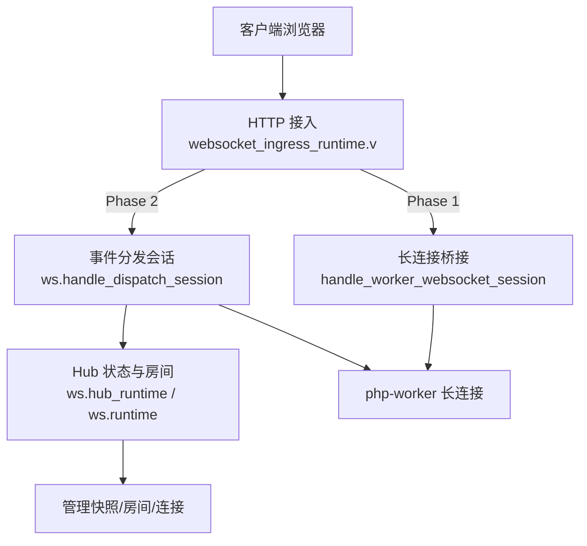
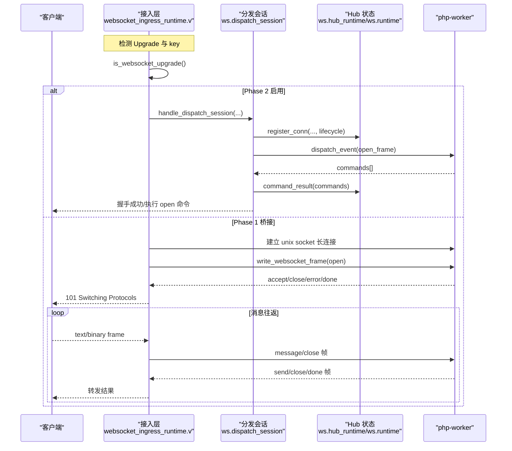
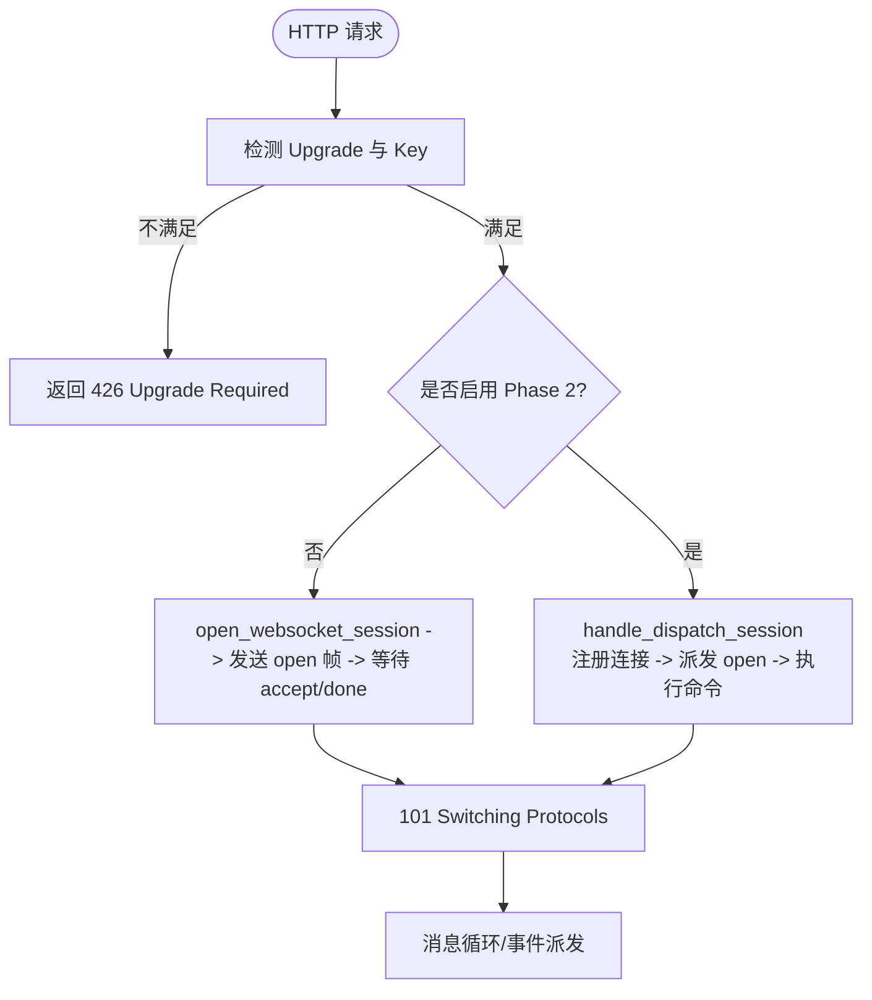
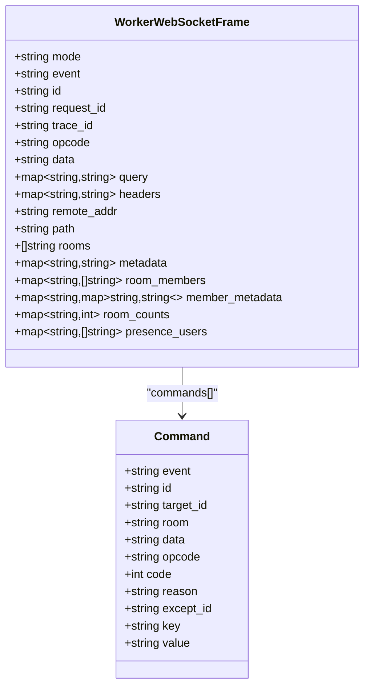
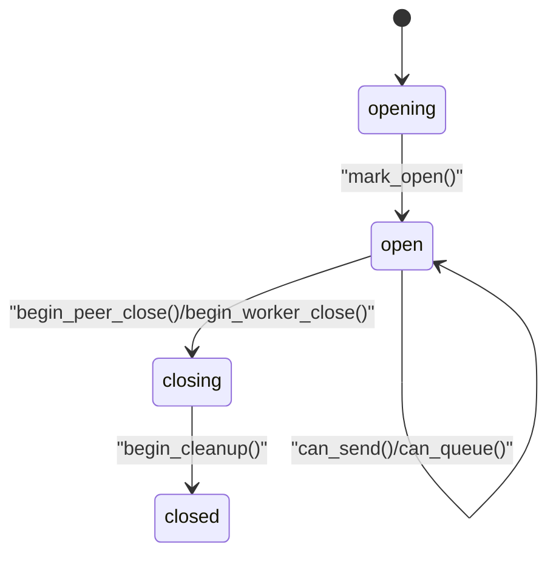
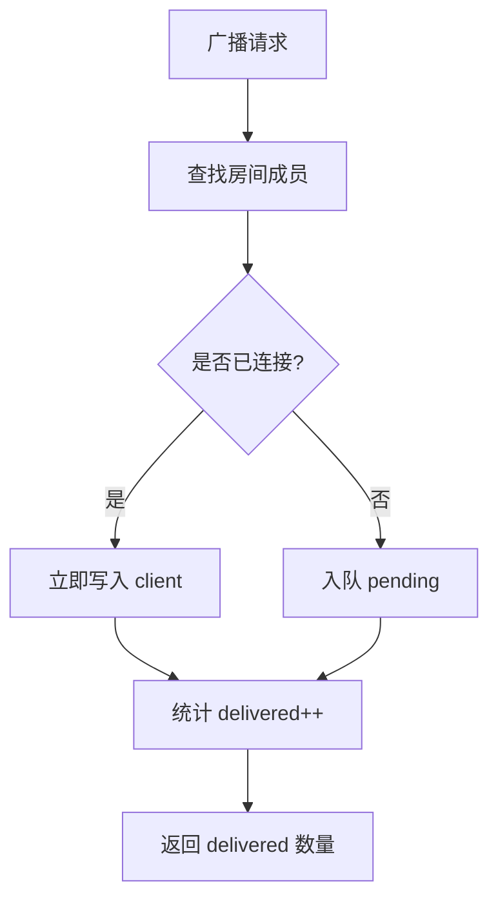
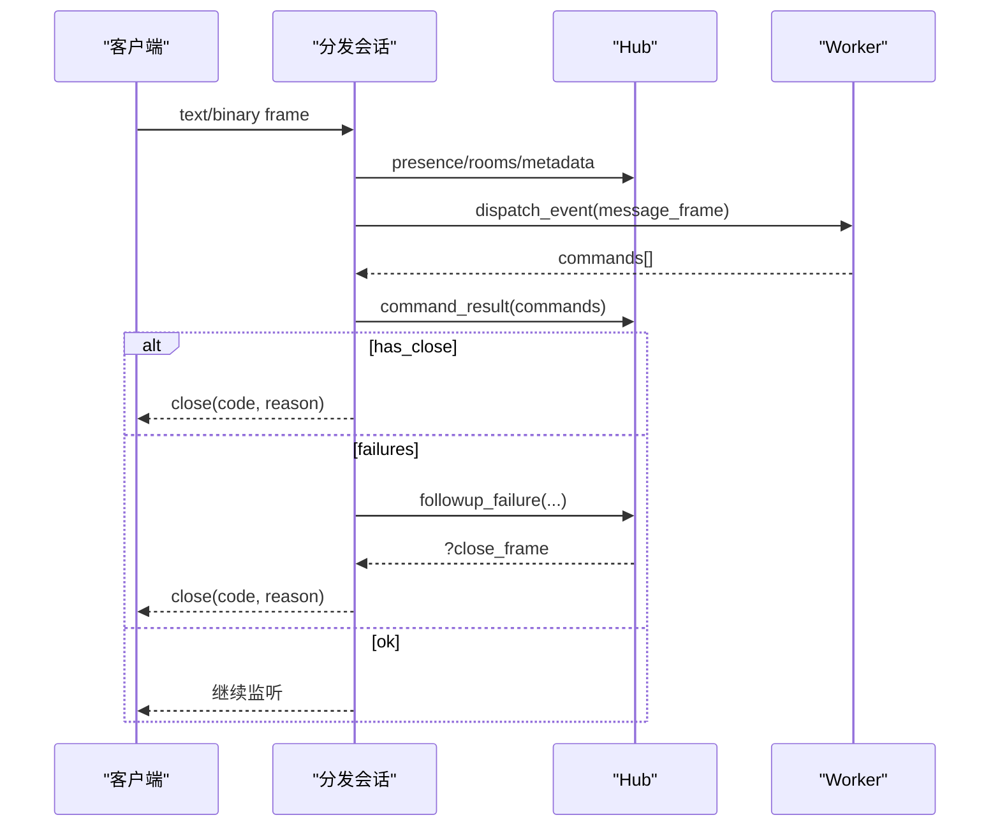
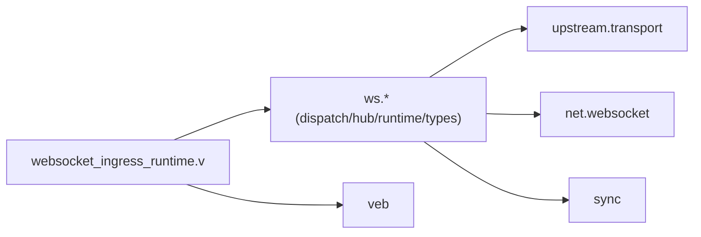

# WebSocket API

<cite>
**本文引用的文件**   
- [README.md](file://README.md)
- [websocket_ingress_runtime.v](file://src/websocket_ingress_runtime.v)
- [dispatch_session.v](file://src/ws/dispatch_session.v)
- [hub_runtime.v](file://src/ws/hub_runtime.v)
- [runtime.v](file://src/ws/runtime.v)
- [types.v](file://src/ws/types.v)
- [WEBSOCKET_PHASE2_IMPLEMENTATION_PLAN.md](file://docs/WEBSOCKET_PHASE2_IMPLEMENTATION_PLAN.md)
- [WEBSOCKET_EVENT_BUS_PLAN.md](file://docs/WEBSOCKET_EVENT_BUS_PLAN.md)
- [websocket_echo.toml](file://examples/config/websocket-echo.toml)
- [websocket_echo_app.js](file://examples/public/websocket_echo_app.js)
</cite>

## 目录
1. [简介](#简介)
2. [项目结构](#项目结构)
3. [核心组件](#核心组件)
4. [架构总览](#架构总览)
5. [详细组件分析](#详细组件分析)
6. [依赖关系分析](#依赖关系分析)
7. [性能考虑](#性能考虑)
8. [故障排查指南](#故障排查指南)
9. [结论](#结论)
10. [附录](#附录)

## 简介
本文件为 vhttpd 的 WebSocket API 完整文档，覆盖连接建立流程、握手协议、消息格式定义、事件类型与实时交互模式；说明连接管理、会话亲和性、房间系统、消息广播等功能；包含连接生命周期管理、重连机制、错误处理与断线恢复策略；提供完整的消息格式示例、事件订阅模式、客户端实现指南和性能优化建议；并记录 WebSocket 代理、负载均衡和高可用配置要点。

vhttpd 在传输层支持 HTTP/WebSocket/流式响应，在运行时层提供上游流式执行、外部 worker 编排、内嵌宿主执行、MCP 等能力。WebSocket 同时支持两种模式：
- Phase 1（长连接桥接）：worker 持有长连接，vhttpd 作为透传桥。
- Phase 2（事件分发）：vhttpd 持有连接，worker 以短任务方式处理 open/message/close 事件，返回命令列表由 vhttpd 执行。

**章节来源**
- [README.md:45-83](file://README.md#L45-L83)
- [README.md:191-208](file://README.md#L191-L208)

## 项目结构
WebSocket 相关代码主要分布在以下模块：
- 接入与升级：HTTP 到 WebSocket 的升级、握手、路由选择（Phase 1/Phase 2）
- 分发会话：Phase 2 的连接生命周期与消息派发
- Hub 状态与房间：连接注册、房间成员、元数据、广播、快照
- 类型与帧：统一的 Worker 帧结构与命令语义
- 计划与设计文档：Phase 2 的事件分发模型、事件总线扩展方向

**图表来源**
- [websocket_ingress_runtime.v:279-339](file://src/websocket_ingress_runtime.v#L279-L339)
- [websocket_ingress_runtime.v:413-482](file://src/websocket_ingress_runtime.v#L413-L482)
- [dispatch_session.v:11-35](file://src/ws/dispatch_session.v#L11-L35)
- [hub_runtime.v:174-334](file://src/ws/hub_runtime.v#L174-L334)

**章节来源**
- [websocket_ingress_runtime.v:279-339](file://src/websocket_ingress_runtime.v#L279-L339)
- [dispatch_session.v:11-35](file://src/ws/dispatch_session.v#L11-L35)
- [hub_runtime.v:174-334](file://src/ws/hub_runtime.v#L174-L334)

## 核心组件
- 接入与升级
  - 检测 Upgrade 请求、解析 key、选择 Phase 1 或 Phase 2 路径
  - Phase 1：与 php-worker 建立 Unix Socket 长连接，双向转发
  - Phase 2：完成握手后直接由 vhttpd 持有连接，按事件派发至 worker
- 分发会话（Phase 2）
  - 维护连接生命周期状态机（opening/open/closing/closed）
  - 构建 open/message/close 事件帧，调用 RuntimeContext 派发
  - 执行 worker 返回的命令（send/send_to/join/leave/broadcast/close/set_meta/clear_meta）
- Hub 状态与房间
  - 连接注册/注销、房间成员管理、连接元数据
  - 发送队列与延迟写入、批量广播、存在性快照
- 类型与帧
  - 统一 Worker 帧结构，包含 mode/event/id/opcode/data/rooms/metadata/presence 等字段
  - 命令失败回退与关闭策略

**章节来源**
- [websocket_ingress_runtime.v:16-30](file://src/websocket_ingress_runtime.v#L16-L30)
- [dispatch_session.v:11-35](file://src/ws/dispatch_session.v#L11-L35)
- [types.v:11-120](file://src/ws/types.v#L11-L120)
- [runtime.v:24-47](file://src/ws/runtime.v#L24-L47)
- [hub_runtime.v:369-436](file://src/ws/hub_runtime.v#L369-L436)

## 架构总览
下图展示从客户端到 worker 的两条路径以及 Hub 的房间与广播能力。

**图表来源**
- [websocket_ingress_runtime.v:279-339](file://src/websocket_ingress_runtime.v#L279-L339)
- [websocket_ingress_runtime.v:413-482](file://src/websocket_ingress_runtime.v#L413-L482)
- [dispatch_session.v:11-35](file://src/ws/dispatch_session.v#L11-L35)
- [hub_runtime.v:174-334](file://src/ws/hub_runtime.v#L174-L334)

## 详细组件分析

### 连接建立与握手协议
- 握手入口
  - 检查 GET 方法、Upgrade=websocket、Connection 包含 upgrade、Sec-WebSocket-Key 非空
  - 若匹配则进入 WebSocket 处理分支
- Phase 1（长连接桥接）
  - 通过 engines.open_websocket_session 获取 worker 连接
  - 向 worker 发送 open 帧，等待 accept/close/error/done
  - 成功后 101 切换协议，进入消息循环
- Phase 2（事件分发）
  - 完成 net.websocket 握手后，注册连接并派发 open 事件
  - worker 返回命令列表，vhttpd 执行（如 set_meta/join/send）
  - 握手完成后进入消息派发循环

**图表来源**
- [websocket_ingress_runtime.v:16-30](file://src/websocket_ingress_runtime.v#L16-L30)
- [websocket_ingress_runtime.v:279-339](file://src/websocket_ingress_runtime.v#L279-L339)
- [websocket_ingress_runtime.v:413-482](file://src/websocket_ingress_runtime.v#L413-L482)
- [dispatch_session.v:11-35](file://src/ws/dispatch_session.v#L11-L35)

**章节来源**
- [websocket_ingress_runtime.v:16-30](file://src/websocket_ingress_runtime.v#L16-L30)
- [websocket_ingress_runtime.v:279-339](file://src/websocket_ingress_runtime.v#L279-L339)
- [websocket_ingress_runtime.v:413-482](file://src/websocket_ingress_runtime.v#L413-L482)
- [dispatch_session.v:11-35](file://src/ws/dispatch_session.v#L11-L35)

### 事件类型与消息格式
- 事件类型
  - open：连接建立时派发，携带 path/query/headers/remote_addr/rooms/metadata/presence
  - message：文本/二进制帧到达时派发，opcode 为 text/binary
  - close：对端或本地触发关闭时派发，携带 code/reason
- 帧结构关键字段
  - mode：'websocket' 或 'websocket_dispatch'
  - event：'open'/'message'/'close'/'accept'/'done'/'error'
  - id/request_id/trace_id：追踪标识
  - opcode/data：消息载荷（binary 使用 base64）
  - rooms/metadata：当前连接所在房间与元数据
  - presence：房间成员、成员元数据、计数、用户列表快照
- 命令列表（worker 返回）
  - send/send_to：向指定连接发送
  - join/leave：加入/离开房间
  - broadcast：向房间广播（可排除某连接）
  - close：主动关闭目标连接
  - set_meta/clear_meta：设置/清除连接元数据

**图表来源**
- [types.v:11-120](file://src/ws/types.v#L11-L120)
- [hub_runtime.v:369-436](file://src/ws/hub_runtime.v#L369-L436)

**章节来源**
- [types.v:11-120](file://src/ws/types.v#L11-L120)
- [hub_runtime.v:369-436](file://src/ws/hub_runtime.v#L369-L436)
- [WEBSOCKET_PHASE2_IMPLEMENTATION_PLAN.md:221-293](file://docs/WEBSOCKET_PHASE2_IMPLEMENTATION_PLAN.md#L221-L293)

### 连接生命周期与状态机
- 状态机阶段
  - opening → open：握手完成且标记开放
  - open → closing：收到 close 或由 worker 发起关闭
  - closing → closed：清理完成
- 关键行为
  - can_process_messages：仅 open 且未通知关闭时可处理消息
  - can_send：open 且未通知关闭且非 worker 发起关闭时可发送
  - can_queue：opening/open 且未通知关闭时可入队
  - mark_open/mark_closing/begin_peer_close/begin_cleanup：受互斥锁保护的状态迁移
- 连接注册与清理
  - register_conn/unregister_conn：维护 conns/conn_rooms/room_members/conn_meta/pending
  - cleanup_conn：删除连接、房间成员、元数据与待发消息

**图表来源**
- [types.v:11-120](file://src/ws/types.v#L11-L120)
- [runtime.v:24-47](file://src/ws/runtime.v#L24-L47)

**章节来源**
- [types.v:11-120](file://src/ws/types.v#L11-L120)
- [runtime.v:24-47](file://src/ws/runtime.v#L24-L47)

### 房间系统与消息广播
- 房间成员管理
  - join/leave：维护 room_members 与 conn_rooms 双向映射
  - rooms_snapshot/meta_snapshot：查询连接所在房间与元数据
  - presence_snapshot：聚合房间成员、成员元数据、计数与用户列表
- 广播与定向发送
  - hub_broadcast：遍历房间成员，跳过 except_id，已连接直接写，未连接入队
  - hub_send_to：单发，支持入队与延迟写入
  - broadcast_dispatch：将 info 帧派发到房间内所有连接的 worker，再转发命令

**图表来源**
- [runtime.v:259-301](file://src/ws/runtime.v#L259-L301)
- [runtime.v:303-342](file://src/ws/runtime.v#L303-L342)
- [hub_runtime.v:217-251](file://src/ws/hub_runtime.v#L217-L251)

**章节来源**
- [runtime.v:259-301](file://src/ws/runtime.v#L259-L301)
- [runtime.v:303-342](file://src/ws/runtime.v#L303-L342)
- [hub_runtime.v:217-251](file://src/ws/hub_runtime.v#L217-L251)

### 事件订阅与命令执行（Phase 2）
- 事件构建与派发
  - build_frame：封装 method/path/query/headers/remote_addr/rooms/metadata/presence 等上下文
  - dispatch_event：将事件帧提交给 worker（inproc vjsx 或 php-worker）
- 命令执行与失败回退
  - command_result：执行命令，支持 has_close/failures
  - followup_failure：根据失败情况决定是否关闭连接及关闭码/原因
- 消息处理闭环
  - on_message：校验 opcode，构建 message 帧，派发并执行命令
  - on_close：派发 close 帧，执行最终命令，清理资源

**图表来源**
- [dispatch_session.v:126-168](file://src/ws/dispatch_session.v#L126-L168)
- [hub_runtime.v:115-134](file://src/ws/hub_runtime.v#L115-L134)

**章节来源**
- [dispatch_session.v:126-168](file://src/ws/dispatch_session.v#L126-L168)
- [hub_runtime.v:115-134](file://src/ws/hub_runtime.v#L115-L134)

### 连接管理与会话亲和性
- 连接注册
  - register_conn：保存 worker_socket、method、path、query、headers、remote_addr、client、lifecycle
- 亲和性与路由
  - Phase 1：基于 worker 选择的长连接，保持同一 worker 会话
  - Phase 2：vhttpd 持有连接，按事件选择可用 worker，适合水平扩展
- 元数据与会话状态
  - set_meta/clear_meta：连接级键值存储
  - rooms：连接加入的房间集合
  - presence：房间成员与用户视图

**章节来源**
- [runtime.v:49-68](file://src/ws/runtime.v#L49-L68)
- [runtime.v:168-197](file://src/ws/runtime.v#L168-L197)
- [runtime.v:199-242](file://src/ws/runtime.v#L199-L242)

### 错误处理与断线恢复策略
- 错误分类与响应
  - worker 返回 error/close/done 帧，vhttpd 转换为 HTTP 错误或 WebSocket close
  - 不支持的 opcode 直接关闭连接（1003）
- 超时与重试
  - 读/写超时由底层网络控制，建议在客户端实现指数退避重连
- 断线恢复
  - 客户端侧：捕获 close 事件，延迟重连，必要时重建房间与元数据
  - 服务端侧：on_close 派发 close 事件，允许 worker 做最后清理

**章节来源**
- [websocket_ingress_runtime.v:103-160](file://src/websocket_ingress_runtime.v#L103-L160)
- [websocket_ingress_runtime.v:223-277](file://src/websocket_ingress_runtime.v#L223-L277)
- [dispatch_session.v:184-203](file://src/ws/dispatch_session.v#L184-L203)

### 客户端实现指南
- 基本流程
  - 建立连接，监听 open/message/close/error
  - 发送文本或二进制帧（二进制需 base64 编码）
  - 处理服务器关闭码与原因
- 示例应用
  - 前端演示脚本位于 examples/public/websocket_echo_app.js
  - 配置文件 examples/config/websocket-echo.toml 用于快速启动 echo 服务

**章节来源**
- [websocket_echo_app.js:1-45](file://examples/public/websocket_echo_app.js#L1-L45)
- [websocket_echo.toml:1-28](file://examples/config/websocket-echo.toml#L1-L28)

## 依赖关系分析
- 内部依赖
  - websocket_ingress_runtime.v 依赖 ws 模块（分发会话、Hub、类型）
  - ws.dispatch_session 依赖 ws.hub_runtime 与 ws.runtime
  - ws.hub_runtime 依赖 upstream.transport 的帧构造与派发接口
- 外部依赖
  - net.websocket：握手、帧解析、ping/pong、关闭生命周期
  - sync：互斥锁、并发安全
  - veb：HTTP 上下文与结果封装

**图表来源**
- [websocket_ingress_runtime.v:1-15](file://src/websocket_ingress_runtime.v#L1-L15)
- [dispatch_session.v:1-8](file://src/ws/dispatch_session.v#L1-L8)
- [hub_runtime.v:1-6](file://src/ws/hub_runtime.v#L1-L6)
- [runtime.v:1-5](file://src/ws/runtime.v#L1-L5)
- [types.v:1-8](file://src/ws/types.v#L1-L8)

**章节来源**
- [websocket_ingress_runtime.v:1-15](file://src/websocket_ingress_runtime.v#L1-L15)
- [dispatch_session.v:1-8](file://src/ws/dispatch_session.v#L1-L8)
- [hub_runtime.v:1-6](file://src/ws/hub_runtime.v#L1-L6)
- [runtime.v:1-5](file://src/ws/runtime.v#L1-L5)
- [types.v:1-8](file://src/ws/types.v#L1-L8)

## 性能考虑
- 连接与命令批处理
  - 使用 Hub 的 pending 队列避免阻塞写入，flush_pending 在连接开放后批量发送
- 广播优化
  - 先收集目标，再逐条发送，减少锁竞争
- 读写分离
  - send_mu 独立于 mu，降低发送路径锁冲突
- 事件分发
  - Phase 2 将业务逻辑解耦到 worker，提升可扩展性
- 观察与诊断
  - 利用 admin 快照查看活跃连接、房间与成员分布

[本节为通用指导，无需具体文件引用]

## 故障排查指南
- 常见问题
  - 握手失败：检查 Upgrade/Key/Connection 头是否正确
  - 不支持的帧类型：确保只发送 text/binary
  - 连接无响应：确认 worker 返回 done/accept/close/error
- 定位手段
  - 查看 runtime_trace 日志（ws.session.start/enter/exit 等）
  - 使用 admin 快照查看连接与房间状态
- 恢复步骤
  - 客户端重连并重建房间/元数据
  - 服务端检查 worker 健康与命令执行结果

**章节来源**
- [websocket_ingress_runtime.v:103-160](file://src/websocket_ingress_runtime.v#L103-L160)
- [websocket_ingress_runtime.v:223-277](file://src/websocket_ingress_runtime.v#L223-L277)
- [hub_runtime.v:438-564](file://src/ws/hub_runtime.v#L438-L564)

## 结论
vhttpd 的 WebSocket 方案通过 Phase 1 与 Phase 2 双模式兼顾简单与可扩展性。Phase 1 适合快速原型与简单场景；Phase 2 将连接所有权与业务逻辑解耦，便于横向扩展与高可用部署。结合 Hub 的房间与元数据能力，可实现高效的实时通信与广播。配合完善的错误处理与诊断工具，可在生产环境稳定运行。

[本节为总结，无需具体文件引用]

## 附录

### 消息格式示例（Phase 2）
- 请求帧（event=message）
  - mode: "websocket_dispatch"
  - event: "message"
  - id/request_id/trace_id: 追踪标识
  - path/query/headers/remote_addr: 请求上下文
  - opcode: "text"/"binary"
  - data: 文本或 base64 编码的二进制
  - rooms/metadata/presence: 房间与存在性快照
- 响应帧（event=result）
  - commands: 命令列表（send/send_to/join/leave/broadcast/close/set_meta/clear_meta）
- 错误帧（event=error）
  - error_class/error: 错误类别与描述

**章节来源**
- [WEBSOCKET_PHASE2_IMPLEMENTATION_PLAN.md:221-293](file://docs/WEBSOCKET_PHASE2_IMPLEMENTATION_PLAN.md#L221-L293)

### 事件总线与多节点扩展
- 当前范围
  - 单节点 Hub，跨 worker 扇出
- 未来扩展
  - 可选外部总线适配器（Redis/NATS）实现多节点扇出
  - 房间分片、持久化订阅、二进制帧路由等

**章节来源**
- [WEBSOCKET_EVENT_BUS_PLAN.md:405-444](file://docs/WEBSOCKET_EVENT_BUS_PLAN.md#L405-L444)

### 代理、负载均衡与高可用配置
- 代理与负载均衡
  - 使用反向代理（如 nginx/Traefik）进行 TCP 层负载均衡，确保同一会话粘性（sticky session）
  - 对于 Phase 2，由于连接由 vhttpd 持有，粘性策略应基于连接 ID 或源 IP
- 高可用
  - 多实例部署，结合外部总线适配器实现跨节点广播
  - 健康检查与优雅关闭，确保连接迁移与资源释放

[本节为概念性内容，无需具体文件引用]