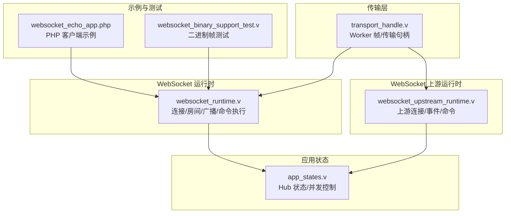
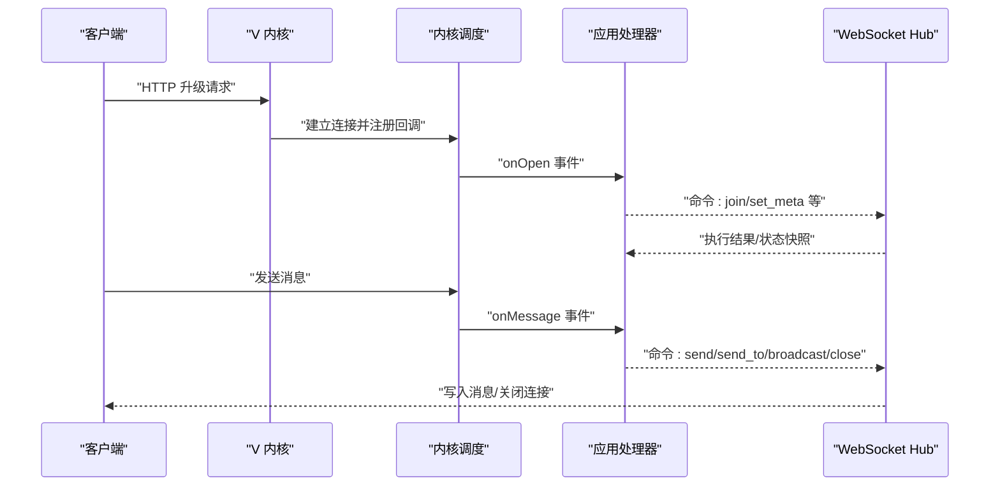
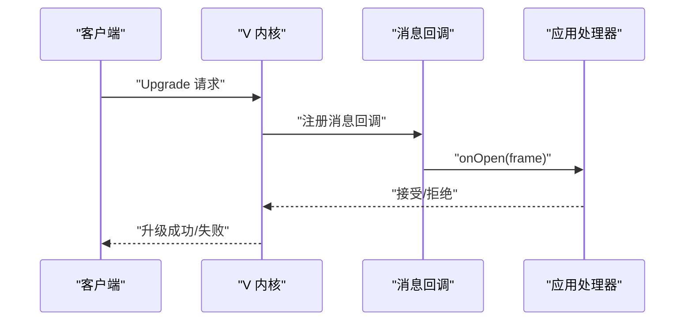
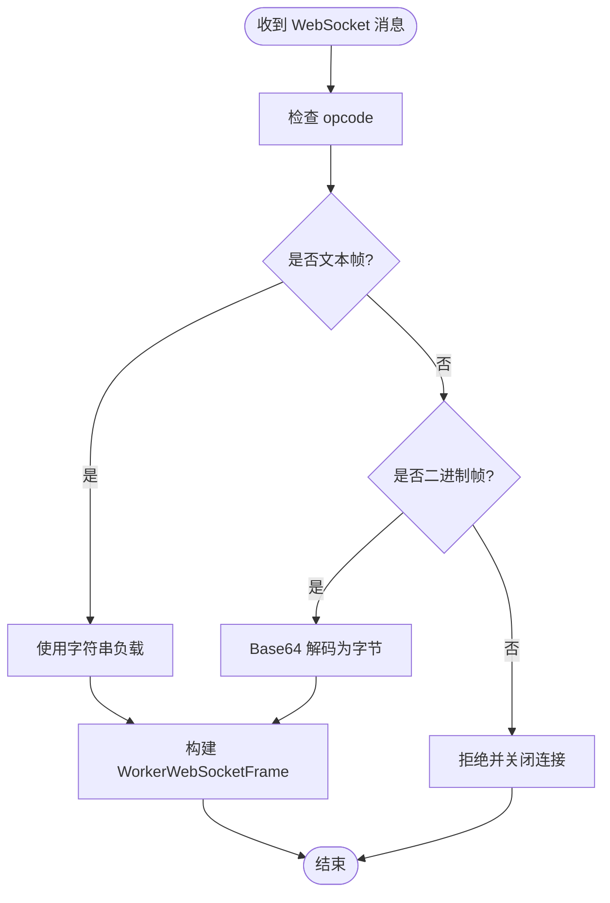
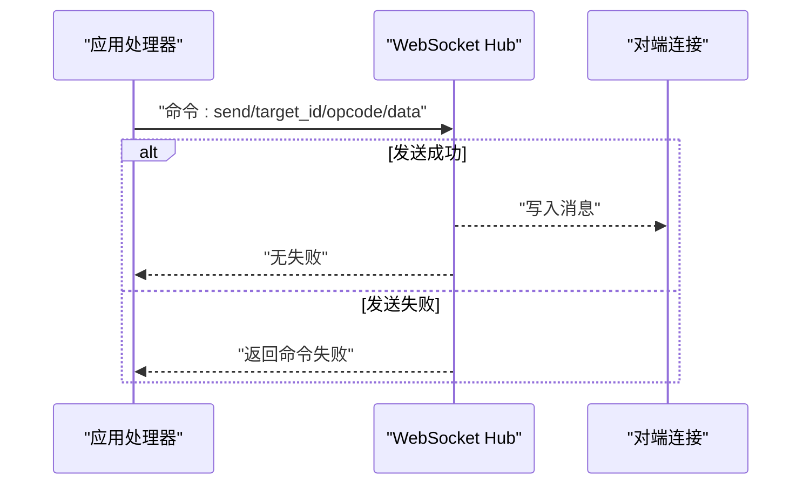
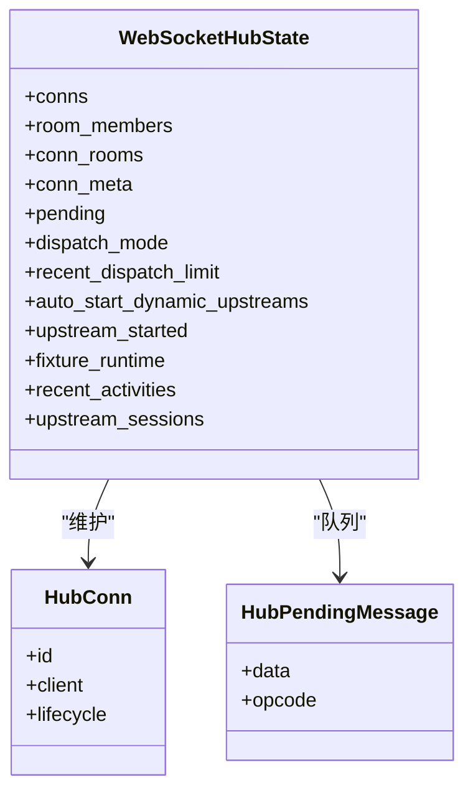
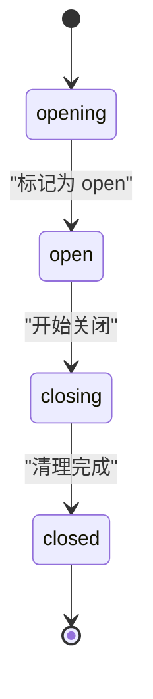
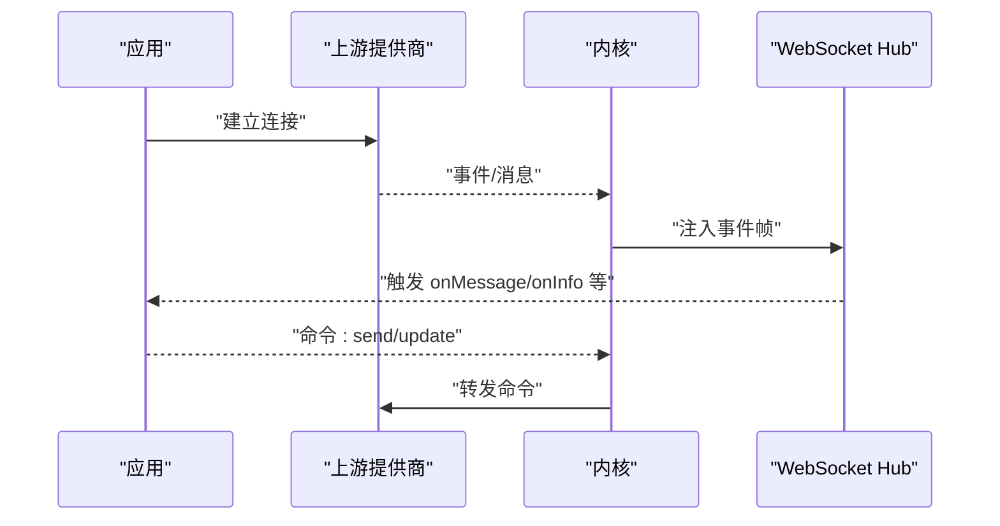
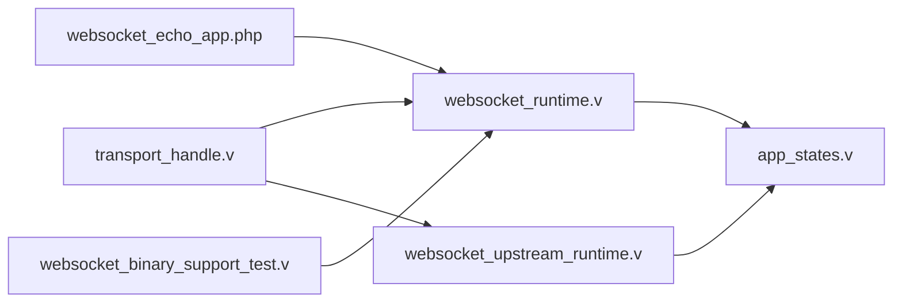

# WebSocket API

<cite>
**本文引用的文件**
- [websocket_runtime.v](file://src/websocket_runtime.v)
- [websocket_upstream_runtime.v](file://src/websocket_upstream_runtime.v)
- [app_states.v](file://src/app_states.v)
- [transport_handle.v](file://src/transport/transport_handle.v)
- [websocket_echo_app.php](file://examples/websocket_echo_app.php)
- [websocket_binary_support_test.v](file://src/websocket_binary_support_test.v)
- [inproc_vjsx_executor_test.v](file://src/inproc_vjsx_executor_test.v)
- [main.v](file://src/main.v)
- [inproc_vjsx_http_facade.js](file://src/inproc_vjsx_http_facade.js)
</cite>

## 目录
1. [简介](#简介)
2. [项目结构](#项目结构)
3. [核心组件](#核心组件)
4. [架构总览](#架构总览)
5. [详细组件分析](#详细组件分析)
6. [依赖关系分析](#依赖关系分析)
7. [性能考量](#性能考量)
8. [故障排查指南](#故障排查指南)
9. [结论](#结论)
10. [附录](#附录)

## 简介
本文件为 vhttpd 的 WebSocket API 详细文档，覆盖连接建立、消息传递与连接管理机制；记录消息格式、事件类型与协议规范；说明握手过程、认证方式与会话管理；提供消息编解码规则与错误处理机制；解释实时通信模式与状态同步机制；并给出连接断开、重连与故障恢复流程，以及客户端集成示例与最佳实践。

## 项目结构
vhttpd 的 WebSocket 能力由以下模块协同实现：
- WebSocket 运行时：负责连接生命周期、房间（频道）管理、消息分发与广播、命令执行与回传。
- WebSocket 上游运行时：负责与外部上游（如飞书、Codex 等）建立双向 WebSocket 连接，转发事件与命令。
- 应用状态：维护 WebSocket Hub 的全局状态（连接、房间、元数据、待发送队列等）。
- 传输层：定义统一的 Worker WebSocket 帧结构与传输句柄。
- 示例与测试：提供 PHP 客户端示例与二进制帧支持测试，验证文本/二进制帧编解码。

**图表来源**
- [websocket_runtime.v:1-120](file://src/websocket_runtime.v#L1-L120)
- [websocket_upstream_runtime.v:1-120](file://src/websocket_upstream_runtime.v#L1-L120)
- [app_states.v:23-42](file://src/app_states.v#L23-L42)
- [transport_handle.v:1-21](file://src/transport/transport_handle.v#L1-L21)
- [websocket_echo_app.php:1-60](file://examples/websocket_echo_app.php#L1-L60)
- [websocket_binary_support_test.v:1-61](file://src/websocket_binary_support_test.v#L1-L61)

**章节来源**
- [websocket_runtime.v:1-120](file://src/websocket_runtime.v#L1-L120)
- [websocket_upstream_runtime.v:1-120](file://src/websocket_upstream_runtime.v#L1-L120)
- [app_states.v:23-42](file://src/app_states.v#L23-L42)
- [transport_handle.v:1-21](file://src/transport/transport_handle.v#L1-L21)
- [websocket_echo_app.php:1-60](file://examples/websocket_echo_app.php#L1-L60)
- [websocket_binary_support_test.v:1-61](file://src/websocket_binary_support_test.v#L1-L61)

## 核心组件
- WebSocket Hub 状态与并发控制
  - Hub 维护连接表、房间成员、连接元数据、待发送队列，并通过互斥锁保证并发安全。
  - 发送路径使用独立的发送互斥锁，避免竞态。
- 连接生命周期与阶段
  - 连接阶段包括 opening/open/closing/closed，用于控制消息入队与发送。
  - 提供标记打开、开始关闭、清理等原子操作，确保幂等与一致性。
- 房间与元数据
  - 支持加入/离开房间、设置/清除元数据；提供房间存在性快照与成员元数据快照。
- 消息分发与广播
  - 支持向单连接、房间广播、向目标连接发送；对未就绪连接进行入队缓存。
- 命令执行与失败回传
  - Worker 层下发命令（如 send/send_to/join/leave/set_meta/clear_meta/broadcast/close），执行后可返回失败或触发关闭。
- 上游 WebSocket
  - 自动拉起上游连接，按提供商（飞书、Codex、Fixture）处理消息与事件，支持自动重连与活动记录。
- 传输帧与句柄
  - WorkerWebSocketFrame 描述一次 WebSocket 事件或命令；TransportHandle 描述传输层句柄。

**章节来源**
- [app_states.v:23-42](file://src/app_states.v#L23-L42)
- [websocket_runtime.v:44-96](file://src/websocket_runtime.v#L44-L96)
- [websocket_runtime.v:173-296](file://src/websocket_runtime.v#L173-L296)
- [websocket_runtime.v:323-596](file://src/websocket_runtime.v#L323-L596)
- [websocket_runtime.v:598-783](file://src/websocket_runtime.v#L598-L783)
- [websocket_upstream_runtime.v:1-120](file://src/websocket_upstream_runtime.v#L1-L120)
- [transport_handle.v:1-21](file://src/transport/transport_handle.v#L1-L21)

## 架构总览
vhttpd 的 WebSocket 架构分为两条主线：
- 内部调度线：客户端经 HTTP 升级到 V 的 net.websocket，消息进入内核后转换为 WorkerWebSocketFrame，交由应用侧（如 PHP Worker）处理，再通过命令回传给 Hub 执行发送/房间/元数据等操作。
- 上游连接线：根据配置自动拉起与上游的 WebSocket 连接，接收上游事件并注入到内核，同时支持从内核下发命令到上游。

**图表来源**
- [main.v:329-368](file://src/main.v#L329-L368)
- [websocket_runtime.v:360-390](file://src/websocket_runtime.v#L360-L390)
- [websocket_runtime.v:785-849](file://src/websocket_runtime.v#L785-L849)

## 详细组件分析

### 连接建立与握手
- HTTP 升级：客户端发起 HTTP 升级请求，V 内核接管并创建 net.websocket 客户端。
- 回调注册：内核注册消息回调，将帧转换为 WorkerWebSocketFrame 并投递到应用侧。
- 初次握手：应用在 onOpen 中决定是否接受连接、初始化房间与元数据。

**图表来源**
- [main.v:329-368](file://src/main.v#L329-L368)
- [websocket_runtime.v:360-390](file://src/websocket_runtime.v#L360-L390)

**章节来源**
- [main.v:329-368](file://src/main.v#L329-L368)
- [websocket_runtime.v:360-390](file://src/websocket_runtime.v#L360-L390)

### 消息编解码与帧格式
- 支持的帧类型
  - 文本帧：直接使用字符串作为负载。
  - 二进制帧：负载为 Base64 编码的原始字节串。
  - 控制帧：不被支持，收到后会触发关闭。
- 负载转换
  - Hub 将 Base64 字符串解码为二进制字节，或将文本帧保持为字符串。
- Worker 帧字段
  - 包含事件类型（open/message/close）、连接标识、路径、查询参数、头部、远端地址、请求/追踪 ID、房间列表、元数据、opcode 与 data 等。

**图表来源**
- [websocket_binary_support_test.v:6-38](file://src/websocket_binary_support_test.v#L6-L38)
- [websocket_runtime.v:126-138](file://src/websocket_runtime.v#L126-L138)

**章节来源**
- [websocket_binary_support_test.v:6-38](file://src/websocket_binary_support_test.v#L6-L38)
- [websocket_runtime.v:126-138](file://src/websocket_runtime.v#L126-L138)

### 事件类型与协议规范
- 事件类型
  - open：连接建立，通常用于初始化房间与元数据。
  - message：消息到达，携带 opcode 与 data。
  - close：主动或被动关闭，可带关闭码与原因。
- 命令类型（由应用侧下发）
  - send/send_to：向指定连接发送消息。
  - join/leave：加入/离开房间。
  - set_meta/clear_meta：设置/清除连接元数据。
  - broadcast/broadcast_dispatch：广播消息或广播并触发下游处理。
  - close：关闭指定连接。
- 失败回传
  - 当命令执行失败时，返回 WorkerWebSocketDispatchCommandFailure，包含事件、目标、opcode、错误信息与错误类。

**图表来源**
- [websocket_runtime.v:785-849](file://src/websocket_runtime.v#L785-L849)

**章节来源**
- [websocket_runtime.v:785-849](file://src/websocket_runtime.v#L785-L849)

### 房间与元数据管理
- 房间管理
  - 加入/离开房间：维护房间成员映射与连接房间集合。
  - 广播：遍历房间成员，对已连接者直接发送，未连接者入队等待。
- 元数据管理
  - 设置/清除元数据：键值对存储于连接元数据表中。
  - 快照：提供房间成员快照、成员元数据快照、房间人数快照与在线用户快照。
- 存在性与快照
  - 提供房间存在性与成员列表快照，便于上层通知或调试。

**图表来源**
- [app_states.v:23-42](file://src/app_states.v#L23-L42)
- [websocket_runtime.v:60-96](file://src/websocket_runtime.v#L60-L96)

**章节来源**
- [app_states.v:23-42](file://src/app_states.v#L23-L42)
- [websocket_runtime.v:392-596](file://src/websocket_runtime.v#L392-L596)

### 连接管理与生命周期
- 阶段机
  - opening → open → closing → closed，用于控制消息入队与发送。
- 关闭流程
  - 标记关闭、清理连接、关闭底层客户端、清理房间与元数据。
- 清理与回收
  - 注销连接、删除房间成员、清空待发送队列。

**图表来源**
- [websocket_runtime.v:173-296](file://src/websocket_runtime.v#L173-L296)
- [websocket_runtime.v:298-321](file://src/websocket_runtime.v#L298-L321)

**章节来源**
- [websocket_runtime.v:173-296](file://src/websocket_runtime.v#L173-L296)
- [websocket_runtime.v:298-321](file://src/websocket_runtime.v#L298-L321)

### 上游 WebSocket 与事件注入
- 自动拉起
  - 根据提供商与实例名，自动拉起上游 WebSocket 连接，支持重连策略。
- 事件注入
  - 将上游事件注入到内核，生成活动快照，记录错误与命令执行情况。
- 命令下发
  - 支持从内核下发命令到上游（如发送消息、更新消息），并记录活动。

**图表来源**
- [websocket_upstream_runtime.v:771-823](file://src/websocket_upstream_runtime.v#L771-L823)
- [websocket_upstream_runtime.v:285-305](file://src/websocket_upstream_runtime.v#L285-L305)

**章节来源**
- [websocket_upstream_runtime.v:771-823](file://src/websocket_upstream_runtime.v#L771-L823)
- [websocket_upstream_runtime.v:285-305](file://src/websocket_upstream_runtime.v#L285-L305)

### 认证与会话管理
- 认证
  - 管理端与网关接口均提供鉴权校验，未授权请求返回 403。
- 会话标识
  - 使用连接 ID、请求 ID、追踪 ID、房间列表与元数据进行会话关联与追踪。
- 会话快照
  - 提供连接与房间快照，支持过滤与分页。

**章节来源**
- [websocket_upstream_runtime.v:983-1019](file://src/websocket_upstream_runtime.v#L983-L1019)
- [websocket_upstream_runtime.v:1021-1114](file://src/websocket_upstream_runtime.v#L1021-L1114)
- [websocket_runtime.v:851-977](file://src/websocket_runtime.v#L851-L977)

### 错误处理与故障恢复
- 帧类型错误
  - 不支持的帧类型将导致连接关闭（例如控制帧）。
- 发送失败
  - 命令执行失败时返回失败帧，可选择关闭连接或继续处理。
- 上游连接异常
  - 连接失败、监听失败或错误回调触发后，按重连策略自动重试。
- 断线重连
  - Hub 在连接关闭后清理资源；应用侧可在 onOpen 中重新加入房间与恢复状态。

**章节来源**
- [main.v:347-357](file://src/main.v#L347-L357)
- [websocket_runtime.v:785-849](file://src/websocket_runtime.v#L785-L849)
- [websocket_upstream_runtime.v:799-822](file://src/websocket_upstream_runtime.v#L799-L822)

### 客户端集成示例
- PHP 客户端示例
  - 提供一个简单的 echo WebSocket 应用，演示 onOpen/onMessage/onClose 的基本用法。
- 二进制帧支持
  - 测试覆盖了二进制帧的编码/解码与文本帧的处理，确保客户端可发送二进制数据。

**章节来源**
- [websocket_echo_app.php:224-239](file://examples/websocket_echo_app.php#L224-L239)
- [websocket_binary_support_test.v:1-61](file://src/websocket_binary_support_test.v#L1-L61)

## 依赖关系分析
- 组件耦合
  - WebSocket Hub 与应用状态强耦合，通过互斥锁保证并发安全。
  - 传输层抽象（WorkerWebSocketFrame/TransportHandle）降低上层与底层实现的耦合。
- 外部依赖
  - net.websocket 提供底层 WebSocket 能力。
  - JSON 用于事件与命令的序列化。
- 循环依赖
  - 未发现循环依赖迹象；各模块职责清晰，接口稳定。

**图表来源**
- [transport_handle.v:1-21](file://src/transport/transport_handle.v#L1-L21)
- [websocket_runtime.v:1-120](file://src/websocket_runtime.v#L1-L120)
- [websocket_upstream_runtime.v:1-120](file://src/websocket_upstream_runtime.v#L1-L120)
- [app_states.v:23-42](file://src/app_states.v#L23-L42)
- [websocket_echo_app.php:1-60](file://examples/websocket_echo_app.php#L1-L60)
- [websocket_binary_support_test.v:1-61](file://src/websocket_binary_support_test.v#L1-L61)

**章节来源**
- [transport_handle.v:1-21](file://src/transport/transport_handle.v#L1-L21)
- [websocket_runtime.v:1-120](file://src/websocket_runtime.v#L1-L120)
- [websocket_upstream_runtime.v:1-120](file://src/websocket_upstream_runtime.v#L1-L120)
- [app_states.v:23-42](file://src/app_states.v#L23-L42)
- [websocket_echo_app.php:1-60](file://examples/websocket_echo_app.php#L1-L60)
- [websocket_binary_support_test.v:1-61](file://src/websocket_binary_support_test.v#L1-L61)

## 性能考量
- 并发控制
  - Hub 使用多把互斥锁（Hub、发送、上游）隔离不同临界区，减少锁竞争。
- 待发送队列
  - 对未就绪连接的消息进行入队缓存，避免丢包并在连接就绪后批量发送。
- 广播优化
  - 广播时区分已连接与未连接成员，分别处理，减少无效写入。
- 上游重连
  - 提供指数退避与固定延迟策略，避免频繁重试造成资源浪费。

## 故障排查指南
- 常见问题
  - 控制帧导致连接关闭：确认客户端仅发送文本/二进制帧。
  - 发送失败：检查命令返回的失败帧，定位具体事件与目标。
  - 上游连接失败：查看重连日志与错误回调，确认提供商配置。
- 排查步骤
  - 启用追踪头，结合请求/追踪 ID 定位事件链路。
  - 使用管理端接口查看连接与房间快照，确认房间成员与元数据状态。
  - 观察上游活动记录，定位命令执行与错误信息。

**章节来源**
- [main.v:347-357](file://src/main.v#L347-L357)
- [websocket_runtime.v:785-849](file://src/websocket_runtime.v#L785-L849)
- [websocket_upstream_runtime.v:799-822](file://src/websocket_upstream_runtime.v#L799-L822)

## 结论
vhttpd 的 WebSocket API 通过 Hub 与传输层抽象实现了高可用的实时通信能力，支持房间管理、元数据、命令回传与上游事件注入。其生命周期管理、并发控制与错误处理机制确保了在复杂场景下的稳定性与可观测性。配合示例与测试，开发者可快速集成并扩展 WebSocket 功能。

## 附录

### API 参考：Worker 帧字段
- 事件类型：open/message/close
- 连接标识：id/request_id/trace_id
- 路径与上下文：path/query/headers/remote_addr
- 房间与元数据：rooms/metadata
- 消息内容：opcode（text/binary）与 data（Base64）

**章节来源**
- [websocket_runtime.v:126-138](file://src/websocket_runtime.v#L126-L138)
- [websocket_runtime.v:360-390](file://src/websocket_runtime.v#L360-L390)

### 命令参考：应用侧可下发的命令
- send/send_to：发送消息到指定连接
- join/leave：加入/离开房间
- set_meta/clear_meta：设置/清除元数据
- broadcast/broadcast_dispatch：广播消息或广播并触发下游处理
- close：关闭连接

**章节来源**
- [websocket_runtime.v:785-849](file://src/websocket_runtime.v#L785-L849)

### 客户端最佳实践
- 使用 Base64 编码二进制数据，确保跨语言兼容。
- 在 onOpen 中初始化房间与元数据，避免后续状态不一致。
- 对关键命令记录返回的失败信息，便于排障。
- 在应用侧实现断线重连逻辑，必要时重新加入房间与恢复状态。

**章节来源**
- [websocket_binary_support_test.v:46-53](file://src/websocket_binary_support_test.v#L46-L53)
- [websocket_echo_app.php:224-239](file://examples/websocket_echo_app.php#L224-L239)
- [inproc_vjsx_executor_test.v:3464-3512](file://src/inproc_vjsx_executor_test.v#L3464-L3512)