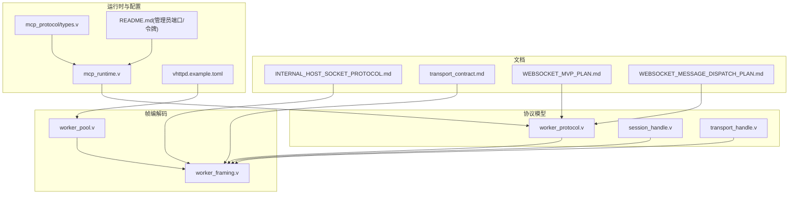
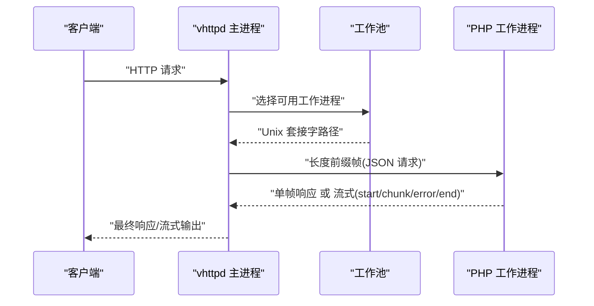
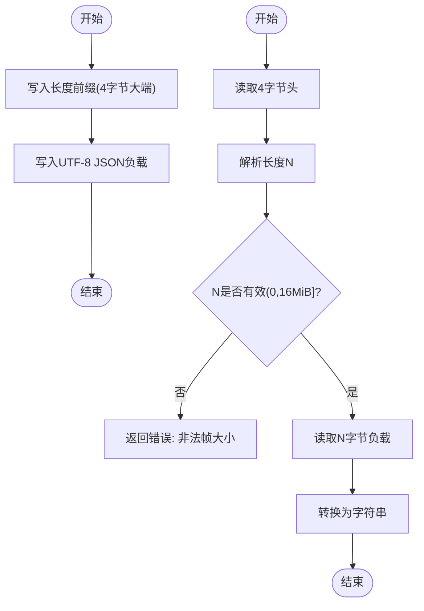
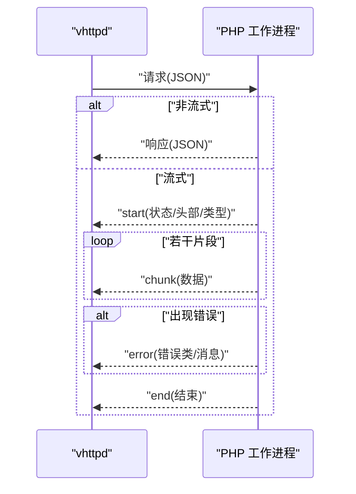
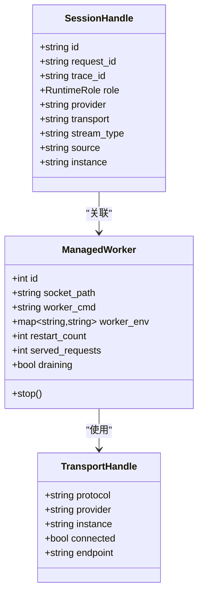
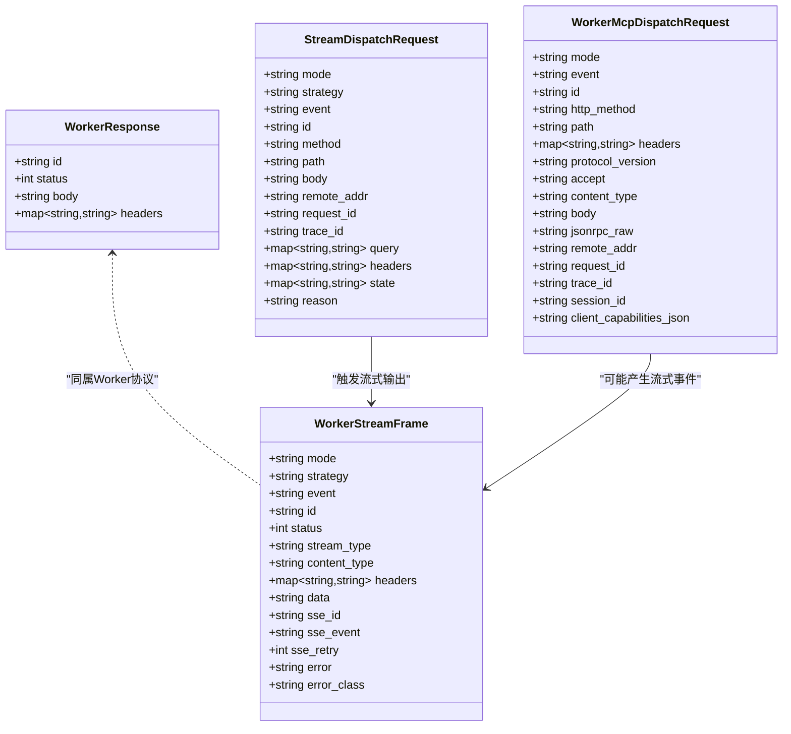
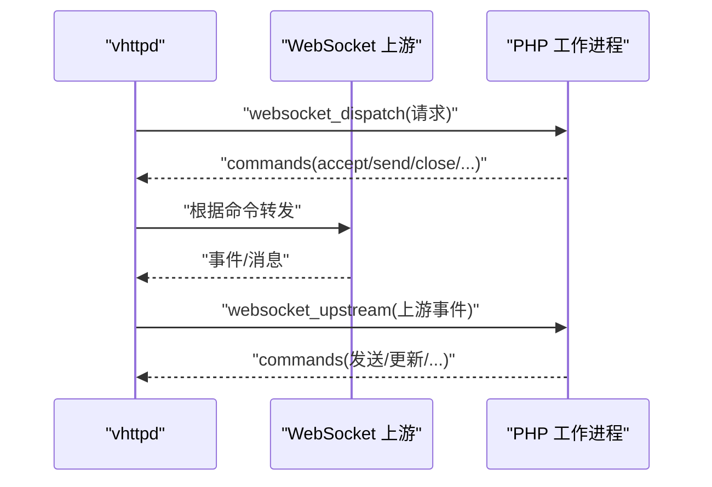
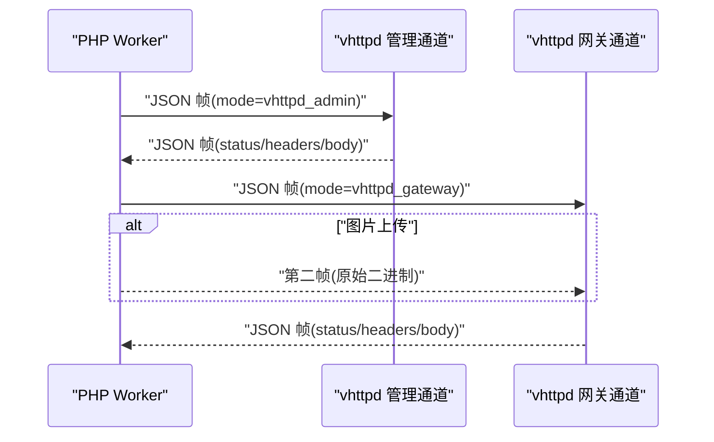
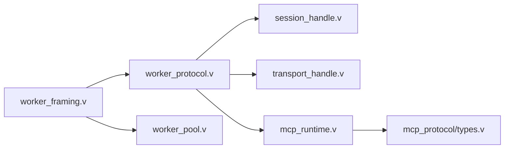

# 内部协议

<cite>
**本文引用的文件**
- [INTERNAL_HOST_SOCKET_PROTOCOL.md](file://docs/INTERNAL_HOST_SOCKET_PROTOCOL.md)
- [transport_contract.md](file://docs/transport_contract.md)
- [worker_protocol.v](file://src/transport/worker_protocol.v)
- [worker_framing.v](file://src/transport/worker_framing.v)
- [worker_pool.v](file://src/transport/worker_pool.v)
- [session_handle.v](file://src/transport/session_handle.v)
- [transport_handle.v](file://src/transport/transport_handle.v)
- [transport_contract.md](file://docs/transport_contract.md)
- [WEBSOCKET_MESSAGE_DISPATCH_PLAN.md](file://docs/WEBSOCKET_MESSAGE_DISPATCH_PLAN.md)
- [WEBSOCKET_MVP_PLAN.md](file://docs/WEBSOCKET_MVP_PLAN.md)
- [mcp_runtime.v](file://src/mcp_runtime.v)
- [mcp_protocol/types.v](file://src/mcp_protocol/types.v)
- [vhttpd.example.toml](file://config/vhttpd.example.toml)
- [README.md](file://README.md)
</cite>

## 目录
1. [简介](#简介)
2. [项目结构](#项目结构)
3. [核心组件](#核心组件)
4. [架构总览](#架构总览)
5. [详细组件分析](#详细组件分析)
6. [依赖关系分析](#依赖关系分析)
7. [性能考量](#性能考量)
8. [故障排查指南](#故障排查指南)
9. [结论](#结论)
10. [附录](#附录)

## 简介
本文件系统化阐述 vhttpd 内部通信协议，覆盖 Unix 套接字帧格式、协议版本与数据编码、工作进程与主进程的请求/响应模式与错误传播、内部消息类型与序列化格式、压缩策略、协议升级与向后兼容、调试与分析方法、安全与访问控制，以及面向插件开发者的协议扩展指南。目标读者既包括需要深入理解实现细节的技术人员，也包括希望基于该协议进行扩展或集成的开发者。

## 项目结构
围绕内部协议的关键代码与文档分布如下：
- 文档层：内部主机套接字协议说明、传输契约文档
- 协议模型层：Worker 请求/流式帧/WS/MCP 协议结构定义
- 帧编解码层：Unix 套接字帧读写、长度前缀、JSON 编解码
- 运行时层：会话句柄、传输句柄、工作池管理
- 配置与示例：运行参数、示例配置、示例调用

**图表来源**
- [INTERNAL_HOST_SOCKET_PROTOCOL.md:1-105](file://docs/INTERNAL_HOST_SOCKET_PROTOCOL.md#L1-L105)
- [transport_contract.md:1-190](file://docs/transport_contract.md#L1-L190)
- [worker_protocol.v:1-276](file://src/transport/worker_protocol.v#L1-L276)
- [worker_framing.v:1-225](file://src/transport/worker_framing.v#L1-L225)
- [worker_pool.v:1-183](file://src/transport/worker_pool.v#L1-L183)
- [session_handle.v:1-90](file://src/transport/session_handle.v#L1-L90)
- [transport_handle.v:1-21](file://src/transport/transport_handle.v#L1-L21)
- [WEBSOCKET_MVP_PLAN.md:149-242](file://docs/WEBSOCKET_MVP_PLAN.md#L149-L242)
- [WEBSOCKET_MESSAGE_DISPATCH_PLAN.md:131-219](file://docs/WEBSOCKET_MESSAGE_DISPATCH_PLAN.md#L131-L219)
- [mcp_runtime.v:149-187](file://src/mcp_runtime.v#L149-L187)
- [mcp_protocol/types.v:1-63](file://src/mcp_protocol/types.v#L1-L63)
- [vhttpd.example.toml:1-67](file://config/vhttpd.example.toml#L1-L67)
- [README.md:1187-1221](file://README.md#L1187-L1221)

**章节来源**
- [INTERNAL_HOST_SOCKET_PROTOCOL.md:1-105](file://docs/INTERNAL_HOST_SOCKET_PROTOCOL.md#L1-L105)
- [transport_contract.md:1-190](file://docs/transport_contract.md#L1-L190)
- [worker_protocol.v:1-276](file://src/transport/worker_protocol.v#L1-L276)
- [worker_framing.v:1-225](file://src/transport/worker_framing.v#L1-L225)
- [worker_pool.v:1-183](file://src/transport/worker_pool.v#L1-L183)
- [session_handle.v:1-90](file://src/transport/session_handle.v#L1-L90)
- [transport_handle.v:1-21](file://src/transport/transport_handle.v#L1-L21)
- [WEBSOCKET_MVP_PLAN.md:149-242](file://docs/WEBSOCKET_MVP_PLAN.md#L149-L242)
- [WEBSOCKET_MESSAGE_DISPATCH_PLAN.md:131-219](file://docs/WEBSOCKET_MESSAGE_DISPATCH_PLAN.md#L131-L219)
- [mcp_runtime.v:149-187](file://src/mcp_runtime.v#L149-L187)
- [mcp_protocol/types.v:1-63](file://src/mcp_protocol/types.v#L1-L63)
- [vhttpd.example.toml:1-67](file://config/vhttpd.example.toml#L1-L67)
- [README.md:1187-1221](file://README.md#L1187-L1221)

## 核心组件
- 帧编解码与传输
  - 长度前缀帧格式（4 字节大端整型 + UTF-8 JSON 负载）
  - 读写函数封装，含边界校验与最大帧大小限制
- 协议模型
  - Worker 请求/响应、流式帧、WebSocket/MCP 协议结构
  - 会话句柄与传输句柄抽象
- 工作池与生命周期
  - 自动启动、探活、重启退避、信号终止
- 文档与契约
  - 传输契约版本、兼容规则、生产部署建议
  - 主机套接字协议（PHP Worker 管理/网关通道）

**章节来源**
- [worker_framing.v:10-60](file://src/transport/worker_framing.v#L10-L60)
- [worker_protocol.v:4-276](file://src/transport/worker_protocol.v#L4-L276)
- [session_handle.v:10-90](file://src/transport/session_handle.v#L10-L90)
- [transport_handle.v:3-21](file://src/transport/transport_handle.v#L3-L21)
- [worker_pool.v:74-166](file://src/transport/worker_pool.v#L74-L166)
- [transport_contract.md:10-42](file://docs/transport_contract.md#L10-L42)
- [INTERNAL_HOST_SOCKET_PROTOCOL.md:12-105](file://docs/INTERNAL_HOST_SOCKET_PROTOCOL.md#L12-L105)

## 架构总览
vhttpd 通过 Unix 套接字与 PHP 工作进程通信，采用“请求/响应”与“流式事件”两种模式。主进程负责路由、会话管理、错误分类与传播；工作进程负责业务逻辑执行与结果回传。

**图表来源**
- [worker_framing.v:10-60](file://src/transport/worker_framing.v#L10-L60)
- [transport_contract.md:44-167](file://docs/transport_contract.md#L44-L167)
- [worker_pool.v:142-166](file://src/transport/worker_pool.v#L142-L166)

## 详细组件分析

### 帧格式与编码
- 帧格式
  - 4 字节大端长度 N
  - 随后紧跟精确长度 N 的 UTF-8 JSON 负载
- 读写流程
  - 写入：计算长度 → 写入 4 字节头 → 写入 JSON 字符串
  - 读取：先读 4 字节头解析长度 → 校验范围 → 读取指定长度字节并转字符串
- 边界与安全
  - 最大帧大小限制（例如 16 MiB），异常时返回错误
  - EOF 检测与错误传播

**图表来源**
- [worker_framing.v:14-60](file://src/transport/worker_framing.v#L14-L60)

**章节来源**
- [worker_framing.v:10-60](file://src/transport/worker_framing.v#L10-L60)
- [transport_contract.md:33-42](file://docs/transport_contract.md#L33-L42)

### 请求/响应模式与错误传播
- 请求
  - JSON 结构包含 id、method、path、body、scheme、host、port、protocol_version、remote_addr、query、headers、cookies、attributes、server、uploaded_files 等字段
- 响应
  - 非流式：包含 id、status、headers、body
  - 流式：以 mode=stream 的 start/chunk/error/end 事件序列表示
- 错误传播
  - 流式错误帧包含 error_class 与 error 字段
  - HTTP 层面可通过状态码与错误类进行分类与告警

**图表来源**
- [transport_contract.md:44-167](file://docs/transport_contract.md#L44-L167)

**章节来源**
- [transport_contract.md:44-167](file://docs/transport_contract.md#L44-L167)

### 工作进程与主进程通信规范
- 通道与角色
  - 主进程维护工作池，按轮询/选择策略分配请求
  - 工作进程通过 Unix 套接字接收请求，执行后回传响应
- 生命周期与自愈
  - 支持自动启动、探活、重启退避、信号终止
  - 配置项如 read_timeout_ms、pool_size、max_requests、restart_backoff_ms 等
- 会话与传输
  - 会话句柄记录 trace_id、request_id、role、provider、transport、stream_type、source、instance
  - 传输句柄描述协议、实例、连接状态与端点

**图表来源**
- [worker_pool.v:8-114](file://src/transport/worker_pool.v#L8-L114)
- [session_handle.v:10-90](file://src/transport/session_handle.v#L10-L90)
- [transport_handle.v:3-21](file://src/transport/transport_handle.v#L3-L21)

**章节来源**
- [worker_pool.v:74-166](file://src/transport/worker_pool.v#L74-L166)
- [session_handle.v:23-90](file://src/transport/session_handle.v#L23-L90)
- [transport_handle.v:12-21](file://src/transport/transport_handle.v#L12-L21)
- [vhttpd.example.toml:19-26](file://config/vhttpd.example.toml#L19-L26)

### 内部消息类型与序列化
- Worker 协议结构
  - WorkerResponse、WorkerStreamFrame、StreamDispatchRequest/Chunk/Response、WorkerUpstreamPlanFrame
  - WebSocket/MCP 协议结构：WorkerWebSocketFrame、WorkerWebSocketDispatchResponse、WorkerMcpDispatchRequest/Response 等
- 序列化
  - 所有帧均为 UTF-8 JSON，严格遵循契约字段
  - 流式帧包含 SSE 扩展字段（sse_id、sse_event、sse_retry）用于 SSE 输出映射

**图表来源**
- [worker_protocol.v:4-276](file://src/transport/worker_protocol.v#L4-L276)

**章节来源**
- [worker_protocol.v:4-276](file://src/transport/worker_protocol.v#L4-L276)
- [transport_contract.md:99-167](file://docs/transport_contract.md#L99-L167)

### WebSocket 与 MCP 协议
- WebSocket
  - vhttpd 与工作进程之间通过 mode=websocket_dispatch 的命令列表进行交互
  - 支持 accept/send/close/join/leave/broadcast/send_to/set_metadata 等命令
- MCP
  - JSON-RPC over HTTP，支持协议版本协商与会话管理
  - 允许来源白名单与错误分类

**图表来源**
- [WEBSOCKET_MESSAGE_DISPATCH_PLAN.md:131-169](file://docs/WEBSOCKET_MESSAGE_DISPATCH_PLAN.md#L131-L169)
- [WEBSOCKET_MVP_PLAN.md:149-242](file://docs/WEBSOCKET_MVP_PLAN.md#L149-L242)
- [mcp_runtime.v:149-187](file://src/mcp_runtime.v#L149-L187)

**章节来源**
- [WEBSOCKET_MESSAGE_DISPATCH_PLAN.md:131-219](file://docs/WEBSOCKET_MESSAGE_DISPATCH_PLAN.md#L131-L219)
- [WEBSOCKET_MVP_PLAN.md:149-242](file://docs/WEBSOCKET_MVP_PLAN.md#L149-L242)
- [mcp_runtime.v:149-187](file://src/mcp_runtime.v#L149-L187)
- [mcp_protocol/types.v:9-63](file://src/mcp_protocol/types.v#L9-L63)

### 主机套接字协议（PHP Worker 管理/网关）
- 注入环境变量 VHTTPD_INTERNAL_ADMIN_SOCKET 到受管 PHP 工作进程
- 通信模式
  - vhttpd_admin：只读查询
  - vhttpd_gateway：主动网关操作（如 Feishu 发送/上传）
- 帧结构
  - 首帧为 JSON 对象，包含 mode/method/path/query/body
  - 图片上传支持两帧请求（JSON 头 + 原始二进制），或兼容旧版 base64 JSON
- 响应
  - 统一为单帧 JSON，包含 status/headers/body/error

**图表来源**
- [INTERNAL_HOST_SOCKET_PROTOCOL.md:3-105](file://docs/INTERNAL_HOST_SOCKET_PROTOCOL.md#L3-L105)

**章节来源**
- [INTERNAL_HOST_SOCKET_PROTOCOL.md:12-105](file://docs/INTERNAL_HOST_SOCKET_PROTOCOL.md#L12-L105)

### 协议版本与升级、向后兼容
- 当前传输契约版本：v1
- 兼容规则
  - 新增字段为可选，旧对等方可忽略
  - 同版本内不得变更既有字段语义
  - 删除/重命名必需字段属于破坏性变更（v2+）
  - v1 不支持旧版 *_json 封装字段
- 生产建议
  - 明确 worker read timeout、持久化事件日志、区分数据面与管理面端口
  - 分别验证 one-shot 与 stream 路径

**章节来源**
- [transport_contract.md:10-26](file://docs/transport_contract.md#L10-L26)
- [transport_contract.md:168-190](file://docs/transport_contract.md#L168-L190)

### 安全与访问控制
- 管理端口访问
  - 未设置令牌时，管理端点开放于管理端口
  - 设置令牌时，需携带 x-vhttpd-admin-token 或查询参数 admin_token
- MCP 来源控制
  - 支持允许的来源列表，非法来源返回 403
  - 协议版本协商与会话管理增强安全性
- 运行时隔离
  - 固定环境变量 VHTTPD_APP，避免框架耦合

**章节来源**
- [README.md:1187-1221](file://README.md#L1187-L1221)
- [mcp_runtime.v:150-164](file://src/mcp_runtime.v#L150-L164)
- [transport_contract.md:27-32](file://docs/transport_contract.md#L27-L32)

### 插件开发者扩展指南
- 帧格式与序列化
  - 严格遵守长度前缀 + UTF-8 JSON
  - 使用现有结构体作为参考，新增字段保持向后兼容
- 流式输出
  - 遵循 start/chunk/error/end 事件顺序，必要时使用 SSE 扩展字段
- 错误处理
  - 在流式错误帧中提供 error_class 与 error，便于主进程分类与告警
- 会话与追踪
  - 正确传递/透传 id/request_id/trace_id，确保端到端可观测
- MCP/WebSocket
  - 若接入 MCP，遵循 JSON-RPC 与会话管理约定；若接入 WebSocket，使用命令列表模式

**章节来源**
- [worker_protocol.v:4-276](file://src/transport/worker_protocol.v#L4-L276)
- [transport_contract.md:99-167](file://docs/transport_contract.md#L99-L167)
- [WEBSOCKET_MESSAGE_DISPATCH_PLAN.md:173-187](file://docs/WEBSOCKET_MESSAGE_DISPATCH_PLAN.md#L173-L187)
- [mcp_runtime.v:165-187](file://src/mcp_runtime.v#L165-L187)

## 依赖关系分析
- 组件耦合
  - worker_framing.v 提供底层帧 I/O，被所有上层协议模块依赖
  - worker_protocol.v 定义协议结构，被 MCP/WebSocket/Worker 流程共享
  - worker_pool.v 与 session_handle.v/transport_handle.v 协同完成生命周期与会话管理
- 外部依赖
  - Unix 套接字、HTTP/URL 解析、JSON 编解码
- 潜在循环
  - 当前模块间无直接循环导入，结构清晰

**图表来源**
- [worker_framing.v:1-225](file://src/transport/worker_framing.v#L1-L225)
- [worker_protocol.v:1-276](file://src/transport/worker_protocol.v#L1-L276)
- [worker_pool.v:1-183](file://src/transport/worker_pool.v#L1-L183)
- [session_handle.v:1-90](file://src/transport/session_handle.v#L1-L90)
- [transport_handle.v:1-21](file://src/transport/transport_handle.v#L1-L21)
- [mcp_runtime.v:149-187](file://src/mcp_runtime.v#L149-L187)
- [mcp_protocol/types.v:1-63](file://src/mcp_protocol/types.v#L1-L63)

**章节来源**
- [worker_framing.v:1-225](file://src/transport/worker_framing.v#L1-L225)
- [worker_protocol.v:1-276](file://src/transport/worker_protocol.v#L1-L276)
- [worker_pool.v:1-183](file://src/transport/worker_pool.v#L1-L183)
- [session_handle.v:1-90](file://src/transport/session_handle.v#L1-L90)
- [transport_handle.v:1-21](file://src/transport/transport_handle.v#L1-L21)
- [mcp_runtime.v:149-187](file://src/mcp_runtime.v#L149-L187)
- [mcp_protocol/types.v:1-63](file://src/mcp_protocol/types.v#L1-L63)

## 性能考量
- 帧大小限制与内存占用
  - 严格限制最大帧大小，避免 OOM
- 流式输出优化
  - SSE 类型映射与 passthrough 模式的选择
  - HEAD 请求不写入 body 片段
- 工作池与退避
  - 合理设置 restart_backoff_ms 与 restart_backoff_max_ms，降低抖动
- 运维观测
  - 记录事件日志，分类 x-vhttpd-error-class 与 worker 错误类

**章节来源**
- [worker_framing.v:56-58](file://src/transport/worker_framing.v#L56-L58)
- [transport_contract.md:162-167](file://docs/transport_contract.md#L162-L167)
- [vhttpd.example.toml:25-26](file://config/vhttpd.example.toml#L25-L26)
- [transport_contract.md:168-190](file://docs/transport_contract.md#L168-L190)

## 故障排查指南
- 常见问题定位
  - 帧大小异常：检查长度前缀与负载一致性
  - EOF/连接中断：确认工作进程存活与 socket 探活
  - 流式错误：查看 error_class 与 error 字段，结合状态码定位
- 运维工具
  - 使用示例配置中的端口与令牌进行本地验证
  - 通过管理端口获取工作池状态与诊断信息
- 日志与追踪
  - 保留事件日志，结合 x-request-id/x-vhttpd-trace-id 进行关联

**章节来源**
- [worker_framing.v:31-36](file://src/transport/worker_framing.v#L31-L36)
- [worker_pool.v:34-45](file://src/transport/worker_pool.v#L34-L45)
- [README.md:1204-1221](file://README.md#L1204-L1221)

## 结论
vhttpd 内部协议以简洁稳定的 Unix 套接字帧格式为基础，配合明确的请求/响应与流式事件模型，实现了主进程与工作进程间的高效协作。通过严格的版本契约、错误分类与可观测性设计，协议在保证向前兼容的同时，也为扩展与演进提供了清晰路径。对于插件与应用开发者，遵循本文档的帧格式、序列化与错误传播规范，即可平滑集成至 vhttpd 生态。

## 附录
- 示例调用与配置
  - 参考示例配置文件与 README 中的管理端口/令牌说明
- 相关文档
  - 传输契约、WebSocket 规划、MCP 运行时与类型定义

**章节来源**
- [vhttpd.example.toml:1-67](file://config/vhttpd.example.toml#L1-L67)
- [README.md:1187-1221](file://README.md#L1187-L1221)
- [WEBSOCKET_MVP_PLAN.md:149-242](file://docs/WEBSOCKET_MVP_PLAN.md#L149-L242)
- [WEBSOCKET_MESSAGE_DISPATCH_PLAN.md:131-219](file://docs/WEBSOCKET_MESSAGE_DISPATCH_PLAN.md#L131-L219)
- [mcp_runtime.v:149-187](file://src/mcp_runtime.v#L149-L187)
- [mcp_protocol/types.v:1-63](file://src/mcp_protocol/types.v#L1-L63)