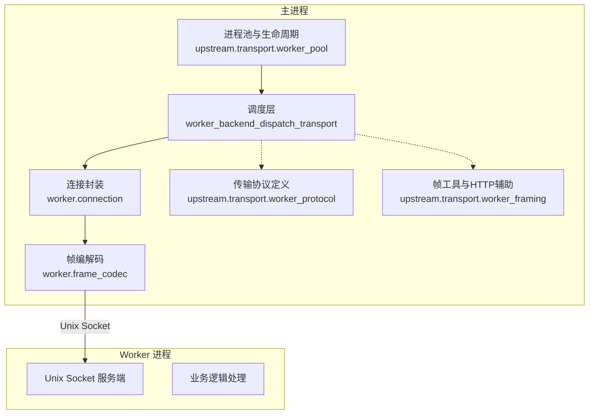
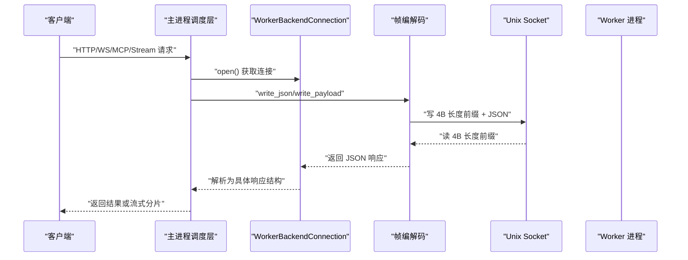
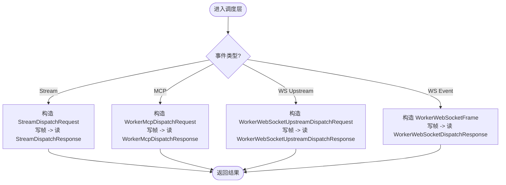
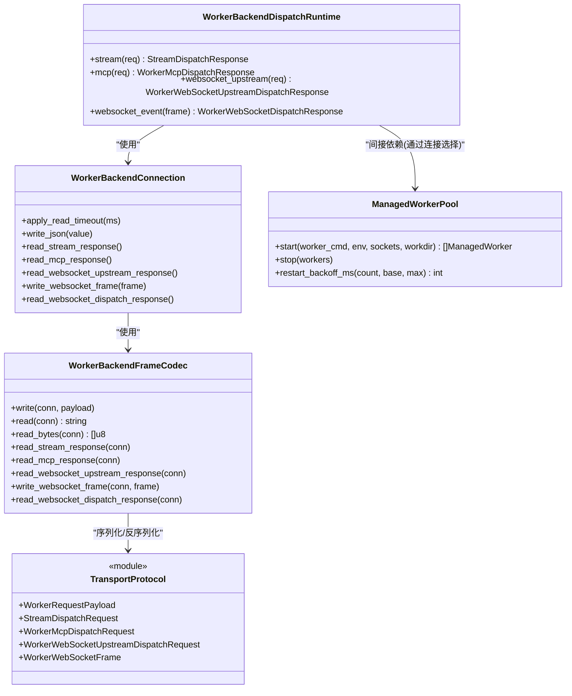

# 内部进程间通信 API

<cite>
**本文引用的文件列表**
- [INTERNAL_HOST_SOCKET_PROTOCOL.md](file://docs/INTERNAL_HOST_SOCKET_PROTOCOL.md)
- [worker_protocol.v](file://src/upstream/transport/worker_protocol.v)
- [worker_framing.v](file://src/upstream/transport/worker_framing.v)
- [frame_codec.v](file://src/worker/frame_codec.v)
- [connection.v](file://src/worker/connection.v)
- [worker_pool.v](file://src/upstream/transport/worker_pool.v)
- [worker_backend_dispatch_transport.v](file://src/worker_backend_dispatch_transport.v)
- [worker_backend_dispatch.v](file://src/worker_backend_dispatch.v)
- [README.md](file://README.md)
</cite>

## 目录
1. [简介](#简介)
2. [项目结构](#项目结构)
3. [核心组件](#核心组件)
4. [架构总览](#架构总览)
5. [详细组件分析](#详细组件分析)
6. [依赖关系分析](#依赖关系分析)
7. [性能与内存优化](#性能与内存优化)
8. [故障诊断与排错](#故障诊断与排错)
9. [结论](#结论)
10. [附录：IPC 协议规范](#附录ipc-协议规范)

## 简介
本文件系统化梳理 vhttpd 内部各组件间的进程间通信（IPC）机制，重点覆盖：
- Unix Socket 传输与帧格式
- Worker 进程与主进程的请求/响应语义
- 任务分发、状态同步与心跳检测
- 进程池管理、负载均衡与故障转移
- 错误传播与可观测性
- 性能优化策略、内存管理与调试方法

vhttpd 通过 Unix Domain Socket 将主进程（控制面/数据面）与外部 Worker 进程（如 PHP/C++ 执行器）解耦，采用“长度前缀 + JSON 负载”的轻量帧协议，支持 HTTP、流式、MCP、WebSocket 等多种业务通道。

## 项目结构
与 IPC 相关的核心代码主要分布在以下模块：
- 传输层与帧编解码：upstream.transport.worker_framing、worker_protocol、worker.frame_codec
- 连接封装：worker.connection
- 调度与路由：worker_backend_dispatch_transport、worker_backend_dispatch
- 进程池与生命周期：upstream.transport.worker_pool、worker_backend_lifecycle_runtime、admin_workers
- 文档：docs/INTERNAL_HOST_SOCKET_PROTOCOL.md

图表来源
- [worker_backend_dispatch_transport.v:1-101](file://src/worker_backend_dispatch_transport.v#L1-L101)
- [connection.v:1-59](file://src/worker/connection.v#L1-L59)
- [frame_codec.v:1-73](file://src/worker/frame_codec.v#L1-L73)
- [worker_protocol.v:1-277](file://src/upstream/transport/worker_protocol.v#L1-L277)
- [worker_framing.v:1-231](file://src/upstream/transport/worker_framing.v#L1-L231)
- [worker_pool.v:1-219](file://src/upstream/transport/worker_pool.v#L1-L219)

章节来源
- [worker_backend_dispatch_transport.v:1-101](file://src/worker_backend_dispatch_transport.v#L1-L101)
- [connection.v:1-59](file://src/worker/connection.v#L1-L59)
- [frame_codec.v:1-73](file://src/worker/frame_codec.v#L1-L73)
- [worker_protocol.v:1-277](file://src/upstream/transport/worker_protocol.v#L1-L277)
- [worker_framing.v:1-231](file://src/upstream/transport/worker_framing.v#L1-L231)
- [worker_pool.v:1-219](file://src/upstream/transport/worker_pool.v#L1-L219)

## 核心组件
- 帧编解码器：负责在 Unix Socket 上以“4字节大端长度前缀 + 负载”的方式读写消息体，并对 JSON 进行编解码。
- 连接封装：对底层 unix.StreamConn 做统一封装，提供按业务类型读取/写入的方法。
- 协议数据结构：统一定义了 HTTP、Stream、MCP、WebSocket 等场景的请求/响应帧结构。
- 调度层：根据事件类型选择对应 Worker 后端接口，设置超时并发送/接收消息。
- 进程池：负责启动、停止、重启 Worker 子进程，维护 socket 就绪等待、优雅退出与退避重试。

章节来源
- [frame_codec.v:1-73](file://src/worker/frame_codec.v#L1-L73)
- [connection.v:1-59](file://src/worker/connection.v#L1-L59)
- [worker_protocol.v:1-277](file://src/upstream/transport/worker_protocol.v#L1-L277)
- [worker_backend_dispatch_transport.v:1-101](file://src/worker_backend_dispatch_transport.v#L1-L101)
- [worker_pool.v:1-219](file://src/upstream/transport/worker_pool.v#L1-L219)

## 架构总览
下图展示了从主进程到 Worker 的端到端调用路径，涵盖 HTTP/Stream/MCP/WebSocket 四类通道。

图表来源
- [worker_backend_dispatch_transport.v:36-80](file://src/worker_backend_dispatch_transport.v#L36-L80)
- [connection.v:25-51](file://src/worker/connection.v#L25-L51)
- [frame_codec.v:9-43](file://src/worker/frame_codec.v#L9-L43)

## 详细组件分析

### 帧格式与二进制交换
- 帧头：4 字节大端整数，表示后续负载字节数。
- 负载：通常为 JSON 文本；对于图片上传等场景，支持两帧模式（首帧 JSON 头，第二帧原始二进制）。
- 最大帧大小限制：实现中校验 size > 0 且不超过固定上限，防止异常大帧导致资源耗尽。
- 二进制安全：由于长度前缀精确界定边界，天然支持任意二进制负载。

章节来源
- [frame_codec.v:9-43](file://src/worker/frame_codec.v#L9-L43)
- [INTERNAL_HOST_SOCKET_PROTOCOL.md:12-88](file://docs/INTERNAL_HOST_SOCKET_PROTOCOL.md#L12-L88)

### 连接封装与读写
- 连接对象封装 unix.StreamConn，暴露 write_json、read_* 等方法，屏蔽底层细节。
- 支持设置读超时，避免阻塞等待。
- 针对不同类型响应提供专用读取方法，自动完成 JSON 反序列化为对应结构体。

章节来源
- [connection.v:15-51](file://src/worker/connection.v#L15-L51)
- [frame_codec.v:45-73](file://src/worker/frame_codec.v#L45-L73)

### 协议数据结构
- HTTP 请求载荷：包含 method/path/body/query/headers/cookies/server 等字段，便于 Worker 侧重建完整 HTTP 上下文。
- Stream 帧：支持 start/chunk/done 事件，携带 stream_type/content_type 及 SSE 相关字段。
- MCP 请求/响应：封装 jsonrpc_raw、protocol_version、session_id 等元信息。
- WebSocket 上游命令：用于将上游事件转换为统一的命令派发结构，支持 provider/instance/target 等维度。

章节来源
- [worker_protocol.v:95-112](file://src/upstream/transport/worker_protocol.v#L95-L112)
- [worker_protocol.v:12-72](file://src/upstream/transport/worker_protocol.v#L12-L72)
- [worker_protocol.v:186-221](file://src/upstream/transport/worker_protocol.v#L186-L221)
- [worker_protocol.v:223-276](file://src/upstream/transport/worker_protocol.v#L223-L276)

### 调度层与任务分发
- 调度入口：根据事件类型选择 stream/mcp/websocket_upstream/websocket_event 分支。
- 超时控制：基于引擎配置动态设置 read timeout。
- 日志与追踪：记录关键分发动作，便于问题定位。
- 统一命令派发：将不同来源的上游事件归一化后下发至逻辑执行器。

图表来源
- [worker_backend_dispatch_transport.v:36-80](file://src/worker_backend_dispatch_transport.v#L36-L80)

章节来源
- [worker_backend_dispatch_transport.v:1-101](file://src/worker_backend_dispatch_transport.v#L1-L101)
- [worker_backend_dispatch.v:1-66](file://src/worker_backend_dispatch.v#L1-L66)

### 进程池管理、负载均衡与故障转移
- 进程启动：根据 worker_cmd 与 --socket/--worker-sockets 参数生成实际命令，注入父进程 PID 与工作目录。
- 就绪等待：启动后轮询连接目标 socket，直至成功或超时。
- 优雅退出：先向进程组发送 SIGTERM，再 SIGKILL，确保清理。
- 重启退避：基于 restart_count 计算指数退避延迟，避免雪崩。
- 健康探测：通过连接探测与 inflight/served_requests 统计评估可用性。
- 负载均衡：多 socket 时由上层选择器决定具体 Worker（例如 round-robin 或最少连接），当前实现提供诊断信息与选择指标。

章节来源
- [worker_pool.v:63-93](file://src/upstream/transport/worker_pool.v#L63-L93)
- [worker_pool.v:103-136](file://src/upstream/transport/worker_pool.v#L103-L136)
- [worker_pool.v:155-176](file://src/upstream/transport/worker_pool.v#L155-L176)
- [worker_pool.v:178-219](file://src/upstream/transport/worker_pool.v#L178-L219)

### 心跳检测与状态同步
- 心跳检测：通过“连接探测 + 读超时”间接实现存活检查；未实现显式心跳帧。
- 状态同步：主进程维护每个 Worker 的 served_requests/inflight_requests/drain 标志，结合事件日志输出运行态。
- 建议扩展：可在帧协议中增加 keepalive/ping-pong 帧，提升弱网下的故障发现速度。

章节来源
- [worker_pool.v:37-59](file://src/upstream/transport/worker_pool.v#L37-L59)
- [worker_pool.v:178-219](file://src/upstream/transport/worker_pool.v#L178-L219)

### 错误传播机制
- 结构化错误：响应结构中提供 error 与 error_class 字段，便于上层分类处理。
- 超时与 EOF：帧读取失败会返回明确错误，触发重试或降级。
- 业务错误：Worker 侧可将业务异常编码进 error/error_class，主进程据此统计与告警。

章节来源
- [worker_protocol.v:57-72](file://src/upstream/transport/worker_protocol.v#L57-L72)
- [worker_protocol.v:206-221](file://src/upstream/transport/worker_protocol.v#L206-L221)
- [worker_protocol.v:264-276](file://src/upstream/transport/worker_protocol.v#L264-L276)

## 依赖关系分析
- 调度层依赖连接封装与帧编解码，连接封装依赖底层 unix.StreamConn。
- 协议结构集中定义于 transport 模块，被 frame_codec 与 connection 复用。
- 进程池独立于调度层，通过 socket_path 与 Worker 建立连接。

图表来源
- [worker_backend_dispatch_transport.v:1-101](file://src/worker_backend_dispatch_transport.v#L1-L101)
- [connection.v:1-59](file://src/worker/connection.v#L1-L59)
- [frame_codec.v:1-73](file://src/worker/frame_codec.v#L1-L73)
- [worker_protocol.v:1-277](file://src/upstream/transport/worker_protocol.v#L1-L277)
- [worker_pool.v:1-219](file://src/upstream/transport/worker_pool.v#L1-L219)

章节来源
- [worker_backend_dispatch_transport.v:1-101](file://src/worker_backend_dispatch_transport.v#L1-L101)
- [connection.v:1-59](file://src/worker/connection.v#L1-L59)
- [frame_codec.v:1-73](file://src/worker/frame_codec.v#L1-L73)
- [worker_protocol.v:1-277](file://src/upstream/transport/worker_protocol.v#L1-L277)
- [worker_pool.v:1-219](file://src/upstream/transport/worker_pool.v#L1-L219)

## 性能与内存优化
- 零拷贝倾向：长度前缀+字符串直接写入，减少中间复制；JSON 序列化集中在 codec 层。
- 帧大小保护：限制单帧最大体积，避免 OOM。
- 连接复用：建议在连接池层引入短连接复用，降低握手开销（当前实现按需创建/关闭）。
- 超时与背压：合理设置 read timeout，配合队列限流，避免 Worker 过载。
- 批量与合并：对高频小消息可考虑批量化发送，降低系统调用次数。
- 监控与采样：利用事件日志与 stats 快照，识别热点路径与瓶颈点。

[本节为通用指导，不直接分析具体文件]

## 故障诊断与排错
- 常见错误
  - 连接失败：检查 worker_socket 是否就绪、权限与路径是否正确。
  - 帧过大：确认业务负载是否超过限制，必要时拆分或压缩。
  - 超时：调整 read timeout 或排查 Worker 处理耗时。
  - 频繁重启：关注 restart_count 与 next_retry_ts，检查 Worker 崩溃原因。
- 定位手段
  - 查看事件日志与 admin 统计，定位异常时间窗口。
  - 抓取 Worker 标准输出重定向日志（如 /tmp/vhttpd_php_worker_*.log）。
  - 使用 admin 接口触发单实例重启，观察恢复情况。

章节来源
- [worker_pool.v:63-74](file://src/upstream/transport/worker_pool.v#L63-L74)
- [worker_pool.v:155-176](file://src/upstream/transport/worker_pool.v#L155-L176)
- [README.md:1065-1089](file://README.md#L1065-L1089)

## 结论
vhttpd 的内部 IPC 以 Unix Socket + 长度前缀 + JSON 为核心，具备清晰的职责分层与可扩展的协议结构。通过进程池与退避重启机制，实现了高可用的 Worker 管理；通过结构化错误与事件日志，提供了良好的可观测性与排障能力。未来可在心跳、连接复用、批量化等方面进一步增强性能与健壮性。

[本节为总结，不直接分析具体文件]

## 附录：IPC 协议规范

### 传输与帧格式
- 传输介质：Unix Domain Socket
- 帧格式：4 字节大端长度前缀 + 负载字节串
- 负载内容：多为 JSON；特殊场景（如图片上传）支持两帧（首帧 JSON 头，次帧二进制）
- 最大帧大小：实现中限制上限，防止异常负载

章节来源
- [frame_codec.v:9-43](file://src/worker/frame_codec.v#L9-L43)
- [INTERNAL_HOST_SOCKET_PROTOCOL.md:12-88](file://docs/INTERNAL_HOST_SOCKET_PROTOCOL.md#L12-L88)

### 请求/响应结构概览
- HTTP 请求载荷：包含 id/method/path/body/scheme/host/port/protocol_version/remote_addr/query/headers/cookies/server/attributes/uploaded_files 等
- Stream 帧：mode/strategy/event/id/status/stream_type/content_type/headers/data/data_base64/sse_id/sse_event/sse_retry/error/error_class
- MCP 请求/响应：包含 http_method/path/headers/protocol_version/accept/content_type/body/jsonrpc_raw/remote_addr/request_id/trace_id/session_id/client_capabilities_json 等
- WebSocket 上游命令：包含 event/provider/instance/target/target_type/message_type/content/content_fields/text/uuid/metadata/type_/stream_id/session_key/task_type/prompt/method/params 等

章节来源
- [worker_protocol.v:95-112](file://src/upstream/transport/worker_protocol.v#L95-L112)
- [worker_protocol.v:12-72](file://src/upstream/transport/worker_protocol.v#L12-L72)
- [worker_protocol.v:186-221](file://src/upstream/transport/worker_protocol.v#L186-L221)
- [worker_protocol.v:223-276](file://src/upstream/transport/worker_protocol.v#L223-L276)

### 调度流程要点
- 统一入口：根据事件类型选择对应分支
- 超时控制：基于引擎配置设置读超时
- 日志追踪：记录关键分发动作与错误类
- 命令归一化：将上游事件映射为统一命令结构

章节来源
- [worker_backend_dispatch_transport.v:36-80](file://src/worker_backend_dispatch_transport.v#L36-L80)
- [worker_backend_dispatch.v:1-66](file://src/worker_backend_dispatch.v#L1-L66)

### 进程池与运维
- 启动参数：--worker-pool-size、--worker-socket/--worker-sockets、--worker-cmd、--worker-max-requests、--worker-restart-backoff-ms、--worker-restart-backoff-max-ms
- 自动注入：当 pool-size > 1 且缺少 --socket 时自动注入
- 优雅退出：SIGTERM -> SIGKILL -> wait/close
- 退避重启：基于 count 的指数退避

章节来源
- [worker_pool.v:76-93](file://src/upstream/transport/worker_pool.v#L76-L93)
- [worker_pool.v:155-176](file://src/upstream/transport/worker_pool.v#L155-L176)
- [worker_pool.v:204-219](file://src/upstream/transport/worker_pool.v#L204-L219)
- [README.md:1065-1089](file://README.md#L1065-L1089)