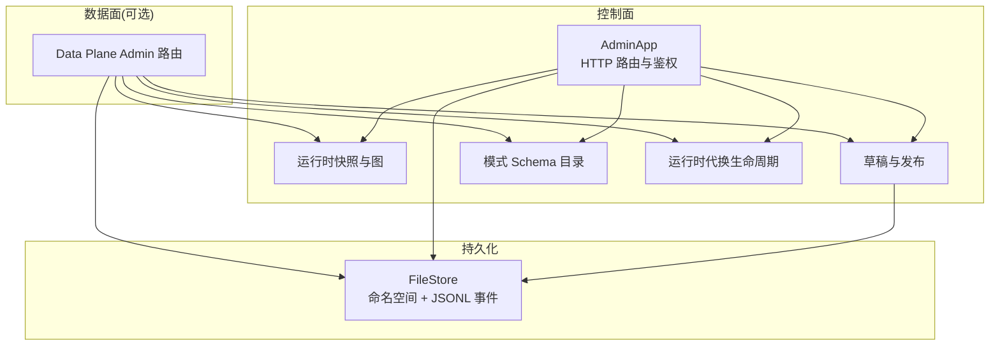
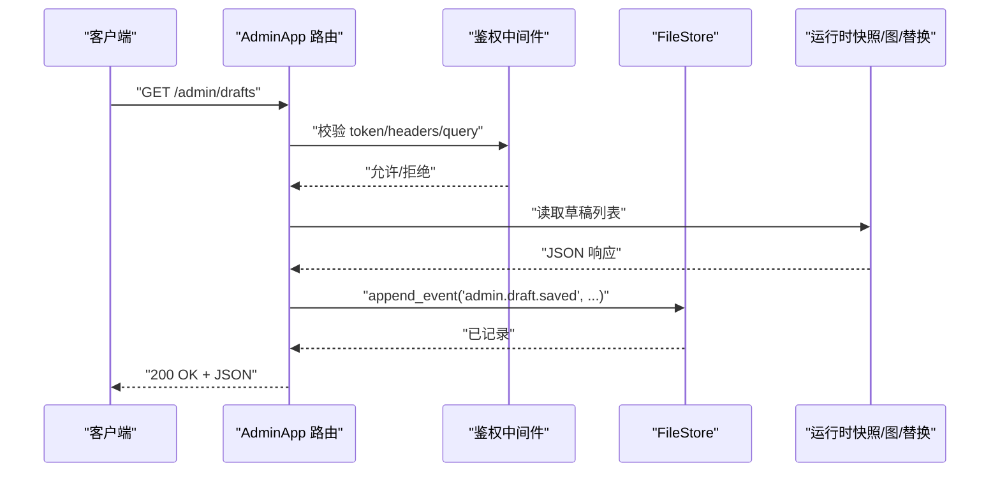
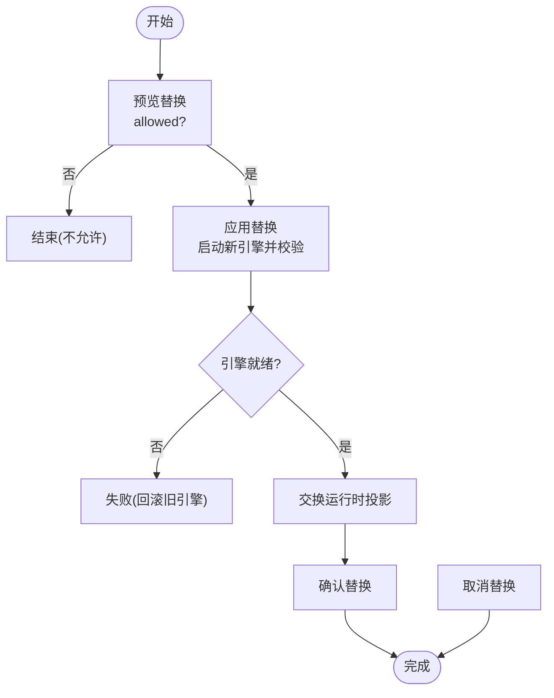
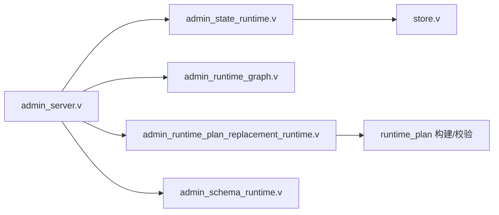

# 管理平面 API

<cite>
**本文引用的文件**
- [README.md](file://README.md)
- [ADMIN_CONTROL_PLANE_PLAN.md](file://docs/ADMIN_CONTROL_PLANE_PLAN.md)
- [admin_server.v](file://src/admin_server.v)
- [admin_runtime.v](file://src/admin_runtime.v)
- [admin_state_runtime.v](file://src/admin_state_runtime.v)
- [admin_schema_runtime.v](file://src/admin_schema_runtime.v)
- [store.v](file://src/admin_state_store/store.v)
- [admin_runtime_graph.v](file://src/admin_runtime_graph.v)
- [admin_runtime_plan_replacement_runtime.v](file://src/admin_runtime_plan_replacement_runtime.v)
- [admin.toml](file://admin/admin.toml)
</cite>

## 目录
1. [简介](#简介)
2. [项目结构](#项目结构)
3. [核心组件](#核心组件)
4. [架构总览](#架构总览)
5. [详细组件分析](#详细组件分析)
6. [依赖关系分析](#依赖关系分析)
7. [性能与可扩展性](#性能与可扩展性)
8. [故障排查指南](#故障排查指南)
9. [结论](#结论)
10. [附录：API 参考与调用示例](#附录api-参考与调用示例)

## 简介
本文件系统化梳理 vhttpd 的管理平面（控制面）API，覆盖系统状态查询、配置管理、运行时控制、日志查看、健康检查、性能指标收集、告警与事件等运维相关能力。文档同时说明认证授权机制、权限控制模型、操作审计日志、安全配置与访问控制策略，并提供批量操作方法与自动化集成建议。

## 项目结构
管理平面由“控制面 HTTP 服务”、“数据面可选暴露”、“持久化存储”、“运行时图与替换流程”、“模式元数据”等模块组成。关键入口位于 admin 监听器与路由注册处，并通过共享 App 实例访问运行时快照、计划与替换状态。

图示来源
- [admin_server.v:1-120](file://src/admin_server.v#L1-L120)
- [admin_runtime.v:1-120](file://src/admin_runtime.v#L1-L120)
- [store.v:1-194](file://src/admin_state_store/store.v#L1-L194)

章节来源
- [admin_server.v:1-120](file://src/admin_server.v#L1-L120)
- [admin_runtime.v:1-120](file://src/admin_runtime.v#L1-L120)
- [store.v:1-194](file://src/admin_state_store/store.v#L1-L194)

## 核心组件
- 控制面 HTTP 服务与鉴权：提供 /health、/admin/* 路由，统一鉴权与审计输出。
- 数据面可选暴露：当启用 on_data_plane 时，在数据面也暴露部分只读接口。
- 运行时快照与图：返回运行时拓扑、连接、会话、上游、WebSocket、MCP 等快照。
- 草稿与发布：创建/更新/删除/验证/对比/发布配置或源码草稿，支持回滚保护。
- 模式 Schema：为 UI 表单生成提供领域元数据（listeners、resources、engines、adapters、transforms、policies、providers、pipelines、relays）。
- 运行时代换：预览、应用、确认、取消一次运行时计划替换，保证热切换安全。
- 持久化存储：基于文件的命名空间键值与追加式事件日志，原子写入与并发锁。

章节来源
- [admin_server.v:1-120](file://src/admin_server.v#L1-L120)
- [admin_runtime.v:1-120](file://src/admin_runtime.v#L1-L120)
- [admin_state_runtime.v:1-200](file://src/admin_state_runtime.v#L1-L200)
- [admin_schema_runtime.v:1-120](file://src/admin_schema_runtime.v#L1-L120)
- [admin_runtime_graph.v:1-120](file://src/admin_runtime_graph.v#L1-L120)
- [admin_runtime_plan_replacement_runtime.v:1-110](file://src/admin_runtime_plan_replacement_runtime.v#L1-L110)
- [store.v:1-194](file://src/admin_state_store/store.v#L1-L194)

## 架构总览
控制面通过独立监听器暴露管理接口；所有写操作均经过鉴权并记录审计事件；运行时图与替换流程确保变更可预览、可回滚；Schema 驱动 UI 自动生成表单与校验提示。

图示来源
- [admin_server.v:100-185](file://src/admin_server.v#L100-L185)
- [store.v:111-153](file://src/admin_state_store/store.v#L111-L153)

## 详细组件分析

### 认证与授权
- 鉴权入口：每个管理端点均调用统一的鉴权函数，从请求头与查询参数中解析令牌。
- 失败处理：未通过鉴权的请求返回 403 并附带错误码。
- 审计：成功与失败的请求均会附加 metadata 到统一的事件投递通道，便于集中审计。

章节来源
- [admin_server.v:101-109](file://src/admin_server.v#L101-L109)
- [admin_server.v:93-115](file://src/admin_server.v#L93-L115)
- [admin_server.v:43-73](file://src/admin_server.v#L43-L73)

### 健康检查
- GET /health：返回 200 OK，用于进程存活探测。

章节来源
- [admin_server.v:111-115](file://src/admin_server.v#L111-L115)
- [README.md:1147-1152](file://README.md#L1147-L1152)

### 运行时观测接口
- GET /admin/workers：工作池快照
- GET /admin/stats：进程级计数器
- GET /admin/runtime：运行时能力与活跃连接/会话计数
- GET /admin/runtime/upstreams：阶段三上游会话（支持 details/limit/offset/role/provider 过滤）
- GET /admin/runtime/websockets：WebSocket 连接与房间快照（支持 details/limit/offset/room/conn_id 过滤）
- GET /admin/runtime/mcp：MCP 会话快照（支持 details/limit/offset/session_id/protocol_version 过滤）
- GET /admin/runtime/graph：运行时拓扑图节点与边
- GET /admin/events：最近事件列表（支持 limit）
- GET /admin/providers：已注册提供者名称列表
- GET /admin/executors：执行器规格快照
- GET /admin/providers/specs：提供者规格快照
- GET /admin/providers/runtimes：提供者运行时快照
- GET /admin/runtime/provider-instances：提供者实例列表（支持 provider 过滤）
- POST /admin/runtime/events：向运行时派发事件（异步 202）
- GET /admin/runtime/codex、/feishu、/db、/cache：特定提供者运行时快照

章节来源
- [admin_server.v:117-800](file://src/admin_server.v#L117-L800)
- [admin_runtime.v:7-673](file://src/admin_runtime.v#L7-L673)
- [README.md:1147-1185](file://README.md#L1147-L1185)

### 配置与草稿管理
- GET /admin/schema：列出所有可编辑域及其字段元数据
- GET /admin/schema/:domain 与 /admin/schema/:domain/:kind：按域/类型获取字段定义
- GET /admin/drafts：列出草稿
- POST /admin/drafts：创建草稿
- GET /admin/drafts/:id：获取草稿
- PUT /admin/drafts/:id：更新草稿
- DELETE /admin/drafts/:id：删除草稿
- POST /admin/drafts/:id/validate：编译并校验草稿（返回诊断与统计）
- GET /admin/drafts/:id/diff：对比当前计划与草稿差异（含策略与影响范围）
- GET /admin/config/files：列出主配置及 include 的配置文件
- POST /admin/config/files/draft：打开某配置文件的草稿
- GET /admin/source/files：列出受管源码文件（TS/JS/TOML）
- POST /admin/source/files/draft：打开某源码文件的草稿
- POST /admin/source/drafts/:id/publish：将源码草稿发布到目标路径（带语言识别与回滚保护）

章节来源
- [admin_server.v:235-468](file://src/admin_server.v#L235-L468)
- [admin_runtime.v:75-357](file://src/admin_runtime.v#L75-L357)
- [admin_state_runtime.v:124-569](file://src/admin_state_runtime.v#L124-L569)
- [admin_schema_runtime.v:37-120](file://src/admin_schema_runtime.v#L37-L120)

### 运行时代换（部署流水线）
- GET /admin/runtime/plan/replacement：预览替换是否允许
- GET /admin/runtime/plan/replacement/state：获取替换状态机快照
- POST /admin/runtime/plan/replacement/apply：应用替换（启动新引擎、校验就绪后交换）
- POST /admin/runtime/plan/replacement/finalize：确认替换完成
- POST /admin/runtime/plan/replacement/cancel：取消替换

图示来源
- [admin_runtime_plan_replacement_runtime.v:8-58](file://src/admin_runtime_plan_replacement_runtime.v#L8-L58)
- [admin_server.v:470-557](file://src/admin_server.v#L470-L557)

章节来源
- [admin_server.v:470-557](file://src/admin_server.v#L470-L557)
- [admin_runtime_plan_replacement_runtime.v:1-110](file://src/admin_runtime_plan_replacement_runtime.v#L1-L110)

### 持久化与审计
- FileStore 提供命名空间键值存取、事件追加与读取，使用互斥锁与原子写入保障一致性。
- 默认根目录：若未显式配置 event_log，则使用 .var/vhttpd/admin；否则以 event_log 所在目录下的 admin 子目录作为根。
- 事件格式：JSONL，包含 id、type、at_unix、fields。

章节来源
- [store.v:1-194](file://src/admin_state_store/store.v#L1-L194)
- [admin_state_runtime.v:99-107](file://src/admin_state_runtime.v#L99-L107)

### 运行时图
- 节点：listener、resource、engine、adapter、transform、policy、provider、relay、pipeline
- 边：ingress、uses_transform、uses_policy、egress、uses_engine、uses_resource、uses_relay、provider_uses_engine 等
- 用途：拓扑可视化、变更前影响分析

章节来源
- [admin_runtime_graph.v:1-203](file://src/admin_runtime_graph.v#L1-L203)

## 依赖关系分析
- 控制面路由依赖 App 提供的运行时快照、替换状态、Provider 运行时、WebSocket/MCP 快照等。
- 草稿与发布依赖 admin_state_store 与 config 编译器。
- Schema 仅依赖静态元数据，不直接访问运行时。
- 替换流程依赖 executor 与 runtime_plan 构建与校验。

图示来源
- [admin_server.v:1-120](file://src/admin_server.v#L1-L120)
- [admin_state_runtime.v:1-120](file://src/admin_state_runtime.v#L1-L120)
- [admin_runtime_graph.v:1-60](file://src/admin_runtime_graph.v#L1-L60)
- [admin_runtime_plan_replacement_runtime.v:1-40](file://src/admin_runtime_plan_replacement_runtime.v#L1-L40)
- [admin_schema_runtime.v:1-60](file://src/admin_schema_runtime.v#L1-L60)
- [store.v:1-60](file://src/admin_state_store/store.v#L1-L60)

## 性能与可扩展性
- 快照接口均为只读且轻量聚合，适合高频轮询；建议客户端侧做分页与缓存。
- 事件日志采用追加式 JSONL，读取时支持 limit 限制，避免大文件全量加载。
- 替换流程先启动新引擎并校验就绪后再交换，降低停机风险。
- 如需更高吞吐，可在网关层对管理面进行限流与白名单访问控制。

[本节为通用指导，无需具体文件引用]

## 故障排查指南
- 403 禁止访问：检查 control.token 与请求头/查询参数中的令牌是否正确传递。
- 草稿校验失败：查看 /admin/drafts/:id/validate 返回的诊断信息，修正 TOML 或字段约束。
- 替换失败：检查 /admin/runtime/plan/replacement/state 的状态与错误信息，必要时 cancel 后重试。
- 事件缺失：确认 event_log 路径可写，FileStore 根目录存在且有写入权限。
- 端口冲突：确认 admin 监听器端口未被占用。

章节来源
- [admin_server.v:93-115](file://src/admin_server.v#L93-L115)
- [admin_state_runtime.v:187-202](file://src/admin_state_runtime.v#L187-L202)
- [admin_runtime_plan_replacement_runtime.v:34-89](file://src/admin_runtime_plan_replacement_runtime.v#L34-L89)
- [store.v:111-153](file://src/admin_state_store/store.v#L111-L153)

## 结论
管理平面提供了完整的运行时观测、配置草稿与发布、运行时代换、模式元数据与审计事件能力。通过严格的鉴权与原子持久化，保障了运维操作的安全性与可追溯性。建议在生产环境结合网络白名单与网关限流策略，配合自动化脚本实现安全的持续交付。

[本节为总结，无需具体文件引用]

## 附录：API 参考与调用示例

### 安全与访问控制
- 监听器与令牌：通过 admin/admin.toml 配置 control.listener 与 control.token。
- 鉴权方式：每个管理端点均要求携带有效令牌（来自请求头或查询参数），未通过鉴权返回 403。
- 审计日志：所有管理请求均附带 plane=admin 的元数据进入事件通道，便于集中审计。

章节来源
- [admin.toml:1-24](file://admin/admin.toml#L1-L24)
- [admin_server.v:101-109](file://src/admin_server.v#L101-L109)
- [admin_server.v:43-73](file://src/admin_server.v#L43-L73)

### 健康检查
- GET /health
  - 响应：200 OK
  - 用途：进程存活探测

章节来源
- [admin_server.v:111-115](file://src/admin_server.v#L111-L115)
- [README.md:1147-1152](file://README.md#L1147-L1152)

### 运行时观测
- GET /admin/workers
  - 描述：返回工作池运行时快照
  - 内容类型：application/json; charset=utf-8
- GET /admin/stats
  - 描述：返回进程级运行时计数器
  - 内容类型：application/json; charset=utf-8
- GET /admin/runtime
  - 描述：返回运行时能力与活跃连接/会话计数
  - 内容类型：application/json; charset=utf-8
- GET /admin/runtime/upstreams
  - 描述：返回阶段三上游会话
  - 查询参数：details=1, limit, offset, role, provider
  - 内容类型：application/json; charset=utf-8
- GET /admin/runtime/websockets
  - 描述：返回 WebSocket 连接与房间快照
  - 查询参数：details=1, limit, offset, room, conn_id
  - 内容类型：application/json; charset=utf-8
- GET /admin/runtime/mcp
  - 描述：返回 MCP 会话快照
  - 查询参数：details=1, limit, offset, session_id, protocol_version
  - 内容类型：application/json; charset=utf-8
- GET /admin/runtime/graph
  - 描述：返回运行时拓扑图（节点与边）
  - 内容类型：application/json; charset=utf-8
- GET /admin/events
  - 描述：返回最近事件列表
  - 查询参数：limit（默认 100，最大 1000）
  - 内容类型：application/json; charset=utf-8
- GET /admin/providers
  - 描述：返回已注册提供者名称列表
  - 内容类型：application/json; charset=utf-8
- GET /admin/executors
  - 描述：返回执行器规格快照
  - 内容类型：application/json; charset=utf-8
- GET /admin/providers/specs
  - 描述：返回提供者规格快照
  - 内容类型：application/json; charset=utf-8
- GET /admin/providers/runtimes
  - 描述：返回提供者运行时快照
  - 内容类型：application/json; charset=utf-8
- GET /admin/runtime/provider-instances
  - 描述：返回提供者实例列表
  - 查询参数：provider
  - 内容类型：application/json; charset=utf-8
- POST /admin/runtime/events
  - 描述：向运行时派发事件（异步）
  - 请求体：事件对象
  - 响应：202 Accepted，包含 pipeline/ingress/event 信息
  - 内容类型：application/json; charset=utf-8
- GET /admin/runtime/codex、/feishu、/db、/cache
  - 描述：特定提供者运行时快照
  - 内容类型：application/json; charset=utf-8

章节来源
- [admin_server.v:117-800](file://src/admin_server.v#L117-L800)
- [README.md:1147-1185](file://README.md#L1147-L1185)

### 配置与草稿
- GET /admin/schema
  - 描述：返回所有可编辑域的字段元数据
  - 内容类型：application/json; charset=utf-8
- GET /admin/schema/:domain
  - 描述：返回指定域的字段元数据
  - 内容类型：application/json; charset=utf-8
- GET /admin/schema/:domain/:kind
  - 描述：返回指定域与类型的字段元数据
  - 内容类型：application/json; charset=utf-8
- GET /admin/drafts
  - 描述：列出草稿
  - 内容类型：application/json; charset=utf-8
- POST /admin/drafts
  - 描述：创建草稿
  - 请求体：草稿内容
  - 内容类型：application/json; charset=utf-8
- GET /admin/drafts/:id
  - 描述：获取草稿
  - 内容类型：application/json; charset=utf-8
- PUT /admin/drafts/:id
  - 描述：更新草稿
  - 请求体：草稿内容
  - 内容类型：application/json; charset=utf-8
- DELETE /admin/drafts/:id
  - 描述：删除草稿
  - 内容类型：application/json; charset=utf-8
- POST /admin/drafts/:id/validate
  - 描述：编译并校验草稿
  - 响应：ok、schema_version、counts、diagnostics
  - 内容类型：application/json; charset=utf-8
- GET /admin/drafts/:id/diff
  - 描述：对比当前计划与草稿差异
  - 响应：allowed、strategy
  - 内容类型：application/json; charset=utf-8
- GET /admin/config/files
  - 描述：列出主配置与 include 的文件
  - 内容类型：application/json; charset=utf-8
- POST /admin/config/files/draft
  - 描述：打开某配置文件的草稿
  - 查询参数：path/include_path
  - 内容类型：application/json; charset=utf-8
- GET /admin/source/files
  - 描述：列出受管源码文件
  - 内容类型：application/json; charset=utf-8
- POST /admin/source/files/draft
  - 描述：打开某源码文件的草稿
  - 查询参数：path/include_path
  - 内容类型：application/json; charset=utf-8
- POST /admin/source/drafts/:id/publish
  - 描述：将源码草稿发布到目标路径
  - 查询参数：path/include_path
  - 内容类型：application/json; charset=utf-8

章节来源
- [admin_server.v:235-468](file://src/admin_server.v#L235-L468)
- [admin_runtime.v:75-357](file://src/admin_runtime.v#L75-L357)
- [admin_state_runtime.v:124-569](file://src/admin_state_runtime.v#L124-L569)
- [admin_schema_runtime.v:37-120](file://src/admin_schema_runtime.v#L37-L120)

### 运行时代换
- GET /admin/runtime/plan/replacement
  - 描述：预览替换是否允许
  - 查询参数：config/path
  - 内容类型：application/json; charset=utf-8
- GET /admin/runtime/plan/replacement/state
  - 描述：获取替换状态机快照
  - 内容类型：application/json; charset=utf-8
- POST /admin/runtime/plan/replacement/apply
  - 描述：应用替换
  - 查询参数：config/path
  - 内容类型：application/json; charset=utf-8
- POST /admin/runtime/plan/replacement/finalize
  - 描述：确认替换完成
  - 内容类型：application/json; charset=utf-8
- POST /admin/runtime/plan/replacement/cancel
  - 描述：取消替换
  - 内容类型：application/json; charset=utf-8

章节来源
- [admin_server.v:470-557](file://src/admin_server.v#L470-L557)
- [admin_runtime_plan_replacement_runtime.v:1-110](file://src/admin_runtime_plan_replacement_runtime.v#L1-L110)

### 批量操作与自动化集成
- 批量拉取快照：对 /admin/runtime/upstreams、/admin/runtime/websockets、/admin/runtime/mcp 使用 limit/offset 分页拉取，结合 room/conn_id/session_id/protocol_version 过滤。
- 批量草稿操作：遍历 /admin/drafts 列表，按需 validate/diff，再 apply/finalize。
- 事件采集：定期 GET /admin/events?limit=N 拉取最新事件，结合 type 过滤进行告警。
- 自动化脚本建议：
  - 使用环境变量注入 control.token，避免硬编码。
  - 增加重试与退避逻辑，处理临时 5xx。
  - 对敏感字段（如密码、token）进行脱敏处理。
  - 将关键操作（publish、apply、finalize、cancel）写入本地审计日志。

[本节为通用指导，无需具体文件引用]