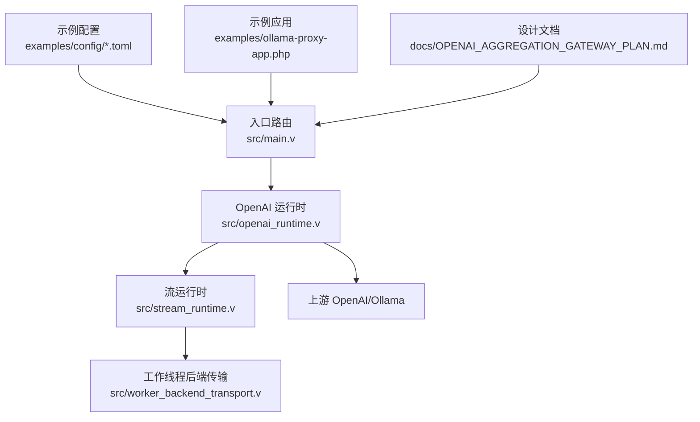
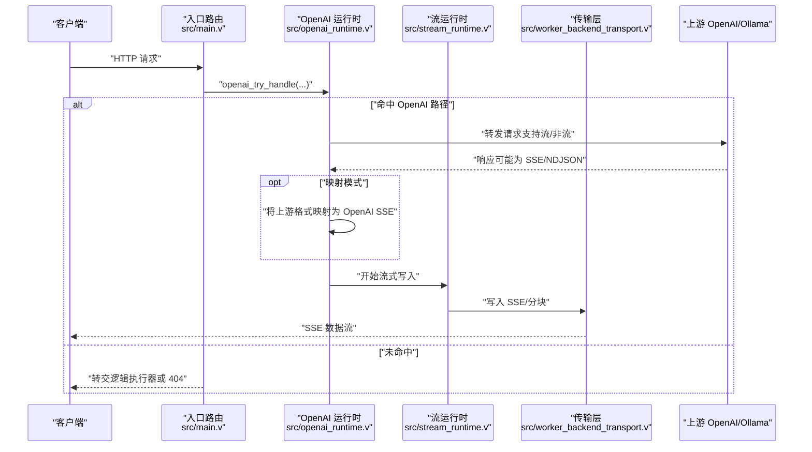
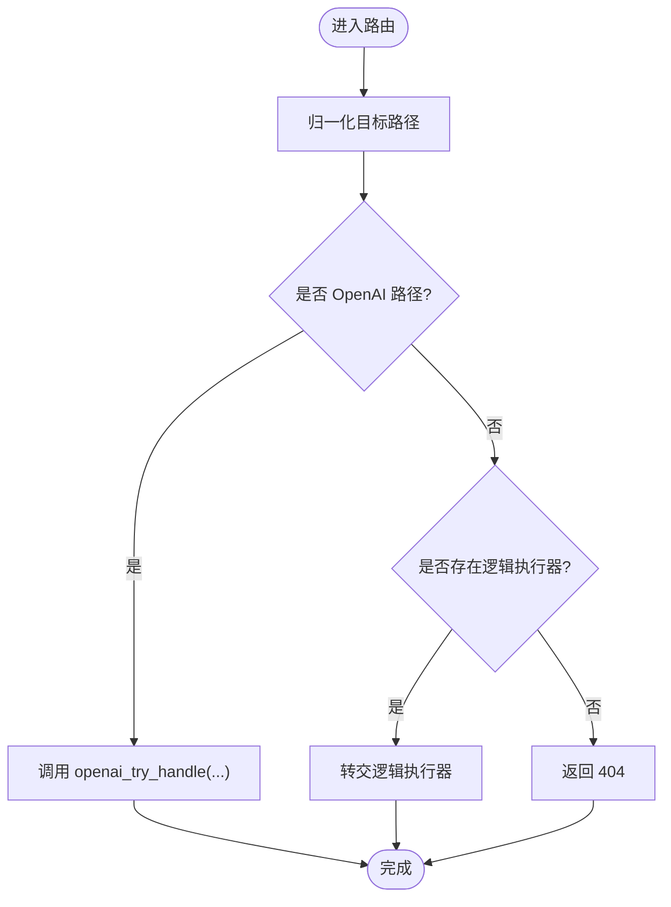
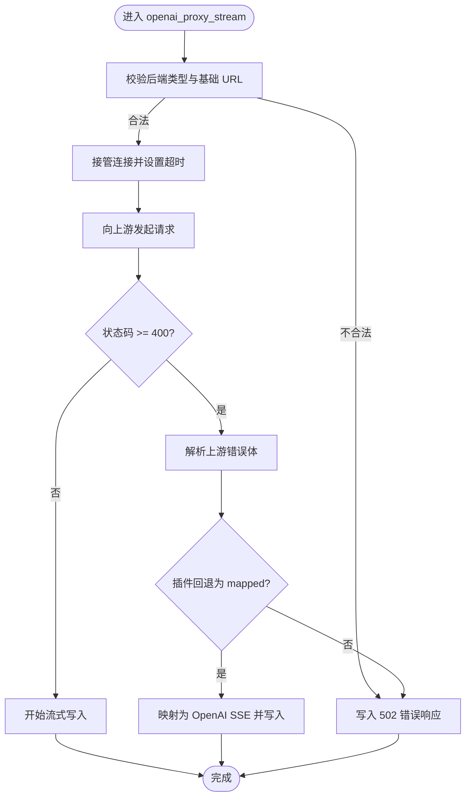
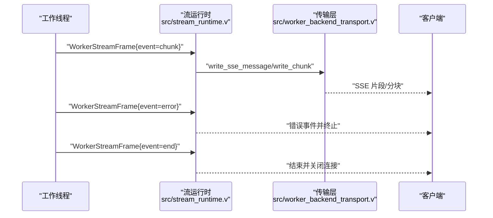
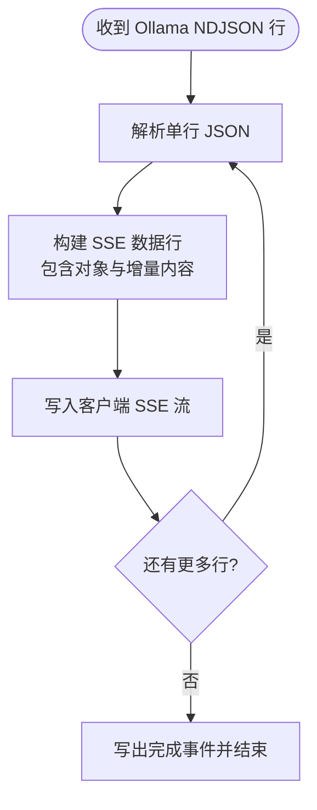
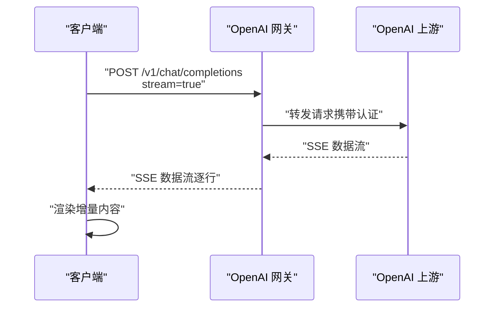
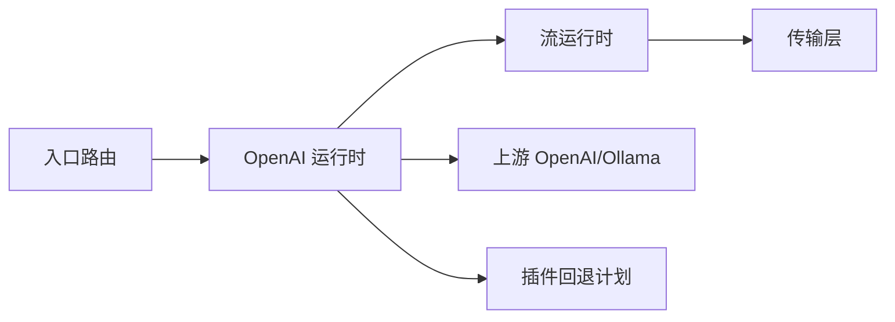

# OpenAI API 集成

<cite>
**本文引用的文件**
- [src/main.v](file://src/main.v)
- [src/openai_runtime.v](file://src/openai_runtime.v)
- [src/stream_runtime.v](file://src/stream_runtime.v)
- [src/worker_backend_transport.v](file://src/worker_backend_transport.v)
- [src/openai_gateway_integration_test.v](file://src/openai_gateway_integration_test.v)
- [examples/config/openai-gateway.toml](file://examples/config/openai-gateway.toml)
- [examples/config/ollama-proxy.toml](file://examples/config/ollama-proxy.toml)
- [examples/ollama-proxy-app.php](file://examples/ollama-proxy-app.php)
- [docs/OPENAI_AGGREGATION_GATEWAY_PLAN.md](file://docs/OPENAI_AGGREGATION_GATEWAY_PLAN.md)
</cite>

## 目录
1. [简介](#简介)
2. [项目结构](#项目结构)
3. [核心组件](#核心组件)
4. [架构总览](#架构总览)
5. [详细组件分析](#详细组件分析)
6. [依赖关系分析](#依赖关系分析)
7. [性能考量](#性能考量)
8. [故障排查指南](#故障排查指南)
9. [结论](#结论)
10. [附录](#附录)

## 简介
本技术文档围绕 OpenAI API 集成展开，系统性阐述运行时设计与实现，重点覆盖以下方面：
- 代理转发机制：从入口路由到上游 OpenAI 的请求转发与响应透传。
- 流式响应处理：SSE（服务器发送事件）协议、流式数据分片与客户端连接管理。
- 错误恢复策略：上游错误解析、映射与回退处理，以及速率限制与重试机制建议。
- Ollama 代理实现：本地大模型服务的代理转发与性能优化思路。
- 完整集成示例：配置 API 密钥、处理聊天补全与流式响应。
- 安全、成本控制与性能监控最佳实践。

该文档面向 AI 应用开发者，既提供高层架构视图，也给出代码级实现细节与可视化图表，帮助快速落地与稳定运维。

## 项目结构
该项目采用模块化组织，核心与 OpenAI 集成相关的模块包括：
- 入口与路由：统一入口接收 HTTP 请求，识别 OpenAI 路径并交由 OpenAI 运行时处理。
- OpenAI 运行时：负责上游调用、流式代理、错误映射与回退逻辑。
- 流运行时：封装 SSE 写入、分块传输与连接生命周期管理。
- 工作线程后端传输：提供通用的 HTTP 流头写入、SSE 消息写入与分块写入能力。
- 示例与配置：提供 OpenAI 网关与 Ollama 代理的配置样例与应用示例。
- 文档计划：包含聚合网关的总体设计与实施规划。

**图表来源**
- [src/main.v:1677-1713](file://src/main.v#L1677-L1713)
- [src/openai_runtime.v:1821-1849](file://src/openai_runtime.v#L1821-L1849)
- [src/stream_runtime.v:1-108](file://src/stream_runtime.v#L1-L108)
- [src/worker_backend_transport.v:258-296](file://src/worker_backend_transport.v#L258-L296)

**章节来源**
- [src/main.v:1677-1713](file://src/main.v#L1677-L1713)
- [src/openai_runtime.v:323-384](file://src/openai_runtime.v#L323-L384)
- [src/stream_runtime.v:1-108](file://src/stream_runtime.v#L1-L108)
- [src/worker_backend_transport.v:258-296](file://src/worker_backend_transport.v#L258-L296)

## 核心组件
- 入口路由与代理
  - 统一入口接收 POST/PUT 请求，优先尝试 OpenAI 处理分支；若未命中，则转交逻辑执行器或返回 404。
  - 路由中注入请求 ID 与追踪 ID，便于端到端可观测性。
- OpenAI 运行时
  - 支持非流式与流式代理，根据上游响应状态码进行错误解析与回退处理。
  - 提供映射模式（mapped），用于将上游输出转换为 OpenAI 兼容格式（如 Ollama 的 NDJSON 映射为 SSE）。
  - 包含错误体解析、头部写入、超时设置与连接接管等能力。
- 流运行时
  - 将工作线程帧（chunk/error/end）通过 SSE 或分块传输写入客户端连接。
  - 支持直接透传与 SSE 两种模式，并在结束时发出请求完成事件。
- 工作线程后端传输
  - 提供通用的 HTTP 流头写入、SSE 消息写入与分块写入方法，确保跨组件一致性。
- 示例与配置
  - 提供 OpenAI 网关与 Ollama 代理的 TOML 配置样例与 PHP 应用示例，便于快速集成。

**章节来源**
- [src/main.v:1677-1713](file://src/main.v#L1677-L1713)
- [src/openai_runtime.v:1821-1849](file://src/openai_runtime.v#L1821-L1849)
- [src/openai_runtime.v:323-384](file://src/openai_runtime.v#L323-L384)
- [src/stream_runtime.v:1-108](file://src/stream_runtime.v#L1-L108)
- [src/worker_backend_transport.v:258-296](file://src/worker_backend_transport.v#L258-L296)

## 架构总览
下图展示了从客户端到上游 OpenAI/Ollama 的完整链路，包括代理转发、流式处理与错误恢复：

**图表来源**
- [src/main.v:1677-1713](file://src/main.v#L1677-L1713)
- [src/openai_runtime.v:1821-1849](file://src/openai_runtime.v#L1821-L1849)
- [src/stream_runtime.v:1-108](file://src/stream_runtime.v#L1-L108)
- [src/worker_backend_transport.v:258-296](file://src/worker_backend_transport.v#L258-L296)

## 详细组件分析

### 入口路由与代理
- 责任边界
  - 统一入口负责请求归一化、请求 ID/追踪 ID 注入与 OpenAI 路由判定。
  - 若未匹配到 OpenAI 路径，检查是否存在逻辑执行器，否则返回 404。
- 关键行为
  - POST/PUT 路由均先尝试 OpenAI 处理分支，再降级至通用代理。
  - 对于 OpenAI 路由，记录日志并传递请求上下文给运行时。

**图表来源**
- [src/main.v:1677-1713](file://src/main.v#L1677-L1713)

**章节来源**
- [src/main.v:1677-1713](file://src/main.v#L1677-L1713)

### OpenAI 运行时：代理转发与错误恢复
- 代理转发
  - 支持非流式与流式两种模式，接管客户端连接并设置读写超时。
  - 构造上游 URL 并发起请求，携带 x-request-id、x-vhttpd-trace-id 等追踪头。
- 错误恢复
  - 当上游返回 4xx/5xx 且尚未写入响应头时，解析错误体并映射为 OpenAI 格式错误。
  - 若插件回退计划（fallback plan）指示 mapped 模式，将尝试映射上游响应为 OpenAI SSE。
- 映射模式状态
  - 使用 OpenAIMappedStreamProxyState 管理映射过程中的模型、请求 ID、追踪 ID、编码器与使用统计等。

**图表来源**
- [src/openai_runtime.v:1821-1849](file://src/openai_runtime.v#L1821-L1849)
- [src/openai_runtime.v:1100-1137](file://src/openai_runtime.v#L1100-L1137)
- [src/openai_runtime.v:1734-1764](file://src/openai_runtime.v#L1734-L1764)

**章节来源**
- [src/openai_runtime.v:1821-1849](file://src/openai_runtime.v#L1821-L1849)
- [src/openai_runtime.v:1100-1137](file://src/openai_runtime.v#L1100-L1137)
- [src/openai_runtime.v:1734-1764](file://src/openai_runtime.v#L1734-L1764)

### 流运行时：SSE 与分块传输
- SSE 写入
  - 将工作线程帧（chunk/error/end）转换为 SSE 消息并写入 TCP 连接。
  - 支持自定义事件名、消息 ID 与重试间隔。
- 分块传输
  - 在 passthrough 模式下，以分块方式写入原始字节流，并在结束时发送终止分块。
- 生命周期管理
  - 在读取到 end 或 error 帧时停止循环并关闭连接。
  - 发出请求完成事件，包含方法、路径、状态码与耗时等信息。

**图表来源**
- [src/stream_runtime.v:1-108](file://src/stream_runtime.v#L1-L108)
- [src/worker_backend_transport.v:258-296](file://src/worker_backend_transport.v#L258-L296)

**章节来源**
- [src/stream_runtime.v:1-108](file://src/stream_runtime.v#L1-L108)
- [src/worker_backend_transport.v:258-296](file://src/worker_backend_transport.v#L258-L296)

### Ollama 代理：NDJSON 到 SSE 的映射
- 场景说明
  - 将 Ollama 的 NDJSON 流映射为 OpenAI 兼容的 SSE（包含 chat.completion.chunk 对象与内容增量）。
- 实现要点
  - 通过映射模式（mapped）与响应编码器（response_codec）协作，逐条解析上游行并转换为 SSE 数据行。
  - 维护使用统计（usage）与完成标记（done），确保最终写出完成事件。
- 集成测试验证
  - 集成测试覆盖了 NDJSON 到 SSE 的正确转换、事件完整性与内容增量输出。

**图表来源**
- [src/openai_runtime.v:323-384](file://src/openai_runtime.v#L323-L384)
- [src/openai_gateway_integration_test.v:823-851](file://src/openai_gateway_integration_test.v#L823-L851)

**章节来源**
- [src/openai_runtime.v:323-384](file://src/openai_runtime.v#L323-L384)
- [src/openai_gateway_integration_test.v:823-851](file://src/openai_gateway_integration_test.v#L823-L851)

### 完整集成示例：聊天补全与流式响应
- 配置 API 密钥
  - 参考示例配置文件，设置上游 OpenAI 的认证凭据与基础 URL。
- 处理聊天补全
  - 向 /v1/chat/completions 发送 POST 请求，开启 stream=true 获取 SSE 流。
- 验证流式响应
  - 客户端应能接收包含对象标识与内容增量的数据行，并在最后收到完成事件。

**图表来源**
- [examples/config/openai-gateway.toml](file://examples/config/openai-gateway.toml)
- [src/openai_gateway_integration_test.v:1085-1113](file://src/openai_gateway_integration_test.v#L1085-L1113)

**章节来源**
- [examples/config/openai-gateway.toml](file://examples/config/openai-gateway.toml)
- [src/openai_gateway_integration_test.v:1085-1113](file://src/openai_gateway_integration_test.v#L1085-L1113)

### Ollama 代理应用示例
- 应用入口
  - 通过 PHP 应用示例启动 Ollama 代理，将本地大模型服务暴露为兼容 OpenAI 的接口。
- 配置与部署
  - 使用示例 TOML 配置文件定义上游地址与映射规则，结合运行时自动完成格式转换与流式输出。

**章节来源**
- [examples/ollama-proxy-app.php](file://examples/ollama-proxy-app.php)
- [examples/config/ollama-proxy.toml](file://examples/config/ollama-proxy.toml)

## 依赖关系分析
- 组件耦合
  - 入口路由仅负责分流与上下文注入，不直接处理上游细节，保持高内聚低耦合。
  - OpenAI 运行时依赖流运行时与传输层，形成清晰的职责边界。
- 外部依赖
  - 上游 OpenAI/Ollama 的可用性直接影响响应质量与时延。
  - 插件回退计划（fallback plan）为错误恢复提供扩展点。
- 潜在风险
  - 映射模式依赖上游格式稳定性；上游变更可能导致映射失败。
  - 流式写入对连接稳定性敏感，需配合超时与重试策略。

**图表来源**
- [src/main.v:1677-1713](file://src/main.v#L1677-L1713)
- [src/openai_runtime.v:1821-1849](file://src/openai_runtime.v#L1821-L1849)
- [src/stream_runtime.v:1-108](file://src/stream_runtime.v#L1-L108)
- [src/worker_backend_transport.v:258-296](file://src/worker_backend_transport.v#L258-L296)

**章节来源**
- [src/main.v:1677-1713](file://src/main.v#L1677-L1713)
- [src/openai_runtime.v:1821-1849](file://src/openai_runtime.v#L1821-L1849)
- [src/stream_runtime.v:1-108](file://src/stream_runtime.v#L1-L108)
- [src/worker_backend_transport.v:258-296](file://src/worker_backend_transport.v#L258-L296)

## 性能考量
- 连接与超时
  - 流式代理中将读写超时设为无限，避免阻塞导致的连接中断；生产环境建议结合业务场景设置合理上限。
- 流式写入
  - SSE 与分块传输均采用逐帧写入，降低内存占用；注意客户端缓冲与网络抖动的影响。
- 映射开销
  - 映射模式需要逐行解析与转换，CPU 开销随上游吞吐增加而上升；建议在边缘节点缓存常用映射结果。
- 资源回收
  - 流结束后及时关闭连接并释放状态，避免句柄泄漏。

[本节为通用性能建议，无需特定文件引用]

## 故障排查指南
- 常见错误与定位
  - 502 上游获取失败：检查上游地址、认证与网络连通性。
  - 429/503 上游错误：解析错误体并确认速率限制与配额状态。
  - 映射失败：核对上游格式与映射规则，必要时启用回退计划。
- 日志与追踪
  - 路由层已注入请求 ID 与追踪 ID，便于跨组件关联日志。
- 回退策略
  - 当上游返回错误且插件回退计划指示 mapped 模式时，运行时会尝试映射为 OpenAI SSE；若仍失败则写入标准错误响应。

**章节来源**
- [src/openai_runtime.v:1100-1137](file://src/openai_runtime.v#L1100-L1137)
- [src/openai_runtime.v:1734-1764](file://src/openai_runtime.v#L1734-L1764)
- [src/openai_gateway_integration_test.v:1325-1479](file://src/openai_gateway_integration_test.v#L1325-L1479)

## 结论
本项目通过清晰的路由分流、可扩展的 OpenAI 运行时与稳健的流式传输层，实现了对 OpenAI 与本地 Ollama 的统一接入。映射模式有效解决了不同上游格式的兼容问题，结合插件回退与错误恢复策略，提升了系统的鲁棒性。建议在生产环境中结合速率限制、成本控制与性能监控策略，持续优化端到端体验。

[本节为总结性内容，无需特定文件引用]

## 附录
- 设计文档参考
  - 聚合网关总体设计与实施规划，为后续演进提供蓝图。
- 示例与配置
  - OpenAI 网关与 Ollama 代理的配置样例与应用示例，便于快速落地。

**章节来源**
- [docs/OPENAI_AGGREGATION_GATEWAY_PLAN.md](file://docs/OPENAI_AGGREGATION_GATEWAY_PLAN.md)
- [examples/config/openai-gateway.toml](file://examples/config/openai-gateway.toml)
- [examples/config/ollama-proxy.toml](file://examples/config/ollama-proxy.toml)
- [examples/ollama-proxy-app.php](file://examples/ollama-proxy-app.php)