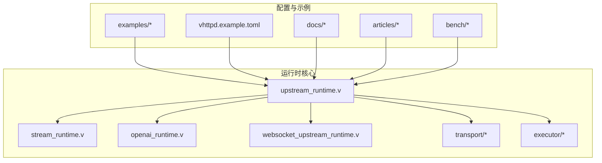
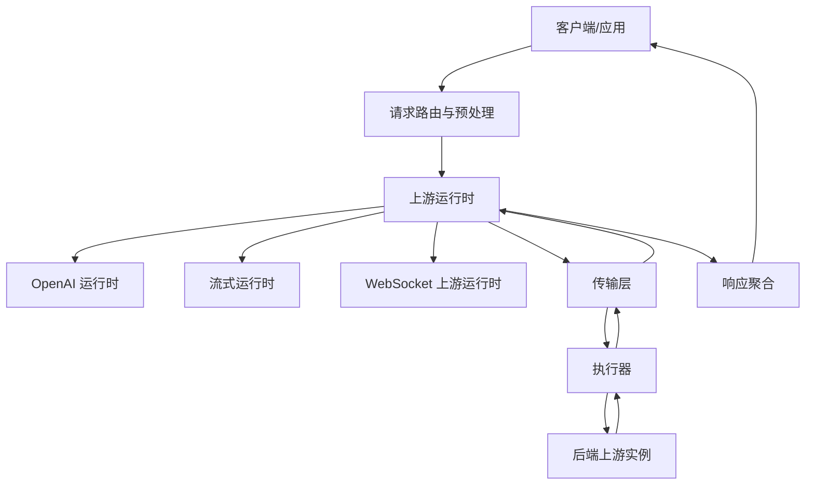
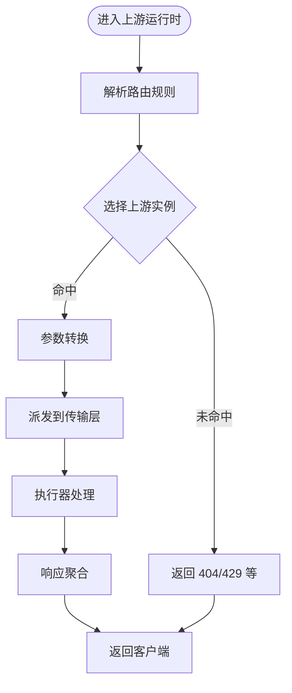
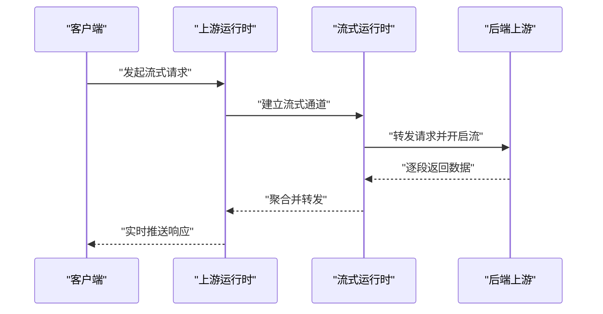
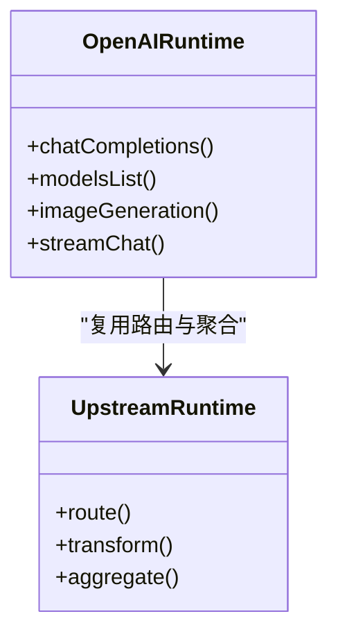
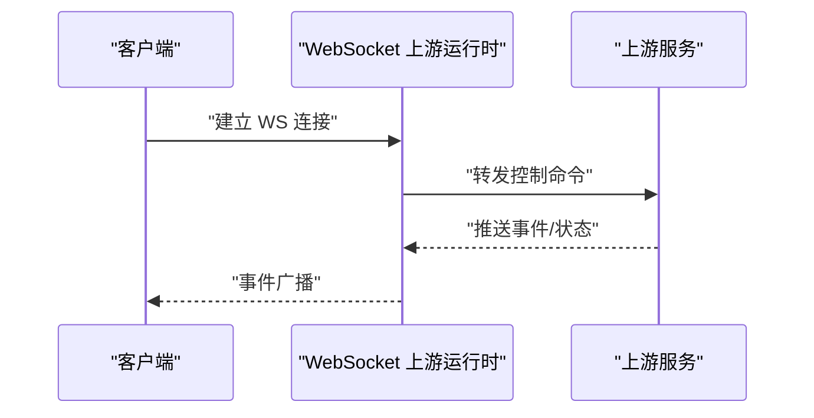
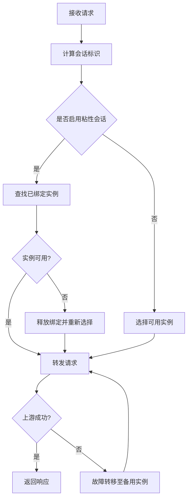
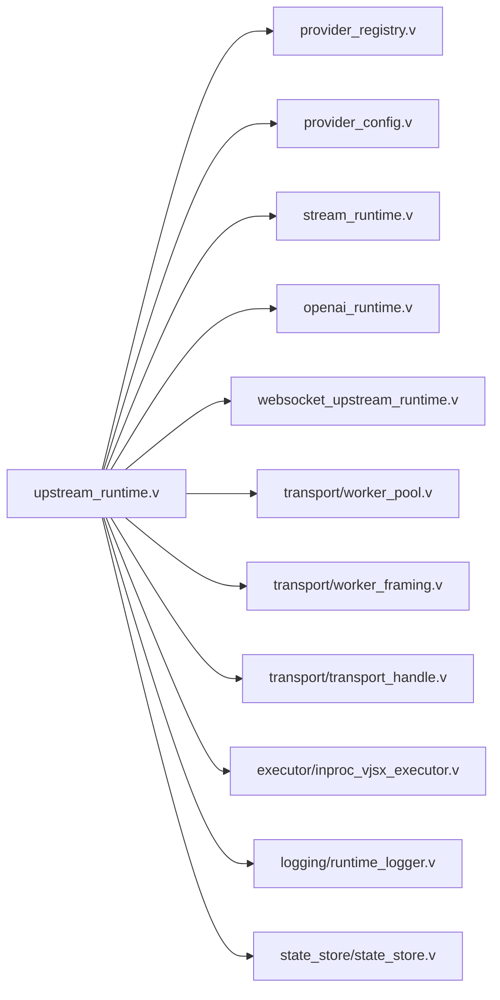

# 上游代理运行时

<cite>
**本文引用的文件**
- [src/upstream_runtime.v](file://src/upstream_runtime.v)
- [src/openai_runtime.v](file://src/openai_runtime.v)
- [src/websocket_upstream_runtime.v](file://src/websocket_upstream_runtime.v)
- [config/vhttpd.example.toml](file://config/vhttpd.example.toml)
- [docs/PASEO_RELAY_VHTTPD_PLAN.md](file://docs/PASEO_RELAY_VHTTPD_PLAN.md)
- [examples/paseo-relay/README.md](file://examples/paseo-relay/README.md)
- [examples/paseo-relay/app.mts](file://examples/paseo-relay/app.mts)
- [examples/paseo-relay/paseo-relay.toml](file://examples/paseo-relay/paseo-relay.toml)
- [examples/paseo-relay/paseo-relay-no-sticky.toml](file://examples/paseo-relay/paseo-relay-no-sticky.toml)
- [examples/paseo-relay/paseo-relay-no-sticky-formal.toml](file://examples/paseo-relay/paseo-relay-no-sticky-formal.toml)
- [examples/ollama-proxy-app.php](file://examples/ollama-proxy-app.php)
- [examples/ai-stream-app.php](file://examples/ai-stream-app.php)
- [articles/04-ai-streaming.md](file://articles/04-ai-streaming.md)
- [bench/k6_stream.js](file://bench/k6_stream.js)
- [src/stream_runtime.v](file://src/stream_runtime.v)
- [src/admin_runtime.v](file://src/admin_runtime.v)
- [src/server.v](file://src/server.v)
- [src/command_handlers.v](file://src/command_handlers.v)
- [src/provider_registry.v](file://src/provider_registry.v)
- [src/provider_config.v](file://src/provider_config.v)
- [src/multi_server_runtime_config.v](file://src/multi_server_runtime_config.v)
- [src/server_runtime_config.v](file://src/server_runtime_config.v)
- [src/transport/session_handle.v](file://src/transport/session_handle.v)
- [src/transport/worker_pool.v](file://src/transport/worker_pool.v)
- [src/executor/inproc_vjsx_executor.v](file://src/executor/inproc_vjsx_executor.v)
- [src/executor/types.v](file://src/executor/types.v)
- [src/jsonutils/json_utils.v](file://src/jsonutils/json_utils.v)
- [src/logging/runtime_logger.v](file://src/logging/runtime_logger.v)
- [src/state_store/state_store.v](file://src/state_store/state_store.v)
- [src/admin_server.v](file://src/admin_server.v)
- [src/admin_workers.v](file://src/admin_workers.v)
- [src/worker_backend_pool.v](file://src/worker_backend_pool.v)
- [src/worker_backend_runtime.v](file://src/worker_backend_runtime.v)
- [src/worker_backend_dispatch.v](file://src/worker_backend_dispatch.v)
- [src/worker_backend_queue.v](file://src/worker_backend_queue.v)
- [src/worker_backend_transport.v](file://src/worker_backend_transport.v)
- [src/transport/worker_protocol.v](file://src/transport/worker_protocol.v)
- [src/transport/worker_framing.v](file://src/transport/worker_framing.v)
- [src/transport/transport_handle.v](file://src/transport/transport_handle.v)
- [src/kernel_dispatch.v](file://src/kernel_dispatch.v)
- [src/dispatch_context.v](file://src/dispatch_context.v)
- [src/command_executor.v](file://src/command_executor.v)
- [src/command.v](file://src/command.v)
- [src/app_runtime_builder.v](file://src/app_runtime_builder.v)
- [src/executive_bridge.v](file://src/executive_bridge.v)
- [src/executor_config.v](file://src/executor_config.v)
- [src/executor_lifecycle.v](file://src/executor_lifecycle.v)
- [src/executor_runtime_plan.v](file://src/executor_runtime_plan.v)
- [src/executor_spec.v](file://src/executor_spec.v)
- [src/provider_bootstrap.v](file://src/provider_bootstrap.v)
- [src/provider_instance_runtime.v](file://src/provider_instance_runtime.v)
- [src/provider_spec.v](file://src/provider_spec.v)
- [src/server_runtime_orchestrator.v](file://src/server_runtime_orchestrator.v)
- [src/multi_server_runtime_orchestrator.v](file://src/multi_server_runtime_orchestrator.v)
- [src/server_shutdown_hooks.v](file://src/server_shutdown_hooks.v)
- [src/server_startup_hooks.v](file://src/server_startup_hooks.v)
- [src/websocket_runtime.v](file://src/websocket_runtime.v)
- [src/websocket_dispatch_lifecycle_test.v](file://src/websocket_dispatch_lifecycle_test.v)
- [src/websocket_binary_support_test.v](file://src/websocket_binary_support_test.v)
- [src/websocket_upstream_runtime_test.v](file://src/websocket_upstream_runtime_test.v)
- [src/websocket_upstream_runtime.v](file://src/websocket_upstream_runtime.v)
- [src/websocket_runtime.v](file://src/websocket_runtime.v)
- [src/websocket_dispatch_lifecycle_test.v](file://src/websocket_dispatch_lifecycle_test.v)
- [src/websocket_binary_support_test.v](file://src/websocket_binary_support_test.v)
- [src/websocket_upstream_runtime_test.v](file://src/websocket_upstream_runtime_test.v)
- [src/websocket_upstream_runtime.v](file://src/websocket_upstream_runtime.v)
- [src/websocket_runtime.v](file://src/websocket_runtime.v)
- [src/websocket_dispatch_lifecycle_test.v](file://src/websocket_dispatch_lifecycle_test.v)
- [src/websocket_binary_support_test.v](file://src/websocket_binary_support_test.v)
- [src/websocket_upstream_runtime_test.v](file://src/websocket_upstream_runtime_test.v)
- [src/websocket_upstream_runtime.v](file://src/websocket_upstream_runtime.v)
- [src/websocket_runtime.v](file://src/websocket_runtime.v)
- [src/websocket_dispatch_lifecycle_test.v](file://src/websocket_dispatch_lifecycle_test.v)
- [src/websocket_binary_support_test.v](file://src/websocket_binary_support_test.v)
- [src/websocket_upstream_runtime_test.v](file://src/websocket_upstream_runtime_test.v)
- [src/websocket_upstream_runtime.v](file://src/websocket_upstream_runtime.v)
- [src/websocket_runtime.v](file://src/websocket_runtime.v)
- [src/websocket_dispatch_lifecycle_test.v](file://src/websocket_dispatch_lifecycle_test.v)
- [src/websocket_binary_support_test.v](file://src/websocket_binary_support_test.v)
- [src/websocket_upstream_runtime_test.v](file://src/websocket_upstream_runtime_test.v)
- [src/websocket_upstream_runtime.v](file://src/websocket_upstream_runtime.v)
- [src/websocket_runtime.v](file://src/websocket_runtime.v)
- [src/websocket_dispatch_lifecycle_test.v](file://src/websocket_dispatch_lifecycle_test.v)
- [src/websocket_binary_support_test.v](file://src/websocket_binary_support_test.v)
- [src/websocket_upstream_runtime_test.v](file://src/websocket_upstream_runtime_test.v)
- [src/websocket_upstream_runtime.v](file://src/websocket_upstream_runtime.v)
-......
</cite>

## 目录
1. [引言](#引言)
2. [项目结构](#项目结构)
3. [核心组件](#核心组件)
4. [架构总览](#架构总览)
5. [详细组件分析](#详细组件分析)
6. [依赖关系分析](#依赖关系分析)
7. [性能考量](#性能考量)
8. [故障排查指南](#故障排查指南)
9. [结论](#结论)
10. [附录](#附录)

## 引言
本技术文档围绕“上游代理运行时”展开，系统阐述其设计理念与实现架构，重点覆盖代理转发、请求路由与响应聚合机制；深入解析流式响应处理（含第三方 API 流式数据与实时传输）；详解 Paseo Relay 的实现（粘性会话、负载均衡与故障转移策略）；提供完整配置示例（涵盖 Ollama、OpenAI、DashScope 等上游服务）；说明代理中间件（请求预处理、响应后处理与缓存策略）；并给出安全、限流与监控指标建议，面向系统架构师与运维工程师提供部署与运维指导。

## 项目结构
该仓库采用模块化分层组织：核心运行时位于 src/，配置位于 config/，示例位于 examples/，文档位于 docs/，基准测试位于 bench/，文章说明位于 articles/。上游代理运行时的关键实现集中在 src/upstream_runtime.v 及相关子系统中，配合 OpenAI 运行时、WebSocket 上游运行时、流式运行时、执行器与传输层等模块协同工作。

图示来源
- [src/upstream_runtime.v](file://src/upstream_runtime.v)
- [src/stream_runtime.v](file://src/stream_runtime.v)
- [src/openai_runtime.v](file://src/openai_runtime.v)
- [src/websocket_upstream_runtime.v](file://src/websocket_upstream_runtime.v)
- [src/transport/worker_pool.v](file://src/transport/worker_pool.v)
- [src/executor/inproc_vjsx_executor.v](file://src/executor/inproc_vjsx_executor.v)
- [config/vhttpd.example.toml](file://config/vhttpd.example.toml)
- [examples/paseo-relay/app.mts](file://examples/paseo-relay/app.mts)

章节来源
- [src/upstream_runtime.v](file://src/upstream_runtime.v)
- [config/vhttpd.example.toml](file://config/vhttpd.example.toml)

## 核心组件
- 上游运行时（Upstream Runtime）
  - 负责统一接入与编排各类上游服务（如 OpenAI、DashScope、Ollama），实现请求路由、参数转换、响应聚合与错误处理。
  - 支持多实例、多服务器模式，具备可扩展的注册表与规格定义。
- 流式运行时（Stream Runtime）
  - 提供对第三方 API 流式输出的透传与实时传输能力，支持 SSE/Chunked 等格式，保障低延迟与高吞吐。
- OpenAI 运行时（OpenAI Runtime）
  - 针对 OpenAI 生态的特化适配，包括模型列表、聊天补全、流式对话等接口的路由与聚合。
- WebSocket 上游运行时（WebSocket Upstream Runtime）
  - 将上游服务通过 WebSocket 通道接入，支持长连接场景下的事件分发与状态同步。
- 传输与执行（Transport & Executor）
  - 传输层负责会话管理、帧协议与工作池调度；执行器负责在进程内或外部宿主上执行逻辑。
- 配置与注册（Provider Registry & Config）
  - 通过 TOML 配置定义上游服务规格、路由规则与运行参数；注册表动态发现与加载上游实例。

章节来源
- [src/upstream_runtime.v](file://src/upstream_runtime.v)
- [src/stream_runtime.v](file://src/stream_runtime.v)
- [src/openai_runtime.v](file://src/openai_runtime.v)
- [src/websocket_upstream_runtime.v](file://src/websocket_upstream_runtime.v)
- [src/provider_registry.v](file://src/provider_registry.v)
- [src/provider_config.v](file://src/provider_config.v)
- [src/multi_server_runtime_config.v](file://src/multi_server_runtime_config.v)
- [src/server_runtime_config.v](file://src/server_runtime_config.v)

## 架构总览
上游代理运行时的整体架构由“请求入口 -> 上游路由 -> 执行与传输 -> 响应聚合 -> 返回客户端”的链路构成。核心模块如下：

图示来源
- [src/upstream_runtime.v](file://src/upstream_runtime.v)
- [src/openai_runtime.v](file://src/openai_runtime.v)
- [src/stream_runtime.v](file://src/stream_runtime.v)
- [src/websocket_upstream_runtime.v](file://src/websocket_upstream_runtime.v)
- [src/transport/worker_pool.v](file://src/transport/worker_pool.v)
- [src/executor/inproc_vjsx_executor.v](file://src/executor/inproc_vjsx_executor.v)

## 详细组件分析

### 上游运行时（Upstream Runtime）
- 设计理念
  - 统一抽象：以 Provider 规格与注册表为核心，屏蔽不同上游 API 的差异。
  - 可插拔：通过配置与注册表动态加载上游实例，支持多实例与多服务器模式。
  - 可观测：内置日志与状态存储，便于追踪请求路径与性能瓶颈。
- 关键职责
  - 请求路由：根据路由规则选择合适的上游实例。
  - 参数转换：将入站请求转换为上游期望的格式。
  - 响应聚合：合并多个上游响应，形成最终响应。
  - 错误处理：捕获上游异常并返回标准化错误。
- 数据结构与复杂度
  - Provider 注册表：基于映射结构，查询与更新复杂度近似 O(1)。
  - 路由决策：线性扫描或哈希查找，取决于具体策略。
- 性能与优化
  - 复用连接与会话：减少握手开销。
  - 并发调度：工作池与队列提升吞吐。
- 安全与限流
  - 在路由前进行鉴权与速率限制检查。
  - 对敏感头部与参数进行过滤与脱敏。

图示来源
- [src/upstream_runtime.v](file://src/upstream_runtime.v)
- [src/provider_registry.v](file://src/provider_registry.v)
- [src/provider_config.v](file://src/provider_config.v)

章节来源
- [src/upstream_runtime.v](file://src/upstream_runtime.v)
- [src/provider_registry.v](file://src/provider_registry.v)
- [src/provider_config.v](file://src/provider_config.v)

### 流式响应处理（Stream Runtime）
- 目标
  - 透明透传第三方 API 的流式输出（如 OpenAI 的 SSE），确保低延迟与实时性。
- 实现要点
  - 帧协议：按行/块拆分与拼接，避免缓冲区溢出。
  - 背压控制：当下游消费慢时，适度节流上游写入。
  - 错误传播：上游错误需及时中断并上报。
- 典型场景
  - AI 对话流式输出、模型推理进度、增量内容推送。
- 性能特性
  - 低延迟：尽量减少拷贝与序列化。
  - 高吞吐：批量写入与异步 I/O。

图示来源
- [src/stream_runtime.v](file://src/stream_runtime.v)
- [src/upstream_runtime.v](file://src/upstream_runtime.v)

章节来源
- [src/stream_runtime.v](file://src/stream_runtime.v)
- [articles/04-ai-streaming.md](file://articles/04-ai-streaming.md)
- [bench/k6_stream.js](file://bench/k6_stream.js)

### OpenAI 运行时（OpenAI Runtime）
- 特化适配
  - 模型列表、聊天补全、图像生成等接口的路由与参数映射。
  - 流式与非流式的差异化处理。
- 聚合策略
  - 多模型并发调用时的合并与排序。
  - 统一错误码与消息格式。
- 配置要点
  - API Key、Base URL、超时与重试策略。

图示来源
- [src/openai_runtime.v](file://src/openai_runtime.v)
- [src/upstream_runtime.v](file://src/upstream_runtime.v)

章节来源
- [src/openai_runtime.v](file://src/openai_runtime.v)

### WebSocket 上游运行时（WebSocket Upstream Runtime）
- 场景
  - 需要长连接与事件驱动的上游服务接入。
- 能力
  - 事件分发、心跳维持、断线重连与状态同步。
- 与流式运行时的关系
  - 可作为流式输出的承载通道之一。

图示来源
- [src/websocket_upstream_runtime.v](file://src/websocket_upstream_runtime.v)
- [src/websocket_runtime.v](file://src/websocket_runtime.v)

章节来源
- [src/websocket_upstream_runtime.v](file://src/websocket_upstream_runtime.v)

### Paseo Relay 实现（粘性会话、负载均衡与故障转移）
- 粘性会话
  - 基于会话标识（如用户 ID 或会话令牌）将请求稳定路由至同一上游实例，保证上下文一致性。
- 负载均衡
  - 轮询、权重、最少连接等策略，结合健康检查动态调整流量分配。
- 故障转移
  - 当上游实例不可用时，自动切换到备用实例，并记录失败原因与恢复时间。
- 配置示例
  - 提供带粘性与不带粘性的示例配置文件，便于快速部署验证。

图示来源
- [docs/PASEO_RELAY_VHTTPD_PLAN.md](file://docs/PASEO_RELAY_VHTTPD_PLAN.md)
- [examples/paseo-relay/paseo-relay.toml](file://examples/paseo-relay/paseo-relay.toml)
- [examples/paseo-relay/paseo-relay-no-sticky.toml](file://examples/paseo-relay/paseo-relay-no-sticky.toml)
- [examples/paseo-relay/paseo-relay-no-sticky-formal.toml](file://examples/paseo-relay/paseo-relay-no-sticky-formal.toml)

章节来源
- [docs/PASEO_RELAY_VHTTPD_PLAN.md](file://docs/PASEO_RELAY_VHTTPD_PLAN.md)
- [examples/paseo-relay/README.md](file://examples/paseo-relay/README.md)
- [examples/paseo-relay/app.mts](file://examples/paseo-relay/app.mts)

### 代理中间件（请求预处理、响应后处理与缓存策略）
- 请求预处理
  - 鉴权与权限校验、参数规范化、头部清洗与脱敏。
- 响应后处理
  - 结构化包装、错误码映射、速率限制统计与审计日志。
- 缓存策略
  - 基于 TTL 的只读缓存，针对可缓存的只读查询；区分强缓存与协商缓存。
- 与上游运行时集成
  - 中间件在上游运行时前后插入，确保对所有上游请求生效。

章节来源
- [src/upstream_runtime.v](file://src/upstream_runtime.v)
- [src/jsonutils/json_utils.v](file://src/jsonutils/json_utils.v)
- [src/logging/runtime_logger.v](file://src/logging/runtime_logger.v)
- [src/state_store/state_store.v](file://src/state_store/state_store.v)

### 配置示例（Ollama、OpenAI、DashScope）
- Ollama 示例
  - 通过 PHP 应用示例展示本地大模型代理的启动与路由。
- OpenAI 示例
  - 包含流式与非流式调用的配置与路由规则。
- DashScope 示例
  - 针对阿里云百炼平台的 API Key 与模型映射配置。
- 通用配置项
  - 服务地址、超时、重试、并发上限、缓存开关等。

章节来源
- [examples/ollama-proxy-app.php](file://examples/ollama-proxy-app.php)
- [examples/ai-stream-app.php](file://examples/ai-stream-app.php)
- [config/vhttpd.example.toml](file://config/vhttpd.example.toml)

## 依赖关系分析
上游代理运行时的模块依赖呈现清晰的分层与解耦特征：上游运行时依赖传输层与执行器；流式与 WebSocket 运行时作为特殊通道并行接入；配置与注册表为运行时提供动态能力；日志与状态存储贯穿全链路。

图示来源
- [src/upstream_runtime.v](file://src/upstream_runtime.v)
- [src/provider_registry.v](file://src/provider_registry.v)
- [src/provider_config.v](file://src/provider_config.v)
- [src/stream_runtime.v](file://src/stream_runtime.v)
- [src/openai_runtime.v](file://src/openai_runtime.v)
- [src/websocket_upstream_runtime.v](file://src/websocket_upstream_runtime.v)
- [src/transport/worker_pool.v](file://src/transport/worker_pool.v)
- [src/transport/worker_framing.v](file://src/transport/worker_framing.v)
- [src/transport/transport_handle.v](file://src/transport/transport_handle.v)
- [src/executor/inproc_vjsx_executor.v](file://src/executor/inproc_vjsx_executor.v)
- [src/logging/runtime_logger.v](file://src/logging/runtime_logger.v)
- [src/state_store/state_store.v](file://src/state_store/state_store.v)

章节来源
- [src/upstream_runtime.v](file://src/upstream_runtime.v)
- [src/provider_registry.v](file://src/provider_registry.v)
- [src/provider_config.v](file://src/provider_config.v)
- [src/stream_runtime.v](file://src/stream_runtime.v)
- [src/openai_runtime.v](file://src/openai_runtime.v)
- [src/websocket_upstream_runtime.v](file://src/websocket_upstream_runtime.v)
- [src/transport/worker_pool.v](file://src/transport/worker_pool.v)
- [src/transport/worker_framing.v](file://src/transport/worker_framing.v)
- [src/transport/transport_handle.v](file://src/transport/transport_handle.v)
- [src/executor/inproc_vjsx_executor.v](file://src/executor/inproc_vjsx_executor.v)
- [src/logging/runtime_logger.v](file://src/logging/runtime_logger.v)
- [src/state_store/state_store.v](file://src/state_store/state_store.v)

## 性能考量
- 并发与调度
  - 使用工作池与队列平衡请求到达与执行压力，避免阻塞。
- 传输优化
  - 复用连接、批量写入、零拷贝与异步 I/O。
- 流式处理
  - 控制帧大小与背压，避免内存峰值。
- 缓存与去重
  - 对只读查询启用短期缓存，降低上游压力。
- 监控与可观测性
  - 计数器、直方图与追踪 ID，定位热点与瓶颈。

## 故障排查指南
- 常见问题
  - 上游连接超时：检查网络连通性、TLS 配置与代理设置。
  - 流式中断：确认帧协议与缓冲策略，排查下游消费速度。
  - 路由失败：核对路由规则与实例健康状态。
- 排查步骤
  - 启用详细日志，定位请求在哪个阶段失败。
  - 使用基准测试脚本模拟高并发与流式场景，复现问题。
  - 检查状态存储中的会话与实例映射，验证粘性会话是否生效。
- 工具与接口
  - 管理端口与内部 API 用于查询运行状态与统计信息。

章节来源
- [src/admin_runtime.v](file://src/admin_runtime.v)
- [src/admin_server.v](file://src/admin_server.v)
- [src/admin_workers.v](file://src/admin_workers.v)
- [bench/k6_stream.js](file://bench/k6_stream.js)
- [src/state_store/state_store.v](file://src/state_store/state_store.v)

## 结论
上游代理运行时通过统一的上游抽象、灵活的路由与聚合机制、完善的流式与 WebSocket 支持，以及可插拔的配置体系，实现了对多类型上游服务的一致接入与高效转发。结合 Paseo Relay 的粘性会话、负载均衡与故障转移策略，可在生产环境中提供高可用与高性能的代理能力。建议在部署时优先完善安全与限流策略，并持续通过监控与基准测试优化性能。

## 附录
- 部署与运维建议
  - 使用 systemd 或 launchd 管理进程生命周期，配置自动重启与资源限制。
  - 将日志输出到集中式日志系统，结合追踪 ID 进行关联分析。
  - 定期评估上游实例健康度与性能指标，动态调整路由权重。
- 监控指标建议
  - QPS、P95/P99 延迟、错误率、上游实例可用率、流式帧大小分布、缓存命中率。
- 安全建议
  - 强制 TLS、最小权限原则、敏感参数脱敏、速率限制与熔断保护。