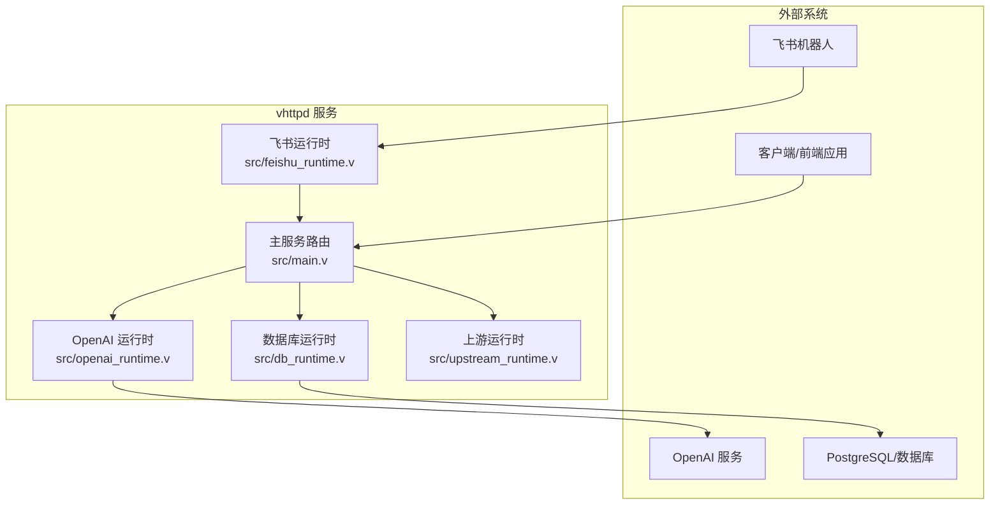
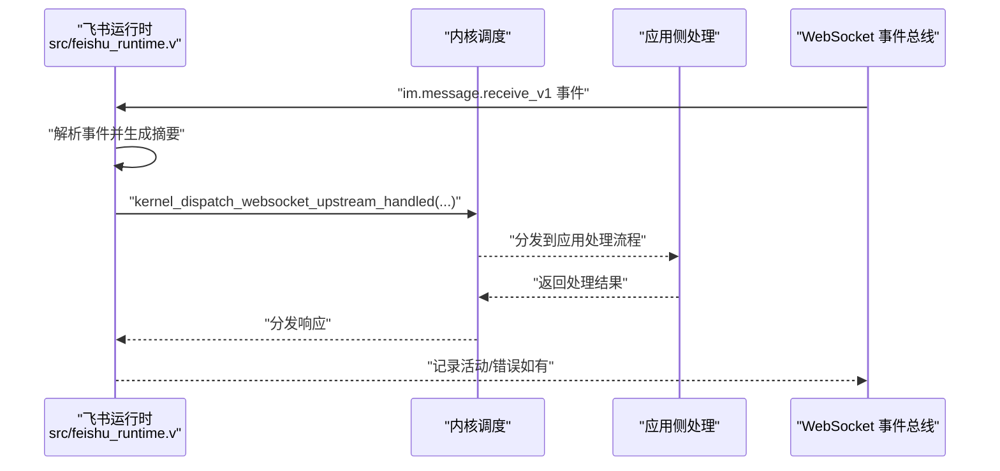
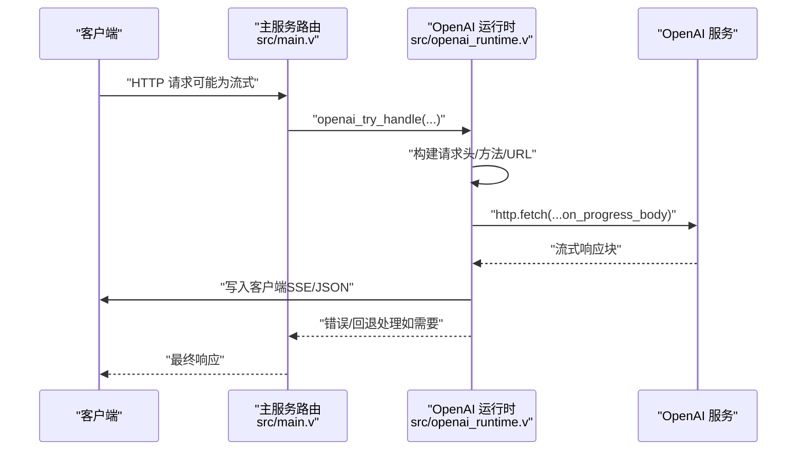
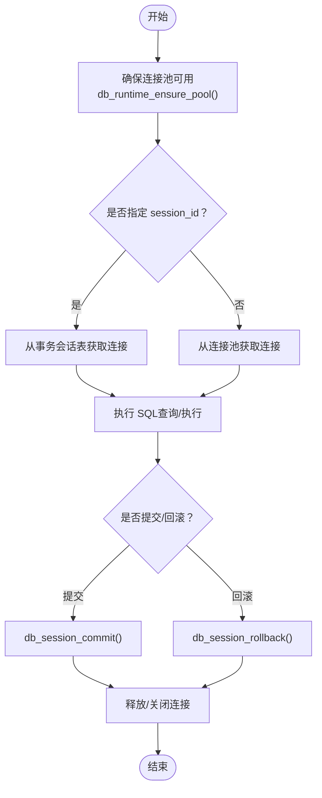
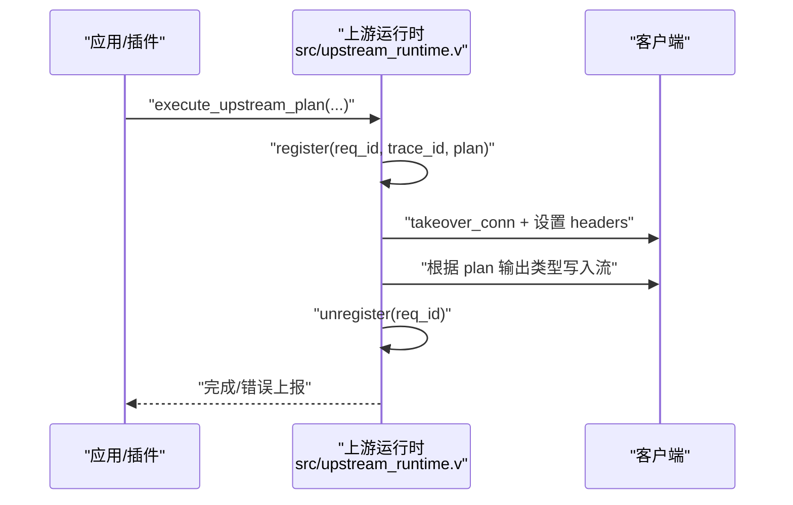
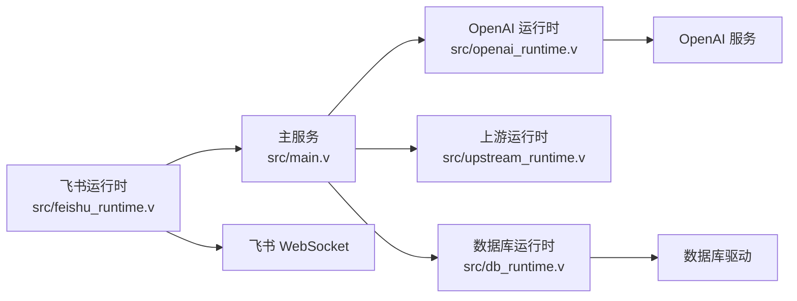

# 企业级集成

<cite>
**本文引用的文件**
- [src/main.v](file://src/main.v)
- [src/feishu_runtime.v](file://src/feishu_runtime.v)
- [src/openai_runtime.v](file://src/openai_runtime.v)
- [src/db_runtime.v](file://src/db_runtime.v)
- [dbsrc/db_runtime.v](file://dbsrc/db_runtime.v)
- [src/upstream_runtime.v](file://src/upstream_runtime.v)
- [src/inproc_vjsx_executor_codexbot_test_helpers.v](file://src/inproc_vjsx_executor_codexbot_test_helpers.v)
- [src/inproc_vjsx_http_facade.js](file://src/inproc_vjsx_http_facade.js)
- [examples/config/feishu-bot.toml](file://examples/config/feishu-bot.toml)
- [examples/config/openai-gateway.toml](file://examples/config/openai-gateway.toml)
- [examples/config/db-upstream.toml](file://examples/config/db-upstream.toml)
- [examples/config/ai-stream.toml](file://examples/config/ai-stream.toml)
- [articles/07-feishu-bot.md](file://articles/07-feishu-bot.md)
- [articles/04-ai-streaming.md](file://articles/04-ai-streaming.md)
- [docs/OPENAI_AGGREGATION_GATEWAY_PLAN.md](file://docs/OPENAI_AGGREGATION_GATEWAY_PLAN.md)
- [docs/WEBSOCKET_EVENT_BUS_PLAN.md](file://docs/WEBSOCKET_EVENT_BUS_PLAN.md)
- [docs/WEBSOCKET_MESSAGE_DISPATCH_PLAN.md](file://docs/WEBSOCKET_MESSAGE_DISPATCH_PLAN.md)
- [docs/STREAM_RUNTIME_PHASES.md](file://docs/STREAM_RUNTIME_PHASES.md)
- [docs/UPSTREAM_PLAN_PHASE3.md](file://docs/UPSTREAM_PLAN_PHASE3.md)
- [docs/failure_model.md](file://docs/failure_model.md)
</cite>

## 目录
1. [简介](#简介)
2. [项目结构](#项目结构)
3. [核心组件](#核心组件)
4. [架构总览](#架构总览)
5. [组件详解](#组件详解)
6. [依赖关系分析](#依赖关系分析)
7. [性能与可扩展性](#性能与可扩展性)
8. [故障排查指南](#故障排查指南)
9. [结论](#结论)
10. [附录：集成示例与最佳实践](#附录集成示例与最佳实践)

## 简介
本技术文档面向企业用户与系统集成商，围绕 vhttpd 的企业级能力进行系统化说明，重点覆盖以下方面：
- 飞书（Feishu）机器人集成：长连接管理、事件订阅与消息分发机制
- OpenAI API 集成：代理转发、流式响应与错误处理策略
- 数据库运行时：连接池管理、查询执行与事务处理
- 上游代理运行时：如何处理第三方 API 的流式响应
- 安全、性能与故障处理最佳实践
- 完整的集成示例与落地建议

## 项目结构
vhttpd 采用模块化与多运行时协同的架构设计，核心由主服务、运行时子系统与示例配置组成。下图给出与本文相关的关键模块与文件映射。

```mermaid
graph TB
A["主服务入口<br/>src/main.v"] --> B["飞书运行时<br/>src/feishu_runtime.v"]
A --> C["OpenAI 运行时<br/>src/openai_runtime.v"]
A --> D["数据库运行时<br/>src/db_runtime.v"]
A --> E["上游运行时<br/>src/upstream_runtime.v"]
F["前端 JS 夹缝层<br/>src/inproc_vjsx_http_facade.js"] --> B
G["测试辅助飞书消息分发<br/>src/inproc_vjsx_executor_codexbot_test_helpers.v"] --> B
H["飞书配置示例<br/>examples/config/feishu-bot.toml"] --> B
I["OpenAI 网关配置示例<br/>examples/config/openai-gateway.toml"] --> C
J["数据库上游配置示例<br/>examples/config/db-upstream.toml"] --> D
K["AI 流式配置示例<br/>examples/config/ai-stream.toml"] --> C
L["飞书文章说明<br/>articles/07-feishu-bot.md"] --> B
M["AI 流式文章说明<br/>articles/04-ai-streaming.md"] --> C
N["OpenAI 聚合网关规划<br/>docs/OPENAI_AGGREGATION_GATEWAY_PLAN.md"] --> C
O["事件总线规划<br/>docs/WEBSOCKET_EVENT_BUS_PLAN.md"] --> B
P["消息分发规划<br/>docs/WEBSOCKET_MESSAGE_DISPATCH_PLAN.md"] --> B
Q["流式运行时阶段<br/>docs/STREAM_RUNTIME_PHASES.md"] --> C
R["上游计划 Phase3<br/>docs/UPSTREAM_PLAN_PHASE3.md"] --> E
S["失败模型<br/>docs/failure_model.md"] --> A
```

图表来源
- [src/main.v:1634-1686](file://src/main.v#L1634-L1686)
- [src/feishu_runtime.v:2480-2512](file://src/feishu_runtime.v#L2480-L2512)
- [src/openai_runtime.v:1195-2024](file://src/openai_runtime.v#L1195-L2024)
- [src/db_runtime.v:66-116](file://src/db_runtime.v#L66-L116)
- [src/upstream_runtime.v:205-373](file://src/upstream_runtime.v#L205-L373)
- [src/inproc_vjsx_http_facade.js:1134-1156](file://src/inproc_vjsx_http_facade.js#L1134-L1156)
- [src/inproc_vjsx_executor_codexbot_test_helpers.v:94-125](file://src/inproc_vjsx_executor_codexbot_test_helpers.v#L94-L125)
- [examples/config/feishu-bot.toml](file://examples/config/feishu-bot.toml)
- [examples/config/openai-gateway.toml](file://examples/config/openai-gateway.toml)
- [examples/config/db-upstream.toml](file://examples/config/db-upstream.toml)
- [examples/config/ai-stream.toml](file://examples/config/ai-stream.toml)
- [articles/07-feishu-bot.md](file://articles/07-feishu-bot.md)
- [articles/04-ai-streaming.md](file://articles/04-ai-streaming.md)
- [docs/OPENAI_AGGREGATION_GATEWAY_PLAN.md](file://docs/OPENAI_AGGREGATION_GATEWAY_PLAN.md)
- [docs/WEBSOCKET_EVENT_BUS_PLAN.md](file://docs/WEBSOCKET_EVENT_BUS_PLAN.md)
- [docs/WEBSOCKET_MESSAGE_DISPATCH_PLAN.md](file://docs/WEBSOCKET_MESSAGE_DISPATCH_PLAN.md)
- [docs/STREAM_RUNTIME_PHASES.md](file://docs/STREAM_RUNTIME_PHASES.md)
- [docs/UPSTREAM_PLAN_PHASE3.md](file://docs/UPSTREAM_PLAN_PHASE3.md)
- [docs/failure_model.md](file://docs/failure_model.md)

章节来源
- [src/main.v:1634-1686](file://src/main.v#L1634-L1686)
- [src/feishu_runtime.v:2480-2512](file://src/feishu_runtime.v#L2480-L2512)
- [src/openai_runtime.v:1195-2024](file://src/openai_runtime.v#L1195-L2024)
- [src/db_runtime.v:66-116](file://src/db_runtime.v#L66-L116)
- [src/upstream_runtime.v:205-373](file://src/upstream_runtime.v#L205-L373)
- [src/inproc_vjsx_http_facade.js:1134-1156](file://src/inproc_vjsx_http_facade.js#L1134-L1156)
- [src/inproc_vjsx_executor_codexbot_test_helpers.v:94-125](file://src/inproc_vjsx_executor_codexbot_test_helpers.v#L94-L125)
- [examples/config/feishu-bot.toml](file://examples/config/feishu-bot.toml)
- [examples/config/openai-gateway.toml](file://examples/config/openai-gateway.toml)
- [examples/config/db-upstream.toml](file://examples/config/db-upstream.toml)
- [examples/config/ai-stream.toml](file://examples/config/ai-stream.toml)
- [articles/07-feishu-bot.md](file://articles/07-feishu-bot.md)
- [articles/04-ai-streaming.md](file://articles/04-ai-streaming.md)
- [docs/OPENAI_AGGREGATION_GATEWAY_PLAN.md](file://docs/OPENAI_AGGREGATION_GATEWAY_PLAN.md)
- [docs/WEBSOCKET_EVENT_BUS_PLAN.md](file://docs/WEBSOCKET_EVENT_BUS_PLAN.md)
- [docs/WEBSOCKET_MESSAGE_DISPATCH_PLAN.md](file://docs/WEBSOCKET_MESSAGE_DISPATCH_PLAN.md)
- [docs/STREAM_RUNTIME_PHASES.md](file://docs/STREAM_RUNTIME_PHASES.md)
- [docs/UPSTREAM_PLAN_PHASE3.md](file://docs/UPSTREAM_PLAN_PHASE3.md)
- [docs/failure_model.md](file://docs/failure_model.md)

## 核心组件
- 飞书运行时：负责与飞书 WebSocket 事件总线对接，解析 im.message.receive_v1 等事件，构建上游分发帧并投递到内核调度。
- OpenAI 运行时：提供 OpenAI API 代理、流式 SSE 转发、错误映射与回退策略，支持多后端与请求追踪。
- 数据库运行时：统一的数据库上游接口，支持连接池、会话级事务、参数化查询与错误统计。
- 上游运行时：通用的上游计划执行器，支持文本/事件流输出、内容类型协商与会话注册。
- 主服务路由：统一入口，识别并分流到 OpenAI 处理或通用代理逻辑。

章节来源
- [src/feishu_runtime.v:2480-2512](file://src/feishu_runtime.v#L2480-L2512)
- [src/openai_runtime.v:1195-2024](file://src/openai_runtime.v#L1195-L2024)
- [src/db_runtime.v:66-116](file://src/db_runtime.v#L66-L116)
- [src/upstream_runtime.v:205-373](file://src/upstream_runtime.v#L205-L373)
- [src/main.v:1634-1686](file://src/main.v#L1634-L1686)

## 架构总览
下图展示 vhttpd 在企业集成中的关键交互：外部客户端通过主服务路由访问 OpenAI 或数据库；飞书事件经由 WebSocket 总线进入飞书运行时，再由内核调度至应用侧处理；OpenAI 请求以流式方式返回给客户端。

图表来源
- [src/main.v:1634-1686](file://src/main.v#L1634-L1686)
- [src/openai_runtime.v:1195-2024](file://src/openai_runtime.v#L1195-L2024)
- [src/feishu_runtime.v:2480-2512](file://src/feishu_runtime.v#L2480-L2512)
- [src/db_runtime.v:66-116](file://src/db_runtime.v#L66-L116)
- [src/upstream_runtime.v:205-373](file://src/upstream_runtime.v#L205-L373)

## 组件详解

### 飞书机器人集成：长连接、事件订阅与消息分发
- 长连接管理
  - 飞书运行时通过内核的 WebSocket 上游分发接口接入事件总线，建立稳定的长连接通道。
  - 分发帧包含 provider、instance、trace_id、event_type、message_id、target 等字段，确保事件可追踪与可路由。
- 事件订阅
  - 订阅 im.message.receive_v1 等标准事件类型，解析消息体并生成标准化摘要。
- 消息分发
  - 将事件摘要与附加元数据封装为上游分发请求，交由内核调度到应用侧执行。
  - 若分发失败，记录错误并发出 websocket_upstream.dispatch.error 通知，便于可观测性与告警。

图表来源
- [src/feishu_runtime.v:2480-2512](file://src/feishu_runtime.v#L2480-L2512)

章节来源
- [src/feishu_runtime.v:2480-2512](file://src/feishu_runtime.v#L2480-L2512)
- [src/inproc_vjsx_executor_codexbot_test_helpers.v:94-125](file://src/inproc_vjsx_executor_codexbot_test_helpers.v#L94-L125)
- [src/inproc_vjsx_http_facade.js:1134-1156](file://src/inproc_vjsx_http_facade.js#L1134-L1156)
- [docs/WEBSOCKET_EVENT_BUS_PLAN.md](file://docs/WEBSOCKET_EVENT_BUS_PLAN.md)
- [docs/WEBSOCKET_MESSAGE_DISPATCH_PLAN.md](file://docs/WEBSOCKET_MESSAGE_DISPATCH_PLAN.md)
- [articles/07-feishu-bot.md](file://articles/07-feishu-bot.md)

### OpenAI API 集成：代理转发、流式响应与错误处理
- 代理转发
  - 主路由在匹配到 OpenAI 逻辑时，调用 openai_try_handle 并根据后端配置解析上游 URL、方法与头部。
- 流式响应
  - 使用 on_progress_body 回调逐块解码并写入客户端连接，设置 x-accel-buffering=no 保证实时性。
  - 支持 mapped 与 passthrough 两种模式，分别用于映射格式与透传原始事件流。
- 错误处理
  - 对上游错误进行状态码与错误体解析，并按需触发插件回退计划（fallback），最终统一封装为 HTTP 响应与可观测事件。

图表来源
- [src/main.v:1634-1686](file://src/main.v#L1634-L1686)
- [src/openai_runtime.v:1195-2024](file://src/openai_runtime.v#L1195-L2024)

章节来源
- [src/main.v:1634-1686](file://src/main.v#L1634-L1686)
- [src/openai_runtime.v:1195-2024](file://src/openai_runtime.v#L1195-L2024)
- [docs/OPENAI_AGGREGATION_GATEWAY_PLAN.md](file://docs/OPENAI_AGGREGATION_GATEWAY_PLAN.md)
- [docs/STREAM_RUNTIME_PHASES.md](file://docs/STREAM_RUNTIME_PHASES.md)
- [articles/04-ai-streaming.md](file://articles/04-ai-streaming.md)

### 数据库运行时：连接池、查询与事务
- 连接池管理
  - 通过 db_runtime_ensure_pool 初始化驱动与池大小，db_pool_acquire/db_pool_release 实现连接借还。
- 查询执行
  - 统一的上游请求结构包含 op（如 query/exec）、pool、timeout_ms、session_id、sql 与 params。
  - 执行成功后返回 rows、affected_rows、last_insert_id 等信息。
- 事务处理
  - 通过 session_id 跟踪事务会话，commit/rollback 控制生命周期；支持 reset 后归还池或关闭丢弃。

图表来源
- [src/db_runtime.v:229-380](file://src/db_runtime.v#L229-L380)
- [dbsrc/db_runtime.v:138-502](file://dbsrc/db_runtime.v#L138-L502)

章节来源
- [src/db_runtime.v:66-116](file://src/db_runtime.v#L66-L116)
- [src/db_runtime.v:229-380](file://src/db_runtime.v#L229-L380)
- [dbsrc/db_runtime.v:138-502](file://dbsrc/db_runtime.v#L138-L502)
- [examples/config/db-upstream.toml](file://examples/config/db-upstream.toml)

### 上游代理运行时：第三方 API 流式响应
- 会话注册与注销
  - upstream_runtime_register 在会话开始时登记请求上下文，upstream_runtime_unregister 在结束时清理。
- 输出类型与内容协商
  - 根据 plan.output_stream_type 选择 text/sse，content_type 自动设置为 text/event-stream 或 text/plain。
- 执行状态跟踪
  - 通过 ws_hub 统计上游计划总数与错误数，便于运维监控。

图表来源
- [src/upstream_runtime.v:205-373](file://src/upstream_runtime.v#L205-L373)

章节来源
- [src/upstream_runtime.v:205-373](file://src/upstream_runtime.v#L205-L373)
- [docs/UPSTREAM_PLAN_PHASE3.md](file://docs/UPSTREAM_PLAN_PHASE3.md)

## 依赖关系分析
- 组件耦合
  - 主服务对 OpenAI 与上游运行时存在直接依赖；飞书运行时通过内核调度与应用解耦。
  - 数据库运行时与驱动实现分离，通过 dbsrc/db_runtime.v 提供能力快照与统计。
- 外部依赖
  - OpenAI 运行时依赖 HTTP 客户端与 SSE 写入；飞书运行时依赖 WebSocket 事件总线；数据库运行时依赖具体驱动。
- 可能的循环依赖
  - 当前结构以主服务为中心，各运行时作为子系统被调用，未见明显循环依赖迹象。

图表来源
- [src/main.v:1634-1686](file://src/main.v#L1634-L1686)
- [src/openai_runtime.v:1195-2024](file://src/openai_runtime.v#L1195-L2024)
- [src/db_runtime.v:66-116](file://src/db_runtime.v#L66-L116)
- [src/upstream_runtime.v:205-373](file://src/upstream_runtime.v#L205-L373)
- [src/feishu_runtime.v:2480-2512](file://src/feishu_runtime.v#L2480-L2512)

章节来源
- [src/main.v:1634-1686](file://src/main.v#L1634-L1686)
- [src/openai_runtime.v:1195-2024](file://src/openai_runtime.v#L1195-L2024)
- [src/db_runtime.v:66-116](file://src/db_runtime.v#L66-L116)
- [src/upstream_runtime.v:205-373](file://src/upstream_runtime.v#L205-L373)
- [src/feishu_runtime.v:2480-2512](file://src/feishu_runtime.v#L2480-L2512)

## 性能与可扩展性
- 流式传输
  - OpenAI 与上游运行时均设置 x-accel-buffering=no，避免代理层缓冲，提升实时性。
- 连接复用与超时
  - OpenAI 代理将客户端连接设为无限读写超时，减少握手开销；上游执行同样接管连接并延长超时。
- 连接池与事务
  - 数据库运行时通过连接池与会话级事务降低资源占用，reset 后可重用连接，提高吞吐。
- 观测与回退
  - 通过 trace_id/x-request-id 串联链路；OpenAI 运行时支持插件回退策略，增强鲁棒性。

章节来源
- [src/openai_runtime.v:1195-2024](file://src/openai_runtime.v#L1195-L2024)
- [src/upstream_runtime.v:205-373](file://src/upstream_runtime.v#L205-L373)
- [src/db_runtime.v:229-380](file://src/db_runtime.v#L229-L380)
- [docs/OPENAI_AGGREGATION_GATEWAY_PLAN.md](file://docs/OPENAI_AGGREGATION_GATEWAY_PLAN.md)

## 故障排查指南
- OpenAI 代理错误
  - 检查后端配置（base_url、kind）、认证头（Authorization/Bearer）、请求方法与路径规范化。
  - 关注 on_progress_body 中的状态码分支与错误体累积，必要时启用回退计划。
- 飞书分发错误
  - 查看 websocket_upstream.dispatch.error 事件，确认 provider/instance、trace_id 与错误消息。
  - 核对事件类型与消息 ID，确保上游分发帧字段完整。
- 数据库执行错误
  - 通过 failed_queries 统计定位失败；检查 session_id 是否有效、连接是否被 reset/归还。
  - 对于事务，确认 commit/rollback 成功路径与 finalize 释放逻辑。
- 上游计划错误
  - 通过 register/unregister 期间的统计项判断异常；检查输出类型与内容类型协商是否一致。

章节来源
- [src/openai_runtime.v:1195-2024](file://src/openai_runtime.v#L1195-L2024)
- [src/feishu_runtime.v:2480-2512](file://src/feishu_runtime.v#L2480-L2512)
- [src/db_runtime.v:229-380](file://src/db_runtime.v#L229-L380)
- [src/upstream_runtime.v:205-373](file://src/upstream_runtime.v#L205-L373)
- [docs/failure_model.md](file://docs/failure_model.md)

## 结论
vhttpd 在企业集成场景中提供了高可靠、可观测且可扩展的运行时能力：
- 飞书运行时以事件总线为核心，结合内核调度实现稳定的消息分发；
- OpenAI 运行时以流式代理与错误回退保障用户体验；
- 数据库运行时以连接池与事务管理提升资源利用率；
- 上游运行时抽象第三方 API 的流式响应，统一输出与可观测性。

通过合理的配置与最佳实践，可在生产环境中实现高性能与高可用的企业级集成。

## 附录：集成示例与最佳实践
- 飞书机器人集成
  - 使用 examples/config/feishu-bot.toml 配置 provider/instance 与鉴权参数。
  - 参考 articles/07-feishu-bot.md 的背景说明与运行时规划。
- OpenAI 网关集成
  - 使用 examples/config/openai-gateway.toml 配置后端 base_url、认证与回退策略。
  - 参考 docs/OPENAI_AGGREGATION_GATEWAY_PLAN.md 的网关设计思路。
- 数据库上游集成
  - 使用 examples/config/db-upstream.toml 配置驱动、连接参数与池大小。
  - 参考 src/db_runtime.v 与 dbsrc/db_runtime.v 的能力快照与统计字段。
- AI 流式集成
  - 使用 examples/config/ai-stream.toml 配置流式输出与内容类型。
  - 参考 articles/04-ai-streaming.md 与 docs/STREAM_RUNTIME_PHASES.md 的流式运行时阶段。
- 最佳实践
  - 安全：严格管理 API 密钥与鉴权头，启用 TLS 与最小权限原则。
  - 性能：合理设置连接池大小与超时，优先使用流式传输与连接复用。
  - 可靠性：启用回退策略与错误分类，完善可观测性与告警。

章节来源
- [examples/config/feishu-bot.toml](file://examples/config/feishu-bot.toml)
- [examples/config/openai-gateway.toml](file://examples/config/openai-gateway.toml)
- [examples/config/db-upstream.toml](file://examples/config/db-upstream.toml)
- [examples/config/ai-stream.toml](file://examples/config/ai-stream.toml)
- [articles/07-feishu-bot.md](file://articles/07-feishu-bot.md)
- [articles/04-ai-streaming.md](file://articles/04-ai-streaming.md)
- [docs/OPENAI_AGGREGATION_GATEWAY_PLAN.md](file://docs/OPENAI_AGGREGATION_GATEWAY_PLAN.md)
- [docs/STREAM_RUNTIME_PHASES.md](file://docs/STREAM_RUNTIME_PHASES.md)
- [src/db_runtime.v:66-116](file://src/db_runtime.v#L66-L116)
- [dbsrc/db_runtime.v:138-502](file://dbsrc/db_runtime.v#L138-L502)