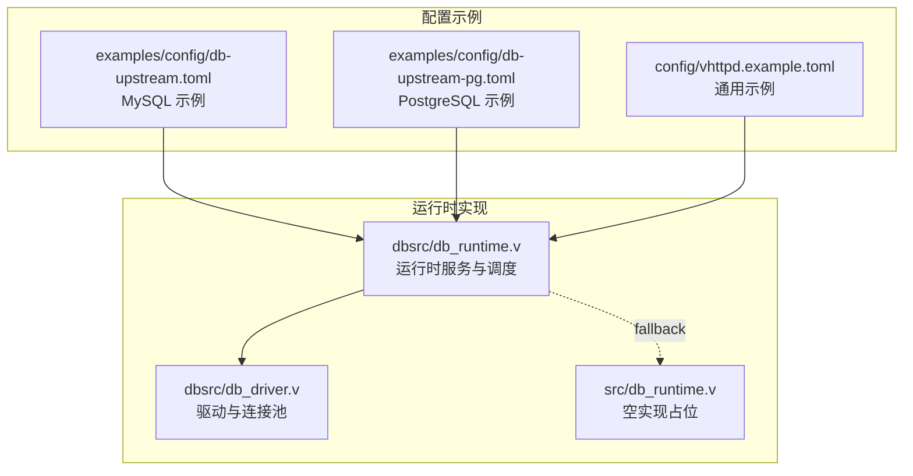
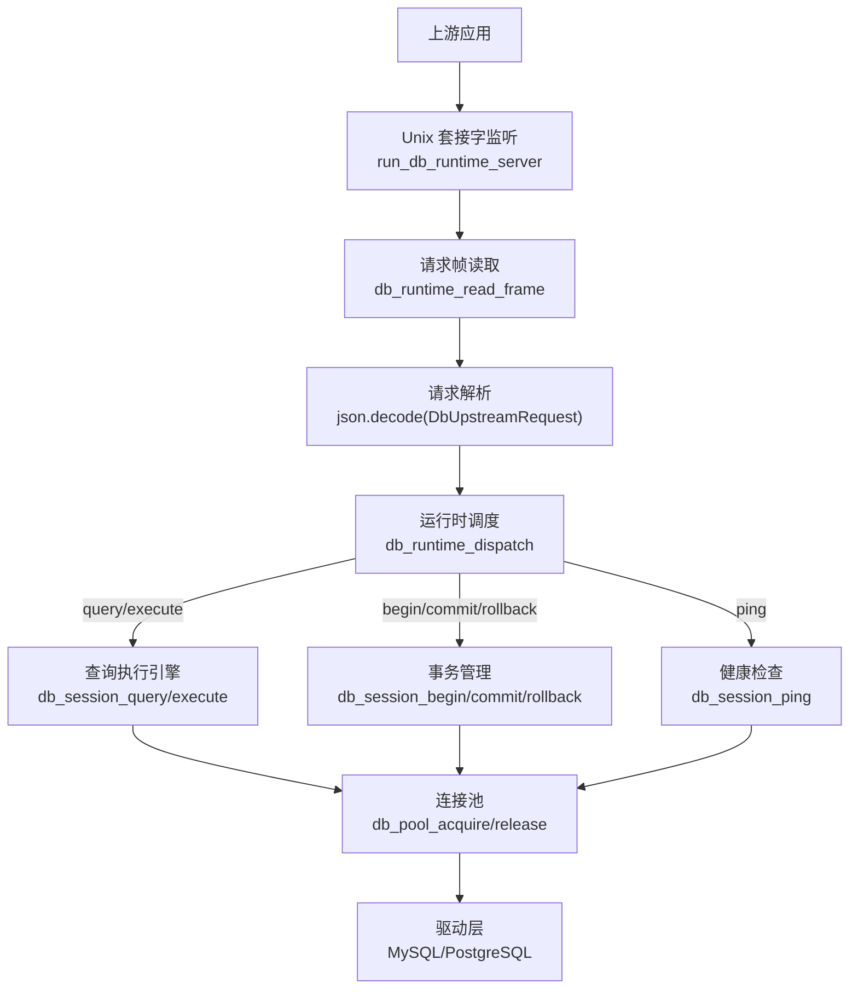
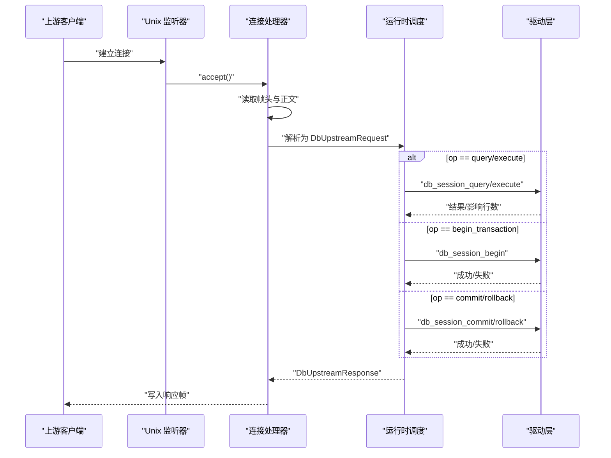
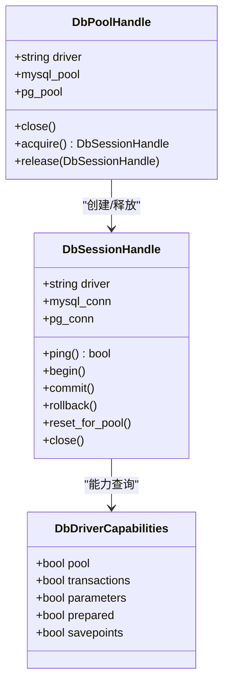
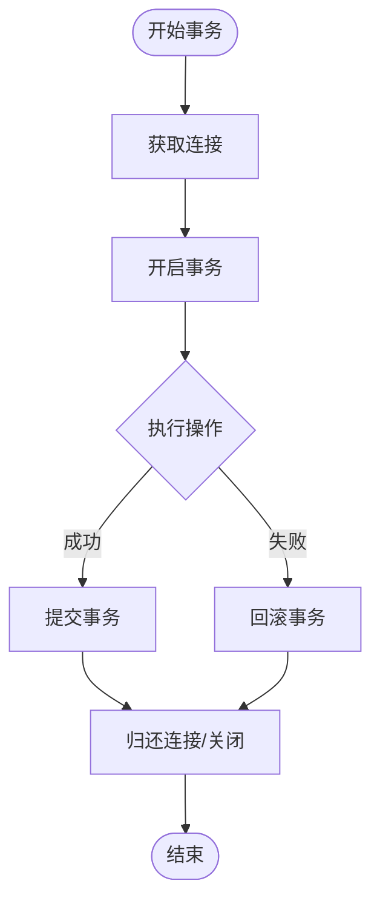
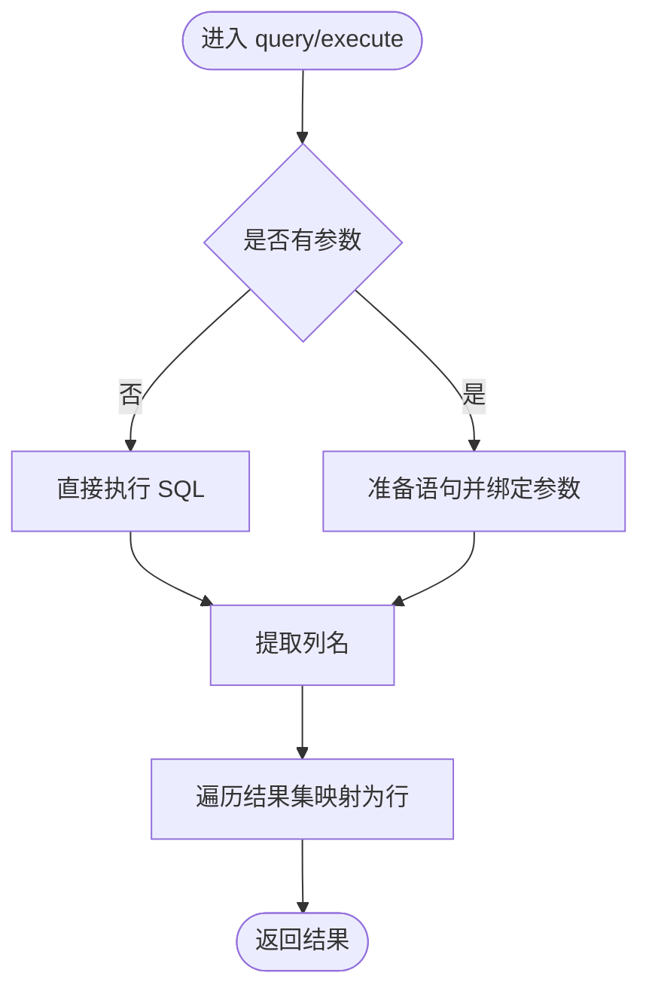
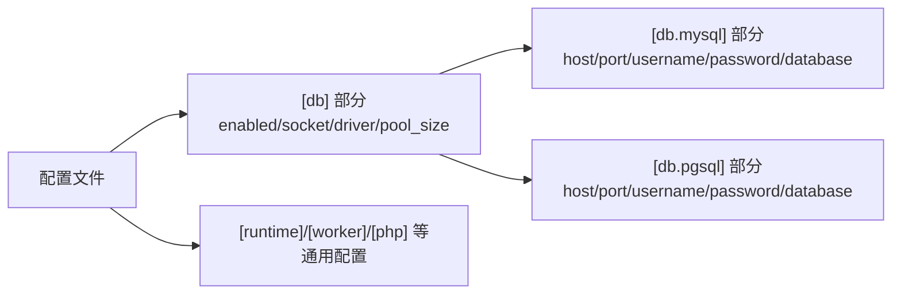
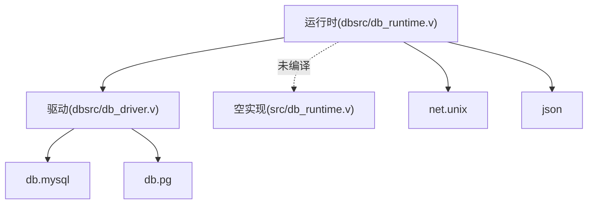

# 数据库运行时

<cite>
**本文引用的文件**
- [dbsrc/db_runtime.v](file://dbsrc/db_runtime.v)
- [dbsrc/db_driver.v](file://dbsrc/db_driver.v)
- [src/db_runtime.v](file://src/db_runtime.v)
- [examples/config/db-upstream.toml](file://examples/config/db-upstream.toml)
- [examples/config/db-upstream-pg.toml](file://examples/config/db-upstream-pg.toml)
- [config/vhttpd.example.toml](file://config/vhttpd.example.toml)
</cite>

## 目录
1. [简介](#简介)
2. [项目结构](#项目结构)
3. [核心组件](#核心组件)
4. [架构总览](#架构总览)
5. [详细组件分析](#详细组件分析)
6. [依赖关系分析](#依赖关系分析)
7. [性能考量](#性能考量)
8. [故障排查指南](#故障排查指南)
9. [结论](#结论)
10. [附录](#附录)

## 简介
本文件为数据库运行时（Db Runtime）的深度技术文档，面向后端开发者，系统性阐述以下主题：
- 架构设计：连接池管理、查询执行引擎、事务处理机制
- 驱动实现：SQL 解析、参数绑定、结果集处理
- 配置选项：连接超时、最大连接数、查询超时等
- 集成示例：如何配置 MySQL 与 PostgreSQL，并执行复杂查询
- 运行机制：读写分离、连接复用、性能优化策略
- 错误处理、事务回滚、死锁检测机制
- 代码级架构图与流程图，帮助快速理解与落地

## 项目结构
数据库运行时由两套实现构成：
- 完整实现：位于 dbsrc/db_runtime.v 与 dbsrc/db_driver.v，提供连接池、事务、参数化查询、结果集处理等能力
- 空实现占位：位于 src/db_runtime.v，用于未编译数据库功能时的默认行为

此外，仓库提供了针对 MySQL 与 PostgreSQL 的配置示例，便于快速集成。

**图表来源**
- [dbsrc/db_runtime.v:1-700](file://dbsrc/db_runtime.v#L1-L700)
- [dbsrc/db_driver.v:1-419](file://dbsrc/db_driver.v#L1-L419)
- [src/db_runtime.v:1-236](file://src/db_runtime.v#L1-L236)
- [examples/config/db-upstream.toml:1-45](file://examples/config/db-upstream.toml#L1-L45)
- [examples/config/db-upstream-pg.toml:1-45](file://examples/config/db-upstream-pg.toml#L1-L45)
- [config/vhttpd.example.toml:1-67](file://config/vhttpd.example.toml#L1-L67)

**章节来源**
- [dbsrc/db_runtime.v:1-700](file://dbsrc/db_runtime.v#L1-L700)
- [dbsrc/db_driver.v:1-419](file://dbsrc/db_driver.v#L1-L419)
- [src/db_runtime.v:1-236](file://src/db_runtime.v#L1-L236)
- [examples/config/db-upstream.toml:1-45](file://examples/config/db-upstream.toml#L1-L45)
- [examples/config/db-upstream-pg.toml:1-45](file://examples/config/db-upstream-pg.toml#L1-L45)
- [config/vhttpd.example.toml:1-67](file://config/vhttpd.example.toml#L1-L67)

## 核心组件
- 运行时服务与调度：负责监听 Unix 域套接字、解析上游请求、分发到驱动层、统计指标与错误上报
- 驱动与连接池：封装 MySQL 与 PostgreSQL 的连接池、会话生命周期、事务控制、参数化查询与结果集映射
- 空实现占位：在未编译数据库功能时，返回“未编译”状态并记录错误事件

关键数据结构与职责：
- DbProviderRuntime：运行时实例，维护连接池句柄、事务会话表、计数器与状态
- DbPoolHandle/DbSessionHandle：抽象连接池与会话句柄，屏蔽底层驱动差异
- DbUpstreamRequest/DbUpstreamResponse：上游请求/响应协议，支持 ping、begin_transaction、commit、rollback、query、execute 等操作

**章节来源**
- [dbsrc/db_runtime.v:38-104](file://dbsrc/db_runtime.v#L38-L104)
- [dbsrc/db_driver.v:28-40](file://dbsrc/db_driver.v#L28-L40)
- [src/db_runtime.v:66-90](file://src/db_runtime.v#L66-L90)

## 架构总览
数据库运行时采用“Unix 域套接字 + JSON 帧”的轻量协议，上游应用通过 socket 发送请求，运行时解析后调用驱动层完成数据库操作。连接池与事务会话由运行时统一管理，确保并发安全与资源复用。

**图表来源**
- [dbsrc/db_runtime.v:656-699](file://dbsrc/db_runtime.v#L656-L699)
- [dbsrc/db_runtime.v:393-605](file://dbsrc/db_runtime.v#L393-L605)
- [dbsrc/db_driver.v:87-178](file://dbsrc/db_driver.v#L87-L178)

## 详细组件分析

### 组件一：运行时服务与调度
- 监听与接受连接：启动 Unix 域套接字监听器，接受连接并在独立 goroutine 中处理
- 帧协议：固定 4 字节长度头 + 可变体正文，限制最大帧大小以防止内存滥用
- 请求分发：根据 op 分派到 ping、begin_transaction、commit、rollback、query、execute
- 事务会话：为每个事务生成唯一 session_id 并登记，结束时回收或重置后归还连接池
- 指标与错误：累计查询/执行次数、失败次数；记录最近错误；暴露快照接口

**图表来源**
- [dbsrc/db_runtime.v:639-654](file://dbsrc/db_runtime.v#L639-L654)
- [dbsrc/db_runtime.v:393-605](file://dbsrc/db_runtime.v#L393-L605)
- [dbsrc/db_driver.v:327-376](file://dbsrc/db_driver.v#L327-L376)
- [dbsrc/db_driver.v:378-418](file://dbsrc/db_driver.v#L378-L418)

**章节来源**
- [dbsrc/db_runtime.v:656-699](file://dbsrc/db_runtime.v#L656-L699)
- [dbsrc/db_runtime.v:607-654](file://dbsrc/db_runtime.v#L607-L654)
- [dbsrc/db_runtime.v:393-605](file://dbsrc/db_runtime.v#L393-L605)

### 组件二：驱动与连接池
- 驱动规范化：支持 mysql、pgsql（别名 postgres/postgresql），统一标准化名称
- 连接池：MySQL 使用内置连接池；PostgreSQL 使用池化连接
- 会话生命周期：acquire -> 使用 -> release/close；异常时 reset_for_pool 后归还或关闭
- 事务：MySQL 关闭自动提交后 begin；PostgreSQL 使用 PQTransactionParam 开启事务
- 查询与执行：无参直接执行；有参使用 prepared statement 或参数化接口；结果集映射为列名+行数组

**图表来源**
- [dbsrc/db_driver.v:28-40](file://dbsrc/db_driver.v#L28-L40)
- [dbsrc/db_driver.v:61-85](file://dbsrc/db_driver.v#L61-L85)

**章节来源**
- [dbsrc/db_driver.v:87-178](file://dbsrc/db_driver.v#L87-L178)
- [dbsrc/db_driver.v:209-264](file://dbsrc/db_driver.v#L209-L264)
- [dbsrc/db_driver.v:327-418](file://dbsrc/db_driver.v#L327-L418)

### 组件三：事务处理机制
- 会话管理：开始事务时分配 session_id 并登记；结束时从表中移除并更新活跃事务计数
- 提交/回滚：按 session_id 获取对应连接；成功则可复用，失败丢弃或 reset 后关闭
- 死锁检测：驱动层返回错误时，运行时记录错误并终止当前事务；上层应用可基于错误码进行重试或降级

**图表来源**
- [dbsrc/db_runtime.v:437-539](file://dbsrc/db_runtime.v#L437-L539)
- [dbsrc/db_driver.v:209-250](file://dbsrc/db_driver.v#L209-L250)

**章节来源**
- [dbsrc/db_runtime.v:437-539](file://dbsrc/db_runtime.v#L437-L539)
- [dbsrc/db_driver.v:209-250](file://dbsrc/db_driver.v#L209-L250)

### 组件四：查询执行引擎
- 无参查询：直接执行 SQL，映射为列名数组 + 行数组
- 有参查询：使用 prepared statement 或参数化接口，逐行映射为键值对
- 执行语句：统计受影响行数；MySQL 支持 last insert id；PostgreSQL 返回行数作为影响行数

**图表来源**
- [dbsrc/db_driver.v:327-376](file://dbsrc/db_driver.v#L327-L376)
- [dbsrc/db_driver.v:378-418](file://dbsrc/db_driver.v#L378-L418)

**章节来源**
- [dbsrc/db_driver.v:298-376](file://dbsrc/db_driver.v#L298-L376)
- [dbsrc/db_driver.v:378-418](file://dbsrc/db_driver.v#L378-L418)

### 组件五：配置与集成示例
- MySQL 配置要点：启用 db.enabled，设置 socket 路径、driver=mysql、db.mysql.* 连接信息、pool_size
- PostgreSQL 配置要点：同上，driver=pgsql，db.pgsql.* 连接信息
- 通用示例：参考 vhttpd.example.toml 的路径、worker、executor 等配置项

**图表来源**
- [examples/config/db-upstream.toml:15-26](file://examples/config/db-upstream.toml#L15-L26)
- [examples/config/db-upstream-pg.toml:15-26](file://examples/config/db-upstream-pg.toml#L15-L26)
- [config/vhttpd.example.toml:1-67](file://config/vhttpd.example.toml#L1-L67)

**章节来源**
- [examples/config/db-upstream.toml:15-26](file://examples/config/db-upstream.toml#L15-L26)
- [examples/config/db-upstream-pg.toml:15-26](file://examples/config/db-upstream-pg.toml#L15-L26)
- [config/vhttpd.example.toml:1-67](file://config/vhttpd.example.toml#L1-L67)

## 依赖关系分析
- 运行时对驱动层的依赖：通过 DbPoolHandle/DbSessionHandle 抽象，屏蔽 MySQL 与 PostgreSQL 差异
- 运行时对上游的依赖：Unix 域套接字 + JSON 帧协议，保证低开销与跨语言互通
- 编译开关：当未编译数据库功能时，src/db_runtime.v 提供空实现，避免运行时崩溃

**图表来源**
- [dbsrc/db_runtime.v:1-7](file://dbsrc/db_runtime.v#L1-L7)
- [dbsrc/db_driver.v:3-4](file://dbsrc/db_driver.v#L3-L4)
- [src/db_runtime.v:1-6](file://src/db_runtime.v#L1-L6)

**章节来源**
- [dbsrc/db_runtime.v:1-7](file://dbsrc/db_runtime.v#L1-L7)
- [dbsrc/db_driver.v:3-4](file://dbsrc/db_driver.v#L3-L4)
- [src/db_runtime.v:1-6](file://src/db_runtime.v#L1-L6)

## 性能考量
- 连接池大小：通过 pool_size 控制最大并发连接数，默认值在驱动层定义
- 连接复用：事务结束后若可复用，则 reset_for_pool 后归还池；否则关闭
- 健康检查：ping 操作用于探测连接可用性，异常时触发替换与重试
- 结果集映射：按列名构建键值对，避免重复反射开销
- 帧大小限制：防止过大帧导致内存压力

优化建议：
- 根据业务并发与数据库承载能力调整 pool_size
- 对热点查询使用 prepared statement（驱动已支持）
- 在高并发场景下启用连接池复用与健康检查
- 对长事务拆分，减少锁竞争与回滚成本

**章节来源**
- [dbsrc/db_driver.v:87-130](file://dbsrc/db_driver.v#L87-L130)
- [dbsrc/db_runtime.v:229-263](file://dbsrc/db_runtime.v#L229-L263)
- [dbsrc/db_runtime.v:628-637](file://dbsrc/db_runtime.v#L628-L637)

## 故障排查指南
常见问题与定位方法：
- 未编译数据库功能：运行时返回“未编译”，可通过重新编译启用
- 不支持的驱动：驱动名不被识别或不受支持，需修正 driver 名称或启用对应扩展
- 连接池不可用：检查 socket 路径权限、磁盘空间与进程权限
- 事务异常：查看最近错误字段；提交/回滚失败时会记录错误并终止事务
- 死锁/超时：驱动层返回错误时，运行时记录并上报；上层可结合错误码进行重试或降级

运维建议：
- 定期查看运行时快照，关注 failed_queries、active_transactions、pool_ready 状态
- 在生产环境启用健康检查与连接池替换逻辑
- 对高频错误（如 invalid_session、invalid_json）进行告警

**章节来源**
- [src/db_runtime.v:114-157](file://src/db_runtime.v#L114-L157)
- [dbsrc/db_runtime.v:393-401](file://dbsrc/db_runtime.v#L393-L401)
- [dbsrc/db_runtime.v:162-167](file://dbsrc/db_runtime.v#L162-L167)

## 结论
数据库运行时通过清晰的抽象与严格的生命周期管理，实现了对 MySQL 与 PostgreSQL 的统一接入。其连接池、事务与查询执行引擎具备良好的可扩展性与可观测性，配合完善的错误处理与健康检查机制，能够满足大多数后端应用的数据库集成需求。建议在生产环境中结合业务负载合理配置连接池大小与健康检查策略，并通过快照与事件日志持续监控运行状态。

## 附录
- 配置示例文件位置与关键字段说明见“配置与集成示例”
- 快照接口可用于导出运行时状态，便于监控与诊断

**章节来源**
- [examples/config/db-upstream.toml:15-26](file://examples/config/db-upstream.toml#L15-L26)
- [examples/config/db-upstream-pg.toml:15-26](file://examples/config/db-upstream-pg.toml#L15-L26)
- [dbsrc/db_runtime.v:106-153](file://dbsrc/db_runtime.v#L106-L153)