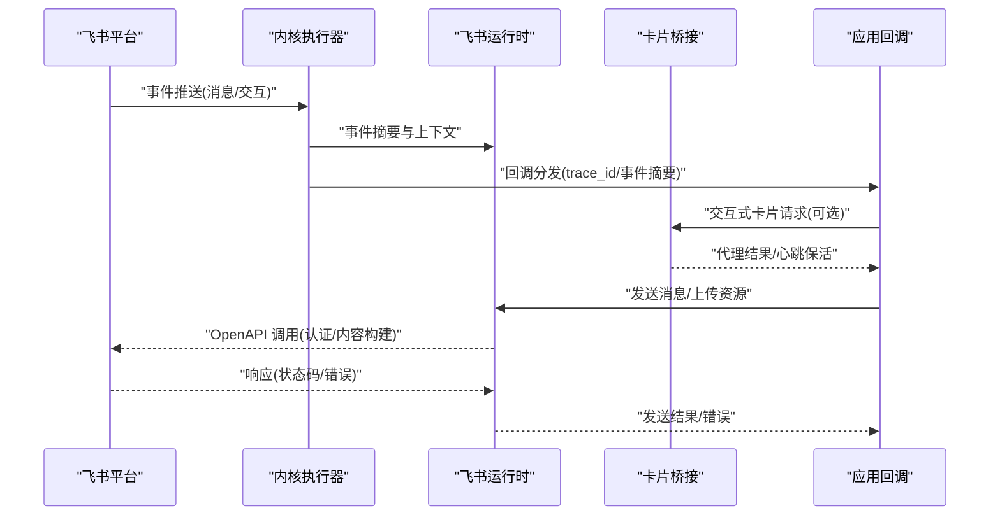
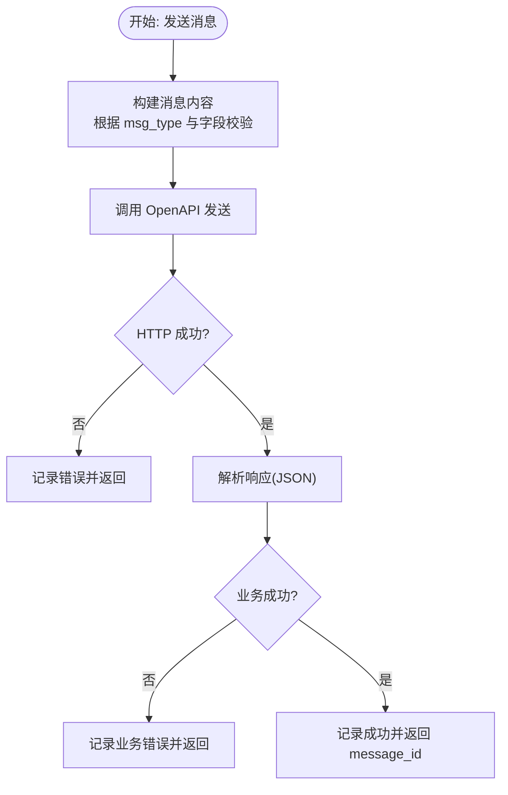
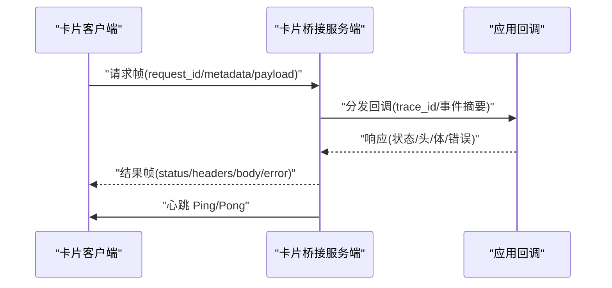
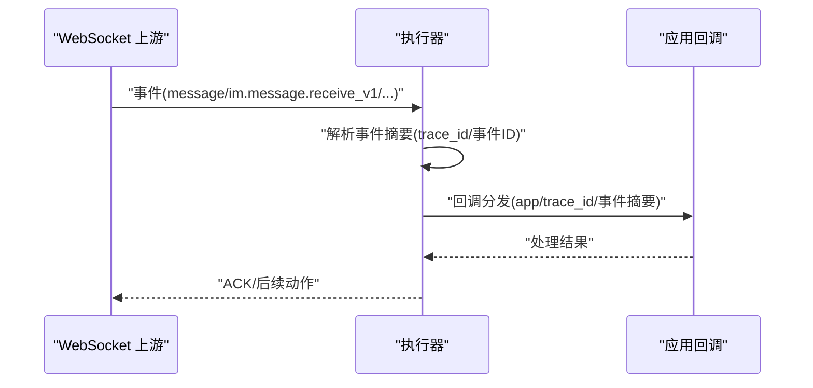
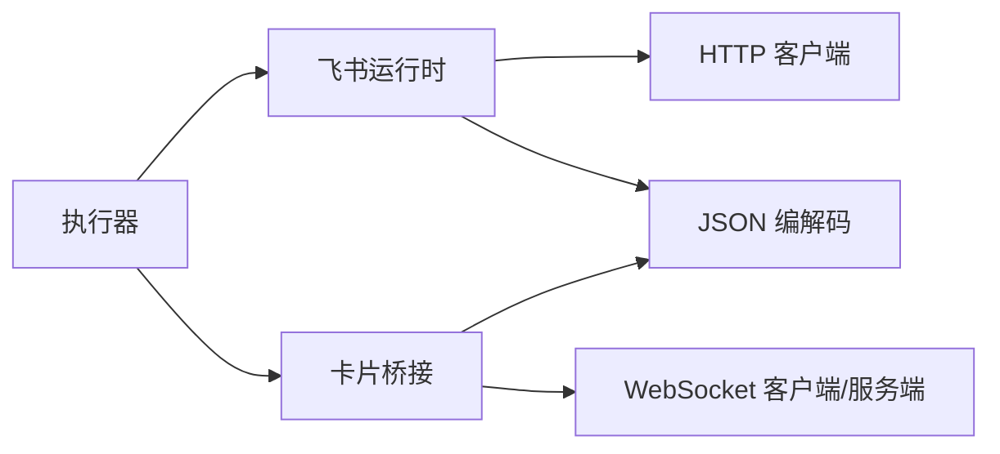

# 飞书(Feishu) 集成

<cite>
**本文引用的文件**
- [src/feishu_runtime.v](file://src/feishu_runtime.v)
- [src/feishu_card_bridge.v](file://src/feishu_card_bridge.v)
- [src/inproc_vjsx_executor.v](file://src/inproc_vjsx_executor.v)
- [examples/codexbot-app-ts/feishu/inbound.mts](file://examples/codexbot-app-ts/feishu/inbound.mts)
- [examples/codexbot-app-ts/feishu/card-policy.mts](file://examples/codexbot-app-ts/feishu/card-policy.mts)
- [examples/codexbot-app-ts/lib/feishu.mts](file://examples/codexbot-app-ts/lib/feishu.mts)
- [examples/codexbot-app-ts/lib/commands.mts](file://examples/codexbot-app-ts/lib/commands.mts)
- [examples/codexbot-app-ts/app.mts](file://examples/codexbot-app-ts/app.mts)
- [examples/feishu_cb-app-ts/app.mts](file://examples/feishu_cb-app-ts/app.mts)
- [examples/config/feishu-bot.toml](file://examples/config/feishu-bot.toml)
- [examples/config/feishu-paseo.toml](file://examples/config/feishu-paseo.toml)
- [articles/07-feishu-bot.md](file://articles/07-feishu-bot.md)
- [docs/FEISHU_STREAMING_CARD_PLAN.md](file://docs/FEISHU_STREAMING_CARD_PLAN.md)
- [docs/WEBSOCKET_EVENT_BUS_PLAN.md](file://docs/WEBSOCKET_EVENT_BUS_PLAN.md)
- [docs/WEBSOCKET_MESSAGE_DISPATCH_PLAN.md](file://docs/WEBSOCKET_MESSAGE_DISPATCH_PLAN.md)
- [docs/WEBSOCKET_MVP_PLAN.md](file://docs/WEBSOCKET_MVP_PLAN.md)
- [docs/FEISHU_GATEWAY_REMOVAL_PLAN.md](file://docs/FEISHU_GATEWAY_REMOVAL_PLAN.md)
- [docs/FEISHU_RUNTIME_COMPATIBILITY_PLAN.md](file://docs/FEISHU_RUNTIME_COMPATIBILITY_PLAN.md)
- [docs/FEISHU_INSTANCE_RUNTIME_PLAN.md](file://docs/FEISHU_INSTANCE_RUNTIME_PLAN.md)
- [src/executor/inproc_vjsx_executor.v](file://src/executor/inproc_vjsx_executor.v)
- [src/inproc_vjsx_executor_codexbot_test_helpers.v](file://src/inproc_vjsx_executor_codexbot_test_helpers.v)
</cite>

## 目录
1. [简介](#简介)
2. [项目结构](#项目结构)
3. [核心组件](#核心组件)
4. [架构总览](#架构总览)
5. [详细组件分析](#详细组件分析)
6. [依赖关系分析](#依赖关系分析)
7. [性能考虑](#性能考虑)
8. [故障排查指南](#故障排查指南)
9. [结论](#结论)
10. [附录](#附录)

## 简介
本技术文档面向企业开发者，系统性阐述飞书(Feishu)集成在本仓库中的实现与使用方法。内容覆盖飞书机器人的长连接管理、事件订阅机制、消息发送流程；卡片桥接系统的交互式卡片渲染、事件处理与状态管理；飞书消息类型处理（文本、图片、文件等）；认证流程、API 限制与最佳实践；以及错误处理、重连机制与性能优化策略。文档同时提供可运行的集成示例，帮助快速落地。

## 项目结构
本项目围绕“内核执行器 + 提供者运行时”的分层设计组织飞书能力：
- 内核执行器：负责统一调度、桥接回调、事件派发与生命周期管理
- 飞书运行时：封装飞书 OpenAPI 调用、认证令牌缓存与刷新、消息构建与发送
- 卡片桥接：通过 WebSocket 建立卡片客户端与服务端的双向通信通道
- 示例应用：提供 TypeScript 与 PHP 的飞书机器人示例，演示事件入站、命令路由与卡片交互

```mermaid
graph TB
subgraph "内核执行器"
EX["InProcVjsx 执行器<br/>事件桥接与回调分发"]
end
subgraph "飞书运行时"
RT["飞书运行时<br/>认证/消息发送/上传资源"]
MSG["消息构建与发送<br/>支持多消息类型"]
AUTH["租户访问令牌缓存/刷新"]
end
subgraph "卡片桥接"
BR["卡片桥接服务端<br/>WebSocket 会话管理"]
CLI["卡片桥接客户端<br/>WebSocket 客户端"]
end
subgraph "示例应用"
TS["TypeScript 示例应用<br/>事件入站/命令路由/卡片策略"]
PHP["PHP 示例应用<br/>机器人入口/配置"]
end
EX --> RT
EX --> BR
RT --> MSG
RT --> AUTH
BR <- --> CLI
TS --> EX
PHP --> EX
```

**图表来源**
- [src/feishu_runtime.v](file://src/feishu_runtime.v)
- [src/feishu_card_bridge.v](file://src/feishu_card_bridge.v)
- [src/inproc_vjsx_executor.v](file://src/inproc_vjsx_executor.v)
- [examples/codexbot-app-ts/app.mts](file://examples/codexbot-app-ts/app.mts)
- [examples/feishu_cb-app-ts/app.mts](file://examples/feishu_cb-app-ts/app.mts)

**章节来源**
- [src/feishu_runtime.v](file://src/feishu_runtime.v)
- [src/feishu_card_bridge.v](file://src/feishu_card_bridge.v)
- [src/inproc_vjsx_executor.v](file://src/inproc_vjsx_executor.v)
- [examples/codexbot-app-ts/app.mts](file://examples/codexbot-app-ts/app.mts)
- [examples/feishu_cb-app-ts/app.mts](file://examples/feishu_cb-app-ts/app.mts)

## 核心组件
- 飞书运行时（消息发送与认证）
  - 支持多种消息类型：文本、图片、文件、音频、贴图、媒体、富文本卡片等
  - 统一的消息内容构建逻辑与字段校验
  - 租户访问令牌缓存与自动刷新
  - 图片上传与 multipart 表单提交
- 卡片桥接系统（交互式卡片）
  - 服务端 WebSocket 会话管理与心跳保活
  - 客户端消息回调、代理结果回传、错误与关闭处理
  - 请求去重与挂起队列管理
- 内核执行器桥接（回调分发）
  - 将飞书事件摘要与请求上下文传递给应用层回调
  - JS 函数桥接与请求追踪 ID 管理
- 示例应用（事件入站与命令路由）
  - TypeScript 示例：事件入站、卡片策略、命令路由
  - 配置文件：飞书机器人应用配置与实例参数

**章节来源**
- [src/feishu_runtime.v](file://src/feishu_runtime.v)
- [src/feishu_card_bridge.v](file://src/feishu_card_bridge.v)
- [src/inproc_vjsx_executor.v](file://src/inproc_vjsx_executor.v)
- [examples/codexbot-app-ts/feishu/inbound.mts](file://examples/codexbot-app-ts/feishu/inbound.mts)
- [examples/codexbot-app-ts/feishu/card-policy.mts](file://examples/codexbot-app-ts/feishu/card-policy.mts)
- [examples/codexbot-app-ts/lib/commands.mts](file://examples/codexbot-app-ts/lib/commands.mts)
- [examples/config/feishu-bot.toml](file://examples/config/feishu-bot.toml)

## 架构总览
下图展示了从飞书事件到应用回调、再到卡片桥接与消息发送的整体链路：



**图表来源**
- [src/feishu_runtime.v](file://src/feishu_runtime.v)
- [src/feishu_card_bridge.v](file://src/feishu_card_bridge.v)
- [src/inproc_vjsx_executor.v](file://src/inproc_vjsx_executor.v)

## 详细组件分析

### 飞书运行时（消息发送与认证）
- 认证与令牌管理
  - 自动获取租户访问令牌并缓存，带过期时间与刷新偏移
  - 多应用配置与并发安全
- 消息发送
  - 统一的发送请求结构体，支持 receive_id_type、msg_type、content、content_fields、text、uuid
  - 消息内容构建函数根据 msg_type 生成 JSON 内容，并进行字段校验
  - 支持文本、图片、文件、音频、贴图、媒体等类型
- 资源上传
  - 图片上传支持 base64 解码与 multipart 表单提交
  - 上传大小限制与错误处理
- 错误处理
  - HTTP 请求失败、状态码非 200、响应解析失败、业务错误码等均进行错误返回与日志记录



**图表来源**
- [src/feishu_runtime.v](file://src/feishu_runtime.v)

**章节来源**
- [src/feishu_runtime.v](file://src/feishu_runtime.v)

### 卡片桥接系统（交互式卡片）
- 服务端 WebSocket
  - 会话建立、消息回调、心跳保活、错误与关闭处理
  - 客户端注册与去重、挂起请求管理
- 客户端 WebSocket
  - 请求帧解析、代理结果回传、心跳帧处理
- 回调分发
  - 将卡片请求转发至应用回调，返回统一结果帧



**图表来源**
- [src/feishu_card_bridge.v](file://src/feishu_card_bridge.v)

**章节来源**
- [src/feishu_card_bridge.v](file://src/feishu_card_bridge.v)

### 内核执行器桥接（回调分发）
- JS 函数桥接
  - 将飞书事件摘要与请求上下文注入应用回调
  - 统一的请求追踪 ID 管理与错误回传
- 测试辅助
  - 提供模拟飞书消息事件的测试工具函数，便于端到端验证



**图表来源**
- [src/inproc_vjsx_executor.v](file://src/inproc_vjsx_executor.v)
- [src/inproc_vjsx_executor_codexbot_test_helpers.v](file://src/inproc_vjsx_executor_codexbot_test_helpers.v)

**章节来源**
- [src/inproc_vjsx_executor.v](file://src/inproc_vjsx_executor.v)
- [src/inproc_vjsx_executor_codexbot_test_helpers.v](file://src/inproc_vjsx_executor_codexbot_test_helpers.v)

### 示例应用（事件入站、命令路由与卡片策略）
- TypeScript 示例
  - 事件入站：接收飞书消息事件并进行预处理
  - 命令路由：解析命令并分发到对应处理器
  - 卡片策略：定义卡片渲染规则与交互行为
- 配置文件
  - 飞书机器人应用配置（应用 ID/密钥/验证令牌/加密密钥）
  - 实例参数与运行时配置

**章节来源**
- [examples/codexbot-app-ts/feishu/inbound.mts](file://examples/codexbot-app-ts/feishu/inbound.mts)
- [examples/codexbot-app-ts/feishu/card-policy.mts](file://examples/codexbot-app-ts/feishu/card-policy.mts)
- [examples/codexbot-app-ts/lib/commands.mts](file://examples/codexbot-app-ts/lib/commands.mts)
- [examples/codexbot-app-ts/app.mts](file://examples/codexbot-app-ts/app.mts)
- [examples/feishu_cb-app-ts/app.mts](file://examples/feishu_cb-app-ts/app.mts)
- [examples/config/feishu-bot.toml](file://examples/config/feishu-bot.toml)
- [examples/config/feishu-paseo.toml](file://examples/config/feishu-paseo.toml)

## 依赖关系分析
- 组件耦合
  - 飞书运行时与卡片桥接共享应用状态与互斥锁，确保并发安全
  - 内核执行器通过统一接口与应用回调解耦
- 外部依赖
  - HTTP 客户端用于 OpenAPI 调用
  - WebSocket 用于卡片桥接与心跳保活
  - JSON 编解码用于消息与请求体序列化
- 可能的循环依赖
  - 当前结构以“运行时/桥接/执行器”分层，未见直接循环依赖



**图表来源**
- [src/feishu_runtime.v](file://src/feishu_runtime.v)
- [src/feishu_card_bridge.v](file://src/feishu_card_bridge.v)
- [src/inproc_vjsx_executor.v](file://src/inproc_vjsx_executor.v)

**章节来源**
- [src/feishu_runtime.v](file://src/feishu_runtime.v)
- [src/feishu_card_bridge.v](file://src/feishu_card_bridge.v)
- [src/inproc_vjsx_executor.v](file://src/inproc_vjsx_executor.v)

## 性能考虑
- 并发与限流
  - 运行时对 HTTP 请求加锁，避免并发竞争
  - 令牌缓存与刷新减少重复鉴权开销
- 心跳与保活
  - 卡片桥接服务端定时发送心跳帧，维持长连接稳定
- 资源上传
  - 上传大小限制与 base64 解码前置校验，降低无效请求成本
- 日志与可观测性
  - 关键路径（发送、响应、错误）均有日志记录，便于定位性能瓶颈

**章节来源**
- [src/feishu_runtime.v](file://src/feishu_runtime.v)
- [src/feishu_card_bridge.v](file://src/feishu_card_bridge.v)

## 故障排查指南
- 认证失败
  - 检查应用配置（应用 ID/密钥/验证令牌/加密密钥）
  - 查看租户访问令牌获取与缓存是否正常
- 消息发送失败
  - 核对 receive_id_type、msg_type、content_fields 等参数
  - 关注 HTTP 状态码与业务错误码
- 卡片桥接异常
  - 检查 WebSocket 握手、心跳帧与消息帧格式
  - 关注客户端错误回调与关闭事件
- 重连与恢复
  - 卡片桥接服务端在握手失败或错误时清理客户端连接
  - 建议在应用层实现指数退避与最大重试次数

**章节来源**
- [src/feishu_runtime.v](file://src/feishu_runtime.v)
- [src/feishu_card_bridge.v](file://src/feishu_card_bridge.v)

## 结论
本仓库提供了完整的飞书集成方案：从认证与消息发送，到交互式卡片桥接与回调分发，再到示例应用与配置模板。通过分层设计与严格的错误处理、心跳保活与并发控制，能够满足企业级飞书应用的稳定性与可维护性要求。建议结合示例应用与配置文件快速搭建，并在生产环境关注令牌缓存、上传限制与日志监控。

## 附录
- 飞书机器人文章与计划文档
  - 飞书机器人概述与实现要点
  - 卡片流式传输与事件总线/消息派发计划
  - 运行时兼容性与实例运行计划
- 示例配置
  - 飞书机器人应用配置
  - Paseo 中继配置（可选）

**章节来源**
- [articles/07-feishu-bot.md](file://articles/07-feishu-bot.md)
- [docs/FEISHU_STREAMING_CARD_PLAN.md](file://docs/FEISHU_STREAMING_CARD_PLAN.md)
- [docs/WEBSOCKET_EVENT_BUS_PLAN.md](file://docs/WEBSOCKET_EVENT_BUS_PLAN.md)
- [docs/WEBSOCKET_MESSAGE_DISPATCH_PLAN.md](file://docs/WEBSOCKET_MESSAGE_DISPATCH_PLAN.md)
- [docs/WEBSOCKET_MVP_PLAN.md](file://docs/WEBSOCKET_MVP_PLAN.md)
- [docs/FEISHU_GATEWAY_REMOVAL_PLAN.md](file://docs/FEISHU_GATEWAY_REMOVAL_PLAN.md)
- [docs/FEISHU_RUNTIME_COMPATIBILITY_PLAN.md](file://docs/FEISHU_RUNTIME_COMPATIBILITY_PLAN.md)
- [docs/FEISHU_INSTANCE_RUNTIME_PLAN.md](file://docs/FEISHU_INSTANCE_RUNTIME_PLAN.md)
- [examples/config/feishu-bot.toml](file://examples/config/feishu-bot.toml)
- [examples/config/feishu-paseo.toml](file://examples/config/feishu-paseo.toml)