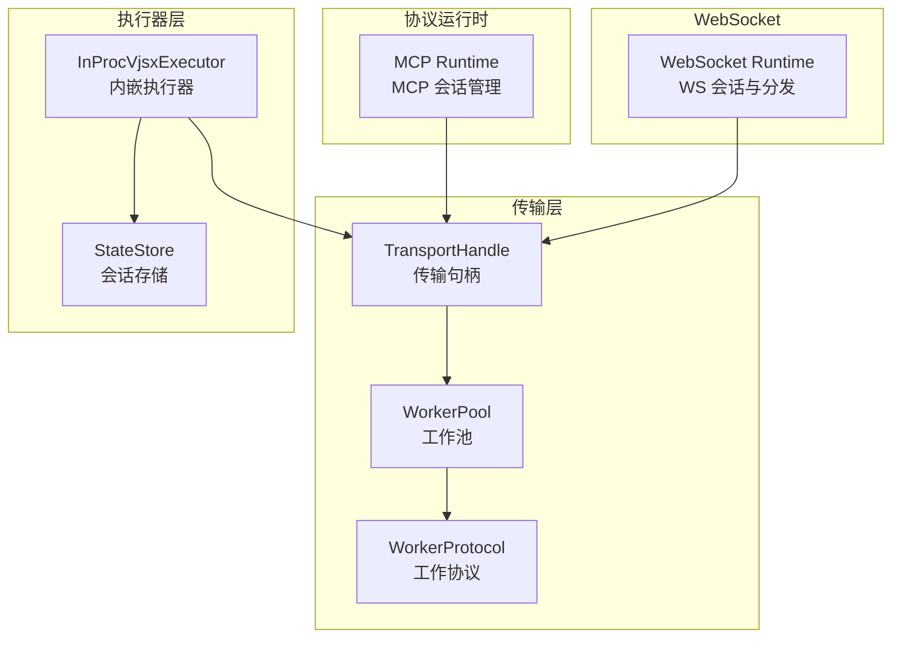
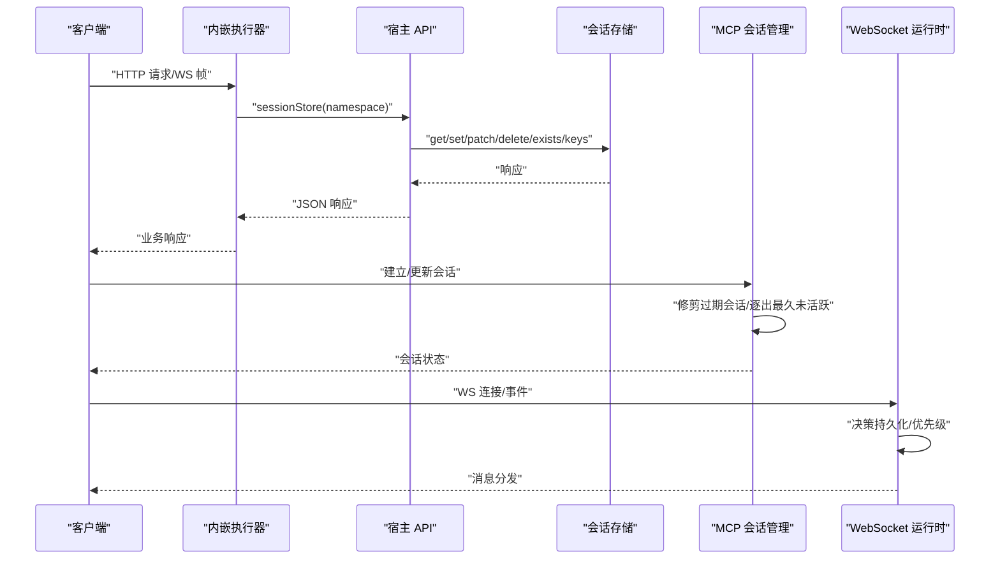
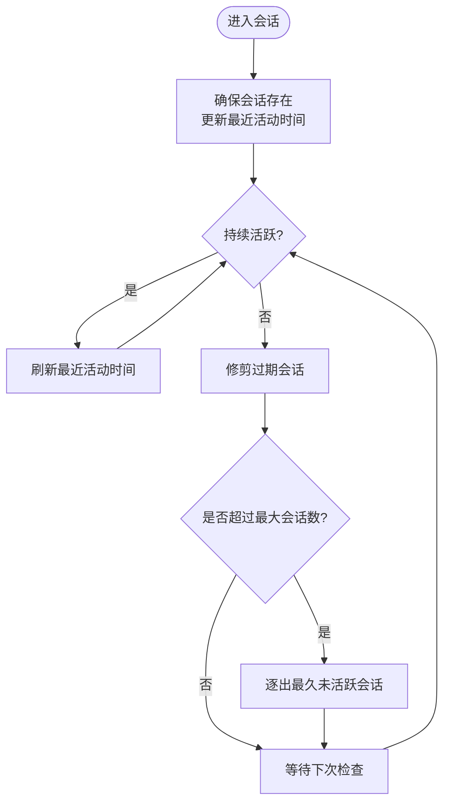
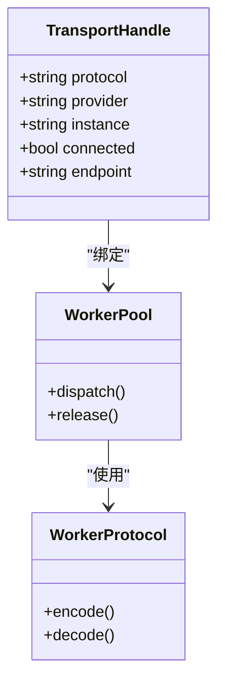
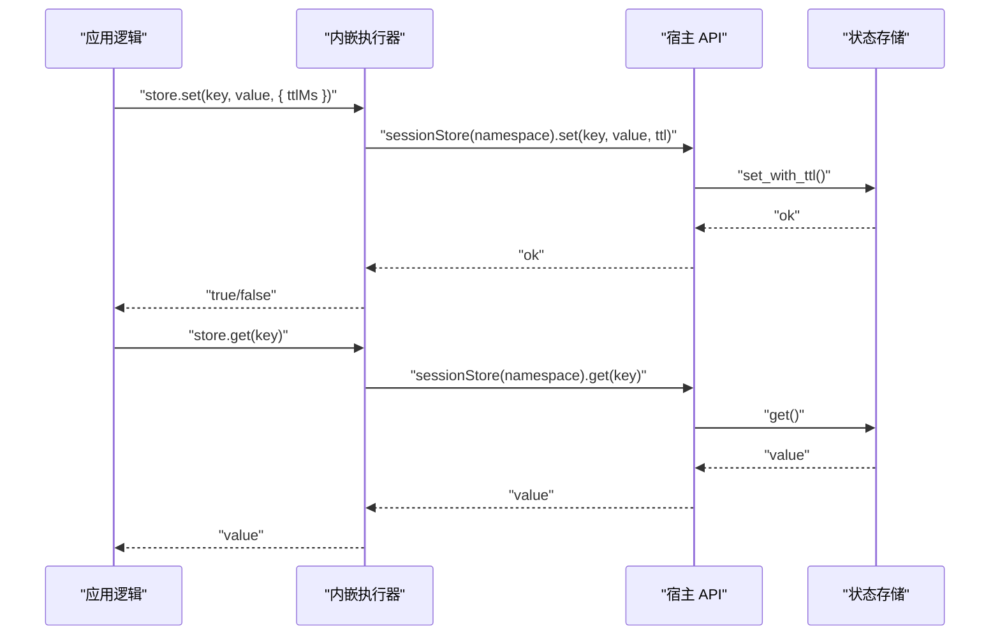
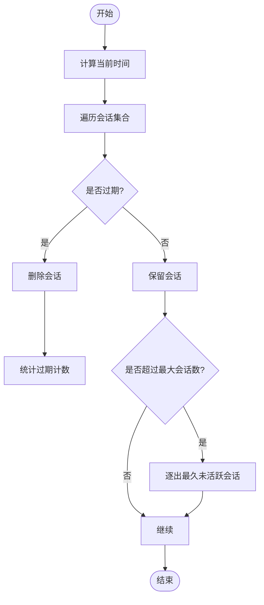
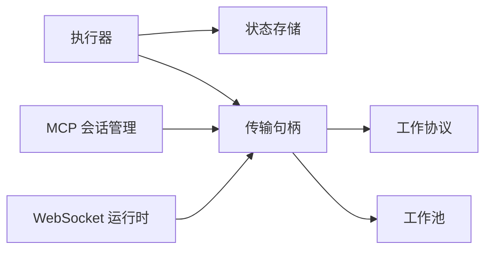

# 会话句柄管理

<cite>
**本文引用的文件**
- [session_handle.v](file://src/transport/session_handle.v)
- [transport_handle.v](file://src/transport/transport_handle.v)
- [worker_protocol.v](file://src/transport/worker_protocol.v)
- [worker_pool.v](file://src/transport/worker_pool.v)
- [inproc_vjsx_executor.v](file://src/executor/inproc_vjsx_executor.v)
- [mcp_runtime.v](file://src/mcp_runtime.v)
- [websocket_runtime.v](file://src/websocket_runtime.v)
- [state_store.v](file://src/state_store/state_store.v)
- [inproc_vjsx_host_api_test.v](file://src/inproc_vjsx_host_api_test.v)
- [inproc_vjsx_executor_test.v](file://src/inproc_vjsx_executor_test.v)
- [inproc_vjsx_http_facade.js](file://src/inproc_vjsx_http_facade.js)
- [db_runtime.v](file://dbsrc/db_runtime.v)
</cite>

## 目录
1. [简介](#简介)
2. [项目结构](#项目结构)
3. [核心组件](#核心组件)
4. [架构总览](#架构总览)
5. [详细组件分析](#详细组件分析)
6. [依赖关系分析](#依赖关系分析)
7. [性能考量](#性能考量)
8. [故障排查指南](#故障排查指南)
9. [结论](#结论)
10. [附录](#附录)

## 简介
本文件围绕 vhttpd 的“会话句柄管理”主题，系统阐述会话生命周期（创建、状态维护、销毁回收）、会话标识生成策略与唯一性保障、不同协议下的会话绑定方式、传输句柄实现细节（HTTP/WebSocket/长连接）、会话状态持久化与恢复（断线重连与状态同步）、会话超时与资源清理策略，以及会话监控与诊断方法。内容以代码为依据，辅以图示帮助理解。

## 项目结构
与会话句柄管理直接相关的模块主要分布在以下子系统：
- 传输层：会话句柄、传输句柄、工作池与协议
- 执行器层：内嵌 VJSX 执行器对会话存储的封装与调用
- 协议运行时：MCP 会话管理与超时清理
- WebSocket 运行时：WebSocket 会话与事件分发
- 状态存储：会话状态持久化与并发安全
- 数据库运行时：事务会话的回收与连接复用

图表来源
- [transport_handle.v:1-20](file://src/transport/transport_handle.v#L1-L20)
- [worker_pool.v](file://src/transport/worker_pool.v)
- [worker_protocol.v](file://src/transport/worker_protocol.v)
- [inproc_vjsx_executor.v:4033-4118](file://src/executor/inproc_vjsx_executor.v#L4033-L4118)
- [state_store.v](file://src/state_store/state_store.v)
- [mcp_runtime.v:57-159](file://src/mcp_runtime.v#L57-L159)
- [websocket_runtime.v](file://src/websocket_runtime.v)

章节来源
- [transport_handle.v:1-20](file://src/transport/transport_handle.v#L1-L20)
- [worker_pool.v](file://src/transport/worker_pool.v)
- [worker_protocol.v](file://src/transport/worker_protocol.v)
- [inproc_vjsx_executor.v:4033-4118](file://src/executor/inproc_vjsx_executor.v#L4033-L4118)
- [state_store.v](file://src/state_store/state_store.v)
- [mcp_runtime.v:57-159](file://src/mcp_runtime.v#L57-L159)
- [websocket_runtime.v](file://src/websocket_runtime.v)

## 核心组件
- 会话句柄（TransportHandle）：抽象传输连接的元信息，支持 WebSocket 类型的构造与属性访问。
- 传输句柄（TransportHandle）：承载协议、提供者、实例、连接状态与端点等字段。
- 工作池与协议：负责承载不同协议的连接并进行消息帧处理。
- 内嵌执行器（InProcVjsxExecutor）：提供会话存储 API，支持 get/set/patch/delete/exists/keys 等操作，并可设置 TTL。
- MCP 会话管理：生成会话 ID、确保会话存在、修剪过期会话、逐出最久未活跃会话。
- WebSocket 运行时：处理 WebSocket 事件与消息分发，支持持久化决策与优先级控制。
- 状态存储：提供并发安全的键值存储，支持比较交换、删除与键前缀查询。
- 数据库运行时：事务会话的回收、连接复用与关闭。

章节来源
- [transport_handle.v:1-20](file://src/transport/transport_handle.v#L1-L20)
- [inproc_vjsx_executor.v:4033-4118](file://src/executor/inproc_vjsx_executor.v#L4033-L4118)
- [mcp_runtime.v:57-159](file://src/mcp_runtime.v#L57-L159)
- [websocket_runtime.v](file://src/websocket_runtime.v)
- [state_store.v](file://src/state_store/state_store.v)
- [db_runtime.v:344-391](file://dbsrc/db_runtime.v#L344-L391)

## 架构总览
下图展示 vhttpd 中与会话句柄管理相关的关键交互：执行器通过会话存储接口与宿主通信；MCP 运行时维护会话集合；WebSocket 运行时处理双向消息；传输层承载底层连接与协议帧。

图表来源
- [inproc_vjsx_executor.v:4033-4118](file://src/executor/inproc_vjsx_executor.v#L4033-L4118)
- [state_store.v](file://src/state_store/state_store.v)
- [mcp_runtime.v:73-159](file://src/mcp_runtime.v#L73-L159)
- [websocket_runtime.v](file://src/websocket_runtime.v)

## 详细组件分析

### 会话生命周期与状态维护
- 创建：当请求到达或 WebSocket 连接建立时，执行器根据命名空间获取会话存储；若需要，MCP 运行时会确保会话存在并更新最近活动时间。
- 维护：每次活动（HTTP 请求、WS 帧、MCP 消息）都会刷新最近活动时间；同时，定期修剪过期会话并按策略逐出最久未活跃会话。
- 销毁回收：会话超时后自动删除；在 MCP 层还提供逐出策略；数据库事务会话在结束时复位并归还到连接池或关闭。

图表来源
- [mcp_runtime.v:73-159](file://src/mcp_runtime.v#L73-L159)

章节来源
- [mcp_runtime.v:57-159](file://src/mcp_runtime.v#L57-L159)

### 会话标识生成策略与唯一性
- 生成策略：MCP 会话 ID 使用带前缀的时间戳微秒级值生成，确保高并发场景下的唯一性。
- 唯一性保障：时间戳微秒级粒度结合固定前缀，降低冲突概率；配合最大会话数限制与逐出策略，进一步降低碰撞风险。

章节来源
- [mcp_runtime.v:57-63](file://src/mcp_runtime.v#L57-L63)

### 不同协议下的会话绑定方式
- HTTP：通过执行器的会话存储 API 访问命名空间内的键值数据，实现请求间的状态共享。
- WebSocket：执行器根据返回的决策对象决定是否持久化与优先级，WS 运行时据此进行消息分发与连接管理。
- 长连接：由传输层的工作池与协议承载，会话状态通过会话存储与 MCP 会话管理共同维护。

章节来源
- [inproc_vjsx_executor.v:4033-4118](file://src/executor/inproc_vjsx_executor.v#L4033-L4118)
- [websocket_runtime.v](file://src/websocket_runtime.v)
- [transport_handle.v:1-20](file://src/transport/transport_handle.v#L1-L20)

### 传输句柄实现细节
- 传输句柄结构：包含协议类型、提供者、实例、连接状态与端点等字段，便于统一管理不同传输类型。
- WebSocket 构造：提供专用工厂函数用于创建 WebSocket 传输句柄，便于后续绑定与调度。
- 工作池与协议：工作池负责承载连接，协议定义帧格式与处理流程，二者协同完成消息收发。

图表来源
- [transport_handle.v:1-20](file://src/transport/transport_handle.v#L1-L20)
- [worker_pool.v](file://src/transport/worker_pool.v)
- [worker_protocol.v](file://src/transport/worker_protocol.v)

章节来源
- [transport_handle.v:1-20](file://src/transport/transport_handle.v#L1-L20)
- [worker_pool.v](file://src/transport/worker_pool.v)
- [worker_protocol.v](file://src/transport/worker_protocol.v)

### 会话状态持久化与恢复机制
- 持久化接口：执行器提供 sessionStore(namespace) API，支持 get/set/patch/delete/exists/keys 等操作，并可设置 TTL。
- 恢复与断线重连：测试用例验证同一命名空间内的状态在多次请求之间保持一致，表明断线重连后可恢复状态。
- 与宿主通信：执行器通过宿主 API 将请求转发至宿主侧的会话存储实现，最终由状态存储模块提供并发安全的键值服务。

图表来源
- [inproc_vjsx_executor.v:4033-4118](file://src/executor/inproc_vjsx_executor.v#L4033-L4118)
- [state_store.v](file://src/state_store/state_store.v)
- [inproc_vjsx_host_api_test.v:58-124](file://src/inproc_vjsx_host_api_test.v#L58-L124)

章节来源
- [inproc_vjsx_executor.v:4033-4118](file://src/executor/inproc_vjsx_executor.v#L4033-L4118)
- [state_store.v](file://src/state_store/state_store.v)
- [inproc_vjsx_host_api_test.v:58-124](file://src/inproc_vjsx_host_api_test.v#L58-L124)

### 会话超时管理与资源清理策略
- 超时修剪：MCP 运行时在每次确保会话前先修剪过期会话，过期判定基于最近活动时间与配置的 TTL。
- 逐出策略：当会话数量达到上限时，逐出最久未活跃的会话，避免内存膨胀。
- 事务会话回收：数据库运行时在事务结束后复位连接并归还到连接池，不可复用则关闭，防止连接泄漏。

图表来源
- [mcp_runtime.v:73-114](file://src/mcp_runtime.v#L73-L114)
- [db_runtime.v:344-391](file://dbsrc/db_runtime.v#L344-L391)

章节来源
- [mcp_runtime.v:73-114](file://src/mcp_runtime.v#L73-L114)
- [db_runtime.v:344-391](file://dbsrc/db_runtime.v#L344-L391)

### 会话监控与诊断工具
- 测试用例验证：通过单元测试验证会话存储在多次请求之间的持久化行为，断言存在性与值一致性。
- WebSocket 行为验证：测试用例覆盖 WebSocket 场景下定时器与会话状态的持久化，确保目标变更时的排空策略不被破坏。
- 宿主 API：执行器通过宿主 API 暴露 sessionStore 接口，便于在运行时进行状态查询与调试。

章节来源
- [inproc_vjsx_host_api_test.v:58-124](file://src/inproc_vjsx_host_api_test.v#L58-L124)
- [inproc_vjsx_executor_test.v:2731-2784](file://src/inproc_vjsx_executor_test.v#L2731-L2784)
- [inproc_vjsx_executor.v:4033-4118](file://src/executor/inproc_vjsx_executor.v#L4033-L4118)

## 依赖关系分析
- 执行器依赖状态存储：通过宿主 API 间接依赖状态存储模块，实现键值持久化。
- MCP 会话管理依赖时间与锁：使用时间戳与互斥锁保证会话集合的一致性与过期修剪。
- WebSocket 运行时依赖执行器决策：根据执行器返回的持久化与优先级决策进行消息分发。
- 传输层依赖工作池与协议：统一承载不同协议的连接与帧处理。

图表来源
- [inproc_vjsx_executor.v:4033-4118](file://src/executor/inproc_vjsx_executor.v#L4033-L4118)
- [state_store.v](file://src/state_store/state_store.v)
- [mcp_runtime.v:116-159](file://src/mcp_runtime.v#L116-L159)
- [websocket_runtime.v](file://src/websocket_runtime.v)
- [transport_handle.v:1-20](file://src/transport/transport_handle.v#L1-L20)
- [worker_protocol.v](file://src/transport/worker_protocol.v)
- [worker_pool.v](file://src/transport/worker_pool.v)

章节来源
- [inproc_vjsx_executor.v:4033-4118](file://src/executor/inproc_vjsx_executor.v#L4033-L4118)
- [state_store.v](file://src/state_store/state_store.v)
- [mcp_runtime.v:116-159](file://src/mcp_runtime.v#L116-L159)
- [websocket_runtime.v](file://src/websocket_runtime.v)
- [transport_handle.v:1-20](file://src/transport/transport_handle.v#L1-L20)
- [worker_protocol.v](file://src/transport/worker_protocol.v)
- [worker_pool.v](file://src/transport/worker_pool.v)

## 性能考量
- 会话修剪与逐出：定期修剪过期会话与逐出最久未活跃会话，避免内存与连接资源膨胀。
- 并发安全：状态存储采用并发安全的数据结构与操作（如 compare-and-swap），减少锁竞争。
- 连接复用：数据库事务会话结束后复位并归还到连接池，提升连接利用率。
- TTL 策略：通过 TTL 控制会话数据的生命周期，降低无效数据占用。

## 故障排查指南
- 会话丢失：检查 MCP 会话修剪与逐出策略是否触发；确认 TTL 设置是否过短。
- 状态不一致：核对执行器的 sessionStore 操作是否正确传入命名空间与键；查看宿主 API 是否正常返回。
- WebSocket 断线重连异常：确认 WS 决策对象中的持久化与优先级设置；验证测试用例中关于定时器与状态持久化的逻辑。
- 连接泄漏：检查数据库事务会话的回收路径，确保结束时复位并归还连接池或关闭。

章节来源
- [mcp_runtime.v:73-159](file://src/mcp_runtime.v#L73-L159)
- [inproc_vjsx_executor.v:4033-4118](file://src/executor/inproc_vjsx_executor.v#L4033-L4118)
- [websocket_runtime.v](file://src/websocket_runtime.v)
- [db_runtime.v:344-391](file://dbsrc/db_runtime.v#L344-L391)

## 结论
vhttpd 的会话句柄管理通过“传输句柄 + 执行器会话存储 + MCP 会话管理 + WebSocket 运行时”的组合，实现了跨协议的会话生命周期管理。其关键特性包括：高可靠性的会话 ID 生成、严格的超时修剪与逐出策略、并发安全的状态持久化、以及完善的资源回收机制。借助测试用例与宿主 API，开发者可以有效诊断与优化会话相关问题。

## 附录
- WebSocket 能力声明：前端 Facade 明确声明支持 WebSocket 能力，便于客户端侧行为适配。
  
章节来源
- [inproc_vjsx_http_facade.js:892-918](file://src/inproc_vjsx_http_facade.js#L892-L918)