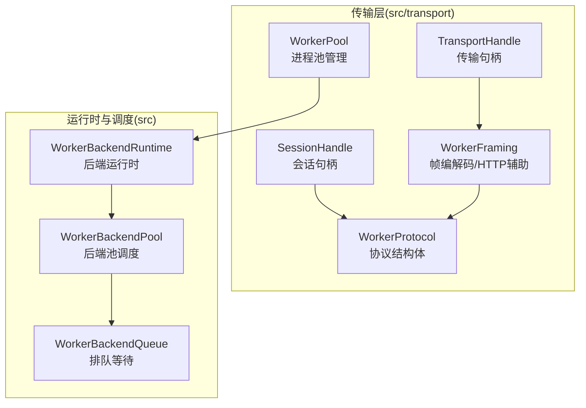
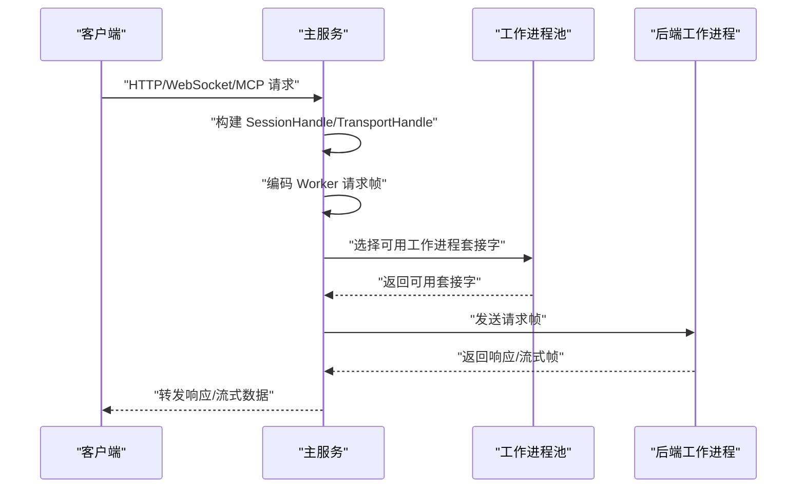
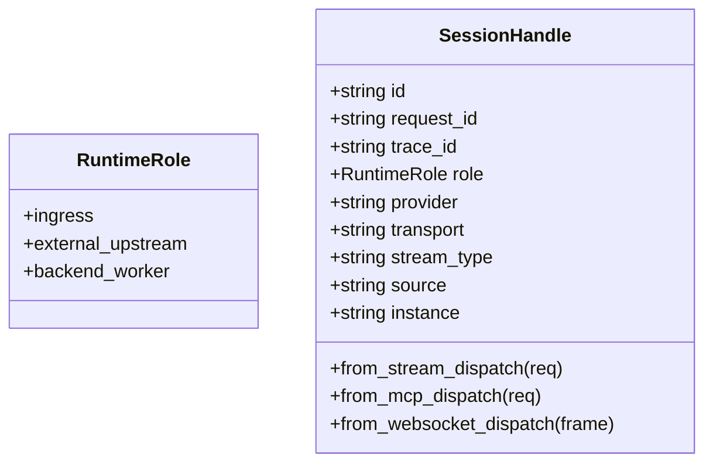
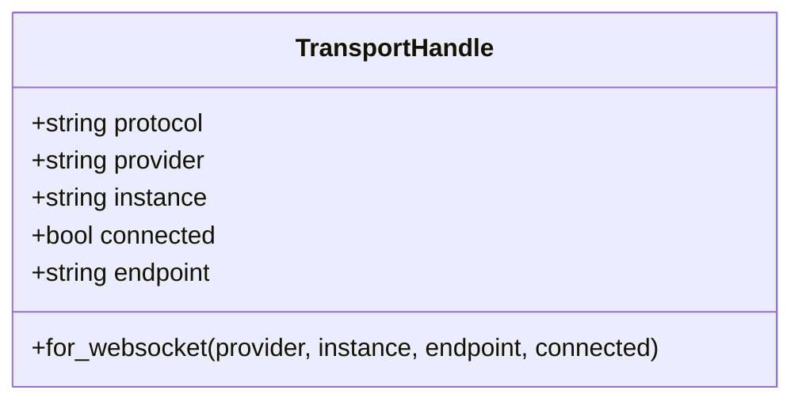
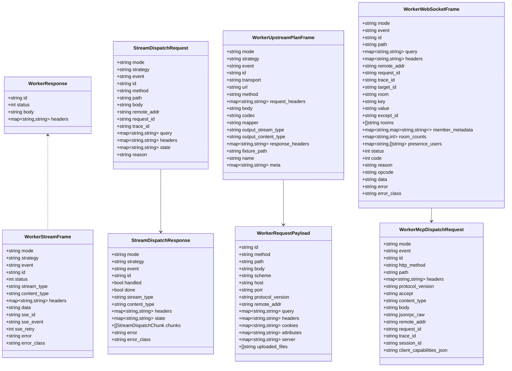
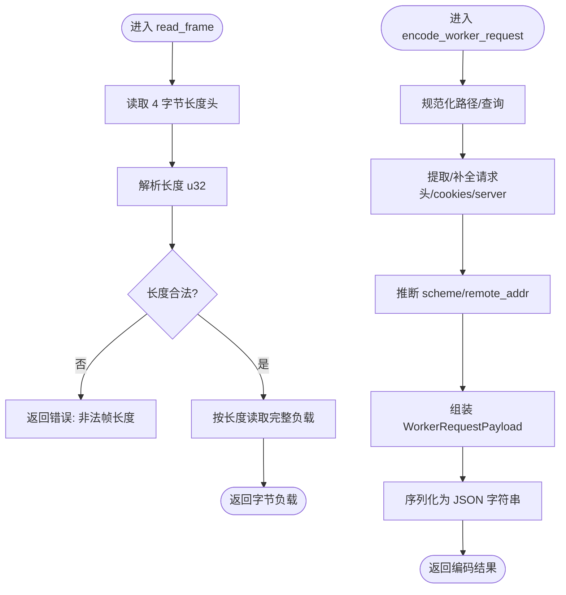
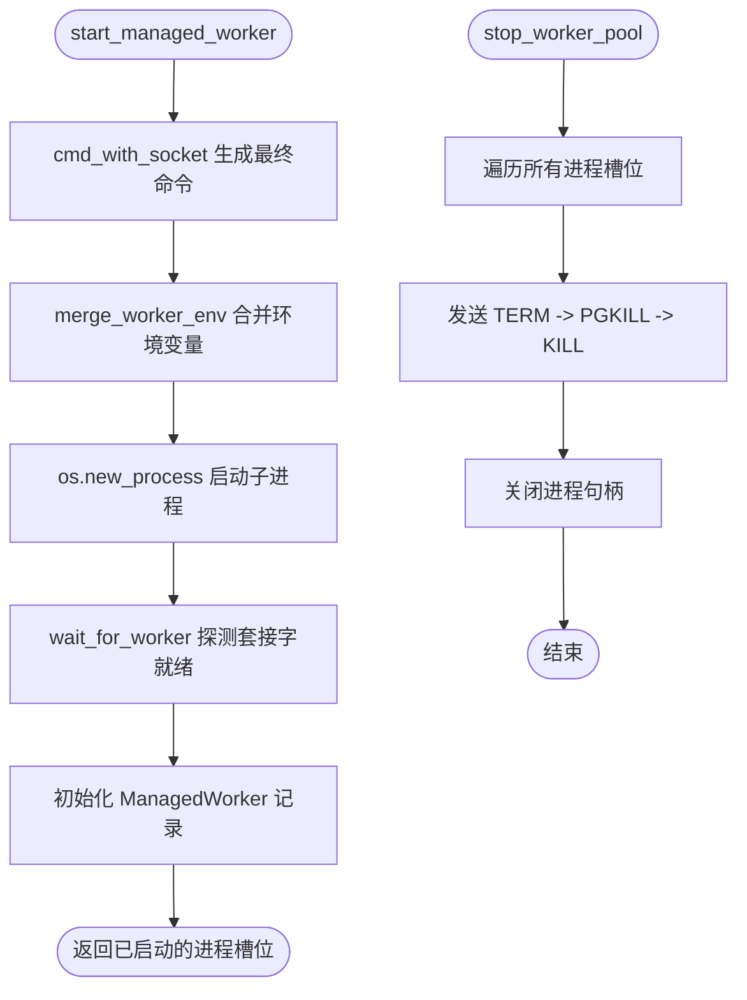
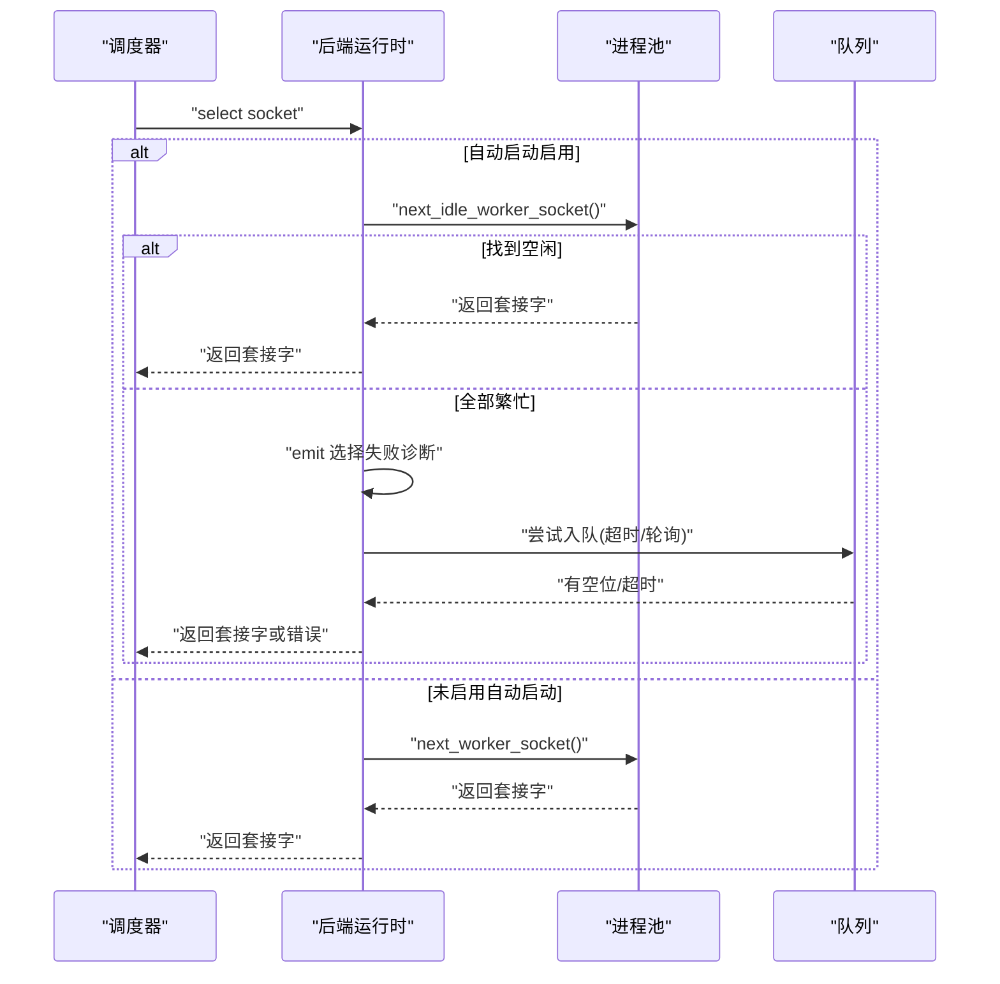
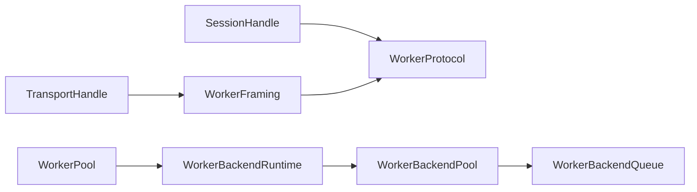

# 传输层处理

<cite>
**本文引用的文件**
- [src/transport/session_handle.v](file://src/transport/session_handle.v)
- [src/transport/transport_handle.v](file://src/transport/transport_handle.v)
- [src/transport/worker_framing.v](file://src/transport/worker_framing.v)
- [src/transport/worker_protocol.v](file://src/transport/worker_protocol.v)
- [src/transport/worker_pool.v](file://src/transport/worker_pool.v)
- [src/worker_backend_runtime.v](file://src/worker_backend_runtime.v)
- [src/worker_backend_pool.v](file://src/worker_backend_pool.v)
- [src/worker_backend_queue.v](file://src/worker_backend_queue.v)
- [config/vhttpd.example.toml](file://config/vhttpd.example.toml)
</cite>

## 目录
1. [引言](#引言)
2. [项目结构](#项目结构)
3. [核心组件](#核心组件)
4. [架构总览](#架构总览)
5. [详细组件分析](#详细组件分析)
6. [依赖关系分析](#依赖关系分析)
7. [性能考量](#性能考量)
8. [故障排查指南](#故障排查指南)
9. [结论](#结论)
10. [附录](#附录)

## 引言
本文件聚焦 vhttpd 的传输层处理，系统性阐述工作进程通信协议的设计与实现，覆盖帧格式、消息传递与状态同步；详解工作进程池的管理策略（池大小调整、负载均衡、健康检查与重启退避）；解释会话句柄与传输句柄的生命周期管理；说明如何处理不同类型的传输协议（HTTP/Stream、WebSocket、MCP）；并给出工作进程编排策略、性能优化建议与故障排查方法，帮助开发者理解并优化传输层性能。

## 项目结构
传输层相关代码主要位于 src/transport 目录，配合运行时与后端调度模块协同工作：
- 会话与传输句柄：定义会话标识、角色、来源与传输属性
- 协议与帧格式：定义 Worker 间通信的数据结构与帧读写
- 帧编解码与 HTTP 辅助：封装二进制帧头、请求编码、查询解析等
- 工作进程池：管理进程生命周期、自动启动、健康探测与重启退避
- 后端运行时与调度：轮询选择空闲工作进程、排队等待与超时控制

**图表来源**
- [src/transport/session_handle.v:1-90](file://src/transport/session_handle.v#L1-L90)
- [src/transport/transport_handle.v:1-21](file://src/transport/transport_handle.v#L1-L21)
- [src/transport/worker_protocol.v:1-272](file://src/transport/worker_protocol.v#L1-L272)
- [src/transport/worker_framing.v:1-173](file://src/transport/worker_framing.v#L1-L173)
- [src/transport/worker_pool.v:1-181](file://src/transport/worker_pool.v#L1-L181)
- [src/worker_backend_runtime.v:1-41](file://src/worker_backend_runtime.v#L1-L41)
- [src/worker_backend_pool.v:201-345](file://src/worker_backend_pool.v#L201-L345)
- [src/worker_backend_queue.v:46-81](file://src/worker_backend_queue.v#L46-L81)

**章节来源**
- [src/transport/session_handle.v:1-90](file://src/transport/session_handle.v#L1-L90)
- [src/transport/transport_handle.v:1-21](file://src/transport/transport_handle.v#L1-L21)
- [src/transport/worker_protocol.v:1-272](file://src/transport/worker_protocol.v#L1-L272)
- [src/transport/worker_framing.v:1-173](file://src/transport/worker_framing.v#L1-L173)
- [src/transport/worker_pool.v:1-181](file://src/transport/worker_pool.v#L1-L181)
- [src/worker_backend_runtime.v:1-41](file://src/worker_backend_runtime.v#L1-L41)
- [src/worker_backend_pool.v:201-345](file://src/worker_backend_pool.v#L201-L345)
- [src/worker_backend_queue.v:46-81](file://src/worker_backend_queue.v#L46-L81)

## 核心组件
- 会话句柄（SessionHandle）
  - 描述一次会话的唯一标识、请求/追踪 ID、角色（入口/外部上游/后端工作进程）、提供者、传输类型、流类型、来源与实例等
  - 提供从多种上游（流分发、MCP、WebSocket）构造会话句柄的工厂函数
- 传输句柄（TransportHandle）
  - 描述底层传输协议（如 websocket）、提供者、实例、连接状态与目标端点
- 协议结构（WorkerProtocol）
  - 定义 Worker 与上游之间的消息契约：响应、流帧、分发请求/响应、上游计划、WebSocket/MCP 消息等
- 帧编解码与 HTTP 辅助（WorkerFraming）
  - 定义二进制帧头（长度前缀）、读写帧、URL/查询参数解析、请求头/Cookie/server 字段提取、Worker 请求编码
- 工作进程池（WorkerPool）
  - 管理进程生命周期、命令拼接、环境合并、启动/停止、健康探测、重启退避策略

**章节来源**
- [src/transport/session_handle.v:4-21](file://src/transport/session_handle.v#L4-L21)
- [src/transport/session_handle.v:23-89](file://src/transport/session_handle.v#L23-L89)
- [src/transport/transport_handle.v:3-10](file://src/transport/transport_handle.v#L3-L10)
- [src/transport/transport_handle.v:12-20](file://src/transport/transport_handle.v#L12-L20)
- [src/transport/worker_protocol.v:4-28](file://src/transport/worker_protocol.v#L4-L28)
- [src/transport/worker_protocol.v:30-71](file://src/transport/worker_protocol.v#L30-L71)
- [src/transport/worker_protocol.v:114-143](file://src/transport/worker_protocol.v#L114-L143)
- [src/transport/worker_protocol.v:181-216](file://src/transport/worker_protocol.v#L181-L216)
- [src/transport/worker_protocol.v:218-271](file://src/transport/worker_protocol.v#L218-L271)
- [src/transport/worker_framing.v:10-44](file://src/transport/worker_framing.v#L10-L44)
- [src/transport/worker_framing.v:124-153](file://src/transport/worker_framing.v#L124-L153)
- [src/transport/worker_pool.v:8-21](file://src/transport/worker_pool.v#L8-L21)
- [src/transport/worker_pool.v:72-95](file://src/transport/worker_pool.v#L72-L95)

## 架构总览
传输层围绕“会话句柄”与“传输句柄”组织，通过“协议结构体”描述消息契约，使用“帧编解码”完成二进制帧传输，由“工作进程池”承载实际业务执行，并通过“后端运行时/调度”进行进程选择与排队。

**图表来源**
- [src/transport/session_handle.v:23-89](file://src/transport/session_handle.v#L23-L89)
- [src/transport/transport_handle.v:12-20](file://src/transport/transport_handle.v#L12-L20)
- [src/transport/worker_framing.v:124-153](file://src/transport/worker_framing.v#L124-L153)
- [src/transport/worker_protocol.v:4-28](file://src/transport/worker_protocol.v#L4-L28)
- [src/worker_backend_pool.v:201-345](file://src/worker_backend_pool.v#L201-L345)

## 详细组件分析

### 会话句柄（SessionHandle）
- 角色枚举：入口、外部上游、后端工作进程
- 来源与实例：区分来自 WebSocket 上游、流分发、MCP 或 WebSocket 分发的不同来源与实例字段
- 工厂函数：从不同上游请求构造统一会话视图，便于日志与追踪

**图表来源**
- [src/transport/session_handle.v:4-21](file://src/transport/session_handle.v#L4-L21)
- [src/transport/session_handle.v:23-89](file://src/transport/session_handle.v#L23-L89)

**章节来源**
- [src/transport/session_handle.v:4-21](file://src/transport/session_handle.v#L4-L21)
- [src/transport/session_handle.v:23-89](file://src/transport/session_handle.v#L23-L89)

### 传输句柄（TransportHandle）
- 描述底层传输协议、提供者、实例、连接状态与端点
- 用于抽象不同传输介质（如 websocket）的连接与状态

**图表来源**
- [src/transport/transport_handle.v:3-10](file://src/transport/transport_handle.v#L3-L10)
- [src/transport/transport_handle.v:12-20](file://src/transport/transport_handle.v#L12-L20)

**章节来源**
- [src/transport/transport_handle.v:3-10](file://src/transport/transport_handle.v#L3-L10)
- [src/transport/transport_handle.v:12-20](file://src/transport/transport_handle.v#L12-L20)

### 协议与帧格式（WorkerProtocol）
- WorkerResponse：标准响应结构（id/status/body/headers）
- WorkerStreamFrame：流式帧（mode/event/id/status/stream_type/content_type/headers/data/sse_*）
- StreamDispatchRequest/Response：流分发请求/响应（含 chunks/state）
- WorkerUpstreamPlanFrame：上游计划（transport/url/method/request_headers/body/codec/mapper/...）
- WorkerRequestPayload：Worker 请求载荷（method/path/body/scheme/host/port/...）
- WebSocket/MCP 结构：WorkerWebSocketFrame、WorkerWebSocketDispatchResponse、WorkerMcpDispatchRequest/Response、Upstream 命令等

**图表来源**
- [src/transport/worker_protocol.v:4-28](file://src/transport/worker_protocol.v#L4-L28)
- [src/transport/worker_protocol.v:30-71](file://src/transport/worker_protocol.v#L30-L71)
- [src/transport/worker_protocol.v:73-92](file://src/transport/worker_protocol.v#L73-L92)
- [src/transport/worker_protocol.v:94-111](file://src/transport/worker_protocol.v#L94-L111)
- [src/transport/worker_protocol.v:114-143](file://src/transport/worker_protocol.v#L114-L143)
- [src/transport/worker_protocol.v:181-216](file://src/transport/worker_protocol.v#L181-L216)
- [src/transport/worker_protocol.v:218-271](file://src/transport/worker_protocol.v#L218-L271)

**章节来源**
- [src/transport/worker_protocol.v:4-28](file://src/transport/worker_protocol.v#L4-L28)
- [src/transport/worker_protocol.v:30-71](file://src/transport/worker_protocol.v#L30-L71)
- [src/transport/worker_protocol.v:73-92](file://src/transport/worker_protocol.v#L73-L92)
- [src/transport/worker_protocol.v:94-111](file://src/transport/worker_protocol.v#L94-L111)
- [src/transport/worker_protocol.v:114-143](file://src/transport/worker_protocol.v#L114-L143)
- [src/transport/worker_protocol.v:181-216](file://src/transport/worker_protocol.v#L181-L216)
- [src/transport/worker_protocol.v:218-271](file://src/transport/worker_protocol.v#L218-L271)

### 帧编解码与 HTTP 辅助（WorkerFraming）
- 帧格式：固定 4 字节长度前缀 + 负载；读取严格校验长度范围
- 编码：将 HTTP 请求标准化为目标路径、查询参数、头部、Cookie、服务器信息等，生成 Worker 请求载荷
- 解析：支持从原始帧中尝试解码“开始”事件的流帧或上游计划帧

**图表来源**
- [src/transport/worker_framing.v:10-44](file://src/transport/worker_framing.v#L10-L44)
- [src/transport/worker_framing.v:124-153](file://src/transport/worker_framing.v#L124-L153)
- [src/transport/worker_framing.v:157-172](file://src/transport/worker_framing.v#L157-L172)

**章节来源**
- [src/transport/worker_framing.v:10-44](file://src/transport/worker_framing.v#L10-L44)
- [src/transport/worker_framing.v:48-120](file://src/transport/worker_framing.v#L48-L120)
- [src/transport/worker_framing.v:124-153](file://src/transport/worker_framing.v#L124-L153)
- [src/transport/worker_framing.v:157-172](file://src/transport/worker_framing.v#L157-L172)

### 工作进程池（WorkerPool）
- 进程槽位：记录 id/socket/命令/环境/重启计数/最后退出时间/下次重试时间/请求数/飞行请求数/是否停机
- 健康探测：等待工作进程监听套接字就绪
- 命令拼接：支持占位符 {socket} 或追加 --socket 参数
- 环境合并：继承父进程环境并注入 VHTTPD_PARENT_PID
- 启动/停止：支持优雅终止与强制清理
- 重启退避：指数退避至最大阈值

**图表来源**
- [src/transport/worker_pool.v:72-95](file://src/transport/worker_pool.v#L72-L95)
- [src/transport/worker_pool.v:114-131](file://src/transport/worker_pool.v#L114-L131)
- [src/transport/worker_pool.v:166-180](file://src/transport/worker_pool.v#L166-L180)

**章节来源**
- [src/transport/worker_pool.v:8-21](file://src/transport/worker_pool.v#L8-L21)
- [src/transport/worker_pool.v:32-43](file://src/transport/worker_pool.v#L32-L43)
- [src/transport/worker_pool.v:45-62](file://src/transport/worker_pool.v#L45-L62)
- [src/transport/worker_pool.v:64-70](file://src/transport/worker_pool.v#L64-L70)
- [src/transport/worker_pool.v:72-95](file://src/transport/worker_pool.v#L72-L95)
- [src/transport/worker_pool.v:114-131](file://src/transport/worker_pool.v#L114-L131)
- [src/transport/worker_pool.v:166-180](file://src/transport/worker_pool.v#L166-L180)

### 后端运行时与调度（WorkerBackendRuntime/Pool/Queue）
- 后端运行时：记录套接字列表、读超时、RR 索引、自动启动、命令/环境/工作目录、重启退避、队列容量/超时/轮询、管理的进程列表与等待请求数
- 轮询选择：next_worker_socket 实现 RR；next_idle_worker_socket 寻找空闲且存活的工作进程
- 失败诊断：emit 选择失败事件，携带诊断信息（套接字、进程存活、是否停机、飞行请求数、探测错误）
- 排队等待：当无空闲进程时，进入队列等待，支持超时与轮询间隔配置

**图表来源**
- [src/worker_backend_runtime.v:15-41](file://src/worker_backend_runtime.v#L15-L41)
- [src/worker_backend_pool.v:201-345](file://src/worker_backend_pool.v#L201-L345)
- [src/worker_backend_queue.v:46-81](file://src/worker_backend_queue.v#L46-L81)

**章节来源**
- [src/worker_backend_runtime.v:15-41](file://src/worker_backend_runtime.v#L15-L41)
- [src/worker_backend_pool.v:201-345](file://src/worker_backend_pool.v#L201-L345)
- [src/worker_backend_queue.v:46-81](file://src/worker_backend_queue.v#L46-L81)

## 依赖关系分析
- 低耦合：会话/传输句柄仅负责元数据抽象；协议结构体定义消息契约；帧编解码独立于协议；进程池独立于调度
- 关键依赖链：
  - 会话句柄 → 协议结构体（用于构造/解析消息）
  - 传输句柄 → 帧编解码（用于二进制帧传输）
  - 帧编解码 → 协议结构体（编码/解码）
  - 进程池 → 后端运行时/调度（提供可用套接字）
  - 调度 → 队列（在繁忙时排队）

**图表来源**
- [src/transport/session_handle.v:23-89](file://src/transport/session_handle.v#L23-L89)
- [src/transport/transport_handle.v:12-20](file://src/transport/transport_handle.v#L12-L20)
- [src/transport/worker_protocol.v:4-28](file://src/transport/worker_protocol.v#L4-L28)
- [src/transport/worker_framing.v:10-44](file://src/transport/worker_framing.v#L10-L44)
- [src/transport/worker_pool.v:72-95](file://src/transport/worker_pool.v#L72-L95)
- [src/worker_backend_runtime.v:15-41](file://src/worker_backend_runtime.v#L15-L41)
- [src/worker_backend_pool.v:201-345](file://src/worker_backend_pool.v#L201-L345)
- [src/worker_backend_queue.v:46-81](file://src/worker_backend_queue.v#L46-L81)

**章节来源**
- [src/transport/session_handle.v:23-89](file://src/transport/session_handle.v#L23-L89)
- [src/transport/transport_handle.v:12-20](file://src/transport/transport_handle.v#L12-L20)
- [src/transport/worker_protocol.v:4-28](file://src/transport/worker_protocol.v#L4-L28)
- [src/transport/worker_framing.v:10-44](file://src/transport/worker_framing.v#L10-L44)
- [src/transport/worker_pool.v:72-95](file://src/transport/worker_pool.v#L72-L95)
- [src/worker_backend_runtime.v:15-41](file://src/worker_backend_runtime.v#L15-L41)
- [src/worker_backend_pool.v:201-345](file://src/worker_backend_pool.v#L201-L345)
- [src/worker_backend_queue.v:46-81](file://src/worker_backend_queue.v#L46-L81)

## 性能考量
- 帧大小限制：帧长度校验避免异常/恶意输入导致内存压力
- RR 负载均衡：轮询选择空闲工作进程，简单高效；可结合飞行请求数进一步优化
- 健康探测与自动重启：缩短等待时间、合理退避策略降低抖动
- 队列等待：在高并发下通过队列缓解瞬时拥塞，需合理设置超时与轮询间隔
- 环境与命令拼接：避免重复注入参数，减少启动失败与重试成本
- 连接复用与长连接：WebSocket/MCP 场景下尽量复用连接，减少握手开销

[本节为通用指导，无需列出具体文件来源]

## 故障排查指南
- 工作进程未就绪
  - 现象：选择套接字失败，返回“worker socket not ready”
  - 排查：确认 worker 命令包含正确套接字参数或占位符；检查自动启动配置；查看进程日志
  - 参考
    - [src/transport/worker_pool.v:32-43](file://src/transport/worker_pool.v#L32-L43)
    - [src/transport/worker_pool.v:45-62](file://src/transport/worker_pool.v#L45-L62)
- 全部进程繁忙
  - 现象：返回“all workers busy”，emit 选择失败诊断
  - 排查：检查队列容量/超时/轮询配置；观察飞行请求数；评估池大小
  - 参考
    - [src/worker_backend_pool.v:301-345](file://src/worker_backend_pool.v#L301-L345)
    - [src/worker_backend_queue.v:46-81](file://src/worker_backend_queue.v#L46-L81)
- 队列超时
  - 现象：排队等待超时，返回“worker queue timeout”
  - 排查：增大 queue_timeout_ms 或减小 queue_poll_ms；检查后端处理能力
  - 参考
    - [src/worker_backend_queue.v:67-79](file://src/worker_backend_queue.v#L67-L79)
- 进程异常退出
  - 现象：进程不存活，触发重启退避
  - 排查：检查进程日志；核对环境变量与工作目录；调整 restart_backoff_ms/max_ms
  - 参考
    - [src/transport/worker_pool.v:166-180](file://src/transport/worker_pool.v#L166-L180)
- 帧长度非法
  - 现象：读取帧时返回“invalid frame size”
  - 排查：检查上游发送方帧构造；确认长度前缀与负载一致
  - 参考
    - [src/transport/worker_framing.v:40-44](file://src/transport/worker_framing.v#L40-L44)

**章节来源**
- [src/transport/worker_pool.v:32-43](file://src/transport/worker_pool.v#L32-L43)
- [src/transport/worker_pool.v:45-62](file://src/transport/worker_pool.v#L45-L62)
- [src/transport/worker_pool.v:166-180](file://src/transport/worker_pool.v#L166-L180)
- [src/worker_backend_pool.v:301-345](file://src/worker_backend_pool.v#L301-L345)
- [src/worker_backend_queue.v:46-81](file://src/worker_backend_queue.v#L46-L81)
- [src/transport/worker_framing.v:40-44](file://src/transport/worker_framing.v#L40-L44)

## 结论
传输层以“会话/传输句柄 + 协议结构 + 帧编解码 + 工作进程池 + 后端调度”的清晰分层实现，既保证了跨协议（HTTP/Stream/WebSocket/MCP）的一致性，又提供了完善的进程生命周期管理与排队容错机制。通过合理的池大小、RR 负载均衡、健康探测与退避策略，以及队列等待与超时控制，能够在高并发场景下保持稳定与高性能。

[本节为总结，无需列出具体文件来源]

## 附录
- 配置参考
  - 示例配置文件展示了工作进程套接字、自动启动、队列与超时等关键参数位置
  - 参考
    - [config/vhttpd.example.toml](file://config/vhttpd.example.toml)

**章节来源**
- [config/vhttpd.example.toml](file://config/vhttpd.example.toml)