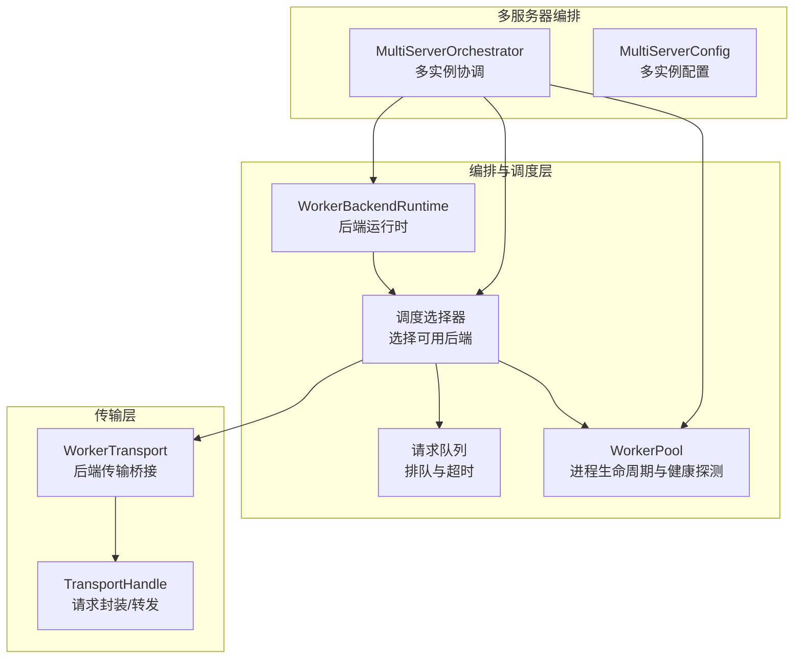
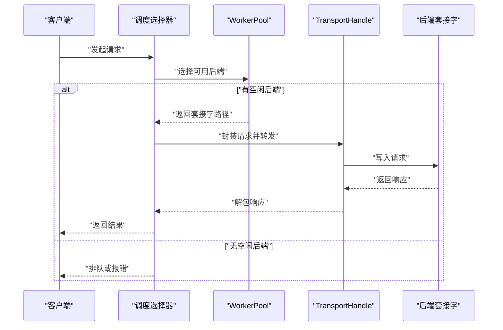
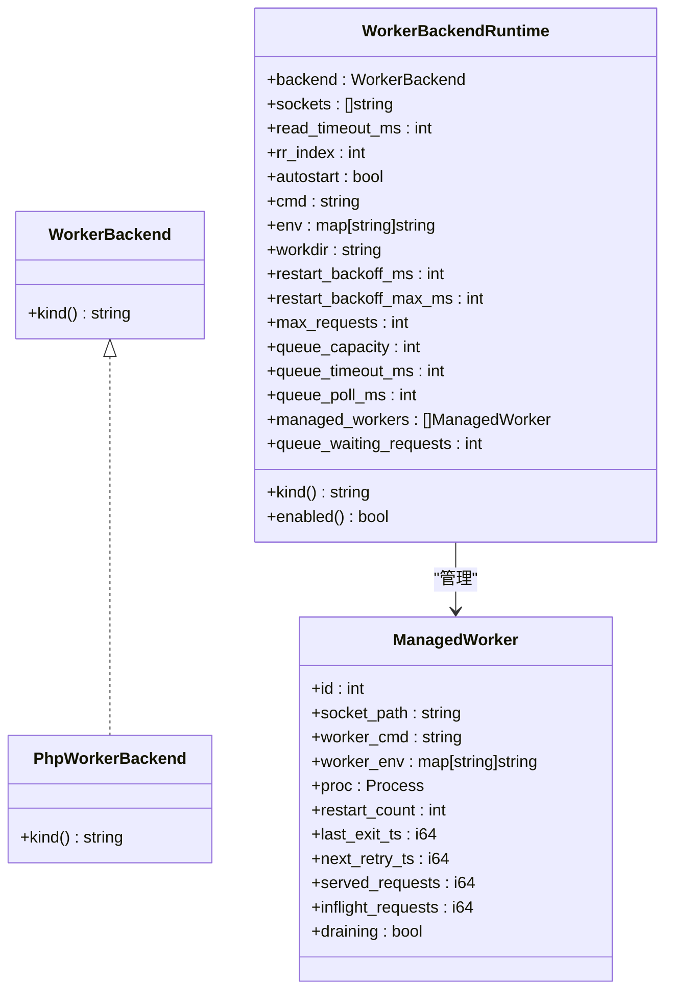
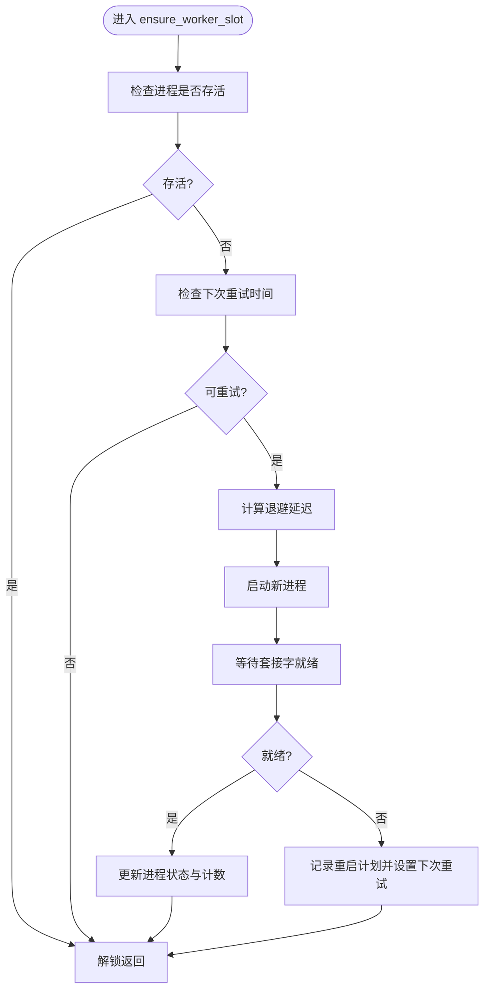
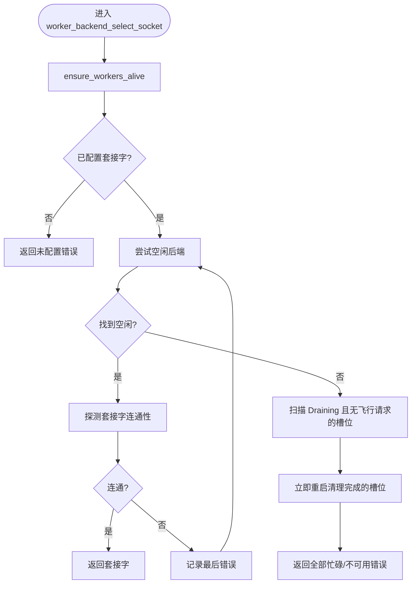
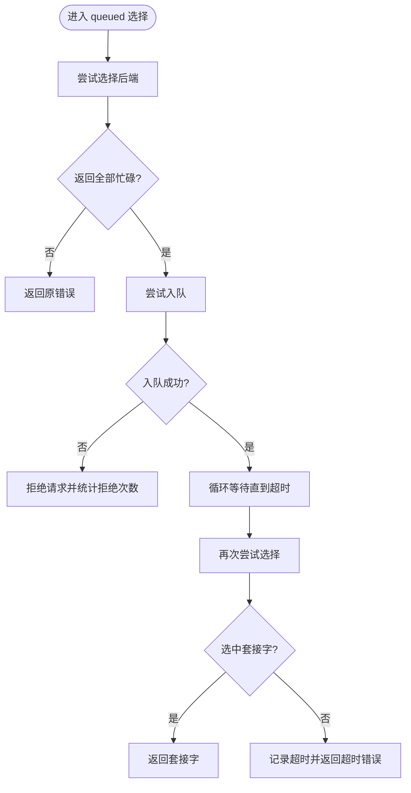
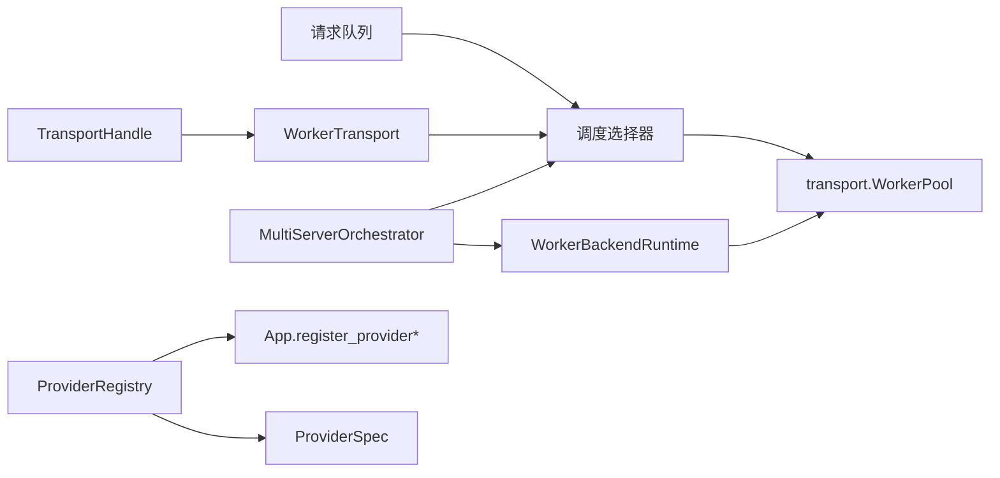

# 后端编排与调度

<cite>
**本文引用的文件**
- [src/worker_backend_runtime.v](file://src/worker_backend_runtime.v)
- [src/worker_backend_pool.v](file://src/worker_backend_pool.v)
- [src/worker_backend_queue.v](file://src/worker_backend_queue.v)
- [src/worker_backend_dispatch.v](file://src/worker_backend_dispatch.v)
- [src/worker_backend_transport.v](file://src/worker_backend_transport.v)
- [src/transport/worker_pool.v](file://src/transport/worker_pool.v)
- [src/transport/transport_handle.v](file://src/transport/transport_handle.v)
- [src/multi_server_runtime_orchestrator.v](file://src/multi_server_runtime_orchestrator.v)
- [src/multi_server_runtime_config.v](file://src/multi_server_runtime_config.v)
- [src/server_runtime_orchestrator.v](file://src/server_runtime_orchestrator.v)
- [src/server_runtime_config.v](file://src/server_runtime_config.v)
- [src/main.v](file://src/main.v)
- [src/provider_registry.v](file://src/provider_registry.v)
- [src/provider_spec.v](file://src/provider_spec.v)
- [src/executor/inproc_vjsx_executor.v](file://src/executor/inproc_vjsx_executor.v)
- [config/vhttpd.example.toml](file://config/vhttpd.example.toml)
- [config/vhttpd.multi.example.toml](file://config/vhttpd.multi.example.toml)
</cite>

## 目录
1. [简介](#简介)
2. [项目结构](#项目结构)
3. [核心组件](#核心组件)
4. [架构总览](#架构总览)
5. [详细组件分析](#详细组件分析)
6. [依赖关系分析](#依赖关系分析)
7. [性能考量](#性能考量)
8. [故障处理与恢复](#故障处理与恢复)
9. [结论](#结论)
10. [附录](#附录)

## 简介
本技术文档聚焦于 vhttpd 的“后端编排与调度”子系统，系统通过“工作进程池（Worker Pool）+ 调度选择器 + 队列与重试 + 传输层桥接”的组合，实现对多后端（如 PHP Worker、VJSX 执行器等）的服务发现、健康检查、负载均衡、故障转移与容量管理，并在运行时进行跨组件的状态同步与协调。

## 项目结构
围绕后端编排与调度的关键模块如下：
- 工作后端运行时：定义后端类型、参数与状态（如套接字列表、轮询索引、重启退避、队列容量等）
- 工作进程池：管理进程生命周期、自动拉起、健康探测、重启退避策略
- 调度选择器：在可用后端中选择目标套接字，支持空闲优先、Draining 处理与失败诊断
- 请求排队与超时：当无可用后端时进入队列等待或拒绝
- 传输层桥接：将上层请求映射到具体后端套接字，负责协议封装与转发
- 多服务器编排：在多实例/多主机场景下进行统一配置与运行时协调
- 提供者注册与适配：动态注册后端提供者，统一启动/停止/快照接口

图表来源
- [src/worker_backend_runtime.v:15-37](file://src/worker_backend_runtime.v#L15-L37)
- [src/worker_backend_pool.v:201-241](file://src/worker_backend_pool.v#L201-L241)
- [src/worker_backend_queue.v:54-81](file://src/worker_backend_queue.v#L54-L81)
- [src/transport/worker_pool.v:8-21](file://src/transport/worker_pool.v#L8-L21)
- [src/worker_backend_transport.v](file://src/worker_backend_transport.v)
- [src/transport/transport_handle.v](file://src/transport/transport_handle.v)
- [src/multi_server_runtime_orchestrator.v](file://src/multi_server_runtime_orchestrator.v)
- [src/multi_server_runtime_config.v](file://src/multi_server_runtime_config.v)

章节来源
- [src/worker_backend_runtime.v:15-37](file://src/worker_backend_runtime.v#L15-L37)
- [src/worker_backend_pool.v:201-241](file://src/worker_backend_pool.v#L201-L241)
- [src/worker_backend_queue.v:54-81](file://src/worker_backend_queue.v#L54-L81)
- [src/transport/worker_pool.v:8-21](file://src/transport/worker_pool.v#L8-L21)
- [src/worker_backend_transport.v](file://src/worker_backend_transport.v)
- [src/transport/transport_handle.v](file://src/transport/transport_handle.v)
- [src/multi_server_runtime_orchestrator.v](file://src/multi_server_runtime_orchestrator.v)
- [src/multi_server_runtime_config.v](file://src/multi_server_runtime_config.v)

## 核心组件
- WorkerBackendRuntime：承载后端类型、套接字列表、轮询索引、自动启动、命令行、环境变量、工作目录、重启退避、最大请求数、队列容量/超时/轮询间隔、已管理的工作进程列表、等待队列长度等
- WorkerPool（transport 层）：定义 ManagedWorker 结构体，包含进程句柄、重启计数、下次重试时间戳、已服务请求数、飞行中请求数、Draining 标志；提供等待工作进程就绪、命令拼接与环境合并等工具函数
- 调度选择器：在开启自动启动时优先挑选空闲且存活的进程；否则按轮询策略选择；若全部繁忙则记录诊断信息并返回错误
- 请求队列：当所有后端忙碌时，尝试入队；支持可配置的队列超时与轮询间隔；超时或满队列时返回相应错误
- 传输层桥接：将上层请求映射到具体后端套接字，负责协议封装与转发
- 多服务器编排：在多实例/多主机场景下统一配置与运行时协调

章节来源
- [src/worker_backend_runtime.v:15-37](file://src/worker_backend_runtime.v#L15-L37)
- [src/transport/worker_pool.v:8-21](file://src/transport/worker_pool.v#L8-L21)
- [src/worker_backend_pool.v:201-241](file://src/worker_backend_pool.v#L201-L241)
- [src/worker_backend_queue.v:54-81](file://src/worker_backend_queue.v#L54-L81)
- [src/worker_backend_transport.v](file://src/worker_backend_transport.v)
- [src/multi_server_runtime_orchestrator.v](file://src/multi_server_runtime_orchestrator.v)
- [src/multi_server_runtime_config.v](file://src/multi_server_runtime_config.v)

## 架构总览
vhttpd 的后端编排采用“运行时 + 选择器 + 队列 + 传输”的分层设计：
- 运行时层：维护后端配置与状态，暴露启用/禁用、种类查询等能力
- 选择器层：在可用后端中进行健康检查与负载均衡选择
- 队列层：在峰值或后端忙时进行排队与超时控制
- 传输层：将请求映射到选定后端，完成协议封装与转发

图表来源
- [src/worker_backend_pool.v:201-241](file://src/worker_backend_pool.v#L201-L241)
- [src/worker_backend_queue.v:54-81](file://src/worker_backend_queue.v#L54-L81)
- [src/transport/transport_handle.v](file://src/transport/transport_handle.v)

## 详细组件分析

### 组件一：WorkerBackendRuntime（后端运行时）
- 角色定位：描述后端类型与运行参数，维护套接字列表、轮询索引、自动启动、命令/环境/工作目录、重启退避、最大请求数、队列容量/超时/轮询间隔、已管理的工作进程列表、等待队列长度
- 关键字段与行为：
  - kind()：返回后端类型标识
  - enabled()：根据套接字列表长度判断是否启用
  - 与 WorkerPool 的交互：通过 ManagedWorker 列表跟踪进程状态
- 复杂度与性能：
  - 套接字轮询为 O(1)，空闲检测为 O(n)
  - 队列统计与超时计数为 O(1)

图表来源
- [src/worker_backend_runtime.v:4-41](file://src/worker_backend_runtime.v#L4-L41)
- [src/transport/worker_pool.v:8-21](file://src/transport/worker_pool.v#L8-L21)

章节来源
- [src/worker_backend_runtime.v:4-41](file://src/worker_backend_runtime.v#L4-L41)
- [src/transport/worker_pool.v:8-21](file://src/transport/worker_pool.v#L8-L21)

### 组件二：WorkerPool（进程生命周期与健康探测）
- 角色定位：管理单个后端进程的生命周期，包括启动、存活检查、健康探测、重启退避与状态更新
- 关键流程：
  - ensure_worker_slot：在自动启动模式下，检查进程存活与下次重试时间，必要时按退避策略重启
  - wait_for_worker：以超时轮询的方式等待后端套接字可用
  - cmd_with_socket：根据模板生成带套接字的命令行，支持占位符与注入逻辑
  - merge_worker_env：合并基础环境与额外环境变量
- 错误处理：
  - 启动失败时记录重启计划事件，包含 worker_id、socket、重启次数、下次重试时间与原因
  - 套接字未就绪时返回明确错误

图表来源
- [src/worker_backend_pool.v:21-64](file://src/worker_backend_pool.v#L21-L64)
- [src/transport/worker_pool.v:32-43](file://src/transport/worker_pool.v#L32-L43)
- [src/transport/worker_pool.v:45-62](file://src/transport/worker_pool.v#L45-L62)

章节来源
- [src/worker_backend_pool.v:21-64](file://src/worker_backend_pool.v#L21-L64)
- [src/transport/worker_pool.v:32-43](file://src/transport/worker_pool.v#L32-L43)
- [src/transport/worker_pool.v:45-62](file://src/transport/worker_pool.v#L45-L62)

### 组件三：调度选择器（负载均衡与故障转移）
- 角色定位：在可用后端中选择目标套接字，支持空闲优先、Draining 清理与失败诊断
- 关键流程：
  - next_worker_socket：轮询选择下一个套接字
  - next_idle_worker_socket：优先选择空闲且存活的后端，跳过 Draining 或仍有飞行请求的进程
  - worker_backend_select_socket：在自动启动模式下，先尝试空闲后端；若全部繁忙，则记录诊断并返回“全部忙碌”或“不可用”错误；Draining 且无飞行请求的槽位会被立即重启
- 故障转移：
  - 当无可用后端时，触发排队或直接返回错误
  - 记录 worker.select.failed 事件，携带诊断 JSON

图表来源
- [src/worker_backend_pool.v:201-241](file://src/worker_backend_pool.v#L201-L241)
- [src/worker_backend_pool.v:301-345](file://src/worker_backend_pool.v#L301-L345)

章节来源
- [src/worker_backend_pool.v:201-241](file://src/worker_backend_pool.v#L201-L241)
- [src/worker_backend_pool.v:301-345](file://src/worker_backend_pool.v#L301-L345)

### 组件四：请求队列与超时（容量管理）
- 角色定位：在后端忙碌或无可用后端时进行排队，支持超时与轮询间隔配置
- 关键流程：
  - worker_backend_select_socket_queued：当选择失败且返回“全部忙碌”时，尝试入队；若队列已满则拒绝；否则在超时时间内轮询重试；超时则返回“队列超时”
  - note_worker_queue_timeout：统计队列超时次数
- 容量管理：
  - queue_capacity 控制队列上限
  - queue_timeout_ms 控制定时器
  - queue_poll_ms 控制轮询间隔

图表来源
- [src/worker_backend_queue.v:54-81](file://src/worker_backend_queue.v#L54-L81)

章节来源
- [src/worker_backend_queue.v:54-81](file://src/worker_backend_queue.v#L54-L81)

### 组件五：传输层桥接（请求封装与转发）
- 角色定位：将上层请求映射到具体后端套接字，完成协议封装与转发
- 关键点：
  - TransportHandle：负责请求的序列化/反序列化与传输
  - WorkerTransport：作为后端传输桥接，将请求写入后端套接字并读取响应
- 与调度选择器配合：由调度选择器返回的套接字路径驱动传输层完成实际 IO

章节来源
- [src/transport/transport_handle.v](file://src/transport/transport_handle.v)
- [src/worker_backend_transport.v](file://src/worker_backend_transport.v)

### 组件六：多服务器编排（跨实例协调）
- 角色定位：在多实例/多主机场景下统一配置与运行时协调
- 关键点：
  - MultiServerRuntimeOrchestrator：负责多实例的运行时编排
  - MultiServerRuntimeConfig：提供多实例配置结构与解析

章节来源
- [src/multi_server_runtime_orchestrator.v](file://src/multi_server_runtime_orchestrator.v)
- [src/multi_server_runtime_config.v](file://src/multi_server_runtime_config.v)

### 组件七：提供者注册与适配（服务发现与生命周期）
- 角色定位：动态注册后端提供者，统一启动/停止/快照接口
- 关键点：
  - register_provider / register_provider_spec：注册提供者与规格
  - ProviderRuntimeAdapter：适配现有 Provider 接口，使运行时钩子保持可选
  - ProviderRegistry：提供者注册表，受全局互斥保护

章节来源
- [src/main.v:1035-1091](file://src/main.v#L1035-L1091)
- [src/provider_spec.v:161-196](file://src/provider_spec.v#L161-L196)
- [src/provider_registry.v](file://src/provider_registry.v)

### 组件八：内联 VJSX 执行器（示例性后端）
- 角色定位：演示如何将新的执行后端接入编排体系（如 VJSX）
- 关键点：
  - build_runtime_payload：构建运行时元数据（应用入口、模块根、线程数、网络/FS/进程开关、请求上下文等）
  - dispatch_http：带重试的 HTTP 分发流程，支持多次重试与错误判定

章节来源
- [src/executor/inproc_vjsx_executor.v:3599-3631](file://src/executor/inproc_vjsx_executor.v#L3599-L3631)
- [src/executor/inproc_vjsx_executor.v:5106-5121](file://src/executor/inproc_vjsx_executor.v#L5106-L5121)

## 依赖关系分析
- WorkerBackendRuntime 依赖 WorkerPool（transport 层）提供的进程模型与工具函数
- 调度选择器依赖 WorkerPool 的进程状态与健康探测
- 请求队列依赖调度选择器的失败返回与排队策略
- 传输层依赖调度选择器返回的套接字路径
- 多服务器编排依赖运行时配置与运行时协调器
- 提供者注册依赖全局互斥锁保证并发安全

图表来源
- [src/worker_backend_runtime.v:15-37](file://src/worker_backend_runtime.v#L15-L37)
- [src/transport/worker_pool.v:8-21](file://src/transport/worker_pool.v#L8-L21)
- [src/worker_backend_pool.v:201-241](file://src/worker_backend_pool.v#L201-L241)
- [src/worker_backend_queue.v:54-81](file://src/worker_backend_queue.v#L54-L81)
- [src/worker_backend_transport.v](file://src/worker_backend_transport.v)
- [src/transport/transport_handle.v](file://src/transport/transport_handle.v)
- [src/multi_server_runtime_orchestrator.v](file://src/multi_server_runtime_orchestrator.v)
- [src/provider_registry.v](file://src/provider_registry.v)
- [src/provider_spec.v:161-196](file://src/provider_spec.v#L161-L196)
- [src/main.v:1035-1091](file://src/main.v#L1035-L1091)

章节来源
- [src/worker_backend_runtime.v:15-37](file://src/worker_backend_runtime.v#L15-L37)
- [src/transport/worker_pool.v:8-21](file://src/transport/worker_pool.v#L8-L21)
- [src/worker_backend_pool.v:201-241](file://src/worker_backend_pool.v#L201-L241)
- [src/worker_backend_queue.v:54-81](file://src/worker_backend_queue.v#L54-L81)
- [src/worker_backend_transport.v](file://src/worker_backend_transport.v)
- [src/transport/transport_handle.v](file://src/transport/transport_handle.v)
- [src/multi_server_runtime_orchestrator.v](file://src/multi_server_runtime_orchestrator.v)
- [src/provider_registry.v](file://src/provider_registry.v)
- [src/provider_spec.v:161-196](file://src/provider_spec.v#L161-L196)
- [src/main.v:1035-1091](file://src/main.v#L1035-L1091)

## 性能考量
- 负载均衡策略
  - 轮询（RR）：简单高效，适合同质后端；可通过 rr_index 实现 O(1) 选择
  - 空闲优先：减少热点后端压力，提升整体吞吐；需 O(n) 扫描
- 重启退避
  - 使用指数退避（基于 restart_backoff_ms 与 restart_backoff_max_ms），避免雪崩式重试
- 队列与超时
  - queue_capacity 控制背压上限；queue_timeout_ms 与 queue_poll_ms 影响排队体验与资源占用
- 连接与传输
  - 传输层应复用连接、合理设置读写超时，避免长连接阻塞
- 并发与锁
  - 全局互斥保护提供者注册与运行时状态，注意临界区最小化，避免阻塞热路径

## 故障处理与恢复
- 进程拉起与健康探测
  - ensure_worker_slot 在进程死亡或退出时按退避策略重启；wait_for_worker 超时即视为不可用
- Draining 清理
  - 对于 Draining 且无飞行请求的槽位，立即重启以释放资源
- 失败诊断
  - 记录 worker.select.failed 事件，输出诊断 JSON，便于定位问题
- 队列超时与拒绝
  - 队列满时拒绝请求，超时时记录统计，避免无限排队导致资源耗尽
- 多实例容灾
  - 多服务器编排支持跨实例协调，结合健康探测与故障转移提升可用性

章节来源
- [src/worker_backend_pool.v:21-64](file://src/worker_backend_pool.v#L21-L64)
- [src/worker_backend_pool.v:301-345](file://src/worker_backend_pool.v#L301-L345)
- [src/worker_backend_queue.v:54-81](file://src/worker_backend_queue.v#L54-L81)
- [src/multi_server_runtime_orchestrator.v](file://src/multi_server_runtime_orchestrator.v)

## 结论
vhttpd 的后端编排与调度通过“运行时 + 选择器 + 队列 + 传输”的分层设计，实现了对多后端的统一管理与高效调度。其核心优势在于：
- 明确的生命周期管理与健康探测
- 可配置的负载均衡与故障转移策略
- 面向峰值的排队与超时控制
- 可扩展的提供者注册与多服务器编排

在实践中，建议结合业务流量特征调整队列容量、超时与轮询间隔，并针对不同后端类型选择合适的负载均衡策略，以获得最佳的吞吐与稳定性。

## 附录
- 配置参考
  - 单实例示例：[config/vhttpd.example.toml](file://config/vhttpd.example.toml)
  - 多实例示例：[config/vhttpd.multi.example.toml](file://config/vhttpd.multi.example.toml)
- 关键实现路径
  - 后端运行时：[src/worker_backend_runtime.v](file://src/worker_backend_runtime.v)
  - 工作进程池：[src/transport/worker_pool.v](file://src/transport/worker_pool.v)
  - 调度选择器：[src/worker_backend_pool.v](file://src/worker_backend_pool.v)
  - 请求队列：[src/worker_backend_queue.v](file://src/worker_backend_queue.v)
  - 传输层桥接：[src/worker_backend_transport.v](file://src/worker_backend_transport.v)
  - 多服务器编排：[src/multi_server_runtime_orchestrator.v](file://src/multi_server_runtime_orchestrator.v)
  - 提供者注册与适配：[src/main.v](file://src/main.v), [src/provider_spec.v](file://src/provider_spec.v)