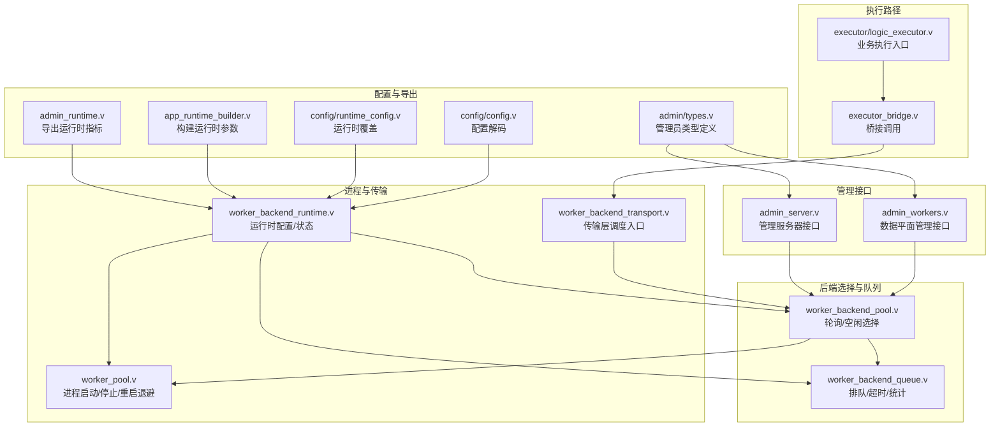
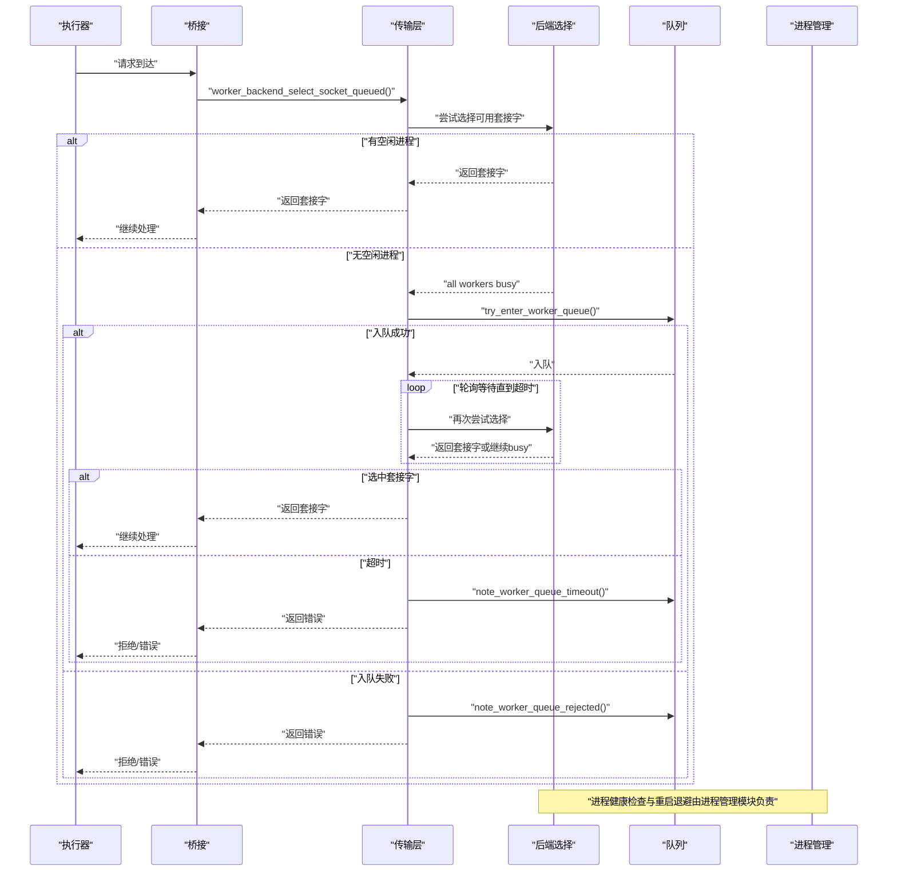
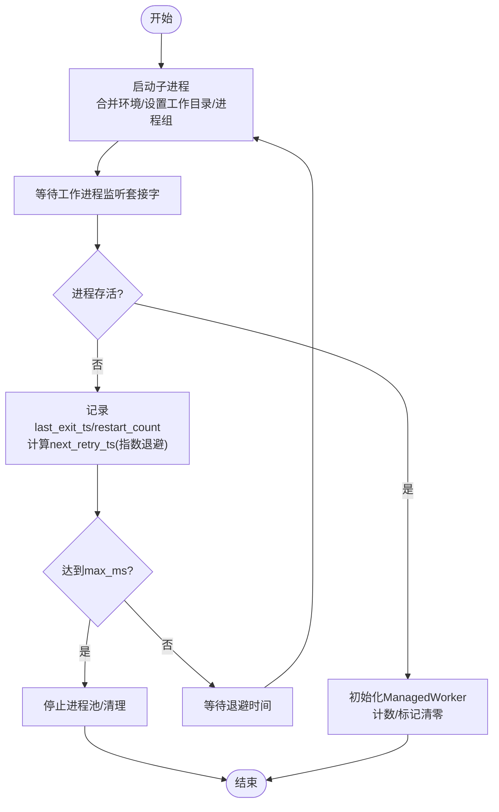
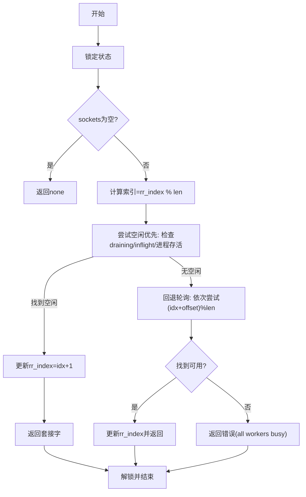
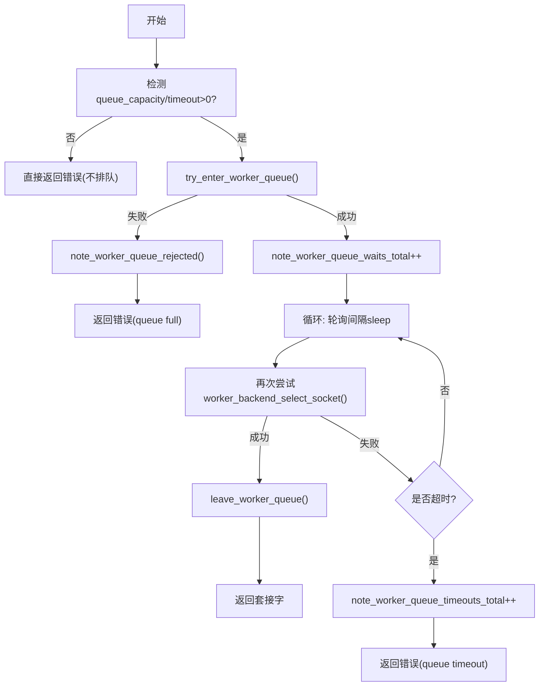
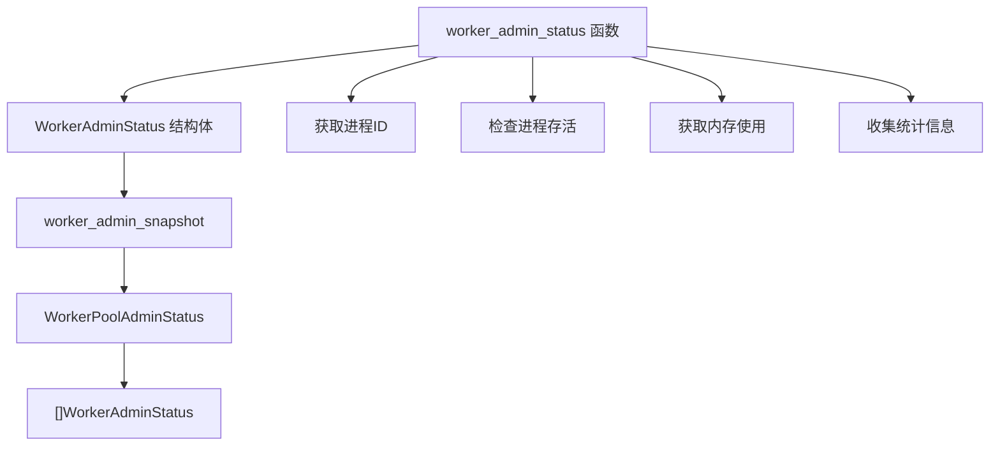
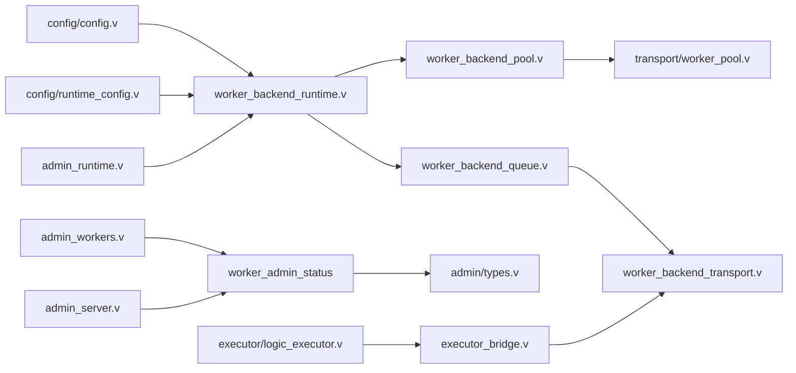

# 工作进程池管理

<cite>
**本文引用的文件**
- [src/transport/worker_pool.v](file://src/transport/worker_pool.v)
- [src/worker_backend_pool.v](file://src/worker_backend_pool.v)
- [src/worker_backend_queue.v](file://src/worker_backend_queue.v)
- [src/worker_backend_runtime.v](file://src/worker_backend_runtime.v)
- [src/worker_backend_transport.v](file://src/worker_backend_transport.v)
- [src/config/config.v](file://src/config/config.v)
- [src/config/runtime_config.v](file://src/config/runtime_config.v)
- [src/admin_runtime.v](file://src/admin_runtime.v)
- [src/admin_workers.v](file://src/admin_workers.v)
- [src/admin_server.v](file://src/admin_server.v)
- [src/admin/types.v](file://src/admin/types.v)
- [src/app_runtime_builder.v](file://src/app_runtime_builder.v)
- [src/executor/logic_executor.v](file://src/executor/logic_executor.v)
- [src/executor_bridge.v](file://src/executor_bridge.v)
</cite>

## 更新摘要
**变更内容**
- 移除了 WorkerAdminView 类型别名，简化了类型定义
- 将 admin_status() 方法转换为独立函数 worker_admin_status()
- 更新了管理员接口的实现，使用新的独立函数
- 保持了原有的 WorkerAdminStatus 结构体定义不变

## 目录
1. [简介](#简介)
2. [项目结构](#项目结构)
3. [核心组件](#核心组件)
4. [架构总览](#架构总览)
5. [详细组件分析](#详细组件分析)
6. [依赖关系分析](#依赖关系分析)
7. [性能考量](#性能考量)
8. [故障排查指南](#故障排查指南)
9. [结论](#结论)
10. [附录](#附录)

## 简介
本文件围绕 vhttpd 的工作进程池管理进行系统化技术说明，覆盖以下主题：
- 进程池架构与配置：池大小、动态调整、重启退避策略、资源限制
- 负载均衡：轮询与"空闲优先"策略（当前未发现加权轮询或最少连接）
- 生命周期管理：创建、停止、优雅退出、健康检查与重试
- 队列管理：排队容量、等待超时、轮询间隔、拒绝与超时统计
- 监控指标与性能优化：避免泄漏与资源耗尽
- 配置调优与故障排查：运维实操建议

## 项目结构
工作进程池相关代码主要分布在如下模块：
- 传输层与进程管理：src/transport/worker_pool.v
- 后端选择与轮询：src/worker_backend_pool.v
- 队列与排队逻辑：src/worker_backend_queue.v
- 运行时配置与状态：src/worker_backend_runtime.v、src/config/config.v、src/config/runtime_config.v
- 管理接口与运行时导出：src/admin_runtime.v、src/admin_workers.v、src/admin_server.v、src/admin/types.v
- 执行器与桥接：src/executor/logic_executor.v、src/executor_bridge.v

图示来源
- [src/transport/worker_pool.v](file://src/transport/worker_pool.v)
- [src/worker_backend_pool.v](file://src/worker_backend_pool.v)
- [src/worker_backend_queue.v](file://src/worker_backend_queue.v)
- [src/worker_backend_runtime.v](file://src/worker_backend_runtime.v)
- [src/worker_backend_transport.v](file://src/worker_backend_transport.v)
- [src/config/config.v](file://src/config/config.v)
- [src/config/runtime_config.v](file://src/config/runtime_config.v)
- [src/app_runtime_builder.v](file://src/app_runtime_builder.v)
- [src/admin_runtime.v](file://src/admin_runtime.v)
- [src/admin_workers.v](file://src/admin_workers.v)
- [src/admin_server.v](file://src/admin_server.v)
- [src/admin/types.v](file://src/admin/types.v)
- [src/executor/logic_executor.v](file://src/executor/logic_executor.v)
- [src/executor_bridge.v](file://src/executor_bridge.v)

章节来源
- [src/transport/worker_pool.v](file://src/transport/worker_pool.v)
- [src/worker_backend_pool.v](file://src/worker_backend_pool.v)
- [src/worker_backend_queue.v](file://src/worker_backend_queue.v)
- [src/worker_backend_runtime.v](file://src/worker_backend_runtime.v)
- [src/worker_backend_transport.v](file://src/worker_backend_transport.v)
- [src/config/config.v](file://src/config/config.v)
- [src/config/runtime_config.v](file://src/config/runtime_config.v)
- [src/admin_runtime.v](file://src/admin_runtime.v)
- [src/admin_workers.v](file://src/admin_workers.v)
- [src/admin_server.v](file://src/admin_server.v)
- [src/admin/types.v](file://src/admin/types.v)
- [src/app_runtime_builder.v](file://src/app_runtime_builder.v)
- [src/executor/logic_executor.v](file://src/executor/logic_executor.v)
- [src/executor_bridge.v](file://src/executor_bridge.v)

## 核心组件
- 进程管理与生命周期
  - ManagedWorker：封装单个工作进程的状态（套接字、命令、环境、计数、退避时间、服务请求数、在途请求数、是否正在降级等）
  - start_managed_worker/build_managed_worker_slot/start_worker_pool/stop_worker_pool：负责进程创建、初始化、启动、停止与失败回退
  - restart_backoff_ms：指数退避计算，控制重启间隔上限
- 后端运行时与配置
  - WorkerBackendRuntime：承载 sockets、rr_index、autostart、cmd、env、workdir、restart_backoff_ms/max_ms、max_requests、queue_*、managed_workers、queue_waiting_requests 等
- 选择与调度
  - next_worker_socket/next_idle_worker_socket：轮询与空闲优先选择
  - worker_backend_select_socket：综合选择逻辑（空闲优先，否则轮询）
- 排队与限流
  - try_enter_worker_queue/leave_worker_queue/note_worker_queue_*：排队容量控制、等待计数、拒绝计数、超时计数
  - worker_backend_select_socket_queued：排队等待与超时处理
- 管理员状态导出
  - worker_admin_status：独立函数，将 ManagedWorker 转换为 WorkerAdminStatus 结构体
  - worker_admin_snapshot：生成完整的管理员状态快照
- 执行与桥接
  - executor/logic_executor.v 与 executor_bridge.v：业务执行通过桥接调用 worker_backend_select_socket_queued

章节来源
- [src/transport/worker_pool.v](file://src/transport/worker_pool.v)
- [src/worker_backend_runtime.v](file://src/worker_backend_runtime.v)
- [src/worker_backend_pool.v](file://src/worker_backend_pool.v)
- [src/worker_backend_queue.v](file://src/worker_backend_queue.v)
- [src/admin_workers.v](file://src/admin_workers.v)
- [src/admin_server.v](file://src/admin_server.v)
- [src/admin/types.v](file://src/admin/types.v)
- [src/executor/logic_executor.v](file://src/executor/logic_executor.v)
- [src/executor_bridge.v](file://src/executor_bridge.v)

## 架构总览
vhttpd 的工作进程池采用"传输层进程管理 + 后端选择 + 队列控制"的分层架构。请求从执行器进入，经由传输层选择可用的工作进程套接字，若无可用则进入排队等待，超时或满容量则拒绝。

图示来源
- [src/worker_backend_pool.v](file://src/worker_backend_pool.v)
- [src/worker_backend_queue.v](file://src/worker_backend_queue.v)
- [src/worker_backend_transport.v](file://src/worker_backend_transport.v)
- [src/transport/worker_pool.v](file://src/transport/worker_pool.v)

## 详细组件分析

### 组件一：进程生命周期与健康检查
- 创建与初始化
  - 使用 shell 启动子进程，合并环境变量，设置工作目录与进程组，记录命令与套接字路径
  - 初始化 ManagedWorker 字段，包括服务计数、在途计数、降级标记等
- 停止与清理
  - 有序发送 TERM → PGKILL → KILL，等待进程结束并关闭句柄
- 健康检查与重试
  - 通过等待工作进程监听套接字实现"健康检查"
  - 失败时记录退出时间、重启次数，并按指数退避计算下次重启时间，上限受 max_ms 控制
- 动态调整
  - 池大小由传入的套接字数组长度决定；可通过重新生成套接字列表实现扩容/缩容

图示来源
- [src/transport/worker_pool.v](file://src/transport/worker_pool.v)

章节来源
- [src/transport/worker_pool.v](file://src/transport/worker_pool.v)

### 组件二：负载均衡与选择策略
- 轮询策略
  - rr_index 记录上次选择索引，每次选择后递增并取模，实现简单轮询
- 空闲优先策略
  - 在轮询基础上，优先选择处于空闲且可服务状态的进程（draining=false、inflight_requests=0、进程仍存活）
- 选择流程
  - 先尝试空闲优先，再回退到轮询；若两者均不可用，则返回"所有进程繁忙"的错误，交由上层排队处理

图示来源
- [src/worker_backend_pool.v](file://src/worker_backend_pool.v)

章节来源
- [src/worker_backend_pool.v](file://src/worker_backend_pool.v)

### 组件三：队列管理与优先级调度
- 容量与超时
  - queue_capacity 控制最大等待队列长度；queue_timeout_ms 控制等待超时；queue_poll_ms 控制轮询间隔
- 入队与出队
  - try_enter_worker_queue：在容量允许时入队，返回布尔值
  - leave_worker_queue：出队时减少计数，防止负值
- 统计与拒绝
  - note_worker_queue_waits_total/note_worker_queue_rejected_total/note_worker_queue_timeouts_total：分别记录等待、拒绝、超时事件
- 排队选择流程
  - 若后端选择失败且返回"所有进程繁忙"，尝试入队；若入队失败则直接拒绝
  - 成功入队后以固定轮询间隔反复尝试选择，直至超时或选中

图示来源
- [src/worker_backend_queue.v](file://src/worker_backend_queue.v)

章节来源
- [src/worker_backend_queue.v](file://src/worker_backend_queue.v)

### 组件四：管理员状态导出与监控
- 独立函数设计
  - worker_admin_status：独立函数，将 ManagedWorker 转换为 WorkerAdminStatus 结构体，移除了 WorkerAdminView 类型别名
  - 简化了类型定义，提高了代码的清晰度和可维护性
- 状态快照
  - worker_admin_snapshot：生成完整的管理员状态快照，包含进程池配置和所有工作进程的状态
- 管理接口
  - admin_workers.v：数据平面的管理员接口实现
  - admin_server.v：管理服务器的完整实现，包含认证和路由
- 类型定义
  - admin/types.v：定义了 WorkerAdminStatus、WorkerPoolAdminStatus 等管理员相关类型

图示来源
- [src/worker_backend_pool.v](file://src/worker_backend_pool.v)
- [src/admin_workers.v](file://src/admin_workers.v)
- [src/admin_server.v](file://src/admin_server.v)
- [src/admin/types.v](file://src/admin/types.v)

章节来源
- [src/worker_backend_pool.v](file://src/worker_backend_pool.v)
- [src/admin_workers.v](file://src/admin_workers.v)
- [src/admin_server.v](file://src/admin_server.v)
- [src/admin/types.v](file://src/admin/types.v)

### 组件五：运行时配置与导出
- 配置项
  - 读取配置中的 queue_capacity、queue_timeout_ms、restart_backoff_ms、restart_backoff_max_ms、max_requests、socket/pool_size 等
  - 运行时覆盖：runtime_config.v 支持通过覆盖字段动态调整 queue_timeout_ms 等
- 运行时状态
  - WorkerBackendRuntime 持有 sockets、rr_index、managed_workers、queue_waiting_requests 等
  - admin_runtime.v 导出 queue_capacity、queue_timeout_ms 等运行时指标供管理端查看

章节来源
- [src/config/config.v](file://src/config/config.v)
- [src/config/runtime_config.v](file://src/config/runtime_config.v)
- [src/worker_backend_runtime.v](file://src/worker_backend_runtime.v)
- [src/admin_runtime.v](file://src/admin_runtime.v)

### 组件六：执行链路与桥接
- 执行器
  - logic_executor.v 在业务执行前调用 worker_backend_select_socket_queued 获取目标套接字
- 桥接
  - executor_bridge.v 将调用转发至 App 实例的方法，最终落到 worker_backend_select_socket_queued

章节来源
- [src/executor/logic_executor.v](file://src/executor/logic_executor.v)
- [src/executor_bridge.v](file://src/executor_bridge.v)

## 依赖关系分析
- 组件耦合
  - 传输层进程管理与后端选择强耦合：选择策略依赖 ManagedWorker 的状态（draining、inflight_requests、进程存活）
  - 队列模块与后端选择弱耦合：仅在"所有进程繁忙"时介入，不改变选择算法
  - 管理模块与后端选择弱耦合：通过独立函数 worker_admin_status 提供状态查询，不改变选择逻辑
  - 配置模块贯穿：config.v 与 runtime_config.v 决定运行时行为，admin_runtime.v 导出运行时指标
- 外部依赖
  - 进程管理依赖操作系统进程模型（进程组、信号）
  - 套接字通信依赖上游工作进程的监听与握手

图示来源
- [src/config/config.v](file://src/config/config.v)
- [src/config/runtime_config.v](file://src/config/runtime_config.v)
- [src/worker_backend_runtime.v](file://src/worker_backend_runtime.v)
- [src/worker_backend_pool.v](file://src/worker_backend_pool.v)
- [src/worker_backend_queue.v](file://src/worker_backend_queue.v)
- [src/transport/worker_pool.v](file://src/transport/worker_pool.v)
- [src/worker_backend_transport.v](file://src/worker_backend_transport.v)
- [src/worker_backend_pool.v](file://src/worker_backend_pool.v)
- [src/admin/types.v](file://src/admin/types.v)
- [src/admin_workers.v](file://src/admin_workers.v)
- [src/admin_server.v](file://src/admin_server.v)
- [src/executor/logic_executor.v](file://src/executor/logic_executor.v)
- [src/executor_bridge.v](file://src/executor_bridge.v)
- [src/admin_runtime.v](file://src/admin_runtime.v)

## 性能考量
- 轮询与空闲优先
  - 空闲优先策略可降低平均响应延迟，提升吞吐；但需确保进程健康与在途计数准确
- 队列参数
  - queue_capacity 与 queue_timeout_ms 需结合业务峰值与下游处理能力设定；过小易导致拒绝，过大易放大排队延迟
  - queue_poll_ms 影响等待循环开销，建议保持较小且稳定
- 重启退避
  - restart_backoff_ms 与 restart_backoff_max_ms 控制进程崩溃后的恢复节奏，避免雪崩式重试
- 资源限制
  - max_requests 可用于限制单进程生命周期内的任务数，配合优雅退出避免资源泄漏
- 监控指标
  - queue_waits/queue_rejected/queue_timeouts 反映系统压力与配置合理性；应纳入告警
- 独立函数优势
  - worker_admin_status 作为独立函数，减少了类型别名的复杂性，提高了代码的可读性和维护性

[本节为通用性能讨论，无需列出具体文件来源]

## 故障排查指南
- 现象：请求被拒绝
  - 可能原因：队列已满、所有进程繁忙
  - 排查步骤：检查 queue_capacity 与 queue_timeout_ms；确认进程池是否健康；查看 rejected/timeout 统计
- 现象：请求长时间排队
  - 可能原因：下游处理慢、队列轮询间隔不合理、超时设置过大
  - 排查步骤：缩短 queue_timeout_ms 或 queue_poll_ms；观察 waits/timeout 指标变化
- 现象：进程频繁重启
  - 可能原因：进程异常退出、重启退避上限不足
  - 排查步骤：检查进程日志；增大 restart_backoff_max_ms；确认 max_requests 是否触发
- 现象：进程泄漏或资源耗尽
  - 可能原因：进程未正确退出、在途计数未清零
  - 排查步骤：确认 stop_worker_pool 的信号链路；核对 draining 与 inflight_requests 状态；定期巡检进程数
- 现象：管理员接口返回错误
  - 可能原因：WorkerAdminView 类型别名移除后的兼容性问题
  - 排查步骤：确认使用 worker_admin_status 独立函数；检查 admin/types.v 中的类型定义

章节来源
- [src/worker_backend_queue.v](file://src/worker_backend_queue.v)
- [src/transport/worker_pool.v](file://src/transport/worker_pool.v)
- [src/worker_backend_pool.v](file://src/worker_backend_pool.v)
- [src/admin_workers.v](file://src/admin_workers.v)
- [src/admin_server.v](file://src/admin_server.v)

## 结论
vhttpd 的工作进程池以"进程管理 + 选择策略 + 队列控制"为核心，实现了可控的扩展性与稳定性。当前实现包含轮询与空闲优先选择，以及基于容量与超时的排队机制。通过合理的配置与监控，可在高并发场景下获得稳定的吞吐与较低的排队延迟。最近的重构移除了 WorkerAdminView 类型别名，简化了管理员状态导出的实现，提高了代码的清晰度和可维护性。未来可考虑引入加权轮询与最少连接策略以进一步提升公平性与效率。

[本节为总结性内容，无需列出具体文件来源]

## 附录

### A. 关键配置项与默认值
- queue_capacity：队列容量，默认来自配置解码与运行时覆盖
- queue_timeout_ms：排队等待超时，默认来自配置解码与运行时覆盖
- queue_poll_ms：排队轮询间隔（默认值在构建阶段设置）
- restart_backoff_ms/restart_backoff_max_ms：重启退避基础值与上限
- max_requests：单进程最大请求数（用于优雅退出）
- socket/pool_size：工作进程套接字与池大小

章节来源
- [src/config/config.v](file://src/config/config.v)
- [src/config/runtime_config.v](file://src/config/runtime_config.v)
- [src/app_runtime_builder.v](file://src/app_runtime_builder.v)

### B. 运行时导出指标
- queue_capacity、queue_timeout_ms：用于运维观测与告警阈值设定
- queue_waits_total、queue_rejected_total、queue_timeouts_total：反映系统压力与配置合理性

章节来源
- [src/admin_runtime.v](file://src/admin_runtime.v)

### C. 管理员状态类型定义
- WorkerAdminStatus：工作进程管理员状态结构体，包含进程 ID、套接字路径、存活状态、内存使用等信息
- WorkerPoolAdminStatus：工作进程池管理员状态结构体，包含池配置和所有工作进程的状态列表
- worker_admin_status：独立函数，将 ManagedWorker 转换为 WorkerAdminStatus 结构体

章节来源
- [src/admin/types.v](file://src/admin/types.v)
- [src/worker_backend_pool.v](file://src/worker_backend_pool.v)