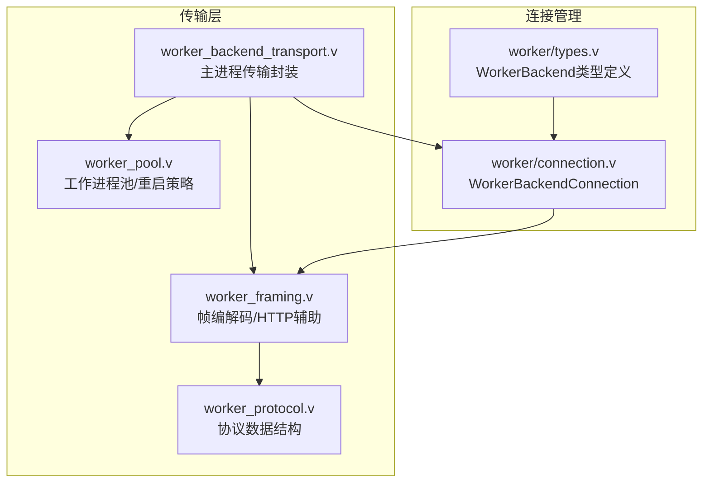
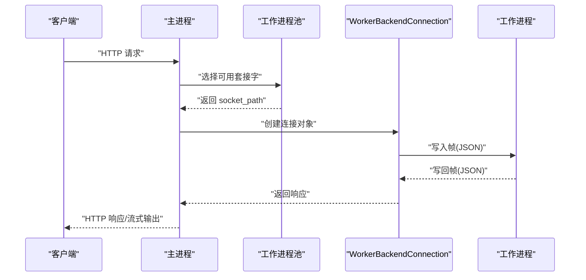
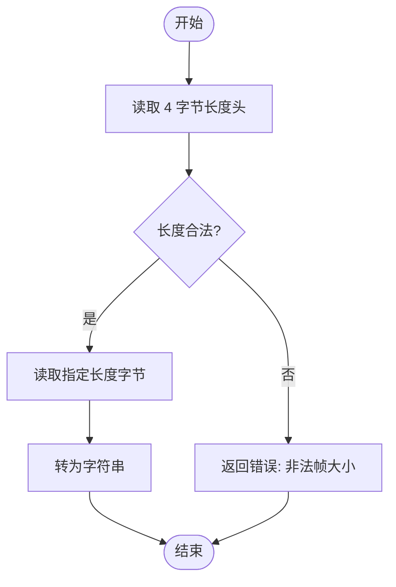
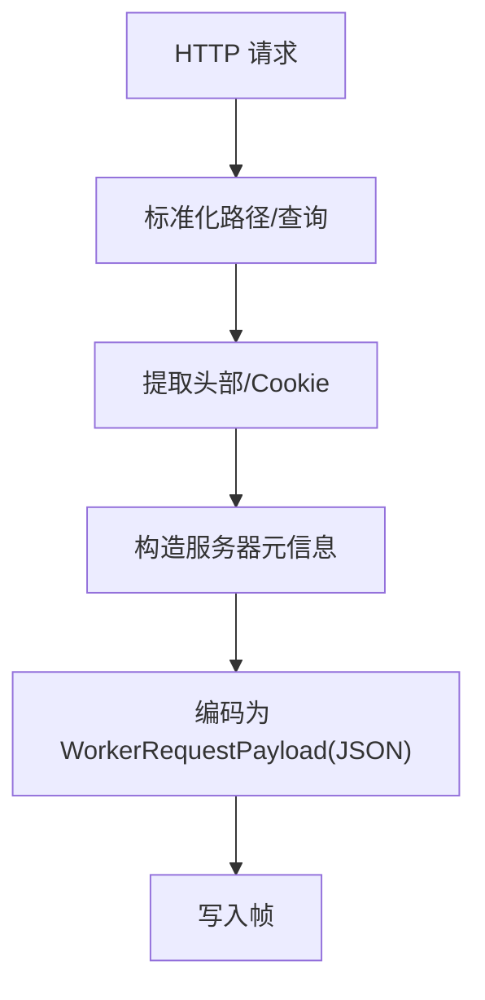
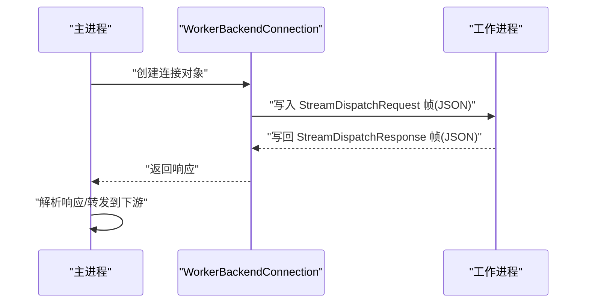
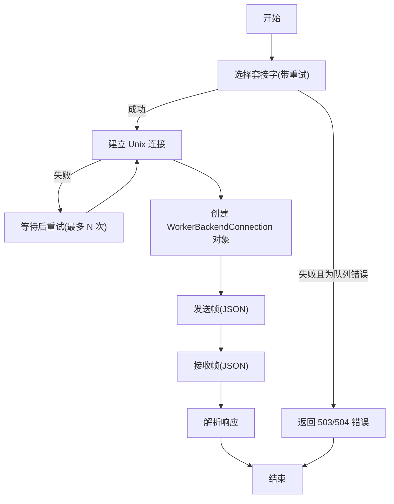
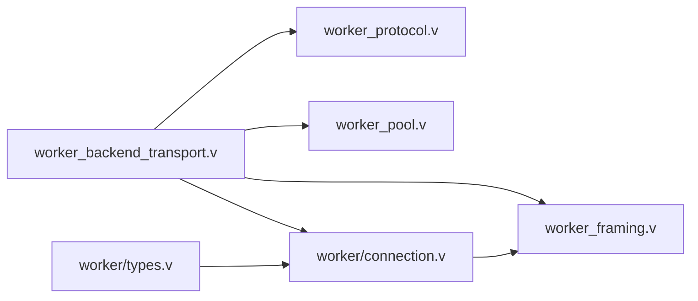

# 工作进程通信协议

<cite>
**本文引用的文件**
- [worker_protocol.v](file://src/transport/worker_protocol.v)
- [worker_framing.v](file://src/transport/worker_framing.v)
- [worker_pool.v](file://src/transport/worker_pool.v)
- [worker_backend_transport.v](file://src/worker_backend_transport.v)
- [connection.v](file://src/worker/connection.v)
- [types.v](file://src/worker/types.v)
</cite>

## 更新摘要
**变更内容**
- 移除了 WorkerBackendConnection 类型别名，简化了连接管理接口
- 更新了连接管理结构体的使用方式
- 修正了相关文档中的类型引用

## 目录
1. [引言](#引言)
2. [项目结构](#项目结构)
3. [核心组件](#核心组件)
4. [架构总览](#架构总览)
5. [详细组件分析](#详细组件分析)
6. [依赖关系分析](#依赖关系分析)
7. [性能考量](#性能考量)
8. [故障排查指南](#故障排查指南)
9. [结论](#结论)
10. [附录](#附录)

## 引言
本文件系统化阐述 vhttpd 工作进程（Worker）之间的内部通信协议，覆盖帧格式、消息头与数据编码、消息类型分类与处理流程、版本兼容性与错误处理、重连与退避策略、可靠传输与有序处理保障、扩展点与向后兼容设计，以及实际交互示例与调试技巧。目标是帮助开发者准确理解并高效优化工作进程间的通信。

## 项目结构
围绕工作进程通信协议的关键源码位于 transport 与 worker_backend_transport 模块：
- 协议数据结构定义：src/transport/worker_protocol.v
- 帧编解码与 HTTP/URL 辅助：src/transport/worker_framing.v
- 工作进程池管理与自动重启：src/transport/worker_pool.v
- 主进程到工作进程的传输层封装：src/worker_backend_transport.v
- 工作进程连接管理：src/worker/connection.v
- 工作进程类型定义：src/worker/types.v

**图表来源**
- [worker_protocol.v:1-276](file://src/transport/worker_protocol.v#L1-L276)
- [worker_framing.v:1-225](file://src/transport/worker_framing.v#L1-L225)
- [worker_backend_transport.v:1-247](file://src/worker_backend_transport.v#L1-L247)
- [worker_pool.v:1-181](file://src/transport/worker_pool.v#L1-L181)
- [connection.v:1-59](file://src/worker/connection.v#L1-L59)
- [types.v:1-62](file://src/worker/types.v#L1-L62)

**章节来源**
- [worker_protocol.v:1-276](file://src/transport/worker_protocol.v#L1-L276)
- [worker_framing.v:1-225](file://src/transport/worker_framing.v#L1-L225)
- [worker_backend_transport.v:1-247](file://src/worker_backend_transport.v#L1-L247)
- [worker_pool.v:1-181](file://src/transport/worker_pool.v#L1-L181)
- [connection.v:1-59](file://src/worker/connection.v#L1-L59)
- [types.v:1-62](file://src/worker/types.v#L1-L62)

## 核心组件
- 协议数据结构：定义了请求、流式帧、分发请求/响应、上游计划、WebSocket/MCP 等消息体字段与语义。
- 帧编解码：统一的 4 字节长度前缀 + JSON 负载的帧格式；提供 HTTP 请求到 WorkerRequestPayload 的编码器。
- 传输封装：主进程侧对连接选择、重试、超时设置、读写帧、错误分类等进行封装。
- 工作进程池：管理工作进程生命周期、自动启动、健康探测、失败退避与重启。
- 连接管理：WorkerBackendConnection 结构体提供统一的连接抽象，封装了连接的读写操作和生命周期管理。

**更新** 移除了 WorkerBackendConnection 类型别名，现在直接使用 `worker.WorkerBackendConnection` 结构体

**章节来源**
- [worker_protocol.v:1-276](file://src/transport/worker_protocol.v#L1-L276)
- [worker_framing.v:1-225](file://src/transport/worker_framing.v#L1-L225)
- [worker_backend_transport.v:1-247](file://src/worker_backend_transport.v#L1-L247)
- [worker_pool.v:1-181](file://src/transport/worker_pool.v#L1-L181)
- [connection.v:1-59](file://src/worker/connection.v#L1-L59)

## 架构总览
主进程通过 Unix 域套接字与工作进程通信，采用"帧"作为最小传输单元，每帧由 4 字节长度前缀（大端）+ JSON 负载组成。主进程根据配置选择可用的工作进程套接字，建立连接后发送请求帧，等待响应帧。对于流式场景（如 SSE/Upstream Plan），主进程按帧解析并转发至下游 HTTP/WebSocket/MCP。

**图表来源**
- [worker_backend_transport.v:149-161](file://src/worker_backend_transport.v#L149-L161)
- [worker_pool.v:32-43](file://src/transport/worker_pool.v#L32-L43)
- [connection.v:53-58](file://src/worker/connection.v#L53-L58)

**章节来源**
- [worker_backend_transport.v:149-161](file://src/worker_backend_transport.v#L149-L161)
- [worker_pool.v:32-43](file://src/transport/worker_pool.v#L32-L43)
- [connection.v:53-58](file://src/worker/connection.v#L53-L58)

## 详细组件分析

### 帧格式与编解码
- 帧结构
  - 长度前缀：4 字节无符号整数，大端序，表示后续 JSON 负载字节数。
  - 负载：UTF-8 JSON 文本，严格限制最大 16MB。
- 读写流程
  - 写帧：先写 4 字节长度，再写完整 JSON 字符串。
  - 读帧：先读 4 字节长度，校验范围，再读取对应长度字节，最终转为字符串。
- 错误处理
  - 非法长度或超限返回错误。
  - 连接异常 EOF 视为传输中断。
- 适用范围
  - 所有主进程与工作进程之间的请求/响应均采用该帧格式。

**图表来源**
- [worker_framing.v:10-60](file://src/transport/worker_framing.v#L10-L60)

**章节来源**
- [worker_framing.v:10-60](file://src/transport/worker_framing.v#L10-L60)

### 数据编码与消息头
- HTTP 请求到 WorkerRequestPayload 的编码
  - 路径标准化：确保路径以 "/" 开头，查询参数拆分为键值映射。
  - 头部与 Cookie 提取：统一转换为小写键的映射。
  - 服务器信息：提取 host/port/url/method/remote_addr 等。
  - 协议版本：从 HTTP 版本字符串中去除前缀。
  - 请求 ID 注入：若头部未提供 x-request-id，则注入请求级 ID。
- 编码结果：JSON 字符串，作为帧负载发送。

**图表来源**
- [worker_framing.v:168-197](file://src/transport/worker_framing.v#L168-L197)

**章节来源**
- [worker_framing.v:168-197](file://src/transport/worker_framing.v#L168-L197)

### 消息类型与处理流程
- 请求消息
  - 流式分发请求：StreamDispatchRequest
  - WebSocket 上游分发请求：WorkerWebSocketUpstreamDispatchRequest
  - MCP 分发请求：WorkerMcpDispatchRequest
- 响应消息
  - 流式分发响应：StreamDispatchResponse
  - WebSocket 上游分发响应：WorkerWebSocketUpstreamDispatchResponse
  - WebSocket 分发响应：WorkerWebSocketDispatchResponse
  - MCP 分发响应：WorkerMcpDispatchResponse
- 控制消息
  - 流式帧：WorkerStreamFrame（含 SSE 字段）
  - WebSocket 帧：WorkerWebSocketFrame（含 opcode/data/status 等）

处理流程（以流式分发为例）：

**图表来源**
- [worker_backend_transport.v:158-168](file://src/worker_backend_transport.v#L158-L168)
- [worker_protocol.v:30-71](file://src/transport/worker_protocol.v#L30-L71)

**章节来源**
- [worker_protocol.v:30-71](file://src/transport/worker_protocol.v#L30-L71)
- [worker_backend_transport.v:158-168](file://src/worker_backend_transport.v#L158-L168)

### 连接管理与 WorkerBackendConnection
- WorkerBackendConnection 结构体
  - 封装了 Unix 域套接字连接和对应的 socket_path
  - 提供统一的连接生命周期管理方法
- 连接操作
  - apply_read_timeout：设置读超时
  - close：关闭连接
  - write_payload/write_json：写入负载或 JSON
  - read_stream_response/read_mcp_response：读取特定类型的响应
  - write_websocket_frame/read_websocket_dispatch_response：WebSocket 相关操作
- 工厂方法
  - from_selected：从已建立的连接创建 WorkerBackendConnection 对象

**更新** 现在直接使用 `worker.WorkerBackendConnection` 结构体，不再使用类型别名

**章节来源**
- [connection.v:8-58](file://src/worker/connection.v#L8-L58)
- [worker_backend_transport.v:50-54](file://src/worker_backend_transport.v#L50-L54)

### 版本兼容性与扩展点
- 结构体字段标注
  - 使用 JSON 标签（如 json: 'field_name'）明确序列化键名，便于未来新增字段而不破坏现有解析。
- 兼容性建议
  - 新增可选字段时保持默认值安全，避免破坏旧版解析。
  - 对于枚举/策略字段，保留未知值的降级处理。
- 向后兼容
  - 读取端对未知字段忽略，写入端仅在需要时填充新字段，不强制要求旧版工作进程支持。

**章节来源**
- [worker_protocol.v:12-28](file://src/transport/worker_protocol.v#L12-L28)
- [worker_protocol.v:73-92](file://src/transport/worker_protocol.v#L73-L92)
- [worker_protocol.v:114-143](file://src/transport/worker_protocol.v#L114-L143)
- [worker_protocol.v:181-199](file://src/transport/worker_protocol.v#L181-L199)

### 错误处理与重连机制
- 错误分类
  - 连接/队列/超时类错误：映射为 503/504 等状态码，并给出具体错误类别（如 worker_pool_exhausted、worker_queue_full、worker_queue_timeout、timeout）。
  - 其他传输错误：映射为 502。
- 连接与重试
  - 选择套接字：带重试的队列选择，遇到"队列满/超时"直接返回错误。
  - 连接建立：多次尝试连接，失败事件上报。
  - 读超时：可按配置设置连接读超时。
- 退避策略
  - 工作进程重启退避：基于指数退避，上限保护，避免频繁重启造成抖动。

**图表来源**
- [worker_backend_transport.v:101-147](file://src/worker_backend_transport.v#L101-L147)
- [worker_backend_transport.v:298-313](file://src/worker_backend_transport.v#L298-L313)
- [worker_pool.v:166-180](file://src/transport/worker_pool.v#L166-L180)
- [connection.v:53-58](file://src/worker/connection.v#L53-L58)

**章节来源**
- [worker_backend_transport.v:101-147](file://src/worker_backend_transport.v#L101-L147)
- [worker_backend_transport.v:298-313](file://src/worker_backend_transport.v#L298-L313)
- [worker_pool.v:166-180](file://src/transport/worker_pool.v#L166-L180)
- [connection.v:53-58](file://src/worker/connection.v#L53-L58)

### 可靠传输与有序处理
- 可靠性
  - 帧级别完整性：长度前缀 + EOF 检测，防止半包/粘包导致的数据损坏。
  - 超时控制：可配置读超时，避免阻塞。
  - 错误分类：将不同阶段的错误区分开，便于快速定位问题。
- 有序性
  - 单连接单路传输：同一请求-响应在同一条连接上按顺序进行，天然保证有序。
  - 多路复用：当前实现通过队列选择与连接池管理，避免跨连接乱序。

**章节来源**
- [worker_framing.v:10-60](file://src/transport/worker_framing.v#L10-L60)
- [worker_backend_transport.v:156-158](file://src/worker_backend_transport.v#L156-L158)
- [worker_backend_transport.v:175-177](file://src/worker_backend_transport.v#L175-L177)

### 协议扩展点设计
- 字段扩展
  - 在不影响现有字段的前提下新增可选字段，使用 JSON 标签保持键名稳定。
- 策略与模式
  - 支持不同的 mode/strategy/event 组合，便于引入新的分发策略（如 upstream_plan）。
- 传输增强
  - 可在帧层增加版本号或校验字段，用于未来协议升级与校验。

**章节来源**
- [worker_protocol.v:12-28](file://src/transport/worker_protocol.v#L12-L28)
- [worker_protocol.v:73-92](file://src/transport/worker_protocol.v#L73-L92)
- [worker_framing.v:157-172](file://src/transport/worker_framing.v#L157-L172)

### 实际交互示例与调试技巧
- 示例场景：主进程向工作进程发起一次流式分发请求
  - 主进程选择套接字并建立连接。
  - 创建 WorkerBackendConnection 对象封装连接。
  - 发送 StreamDispatchRequest 帧（JSON）。
  - 接收 StreamDispatchResponse 帧（JSON），解析 chunks 并转发到下游。
- 调试技巧
  - 启用日志：观察"dispatching websocket_upstream"等关键日志行，确认请求已写出。
  - 错误分类：依据错误类别（如 worker_pool_exhausted）判断是资源不足还是网络问题。
  - 超时设置：适当增大读超时，避免短连接场景下的误判。
  - 帧校验：若出现"非法帧大小"，检查上游编码是否正确、缓冲区是否完整。

**章节来源**
- [worker_backend_transport.v:149-161](file://src/worker_backend_transport.v#L149-L161)
- [worker_backend_transport.v:187-202](file://src/worker_backend_transport.v#L187-L202)
- [worker_backend_transport.v:298-313](file://src/worker_backend_transport.v#L298-L313)
- [connection.v:53-58](file://src/worker/connection.v#L53-L58)

## 依赖关系分析
- worker_backend_transport 依赖 transport 模块中的协议结构与编解码函数。
- worker_framing 提供通用的帧读写与 HTTP/URL 辅助。
- worker_pool 提供工作进程生命周期管理与自动重启策略。
- connection.v 提供 WorkerBackendConnection 结构体和连接管理功能。
- 协议结构（worker_protocol.v）被多处模块共享使用。

**图表来源**
- [worker_backend_transport.v:1-11](file://src/worker_backend_transport.v#L1-L11)
- [worker_framing.v:1-8](file://src/transport/worker_framing.v#L1-L8)
- [worker_protocol.v:1-4](file://src/transport/worker_protocol.v#L1-L4)
- [connection.v:1-7](file://src/worker/connection.v#L1-L7)
- [types.v:1-6](file://src/worker/types.v#L1-L6)

**章节来源**
- [worker_backend_transport.v:1-11](file://src/worker_backend_transport.v#L1-L11)
- [worker_framing.v:1-8](file://src/transport/worker_framing.v#L1-L8)
- [worker_protocol.v:1-4](file://src/transport/worker_protocol.v#L1-L4)
- [connection.v:1-7](file://src/worker/connection.v#L1-L7)
- [types.v:1-6](file://src/worker/types.v#L1-L6)

## 性能考量
- 帧开销：4 字节长度头 + JSON 文本，适合中小消息；大消息建议分片或外部存储引用。
- 连接复用：单连接内顺序处理，减少上下文切换；合理设置读超时避免空闲占用。
- 退避策略：指数退避降低雪崩效应，提升系统稳定性。
- 日志与可观测性：在关键路径添加日志，便于定位瓶颈与异常。

## 故障排查指南
- 常见错误与处理
  - worker_pool_exhausted：资源紧张，考虑扩容或限流。
  - worker_queue_full / worker_queue_timeout：队列拥塞，检查上游并发与工作进程处理能力。
  - timeout：读超时或工作进程卡死，检查超时配置与工作进程健康。
  - transport_error：底层传输异常，检查套接字权限与网络。
- 定位步骤
  - 查看错误类别与状态码映射。
  - 检查连接建立与帧写出/读取日志。
  - 核对工作进程池状态与重启记录。

**章节来源**
- [worker_backend_transport.v:298-313](file://src/worker_backend_transport.v#L298-L313)
- [worker_pool.v:166-180](file://src/transport/worker_pool.v#L166-L180)

## 结论
vhttpd 工作进程通信协议以"4 字节长度前缀 + JSON 帧"的简洁设计实现了高可靠与高扩展性。通过清晰的消息类型划分、严格的错误分类与退避重连策略，系统在复杂场景下仍能保持稳定与可控。最新的重构移除了 WorkerBackendConnection 类型别名，简化了连接管理接口，使代码更加直观和易于维护。遵循本文档的扩展与调试建议，可进一步提升协议的演进能力与运行效率。

## 附录
- 关键实现位置参考
  - 帧读写与 HTTP 辅助：[worker_framing.v:10-60](file://src/transport/worker_framing.v#L10-L60)
  - 请求编码：[worker_framing.v:168-197](file://src/transport/worker_framing.v#L168-L197)
  - 流式分发请求/响应：[worker_protocol.v:30-71](file://src/transport/worker_protocol.v#L30-L71)
  - 传输封装与错误分类：[worker_backend_transport.v:149-161](file://src/worker_backend_transport.v#L149-L161), [worker_backend_transport.v:298-313](file://src/worker_backend_transport.v#L298-L313)
  - 工作进程池与退避：[worker_pool.v:72-95](file://src/transport/worker_pool.v#L72-L95), [worker_pool.v:166-180](file://src/transport/worker_pool.v#L166-L180)
  - 连接管理：[connection.v:8-58](file://src/worker/connection.v#L8-L58)