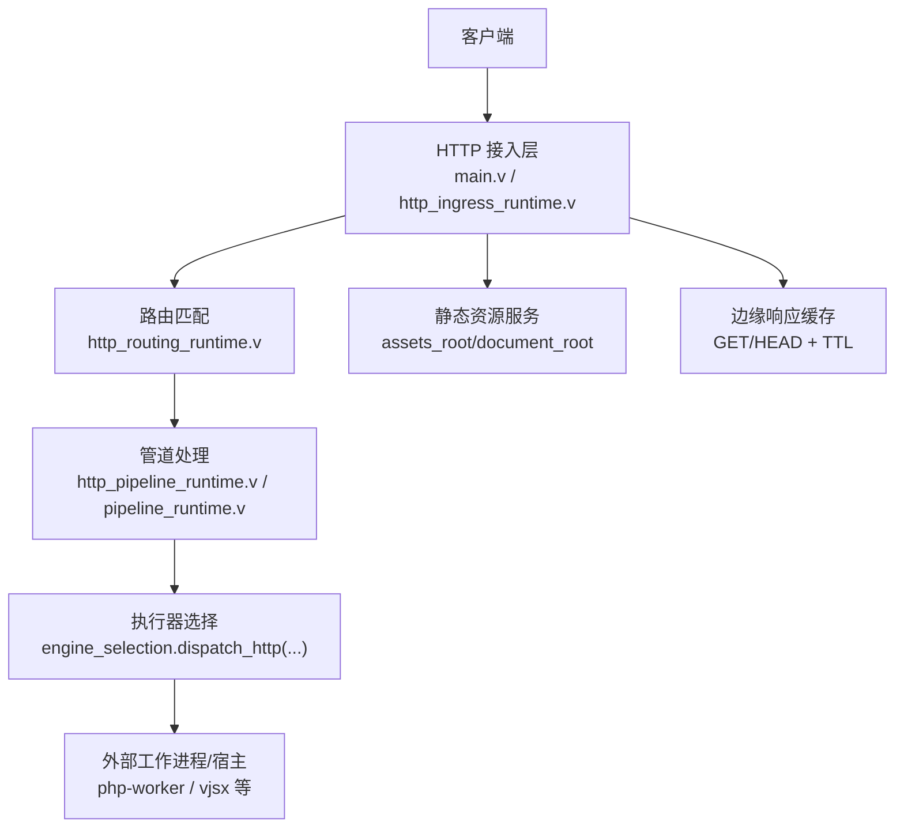
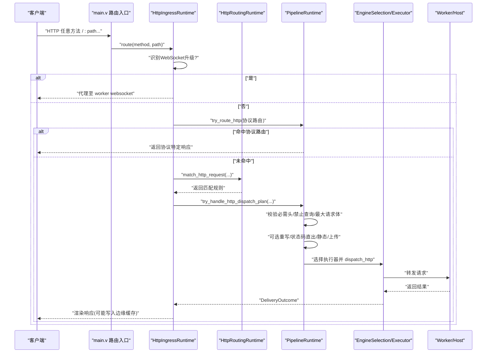
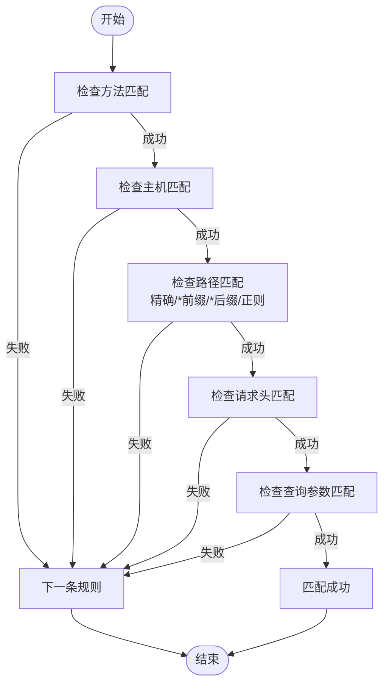
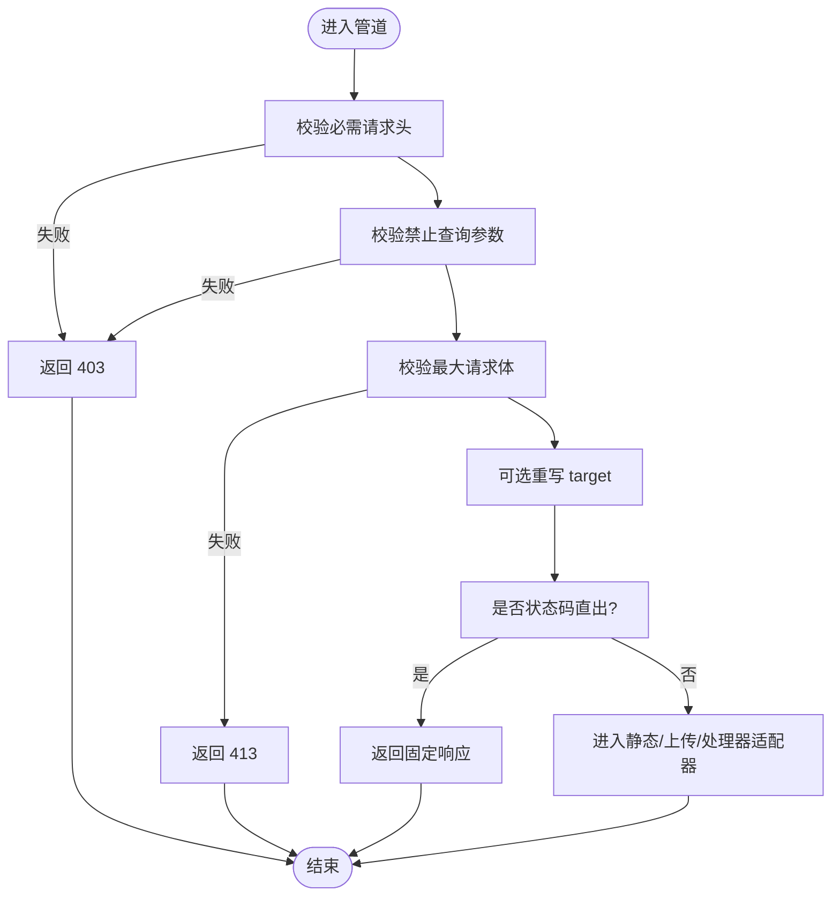
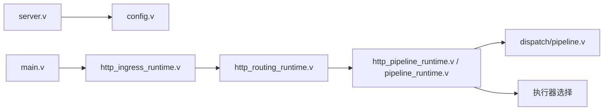

# HTTP/HTTPS 服务器

<cite>
**本文引用的文件**   
- [README.md](file://README.md)
- [main.v](file://src/main.v)
- [server.v](file://src/server.v)
- [config.v](file://src/config/config.v)
- [http_ingress_runtime.v](file://src/http_ingress_runtime.v)
- [http_routing_runtime.v](file://src/http_routing_runtime.v)
- [http_pipeline_runtime.v](file://src/http_pipeline_runtime.v)
- [pipeline_runtime.v](file://src/pipeline_runtime.v)
- [dispatch/pipeline.v](file://src/dispatch/pipeline.v)
- [server_logic_test.v](file://src/server_logic_test.v)
</cite>

## 目录
1. [简介](#简介)
2. [项目结构](#项目结构)
3. [核心组件](#核心组件)
4. [架构总览](#架构总览)
5. [详细组件分析](#详细组件分析)
6. [依赖关系分析](#依赖关系分析)
7. [性能与缓存](#性能与缓存)
8. [故障排除指南](#故障排除指南)
9. [结论](#结论)
10. [附录：配置与API参考](#附录配置与api参考)

## 简介
本文件面向 vhttpd 的 HTTP/HTTPS 服务器能力，系统性说明请求从接入到执行的全链路流程、路由匹配规则、管道处理机制、执行器选择策略、静态资源服务、中间件扩展点以及 HTTPS/TLS 配置与安全建议。文档同时提供可操作的配置示例、API 参考和常见问题排查路径，帮助读者快速上手并深入理解系统行为。

## 项目结构
vhttpd 将 HTTP 协议入口、路由匹配、管道执行与执行器调度分层组织，核心模块如下：
- 进程启动与参数解析：负责加载配置、初始化运行时、注册信号处理、单/多监听模式选择
- HTTP 接入层：统一处理所有 HTTP 方法，识别 WebSocket 升级，进入协议路由或数据面处理
- 路由与管道：基于 RuntimePlan 编译出的规则进行匹配，支持方法、主机、路径（含正则）、查询与请求头匹配；在命中后执行管道守卫、转换与终端适配
- 执行器选择：根据规则选择引擎（如 php-worker、vjsx 等），必要时走流式分发或直接返回固定响应
- 静态资源与缓存：按站点/规则根目录提供静态文件，并在边缘层对 GET/HEAD 做响应缓存
- HTTPS/TLS：通过配置启用证书与私钥，CLI 覆盖优先级高于配置文件

图表来源
- [main.v:83-116](file://src/main.v#L83-L116)
- [http_ingress_runtime.v:31-139](file://src/http_ingress_runtime.v#L31-L139)
- [http_routing_runtime.v:103-122](file://src/http_routing_runtime.v#L103-L122)
- [http_pipeline_runtime.v:21-161](file://src/http_pipeline_runtime.v#L21-L161)
- [pipeline_runtime.v:127-160](file://src/pipeline_runtime.v#L127-L160)

章节来源
- [README.md:1-127](file://README.md#L1-L127)
- [server.v:355-371](file://src/server.v#L355-L371)

## 核心组件
- 进程与生命周期管理：解析 CLI 与 TOML 配置，决定单/多监听模式，设置时区，注册 SIGINT/SIGTERM 清理逻辑
- HTTP 接入与协议路由：统一捕获所有 HTTP 方法，识别 WebSocket 升级，优先交由协议路由（如 MCP/OpenAI）或数据面处理
- 路由匹配：基于编译后的规则集合，顺序匹配方法、主机、路径（支持 * 前缀/后缀与正则）、查询键值与请求头
- 管道执行：对命中的规则执行必要检查（必需头、禁止查询、最大请求体）、可选重写与状态码直出、上传完成事件、静态/上传/处理器适配器
- 执行器选择：根据规则指定 executor/engine_id 动态选择后端（php-worker、vjsx 等），支持流式分发与直接响应渲染
- 静态资源与边缘缓存：按站点/规则根目录提供静态文件，对符合条件的 GET/HEAD 请求进行边缘缓存命中与回写
- HTTPS/TLS：通过 server.ssl 或 listener TLS 计划启用，CLI 参数可覆盖

章节来源
- [server.v:139-252](file://src/server.v#L139-L252)
- [http_ingress_runtime.v:31-139](file://src/http_ingress_runtime.v#L31-L139)
- [http_routing_runtime.v:181-245](file://src/http_routing_runtime.v#L181-L245)
- [http_pipeline_runtime.v:21-161](file://src/http_pipeline_runtime.v#L21-L161)
- [pipeline_runtime.v:145-160](file://src/pipeline_runtime.v#L145-L160)
- [config.v:6-19](file://src/config/config.v#L6-L19)

## 架构总览
下图展示了从客户端请求到最终响应的关键阶段：接入、协议路由、HTTP 路由匹配、管道守卫与转换、执行器选择与调用、响应渲染与缓存。

图表来源
- [main.v:83-116](file://src/main.v#L83-L116)
- [http_ingress_runtime.v:31-139](file://src/http_ingress_runtime.v#L31-L139)
- [http_routing_runtime.v:103-122](file://src/http_routing_runtime.v#L103-L122)
- [http_pipeline_runtime.v:21-161](file://src/http_pipeline_runtime.v#L21-L161)
- [pipeline_runtime.v:127-160](file://src/pipeline_runtime.v#L127-L160)

## 详细组件分析

### 请求入口与协议路由
- 所有 HTTP 方法由 main.v 中通配路由统一捕获，并委托给 HttpIngressRuntime.route
- 若检测到 WebSocket 升级，则直接走 worker websocket 代理路径
- 否则先尝试协议路由（例如 MCP/OpenAI），未命中再进入数据面 HTTP 处理

章节来源
- [main.v:83-116](file://src/main.v#L83-L116)
- [http_ingress_runtime.v:31-40](file://src/http_ingress_runtime.v#L31-L40)

### HTTP 路由匹配规则
- 匹配维度与方法：
  - 方法：支持精确匹配与通配
  - 主机：支持列表匹配（大小写不敏感）
  - 路径：支持精确、* 前缀/后缀、正则表达式
  - 查询：支持键存在性与值匹配（支持通配）
  - 请求头：支持键存在性与值匹配（大小写不敏感）
- 匹配顺序为声明顺序，首个命中即生效
- 支持 rewrite 与 strip_prefix 组合，生成目标 target 供后续处理

图表来源
- [http_routing_runtime.v:181-245](file://src/http_routing_runtime.v#L181-L245)
- [http_routing_runtime.v:151-171](file://src/http_routing_runtime.v#L151-L171)
- [http_routing_runtime.v:259-275](file://src/http_routing_runtime.v#L259-L275)

章节来源
- [http_routing_runtime.v:103-122](file://src/http_routing_runtime.v#L103-L122)
- [http_routing_runtime.v:181-245](file://src/http_routing_runtime.v#L181-L245)
- [http_routing_runtime.v:277-303](file://src/http_routing_runtime.v#L277-L303)

### 管道处理与守卫
- 必需请求头校验：缺失或不匹配时返回 403
- 禁止查询参数校验：命中禁止模式时返回 403
- 最大请求体限制：超过阈值返回 413
- 可选重写：根据规则改写 target，支持 $path_remainder/$path/$query 占位符
- 状态码直出：可直接返回 3xx/自定义状态码与 body
- 静态/上传/处理器适配器：命中后进入对应终端处理

图表来源
- [http_pipeline_runtime.v:21-161](file://src/http_pipeline_runtime.v#L21-L161)

章节来源
- [http_pipeline_runtime.v:21-161](file://src/http_pipeline_runtime.v#L21-L161)

### 执行器选择与调度
- 规则可指定 executor 或 engine_id，运行时据此选择具体引擎
- 若规则允许且条件满足，可优先走流式分发（stream dispatch）
- 否则通过 engine_selection.dispatch_http 将请求派发至后端执行器（如 php-worker、vjsx）
- 无可用逻辑执行器时返回 404

章节来源
- [pipeline_runtime.v:145-160](file://src/pipeline_runtime.v#L145-L160)
- [http_ingress_runtime.v:117-139](file://src/http_ingress_runtime.v#L117-L139)

### 静态文件服务与目录重定向
- 静态根目录优先级：规则 root > assets_root > worker_root
- 对 GET/HEAD 请求，当访问路径指向目录且不以斜杠结尾时，自动 301 重定向到带斜杠地址
- 静态文件读取与发送由 HTTP 运行时负责

章节来源
- [http_routing_runtime.v:124-132](file://src/http_routing_runtime.v#L124-L132)
- [http_ingress_runtime.v:71-79](file://src/http_ingress_runtime.v#L71-L79)

### 中间件机制
- 应用上下文 App 集成 veb.Middleware，可在请求进入业务逻辑前后插入通用处理（如日志、鉴权、CORS 等）
- 结合 veb.request_id 中间件，可实现统一的请求 ID 注入与追踪
- 建议在状态变更接口上按需启用 CSRF 等安全中间件

章节来源
- [main.v:10-23](file://src/main.v#L10-L23)
- [README.md:152-173](file://README.md#L152-L173)

### HTTPS 配置与安全最佳实践
- 基础配置：在 server.ssl 段启用并指定证书与私钥路径
- CLI 覆盖：可通过 --ssl-cert 与 --ssl-key 覆盖配置
- 多监听模式：每个监听可绑定独立证书，便于多域名/多站点部署
- 安全建议：
  - 使用强密码套件与最新 TLS 版本
  - 开启 HSTS、X-Frame-Options、X-Content-Type-Options、Referrer-Policy、Permissions-Policy 等响应头
  - 对管理员接口启用认证与最小权限原则
  - 合理设置超时与队列容量，避免资源耗尽

章节来源
- [config.v:6-19](file://src/config/config.v#L6-L19)
- [server.v:139-183](file://src/server.v#L139-L183)
- [server_logic_test.v:204-240](file://src/server_logic_test.v#L204-L240)

## 依赖关系分析
- 进程层依赖配置加载与生命周期管理
- HTTP 接入层依赖协议路由与管道运行时
- 路由层依赖编译后的规则集合与匹配算法
- 管道层依赖终端适配器与执行器选择
- 执行器层依赖后端工作进程或嵌入式宿主

图表来源
- [server.v:276-296](file://src/server.v#L276-L296)
- [main.v:83-116](file://src/main.v#L83-L116)
- [http_ingress_runtime.v:31-139](file://src/http_ingress_runtime.v#L31-L139)
- [http_routing_runtime.v:103-122](file://src/http_routing_runtime.v#L103-L122)
- [http_pipeline_runtime.v:21-161](file://src/http_pipeline_runtime.v#L21-L161)
- [dispatch/pipeline.v:1-119](file://src/dispatch/pipeline.v#L1-L119)

章节来源
- [server.v:276-296](file://src/server.v#L276-L296)
- [main.v:83-116](file://src/main.v#L83-L116)

## 性能与缓存
- 边缘响应缓存：
  - 仅对 GET/HEAD 有效
  - 命中条件受 Cookie 白名单/黑名单、Authorization、Cache-Control 指令影响
  - 缓存键包含方法与规范化路径及查询串
- 管道守卫减少无效后端调用（必需头、禁止查询、最大请求体）
- 静态资源直接由服务器提供，避免进入执行器
- 流式分发适用于长连接场景，降低阻塞

章节来源
- [http_routing_runtime.v:134-149](file://src/http_routing_runtime.v#L134-L149)
- [http_routing_runtime.v:320-443](file://src/http_routing_runtime.v#L320-L443)
- [http_ingress_runtime.v:113-116](file://src/http_ingress_runtime.v#L113-L116)

## 故障排除指南
- 无法启动或端口冲突：检查 host/port 与多监听配置，确认未被占用
- 证书加载失败：确认 server.ssl.enabled/cert/cert_key 路径正确，或使用 CLI 覆盖
- 路由不命中：检查方法、主机、路径（含正则）、查询与请求头匹配规则顺序与内容
- 403/413 错误：检查必需请求头与禁止查询参数、最大请求体限制
- 静态资源 404：确认 document_root/assets_root 与路径重定向行为
- 执行器不可用：确认 executor/engine_id 配置与后端进程健康状态
- 日志与事件：查看 event_log 与运行时跟踪输出，定位 trace_id/request_id

章节来源
- [server.v:116-135](file://src/server.v#L116-L135)
- [http_pipeline_runtime.v:21-47](file://src/http_pipeline_runtime.v#L21-L47)
- [http_ingress_runtime.v:42-50](file://src/http_ingress_runtime.v#L42-L50)

## 结论
vhttpd 的 HTTP/HTTPS 服务器以“协议入口—路由匹配—管道执行—执行器选择”的分层模型为核心，既保持对 veb 生态的复用，又提供了强大的可编程管道与执行器抽象。通过清晰的配置模型与丰富的匹配/守卫能力，用户可以在同一进程中灵活承载 PHP、嵌入式 JS/TS、上游流式 API 等多种负载，并以边缘缓存与静态服务提升整体吞吐与延迟表现。

## 附录：配置与API参考

### 配置项速览
- server.host/server.port：监听地址与端口
- server.ssl.enabled/server.ssl.cert/server.ssl.cert_key：HTTPS 开关与证书路径
- files.event_log/files.pid_file：事件日志与 PID 文件路径
- assets.enabled/assets.prefix/assets.root/assets.cache_control：静态资源开关、前缀、根目录与缓存控制
- routes[].match.*：方法、主机、路径、正则、查询、请求头匹配
- routes[].response_cache_ttl_ms：边缘响应缓存 TTL
- routes[].required_headers/denied_query_patterns/max_body_bytes：安全与限流策略
- executor.kind/php/vjsx：执行器类型与运行时参数

章节来源
- [config.v:6-19](file://src/config/config.v#L6-L19)
- [config.v:139-155](file://src/config/config.v#L139-L155)
- [config.v:313-341](file://src/config/config.v#L313-L341)
- [config.v:394-423](file://src/config/config.v#L394-L423)

### 常用 CLI 选项
- --host/--port/--ssl-cert/--ssl-key：数据面监听与 HTTPS
- --admin-host/--admin-port/--admin-token：管理平面
- --worker-*：工作进程池与队列参数
- --executor/--php-*/--vjsx-*：执行器与运行时参数

章节来源
- [server.v:139-183](file://src/server.v#L139-L183)

### 典型配置片段（路径引用）
- 单站点示例：[config/vhttpd.example.toml](file://config/vhttpd.example.toml)
- 多监听示例：[config/vhttpd.multi.example.toml](file://config/vhttpd.multi.example.toml)
- vjsx 内嵌示例：[config/vhttpd.vjsx.example.toml](file://config/vhttpd.vjsx.example.toml)

章节来源
- [README.md:447-517](file://README.md#L447-L517)
- [README.md:540-601](file://README.md#L540-L601)
- [README.md:634-668](file://README.md#L634-L668)