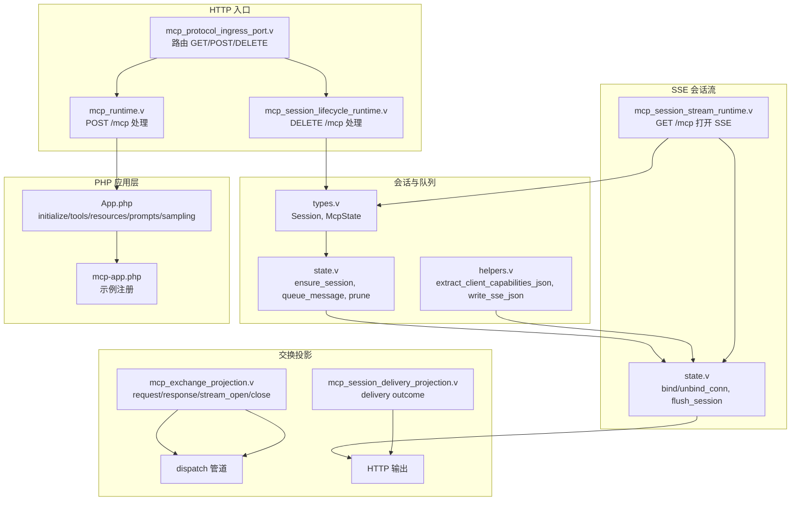
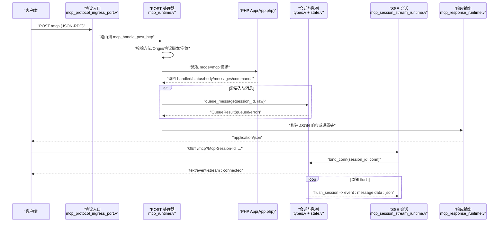
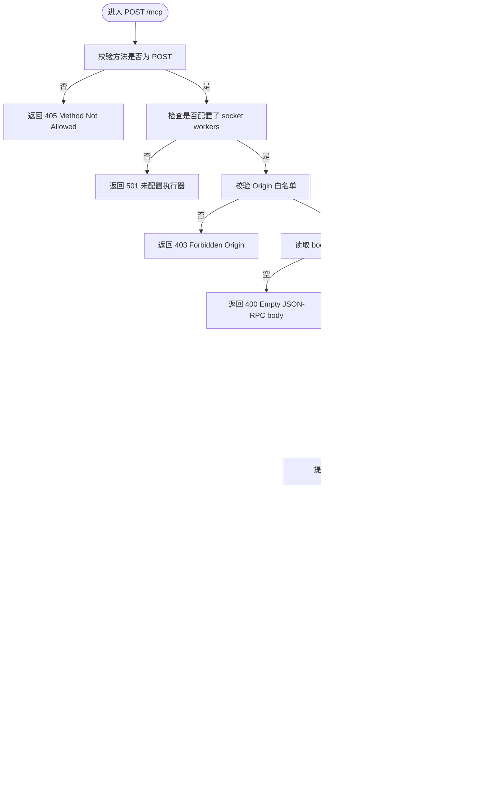
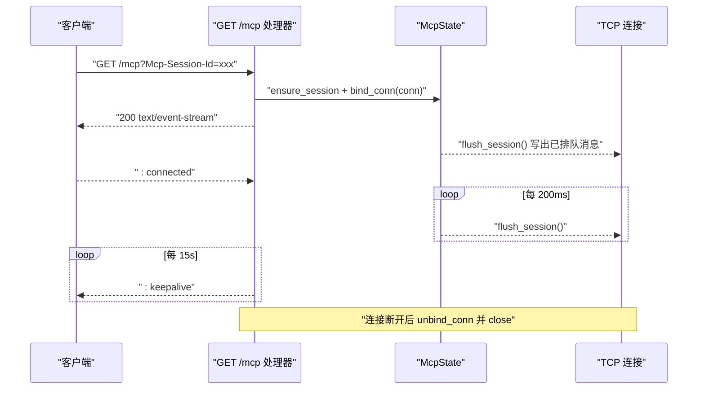
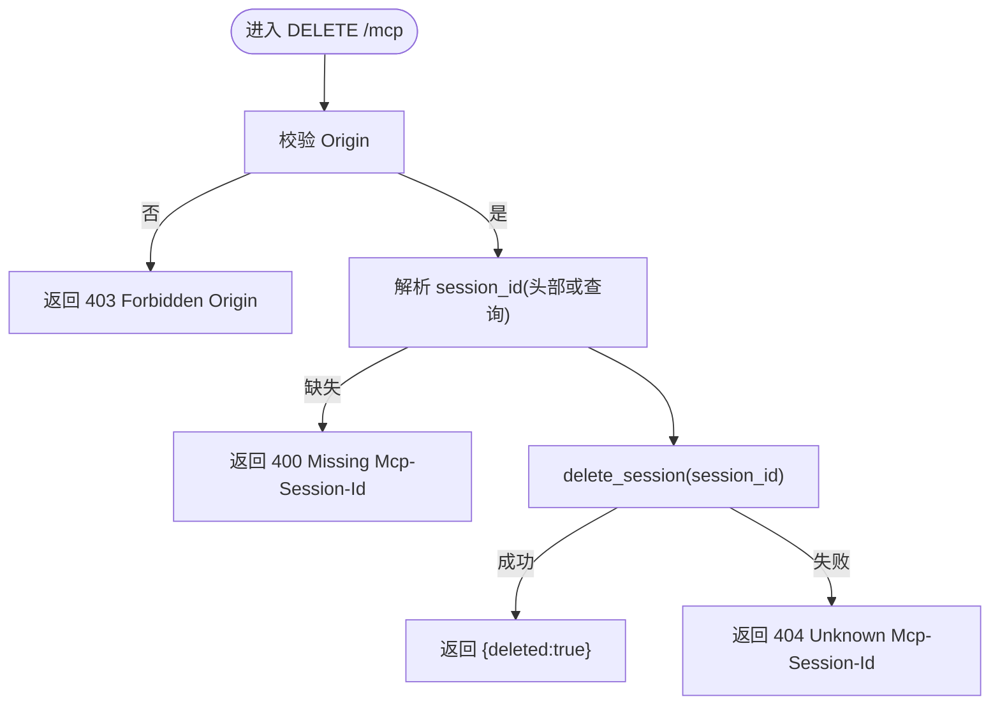
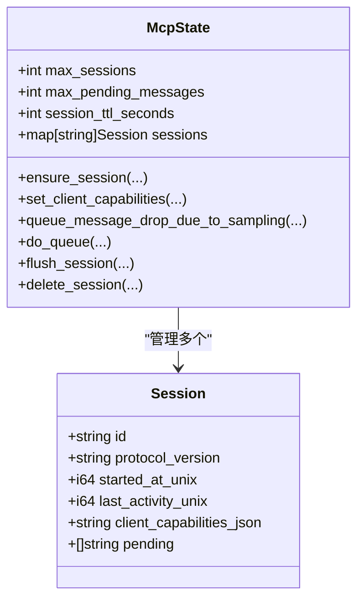
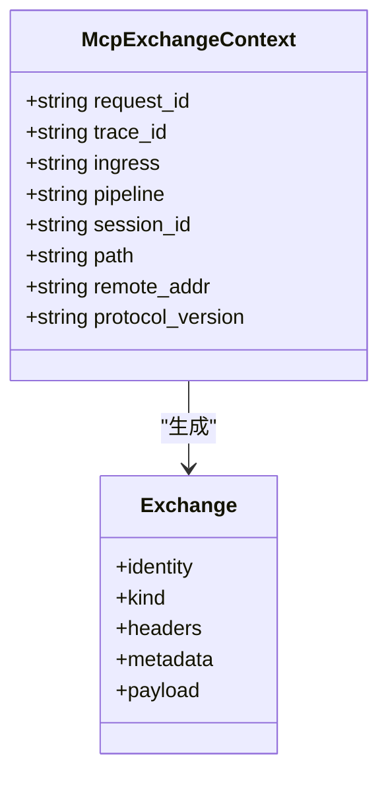
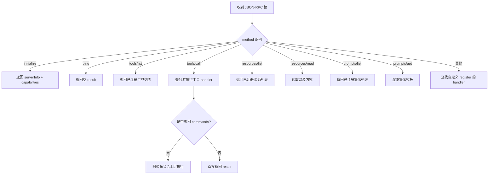
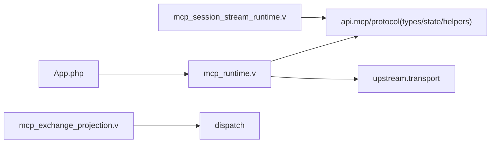

# MCP 协议支持

<cite>
**本文引用的文件**   
- [mcp_runtime.v](file://src/mcp_runtime.v)
- [mcp_protocol_ingress_port.v](file://src/mcp_protocol_ingress_port.v)
- [mcp_response_runtime.v](file://src/mcp_response_runtime.v)
- [mcp_session_lifecycle_runtime.v](file://src/mcp_session_lifecycle_runtime.v)
- [mcp_session_stream_runtime.v](file://src/mcp_session_stream_runtime.v)
- [mcp_exchange_projection.v](file://src/mcp_exchange_projection.v)
- [mcp_session_delivery_projection.v](file://src/mcp_session_delivery_projection.v)
- [types.v](file://src/api/mcp/protocol/types.v)
- [state.v](file://src/api/mcp/protocol/state.v)
- [helpers.v](file://src/api/mcp/protocol/helpers.v)
- [App.php](file://php/package/src/VSlim/Mcp/App.php)
- [mcp-app.php](file://examples/mcp-app.php)
- [mcp.toml](file://examples/config/mcp.toml)
- [MCP.md](file://docs/MCP.md)
- [MCP_RUNBOOK.md](file://docs/MCP_RUNBOOK.md)
- [MCP_MVP_PLAN.md](file://docs/MCP_MVP_PLAN.md)
</cite>

## 目录
1. [简介](#简介)
2. [项目结构](#项目结构)
3. [核心组件](#核心组件)
4. [架构总览](#架构总览)
5. [详细组件分析](#详细组件分析)
6. [依赖关系分析](#依赖关系分析)
7. [性能与容量控制](#性能与容量控制)
8. [故障排查指南](#故障排查指南)
9. [结论](#结论)
10. [附录：配置与开发指南](#附录配置与开发指南)

## 简介
本文件系统性阐述 vhttpd 对 MCP（Model Context Protocol）的传输与运行时实现，覆盖以下主题：
- 协议与端点：POST/GET/DELETE /mcp、SSE 会话流、JSON-RPC 请求/响应/通知
- 会话管理：创建、状态维护、TTL 清理、连接绑定与解绑
- 能力协商：客户端 capabilities 提取与快照、sampling 策略
- 流式传输：SSE 增量推送、keepalive、队列 flush
- 工具注册与调用：tools/resources/prompts 定义、参数校验、结果返回
- 配置与最佳实践：示例配置、运行手册、常见问题

vhttpd 的职责边界聚焦于 transport/runtime：持有 HTTP/SSE、管理 session、校验协议版本与 Origin、执行 DELETE；业务逻辑由 PHP worker 通过 VSlim\Mcp\App 处理。

**章节来源**
- [MCP.md:1-185](file://docs/MCP.md#L1-L185)
- [MCP_MVP_PLAN.md:167-487](file://docs/MCP_MVP_PLAN.md#L167-L487)

## 项目结构
围绕 MCP 的关键代码分布在如下模块：
- 传输与路由入口：HTTP 路由、协议入口端口
- 运行时处理：POST/GET/DELETE 处理器、SSE 会话流
- 会话与队列：Session 生命周期、消息入队/出队、TTL 清理
- 交换投影：将 MCP 请求/响应/事件映射到统一 dispatch.Exchange
- PHP 应用层：VSlim\Mcp\App 提供 JSON-RPC 方法处理与工具/资源/提示注册
- 示例与配置：最小可运行示例与 TOML 配置

**图表来源**
- [mcp_protocol_ingress_port.v:1-18](file://src/mcp_protocol_ingress_port.v#L1-L18)
- [mcp_runtime.v:11-138](file://src/mcp_runtime.v#L11-L138)
- [mcp_session_lifecycle_runtime.v:1-38](file://src/mcp_session_lifecycle_runtime.v#L1-L38)
- [mcp_session_stream_runtime.v:40-86](file://src/mcp_session_stream_runtime.v#L40-L86)
- [types.v:1-99](file://src/api/mcp/protocol/types.v#L1-L99)
- [state.v:1-355](file://src/api/mcp/protocol/state.v#L1-L355)
- [helpers.v:1-57](file://src/api/mcp/protocol/helpers.v#L1-L57)
- [mcp_exchange_projection.v:1-209](file://src/mcp_exchange_projection.v#L1-L209)
- [mcp_session_delivery_projection.v:1-25](file://src/mcp_session_delivery_projection.v#L1-L25)
- [App.php:1-773](file://php/package/src/VSlim/Mcp/App.php#L1-L773)
- [mcp-app.php:1-140](file://examples/mcp-app.php#L1-L140)

**章节来源**
- [mcp_runtime.v:11-138](file://src/mcp_runtime.v#L11-L138)
- [mcp_session_lifecycle_runtime.v:1-38](file://src/mcp_session_lifecycle_runtime.v#L1-L38)
- [mcp_session_stream_runtime.v:40-86](file://src/mcp_session_stream_runtime.v#L40-L86)
- [types.v:1-99](file://src/api/mcp/protocol/types.v#L1-L99)
- [state.v:1-355](file://src/api/mcp/protocol/state.v#L1-L355)
- [helpers.v:1-57](file://src/api/mcp/protocol/helpers.v#L1-L57)
- [mcp_exchange_projection.v:1-209](file://src/mcp_exchange_projection.v#L1-L209)
- [mcp_session_delivery_projection.v:1-25](file://src/mcp_session_delivery_projection.v#L1-L25)
- [App.php:1-773](file://php/package/src/VSlim/Mcp/App.php#L1-L773)
- [mcp-app.php:1-140](file://examples/mcp-app.php#L1-L140)

## 核心组件
- 协议入口与路由
  - 仅匹配 /mcp，按方法分发 GET/POST/DELETE
- POST /mcp 处理器
  - 校验方法、worker 可用性、Origin、协议版本、空体
  - 构造内核派发请求，接收响应并写入 HTTP 或入队消息
- GET /mcp SSE 会话
  - 绑定 TCP 连接到 session，发送 : connected，周期性 flush 与 keepalive
- DELETE /mcp 会话终止
  - 校验 Origin，删除 session 并关闭连接
- 会话与队列
  - Session 结构、McpState 全局状态、TTL 清理、最大 pending 截断
  - 入队时检查 sampling capability 策略（warn/drop/error）
- 交换投影
  - 将 MCP 请求/响应/事件映射为统一的 dispatch.Exchange，便于观测与桥接
- PHP 应用层
  - VSlim\Mcp\App 内置 initialize/ping/tools/resources/prompts 处理
  - 提供 notification/request/sampling/progress/log 等便捷构造器

**章节来源**
- [mcp_protocol_ingress_port.v:1-18](file://src/mcp_protocol_ingress_port.v#L1-L18)
- [mcp_runtime.v:11-138](file://src/mcp_runtime.v#L11-L138)
- [mcp_session_stream_runtime.v:40-86](file://src/mcp_session_stream_runtime.v#L40-L86)
- [mcp_session_lifecycle_runtime.v:1-38](file://src/mcp_session_lifecycle_runtime.v#L1-L38)
- [types.v:1-99](file://src/api/mcp/protocol/types.v#L1-L99)
- [state.v:1-355](file://src/api/mcp/protocol/state.v#L1-L355)
- [mcp_exchange_projection.v:1-209](file://src/mcp_exchange_projection.v#L1-L209)
- [App.php:1-773](file://php/package/src/VSlim/Mcp/App.php#L1-L773)

## 架构总览
下图展示从 HTTP 入口到 PHP worker 再回到 HTTP/SSE 输出的完整链路，以及会话与队列在 vhttpd 侧的管理。

**图表来源**
- [mcp_protocol_ingress_port.v:1-18](file://src/mcp_protocol_ingress_port.v#L1-L18)
- [mcp_runtime.v:11-138](file://src/mcp_runtime.v#L11-L138)
- [mcp_session_stream_runtime.v:40-86](file://src/mcp_session_stream_runtime.v#L40-L86)
- [types.v:1-99](file://src/api/mcp/protocol/types.v#L1-L99)
- [state.v:1-355](file://src/api/mcp/protocol/state.v#L1-L355)
- [mcp_response_runtime.v:1-39](file://src/mcp_response_runtime.v#L1-L39)
- [App.php:1-773](file://php/package/src/VSlim/Mcp/App.php#L1-L773)

## 详细组件分析

### 组件一：POST /mcp 请求处理流程
- 职责
  - 校验与方法无关的错误快速返回（405/501/403/400）
  - 解析协议版本与请求体
  - 派发至 PHP worker，处理 initialize 时记录 client capabilities
  - 根据 response.messages 入队，必要时触发 sampling 策略
  - 组装响应头（trace-id、session-id、protocol-version）并交付
- 关键路径
  - 入口：mcp_handle_post_http
  - 会话：ensure_session、set_client_capabilities
  - 入队：queue_message_drop_due_to_sampling / do_queue
  - 响应：mcp_json_response

**图表来源**
- [mcp_runtime.v:11-138](file://src/mcp_runtime.v#L11-L138)
- [state.v:102-197](file://src/api/mcp/protocol/state.v#L102-L197)
- [helpers.v:5-51](file://src/api/mcp/protocol/helpers.v#L5-L51)
- [mcp_response_runtime.v:19-39](file://src/mcp_response_runtime.v#L19-L39)

**章节来源**
- [mcp_runtime.v:11-138](file://src/mcp_runtime.v#L11-L138)
- [state.v:102-197](file://src/api/mcp/protocol/state.v#L102-L197)
- [helpers.v:5-51](file://src/api/mcp/protocol/helpers.v#L5-L51)
- [mcp_response_runtime.v:19-39](file://src/mcp_response_runtime.v#L19-L39)

### 组件二：GET /mcp SSE 会话与增量推送
- 职责
  - 校验 session_id 与 Origin
  - 绑定 TCP 连接到 session，立即 flush 已排队消息
  - 循环每 200ms flush，每 15s 发送 keepalive 注释
  - 连接断开后解绑并关闭
- 关键路径
  - 入口：mcp_handle_get_http（由 ingress 路由）
  - 会话：bind_conn/unbind_conn、flush_session
  - 输出：write_headers_conn + event:message data:json

**图表来源**
- [mcp_session_stream_runtime.v:40-86](file://src/mcp_session_stream_runtime.v#L40-L86)
- [state.v:119-225](file://src/api/mcp/protocol/state.v#L119-L225)
- [mcp_session_delivery_projection.v:1-25](file://src/mcp_session_delivery_projection.v#L1-L25)

**章节来源**
- [mcp_session_stream_runtime.v:40-86](file://src/mcp_session_stream_runtime.v#L40-L86)
- [state.v:119-225](file://src/api/mcp/protocol/state.v#L119-L225)
- [mcp_session_delivery_projection.v:1-25](file://src/mcp_session_delivery_projection.v#L1-L25)

### 组件三：DELETE /mcp 会话终止
- 职责
  - 校验 Origin
  - 从查询参数或头部获取 session_id
  - 删除 session 并关闭其连接（若存在）
- 关键路径
  - 入口：mcp_handle_delete_http
  - 操作：delete_session

**图表来源**
- [mcp_session_lifecycle_runtime.v:1-38](file://src/mcp_session_lifecycle_runtime.v#L1-L38)
- [state.v:326-341](file://src/api/mcp/protocol/state.v#L326-L341)

**章节来源**
- [mcp_session_lifecycle_runtime.v:1-38](file://src/mcp_session_lifecycle_runtime.v#L1-L38)
- [state.v:326-341](file://src/api/mcp/protocol/state.v#L326-L341)

### 组件四：会话管理与采样能力策略
- 数据结构
  - Session：id、协议版本、时间戳、client_capabilities_json、pending 队列、conn
  - McpState：全局限制（max_sessions、max_pending_messages、session_ttl_seconds）、统计指标
- 生命周期
  - ensure_session：创建/更新，TTL 清理，容量不足时驱逐最旧
  - set_client_capabilities：记录 initialize 中的 capabilities
  - bind/unbind_conn：绑定/解绑 SSE 连接
  - queue_message/do_queue：入队并裁剪超出上限的消息
  - flush_session：批量写出到当前连接
  - delete_session：删除并关闭连接
- 采样能力策略
  - 入队前检测 client_capabilities_json 是否包含 "sampling"
  - 策略值：warn（允许入队并计数）、drop（不入队并计数）、error（拒绝并返回 409）

**图表来源**
- [types.v:1-99](file://src/api/mcp/protocol/types.v#L1-L99)
- [state.v:1-355](file://src/api/mcp/protocol/state.v#L1-L355)

**章节来源**
- [types.v:1-99](file://src/api/mcp/protocol/types.v#L1-L99)
- [state.v:1-355](file://src/api/mcp/protocol/state.v#L1-L355)

### 组件五：交换投影与可观测性
- 作用
  - 将 MCP 的请求/响应/事件转换为统一的 dispatch.Exchange，附带元数据（source、event、protocol_version、session_id 等）
  - 支持 stream_open/session_message/session_close 等事件
- 价值
  - 统一观测面，便于后续桥接与审计
  - 保持 IO 所有权不变，仅做投影

**图表来源**
- [mcp_exchange_projection.v:1-209](file://src/mcp_exchange_projection.v#L1-L209)

**章节来源**
- [mcp_exchange_projection.v:1-209](file://src/mcp_exchange_projection.v#L1-L209)

### 组件六：PHP 应用层（VSlim\Mcp\App）
- 内置方法
  - initialize：返回 serverInfo 与 effectiveCapabilities
  - ping：轻量健康检查
  - tools/list、tools/call：工具发现与调用
  - resources/list、resources/read：资源发现与读取
  - prompts/list、prompts/get：提示模板发现与渲染
- 辅助构造器
  - notification/request：构造标准 JSON-RPC 帧
  - notify/queueNotification：返回 queued 结果并附加通知
  - queueProgress/queueLog：进度与日志通知
  - queueSampling/samplingRequest：服务端发起 sampling/createMessage
- 自定义方法
  - register(method, handler)：完全自定义 method 处理
- 示例
  - examples/mcp-app.php 演示 tool/resource/prompt 与 debug/* 方法

**图表来源**
- [App.php:1-773](file://php/package/src/VSlim/Mcp/App.php#L1-L773)
- [mcp-app.php:1-140](file://examples/mcp-app.php#L1-L140)

**章节来源**
- [App.php:1-773](file://php/package/src/VSlim/Mcp/App.php#L1-L773)
- [mcp-app.php:1-140](file://examples/mcp-app.php#L1-L140)

## 依赖关系分析
- 模块耦合
  - mcp_runtime.v 依赖 api.mcp.protocol（会话/状态/工具函数）与 upstream.transport（头部/路径规范化）
  - mcp_session_stream_runtime.v 依赖 state.v 的 bind/unbind/flush
  - mcp_exchange_projection.v 将 MCP 语义投影到通用 dispatch.Exchange
  - PHP 层 App.php 通过 mode=mcp 被 vhttpd 调度，返回结构化响应供 vhttpd 消费
- 外部依赖
  - 基于 HTTP/SSE 的 Streamable HTTP 模式
  - 通过 PHP worker 执行用户态逻辑

**图表来源**
- [mcp_runtime.v:1-138](file://src/mcp_runtime.v#L1-L138)
- [mcp_session_stream_runtime.v:40-86](file://src/mcp_session_stream_runtime.v#L40-L86)
- [mcp_exchange_projection.v:1-209](file://src/mcp_exchange_projection.v#L1-L209)
- [App.php:1-773](file://php/package/src/VSlim/Mcp/App.php#L1-L773)

**章节来源**
- [mcp_runtime.v:1-138](file://src/mcp_runtime.v#L1-L138)
- [mcp_session_stream_runtime.v:40-86](file://src/mcp_session_stream_runtime.v#L40-L86)
- [mcp_exchange_projection.v:1-209](file://src/mcp_exchange_projection.v#L1-L209)
- [App.php:1-773](file://php/package/src/VSlim/Mcp/App.php#L1-L773)

## 性能与容量控制
- 会话上限与淘汰
  - max_sessions：超过时驱逐最旧会话
  - TTL：按 last_activity_unix 或 started_at_unix 计算过期
- 队列限流
  - max_pending_messages：超出则丢弃尾部，统计 dropped_total
- 采样能力策略
  - warn：允许入队并增加 warnings_total
  - drop：不入队并增加 dropped_total
  - error：直接拒绝本次 POST，返回 409，增加 errors_total
- 网络与缓冲
  - SSE 使用 x-accel-buffering=no，避免反向代理缓冲
  - keepalive 每 15s 发送注释，保障长连接存活

**章节来源**
- [state.v:8-100](file://src/api/mcp/protocol/state.v#L8-L100)
- [state.v:170-197](file://src/api/mcp/protocol/state.v#L170-L197)
- [state.v:229-306](file://src/api/mcp/protocol/state.v#L229-L306)
- [mcp_session_stream_runtime.v:40-86](file://src/mcp_session_stream_runtime.v#L40-L86)
- [mcp_session_delivery_projection.v:1-25](file://src/mcp_session_delivery_projection.v#L1-L25)

## 故障排查指南
- 常见错误与定位
  - 405 Method Not Allowed：仅 POST 被接受
  - 501 未配置执行器：需启用 socket workers
  - 403 Forbidden Origin：Origin 不在 allowed_origins
  - 400 Empty JSON-RPC body：请求体为空
  - 409 Sampling capability required：未声明 sampling 且策略为 error
  - 400/404 关于 session_id：缺少或未知
- 观测与诊断
  - admin/runtime/mcp：查看活跃会话、pending 数量、协议版本、限制与 allowlist
  - stats：mcp_sampling_capability_warnings_total/dropped_total/errors_total
- 验证步骤
  - 参考 runbook 逐步验证 initialize、SSE、notification、sampling、delete

**章节来源**
- [mcp_runtime.v:11-138](file://src/mcp_runtime.v#L11-L138)
- [mcp_session_lifecycle_runtime.v:1-38](file://src/mcp_session_lifecycle_runtime.v#L1-L38)
- [MCP_RUNBOOK.md:1-291](file://docs/MCP_RUNBOOK.md#L1-L291)

## 结论
vhttpd 的 MCP 支持以“传输与运行时”为核心，严格分离业务逻辑与协议承载：
- 通过 POST/GET/DELETE /mcp 提供 Streamable HTTP
- 在 vhttpd 内集中管理会话、队列与 SSE 推送
- 通过 PHP 层的 VSlim\Mcp\App 完成 JSON-RPC 方法与工具/资源/提示的处理
- 提供完善的可观测性与容量控制，满足生产环境需求

## 附录：配置与开发指南
- 示例配置
  - 数据平面端口、admin 端口、worker 池、socket、环境变量
  - [mcp] 段：max_sessions、max_pending_messages、session_ttl_seconds、sampling_capability_policy、allowed_origins
- 快速开始
  - 启动示例服务，依次验证 initialize、SSE、notification、sampling、delete
- 最佳实践
  - 始终携带 MCP-Protocol-Version 与 Origin
  - 在 initialize 中显式声明 capabilities（如 sampling）
  - 合理设置采样策略与队列上限，避免内存压力
  - 使用 admin/runtime/mcp 监控会话与指标

**章节来源**
- [mcp.toml:1-39](file://examples/config/mcp.toml#L1-L39)
- [MCP_RUNBOOK.md:1-291](file://docs/MCP_RUNBOOK.md#L1-L291)
- [MCP.md:1-185](file://docs/MCP.md#L1-L185)