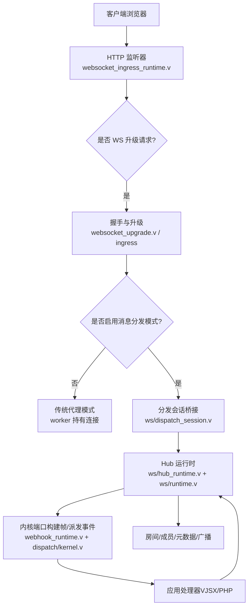
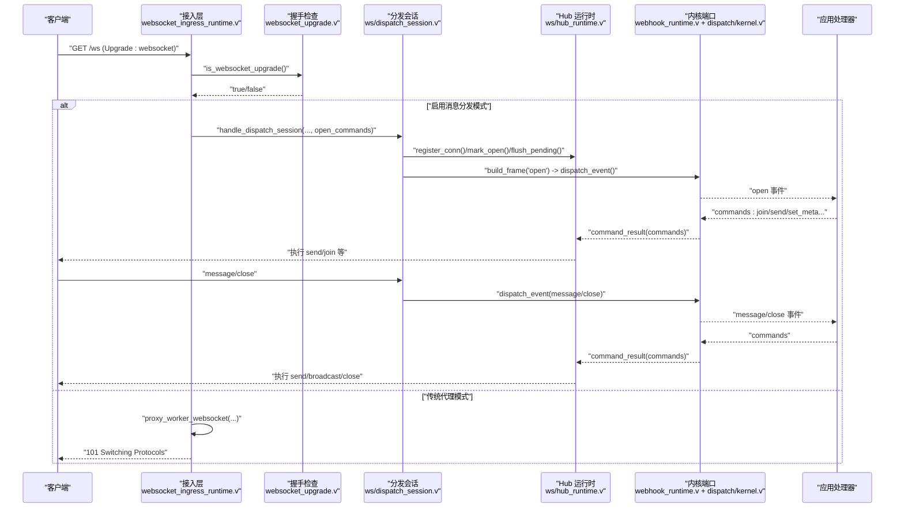
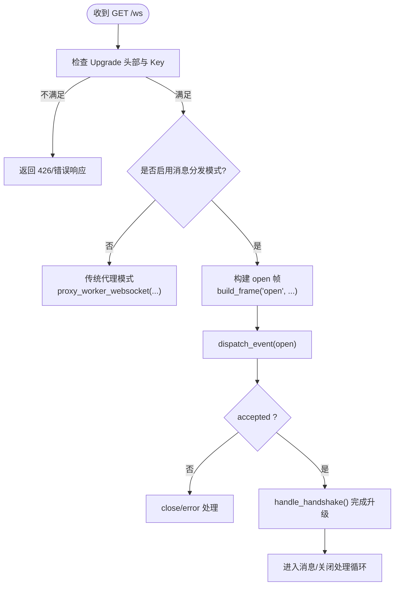
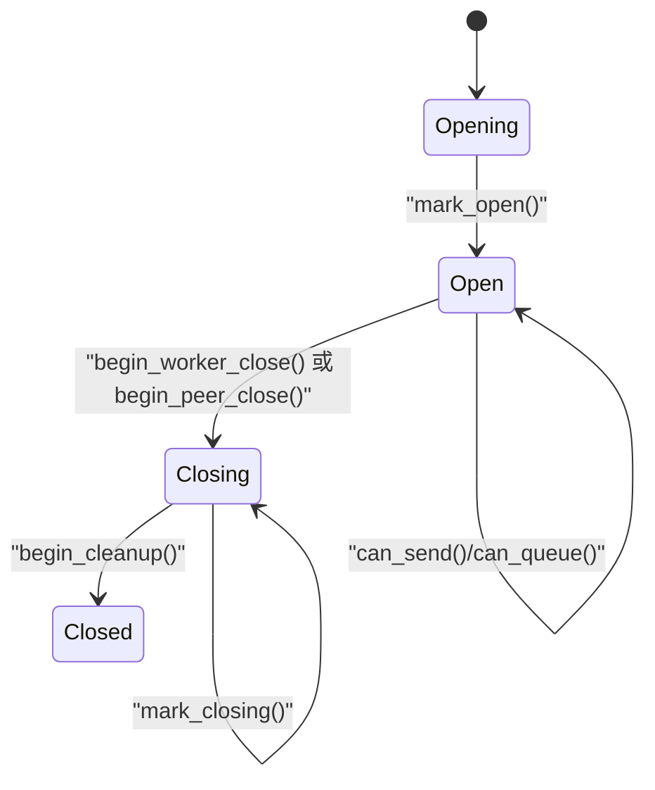
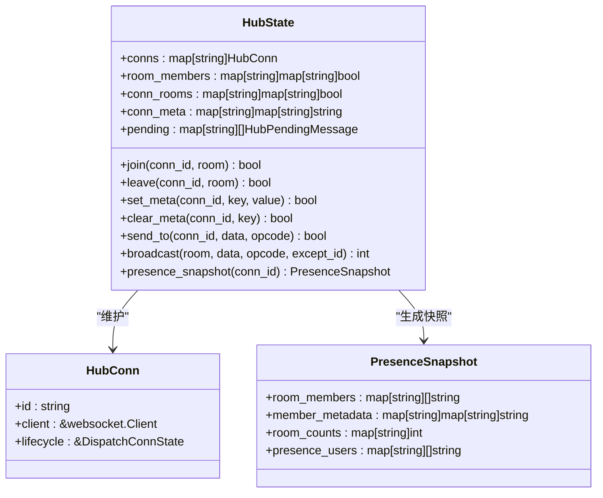
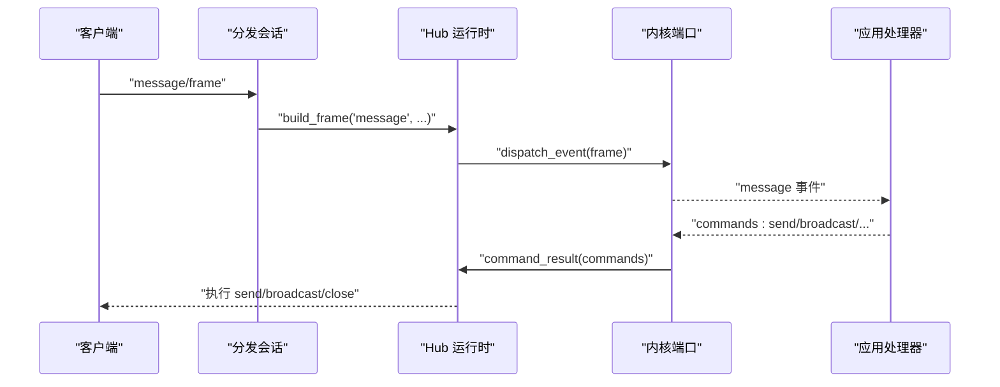
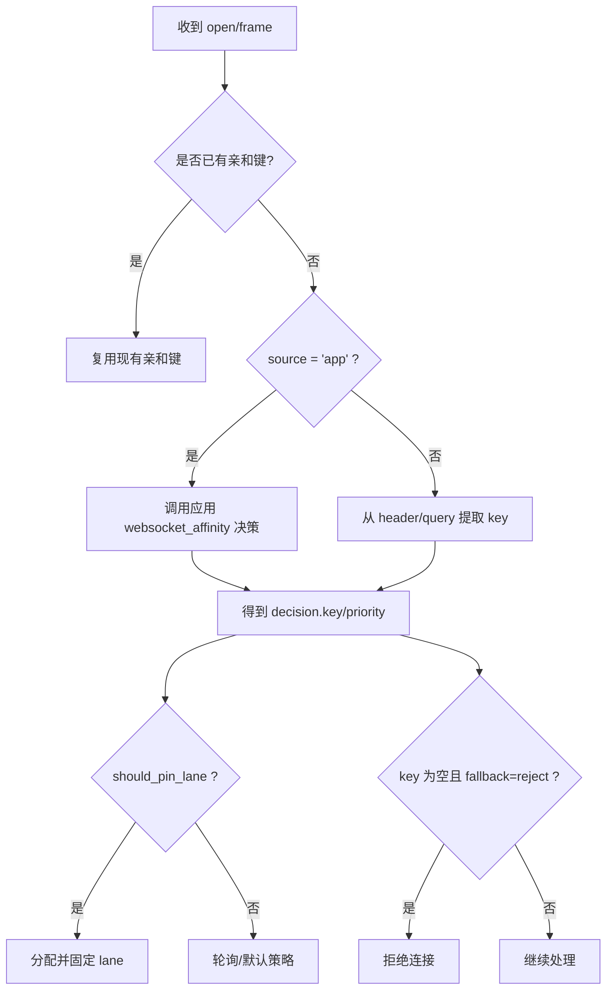
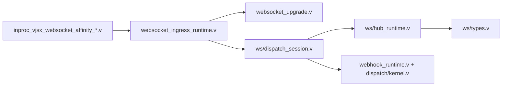

# WebSocket 支持

<cite>
**本文引用的文件**   
- [src/websocket_ingress_runtime.v](file://src/websocket_ingress_runtime.v)
- [src/websocket_upgrade.v](file://src/websocket_upgrade.v)
- [src/ws/runtime.v](file://src/ws/runtime.v)
- [src/ws/hub_runtime.v](file://src/ws/hub_runtime.v)
- [src/ws/types.v](file://src/ws/types.v)
- [src/ws/dispatch_session.v](file://src/ws/dispatch_session.v)
- [src/websocket_runtime.v](file://src/websocket_runtime.v)
- [src/dispatch/kernel.v](file://src/dispatch/kernel.v)
- [src/executor/inproc_vjsx_websocket_affinity_runtime.v](file://src/executor/inproc_vjsx_websocket_affinity_runtime.v)
- [src/executor/inproc_vjsx_websocket_lane_query_runtime.v](file://src/executor/inproc_vjsx_websocket_lane_query_runtime.v)
- [src/executor/inproc_vjsx_websocket_affinity_state.v](file://src/executor/inproc_vjsx_websocket_affinity_state.v)
- [src/server_logic_test.v](file://src/server_logic_test.v)
- [docs/WEBSOCKET_PHASE2_IMPLEMENTATION_PLAN.md](file://docs/WEBSOCKET_PHASE2_IMPLEMENTATION_PLAN.md)
- [docs/WEBSOCKET_EVENT_BUS_PLAN.md](file://docs/WEBSOCKET_EVENT_BUS_PLAN.md)
- [docs/WEBSOCKET_MESSAGE_DISPATCH_PLAN.md](file://docs/WEBSOCKET_MESSAGE_DISPATCH_PLAN.md)
</cite>

## 目录
1. [简介](#简介)
2. [项目结构](#项目结构)
3. [核心组件](#核心组件)
4. [架构总览](#架构总览)
5. [详细组件分析](#详细组件分析)
6. [依赖关系分析](#依赖关系分析)
7. [性能与扩展性](#性能与扩展性)
8. [故障排查指南](#故障排查指南)
9. [结论](#结论)
10. [附录：配置与示例](#附录配置与示例)

## 简介
本文件系统性梳理 vhttpd 的 WebSocket 支持能力，覆盖连接建立、握手升级、连接生命周期管理、房间系统与消息广播、会话亲和性与负载均衡、事件分发与订阅模式、异步处理、配置选项、性能调优与扩展开发要点。文档以源码为依据，提供可视化架构图与时序图，帮助读者快速理解并正确集成使用。

## 项目结构
WebSocket 相关实现主要分布在以下模块：
- 接入与升级：HTTP 到 WebSocket 的握手与升级路径
- 运行时上下文：Hub 状态、房间与会话元数据、命令执行
- 分发会话：基于“消息分发”模式的长连接桥接
- 亲和性与路由：按策略选择工作槽（lane）或应用侧决策
- 计划与演进：两阶段实现路线与迁移建议

图表来源
- [src/websocket_ingress_runtime.v:279-411](file://src/websocket_ingress_runtime.v#L279-L411)
- [src/websocket_upgrade.v:1-14](file://src/websocket_upgrade.v#L1-L14)
- [src/ws/dispatch_session.v:11-35](file://src/ws/dispatch_session.v#L11-L35)
- [src/ws/hub_runtime.v:174-334](file://src/ws/hub_runtime.v#L174-L334)
- [src/websocket_runtime.v:12-99](file://src/websocket_runtime.v#L12-L99)
- [src/dispatch/kernel.v:123-146](file://src/dispatch/kernel.v#L123-L146)

章节来源
- [src/websocket_ingress_runtime.v:279-411](file://src/websocket_ingress_runtime.v#L279-L411)
- [src/websocket_upgrade.v:1-14](file://src/websocket_upgrade.v#L1-L14)
- [src/ws/dispatch_session.v:11-35](file://src/ws/dispatch_session.v#L11-L35)
- [src/ws/hub_runtime.v:174-334](file://src/ws/hub_runtime.v#L174-L334)
- [src/websocket_runtime.v:12-99](file://src/websocket_runtime.v#L12-L99)
- [src/dispatch/kernel.v:123-146](file://src/dispatch/kernel.v#L123-L146)

## 核心组件
- 接入层（Ingress）
  - 负责识别 HTTP 升级请求、完成握手、选择分发模式（传统代理或消息分发），并建立后续会话桥接。
- Hub 运行时（Hub Runtime）
  - 维护连接注册、房间成员、连接元数据、待发送队列、广播与单播、目标关闭等。
- 分发会话（Dispatch Session）
  - 在“消息分发”模式下，将 open/message/close 事件封装为统一帧，派发到应用处理器，再根据返回的命令列表执行动作。
- 内核端口（Kernel Port）
  - 负责构建 Worker 帧与派发事件，作为 Hub 与应用之间的契约接口。
- 亲和性与路由（Affinity & Routing）
  - 支持从应用侧或请求头/查询参数解析亲和键，决定连接绑定到特定 lane 或采用回退策略。

章节来源
- [src/websocket_ingress_runtime.v:279-411](file://src/websocket_ingress_runtime.v#L279-L411)
- [src/ws/hub_runtime.v:174-334](file://src/ws/hub_runtime.v#L174-L334)
- [src/ws/dispatch_session.v:11-35](file://src/ws/dispatch_session.v#L11-L35)
- [src/websocket_runtime.v:12-99](file://src/websocket_runtime.v#L12-L99)
- [src/executor/inproc_vjsx_websocket_affinity_runtime.v:45-185](file://src/executor/inproc_vjsx_websocket_affinity_runtime.v#L45-L185)

## 架构总览
vhttpd 的 WebSocket 架构分为两条路径：
- 传统代理模式：由 worker 进程持有连接，适合简单透传场景。
- 消息分发模式：vhttpd 持有连接，仅在处理事件时调用 worker，具备更好的可扩展性与资源利用率。

图表来源
- [src/websocket_ingress_runtime.v:279-411](file://src/websocket_ingress_runtime.v#L279-L411)
- [src/websocket_upgrade.v:1-14](file://src/websocket_upgrade.v#L1-L14)
- [src/ws/dispatch_session.v:11-35](file://src/ws/dispatch_session.v#L11-L35)
- [src/websocket_runtime.v:12-99](file://src/websocket_runtime.v#L12-L99)
- [src/dispatch/kernel.v:123-146](file://src/dispatch/kernel.v#L123-L146)

## 详细组件分析

### 连接建立与握手升级
- 入口函数检测是否为 WebSocket 升级请求，校验方法与关键头部。
- 若匹配，接管底层 TCP 连接，设置读写超时为无限，进入握手流程。
- 在分发模式下，先派发 open 事件给应用，根据返回命令决定是否接受连接；在传统模式下直接代理至 worker。

图表来源
- [src/websocket_ingress_runtime.v:279-411](file://src/websocket_ingress_runtime.v#L279-L411)
- [src/websocket_upgrade.v:1-14](file://src/websocket_upgrade.v#L1-L14)
- [src/websocket_runtime.v:12-99](file://src/websocket_runtime.v#L12-L99)

章节来源
- [src/websocket_ingress_runtime.v:279-411](file://src/websocket_ingress_runtime.v#L279-L411)
- [src/websocket_upgrade.v:1-14](file://src/websocket_upgrade.v#L1-L14)

### 连接生命周期管理
- 连接状态机包含 opening/open/closing/closed 四个阶段，控制可处理消息、可发送、可排队等能力。
- Hub 在注册连接后，于握手完成后标记 open 并刷新待发送队列。
- 关闭路径区分“本地发起”和“对端发起”，确保只通知一次并完成清理。

图表来源
- [src/ws/types.v:11-119](file://src/ws/types.v#L11-L119)
- [src/ws/dispatch_session.v:78-124](file://src/ws/dispatch_session.v#L78-L124)
- [src/ws/hub_runtime.v:336-367](file://src/ws/hub_runtime.v#L336-L367)

章节来源
- [src/ws/types.v:11-119](file://src/ws/types.v#L11-L119)
- [src/ws/dispatch_session.v:78-124](file://src/ws/dispatch_session.v#L78-L124)
- [src/ws/hub_runtime.v:336-367](file://src/ws/hub_runtime.v#L336-L367)

### 房间系统与消息广播
- HubState 维护连接到房间的映射、房间成员集合、连接元数据与待发送队列。
- 支持 join/leave、set_meta/clear_meta、send_to、broadcast、broadcast_dispatch 等命令。
- broadcast_dispatch 会将 info 帧广播到房间内所有目标，转发其命令结果，必要时触发失败后续处理。

图表来源
- [src/ws/types.v:359-377](file://src/ws/types.v#L359-L377)
- [src/ws/types.v:9-15](file://src/ws/types.v#L9-L15)
- [src/ws/runtime.v:259-301](file://src/ws/runtime.v#L259-L301)
- [src/ws/hub_runtime.v:217-334](file://src/ws/hub_runtime.v#L217-L334)

章节来源
- [src/ws/types.v:359-377](file://src/ws/types.v#L359-L377)
- [src/ws/runtime.v:259-301](file://src/ws/runtime.v#L259-L301)
- [src/ws/hub_runtime.v:217-334](file://src/ws/hub_runtime.v#L217-L334)

### 消息路由系统：事件分发、订阅与异步处理
- 内核端口通过 build_frame 构造统一的 WorkerWebSocketFrame，包含事件类型、连接上下文、房间与存在信息。
- dispatch_event 将事件派发给应用处理器，应用返回命令列表，再由 command_result 执行。
- 支持 send/send_to/join/leave/broadcast/broadcast_dispatch/close/set_meta/clear_meta 等命令。
- 失败回调 followup_failure 允许在命令执行失败后进行后续处理（如关闭目标）。

图表来源
- [src/websocket_runtime.v:12-99](file://src/websocket_runtime.v#L12-L99)
- [src/dispatch/kernel.v:123-146](file://src/dispatch/kernel.v#L123-L146)
- [src/ws/hub_runtime.v:369-436](file://src/ws/hub_runtime.v#L369-L436)

章节来源
- [src/websocket_runtime.v:12-99](file://src/websocket_runtime.v#L12-L99)
- [src/dispatch/kernel.v:123-146](file://src/dispatch/kernel.v#L123-L146)
- [src/ws/hub_runtime.v:369-436](file://src/ws/hub_runtime.v#L369-L436)

### 会话亲和性与负载均衡
- 支持两种亲和键来源：
  - 应用侧决策：通过调用应用入口 websocket_affinity 获取决策。
  - 静态来源：从请求头或查询参数中取值。
- 当未命中亲和键且配置为 reject 时，拒绝连接；否则采用轮询或默认策略。
- 支持 lane 级别固定（pin），并在迁移时更新引用计数与旧 lane 清理。

图表来源
- [src/executor/inproc_vjsx_websocket_affinity_runtime.v:45-185](file://src/executor/inproc_vjsx_websocket_affinity_runtime.v#L45-L185)
- [src/executor/inproc_vjsx_websocket_lane_query_runtime.v:44-75](file://src/executor/inproc_vjsx_websocket_lane_query_runtime.v#L44-L75)
- [src/executor/inproc_vjsx_websocket_affinity_state.v:76-115](file://src/executor/inproc_vjsx_websocket_affinity_state.v#L76-L115)

章节来源
- [src/executor/inproc_vjsx_websocket_affinity_runtime.v:45-185](file://src/executor/inproc_vjsx_websocket_affinity_runtime.v#L45-L185)
- [src/executor/inproc_vjsx_websocket_lane_query_runtime.v:44-75](file://src/executor/inproc_vjsx_websocket_lane_query_runtime.v#L44-L75)
- [src/executor/inproc_vjsx_websocket_affinity_state.v:76-115](file://src/executor/inproc_vjsx_websocket_affinity_state.v#L76-L115)

### 错误处理策略
- 握手失败：返回 426/502/403 等 HTTP 状态码，附带错误类。
- 消息转发失败：记录错误并关闭连接（如 1011）。
- 命令执行失败：返回 failures，可选 followup_failure 进行后续处理（如关闭目标）。
- 关闭路径：区分 worker 发起与对端发起，避免重复通知。

章节来源
- [src/websocket_ingress_runtime.v:279-411](file://src/websocket_ingress_runtime.v#L279-L411)
- [src/ws/hub_runtime.v:369-436](file://src/ws/hub_runtime.v#L369-L436)
- [src/ws/dispatch_session.v:126-168](file://src/ws/dispatch_session.v#L126-L168)

## 依赖关系分析
- 接入层依赖 net.websocket 与 transport 协议帧定义。
- Hub 运行时依赖 sync 互斥锁保护共享状态，依赖 net.websocket 进行写操作。
- 分发会话依赖内核端口构建帧与派发事件，依赖 Hub 执行命令。
- 亲和性逻辑依赖 executor 内部状态与配置。

图表来源
- [src/websocket_ingress_runtime.v:279-411](file://src/websocket_ingress_runtime.v#L279-L411)
- [src/websocket_upgrade.v:1-14](file://src/websocket_upgrade.v#L1-L14)
- [src/ws/dispatch_session.v:11-35](file://src/ws/dispatch_session.v#L11-L35)
- [src/ws/hub_runtime.v:174-334](file://src/ws/hub_runtime.v#L174-L334)
- [src/ws/types.v:359-377](file://src/ws/types.v#L359-L377)
- [src/websocket_runtime.v:12-99](file://src/websocket_runtime.v#L12-L99)
- [src/dispatch/kernel.v:123-146](file://src/dispatch/kernel.v#L123-L146)
- [src/executor/inproc_vjsx_websocket_affinity_runtime.v:45-185](file://src/executor/inproc_vjsx_websocket_affinity_runtime.v#L45-L185)

章节来源
- [src/websocket_ingress_runtime.v:279-411](file://src/websocket_ingress_runtime.v#L279-L411)
- [src/websocket_upgrade.v:1-14](file://src/websocket_upgrade.v#L1-L14)
- [src/ws/dispatch_session.v:11-35](file://src/ws/dispatch_session.v#L11-L35)
- [src/ws/hub_runtime.v:174-334](file://src/ws/hub_runtime.v#L174-L334)
- [src/ws/types.v:359-377](file://src/ws/types.v#L359-L377)
- [src/websocket_runtime.v:12-99](file://src/websocket_runtime.v#L12-L99)
- [src/dispatch/kernel.v:123-146](file://src/dispatch/kernel.v#L123-L146)
- [src/executor/inproc_vjsx_websocket_affinity_runtime.v:45-185](file://src/executor/inproc_vjsx_websocket_affinity_runtime.v#L45-L185)

## 性能与扩展性
- 连接持有模型：消息分发模式下，vhttpd 持有连接，worker 仅处理活跃事件，显著降低常驻内存占用。
- 批量广播：hub_broadcast 一次性扫描房间成员，减少多次查找与锁竞争。
- 待发送队列：在连接尚未 open 或正在关闭时，消息入队并在合适时机 flush，提升可靠性。
- 亲和性优化：应用侧决策可结合历史成功/失败统计，提高命中率与稳定性。
- 扩展点：
  - 外部总线适配器：用于跨节点广播（当前阶段为规划）。
  - 二进制帧支持：已在分发会话中支持 text/binary 转换。
  - 监控指标：可通过 admin 接口获取连接与房间快照。

章节来源
- [docs/WEBSOCKET_PHASE2_IMPLEMENTATION_PLAN.md:378-431](file://docs/WEBSOCKET_PHASE2_IMPLEMENTATION_PLAN.md#L378-L431)
- [docs/WEBSOCKET_EVENT_BUS_PLAN.md:405-444](file://docs/WEBSOCKET_EVENT_BUS_PLAN.md#L405-L444)
- [src/ws/hub_runtime.v:217-334](file://src/ws/hub_runtime.v#L217-L334)
- [src/ws/dispatch_session.v:170-182](file://src/ws/dispatch_session.v#L170-L182)

## 故障排查指南
- 握手失败
  - 检查 Upgrade 头部与 Key 是否正确。
  - 确认是否启用了消息分发模式以及应用是否 accept。
- 消息丢失
  - 查看连接是否在 closing 阶段，是否被拒绝发送。
  - 检查 pending 队列是否被 flush。
- 广播异常
  - 确认房间成员是否存在，except_id 是否正确排除。
  - 关注 broadcast_dispatch 的 failures 与 followup_failure 行为。
- 亲和性导致路由问题
  - 检查 source/fallback 配置与 key 提取逻辑。
  - 验证 should_pin_lane 与迁移后的引用计数。

章节来源
- [src/websocket_ingress_runtime.v:279-411](file://src/websocket_ingress_runtime.v#L279-L411)
- [src/ws/hub_runtime.v:369-436](file://src/ws/hub_runtime.v#L369-L436)
- [src/executor/inproc_vjsx_websocket_affinity_runtime.v:45-185](file://src/executor/inproc_vjsx_websocket_affinity_runtime.v#L45-L185)

## 结论
vhttpd 的 WebSocket 支持提供了灵活的两种运行模式：传统代理与消息分发。后者通过将连接持有与事件处理解耦，显著提升可扩展性与资源效率。房间系统、广播、亲和性与错误处理机制完善，配合清晰的演进计划，便于在生产环境逐步落地与扩展。

## 附录：配置与示例
- 站点级 WebSocket 亲和性配置示例（测试用例展示字段合并与生效）
  - 参考：[src/server_logic_test.v:3218-3312](file://src/server_logic_test.v#L3218-L3312)
- 两阶段实现与迁移建议
  - Phase 2 MVP 范围与 rollout 步骤：[docs/WEBSOCKET_PHASE2_IMPLEMENTATION_PLAN.md:378-431](file://docs/WEBSOCKET_PHASE2_IMPLEMENTATION_PLAN.md#L378-L431)
  - 事件总线实现顺序与边界：[docs/WEBSOCKET_EVENT_BUS_PLAN.md:405-444](file://docs/WEBSOCKET_EVENT_BUS_PLAN.md#L405-L444)
  - 推荐配置模型与风险说明：[docs/WEBSOCKET_MESSAGE_DISPATCH_PLAN.md:359-412](file://docs/WEBSOCKET_MESSAGE_DISPATCH_PLAN.md#L359-L412)

章节来源
- [src/server_logic_test.v:3218-3312](file://src/server_logic_test.v#L3218-L3312)
- [docs/WEBSOCKET_PHASE2_IMPLEMENTATION_PLAN.md:378-431](file://docs/WEBSOCKET_PHASE2_IMPLEMENTATION_PLAN.md#L378-L431)
- [docs/WEBSOCKET_EVENT_BUS_PLAN.md:405-444](file://docs/WEBSOCKET_EVENT_BUS_PLAN.md#L405-L444)
- [docs/WEBSOCKET_MESSAGE_DISPATCH_PLAN.md:359-412](file://docs/WEBSOCKET_MESSAGE_DISPATCH_PLAN.md#L359-L412)