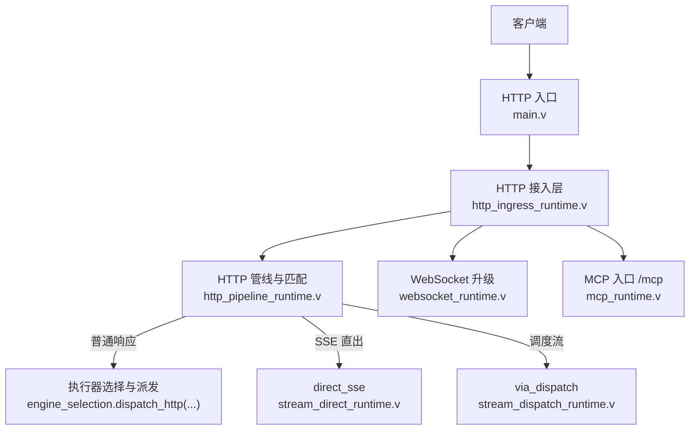
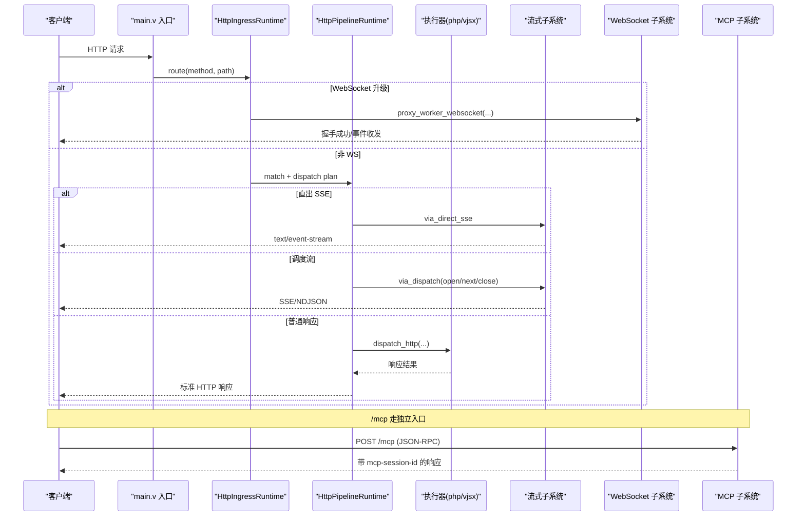
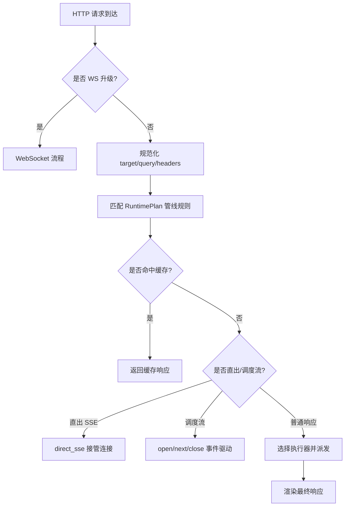
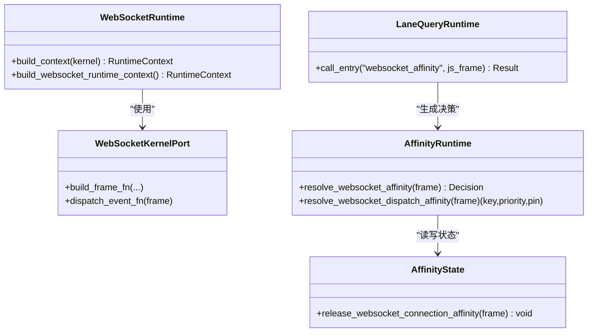
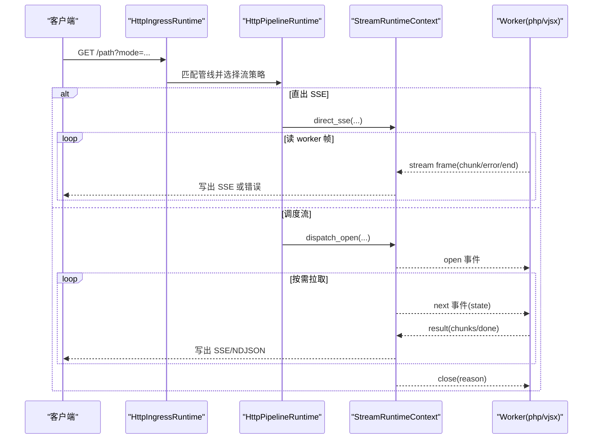
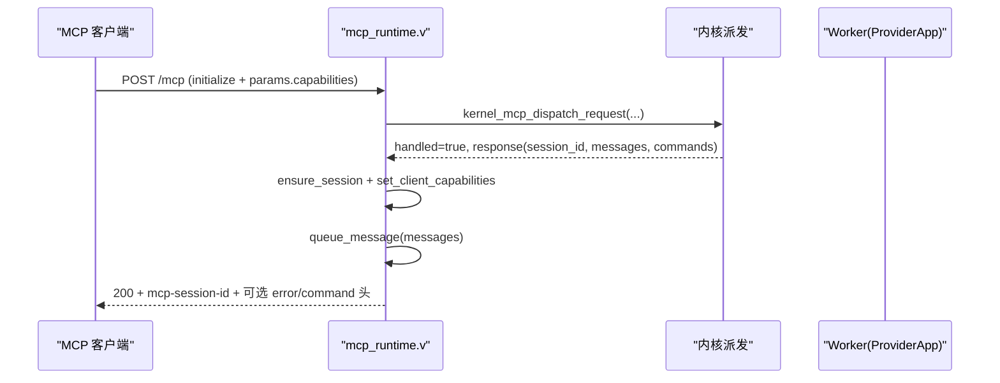
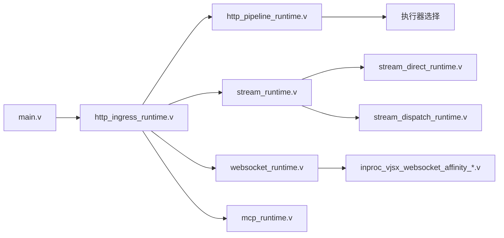

# 协议支持

<cite>
**本文引用的文件**   
- [README.md](file://README.md)
- [main.v](file://src/main.v)
- [http_ingress_runtime.v](file://src/http_ingress_runtime.v)
- [http_pipeline_runtime.v](file://src/http_pipeline_runtime.v)
- [http_dispatch_exchange_runtime.v](file://src/http_dispatch_exchange_runtime.v)
- [stream_runtime.v](file://src/stream_runtime.v)
- [stream_direct_runtime.v](file://src/stream_direct_runtime.v)
- [stream_dispatch_runtime.v](file://src/stream_dispatch_runtime.v)
- [websocket_runtime.v](file://src/websocket_runtime.v)
- [inproc_vjsx_websocket_affinity_runtime.v](file://src/executor/inproc_vjsx_websocket_affinity_runtime.v)
- [inproc_vjsx_websocket_lane_query_runtime.v](file://src/executor/inproc_vjsx_websocket_lane_query_runtime.v)
- [inproc_vjsx_websocket_affinity_state.v](file://src/executor/inproc_vjsx_websocket_affinity_state.v)
- [mcp_runtime.v](file://src/mcp_runtime.v)
- [MCP_CAPABILITY_NEGOTIATION_PLAN.md](file://docs/MCP_CAPABILITY_NEGOTIATION_PLAN.md)
- [STREAM_PHASE2_IMPLEMENTATION_PLAN.md](file://docs/STREAM_PHASE2_IMPLEMENTATION_PLAN.md)
- [04-ai-streaming.md](file://articles/04-ai-streaming.md)
- [bench/README.md](file://bench/README.md)
</cite>

## 目录
1. [简介](#简介)
2. [项目结构](#项目结构)
3. [核心组件](#核心组件)
4. [架构总览](#架构总览)
5. [详细组件分析](#详细组件分析)
6. [依赖关系分析](#依赖关系分析)
7. [性能与背压](#性能与背压)
8. [故障排查指南](#故障排查指南)
9. [结论](#结论)
10. [附录：配置与最佳实践](#附录配置与最佳实践)

## 简介
本文件系统性梳理 vhttpd 的协议支持能力，覆盖 HTTP/HTTPS、WebSocket、流式响应（SSE/文本流）、以及 MCP（JSON-RPC over Streamable HTTP）等。重点说明路由匹配、中间件机制、静态文件服务、连接管理、房间系统、消息路由、会话亲和性、背压控制、能力协商与流式传输等实现要点，并提供配置示例、API 参考与最佳实践建议。

vhttpd 以 veb 为 HTTP 事实来源，保持自身轻量，聚焦于传输、工作进程编排、流式处理与可观测性；同时提供多执行器模型（php-worker、vjsx 内嵌等），统一承载多种协议与运行时能力。

章节来源
- [README.md:1-127](file://README.md#L1-L127)

## 项目结构
从协议入口到执行器的关键路径如下：
- 入口层：HTTP 方法通配路由将请求交给 HttpIngressRuntime 进行协议识别与分发
- 路由与管线：HttpPipelineRuntime 负责规则匹配、转换、缓存命中、策略选择（直接流/调度流/普通响应）
- 执行器：根据引擎选择调用 php-worker 或 vjsx 执行逻辑
- WebSocket：升级后由 WebSocketRuntime 接管，维护连接、房间、存在性与命令执行
- 流式响应：支持 direct SSE 与 dispatch 模式（open/next/close）
- MCP：/mcp 端点承载 JSON-RPC，维护会话、能力协商与队列

图表来源
- [main.v:83-116](file://src/main.v#L83-L116)
- [http_ingress_runtime.v:31-139](file://src/http_ingress_runtime.v#L31-L139)
- [http_pipeline_runtime.v:37-161](file://src/http_pipeline_runtime.v#L37-L161)
- [stream_direct_runtime.v:17-48](file://src/stream_direct_runtime.v#L17-L48)
- [stream_dispatch_runtime.v:132-148](file://src/stream_dispatch_runtime.v#L132-L148)
- [websocket_runtime.v:1-115](file://src/websocket_runtime.v#L1-L115)
- [mcp_runtime.v:11-138](file://src/mcp_runtime.v#L11-L138)

章节来源
- [main.v:1-117](file://src/main.v#L1-L117)
- [http_ingress_runtime.v:1-146](file://src/http_ingress_runtime.v#L1-L146)
- [http_pipeline_runtime.v:37-161](file://src/http_pipeline_runtime.v#L37-L161)

## 核心组件
- HTTP 接入与路由
  - 入口：main.v 对全部 HTTP 方法进行通配转发至 HttpIngressRuntime.route
  - 接入：http_ingress_runtime.v 负责 WS 升级判断、数据面 scheme 注入、规范化目标、管道匹配与派发
  - 管线：http_pipeline_runtime.v 实现最大请求体限制、重定向、固定状态码返回、none 阻断、适配器投递与结果渲染
- 流式响应
  - 上下文：stream_runtime.v 定义 StreamRuntimeContext 与 open/next/close 调度接口
  - 直出 SSE：stream_direct_runtime.v 接管连接并透传 worker 的 stream chunk/error/end
  - 调度流：stream_dispatch_runtime.v 基于 open/next/close 事件驱动，vhttpd 持有下游连接与写循环
- WebSocket
  - 内核端口：websocket_runtime.v 构建帧构造与事件派发函数，封装房间、存在性、广播、元数据等
  - 亲和性：inproc_vjsx_websocket_affinity_runtime.v 解析亲和键与优先级，决定是否钉住 lane
  - 查询与决策：inproc_vjsx_websocket_lane_query_runtime.v 通过 app 回调计算亲和键
  - 状态清理：inproc_vjsx_websocket_affinity_state.v 释放亲和关联与邮箱资源
- MCP
  - 入口：mcp_runtime.v 校验方法、协议版本、来源白名单、空体检查，创建/复用会话，保存客户端能力，排队消息并回写响应头
  - 能力协商：docs/MCP_CAPABILITY_NEGOTIATION_PLAN.md 描述 server 声明与 client 能力存储位置及后续 gating 方向

章节来源
- [main.v:83-116](file://src/main.v#L83-L116)
- [http_ingress_runtime.v:31-139](file://src/http_ingress_runtime.v#L31-L139)
- [http_pipeline_runtime.v:37-161](file://src/http_pipeline_runtime.v#L37-L161)
- [stream_runtime.v:1-48](file://src/stream_runtime.v#L1-48)
- [stream_direct_runtime.v:17-48](file://src/stream_direct_runtime.v#L17-L48)
- [stream_dispatch_runtime.v:132-148](file://src/stream_dispatch_runtime.v#L132-L148)
- [websocket_runtime.v:1-115](file://src/websocket_runtime.v#L1-L115)
- [inproc_vjsx_websocket_affinity_runtime.v:45-185](file://src/executor/inproc_vjsx_websocket_affinity_runtime.v#L45-L185)
- [inproc_vjsx_websocket_lane_query_runtime.v:44-75](file://src/executor/inproc_vjsx_websocket_lane_query_runtime.v#L44-L75)
- [inproc_vjsx_websocket_affinity_state.v:1-42](file://src/executor/inproc_vjsx_websocket_affinity_state.v#L1-L42)
- [mcp_runtime.v:11-138](file://src/mcp_runtime.v#L11-L138)
- [MCP_CAPABILITY_NEGOTIATION_PLAN.md:1-139](file://docs/MCP_CAPABILITY_NEGOTIATION_PLAN.md#L1-L139)

## 架构总览
下图展示协议入口、管线、执行器与子系统的交互关系。

图表来源
- [main.v:83-116](file://src/main.v#L83-L116)
- [http_ingress_runtime.v:31-139](file://src/http_ingress_runtime.v#L31-L139)
- [http_pipeline_runtime.v:37-161](file://src/http_pipeline_runtime.v#L37-L161)
- [stream_direct_runtime.v:17-48](file://src/stream_direct_runtime.v#L17-L48)
- [stream_dispatch_runtime.v:132-148](file://src/stream_dispatch_runtime.v#L132-L148)
- [websocket_runtime.v:1-115](file://src/websocket_runtime.v#L1-L115)
- [mcp_runtime.v:11-138](file://src/mcp_runtime.v#L11-L138)

## 详细组件分析

### HTTP/HTTPS 服务器：路由匹配、中间件与静态文件
- 路由匹配
  - main.v 对所有 HTTP 方法注册通配处理器，统一交由 HttpIngressRuntime.route
  - http_ingress_runtime.v 完成 WS 升级判断、scheme 注入、规范化 target、query 解析、headers 提取
  - http_pipeline_runtime.v 实现：
    - 最大请求体限制与拒绝适配
    - 目录斜杠重定向（GET/HEAD）
    - 固定状态码/重定向/none 阻断
    - 适配器投递与最终响应渲染
- 中间件机制
  - App 组合了 veb.Middleware[Context]，可在请求进入业务逻辑前插入通用处理（如日志、鉴权、CORS 等）
- 静态文件服务
  - App 组合了 veb.StaticHandler，用于静态资源托管（例如 public 目录下的文件）
- 执行器选择
  - 若未启用逻辑执行器，返回 404
  - 否则按 pipeline 的 executor 字段选择 php 或 vjsx 执行器，并进行派发

图表来源
- [main.v:83-116](file://src/main.v#L83-L116)
- [http_ingress_runtime.v:56-139](file://src/http_ingress_runtime.v#L56-L139)
- [http_pipeline_runtime.v:37-161](file://src/http_pipeline_runtime.v#L37-L161)

章节来源
- [main.v:83-116](file://src/main.v#L83-L116)
- [http_ingress_runtime.v:31-139](file://src/http_ingress_runtime.v#L31-L139)
- [http_pipeline_runtime.v:37-161](file://src/http_pipeline_runtime.v#L37-L161)

### WebSocket 支持：连接管理、房间系统、消息路由与会话亲和性
- 连接管理与内核端口
  - websocket_runtime.v 暴露 build_context，封装 join/leave/broadcast/set_meta/clear_meta/send_to/close_target 等能力
  - 通过 kernel port 将 frame 构造与事件派发委托给上层执行器（php-worker 或 vjsx）
- 房间系统与存在性
  - 每个连接维护 rooms、metadata、presence 快照（成员、计数、在线用户）
  - 支持向房间广播、向指定连接发送、关闭目标连接
- 消息路由
  - 事件类型包括 open/message/close 等，opcode 支持 text/binary
  - 在 vjsx 模式下，可通过 affinity 决定消息是否钉住特定 lane，提升局部性
- 会话亲和性
  - inproc_vjsx_websocket_affinity_runtime.v 解析亲和键与优先级，支持“应用自定义”或“默认策略”
  - inproc_vjsx_websocket_lane_query_runtime.v 通过 app 回调计算亲和键，失败时记录错误
  - inproc_vjsx_websocket_affinity_state.v 负责释放亲和关联、邮箱与引用计数

图表来源
- [websocket_runtime.v:1-115](file://src/websocket_runtime.v#L1-L115)
- [inproc_vjsx_websocket_affinity_runtime.v:45-185](file://src/executor/inproc_vjsx_websocket_affinity_runtime.v#L45-L185)
- [inproc_vjsx_websocket_lane_query_runtime.v:44-75](file://src/executor/inproc_vjsx_websocket_lane_query_runtime.v#L44-L75)
- [inproc_vjsx_websocket_affinity_state.v:1-42](file://src/executor/inproc_vjsx_websocket_affinity_state.v#L1-L42)

章节来源
- [websocket_runtime.v:1-115](file://src/websocket_runtime.v#L1-L115)
- [inproc_vjsx_websocket_affinity_runtime.v:45-185](file://src/executor/inproc_vjsx_websocket_affinity_runtime.v#L45-L185)
- [inproc_vjsx_websocket_lane_query_runtime.v:44-75](file://src/executor/inproc_vjsx_websocket_lane_query_runtime.v#L44-L75)
- [inproc_vjsx_websocket_affinity_state.v:1-42](file://src/executor/inproc_vjsx_websocket_affinity_state.v#L1-L42)

### 流式响应：SSE、文本流与背压控制
- 两种模式
  - 直出模式（direct）：worker 拥有长连接，vhttpd 仅做透写，适合简单场景
  - 调度模式（dispatch）：vhttpd 持有下游连接，worker 仅处理短生命周期事件 open/next/close，具备回放与合成能力
- 数据结构与协议
  - docs/STREAM_PHASE2_IMPLEMENTATION_PLAN.md 定义了 StreamDispatchRequest/Response、chunk 字段（event/id/data/retry 等）
- 直出 SSE 流程
  - stream_direct_runtime.v 接管连接、写入 headers、循环读取 worker stream frame，按 event 写出 SSE 或上报错误
- 调度流流程
  - stream_runtime.v 提供 StreamRuntimeContext 的 open/next/close 接口
  - stream_dispatch_runtime.v 在结束阶段输出终止标记并记录指标

图表来源
- [stream_runtime.v:1-48](file://src/stream_runtime.v#L1-48)
- [stream_direct_runtime.v:17-48](file://src/stream_direct_runtime.v#L17-L48)
- [stream_dispatch_runtime.v:132-148](file://src/stream_dispatch_runtime.v#L132-L148)
- [STREAM_PHASE2_IMPLEMENTATION_PLAN.md:205-295](file://docs/STREAM_PHASE2_IMPLEMENTATION_PLAN.md#L205-L295)

章节来源
- [stream_runtime.v:1-48](file://src/stream_runtime.v#L1-48)
- [stream_direct_runtime.v:17-48](file://src/stream_direct_runtime.v#L17-L48)
- [stream_dispatch_runtime.v:132-148](file://src/stream_dispatch_runtime.v#L132-L148)
- [STREAM_PHASE2_IMPLEMENTATION_PLAN.md:205-295](file://docs/STREAM_PHASE2_IMPLEMENTATION_PLAN.md#L205-L295)

### MCP 协议支持：JSON-RPC、会话管理、能力协商与流式传输
- 入口与校验
  - mcp_runtime.v 限定 POST /mcp，校验协议版本、来源白名单、空体，必要时生成 session_id
- 会话与能力
  - 首次 initialize 时保存客户端 capabilities 到会话
  - 服务端能力由 ProviderApp 自动推导（tools/resources/prompts），详见能力协商计划
- 消息队列与命令
  - 服务端可能返回 commands，vhttpd 同步执行并附加到响应头中
  - 采样能力不足时返回 409 提示
- 响应头
  - 携带 mcp-protocol-version、mcp-session-id、x-vhttpd-trace-id 等

图表来源
- [mcp_runtime.v:11-138](file://src/mcp_runtime.v#L11-L138)
- [MCP_CAPABILITY_NEGOTIATION_PLAN.md:1-139](file://docs/MCP_CAPABILITY_NEGOTIATION_PLAN.md#L1-L139)

章节来源
- [mcp_runtime.v:11-138](file://src/mcp_runtime.v#L11-L138)
- [MCP_CAPABILITY_NEGOTIATION_PLAN.md:1-139](file://docs/MCP_CAPABILITY_NEGOTIATION_PLAN.md#L1-L139)

## 依赖关系分析
- HTTP 管线与执行器
  - http_ingress_runtime.v 依赖 http_pipeline_runtime.v 进行匹配与派发
  - http_pipeline_runtime.v 依赖执行器选择与适配器体系
- 流式子系统
  - stream_runtime.v 作为抽象上下文，被 direct 与 dispatch 两种实现复用
- WebSocket
  - websocket_runtime.v 依赖 ws 模块与内核端口，结合 vjsx 亲和性子系统
- MCP
  - mcp_runtime.v 依赖内核派发与会话/能力管理

图表来源
- [main.v:83-116](file://src/main.v#L83-L116)
- [http_ingress_runtime.v:31-139](file://src/http_ingress_runtime.v#L31-L139)
- [http_pipeline_runtime.v:37-161](file://src/http_pipeline_runtime.v#L37-L161)
- [stream_runtime.v:1-48](file://src/stream_runtime.v#L1-48)
- [stream_direct_runtime.v:17-48](file://src/stream_direct_runtime.v#L17-L48)
- [stream_dispatch_runtime.v:132-148](file://src/stream_dispatch_runtime.v#L132-L148)
- [websocket_runtime.v:1-115](file://src/websocket_runtime.v#L1-L115)
- [inproc_vjsx_websocket_affinity_runtime.v:45-185](file://src/executor/inproc_vjsx_websocket_affinity_runtime.v#L45-L185)
- [mcp_runtime.v:11-138](file://src/mcp_runtime.v#L11-L138)

章节来源
- [http_ingress_runtime.v:31-139](file://src/http_ingress_runtime.v#L31-L139)
- [http_pipeline_runtime.v:37-161](file://src/http_pipeline_runtime.v#L37-L161)
- [stream_runtime.v:1-48](file://src/stream_runtime.v#L1-48)
- [websocket_runtime.v:1-115](file://src/websocket_runtime.v#L1-L115)
- [mcp_runtime.v:11-138](file://src/mcp_runtime.v#L11-L138)

## 性能与背压
- 直出 SSE
  - 采用直接接管连接的方式，减少中间拷贝，适合低延迟 token 流
  - 注意上游 worker 的 flush 行为与网络缓冲设置
- 调度流
  - vhttpd 持有下游连接，worker 仅处理短事件，便于水平扩展与回放
  - 建议在 next 阶段实现合理的 pacing/backoff，避免下游拥塞
- 基准与测试
  - 文档与脚本提供了 SSE/text 的 k6 基准用例，可用于评估不同 interval/token 数量下的吞吐与时延

章节来源
- [stream_direct_runtime.v:17-48](file://src/stream_direct_runtime.v#L17-L48)
- [stream_dispatch_runtime.v:132-148](file://src/stream_dispatch_runtime.v#L132-L148)
- [STREAM_PHASE2_IMPLEMENTATION_PLAN.md:205-295](file://docs/STREAM_PHASE2_IMPLEMENTATION_PLAN.md#L205-L295)
- [bench/README.md:79-141](file://bench/README.md#L79-L141)

## 故障排查指南
- HTTP
  - 最大请求体超限：pipeline 会记录警告并返回 413
  - 无执行器：返回 404
  - 重定向：GET/HEAD 下目录斜杠重定向
- 流式
  - 直出 SSE：关注 worker 帧解码与 write 错误，观察 http.stream.error 事件
  - 调度流：确认 open/next/close 事件顺序与 state 一致性
- WebSocket
  - 亲和键缺失：当开启强制且 fallback=reject 时，会返回错误并关闭连接
  - 任务派发失败：记录 lane 错误并返回相应错误类
- MCP
  - 来源禁止：origin_forbidden
  - 空体：empty_body
  - 采样能力不足：409 提示需要 sampling capability

章节来源
- [http_pipeline_runtime.v:37-161](file://src/http_pipeline_runtime.v#L37-L161)
- [http_ingress_runtime.v:56-139](file://src/http_ingress_runtime.v#L56-L139)
- [stream_direct_runtime.v:17-48](file://src/stream_direct_runtime.v#L17-L48)
- [inproc_vjsx_websocket_affinity_runtime.v:45-185](file://src/executor/inproc_vjsx_websocket_affinity_runtime.v#L45-L185)
- [mcp_runtime.v:11-138](file://src/mcp_runtime.v#L11-L138)

## 结论
vhttpd 以 veb 为核心，围绕 HTTP/WebSocket/流式/MCP 构建了统一的 transport runtime。其优势在于：
- 协议统一：同一入口承载多种协议与执行器
- 流式优先：直出与调度双模式兼顾低延迟与可扩展性
- 实时通信：WebSocket 房间、存在性与亲和性支撑复杂场景
- 协议治理：MCP 会话与能力协商保障互操作性
- 可观测性：贯穿各层的指标与事件便于排障与优化

## 附录：配置与最佳实践
- 配置要点
  - TOML-first：支持变量展开、多监听器、站点级覆盖
  - 执行器选择：php 或 vjsx，站点级可独立配置
  - 静态资源：assets.enabled/prefix/root/cache_control
  - 工作进程：pool_size、queue_capacity、timeout、max_requests 等
- 流式最佳实践
  - 直出 SSE：确保 worker 及时 flush，合理设置 x-accel-buffering=no
  - 调度流：实现 backoff/pacing，避免下游拥塞；利用 state 实现断线续传
- WebSocket 最佳实践
  - 合理设置亲和键，提升热点会话局部性
  - 使用房间与存在性进行扩缩容与广播
- MCP 最佳实践
  - 明确 server capabilities，遵循 client capabilities gating
  - 合理使用 mcp-session-id 与 mcp-protocol-version 头

章节来源
- [README.md:437-617](file://README.md#L437-L617)
- [04-ai-streaming.md:165-237](file://articles/04-ai-streaming.md#L165-L237)
- [MCP_CAPABILITY_NEGOTIATION_PLAN.md:1-139](file://docs/MCP_CAPABILITY_NEGOTIATION_PLAN.md#L1-L139)