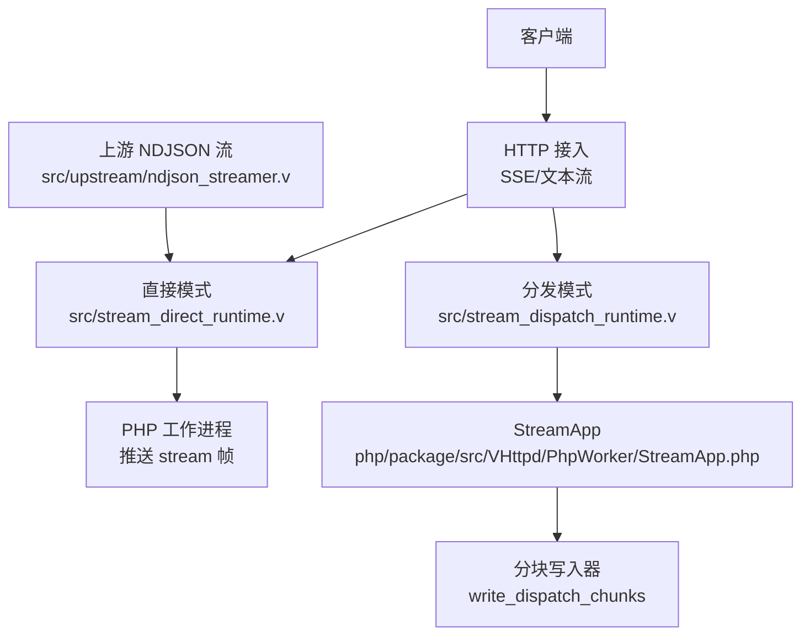
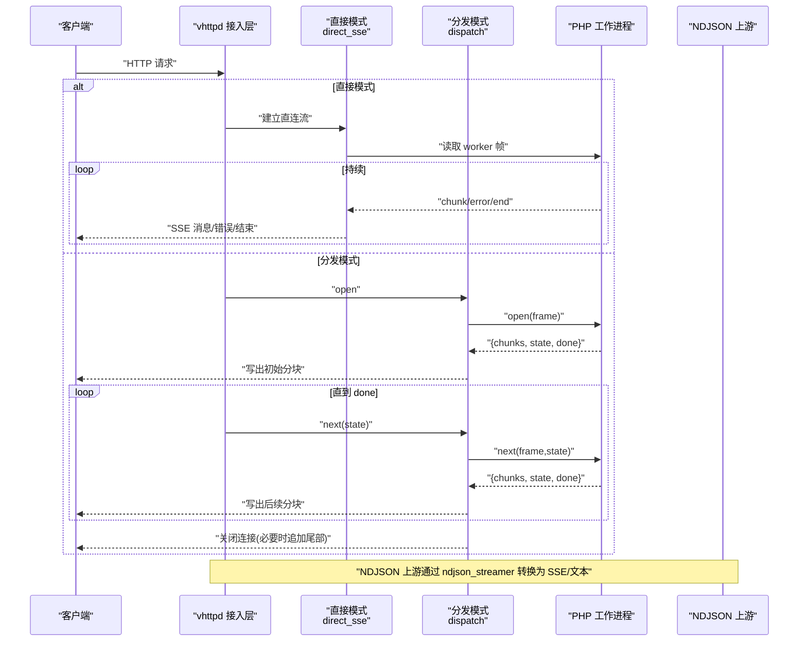
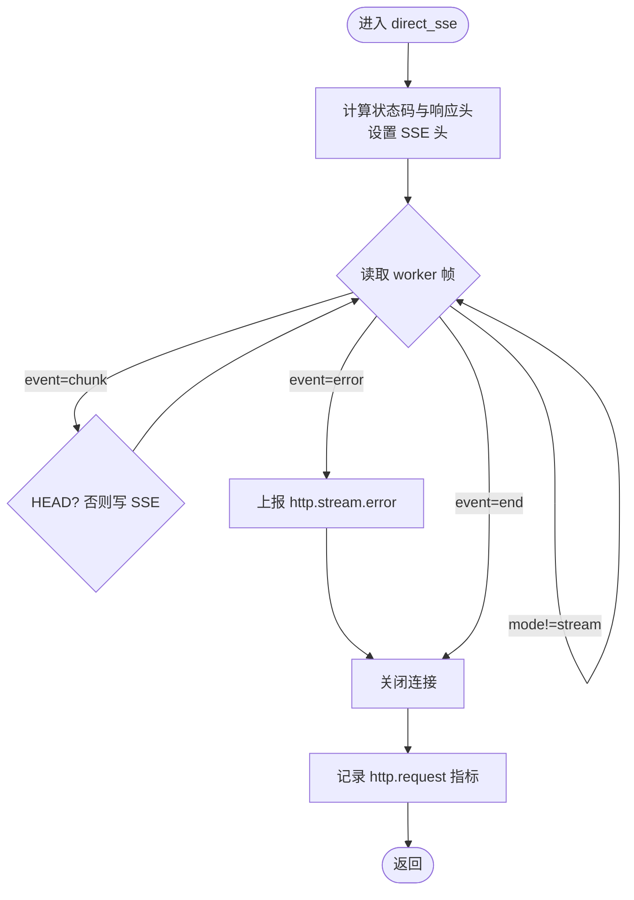
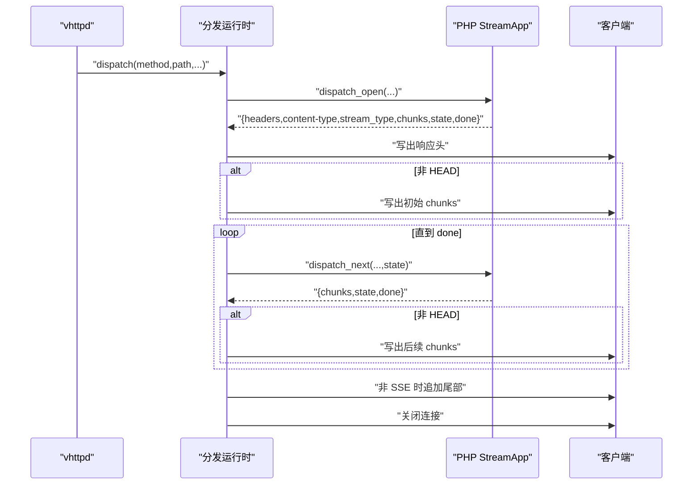
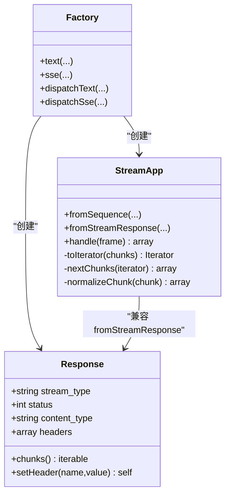
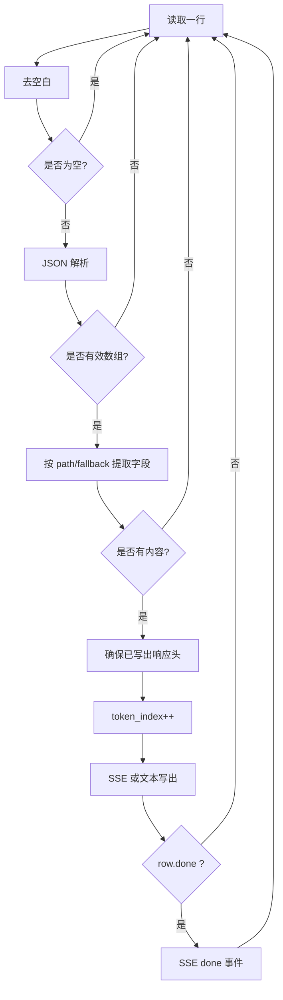
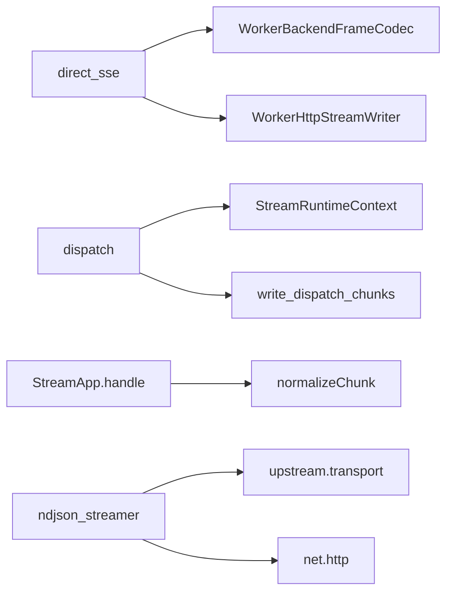

# 流式响应

<cite>
**本文引用的文件**
- [src/stream_direct_runtime.v](file://src/stream_direct_runtime.v)
- [src/stream_dispatch_runtime.v](file://src/stream_dispatch_runtime.v)
- [src/upstream/ndjson_streamer.v](file://src/upstream/ndjson_streamer.v)
- [php/package/src/VSlim/Stream/Factory.php](file://php/package/src/VSlim/Stream/Factory.php)
- [php/package/src/VSlim/Stream/Response.php](file://php/package/src/VSlim/Stream/Response.php)
- [php/package/src/VHttpd/PhpWorker/StreamApp.php](file://php/package/src/VHttpd/PhpWorker/StreamApp.php)
- [php/package/src/VSlim/Stream/NdjsonDecoder.php](file://php/package/src/VSlim/Stream/NdjsonDecoder.php)
- [examples/stream-dispatch-app.php](file://examples/stream-dispatch-app.php)
- [examples/ai-stream-app.php](file://examples/ai-stream-app.php)
- [articles/04-ai-streaming.md](file://articles/04-ai-streaming.md)
</cite>

## 目录
1. [简介](#简介)
2. [项目结构](#项目结构)
3. [核心组件](#核心组件)
4. [架构总览](#架构总览)
5. [详细组件分析](#详细组件分析)
6. [依赖关系分析](#依赖关系分析)
7. [性能与背压](#性能与背压)
8. [故障排查指南](#故障排查指南)
9. [结论](#结论)
10. [附录：使用指南与最佳实践](#附录使用指南与最佳实践)

## 简介
本文件聚焦 vhttpd 的流式响应能力，覆盖以下主题：
- Server-Sent Events（SSE）的实现原理、配置与使用方式
- 文本流处理机制：增量输出、背压控制与流量管理
- NDJSON 格式支持与数据序列化流程
- 典型应用场景：实时数据推送、长任务进度更新等
- 流式 API 使用指南：客户端连接、消息格式定义、错误处理
- 性能优化技巧、资源管理与调试方法

## 项目结构
vhttpd 将“协议接入层”和“逻辑执行层”解耦。流式响应由两条主线构成：
- 直接模式（direct）：worker 持有长连接，按帧向 vhttpd 推送 chunk/error/end，vhttpd 直接转发到客户端
- 分发模式（dispatch）：vhttpd 持有长连接，worker 仅处理短事件 open/next/close，适合可回放或合成流

图表来源
- [src/stream_direct_runtime.v:17-70](file://src/stream_direct_runtime.v#L17-L70)
- [src/stream_dispatch_runtime.v:33-148](file://src/stream_dispatch_runtime.v#L33-L148)
- [src/upstream/ndjson_streamer.v:22-97](file://src/upstream/ndjson_streamer.v#L22-L97)
- [php/package/src/VHttpd/PhpWorker/StreamApp.php:79-103](file://php/package/src/VHttpd/PhpWorker/StreamApp.php#L79-L103)

章节来源
- [README.md:45-83](file://README.md#L45-L83)

## 核心组件
- SSE 直接模式运行时：负责接管连接、设置 SSE 头、循环读取 worker 帧并写回客户端
- 分发模式运行时：负责 open/next/close 生命周期、批量写出、非 SSE 时追加 HTTP 尾部
- PHP 侧流式工厂与响应对象：提供 text/sse/dispatch 的统一入口
- StreamApp：在分发模式下维护迭代器、批大小与延迟，标准化 chunk 为 {event,id,data,retry}
- NDJSON 流处理器：解析上游 NDJSON 行，映射字段，按 SSE 或文本流写出
- NDJSON 解码器（PHP）：逐行解析 JSON，支持 done 标志终止

章节来源
- [src/stream_direct_runtime.v:17-70](file://src/stream_direct_runtime.v#L17-L70)
- [src/stream_dispatch_runtime.v:33-148](file://src/stream_dispatch_runtime.v#L33-L148)
- [php/package/src/VSlim/Stream/Factory.php:16-77](file://php/package/src/VSlim/Stream/Factory.php#L16-L77)
- [php/package/src/VSlim/Stream/Response.php:23-77](file://php/package/src/VSlim/Stream/Response.php#L23-L77)
- [php/package/src/VHttpd/PhpWorker/StreamApp.php:31-103](file://php/package/src/VHttpd/PhpWorker/StreamApp.php#L31-L103)
- [src/upstream/ndjson_streamer.v:22-97](file://src/upstream/ndjson_streamer.v#L22-L97)
- [php/package/src/VSlim/Stream/NdjsonDecoder.php:13-40](file://php/package/src/VSlim/Stream/NdjsonDecoder.php#L13-L40)

## 架构总览
下图展示了从请求进入 vhttpd 到最终写出 SSE/文本流的端到端路径，以及两种策略的差异。

图表来源
- [src/stream_direct_runtime.v:17-70](file://src/stream_direct_runtime.v#L17-L70)
- [src/stream_dispatch_runtime.v:33-148](file://src/stream_dispatch_runtime.v#L33-L148)
- [src/upstream/ndjson_streamer.v:22-97](file://src/upstream/ndjson_streamer.v#L22-L97)

## 详细组件分析

### SSE 直接模式（Direct SSE）
- 职责
  - 接管底层连接，设置 SSE 相关响应头（如 content-type、x-accel-buffering=no、x-vhttpd-stream-mode=direct）
  - 循环读取 worker 帧，过滤 mode='stream'，对 event='chunk' 调用 SSE 写入器；error 上报指标后中断；end 正常结束
- 关键行为
  - HEAD 请求不写 body
  - 默认 content-type 为 text/event-stream
  - 结束时记录 http.request 指标，包含 response_mode/stream_strategy/stream_type

图表来源
- [src/stream_direct_runtime.v:17-70](file://src/stream_direct_runtime.v#L17-L70)

章节来源
- [src/stream_direct_runtime.v:17-70](file://src/stream_direct_runtime.v#L17-L70)

### 分发模式（Dispatch）
- 职责
  - 通过 dispatch_open 获取初始响应（含 headers、content-type、stream_type、chunks、state、done）
  - 根据 stream_type 选择是否启用 SSE 缓冲禁用头
  - 循环 dispatch_next，累积 state，按需写出分块
  - 非 SSE 时在末尾追加 HTTP 尾部标记
- 关键行为
  - 统一封装 write_dispatch_chunks，按 stream_type 决定 SSE 或普通 chunk 写出
  - 失败路径会触发 http.stream.error 指标

图表来源
- [src/stream_dispatch_runtime.v:33-148](file://src/stream_dispatch_runtime.v#L33-L148)

章节来源
- [src/stream_dispatch_runtime.v:33-148](file://src/stream_dispatch_runtime.v#L33-L148)

### PHP 侧流式 API（Factory/Response/StreamApp）
- Factory
  - 提供 text/sse/dispatchText/dispatchSse 等便捷方法，统一构造 Response 或 StreamApp
- Response
  - 封装 stream_type/status/content_type/headers/chunks，规范化 header 名称与 content-type 默认值
- StreamApp（分发模式）
  - fromSequence/fromStreamResponse 构建实例
  - handle 处理 open/next/close，维护 per-session 迭代器
  - nextChunks 按 batchSize 拉取，normalizeChunk 标准化为 {event,id,data,retry}
  - 支持 delayMs 微秒级节流

图表来源
- [php/package/src/VSlim/Stream/Factory.php:16-77](file://php/package/src/VSlim/Stream/Factory.php#L16-L77)
- [php/package/src/VSlim/Stream/Response.php:23-77](file://php/package/src/VSlim/Stream/Response.php#L23-L77)
- [php/package/src/VHttpd/PhpWorker/StreamApp.php:31-103](file://php/package/src/VHttpd/PhpWorker/StreamApp.php#L31-L103)

章节来源
- [php/package/src/VSlim/Stream/Factory.php:16-77](file://php/package/src/VSlim/Stream/Factory.php#L16-L77)
- [php/package/src/VSlim/Stream/Response.php:23-77](file://php/package/src/VSlim/Stream/Response.php#L23-L77)
- [php/package/src/VHttpd/PhpWorker/StreamApp.php:31-103](file://php/package/src/VHttpd/PhpWorker/StreamApp.php#L31-L103)

### NDJSON 支持与数据序列化
- 上行 NDJSON 解析
  - 逐行消费，跳过空行，解析 JSON 行，提取指定字段（message.content/response），若为空则回退到备用字段
  - 当行中 done=true 时，额外发送一条 done 事件（SSE 模式）
- 下行输出
  - SSE 模式：以 sse_id/sse_event/data 形式写出
  - 文本模式：直接写出原始片段
- 头部确保
  - 首次输出前确保已写出 HTTP 流头，并根据 stream_type 决定是否禁用代理缓冲

图表来源
- [src/upstream/ndjson_streamer.v:78-97](file://src/upstream/ndjson_streamer.v#L78-L97)
- [src/upstream/ndjson_streamer.v:22-46](file://src/upstream/ndjson_streamer.v#L22-L46)
- [src/upstream/ndjson_streamer.v:62-74](file://src/upstream/ndjson_streamer.v#L62-L74)

章节来源
- [src/upstream/ndjson_streamer.v:22-97](file://src/upstream/ndjson_streamer.v#L22-L97)

### PHP 侧 NDJSON 解码器
- 行为
  - 逐行读取资源流，trim 后尝试 json_decode，跳过无效行
  - 遇到行中包含 done=true 时提前终止
  - finally 中确保关闭资源

章节来源
- [php/package/src/VSlim/Stream/NdjsonDecoder.php:13-40](file://php/package/src/VSlim/Stream/NdjsonDecoder.php#L13-L40)

### 示例应用与前端集成
- ai-stream-app.php
  - /ai/stream 返回文本流
  - /ai/sse 返回 SSE，每条事件包含 id/event/retry/data
- stream-dispatch-app.php
  - 演示 dispatch 策略：页面发起 EventSource，后端通过 StreamApp 生成 tick/done 事件
- articles/04-ai-streaming.md
  - 给出 curl 测试与 SSE 输出样例，说明浏览器原生 EventSource 支持

章节来源
- [examples/ai-stream-app.php:50-86](file://examples/ai-stream-app.php#L50-L86)
- [examples/stream-dispatch-app.php:81-105](file://examples/stream-dispatch-app.php#L81-L105)
- [articles/04-ai-streaming.md:191-232](file://articles/04-ai-streaming.md#L191-L232)

## 依赖关系分析
- 直接模式依赖
  - worker.WorkerBackendFrameCodec 读取帧
  - worker.WorkerHttpStreamWriter.write_sse_message/write_chunk 写出
- 分发模式依赖
  - StreamRuntimeContext.dispatch_open/next/close
  - HttpStreamChunkWriter.write_dispatch_chunks 统一写出
- PHP 侧依赖
  - VSlim\Stream\Factory/Response/StreamApp 协作完成事件序列化和批处理
- NDJSON 依赖
  - upstream.transport 类型定义
  - net.http 进行上游请求与 on_progress_body 回调

图表来源
- [src/stream_direct_runtime.v:17-70](file://src/stream_direct_runtime.v#L17-L70)
- [src/stream_dispatch_runtime.v:33-148](file://src/stream_dispatch_runtime.v#L33-L148)
- [php/package/src/VHttpd/PhpWorker/StreamApp.php:146-172](file://php/package/src/VHttpd/PhpWorker/StreamApp.php#L146-L172)
- [src/upstream/ndjson_streamer.v:125-186](file://src/upstream/ndjson_streamer.v#L125-L186)

章节来源
- [src/stream_direct_runtime.v:17-70](file://src/stream_direct_runtime.v#L17-L70)
- [src/stream_dispatch_runtime.v:33-148](file://src/stream_dispatch_runtime.v#L33-L148)
- [php/package/src/VHttpd/PhpWorker/StreamApp.php:146-172](file://php/package/src/VHttpd/PhpWorker/StreamApp.php#L146-L172)
- [src/upstream/ndjson_streamer.v:125-186](file://src/upstream/ndjson_streamer.v#L125-L186)

## 性能与背压
- 增量输出
  - 直接模式：每收到一个 chunk 即写出，避免内存堆积
  - 分发模式：通过 batchSize 控制每次拉取的条目数，减少频繁调度开销
- 背压与流量控制
  - 客户端写阻塞：当 write_sse_message/write_chunk 失败时立即中断并清理，防止无限重试
  - 可选 delayMs：在分发模式下对每个 next 调用增加微秒级延时，降低生产速率
  - HEAD 请求：跳过 body 写出，减少不必要负载
- 缓冲与代理
  - SSE 模式显式设置 x-accel-buffering=no，避免反向代理缓冲导致延迟
- 资源释放
  - 非 SSE 模式在结尾追加 HTTP 尾部标记，随后关闭连接
  - 异常路径均触发 http.stream.error 指标，便于观测与告警

章节来源
- [src/stream_direct_runtime.v:17-70](file://src/stream_direct_runtime.v#L17-L70)
- [src/stream_dispatch_runtime.v:33-148](file://src/stream_dispatch_runtime.v#L33-L148)
- [php/package/src/VHttpd/PhpWorker/StreamApp.php:31-103](file://php/package/src/VHttpd/PhpWorker/StreamApp.php#L31-L103)

## 故障排查指南
- 常见问题定位
  - 检查响应头是否正确设置（content-type、x-accel-buffering、x-vhttpd-stream-mode）
  - 确认 worker 帧 mode 是否为 stream，event 是否为 chunk/error/end
  - 观察 http.stream.error 指标中的 error_class 与 error 信息
- 日志与追踪
  - 响应头携带 x-request-id/x-vhttpd-trace-id，便于跨层关联
  - 使用 http.request 指标中的 duration_ms/response_mode/stream_strategy/stream_type 评估耗时与模式
- 调试建议
  - 使用 curl -N 观察实时输出
  - 对于分发模式，先验证 open 阶段返回的 headers/content-type/chunks/state/done
  - 针对 NDJSON 上游，先用 fixture 或最小数据集验证 write_line/write_done 行为

章节来源
- [src/stream_direct_runtime.v:42-69](file://src/stream_direct_runtime.v#L42-L69)
- [src/stream_dispatch_runtime.v:100-148](file://src/stream_dispatch_runtime.v#L100-L148)

## 结论
vhttpd 的流式响应体系通过“直接模式”和“分发模式”两条路径，兼顾了简单性与可扩展性。配合 NDJSON 解析与 SSE/文本双通道输出，能够高效支撑 AI token 流、实时通知、长任务进度等场景。通过明确的指标与错误上报，运维与开发可快速定位问题并进行容量与延迟调优。

## 附录：使用指南与最佳实践

### 服务端实现要点
- 直接模式
  - 使用 vhttpd 提供的 SSE 直接模式接口，确保返回正确的 content-type 与 SSE 头
  - 在 worker 侧按 frame 协议推送 chunk/error/end
- 分发模式
  - 使用 StreamApp.fromSequence 或 fromStreamResponse 构建流
  - 合理设置 batchSize 与 delayMs，平衡吞吐与延迟
  - 在 open 阶段返回初始 chunks 与 state，后续 next 逐步推进
- NDJSON 上游
  - 使用 ndjson_streamer 的 field_path/fallback_field_path 映射目标字段
  - 注意 done 语义，确保在适当时机发出 done 事件

章节来源
- [php/package/src/VSlim/Stream/Factory.php:16-77](file://php/package/src/VSlim/Stream/Factory.php#L16-L77)
- [php/package/src/VHttpd/PhpWorker/StreamApp.php:31-103](file://php/package/src/VHttpd/PhpWorker/StreamApp.php#L31-L103)
- [src/upstream/ndjson_streamer.v:22-97](file://src/upstream/ndjson_streamer.v#L22-L97)

### 客户端连接与消息格式
- 浏览器
  - 使用 EventSource 连接 /events/sse 等 SSE 端点
  - 监听 message 事件，解析 data/id/event/retry 字段
- CLI 测试
  - 使用 curl -N 查看实时输出
- 消息格式
  - SSE：id/event/retry/data
  - 文本流：纯文本片段
  - NDJSON：每行一个 JSON 对象，done=true 表示结束

章节来源
- [examples/stream-dispatch-app.php:81-105](file://examples/stream-dispatch-app.php#L81-L105)
- [articles/04-ai-streaming.md:191-232](file://articles/04-ai-streaming.md#L191-L232)

### 错误处理
- 服务端
  - 捕获上游错误或内部异常，推送 error 事件或中断流
  - 记录 http.stream.error 指标，附带 method/path/request_id/trace_id/error_class/error
- 客户端
  - 监听 onerror，结合 retry 字段实现重连
  - 遇到 done 事件后主动关闭连接

章节来源
- [src/stream_direct_runtime.v:42-69](file://src/stream_direct_runtime.v#L42-L69)
- [src/stream_dispatch_runtime.v:100-148](file://src/stream_dispatch_runtime.v#L100-L148)