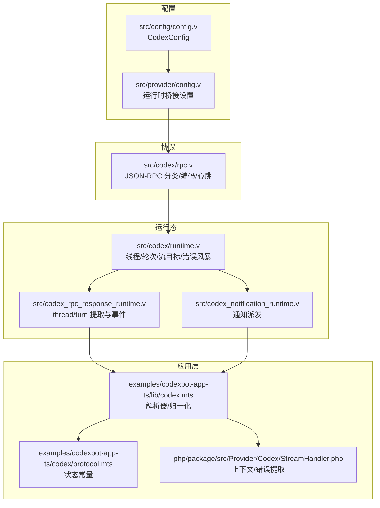
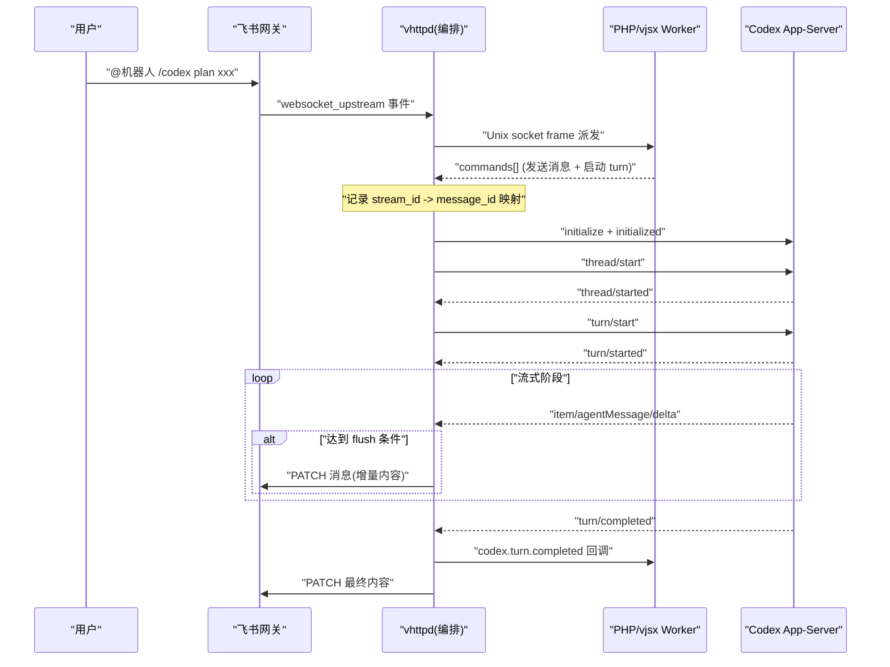
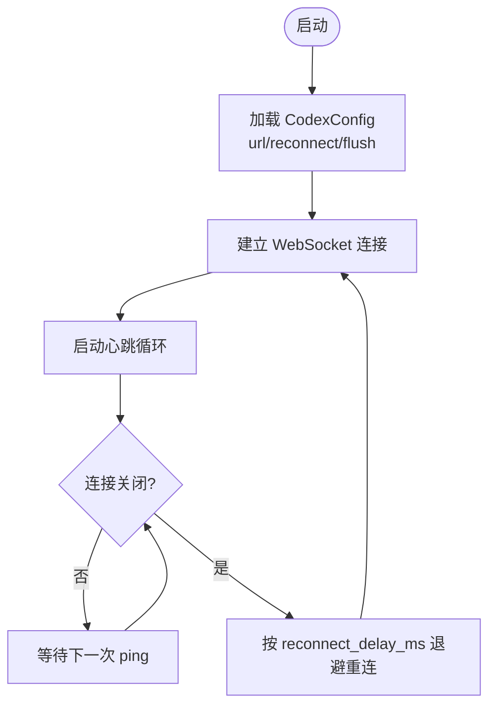
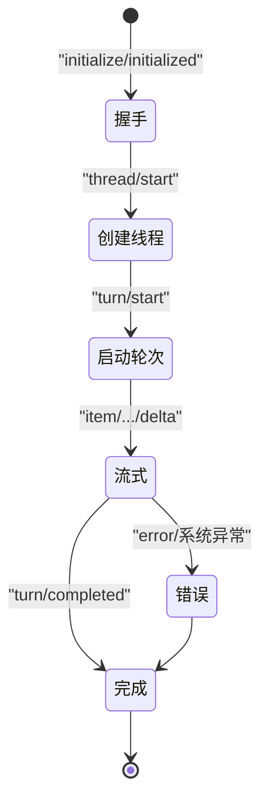
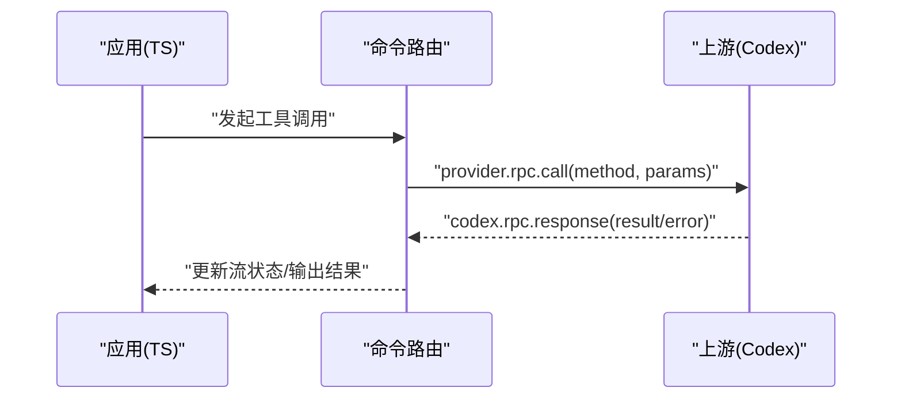
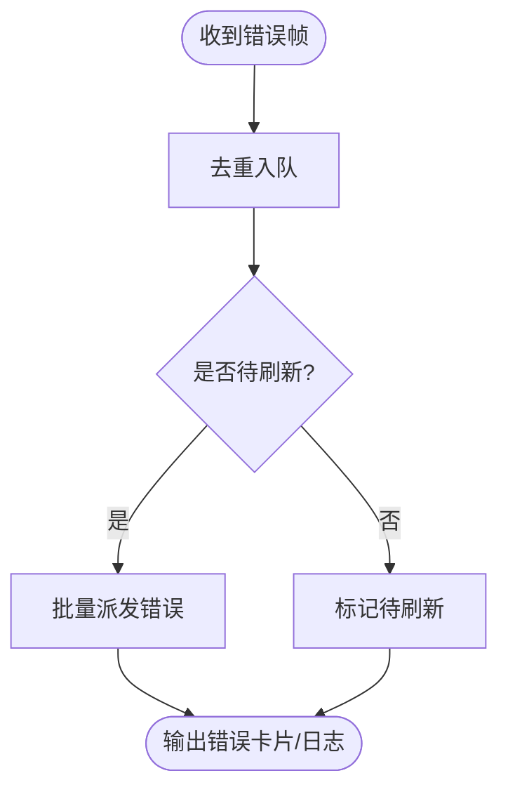
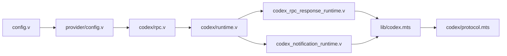

# Codex AI 服务集成

<cite>
**本文引用的文件**   
- [README.md](file://README.md)
- [codex_streaming_implementation_plan.md](file://docs/codex_streaming_implementation_plan.md)
- [codex_stream_message.md](file://docs/codex_stream_message.md)
- [config.v](file://src/config/config.v)
- [provider_config.v](file://src/provider/config.v)
- [rpc.v](file://src/codex/rpc.v)
- [runtime.v](file://src/codex/runtime.v)
- [codex_rpc_response_runtime.v](file://src/codex_rpc_response_runtime.v)
- [codex_notification_runtime.v](file://src/codex_notification_runtime.v)
- [codex.mts](file://examples/codexbot-app-ts/lib/codex.mts)
- [protocol.mts](file://examples/codexbot-app-ts/codex/protocol.mts)
- [StreamHandler.php](file://php/package/src/Provider/Codex/StreamHandler.php)
</cite>

## 目录
1. [简介](#简介)
2. [项目结构](#项目结构)
3. [核心组件](#核心组件)
4. [架构总览](#架构总览)
5. [详细组件分析](#详细组件分析)
6. [依赖关系分析](#依赖关系分析)
7. [性能与连接管理](#性能与连接管理)
8. [错误处理与重试策略](#错误处理与重试策略)
9. [配置示例与开发指南](#配置示例与开发指南)
10. [故障排查指南](#故障排查指南)
11. [结论](#结论)

## 简介
本文件面向在 vhttpd 中集成 Codex AI 服务的开发者与运维人员，系统性说明以下主题：
- 连接管理与认证机制（含 API 密钥、连接池、负载均衡）
- 流式对话处理（会话建立、消息流式传输、状态同步、断线重连）
- 工具调用机制（工具注册、参数校验、结果返回）
- 错误处理与重试策略（网络异常、API 限流、超时）
- 完整配置示例与开发指南（调试技巧、性能优化建议）

vhttpd 作为协议与执行宿主，提供 HTTP/WebSocket/流式能力，并通过“upstream”模式原生驱动 Codex App-Server 的 WebSocket JSON-RPC 流。Codex 侧采用轻量 JSON-RPC（省略 jsonrpc 字段），以 thread/turn/item 为基本语义单元进行长连接流式交互。

## 项目结构
围绕 Codex 集成的关键位置如下：
- 配置层：全局 TOML 中的 Codex 配置项与运行时桥接设置
- 协议层：JSON-RPC 分类、编码、心跳等基础能力
- 运行态：线程/轮次/流目标映射、错误风暴聚合、RPC 挂起追踪
- 事件分发：通知与响应进入内核调度到 PHP/vjsx 工作进程
- 应用层：TS 端解析器、协议常量、错误信息提取与渲染

**图表来源** 
- [config.v:216-227](file://src/config/config.v#L216-L227)
- [provider_config.v:157-189](file://src/provider/config.v#L157-L189)
- [rpc.v:1-335](file://src/codex/rpc.v#L1-L335)
- [runtime.v:1-188](file://src/codex/runtime.v#L1-L188)
- [codex_rpc_response_runtime.v:27-66](file://src/codex_rpc_response_runtime.v#L27-L66)
- [codex_notification_runtime.v:108-126](file://src/codex_notification_runtime.v#L108-L126)
- [codex.mts:1-741](file://examples/codexbot-app-ts/lib/codex.mts#L1-L741)
- [protocol.mts:1-124](file://examples/codexbot-app-ts/codex/protocol.mts#L1-L124)
- [StreamHandler.php:180-217](file://php/package/src/Provider/Codex/StreamHandler.php#L180-L217)

**章节来源**
- [README.md:84-126](file://README.md#L84-L126)

## 核心组件
- 配置模型
  - CodexConfig：包含 URL、模型、努力级别、沙箱、审批策略、重连延迟、刷新间隔等
  - ProviderRuntimeSettings：桥接设置（如 Feishu bridge）与数据库连接池等
- 协议与编码
  - JSON-RPC 分类（请求/通知/响应）、轻量字段提取、WebSocket 心跳
- 运行态
  - 线程/轮次/流目标绑定、活跃流跟踪、错误风暴聚合、读回退队列
- 事件分发
  - 将 Codex 通知与 RPC 响应派发到上层 worker（PHP/vjsx）
- 应用层
  - TS 解析器负责从不同字段路径抽取 threadId/turnId/delta/finalText 等
  - 协议常量用于状态规范化与判断

**章节来源**
- [config.v:216-227](file://src/config/config.v#L216-L227)
- [provider_config.v:157-189](file://src/provider/config.v#L157-L189)
- [rpc.v:80-132](file://src/codex/rpc.v#L80-L132)
- [runtime.v:1-188](file://src/codex/runtime.v#L1-L188)
- [codex.mts:673-741](file://examples/codexbot-app-ts/lib/codex.mts#L673-L741)
- [protocol.mts:1-124](file://examples/codexbot-app-ts/codex/protocol.mts#L1-L124)

## 架构总览
Codex 集成采用“混合模式”：PHP/vjsx 负责意图识别与业务编排，vhttpd 原生持有上游流并直接推送到下游（例如飞书）。典型流程：
- 初始化握手 → 创建 thread → 启动 turn → 持续 item delta 推送 → turn 完成回调
- 高频 delta 由 vhttpd 直接 PATCH 下游，避免经 PHP 转发，提升吞吐与时延

**图表来源** 
- [codex_streaming_implementation_plan.md:1-162](file://docs/codex_streaming_implementation_plan.md#L1-L162)

## 详细组件分析

### 连接管理与认证机制
- 连接地址与参数
  - CodexConfig.url 指定 WebSocket 地址；reconnect_delay_ms 控制重连退避；flush_interval_ms 控制流式刷新频率
  - model/effort/sandbox/approval_policy 决定任务行为与权限边界
- 认证
  - 当前仓库未实现基于 API Key 的鉴权；若上游需要，应在外部代理或网关层完成
- 连接池与负载均衡
  - 当前实现为单实例直连；如需多实例共享与负载均衡，可在上游部署多个 Codex 实例并由反向代理/负载均衡器统一入口
- 心跳保活
  - 内置周期性 ping 循环，维持长连接存活

**图表来源** 
- [config.v:216-227](file://src/config/config.v#L216-L227)
- [rpc.v:319-335](file://src/codex/rpc.v#L319-L335)

**章节来源**
- [config.v:216-227](file://src/config/config.v#L216-L227)
- [provider_config.v:157-189](file://src/provider/config.v#L157-L189)
- [rpc.v:319-335](file://src/codex/rpc.v#L319-L335)

### 流式对话处理
- 会话建立
  - initialize/initialized 握手后，thread/start 创建线程，turn/start 提交任务
- 消息流式传输
  - 收到 item/agentMessage/delta 时，vhttpd 累积 buffer，按 flush_interval_ms 触发 PATCH 推送
- 状态同步
  - 通过 thread/turn 生命周期事件与 activeFlags 维护状态机
- 断线重连
  - 使用 reconnect_delay_ms 指数退避；恢复后根据已捕获的 threadId 重建 turn/start

**图表来源** 
- [codex_streaming_implementation_plan.md:66-156](file://docs/codex_streaming_implementation_plan.md#L66-L156)

**章节来源**
- [codex_streaming_implementation_plan.md:1-162](file://docs/codex_streaming_implementation_plan.md#L1-L162)
- [codex_notification_runtime.v:108-126](file://src/codex_notification_runtime.v#L108-L126)
- [codex_rpc_response_runtime.v:27-66](file://src/codex_rpc_response_runtime.v#L27-L66)

### 工具调用机制
- 工具注册
  - 在 TS 应用层通过命令路由与 provider.rpc.call 发起工具调用；具体工具定义由 Codex 服务端暴露
- 参数验证
  - 在 TS 解析器中对 params/result 做宽松兼容与类型归一化，确保健壮性
- 结果返回
  - 工具执行结果通过 codex.rpc.response 返回，应用层将其写入流状态并更新下游消息

**图表来源** 
- [codex.mts:673-741](file://examples/codexbot-app-ts/lib/codex.mts#L673-L741)

**章节来源**
- [codex.mts:673-741](file://examples/codexbot-app-ts/lib/codex.mts#L673-L741)

### 错误处理与重试策略
- 错误风暴聚合
  - 针对短时间内重复错误进行去重与批量刷新，避免刷屏
- 错误分类
  - 支持额度耗尽、系统错误等场景识别，并生成友好提示
- 重试策略
  - 连接级：按 reconnect_delay_ms 退避重连
  - 任务级：缺失 threadId 时自动恢复并重新 turn/start

**图表来源** 
- [runtime.v:164-187](file://src/codex/runtime.v#L164-L187)
- [StreamHandler.php:192-217](file://php/package/src/Provider/Codex/StreamHandler.php#L192-L217)

**章节来源**
- [runtime.v:164-187](file://src/codex/runtime.v#L164-L187)
- [StreamHandler.php:192-217](file://php/package/src/Provider/Codex/StreamHandler.php#L192-L217)

## 依赖关系分析
- 配置依赖
  - CodexConfig 被 ProviderRuntimeSettings 消费，形成运行时桥接参数
- 协议依赖
  - rpc.v 提供 JSON-RPC 分类与心跳，供上层运行态与事件分发使用
- 运行态依赖
  - runtime.v 维护线程/轮次/流目标映射，配合响应与通知处理器完成状态同步
- 应用层依赖
  - TS 解析器依赖 protocol.mts 的状态常量，对多种字段路径做兼容解析

**图表来源** 
- [config.v:216-227](file://src/config/config.v#L216-L227)
- [provider_config.v:157-189](file://src/provider/config.v#L157-L189)
- [rpc.v:1-335](file://src/codex/rpc.v#L1-L335)
- [runtime.v:1-188](file://src/codex/runtime.v#L1-L188)
- [codex_rpc_response_runtime.v:27-66](file://src/codex_rpc_response_runtime.v#L27-L66)
- [codex_notification_runtime.v:108-126](file://src/codex_notification_runtime.v#L108-L126)
- [codex.mts:1-741](file://examples/codexbot-app-ts/lib/codex.mts#L1-L741)
- [protocol.mts:1-124](file://examples/codexbot-app-ts/codex/protocol.mts#L1-L124)

**章节来源**
- [config.v:216-227](file://src/config/config.v#L216-L227)
- [provider_config.v:157-189](file://src/provider/config.v#L157-L189)
- [rpc.v:1-335](file://src/codex/rpc.v#L1-L335)
- [runtime.v:1-188](file://src/codex/runtime.v#L1-L188)
- [codex.mts:1-741](file://examples/codexbot-app-ts/lib/codex.mts#L1-L741)
- [protocol.mts:1-124](file://examples/codexbot-app-ts/codex/protocol.mts#L1-L124)

## 性能与连接管理
- 流式刷新
  - flush_interval_ms 控制高频 delta 的合并与推送频率，降低下游频繁 PATCH 的开销
- 心跳保活
  - 固定周期 ping，避免中间设备断开空闲连接
- 错误风暴
  - 去重与批量刷新，减少 UI 抖动与日志噪声
- 连接池与负载均衡
  - 当前为单实例直连；生产环境建议在 Codex 前部署负载均衡器，结合多实例横向扩展
- 资源占用
  - 保持 PHP/vjsx 无状态，仅做意图识别与结果处理，高频路径在 vhttpd 层完成

[本节为通用指导，不直接分析具体文件]

## 错误处理与重试策略
- 网络异常
  - 连接中断后按 reconnect_delay_ms 退避重连；恢复后依据已捕获 threadId 重建 turn/start
- API 限流
  - 在 StreamHandler 中识别额度耗尽等错误，并生成友好提示
- 超时处理
  - 可通过上游代理或网关层配置超时；Codex 侧 turn 完成事件作为最终收敛点
- 错误风暴聚合
  - 同 stream 的错误去重与批量刷新，避免刷屏

**章节来源**
- [rpc.v:319-335](file://src/codex/rpc.v#L319-L335)
- [StreamHandler.php:192-217](file://php/package/src/Provider/Codex/StreamHandler.php#L192-L217)
- [runtime.v:164-187](file://src/codex/runtime.v#L164-L187)

## 配置示例与开发指南
- 最小可用配置要点
  - 设置 CodexConfig.url 指向本地或远端 Codex App-Server
  - 调整 reconnect_delay_ms 与 flush_interval_ms 平衡稳定性与实时性
  - 根据需要配置 approval_policy、sandbox、model、effort
- 环境变量与变量展开
  - TOML 支持 ${env.NAME} 与 ${section.key} 变量展开
- 多站点与多监听
  - 可使用 sites 与 listeners 组织多实例与多端口
- 调试技巧
  - 开启 debug 日志查看 JSON-RPC 摘要与错误风暴
  - 使用 admin 接口观察 upstream 活动与最近事件
- 性能优化建议
  - 合理设置 flush_interval_ms，避免过于频繁的 PATCH
  - 在高并发场景下，前置负载均衡与多实例部署

**章节来源**
- [config.v:216-227](file://src/config/config.v#L216-L227)
- [provider_config.v:157-189](file://src/provider/config.v#L157-L189)
- [README.md:437-573](file://README.md#L437-L573)

## 故障排查指南
- 常见问题定位
  - 确认 CodexConfig.url 可达且心跳正常
  - 检查 thread/turn 生命周期事件是否成对出现
  - 关注错误风暴聚合日志，定位重复错误根因
- 数据关联
  - 使用 stream_id 串联任务、流与下游消息 ID，便于跨层追踪
- 参考设计文档
  - 最小三表设计与 ID 规范有助于快速定位问题

**章节来源**
- [codex_stream_message.md:1-623](file://docs/codex_stream_message.md#L1-L623)
- [codex_notification_runtime.v:108-126](file://src/codex_notification_runtime.v#L108-L126)
- [codex_rpc_response_runtime.v:27-66](file://src/codex_rpc_response_runtime.v#L27-L66)

## 结论
本方案在 vhttpd 中以“原生流式 + 混合编排”的方式对接 Codex App-Server，实现了高吞吐、低时延的流式对话体验。通过清晰的配置模型、健壮的协议解析与运行态管理、以及完善的错误风暴聚合与重连机制，既保证了系统的稳定性，也为后续扩展（如多实例负载均衡、更多工具调用）提供了良好基础。