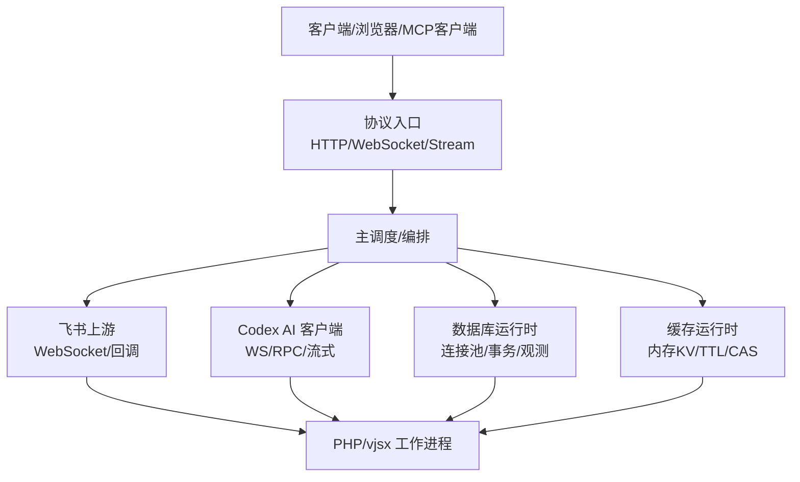
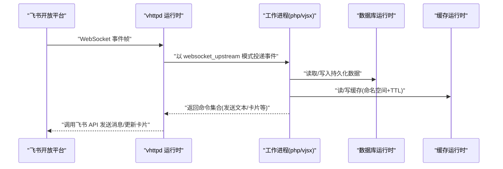
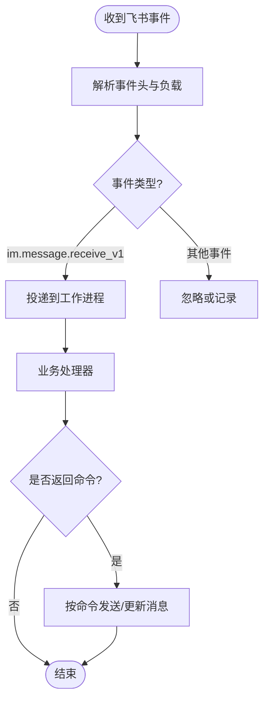
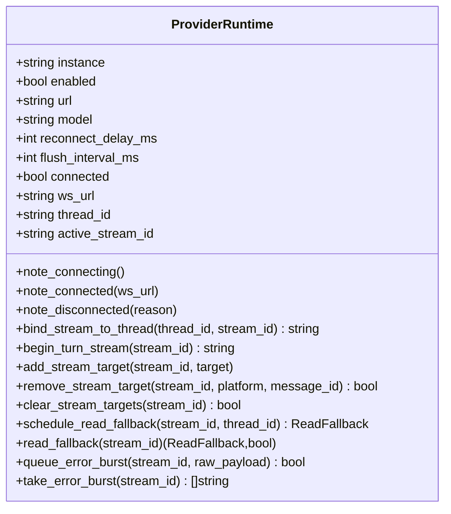
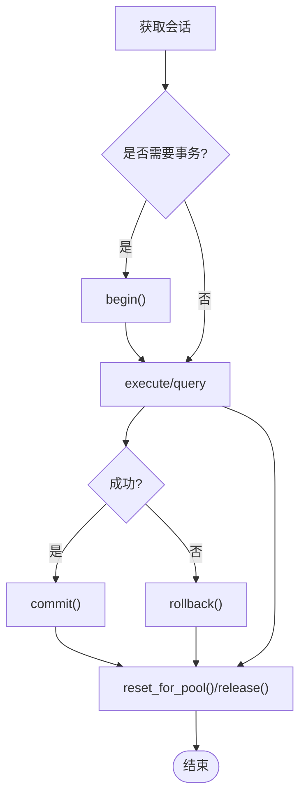
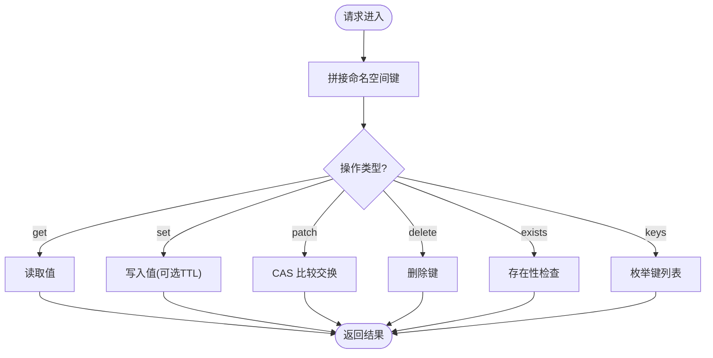
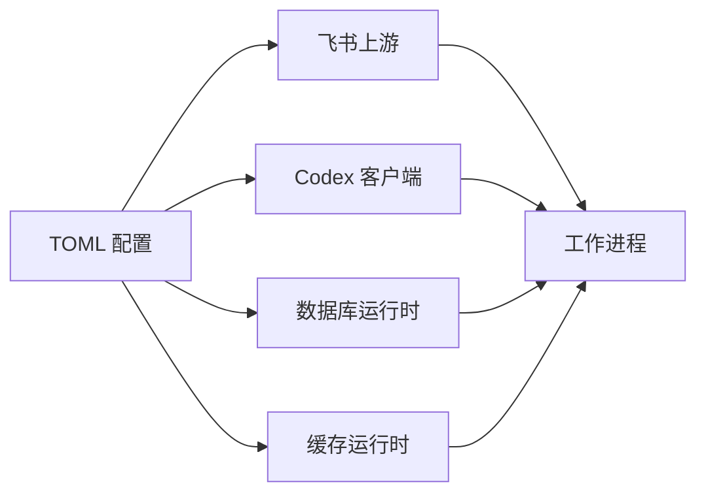

# 外部集成

<cite>
**本文引用的文件**   
- [README.md](file://README.md)
- [07-feishu-bot.md](file://articles/07-feishu-bot.md)
- [09-codexbot.md](file://articles/09-codexbot.md)
- [12-advanced-patterns.md](file://articles/12-advanced-patterns.md)
- [feishu-bot.toml](file://examples/config/feishu-bot.toml)
- [config.v](file://src/config/config.v)
- [codex/types.v](file://src/codex/types.v)
- [codex/runtime.v](file://src/codex/runtime.v)
- [dbx/runtime.v](file://src/dbx/runtime.v)
- [cachex/runtime.v](file://src/cachex/runtime.v)
</cite>

## 目录
1. [简介](#简介)
2. [项目结构](#项目结构)
3. [核心组件](#核心组件)
4. [架构总览](#架构总览)
5. [详细组件分析](#详细组件分析)
6. [依赖关系分析](#依赖关系分析)
7. [性能考虑](#性能考虑)
8. [故障排除指南](#故障排除指南)
9. [结论](#结论)
10. [附录](#附录)

## 简介
本指南聚焦 vhttpd 的外部集成能力，覆盖以下主题：
- 飞书机器人集成：应用配置、认证与长连接、事件订阅、消息收发、卡片交互、回调入口等
- Codex AI 服务集成：连接管理、流式对话处理、状态同步、错误重试与回退
- 数据库集成方案：连接池、查询执行、事务与会话、慢查询观测
- 缓存系统：内存缓存运行时、命名空间、TTL、CAS 操作与键枚举

文档提供每种集成的配置示例、API 参考要点与常见问题排查路径。

## 项目结构
vhttpd 将“协议接入 + 运行时编排 + 外部上游”解耦为可插拔模块。与外部集成相关的关键位置包括：
- 配置模型：全局与站点级 TOML 配置（含 feishu、codex、worker、admin 等）
- 上游提供者：飞书 WebSocket 长连接与 HTTP 回调桥接
- AI 客户端：Codex 的 WS 连接、RPC 与流式目标分发
- 数据面：数据库运行时（连接池/事务/观测）、缓存运行时（内存 KV）

图表来源
- [README.md:84-126](file://README.md#L84-L126)

章节来源
- [README.md:84-126](file://README.md#L84-L126)

## 核心组件
- 飞书上游提供者：负责与飞书开放平台建立长连接、自动重连、事件路由、HTTP 回调校验与转发、向工作进程投递事件并聚合命令下发
- Codex 客户端：维护 WS 连接、会话/线程绑定、流式目标映射、RPC 等待与错误风暴抑制
- 数据库运行时：提供 MySQL/PostgreSQL 连接池、参数化查询、事务边界、慢查询统计与最近查询快照
- 缓存运行时：基于内存的状态存储，支持命名空间、TTL、CAS 比较交换、键枚举与 ping

章节来源
- [07-feishu-bot.md:1-120](file://articles/07-feishu-bot.md#L1-L120)
- [codex/types.v:69-102](file://src/codex/types.v#L69-L102)
- [dbx/runtime.v:72-103](file://src/dbx/runtime.v#L72-L103)
- [cachex/runtime.v:24-37](file://src/cachex/runtime.v#L24-L37)

## 架构总览
vhttpd 作为协议与执行宿主，统一承载 HTTP/WebSocket/流式请求，并将业务逻辑委派给可插拔执行器（php-worker、vjsx）。对外部服务的集成通过“上游提供者”和“运行时子系统”完成，既保证低耦合，又提供一致的观测与管理面。

图表来源
- [README.md:674-730](file://README.md#L674-L730)
- [07-feishu-bot.md:40-110](file://articles/07-feishu-bot.md#L40-L110)

## 详细组件分析

### 飞书机器人集成
- 应用配置
  - 启用与基础 URL、重连延迟、token 刷新提前量、最近事件限制等
  - 多实例 app_id/app_secret 配置（例如 main/openclaw）
  - 验证 token 与加密 key（用于回调校验）
- 认证机制
  - 使用 app_id/app_secret 获取访问令牌，内部自动刷新
  - 回调入口支持 url_verification 挑战响应与 token 校验
- 事件订阅与路由
  - 长连接接收 im.message.receive_v1 等事件
  - 非挑战回调经 HTTP 回调入口转发至工作进程
- 消息收发与卡片交互
  - 工作进程通过命令总线返回 send/update 指令
  - 支持文本、图片、卡片等多种消息类型
- 监控与调试
  - Admin 面板暴露上游状态、近期事件、活动日志等

配置示例
- 参考示例配置文件中的 [feishu] 与 [feishu.main] 段

API 参考要点
- 回调入口：POST /callbacks/feishu 与 POST /callbacks/feishu/:app
- 网关发送：POST /gateway/upstreams/websocket/send、POST /gateway/feishu/messages
- 管理面：GET /admin/runtime/upstreams/websocket、GET /admin/runtime/feishu/chats

图表来源
- [07-feishu-bot.md:40-110](file://articles/07-feishu-bot.md#L40-L110)
- [README.md:698-730](file://README.md#L698-L730)

章节来源
- [feishu-bot.toml:28-40](file://examples/config/feishu-bot.toml#L28-L40)
- [07-feishu-bot.md:50-110](file://articles/07-feishu-bot.md#L50-L110)
- [README.md:674-730](file://README.md#L674-L730)

### Codex AI 服务集成
- 连接管理
  - 配置 URL、模型、努力等级、沙箱策略、重连间隔与刷新间隔
  - 连接成功/失败计数、最近连接时间戳、错误信息
- 流式对话处理
  - 维护当前线程与活跃流 ID 的绑定
  - 将流输出定向到多个目标（平台+消息ID）
- 状态同步
  - 捕获/确保 thread_id，修复线程与流的绑定
  - 记录收到的帧数与最后帧时间
- 错误重试与回退
  - 连接断开后重置初始化状态，清理读回退队列
  - 错误风暴抑制与批量刷新
  - 读回退机制：当无法直接读取时排队回退任务

配置示例
- 参考全局配置中 [codex] 段（url、model、effort、reconnect_delay_ms、flush_interval_ms 等）

图表来源
- [codex/types.v:69-102](file://src/codex/types.v#L69-L102)
- [codex/runtime.v:7-188](file://src/codex/runtime.v#L7-L188)

章节来源
- [config.v:216-227](file://src/config/config.v#L216-L227)
- [codex/types.v:69-102](file://src/codex/types.v#L69-L102)
- [codex/runtime.v:7-188](file://src/codex/runtime.v#L7-L188)

### 数据库集成方案
- 连接池配置
  - 支持 MySQL 与 PostgreSQL，驱动名归一化
  - 池大小、空闲心跳检测、初始化 SQL
- 查询优化
  - 参数化查询与预处理语句
  - 慢查询阈值与最近查询快照
- 事务处理
  - begin/commit/rollback，事务会话跟踪与释放
  - 从池中分离/安装池句柄，避免并发冲突
- 观测与诊断
  - 总查询/执行次数、失败次数、慢查询计数、最近 N 条观测

图表来源
- [dbx/runtime.v:638-706](file://src/dbx/runtime.v#L638-L706)
- [dbx/runtime.v:801-902](file://src/dbx/runtime.v#L801-L902)

章节来源
- [dbx/runtime.v:447-539](file://src/dbx/runtime.v#L447-L539)
- [dbx/runtime.v:904-1008](file://src/dbx/runtime.v#L904-L1008)
- [dbx/runtime.v:1115-1192](file://src/dbx/runtime.v#L1115-L1192)

### 缓存系统集成
- 基本能力
  - 命名空间隔离、键值存取、TTL 过期
  - CAS 比较交换（set/delete），键枚举
- 运行时特性
  - 基于内存状态存储，单进程内并发安全
  - 帧编解码与 Unix Socket 通信
- 典型用法
  - 在 PHP/vjsx 应用中通过命名空间区分不同业务域
  - 对热点数据设置合理 TTL，减少后端压力

图表来源
- [cachex/runtime.v:194-276](file://src/cachex/runtime.v#L194-L276)

章节来源
- [cachex/runtime.v:24-37](file://src/cachex/runtime.v#L24-L37)
- [cachex/runtime.v:194-276](file://src/cachex/runtime.v#L194-L276)

## 依赖关系分析
- 配置层
  - 全局与站点级 TOML 配置决定各运行时的开关与参数
- 运行时层
  - 飞书上游、Codex 客户端、数据库与缓存运行时均受配置驱动
- 工作进程层
  - php-worker 或 vjsx 执行器根据事件/请求调用相应运行时能力

图表来源
- [README.md:437-517](file://README.md#L437-L517)
- [config.v:216-253](file://src/config/config.v#L216-L253)

章节来源
- [README.md:437-517](file://README.md#L437-L517)
- [config.v:216-253](file://src/config/config.v#L216-L253)

## 性能考虑
- 飞书长连接
  - 合理设置重连延迟与 token 刷新提前量，避免频繁握手
  - 利用最近事件限制控制内存占用
- Codex 流式
  - 调整 flush_interval_ms 平衡实时性与吞吐
  - 使用错误风暴抑制降低抖动影响
- 数据库
  - 依据负载调优 pool_size 与 idle_ping_ms
  - 关注慢查询阈值与最近查询快照，定位瓶颈
- 缓存
  - 合理使用命名空间与 TTL，避免键膨胀
  - 使用 CAS 实现无锁竞争下的原子更新

[本节为通用指导，不直接分析具体文件]

## 故障排除指南
- 飞书
  - 确认回调入口与验证 token 配置一致
  - 检查 admin 面板的上游状态与近期事件
  - 观察事件日志文件，核对事件类型与 payload
- Codex
  - 检查 WS URL 可达性与鉴权
  - 查看连接尝试/成功计数与最近错误
  - 若出现读回退堆积，评估下游处理能力
- 数据库
  - 确认驱动编译与连接参数正确
  - 检查连接池是否 ready，事务会话是否泄漏
  - 关注 last_error 与 failed_queries 指标
- 缓存
  - 确认 socket 路径可用且权限正确
  - 检查命名空间与键是否符合预期
  - 观察 total_ops 与 failed_ops 比例

章节来源
- [07-feishu-bot.md:692-708](file://articles/07-feishu-bot.md#L692-L708)
- [09-codexbot.md:792-828](file://articles/09-codexbot.md#L792-L828)
- [dbx/runtime.v:931-965](file://src/dbx/runtime.v#L931-L965)
- [cachex/runtime.v:79-96](file://src/cachex/runtime.v#L79-L96)

## 结论
vhttpd 通过统一的运行时抽象，将飞书、Codex、数据库与缓存等外部能力有机整合。借助配置驱动的模块化设计、完善的观测面与健壮的重试/回退机制，开发者可以高效构建企业级智能应用与 AI 工作流。

[本节为总结性内容，不直接分析具体文件]

## 附录
- 配置示例
  - 飞书：参见示例配置文件中的 [feishu] 与 [feishu.main] 段
  - Codex：参见全局配置中的 [codex] 段
  - 数据库与缓存：参见运行时定义的结构体字段与默认值
- API 参考
  - 飞书回调与发送端点见 README 中的路径说明
  - 数据库与缓存运行时通过 Unix Socket 帧协议交互，详见各自 runtime 文件

章节来源
- [feishu-bot.toml:28-40](file://examples/config/feishu-bot.toml#L28-L40)
- [config.v:216-253](file://src/config/config.v#L216-L253)
- [README.md:674-730](file://README.md#L674-L730)