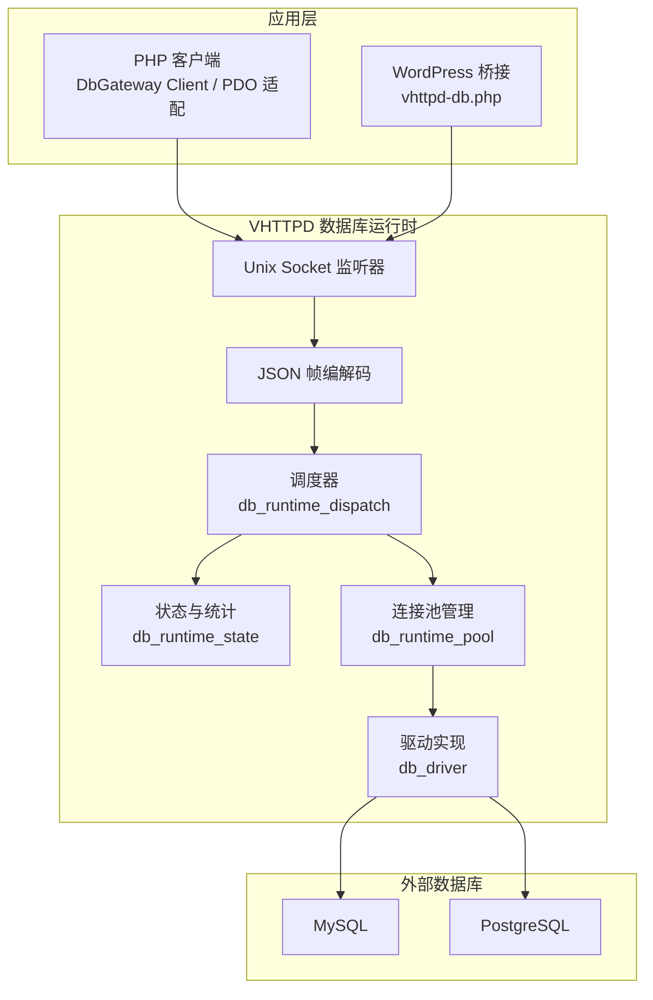
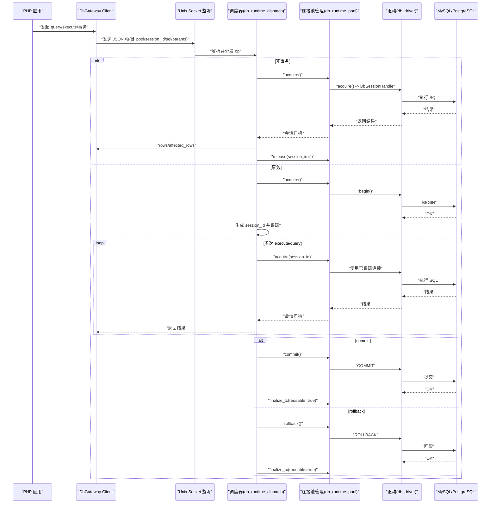
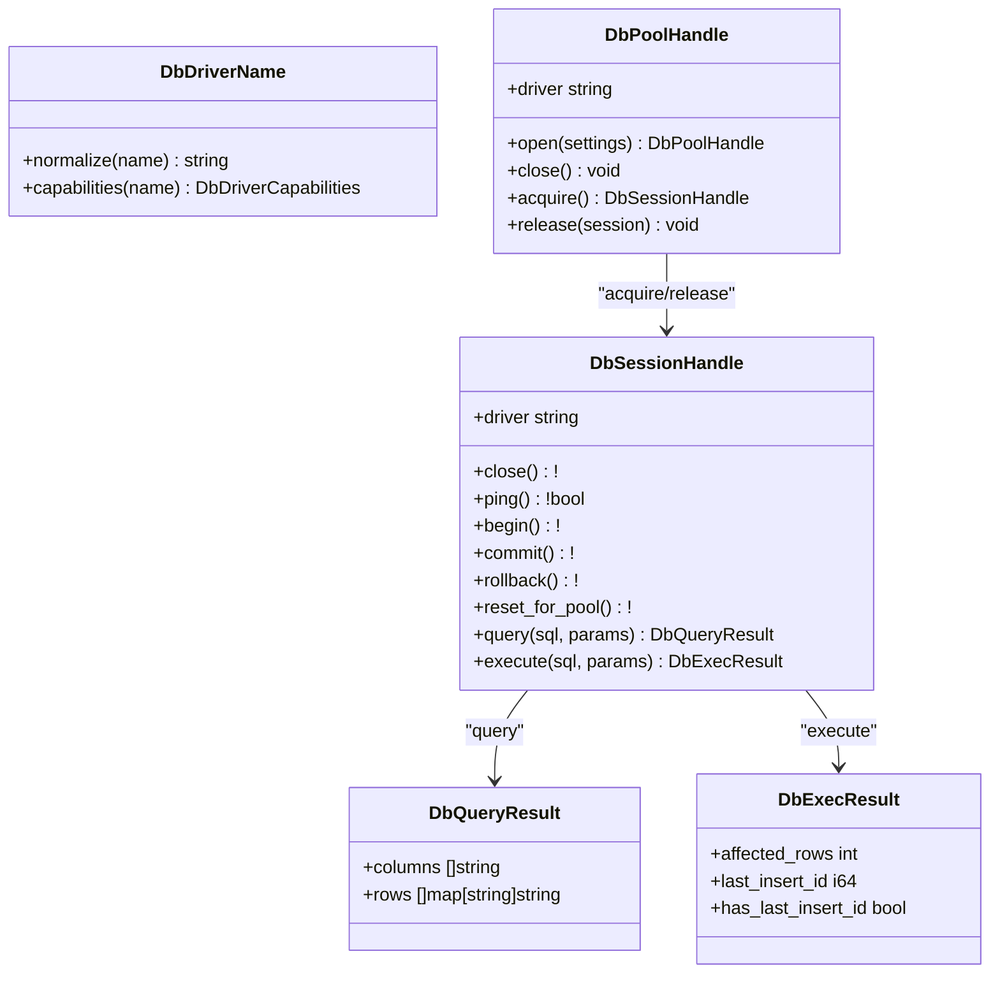
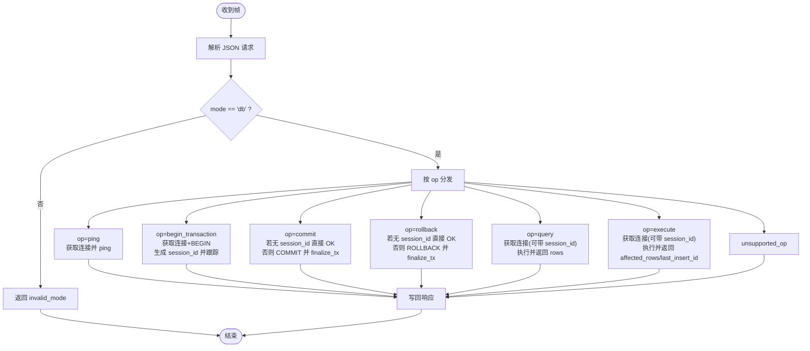
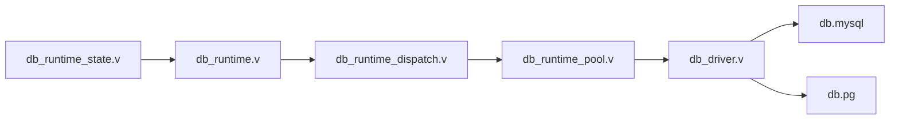

# 数据库集成

<cite>
**本文引用的文件**   
- [db_driver.v](file://dbsrc/db_driver.v)
- [db_runtime.v](file://dbsrc/db_runtime.v)
- [db_runtime_pool.v](file://src/db_runtime_pool.v)
- [db_runtime_state.v](file://src/db_runtime_state.v)
- [db_runtime_dispatch.v](file://src/db_runtime_dispatch.v)
- [vhttpd.example.toml](file://config/vhttpd.example.toml)
- [db-upstream.toml](file://examples/config/db-upstream.toml)
- [db-upstream-pg.toml](file://examples/config/db-upstream-pg.toml)
- [README.md（PHP 包）](file://php/package/README.md)
- [vhttpd-db.php](file://php/package/wordpress/v-profiler/vhttpd-db.php)
- [CONFIGURATION_MODEL_V2.md](file://docs/CONFIGURATION_MODEL_V2.md)
</cite>

## 目录
1. [简介](#简介)
2. [项目结构](#项目结构)
3. [核心组件](#核心组件)
4. [架构总览](#架构总览)
5. [详细组件分析](#详细组件分析)
6. [依赖关系分析](#依赖关系分析)
7. [性能与调优](#性能与调优)
8. [故障排除指南](#故障排除指南)
9. [结论](#结论)
10. [附录：配置与示例](#附录配置与示例)

## 简介
本文件系统性说明 VHTTPD 的数据库集成能力，重点覆盖连接池配置与管理、驱动支持、查询执行与优化、事务管理、健康检查、缓存策略与一致性保证，并提供 PHP 与原生 V 语言的访问示例。同时给出连接池调优、性能监控与故障排除等运维建议。

## 项目结构
VHTTPD 的数据库子系统由“运行时服务 + 驱动抽象 + 调度与状态”三部分构成：
- 运行时服务：监听 Unix Socket，接收来自 PHP 或上游的 JSON 帧请求，分派到具体操作。
- 驱动抽象：对 MySQL/PostgreSQL 进行统一封装，提供连接池、会话、事务、参数化查询等能力。
- 调度与状态：负责连接获取/释放、事务会话跟踪、错误计数、快照导出等。

图表来源
- [db_runtime.v:643-704](file://dbsrc/db_runtime.v#L643-L704)
- [db_runtime_dispatch.v:10-201](file://src/db_runtime_dispatch.v#L10-L201)
- [db_runtime_pool.v:5-143](file://src/db_runtime_pool.v#L5-L143)
- [db_driver.v:1-132](file://dbsrc/db_driver.v#L1-L132)

章节来源
- [db_runtime.v:1-108](file://dbsrc/db_runtime.v#L1-L108)
- [db_runtime_dispatch.v:1-212](file://src/db_runtime_dispatch.v#L1-L212)
- [db_runtime_pool.v:1-155](file://src/db_runtime_pool.v#L1-L155)
- [db_driver.v:1-132](file://dbsrc/db_driver.v#L1-L132)

## 核心组件
- 驱动抽象与连接池
  - 统一接口：DbPoolHandle/DbSessionHandle，暴露 open/acquire/release/ping/begin/commit/rollback/query/execute 等方法。
  - 驱动支持：MySQL、PostgreSQL（别名 pg/pg/postgres/postgresql 归一化为 pgsql）。
  - 能力声明：pool/transactions/parameters/prepared/savepoints 等特性按驱动返回。
- 运行时服务
  - Unix Socket 监听，4 字节长度前缀 + JSON 体协议。
  - 操作集：ping、begin_transaction、commit、rollback、query、execute。
  - 事务会话：以 session_id 绑定连接，提交/回滚后复用或回收。
- 调度与状态
  - 连接获取/释放、失败重试、观察指标记录、活跃事务计数、启动/停止标记。
  - 快照导出：包含 driver/host/port/database/pool_size/pool_ready/started_at_unix/total_queries/failed_queries 等。

章节来源
- [db_driver.v:6-87](file://dbsrc/db_driver.v#L6-L87)
- [db_driver.v:89-132](file://dbsrc/db_driver.v#L89-L132)
- [db_runtime.v:86-108](file://dbsrc/db_runtime.v#L86-L108)
- [db_runtime.v:397-609](file://dbsrc/db_runtime.v#L397-L609)
- [db_runtime_state.v:10-94](file://src/db_runtime_state.v#L10-L94)

## 架构总览
下图展示从 PHP 客户端到数据库驱动的完整调用链，包括连接池、事务与会话复用。

图表来源
- [db_runtime.v:643-704](file://dbsrc/db_runtime.v#L643-L704)
- [db_runtime_dispatch.v:10-201](file://src/db_runtime_dispatch.v#L10-L201)
- [db_runtime_pool.v:58-123](file://src/db_runtime_pool.v#L58-L123)
- [db_driver.v:146-266](file://dbsrc/db_driver.v#L146-L266)

## 详细组件分析

### 驱动与连接池（MySQL/PostgreSQL）
- 驱动名称归一化：pg/pg/postgres/postgresql → pgsql；mysql → mysql；空值默认 mysql。
- 连接池打开：根据 driver 选择对应后端，设置 host/port/database/username/password/pool_size。
- 会话生命周期：acquire/release/close/ping/begin/commit/rollback/reset_for_pool。
- 查询与执行：
  - 无参路径直接执行，有参路径走预处理语句（MySQL 通过 prepare/bind/execute；PostgreSQL 通过 exec_param_many_result）。
  - 结果统一为列名映射的行集合，兼容两库差异。

图表来源
- [db_driver.v:6-87](file://dbsrc/db_driver.v#L6-L87)
- [db_driver.v:89-132](file://dbsrc/db_driver.v#L89-L132)
- [db_driver.v:146-266](file://dbsrc/db_driver.v#L146-L266)
- [db_driver.v:329-421](file://dbsrc/db_driver.v#L329-L421)

章节来源
- [db_driver.v:44-87](file://dbsrc/db_driver.v#L44-L87)
- [db_driver.v:89-132](file://dbsrc/db_driver.v#L89-L132)
- [db_driver.v:146-266](file://dbsrc/db_driver.v#L146-L266)
- [db_driver.v:329-421](file://dbsrc/db_driver.v#L329-L421)

### 运行时服务与协议
- 协议格式：4 字节长度前缀 + JSON 体。
- 请求字段：version/mode/op/pool/session_id/sql/params/timeout_ms。
- 响应字段：ok/error/driver/pong/session_id/rows/affected_rows/last_insert_id。
- 健康检查：op=ping 会尝试从池中取连接并 ping，失败则记录错误。

图表来源
- [db_runtime.v:611-658](file://dbsrc/db_runtime.v#L611-L658)
- [db_runtime.v:397-609](file://dbsrc/db_runtime.v#L397-L609)

章节来源
- [db_runtime.v:611-658](file://dbsrc/db_runtime.v#L611-L658)
- [db_runtime.v:397-609](file://dbsrc/db_runtime.v#L397-L609)

### 调度与状态管理
- 连接获取：优先复用事务会话连接；否则从池中 acquire。
- 连接释放：非事务连接立即 release；事务连接在 finalize_tx 中根据 reusable 决定是否归还池。
- 失败处理：连接丢失时触发 discard_conn 并尝试重建单连接探测，再决定是否替换池。
- 统计与快照：累计 total_queries/total_executes/failed_queries，active_transactions 计数，导出 ready/capabilities 等。

章节来源
- [db_runtime_pool.v:5-143](file://src/db_runtime_pool.v#L5-L143)
- [db_runtime_state.v:10-94](file://src/db_runtime_state.v#L10-L94)
- [db_runtime_dispatch.v:10-201](file://src/db_runtime_dispatch.v#L10-L201)

### 健康检查与可用性
- 进程级就绪：db_runtime_mark_started/mark_stopped 控制 started 标志。
- 连接级就绪：db_runtime_ensure_pool 确保池可用；ping 操作验证底层连通性。
- 快照导出：包含 enabled/compiled/socket/driver/host/port/database/pool_size/pool_ready/started_at_unix/ready/capabilities 等。

章节来源
- [db_runtime.v:206-231](file://dbsrc/db_runtime.v#L206-L231)
- [db_runtime.v:233-267](file://dbsrc/db_runtime.v#L233-L267)
- [db_runtime.v:110-157](file://dbsrc/db_runtime.v#L110-L157)

## 依赖关系分析
- 运行时服务依赖调度器，调度器依赖连接池管理，连接池管理依赖驱动抽象。
- 驱动抽象依赖 db.mysql 与 db.pg 两个底层库。
- 状态模块对外暴露 snapshot_json 与各项计数器方法，供上层观测。

图表来源
- [db_runtime.v:1-108](file://dbsrc/db_runtime.v#L1-L108)
- [db_runtime_dispatch.v:1-212](file://src/db_runtime_dispatch.v#L1-L212)
- [db_runtime_pool.v:1-155](file://src/db_runtime_pool.v#L1-L155)
- [db_driver.v:1-132](file://dbsrc/db_driver.v#L1-L132)
- [db_runtime_state.v:1-105](file://src/db_runtime_state.v#L1-L105)

章节来源
- [db_runtime.v:1-108](file://dbsrc/db_runtime.v#L1-L108)
- [db_runtime_dispatch.v:1-212](file://src/db_runtime_dispatch.v#L1-L212)
- [db_runtime_pool.v:1-155](file://src/db_runtime_pool.v#L1-L155)
- [db_driver.v:1-132](file://dbsrc/db_driver.v#L1-L132)
- [db_runtime_state.v:1-105](file://src/db_runtime_state.v#L1-L105)

## 性能与调优
- 连接数控制
  - 通过 pool_size 控制最大并发连接数，避免数据库过载。
  - 对于高并发场景，适当增大 pool_size 并结合数据库侧 max_connections 限制。
- 连接复用
  - 非事务连接每次请求结束后立即释放回池，减少握手开销。
  - 事务连接在提交/回滚后可复用，降低频繁创建连接的代价。
- 健康检查
  - 定期 ping 或基于 idle_ping_ms 机制保持连接活性，避免冷连接失效。
- 查询优化
  - 使用参数化查询（prepared statements），避免 SQL 注入并提升执行计划重用。
  - 批量操作可通过多次 execute 组合业务逻辑，注意事务边界与锁竞争。
- 监控指标
  - 关注 total_queries/total_executes/failed_queries/active_transactions 等指标，结合事件日志定位瓶颈。
- 超时与重试
  - 合理设置 timeout_ms，避免长尾请求阻塞；连接丢失自动重试一次，提高鲁棒性。

[本节为通用指导，不直接分析具体文件]

## 故障排除指南
- 常见问题
  - 无法连接：检查 socket 路径、driver/host/port/database/username/password 配置是否正确。
  - 连接池耗尽：增大 pool_size 或优化慢查询，避免长时间持有连接。
  - 事务泄漏：确保每个 begin 都有对应的 commit/rollback，避免 session_id 未释放。
  - 连接断开：启用 ping 或 idle_ping_ms，必要时调整网络超时。
- 诊断步骤
  - 查看运行时快照：enabled/pool_ready/started/last_error 等字段。
  - 观察事件日志：db.started/db.error 等事件，定位异常时间点。
  - 检查活跃事务：active_transactions 是否持续增长。
- 恢复策略
  - 重启数据库运行时服务，清理残留会话。
  - 动态替换损坏的连接池，确保新连接可用后再切换。

章节来源
- [db_runtime.v:110-157](file://dbsrc/db_runtime.v#L110-L157)
- [db_runtime.v:643-704](file://dbsrc/db_runtime.v#L643-L704)
- [db_runtime_pool.v:75-103](file://src/db_runtime_pool.v#L75-L103)

## 结论
VHTTPD 的数据库集成通过统一的驱动抽象与连接池管理，提供了跨 MySQL/PostgreSQL 的一致 API，支持参数化查询、事务与会话复用，并通过 Unix Socket + JSON 帧协议与 PHP 应用解耦。配合健康检查、监控指标与故障恢复策略，可在生产环境获得稳定高效的数据库访问能力。

[本节为总结，不直接分析具体文件]

## 附录：配置与示例

### 支持的数据库类型与驱动
- MySQL：driver=mysql，端口默认 3306。
- PostgreSQL：driver=pgsql（也接受 pg/postgres/postgresql 别名），端口默认 5432。

章节来源
- [db_driver.v:44-87](file://dbsrc/db_driver.v#L44-L87)
- [db_driver.v:89-132](file://dbsrc/db_driver.v#L89-L132)

### 连接池配置（V1/V2 示例）
- V1 示例（MySQL）
  - [db-upstream.toml](file://examples/config/db-upstream.toml)
- V1 示例（PostgreSQL）
  - [db-upstream-pg.toml](file://examples/config/db-upstream-pg.toml)
- V2 资源模型（推荐）
  - [CONFIGURATION_MODEL_V2.md](file://docs/CONFIGURATION_MODEL_V2.md)

章节来源
- [db-upstream.toml:15-27](file://examples/config/db-upstream.toml#L15-L27)
- [db-upstream-pg.toml:15-27](file://examples/config/db-upstream-pg.toml#L15-L27)
- [CONFIGURATION_MODEL_V2.md:349-374](file://docs/CONFIGURATION_MODEL_V2.md#L349-L374)

### PHP 访问示例
- DbGateway Client 基本用法（query/execute/事务）
  - [README.md（PHP 包）](file://php/package/README.md)
- PDO 风格适配
  - [README.md（PHP 包）](file://php/package/README.md)
- WordPress 桥接（自动注入 Wpdb）
  - [vhttpd-db.php](file://php/package/wordpress/v-profiler/vhttpd-db.php)

章节来源
- [README.md（PHP 包）:507-568](file://php/package/README.md#L507-L568)
- [vhttpd-db.php:42-92](file://php/package/wordpress/v-profiler/vhttpd-db.php#L42-L92)

### 原生 V 语言访问示例
- 通过驱动抽象直接构建连接池与会话，执行 query/execute 与事务。
  - [db_driver.v](file://dbsrc/db_driver.v)
- 通过运行时服务与调度器完成请求分发与状态统计。
  - [db_runtime.v](file://dbsrc/db_runtime.v)
  - [db_runtime_dispatch.v](file://src/db_runtime_dispatch.v)

章节来源
- [db_driver.v:89-132](file://dbsrc/db_driver.v#L89-L132)
- [db_runtime.v:397-609](file://dbsrc/db_runtime.v#L397-L609)
- [db_runtime_dispatch.v:10-201](file://src/db_runtime_dispatch.v#L10-L201)

### 缓存策略与数据一致性
- 缓存与数据库分离：缓存用于读多写少数据的加速，数据库保证强一致。
- 一致性建议：
  - 写路径先更新数据库，再失效相关缓存键。
  - 读路径允许短暂不一致时采用版本号或时间戳校验。
  - 关键业务尽量绕过缓存，直接读数据库。
- 运行时缓存（可选）：通过同一 JSON 帧协议访问内存缓存，适合本地对象缓存与短 TTL 场景。

[本节为通用指导，不直接分析具体文件]