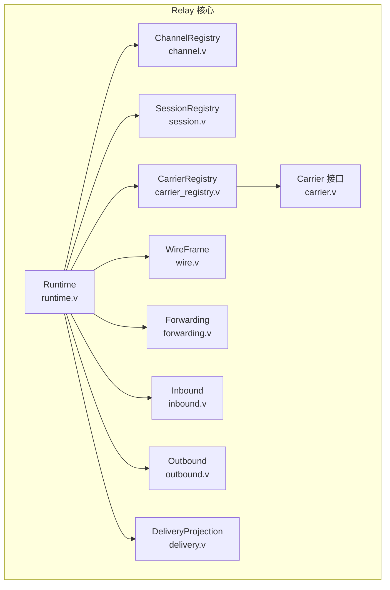
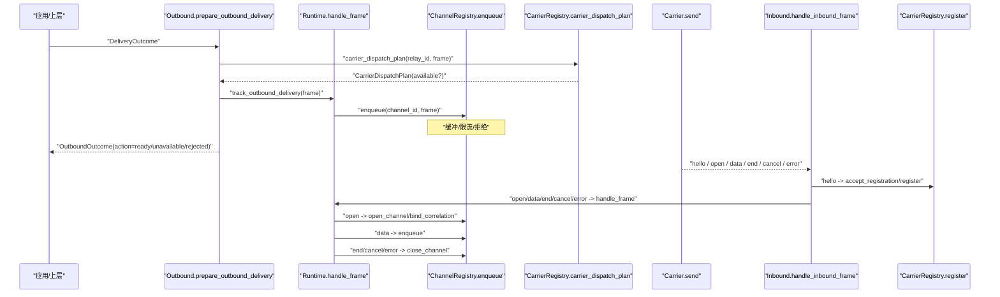
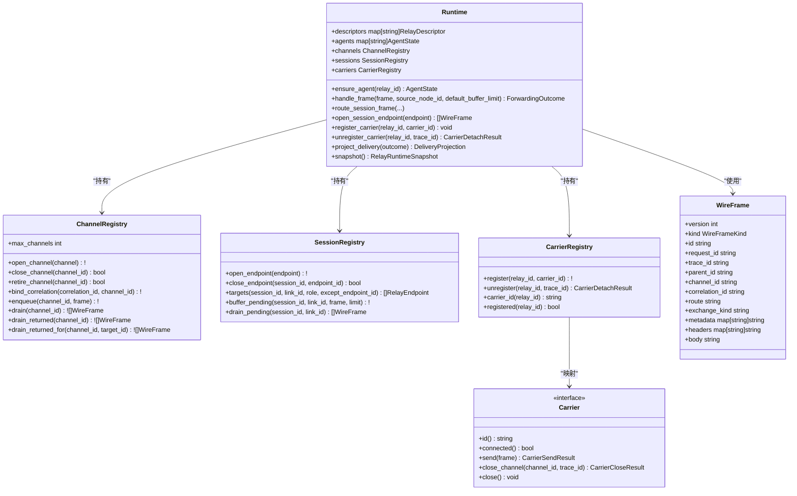
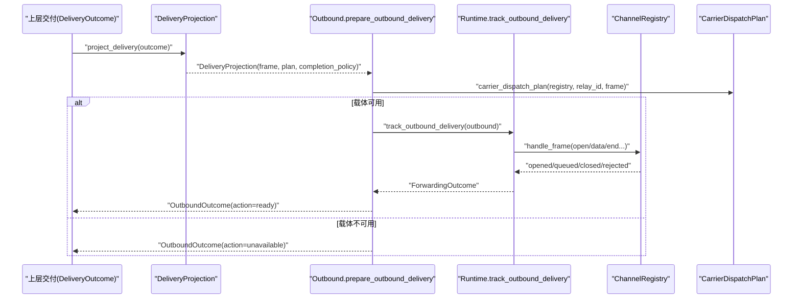
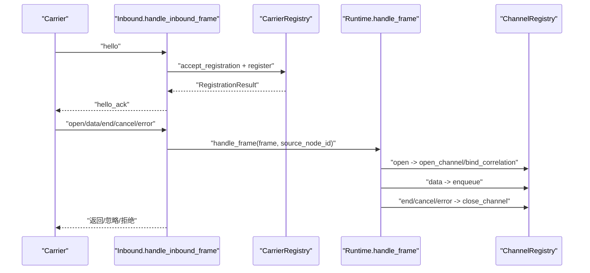
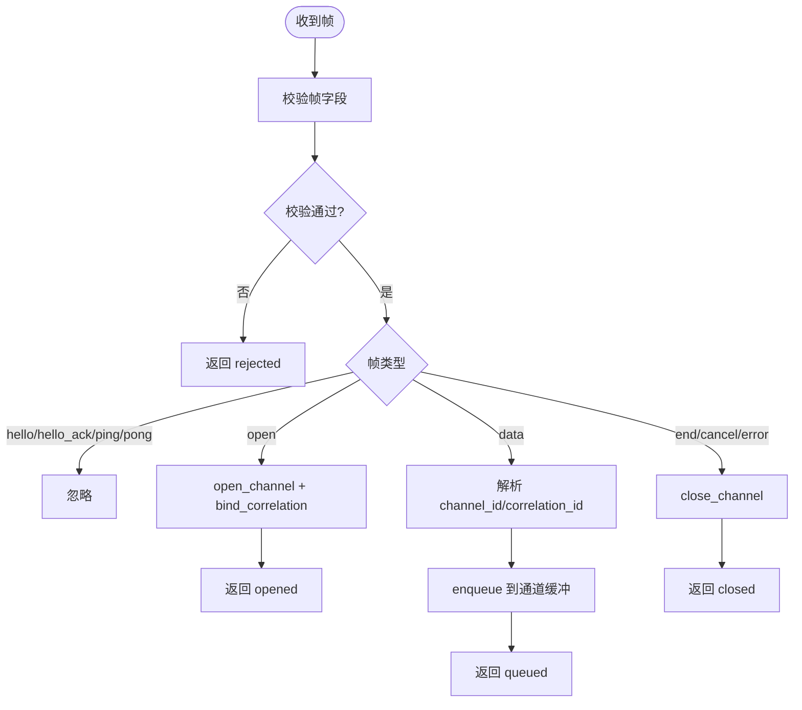
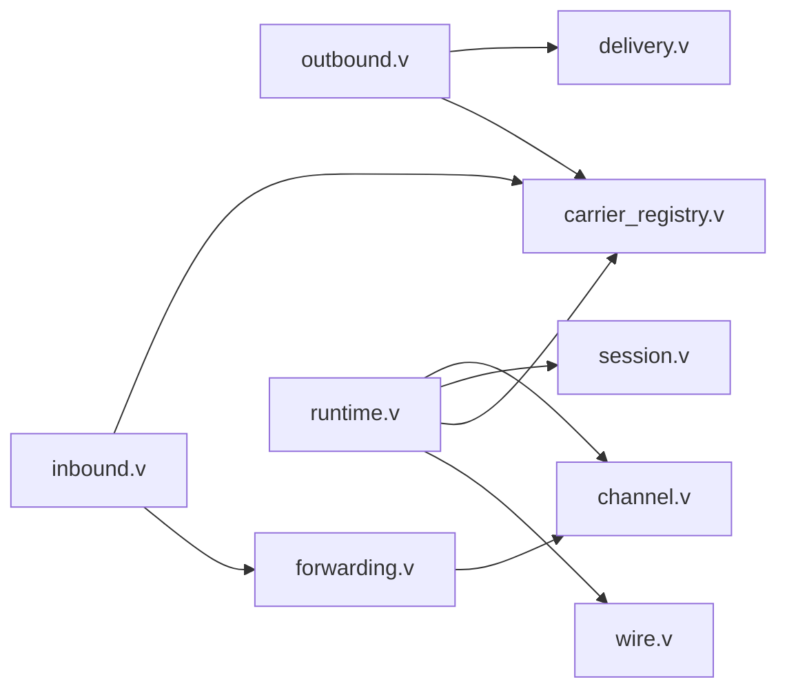

# 消息队列集成

<cite>
**本文引用的文件**   
- [README.md](file://README.md)
- [src/relay/runtime.v](file://src/relay/runtime.v)
- [src/relay/channel.v](file://src/relay/channel.v)
- [src/relay/carrier.v](file://src/relay/carrier.v)
- [src/relay/carrier_registry.v](file://src/relay/carrier_registry.v)
- [src/relay/delivery.v](file://src/relay/delivery.v)
- [src/relay/outbound.v](file://src/relay/outbound.v)
- [src/relay/inbound.v](file://src/relay/inbound.v)
- [src/relay/wire.v](file://src/relay/wire.v)
- [src/relay/session.v](file://src/relay/session.v)
- [src/relay/forwarding.v](file://src/relay/forwarding.v)
</cite>

## 目录
1. [简介](#简介)
2. [项目结构](#项目结构)
3. [核心组件](#核心组件)
4. [架构总览](#架构总览)
5. [详细组件分析](#详细组件分析)
6. [依赖关系分析](#依赖关系分析)
7. [性能与可靠性](#性能与可靠性)
8. [分布式与扩展](#分布式与扩展)
9. [配置与使用指南](#配置与使用指南)
10. [示例与最佳实践](#示例与最佳实践)
11. [故障排查](#故障排查)
12. [结论](#结论)

## 简介
本文件面向需要在 VHTTPD 中实现异步消息处理的开发者，系统性阐述基于 relay 子系统的“消息通道”模型：以 channel 为基本单元、以 carrier 为外部载体、以 session 为会话路由的轻量级消息总线。该子系统提供：
- 生产者（Outbound）将交付结果投影为内部帧并进入转发管道
- 路由器（Forwarding + Session）按 channel/correlation/link 进行分发与缓冲
- 消费者（Inbound）从外部载体接收帧，完成注册、转发与返回路径识别
- 可观测性：事件字段、快照、错误分类贯穿全链路

注意：当前实现是内存中的通道与缓冲，未内置持久化与死信队列；可靠性通过背压、拒绝与可观测性保障。

## 项目结构
VHTTPD 的“消息队列”能力集中在 src/relay 模块，围绕以下关键文件组织：
- runtime.v：运行时入口，聚合 descriptors、agents、channels、sessions、carriers
- wire.v：统一帧格式与编解码、校验、响应识别
- forwarding.v：入站帧到通道的打开/数据/关闭处理
- delivery.v：从上层交付结果投影为内部帧与完成策略
- outbound.v：出站投递准备、跟踪与收尾
- inbound.v：入站帧处理与注册流程
- channel.v：通道生命周期、关联绑定、缓冲与排空
- session.v：会话端点、链接分组、待处理缓冲
- carrier.v 与 carrier_registry.v：载体抽象与注册表

图表来源
- [src/relay/runtime.v:1-187](file://src/relay/runtime.v#L1-L187)
- [src/relay/channel.v:1-164](file://src/relay/channel.v#L1-L164)
- [src/relay/session.v:1-142](file://src/relay/session.v#L1-L142)
- [src/relay/carrier_registry.v:1-105](file://src/relay/carrier_registry.v#L1-L105)
- [src/relay/wire.v:1-139](file://src/relay/wire.v#L1-L139)
- [src/relay/forwarding.v:1-126](file://src/relay/forwarding.v#L1-L126)
- [src/relay/inbound.v:1-113](file://src/relay/inbound.v#L1-L113)
- [src/relay/outbound.v:1-105](file://src/relay/outbound.v#L1-L105)
- [src/relay/delivery.v:1-126](file://src/relay/delivery.v#L1-L126)
- [src/relay/carrier.v:1-78](file://src/relay/carrier.v#L1-L78)

章节来源
- [README.md:84-126](file://README.md#L84-L126)

## 核心组件
- Runtime：维护描述符、代理状态、通道、会话、载体注册表；提供帧路由、载体调度计划、快照等能力
- ChannelRegistry：管理通道打开/关闭、关联映射、缓冲上限、返回帧筛选
- SessionRegistry：管理会话端点、按 link 分组、角色过滤、待处理缓冲
- Carrier 接口与 DisabledCarrier：定义 send/close_channel/close 行为；提供禁用态默认实现
- CarrierRegistry：维护 relay_id -> carrier_id 映射，生成派发计划与事件字段
- WireFrame：统一的协议帧，包含版本、类型、ID、追踪、通道、关联、路由、元数据、头、体
- Forwarding：根据帧类型执行 open/data/end/cancel/error 的状态机处理
- Inbound：处理 hello 注册与业务帧，区分 returned/forwarded/rejected
- Outbound：从 DeliveryOutcome 构建帧、选择载体、跟踪与收尾
- DeliveryProjection：将上层交付结果转换为内部帧与完成策略

章节来源
- [src/relay/runtime.v:1-187](file://src/relay/runtime.v#L1-L187)
- [src/relay/channel.v:1-164](file://src/relay/channel.v#L1-L164)
- [src/relay/session.v:1-142](file://src/relay/session.v#L1-L142)
- [src/relay/carrier.v:1-78](file://src/relay/carrier.v#L1-L78)
- [src/relay/carrier_registry.v:1-105](file://src/relay/carrier_registry.v#L1-L105)
- [src/relay/wire.v:1-139](file://src/relay/wire.v#L1-L139)
- [src/relay/forwarding.v:1-126](file://src/relay/forwarding.v#L1-L126)
- [src/relay/inbound.v:1-113](file://src/relay/inbound.v#L1-L113)
- [src/relay/outbound.v:1-105](file://src/relay/outbound.v#L1-L105)
- [src/relay/delivery.v:1-126](file://src/relay/delivery.v#L1-L126)

## 架构总览
下图展示了从“上层交付”到“载体发送”的端到端流程，以及反向的“载体入站”到“通道转发”的路径。

图表来源
- [src/relay/outbound.v:25-105](file://src/relay/outbound.v#L25-L105)
- [src/relay/runtime.v:100-131](file://src/relay/runtime.v#L100-L131)
- [src/relay/channel.v:31-123](file://src/relay/channel.v#L31-L123)
- [src/relay/carrier_registry.v:74-95](file://src/relay/carrier_registry.v#L74-L95)
- [src/relay/inbound.v:24-113](file://src/relay/inbound.v#L24-L113)

## 详细组件分析

### 类与关系图（代码级）

图表来源
- [src/relay/runtime.v:6-187](file://src/relay/runtime.v#L6-L187)
- [src/relay/channel.v:3-164](file://src/relay/channel.v#L3-L164)
- [src/relay/session.v:3-142](file://src/relay/session.v#L3-L142)
- [src/relay/carrier_registry.v:3-105](file://src/relay/carrier_registry.v#L3-L105)
- [src/relay/carrier.v:20-78](file://src/relay/carrier.v#L20-L78)
- [src/relay/wire.v:21-139](file://src/relay/wire.v#L21-L139)

章节来源
- [src/relay/runtime.v:1-187](file://src/relay/runtime.v#L1-L187)
- [src/relay/channel.v:1-164](file://src/relay/channel.v#L1-L164)
- [src/relay/session.v:1-142](file://src/relay/session.v#L1-L142)
- [src/relay/carrier_registry.v:1-105](file://src/relay/carrier_registry.v#L1-L105)
- [src/relay/carrier.v:1-78](file://src/relay/carrier.v#L1-L78)
- [src/relay/wire.v:1-139](file://src/relay/wire.v#L1-L139)

### 出站投递序列（生产侧）

图表来源
- [src/relay/delivery.v:20-126](file://src/relay/delivery.v#L20-L126)
- [src/relay/outbound.v:25-105](file://src/relay/outbound.v#L25-L105)
- [src/relay/runtime.v:100-131](file://src/relay/runtime.v#L100-L131)
- [src/relay/channel.v:101-164](file://src/relay/channel.v#L101-L164)
- [src/relay/carrier_registry.v:74-95](file://src/relay/carrier_registry.v#L74-L95)

章节来源
- [src/relay/outbound.v:1-105](file://src/relay/outbound.v#L1-L105)
- [src/relay/delivery.v:1-126](file://src/relay/delivery.v#L1-L126)

### 入站处理序列（消费侧）

图表来源
- [src/relay/inbound.v:24-113](file://src/relay/inbound.v#L24-L113)
- [src/relay/runtime.v:100-131](file://src/relay/runtime.v#L100-L131)
- [src/relay/channel.v:31-123](file://src/relay/channel.v#L31-L123)
- [src/relay/carrier_registry.v:14-54](file://src/relay/carrier_registry.v#L14-L54)

章节来源
- [src/relay/inbound.v:1-113](file://src/relay/inbound.v#L1-L113)

### 转发状态机（算法流程图）

图表来源
- [src/relay/forwarding.v:21-126](file://src/relay/forwarding.v#L21-L126)
- [src/relay/channel.v:31-123](file://src/relay/channel.v#L31-L123)

章节来源
- [src/relay/forwarding.v:1-126](file://src/relay/forwarding.v#L1-L126)

## 依赖关系分析
- 模块内聚：relay 各文件职责清晰，Runtime 作为协调者，其他模块分别负责协议、状态、载体、会话
- 直接依赖：
  - outbound 依赖 delivery 与 carrier_registry
  - inbound 依赖 carrier_registry 与 forwarding
  - forwarding 依赖 channel
  - delivery 依赖 dispatch（上层交付模型）
- 间接依赖：
  - Runtime 聚合所有子模块，对外暴露统一 API
- 潜在循环：无显式循环导入，依赖方向自顶向下

图表来源
- [src/relay/outbound.v:1-105](file://src/relay/outbound.v#L1-L105)
- [src/relay/inbound.v:1-113](file://src/relay/inbound.v#L1-L113)
- [src/relay/forwarding.v:1-126](file://src/relay/forwarding.v#L1-L126)
- [src/relay/channel.v:1-164](file://src/relay/channel.v#L1-L164)
- [src/relay/runtime.v:1-187](file://src/relay/runtime.v#L1-L187)

章节来源
- [src/relay/runtime.v:1-187](file://src/relay/runtime.v#L1-L187)

## 性能与可靠性
- 背压与限流
  - 通道缓冲上限：每个通道有 buffer_limit，超出时入队失败并返回错误
  - 会话待处理缓冲：按 link 维度限制 pending 数量，防止堆积
- 拒绝与快速失败
  - 未知通道/关闭通道/缺失字段会返回 rejected，避免无效处理
  - 载体不可用时，出站投递标记 unavailable，便于上层重试或降级
- 可观测性
  - 大量 event_fields 输出用于追踪：carrier.dispatch、inbound.*、outbound.*、carrier.detach 等
  - Runtime.snapshot 提供运行时快照，便于监控面板展示
- 确认与完成策略
  - 完成模式支持 wait/stream/accepted，超时可通过 metadata 指定
  - 返回帧识别：以 response 前缀或 exchange_kind 判定，走 returned 路径不重分发

章节来源
- [src/relay/channel.v:101-164](file://src/relay/channel.v#L101-L164)
- [src/relay/session.v:88-123](file://src/relay/session.v#L88-L123)
- [src/relay/forwarding.v:116-126](file://src/relay/forwarding.v#L116-L126)
- [src/relay/carrier_registry.v:87-105](file://src/relay/carrier_registry.v#L87-L105)
- [src/relay/inbound.v:105-113](file://src/relay/inbound.v#L105-L113)
- [src/relay/outbound.v:25-66](file://src/relay/outbound.v#L25-L66)
- [src/relay/delivery.v:95-126](file://src/relay/delivery.v#L95-L126)
- [src/relay/wire.v:97-112](file://src/relay/wire.v#L97-L112)

## 分布式与扩展
- 负载均衡
  - 通过多实例部署与外部网关（如 HTTP 层）对 relay_id 做分片；同一 relay_id 由单一载体承载
- 故障转移
  - 载体断开后，通过 unregister 清理映射；新载体重新 hello 注册后可恢复
  - 出站投递在载体不可用时立即返回 unavailable，上层可实现重试/切换
- 水平扩展
  - 增加更多载体实例，动态注册到不同 relay_id；通道与会话状态随载体所在进程分布
- 幂等与去重
  - correlation_id 可用于请求-响应关联；结合 trace_id 实现跨层追踪
  - 返回帧识别避免重复投递

章节来源
- [src/relay/carrier_registry.v:14-54](file://src/relay/carrier_registry.v#L14-L54)
- [src/relay/outbound.v:48-66](file://src/relay/outbound.v#L48-L66)
- [src/relay/inbound.v:61-103](file://src/relay/inbound.v#L61-L103)
- [src/relay/wire.v:97-112](file://src/relay/wire.v#L97-L112)

## 配置与使用指南
- 运行与配置
  - vhttpd 支持 TOML 配置与 CLI 参数覆盖；事件日志、PID 文件、监听端口等均可配置
  - 参考 README 的运行与 TOML 配置说明
- 消息发布（生产者）
  - 构造 DeliveryOutcome，调用 prepare_outbound_delivery 获取 OutboundOutcome
  - 若 action=ready，则继续 track_outbound_delivery；否则根据 unavailable/rejected 处理
- 消息消费（消费者）
  - 载体侧发送 hello 完成注册；随后发送 open/data/end/cancel/error 帧
  - 服务端根据帧类型驱动通道状态机，数据帧入队，关闭帧清理资源
- 路由与会话
  - 使用 correlation_id 绑定通道，便于后续定向投递
  - 使用 session 的 link 与 role 进行细粒度路由与缓冲控制

章节来源
- [README.md:437-525](file://README.md#L437-L525)
- [src/relay/outbound.v:25-105](file://src/relay/outbound.v#L25-L105)
- [src/relay/inbound.v:24-113](file://src/relay/inbound.v#L24-L113)
- [src/relay/channel.v:83-99](file://src/relay/channel.v#L83-L99)
- [src/relay/session.v:71-86](file://src/relay/session.v#L71-L86)

## 示例与最佳实践
- 最小闭环
  - 生产者：prepare_outbound_delivery -> track_outbound_delivery -> finish_outbound_delivery
  - 消费者：hello 注册 -> open -> data* -> end
- 可靠投递建议
  - 设置合理的 buffer_limit 与 pending 上限，避免 OOM
  - 对 unavailable 场景实施指数退避重试；对 rejected 场景快速失败并告警
  - 使用 correlation_id 与 trace_id 保证可追踪与幂等
- 监控与告警
  - 关注 carrier.dispatch_unavailable、inbound.rejected、outbound.rejected 等事件
  - 定期拉取 Runtime.snapshot 观察通道数、会话数、载体状态
- 性能优化
  - 批量 drain_returned 减少往返
  - 合理划分 relay_id 与载体实例，避免热点
  - 使用 stream 完成模式降低长连接阻塞

章节来源
- [src/relay/outbound.v:80-105](file://src/relay/outbound.v#L80-L105)
- [src/relay/channel.v:125-164](file://src/relay/channel.v#L125-L164)
- [src/relay/carrier_registry.v:87-105](file://src/relay/carrier_registry.v#L87-L105)
- [src/relay/inbound.v:105-113](file://src/relay/inbound.v#L105-L113)
- [src/relay/delivery.v:95-126](file://src/relay/delivery.v#L95-L126)

## 故障排查
- 常见问题定位
  - 通道不存在/已关闭：检查 open 是否成功、correlation_id 是否正确绑定
  - 缓冲区满：增大 buffer_limit 或优化消费速率
  - 载体不可用：检查 hello 注册是否成功、token 是否匹配
  - 返回帧丢失：确认 exchange_kind 或 response 前缀是否符合预期
- 诊断手段
  - 查看事件日志中的 carrier.dispatch_*、inbound.*、outbound.* 条目
  - 使用 Runtime.snapshot 获取通道/会话/载体快照
  - 针对特定 channel_id 使用 drain_returned_for 定位目标响应

章节来源
- [src/relay/forwarding.v:116-126](file://src/relay/forwarding.v#L116-L126)
- [src/relay/channel.v:101-164](file://src/relay/channel.v#L101-L164)
- [src/relay/inbound.v:105-113](file://src/relay/inbound.v#L105-L113)
- [src/relay/outbound.v:25-66](file://src/relay/outbound.v#L25-L66)
- [src/relay/wire.v:97-112](file://src/relay/wire.v#L97-L112)

## 结论
VHTTPD 的 relay 子系统提供了轻量、可扩展的异步消息通道模型：以 channel 为中心、以 carrier 为载体、以 session 为路由维度，配合完善的背压、拒绝与可观测性机制，满足大多数内部服务间异步通信需求。当前实现为内存通道，未内置持久化与死信队列；如需更强持久性与可靠性，可在载体层引入外部消息中间件，并在上层实现重试与补偿逻辑。