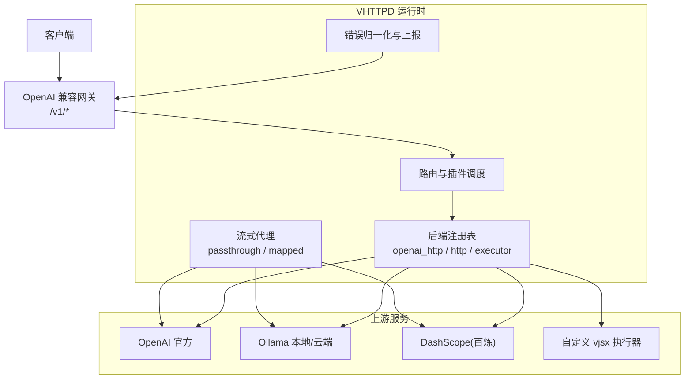
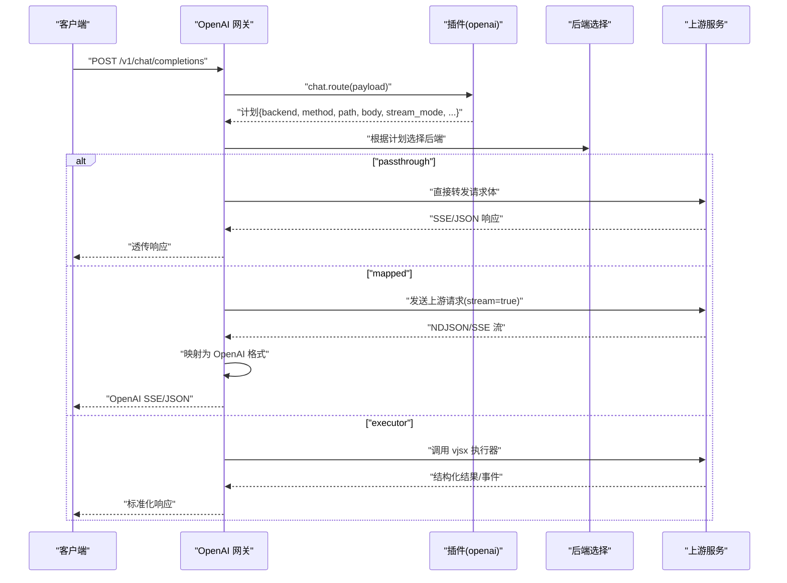
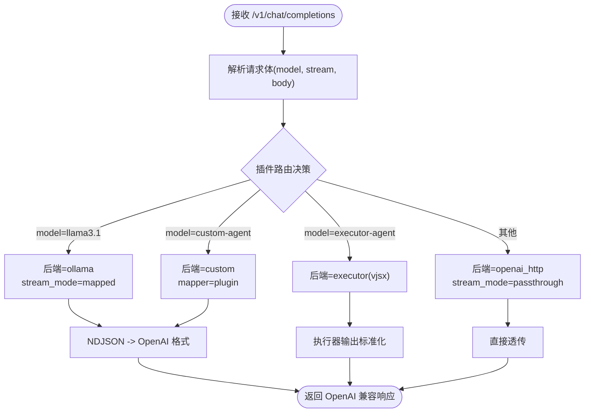
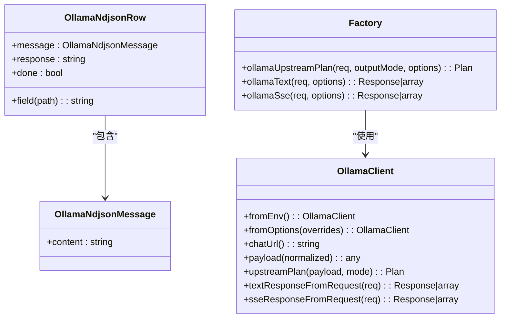
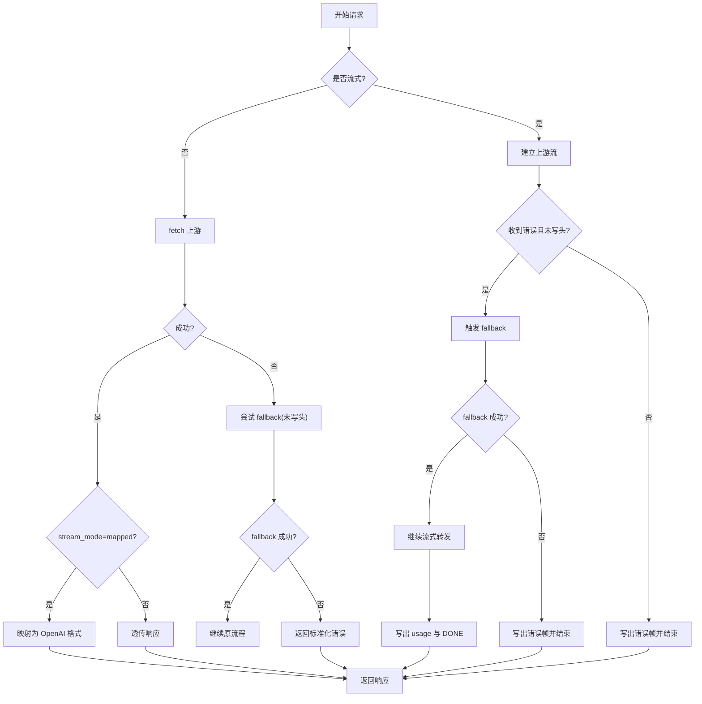
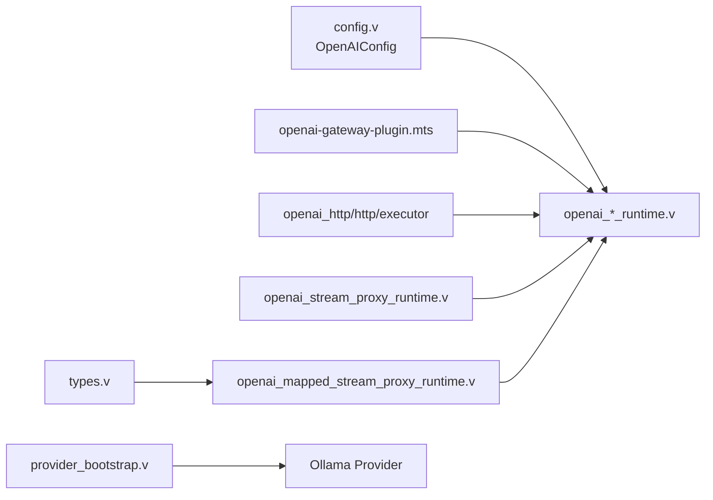

# 第三方服务集成

<cite>
**本文引用的文件列表**
- [README.md](file://README.md)
- [OPENAI_AGGREGATION_GATEWAY_PLAN.md](file://docs/OPENAI_AGGREGATION_GATEWAY_PLAN.md)
- [04-ai-streaming.md](file://articles/04-ai-streaming.md)
- [openai-gateway.toml](file://examples/config/openai-gateway.toml)
- [openai-gateway-dashscope-coding.toml](file://examples/config/openai-gateway-dashscope-coding.toml)
- [ollama-proxy.toml](file://examples/config/ollama-proxy.toml)
- [openai-gateway-plugin.mts](file://examples/vjsx/openai-gateway-plugin.mts)
- [openai-dashscope-coding-plugin.mts](file://examples/vjsx/openai-dashscope-coding-plugin.mts)
- [types.v](file://src/upstream/provider/ollama/types.v)
- [config.v](file://src/config/config.v)
- [provider_bootstrap.v](file://src/provider_bootstrap.v)
- [UPSTREAM_PLAN_PHASE3.md](file://docs/UPSTREAM_PLAN_PHASE3.md)
- [openai_proxy_runtime.v](file://src/openai_proxy_runtime.v)
- [openai_stream_proxy_runtime.v](file://src/openai_stream_proxy_runtime.v)
- [openai_mapped_stream_proxy_runtime.v](file://src/openai_mapped_stream_proxy_runtime.v)
- [OllamaClient.php](file://php/package/src/VSlim/Stream/OllamaClient.php)
- [Factory.php](file://php/package/src/VSlim/Stream/Factory.php)
- [ollama-proxy-app.php](file://examples/ollama-proxy-app.php)
</cite>

## 目录
1. [简介](#简介)
2. [项目结构](#项目结构)
3. [核心组件](#核心组件)
4. [架构总览](#架构总览)
5. [详细组件分析](#详细组件分析)
6. [依赖关系分析](#依赖关系分析)
7. [性能与成本优化建议](#性能与成本优化建议)
8. [故障排查指南](#故障排查指南)
9. [结论](#结论)
10. [附录：配置模板与示例](#附录配置模板与示例)

## 简介
本文件面向需要在 VHTTPD 中集成多种 AI 服务的开发者与运维人员，系统阐述如何以统一网关形态接入 OpenAI、Ollama、DashScope（百炼）等主流提供商。文档覆盖以下主题：
- 服务代理与网关配置：请求转发、负载均衡、熔断降级
- 统一 API 抽象层：标准化请求响应格式、错误处理、重试机制
- 多提供商切换与动态路由：基于模型名或业务策略的路由选择
- 集成示例与配置模板：OpenAI、Ollama、DashScope 的端到端示例
- 性能优化与成本控制：流式传输、映射转换、超时与重试策略

VHTTPD 作为协议与执行宿主，提供 HTTP/WebSocket/流式能力，并通过插件化与上游计划（Upstream Plan）将不同 AI 服务统一暴露为兼容接口。

## 项目结构
围绕第三方 AI 服务集成，仓库中与“网关/上游/插件”相关的核心位置如下：
- 配置示例：examples/config 下的 openai-gateway*.toml、ollama-proxy.toml
- 插件实现：examples/vjsx 下的 openai-gateway-plugin.mts、openai-dashscope-coding-plugin.mts
- 运行时与网关逻辑：src 下 openai_*_runtime.v、provider_bootstrap.v、config.v
- Ollama 类型定义：src/upstream/provider/ollama/types.v
- PHP 侧 Ollama 客户端与工厂：php/package/src/VSlim/Stream/*
- 文档与设计说明：docs/OPENAI_AGGREGATION_GATEWAY_PLAN.md、docs/UPSTREAM_PLAN_PHASE3.md、articles/04-ai-streaming.md

图表来源
- [openai-gateway.toml:1-65](file://examples/config/openai-gateway.toml#L1-L65)
- [openai-gateway-dashscope-coding.toml:1-45](file://examples/config/openai-gateway-dashscope-coding.toml#L1-L45)
- [openai_proxy_runtime.v:1-91](file://src/openai_proxy_runtime.v#L1-L91)
- [openai_stream_proxy_runtime.v:141-244](file://src/openai_stream_proxy_runtime.v#L141-L244)
- [openai_mapped_stream_proxy_runtime.v:154-196](file://src/openai_mapped_stream_proxy_runtime.v#L154-L196)

章节来源
- [README.md:84-126](file://README.md#L84-L126)
- [04-ai-streaming.md:298-410](file://articles/04-ai-streaming.md#L298-L410)

## 核心组件
- OpenAI 兼容网关
  - 通过 [openai] 配置段启用，支持 base_path、默认后端、插件名称、后端集合与路由集合
  - 内置 openai_http 后端用于直连 OpenAI 风格 API；http 后端用于通用 HTTP 上游；executor 后端用于调用 vjsx 应用
  - 插件通过 vjsx 暴露 openai(req) 钩子，返回 models/chat.route/responses.route/map_frame/fallback 等计划
- 上游计划与流式代理
  - 支持 passthrough（透传）、mapped（NDJSON/SSE 映射到 OpenAI 格式）、executor（执行器模式）
  - 非流与流式路径均具备错误归一化、trace 头注入、指标上报
- Ollama 适配
  - 提供 NDJSON 行解析与字段提取类型定义
  - 在 PHP 侧提供 OllamaClient 与 Factory 辅助生成 UpstreamPlan
- DashScope（百炼）集成
  - 通过 openai_http 后端直连 DashScope Coding 开放 API，或在插件中按模型名进行动态路由

章节来源
- [config.v:255-264](file://src/config/config.v#L255-L264)
- [openai-gateway.toml:1-65](file://examples/config/openai-gateway.toml#L1-L65)
- [openai-gateway-dashscope-coding.toml:1-45](file://examples/config/openai-gateway-dashscope-coding.toml#L1-L45)
- [types.v:1-25](file://src/upstream/provider/ollama/types.v#L1-L25)
- [OllamaClient.php:1-46](file://php/package/src/VSlim/Stream/OllamaClient.php#L1-L46)
- [Factory.php:103-129](file://php/package/src/VSlim/Stream/Factory.php#L103-L129)

## 架构总览
下图展示了从客户端到各上游服务的完整链路，包括插件路由、后端选择、流式代理与错误处理。

图表来源
- [openai-gateway-plugin.mts:89-112](file://examples/vjsx/openai-gateway-plugin.mts#L89-L112)
- [openai-gateway-plugin.mts:114-138](file://examples/vjsx/openai-gateway-plugin.mts#L114-L138)
- [openai_proxy_runtime.v:1-91](file://src/openai_proxy_runtime.v#L1-91)
- [openai_stream_proxy_runtime.v:141-244](file://src/openai_stream_proxy_runtime.v#L141-L244)
- [openai_mapped_stream_proxy_runtime.v:154-196](file://src/openai_mapped_stream_proxy_runtime.v#L154-L196)

## 详细组件分析

### OpenAI 兼容网关与插件
- 配置要点
  - [openai] 启用并指定 base_path、default_backend、plugin
  - [plugins.*] 声明 vjsx 插件入口与运行环境
  - [openai.backends.*] 定义 openai_http/http/executor 三种后端
  - [openai.routes.*] 按模型名匹配到具体后端
- 插件能力
  - models：返回可用模型清单
  - chat.route：根据 model/stream/body 决定后端与流式模式
  - responses.route：对 Responses 接口的路由
  - chat.map_frame：自定义帧映射（如工具调用、usage）
  - chat.fallback：失败回退策略（例如从 OpenAI 回落到 Ollama）
- 典型行为
  - 当模型为 llama3.1 时，走 ollama 后端并以 mapped 模式将 NDJSON 转为 OpenAI 格式
  - 当模型为 custom-agent 时，走自定义 HTTP 后端并使用 plugin mapper
  - 当模型为 executor-agent 时，走 executor 后端，交由 vjsx 应用处理

图表来源
- [openai-gateway-plugin.mts:89-112](file://examples/vjsx/openai-gateway-plugin.mts#L89-L112)
- [openai-gateway-plugin.mts:140-169](file://examples/vjsx/openai-gateway-plugin.mts#L140-L169)
- [openai-gateway-plugin.mts:171-195](file://examples/vjsx/openai-gateway-plugin.mts#L171-L195)
- [openai-gateway.toml:25-65](file://examples/config/openai-gateway.toml#L25-L65)

章节来源
- [openai-gateway-plugin.mts:1-213](file://examples/vjsx/openai-gateway-plugin.mts#L1-L213)
- [openai-gateway.toml:1-65](file://examples/config/openai-gateway.toml#L1-L65)
- [OPENAI_AGGREGATION_GATEWAY_PLAN.md:70-128](file://docs/OPENAI_AGGREGATION_GATEWAY_PLAN.md#L70-L128)

### DashScope（百炼）集成
- 使用 openai_http 后端直连 DashScope Coding 开放 API
- 通过插件按模型名进行分流：部分模型走 DashScope，部分模型走 Ollama
- 关键配置项包含 base_url、api_key_env、timeout_ms 以及路由规则

章节来源
- [openai-gateway-dashscope-coding.toml:1-45](file://examples/config/openai-gateway-dashscope-coding.toml#L1-L45)
- [openai-dashscope-coding-plugin.mts:20-52](file://examples/vjsx/openai-dashscope-coding-plugin.mts#L20-L52)

### Ollama 集成与类型
- 类型定义
  - OllamaNdjsonRow 表示单行 NDJSON，包含 message.content/response/done 字段
  - field(path) 方法支持按路径取值，便于映射器快速抽取内容
- PHP 侧客户端
  - OllamaClient 从环境变量读取 chatUrl、model、apiKey、fixturePath
  - Factory 提供便捷方法生成 UpstreamPlan 或直接返回 text/sse 响应
- 示例应用
  - ollama-proxy-app.php 演示如何构造 payload 并返回 upstream plan，由 vhttpd 接管上游流

图表来源
- [types.v:1-25](file://src/upstream/provider/ollama/types.v#L1-L25)
- [OllamaClient.php:1-46](file://php/package/src/VSlim/Stream/OllamaClient.php#L1-L46)
- [Factory.php:103-129](file://php/package/src/VSlim/Stream/Factory.php#L103-L129)

章节来源
- [types.v:1-25](file://src/upstream/provider/ollama/types.v#L1-L25)
- [OllamaClient.php:1-46](file://php/package/src/VSlim/Stream/OllamaClient.php#L1-L46)
- [Factory.php:103-129](file://php/package/src/VSlim/Stream/Factory.php#L103-L129)
- [ollama-proxy-app.php:1-55](file://examples/ollama-proxy-app.php#L1-L55)

### 流式代理与错误处理
- 非流路径
  - 直接 fetch 上游，按 stream_mode 决定是否进行映射转换
  - 若后端 kind 不支持或缺少 base_url，返回 502 并附带错误码
- 流式路径
  - 建立连接后逐块转发，遇到上游错误且尚未写出 SSE 头时触发 fallback
  - 写出 SSE 头后，错误以 OpenAI 风格的 SSE error frame 返回
  - 完成时写入 usage 汇总与 data: [DONE]
- 指标与可观测性
  - 每次请求完成后 emit http.request 事件，包含 provider/backend/mapper 等维度

图表来源
- [openai_proxy_runtime.v:1-91](file://src/openai_proxy_runtime.v#L1-L91)
- [openai_stream_proxy_runtime.v:141-244](file://src/openai_stream_proxy_runtime.v#L141-L244)
- [openai_mapped_stream_proxy_runtime.v:154-196](file://src/openai_mapped_stream_proxy_runtime.v#L154-L196)

章节来源
- [openai_proxy_runtime.v:1-91](file://src/openai_proxy_runtime.v#L1-L91)
- [openai_stream_proxy_runtime.v:141-244](file://src/openai_stream_proxy_runtime.v#L141-L244)
- [openai_mapped_stream_proxy_runtime.v:154-196](file://src/openai_mapped_stream_proxy_runtime.v#L154-L196)

### 多提供商切换与动态路由
- 静态路由
  - 通过 [openai.routes.*] 将模型名映射到固定后端
- 动态路由
  - 插件根据请求体中的 model 字段与业务规则动态选择后端
  - 支持按模型前缀或正则匹配（参考设计文档中的 models 数组与通配符约定）
- 回退策略
  - 当上游不可用或返回非 2xx 时，插件可在未写出响应头前发起一次回退请求
  - 流式场景下，仅在写出 SSE 头之前允许切换后端

章节来源
- [openai-gateway.toml:46-65](file://examples/config/openai-gateway.toml#L46-L65)
- [openai-gateway-plugin.mts:89-112](file://examples/vjsx/openai-gateway-plugin.mts#L89-L112)
- [OPENAI_AGGREGATION_GATEWAY_PLAN.md:518-595](file://docs/OPENAI_AGGREGATION_GATEWAY_PLAN.md#L518-L595)

### 统一 API 抽象层设计
- 标准化请求响应
  - 对外暴露 OpenAI 兼容接口（/v1/models、/v1/chat/completions、/v1/responses）
  - 内部通过插件计划描述目标后端、方法、路径、请求体与流式模式
- 错误处理
  - 上游非 2xx 响应被归一化为 OpenAI 错误信封
  - 流式错误在写出 SSE 头前可触发回退；写出后以 SSE error frame 返回
- 重试机制
  - 内置一次回退（fallback），由插件决定回退目标与参数
- 可观测性
  - 通过事件日志记录请求维度信息（method/path/status/request_id/trace_id/duration_ms/provider/backend）

章节来源
- [OPENAI_AGGREGATION_GATEWAY_PLAN.md:530-595](file://docs/OPENAI_AGGREGATION_GATEWAY_PLAN.md#L530-L595)
- [openai_stream_proxy_runtime.v:233-244](file://src/openai_stream_proxy_runtime.v#L233-L244)
- [openai_mapped_stream_proxy_runtime.v:184-196](file://src/openai_mapped_stream_proxy_runtime.v#L184-L196)

## 依赖关系分析
- 配置与运行时
  - config.v 定义 OpenAIConfig 结构，承载 enabled/base_path/default_backend/plugin/backends/routes
  - provider_bootstrap.v 注册 Ollama Provider（当前为骨架适配器），并提供命令匹配与路由能力
- 插件与后端
  - 插件通过 vjsx 暴露 openai 钩子，返回计划
  - 后端支持 openai_http/http/executor 三类，分别对应 OpenAI 风格直连、通用 HTTP 上游、vjsx 执行器
- 流式与映射
  - 流式代理负责上游连接管理、错误处理、指标上报
  - 映射器将 NDJSON/SSE 转换为 OpenAI 兼容格式，支持 tool_calls 与 usage 聚合

图表来源
- [config.v:255-264](file://src/config/config.v#L255-L264)
- [provider_bootstrap.v:95-142](file://src/provider_bootstrap.v#L95-L142)
- [openai_stream_proxy_runtime.v:141-244](file://src/openai_stream_proxy_runtime.v#L141-L244)
- [openai_mapped_stream_proxy_runtime.v:154-196](file://src/openai_mapped_stream_proxy_runtime.v#L154-L196)
- [types.v:1-25](file://src/upstream/provider/ollama/types.v#L1-L25)

章节来源
- [config.v:255-264](file://src/config/config.v#L255-L264)
- [provider_bootstrap.v:95-142](file://src/provider_bootstrap.v#L95-L142)

## 性能与成本优化建议
- 优先使用流式传输
  - 对于长文本生成，采用 stream=true 以降低首字节延迟与内存占用
- 合理设置超时
  - 针对上游网络波动与模型推理耗时，调整 timeout_ms，避免长时间阻塞
- 映射转换开销控制
  - mapped 模式会进行 JSON 解析与重组，建议在不需要复杂转换时使用 passthrough
- 回退策略与限流
  - 利用 chat.fallback 实现低成本兜底（如从付费云模型回落到本地 Ollama）
  - 结合外部限流与配额管理，控制高成本模型的调用量
- 复用连接与池化
  - 上游 HTTP 连接尽量复用，减少握手开销
- 缓存与幂等
  - 对查询类请求（如 /v1/models）做短期缓存，降低重复请求
- 监控与告警
  - 关注 http.request 事件中的 duration_ms 与 status，识别慢上游与异常比例

[本节为通用指导，不直接分析具体文件]

## 故障排查指南
- 常见错误分类
  - upstream_fetch_failed：上游连接失败或超时
  - upstream_error：上游返回非 2xx
  - mapper_error：映射器解析失败
- 定位步骤
  - 检查 [openai.backends.*] 的 base_url 与 api_key_env 是否正确
  - 确认插件返回的计划中 backend/method/path/body 是否符合上游要求
  - 查看事件日志中的 x-request-id/x-vhttpd-trace-id 关联上下游
  - 对 mapped 模式，检查上游 NDJSON 结构与 meta.field_path 配置
- 回退验证
  - 在插件中打印 failed_backend/status_code/error_code，确认回退条件命中
  - 观察是否在写出 SSE 头之前触发回退

章节来源
- [openai_stream_proxy_runtime.v:158-172](file://src/openai_stream_proxy_runtime.v#L158-L172)
- [openai_stream_proxy_runtime.v:217-226](file://src/openai_stream_proxy_runtime.v#L217-L226)
- [openai_mapped_stream_proxy_runtime.v:168-174](file://src/openai_mapped_stream_proxy_runtime.v#L168-L174)

## 结论
VHTTPD 通过 OpenAI 兼容网关、插件化路由与上游计划机制，将 OpenAI、Ollama、DashScope 等多源 AI 服务统一暴露为标准接口。其流式代理与映射器在保证兼容性的同时，提供了灵活的多提供商切换与回退能力。配合合理的超时、重试与监控策略，可实现高性能、低成本的 AI 服务集成方案。

[本节为总结，不直接分析具体文件]

## 附录：配置模板与示例
- OpenAI 网关基础模板
  - 启用 openai 网关、定义 openai_http/http/executor 后端、配置 routes 按模型名分发
  - 参考：[openai-gateway.toml](file://examples/config/openai-gateway.toml)
- DashScope 编码模型模板
  - 使用 openai_http 后端直连 DashScope Coding，并在插件中按模型名分流
  - 参考：[openai-gateway-dashscope-coding.toml](file://examples/config/openai-gateway-dashscope-coding.toml)、[openai-dashscope-coding-plugin.mts](file://examples/vjsx/openai-dashscope-coding-plugin.mts)
- Ollama 代理模板
  - 通过 PHP 应用返回 upstream plan，由 vhttpd 接管上游流
  - 参考：[ollama-proxy.toml](file://examples/config/ollama-proxy.toml)、[ollama-proxy-app.php](file://examples/ollama-proxy-app.php)、[OllamaClient.php](file://php/package/src/VSlim/Stream/OllamaClient.php)

章节来源
- [openai-gateway.toml:1-65](file://examples/config/openai-gateway.toml#L1-L65)
- [openai-gateway-dashscope-coding.toml:1-45](file://examples/config/openai-gateway-dashscope-coding.toml#L1-L45)
- [openai-dashscope-coding-plugin.mts:1-75](file://examples/vjsx/openai-dashscope-coding-plugin.mts#L1-L75)
- [ollama-proxy.toml:1-26](file://examples/config/ollama-proxy.toml#L1-L26)
- [ollama-proxy-app.php:1-55](file://examples/ollama-proxy-app.php#L1-L55)
- [OllamaClient.php:1-46](file://php/package/src/VSlim/Stream/OllamaClient.php#L1-L46)