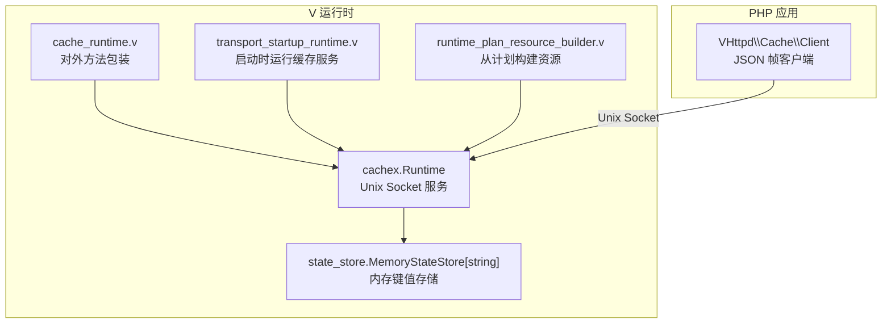
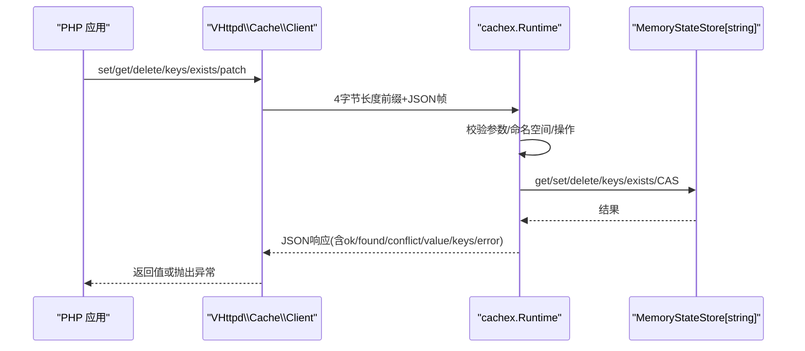
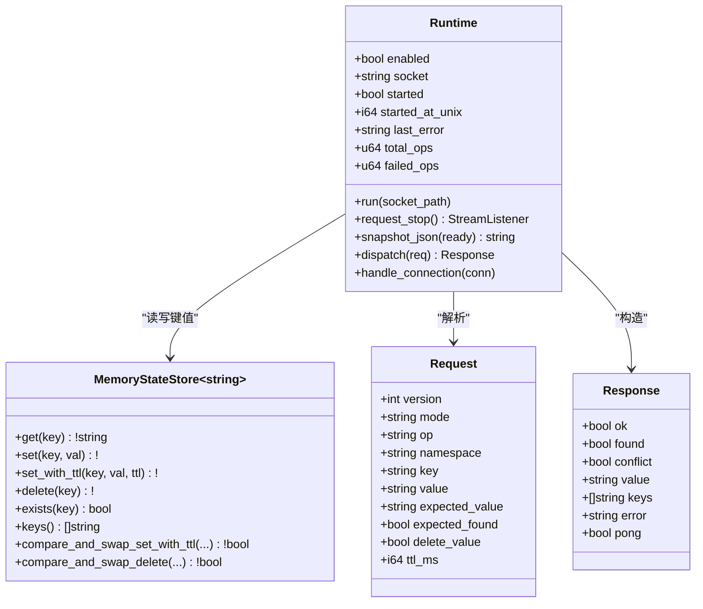
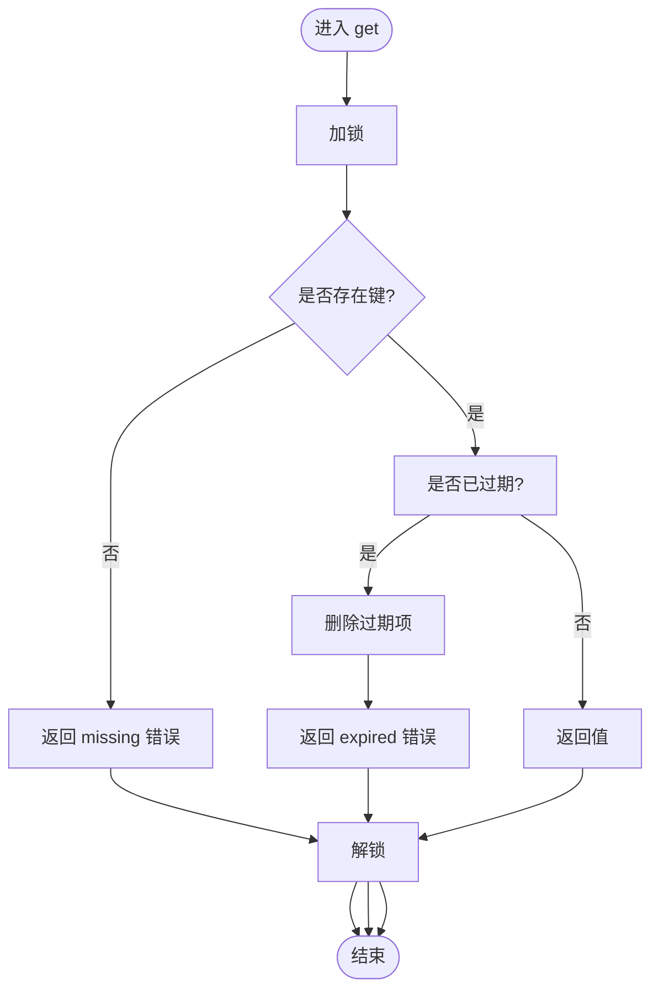
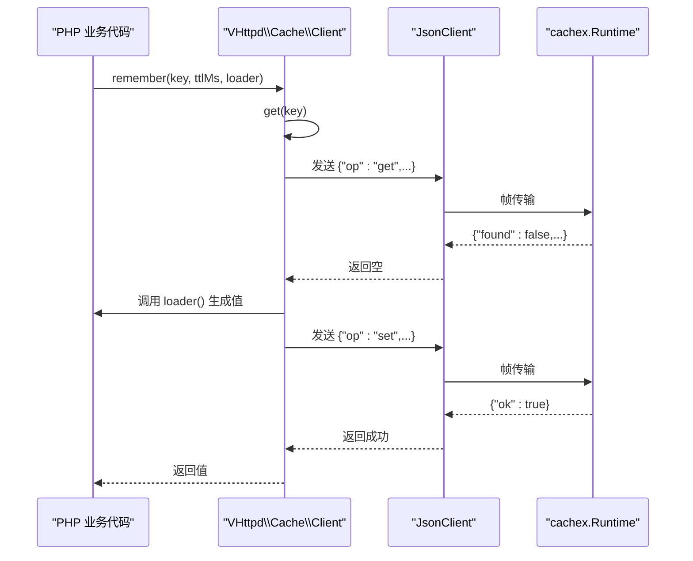
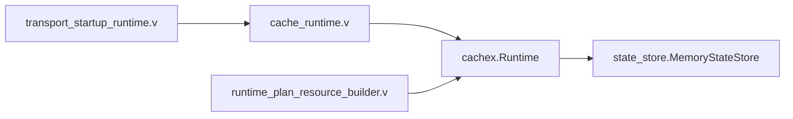

# 缓存系统

<cite>
**本文引用的文件**   
- [src/cachex/runtime.v](file://src/cachex/runtime.v)
- [src/state_store/state_store.v](file://src/state_store/state_store.v)
- [php/package/src/VHttpd/Cache/Client.php](file://php/package/src/VHttpd/Cache/Client.php)
- [php/package/README.md](file://php/package/README.md)
- [examples/wordpress/vhttpd.toml](file://examples/wordpress/vhttpd.toml)
- [tests/e2e/config_acceptance_test.sh](file://tests/e2e/config_acceptance_test.sh)
- [src/cache_runtime.v](file://src/cache_runtime.v)
- [src/transport_startup_runtime.v](file://src/transport_startup_runtime.v)
- [src/runtime_plan_resource_builder.v](file://src/runtime_plan_resource_builder.v)
</cite>

## 目录
1. [简介](#简介)
2. [项目结构](#项目结构)
3. [核心组件](#核心组件)
4. [架构总览](#架构总览)
5. [详细组件分析](#详细组件分析)
6. [依赖关系分析](#依赖关系分析)
7. [性能与内存管理](#性能与内存管理)
8. [故障恢复与监控](#故障恢复与监控)
9. [使用示例](#使用示例)
10. [结论](#结论)

## 简介
本文件系统性介绍 VHTTPD 内置缓存系统的架构、配置、协议与使用方法。当前实现为进程内内存缓存，通过 Unix Socket 暴露 JSON 帧协议，PHP 应用可通过客户端访问；同时提供键值操作（设置、获取、删除、存在性检查、键列表、条件更新）、TTL 过期管理、统计快照等能力。文档还包含最佳实践、调优建议与故障排查指引。

## 项目结构
缓存相关代码主要分布在以下位置：
- 运行时服务与协议处理：src/cachex/runtime.v
- 内存状态存储实现：src/state_store/state_store.v
- PHP 客户端封装：php/package/src/VHttpd/Cache/Client.php
- 启动与资源装配：src/transport_startup_runtime.v、src/runtime_plan_resource_builder.v
- 示例与测试：examples/wordpress/vhttpd.toml、tests/e2e/config_acceptance_test.sh

图表来源
- [src/cachex/runtime.v:1-341](file://src/cachex/runtime.v#L1-L341)
- [src/state_store/state_store.v:1-274](file://src/state_store/state_store.v#L1-L274)
- [php/package/src/VHttpd/Cache/Client.php:1-171](file://php/package/src/VHttpd/Cache/Client.php#L1-L171)
- [src/cache_runtime.v:1-10](file://src/cache_runtime.v#L1-L10)
- [src/transport_startup_runtime.v:1-20](file://src/transport_startup_runtime.v#L1-L20)
- [src/runtime_plan_resource_builder.v:1-15](file://src/runtime_plan_resource_builder.v#L1-L15)

章节来源
- [src/cachex/runtime.v:1-341](file://src/cachex/runtime.v#L1-L341)
- [src/state_store/state_store.v:1-274](file://src/state_store/state_store.v#L1-L274)
- [php/package/src/VHttpd/Cache/Client.php:1-171](file://php/package/src/VHttpd/Cache/Client.php#L1-L171)
- [src/cache_runtime.v:1-10](file://src/cache_runtime.v#L1-L10)
- [src/transport_startup_runtime.v:1-20](file://src/transport_startup_runtime.v#L1-L20)
- [src/runtime_plan_resource_builder.v:1-15](file://src/runtime_plan_resource_builder.v#L1-L15)

## 核心组件
- cachex.Runtime：基于 Unix Socket 的缓存服务，负责请求解析、分发、统计与快照。
- state_store.MemoryStateStore[T]：线程安全的内存键值存储，支持 TTL、过期清理、比较并交换（CAS）等。
- VHttpd\Cache\Client：PHP 侧客户端，通过 4 字节长度前缀的 JSON 帧与 vhttpd 缓存服务通信。

章节来源
- [src/cachex/runtime.v:1-341](file://src/cachex/runtime.v#L1-L341)
- [src/state_store/state_store.v:1-274](file://src/state_store/state_store.v#L1-L274)
- [php/package/src/VHttpd/Cache/Client.php:1-171](file://php/package/src/VHttpd/Cache/Client.php#L1-L171)

## 架构总览
缓存系统采用“进程内内存存储 + Unix Socket 协议”的轻量架构。PHP 应用通过 Client 发送 JSON 帧请求，vhttpd 在独立协程中接受连接并处理请求，返回响应。

图表来源
- [php/package/src/VHttpd/Cache/Client.php:1-171](file://php/package/src/VHttpd/Cache/Client.php#L1-L171)
- [src/cachex/runtime.v:155-297](file://src/cachex/runtime.v#L155-L297)
- [src/state_store/state_store.v:57-274](file://src/state_store/state_store.v#L57-L274)

## 详细组件分析

### 组件一：cachex.Runtime（缓存服务）
- 功能要点
  - 监听 Unix Socket，接收 JSON 帧请求。
  - 支持操作：ping、get、set、delete、exists、keys、patch（CAS）。
  - 命名空间隔离：key 以 namespace:key 形式拼接。
  - 统计信息：total_ops、failed_ops、last_error、started_at_unix、keys 数量等。
  - 快照输出：snapshot_json 用于管理面查询。
- 并发模型
  - 每个连接在独立协程处理，内部对 store 加锁保证一致性。
- 错误处理
  - 非法模式/缺失命名空间/缺失 key 等返回错误响应。
  - 失败操作累计 failed_ops 并记录 last_error。

图表来源
- [src/cachex/runtime.v:24-96](file://src/cachex/runtime.v#L24-L96)
- [src/cachex/runtime.v:194-276](file://src/cachex/runtime.v#L194-L276)
- [src/state_store/state_store.v:6-18](file://src/state_store/state_store.v#L6-L18)
- [src/state_store/state_store.v:212-274](file://src/state_store/state_store.v#L212-L274)

章节来源
- [src/cachex/runtime.v:1-341](file://src/cachex/runtime.v#L1-L341)

### 组件二：state_store.MemoryStateStore[T]（内存存储）
- 功能要点
  - 线程安全：内部互斥锁保护所有写操作与读路径中的过期判断。
  - TTL 管理：写入时可指定过期时间；读取/列举/存在性检查时自动清理过期项。
  - CAS 操作：支持 compare_and_swap_set_with_ttl 与 compare_and_swap_delete，用于无锁冲突的条件更新/删除。
  - 过期清理：prune_expired 可批量清理过期键。
- 复杂度
  - get/set/delete/exists：O(1)。
  - keys/list：O(n)，n 为有效键数（会过滤过期项）。
  - patch/CAS：O(1)。

图表来源
- [src/state_store/state_store.v:57-71](file://src/state_store/state_store.v#L57-L71)

章节来源
- [src/state_store/state_store.v:1-274](file://src/state_store/state_store.v#L1-L274)

### 组件三：VHttpd\Cache\Client（PHP 客户端）
- 功能要点
  - 通过环境变量或显式参数初始化 Unix Socket 路径与默认命名空间。
  - 提供 get/set/delete/exists/keys/remember/ping 等方法。
  - compareAndSwapSet/compareAndSwapDelete 对应服务端 patch 操作。
  - 底层使用 JsonClient 发送 4 字节长度前缀的 JSON 帧。
- 超时与异常
  - 构造函数支持连接与读取超时。
  - 非冲突错误将抛出 RuntimeException。

图表来源
- [php/package/src/VHttpd/Cache/Client.php:133-143](file://php/package/src/VHttpd/Cache/Client.php#L133-L143)
- [php/package/src/VHttpd/Cache/Client.php:148-169](file://php/package/src/VHttpd/Cache/Client.php#L148-L169)
- [src/cachex/runtime.v:194-276](file://src/cachex/runtime.v#L194-L276)

章节来源
- [php/package/src/VHttpd/Cache/Client.php:1-171](file://php/package/src/VHttpd/Cache/Client.php#L1-L171)
- [php/package/README.md:546-568](file://php/package/README.md#L546-L568)

## 依赖关系分析
- 启动链路
  - transport_startup_runtime 在进程启动时调用 cache_runtime_server_run，后者委托 app.transport.cache.run 启动缓存服务。
  - runtime_plan_resource_builder 根据运行时计划创建 cachex.Runtime 实例，注入到 TransportRuntimeHub。
- 外部依赖
  - 网络：net.unix（Unix Socket）。
  - 序列化：json。
  - 同步：sync.Mutex。
  - 时间：time。
  - 状态存储：state_store.MemoryStateStore。

图表来源
- [src/transport_startup_runtime.v:1-20](file://src/transport_startup_runtime.v#L1-L20)
- [src/cache_runtime.v:1-10](file://src/cache_runtime.v#L1-L10)
- [src/runtime_plan_resource_builder.v:1-15](file://src/runtime_plan_resource_builder.v#L1-L15)

章节来源
- [src/transport_startup_runtime.v:1-20](file://src/transport_startup_runtime.v#L1-L20)
- [src/cache_runtime.v:1-10](file://src/cache_runtime.v#L1-L10)
- [src/runtime_plan_resource_builder.v:1-15](file://src/runtime_plan_resource_builder.v#L1-L15)

## 性能与内存管理
- 算法与策略
  - 当前未实现 LRU/LFU 淘汰策略，仅支持按 TTL 的过期清理。
  - 键空间按命名空间隔离，避免跨应用污染。
- 内存占用
  - 内存存储为 map[string]StoredValue[T]，T 为 string，适合小对象缓存。
  - 大对象或高基数场景需评估内存增长与 GC 压力。
- 并发与锁粒度
  - 全局互斥锁保护整个 map，简单可靠但高并发下可能成为瓶颈。
  - 若未来扩展为多后端（如 Redis），可在客户端层做分片与重试。
- 过期清理
  - 惰性清理：在 get/exists/keys/list 时扫描并删除过期项。
  - 主动清理：prune_expired 可周期性调用以减少惰性扫描开销。
- 调优建议
  - 合理设置 TTL，避免热点键长期驻留。
  - 控制单键大小，避免单次请求过大导致帧解析失败（服务端限制最大帧大小）。
  - 在高 QPS 场景下，优先使用 exists 预检减少无效写。

[本节为通用指导，不直接分析具体文件]

## 故障恢复与监控
- 健康检查
  - ping 操作返回 pong=true 表示服务可用。
- 管理面快照
  - snapshot_json 暴露 enabled、started、socket、started_at_unix、last_error、total_ops、failed_ops、keys 数量、ready 等指标。
- 事件日志
  - e2e 测试验证缓存请求保留 trace_id，并在事件日志中记录 server.started 等事件。
- 常见错误
  - invalid_mode、cache_namespace_missing、cache_key_missing、unsupported_cache_op 等。
  - 网络层：连接超时、读取超时、帧大小非法、EOF 异常等。

章节来源
- [src/cachex/runtime.v:79-96](file://src/cachex/runtime.v#L79-L96)
- [src/cachex/runtime.v:194-276](file://src/cachex/runtime.v#L194-L276)
- [tests/e2e/config_acceptance_test.sh:2988-3033](file://tests/e2e/config_acceptance_test.sh#L2988-L3033)

## 使用示例

### 配置启用缓存
- WordPress 示例配置中包含 [cache] 段，启用后会在指定 socket 上提供服务。
- 执行器环境需设置 VHTTPD_CACHE_SOCKET 以便 PHP 客户端连接。

章节来源
- [examples/wordpress/vhttpd.toml:36-38](file://examples/wordpress/vhttpd.toml#L36-L38)
- [examples/wordpress/vhttpd.toml:75-84](file://examples/wordpress/vhttpd.toml#L75-L84)

### PHP 客户端用法
- 基本操作：ping、get、set、delete、exists、keys、remember。
- 条件更新：compareAndSwapSet、compareAndSwapDelete。
- 参考 README 中的 Cache Gateway 说明与示例。

章节来源
- [php/package/README.md:546-568](file://php/package/README.md#L546-L568)
- [php/package/src/VHttpd/Cache/Client.php:50-143](file://php/package/src/VHttpd/Cache/Client.php#L50-L143)

### 原生 V 语言用法
- 通过 cachex.Runtime.new(enabled, socket) 创建实例。
- 使用 run(socket_path) 启动服务；使用 get_value/set_value 进行键值操作；使用 snapshot_json 获取统计。

章节来源
- [src/cachex/runtime.v:64-70](file://src/cachex/runtime.v#L64-L70)
- [src/cachex/runtime.v:98-134](file://src/cachex/runtime.v#L98-L134)
- [src/cachex/runtime.v:299-341](file://src/cachex/runtime.v#L299-L341)

### 端到端测试用例
- e2e 脚本演示了启用 [cache]、启动服务、通过 PHP 客户端完成 set/get/exists/keys/delete 流程，并校验管理面统计。

章节来源
- [tests/e2e/config_acceptance_test.sh:2022-2079](file://tests/e2e/config_acceptance_test.sh#L2022-L2079)
- [tests/e2e/config_acceptance_test.sh:2988-3033](file://tests/e2e/config_acceptance_test.sh#L2988-L3033)

## 结论
VHTTPD 内置缓存系统以简洁可靠的进程内内存存储为核心，通过 Unix Socket 提供稳定的键值接口，满足大多数 PHP 应用的缓存需求。当前版本聚焦于基础能力与稳定性，后续可扩展分布式后端（如 Redis）并保持相同客户端协议，从而在不改动应用代码的前提下提升容量与可用性。在生产环境中，建议结合合理的 TTL、命名空间隔离与监控指标，持续优化性能与可靠性。