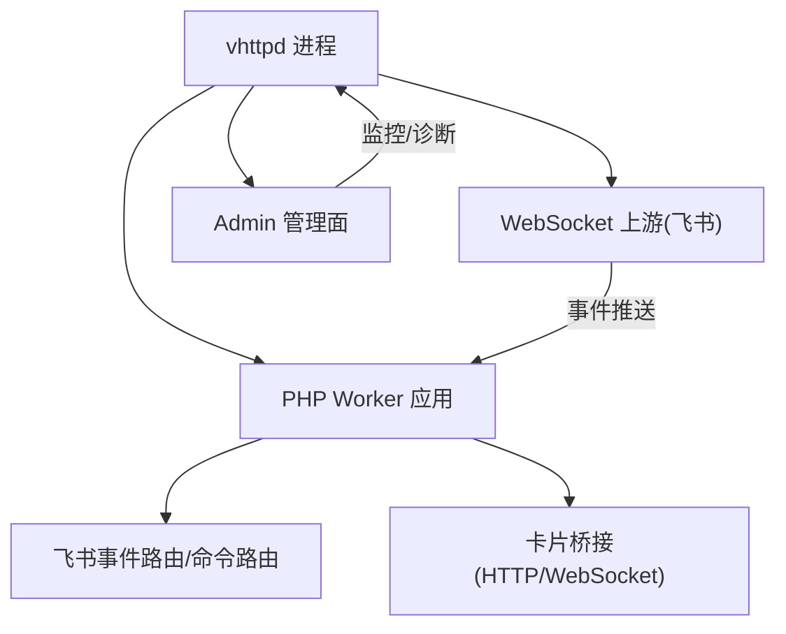
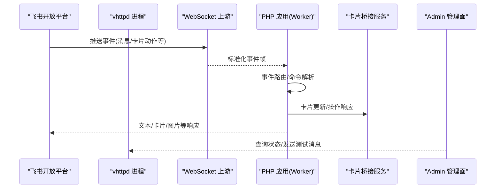
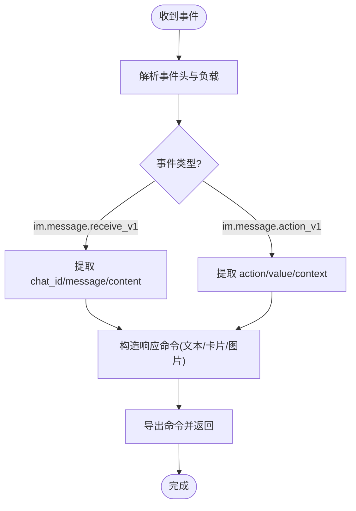
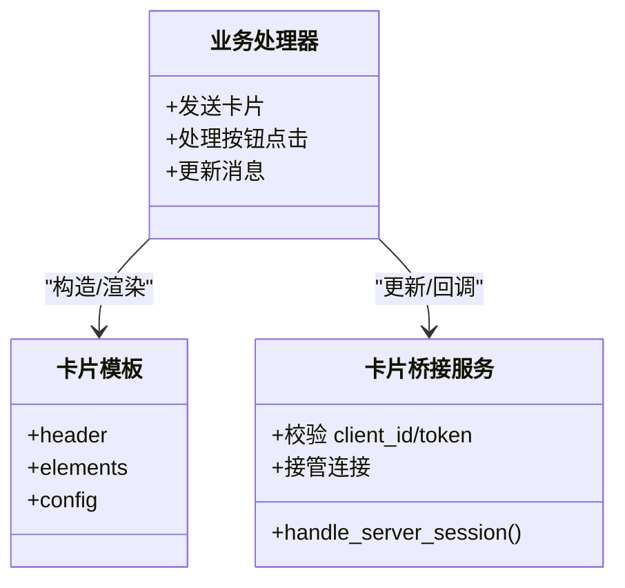
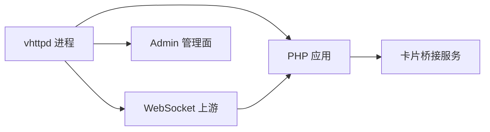

# 飞书机器人集成

<cite>
**本文引用的文件**   
- [articles/07-feishu-bot.md](file://articles/07-feishu-bot.md)
- [examples/config/feishu-bot.toml](file://examples/config/feishu-bot.toml)
- [examples/feishu-bot-mcp-app.php](file://examples/feishu-bot-mcp-app.php)
- [examples/codexbot-app/app.php](file://examples/codexbot-app/app.php)
- [src/feishu_card_bridge_server_runtime.v](file://src/feishu_card_bridge_server_runtime.v)
- [docs/WEBSOCKET_UPSTREAM_PLAN.md](file://docs/WEBSOCKET_UPSTREAM_PLAN.md)
- [articles/11-observability.md](file://articles/11-observability.md)
</cite>

## 目录
1. [简介](#简介)
2. [项目结构](#项目结构)
3. [核心组件](#核心组件)
4. [架构总览](#架构总览)
5. [详细组件分析](#详细组件分析)
6. [依赖关系分析](#依赖关系分析)
7. [性能与可靠性](#性能与可靠性)
8. [故障排查指南](#故障排查指南)
9. [结论](#结论)
10. [附录：配置与示例](#附录配置与示例)

## 简介
本文件面向需要在 vhttpd 上构建飞书机器人的开发者，系统阐述从应用创建、权限与回调配置，到事件订阅、消息收发、卡片交互、事件处理机制的完整流程。文档同时提供 PHP 与 TypeScript 两种实现路径的参考入口，并给出错误处理、重试与可观测性等最佳实践建议。

## 项目结构
围绕飞书机器人集成的关键位置如下：
- 示例配置：examples/config/feishu-bot.toml
- PHP 示例应用（含 HTTP + WebSocket 上游）：examples/feishu-bot-mcp-app.php
- CodexBot 入口：examples/codexbot-app/app.php
- 卡片桥接服务端运行时：src/feishu_card_bridge_server_runtime.v
- 通用 WebSocket 上游计划说明：docs/WEBSOCKET_UPSTREAM_PLAN.md
- 可观测性与事件日志：articles/11-observability.md
- 实战教程与示例代码片段：articles/07-feishu-bot.md

图表来源
- [examples/config/feishu-bot.toml:1-40](file://examples/config/feishu-bot.toml#L1-L40)
- [examples/feishu-bot-mcp-app.php:1-157](file://examples/feishu-bot-mcp-app.php#L1-L157)
- [src/feishu_card_bridge_server_runtime.v:229-251](file://src/feishu_card_bridge_server_runtime.v#L229-L251)
- [docs/WEBSOCKET_UPSTREAM_PLAN.md:69-89](file://docs/WEBSOCKET_UPSTREAM_PLAN.md#L69-L89)

章节来源
- [examples/config/feishu-bot.toml:1-40](file://examples/config/feishu-bot.toml#L1-L40)
- [examples/feishu-bot-mcp-app.php:1-157](file://examples/feishu-bot-mcp-app.php#L1-L157)
- [examples/codexbot-app/app.php:1-15](file://examples/codexbot-app/app.php#L1-L15)
- [src/feishu_card_bridge_server_runtime.v:229-251](file://src/feishu_card_bridge_server_runtime.v#L229-L251)
- [docs/WEBSOCKET_UPSTREAM_PLAN.md:69-89](file://docs/WEBSOCKET_UPSTREAM_PLAN.md#L69-L89)
- [articles/11-observability.md:272-331](file://articles/11-observability.md#L272-L331)

## 核心组件
- 飞书上游连接与实例管理：通过配置文件定义多个实例（如 feishu.main），由 vhttpd 统一维护长连接、重连与 token 刷新。
- 事件分发与业务路由：将来自飞书的事件标准化后，交由 PHP 应用中的路由器进行解析与分发。
- 卡片交互桥接：提供独立的卡片桥接服务，用于卡片更新、操作回调等场景。
- Admin 可观测性：暴露运行时状态、群聊列表、消息发送等管理接口，以及统一的 NDJSON 事件日志。

章节来源
- [examples/config/feishu-bot.toml:28-40](file://examples/config/feishu-bot.toml#L28-L40)
- [docs/WEBSOCKET_UPSTREAM_PLAN.md:69-89](file://docs/WEBSOCKET_UPSTREAM_PLAN.md#L69-L89)
- [src/feishu_card_bridge_server_runtime.v:229-251](file://src/feishu_card_bridge_server_runtime.v#L229-L251)
- [articles/11-observability.md:272-331](file://articles/11-observability.md#L272-L331)

## 架构总览
vhttpd 作为网关与运行时，负责：
- 建立与维护到飞书开放平台的 WebSocket 长连接
- 将事件投递给 PHP Worker 应用
- 为卡片交互提供专用桥接通道
- 对外暴露 Admin 管理面与事件日志

图表来源
- [examples/feishu-bot-mcp-app.php:118-157](file://examples/feishu-bot-mcp-app.php#L118-L157)
- [src/feishu_card_bridge_server_runtime.v:229-251](file://src/feishu_card_bridge_server_runtime.v#L229-L251)
- [docs/WEBSOCKET_UPSTREAM_PLAN.md:69-89](file://docs/WEBSOCKET_UPSTREAM_PLAN.md#L69-L89)

## 详细组件分析

### 应用创建与认证配置
- 在飞书开放平台创建企业自建应用，启用机器人能力，并订阅所需事件（消息接收、卡片互动等）。
- 在 vhttpd 配置中设置应用凭证与连接参数，支持多实例并行运行。

要点
- 启用开关与基础 URL、重连延迟、token 刷新提前量等全局参数
- 实例级 app_id、app_secret、verification_token、encrypt_key
- 无需公网地址，采用主动长连接模式

章节来源
- [examples/config/feishu-bot.toml:28-40](file://examples/config/feishu-bot.toml#L28-L40)
- [articles/07-feishu-bot.md:50-109](file://articles/07-feishu-bot.md#L50-L109)

### 事件订阅与消息处理流程
- 事件进入后，由 vhttpd 转换为标准帧，调用 PHP 应用的 websocket_upstream 处理器。
- 应用内对事件类型进行判断与解析，提取聊天 ID、消息内容等上下文。
- 根据业务逻辑生成响应命令（文本、卡片、图片等），并通过 CommandBus 返回。

图表来源
- [examples/feishu-bot-mcp-app.php:118-157](file://examples/feishu-bot-mcp-app.php#L118-L157)
- [articles/07-feishu-bot.md:372-448](file://articles/07-feishu-bot.md#L372-L448)
- [articles/07-feishu-bot.md:499-620](file://articles/07-feishu-bot.md#L499-L620)

章节来源
- [examples/feishu-bot-mcp-app.php:118-157](file://examples/feishu-bot-mcp-app.php#L118-L157)
- [articles/07-feishu-bot.md:372-448](file://articles/07-feishu-bot.md#L372-L448)
- [articles/07-feishu-bot.md:499-620](file://articles/07-feishu-bot.md#L499-L620)

### 卡片交互系统
- 卡片模板：通过结构化 JSON 描述 header、elements、config 等字段。
- 用户交互：监听 im.message.action_v1 事件，根据 value 中的 action 值执行相应逻辑。
- 实时更新：使用“思考中”消息占位，后续通过更新消息或卡片达到实时效果。

图表来源
- [src/feishu_card_bridge_server_runtime.v:229-251](file://src/feishu_card_bridge_server_runtime.v#L229-L251)
- [articles/07-feishu-bot.md:499-620](file://articles/07-feishu-bot.md#L499-L620)

章节来源
- [src/feishu_card_bridge_server_runtime.v:229-251](file://src/feishu_card_bridge_server_runtime.v#L229-L251)
- [articles/07-feishu-bot.md:499-620](file://articles/07-feishu-bot.md#L499-L620)

### 事件处理机制（消息/审批/通讯录）
- 消息事件：以 im.message.receive_v1 为主，解析文本与富媒体内容。
- 卡片动作事件：以 im.message.action_v1 为主，处理按钮点击等交互。
- 其他事件（如审批、通讯录）：可在同一框架下扩展，遵循相同的事件标准化与路由模型。

章节来源
- [docs/WEBSOCKET_UPSTREAM_PLAN.md:69-89](file://docs/WEBSOCKET_UPSTREAM_PLAN.md#L69-L89)
- [articles/07-feishu-bot.md:499-620](file://articles/07-feishu-bot.md#L499-L620)

### 配置示例（PHP 与 TypeScript）
- PHP 示例入口：examples/feishu-bot-mcp-app.php 提供了 HTTP 与 websocket_upstream 的统一返回结构，并演示了通过 VHttpd::gateway 发送文本/图片的能力。
- TypeScript 示例入口：examples/codexbot-app-ts/app.mts 可作为 TS 侧实现的起点（结合 vhttpd 提供的运行时与协议）。

章节来源
- [examples/feishu-bot-mcp-app.php:1-157](file://examples/feishu-bot-mcp-app.php#L1-157)
- [examples/codexbot-app-ts/app.mts](file://examples/codexbot-app-ts/app.mts)

## 依赖关系分析
- vhttpd 进程负责上游连接、事件转发与管理面暴露。
- PHP 应用通过 handlers 映射 http 与 websocket_upstream 两个入口。
- 卡片桥接服务独立于主事件流，提供卡片更新与回调处理能力。
- Admin 管理面提供运行时状态、群聊列表、消息发送等接口。

图表来源
- [examples/config/feishu-bot.toml:1-40](file://examples/config/feishu-bot.toml#L1-L40)
- [examples/feishu-bot-mcp-app.php:118-157](file://examples/feishu-bot-mcp-app.php#L118-L157)
- [src/feishu_card_bridge_server_runtime.v:229-251](file://src/feishu_card_bridge_server_runtime.v#L229-L251)
- [articles/11-observability.md:272-331](file://articles/11-observability.md#L272-L331)

章节来源
- [examples/config/feishu-bot.toml:1-40](file://examples/config/feishu-bot.toml#L1-L40)
- [examples/feishu-bot-mcp-app.php:118-157](file://examples/feishu-bot-mcp-app.php#L118-L157)
- [src/feishu_card_bridge_server_runtime.v:229-251](file://src/feishu_card_bridge_server_runtime.v#L229-L251)
- [articles/11-observability.md:272-331](file://articles/11-observability.md#L272-L331)

## 性能与可靠性
- 连接与重连：通过 reconnect_delay_ms 控制重连间隔；token_refresh_skew_seconds 控制刷新提前量，避免过期抖动。
- 并发与超时：worker.pool_size、read_timeout_ms、max_requests 等参数影响吞吐与稳定性。
- 去重与幂等：基于 message_id 做消息去重，避免重复处理。
- 异步体验：先发送“思考中”消息，再异步处理并更新结果，提升用户体验。
- 可观测性：开启 event_log 输出 NDJSON 事件日志，便于追踪与排障。

章节来源
- [examples/config/feishu-bot.toml:9-17](file://examples/config/feishu-bot.toml#L9-L17)
- [examples/config/feishu-bot.toml:28-33](file://examples/config/feishu-bot.toml#L28-L33)
- [articles/07-feishu-bot.md:798-846](file://articles/07-feishu-bot.md#L798-L846)
- [articles/11-observability.md:313-331](file://articles/11-observability.md#L313-L331)

## 故障排查指南
- 查看运行时状态与上游连接：
  - GET /admin/runtime
  - GET /admin/runtime/upstreams/websocket
- 查看飞书实例状态与群聊列表：
  - GET /admin/runtime/feishu/chats
- 发送测试消息：
  - POST /admin/runtime/feishu/messages
- 观察事件日志：
  - 读取 files.event_log 配置的 NDJSON 文件

章节来源
- [articles/11-observability.md:272-331](file://articles/11-observability.md#L272-L331)

## 结论
借助 vhttpd 的 WebSocket 上游与统一事件分发模型，开发者可以高效构建具备卡片交互、AI 集成与可观测性的飞书机器人。通过合理的配置与最佳实践，可实现高可用、易运维的企业级机器人应用。

## 附录：配置与示例
- 示例配置：examples/config/feishu-bot.toml
- PHP 示例入口：examples/feishu-bot-mcp-app.php
- CodexBot 入口：examples/codexbot-app/app.php
- 实战教程与示例片段：articles/07-feishu-bot.md

章节来源
- [examples/config/feishu-bot.toml:1-40](file://examples/config/feishu-bot.toml#L1-L40)
- [examples/feishu-bot-mcp-app.php:1-157](file://examples/feishu-bot-mcp-app.php#L1-L157)
- [examples/codexbot-app/app.php:1-15](file://examples/codexbot-app/app.php#L1-L15)
- [articles/07-feishu-bot.md:50-109](file://articles/07-feishu-bot.md#L50-L109)