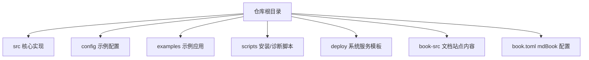
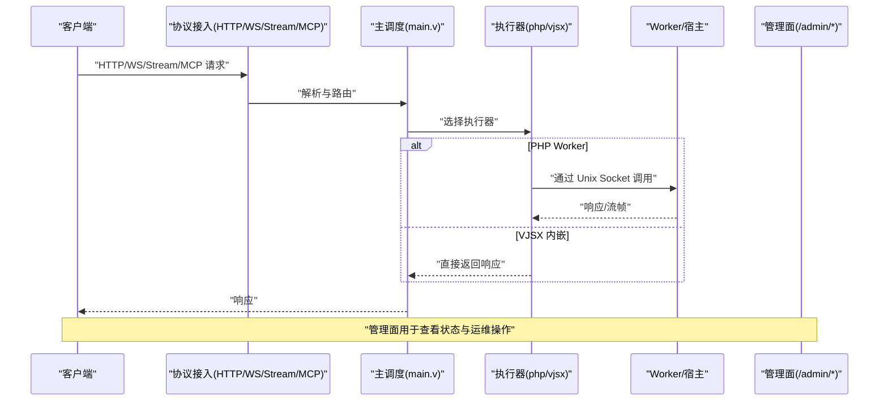
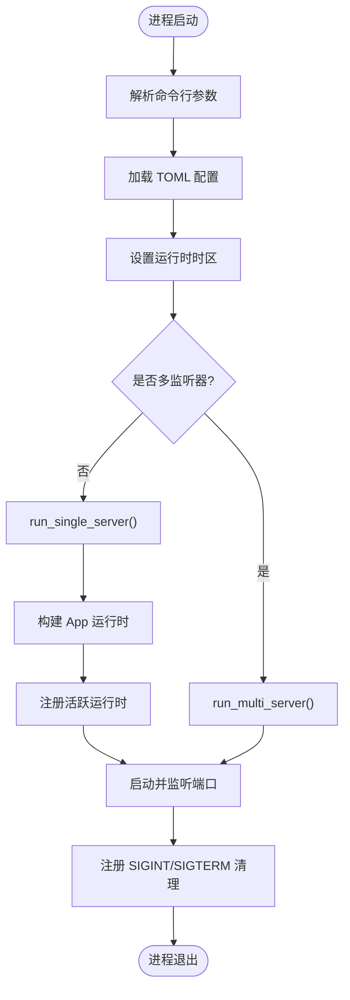
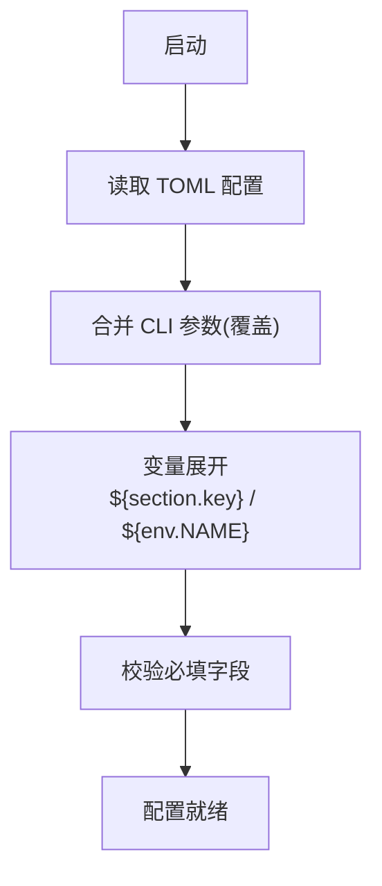
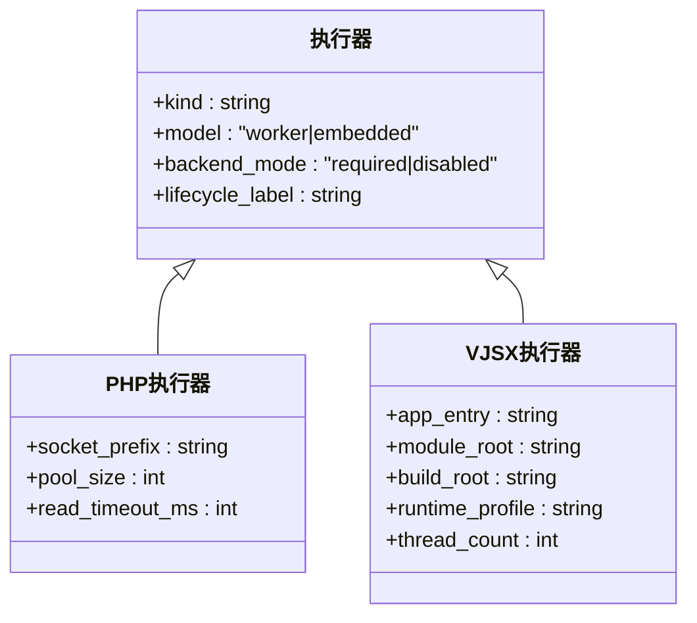
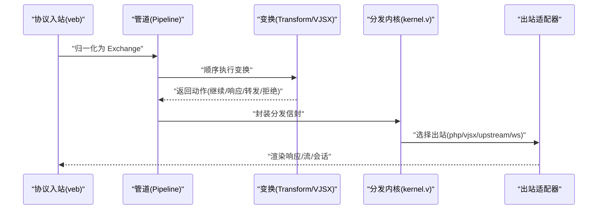
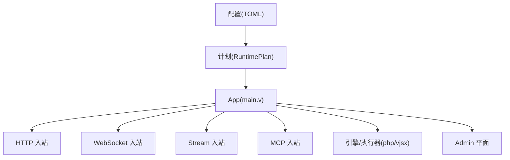

# 书籍文档系统

<cite>
**本文引用的文件**   
- [README.md](file://README.md)
- [book-src/index.md](file://book-src/index.md)
- [book-src/快速开始.md](file://book-src/快速开始.md)
- [book-src/项目概述/项目介绍.md](file://book-src/项目概述/项目介绍.md)
- [book.toml](file://book.toml)
- [src/main.v](file://src/main.v)
- [src/server.v](file://src/server.v)
- [src/config/config.v](file://src/config/config.v)
- [src/dispatch/kernel.v](file://src/dispatch/kernel.v)
- [src/executor/types.v](file://src/executor/types.v)
- [config/vhttpd.example.toml](file://config/vhttpd.example.toml)
- [examples/hello-app.php](file://examples/hello-app.php)
- [examples/vjsx/hello-handler.mts](file://examples/vjsx/hello-handler.mts)
- [Makefile](file://Makefile)
</cite>

## 目录
1. [简介](#简介)
2. [项目结构](#项目结构)
3. [核心组件](#核心组件)
4. [架构总览](#架构总览)
5. [详细组件分析](#详细组件分析)
6. [依赖关系分析](#依赖关系分析)
7. [性能与可观测性](#性能与可观测性)
8. [故障排查指南](#故障排查指南)
9. [结论](#结论)
10. [附录：术语与参考](#附录术语与参考)

## 简介
本“书籍文档系统”基于 vhttpd 仓库的 book-src 与 book.toml，提供面向中文读者的结构化文档站点。vhttpd 是一个基于 V 语言与 veb 构建的独立运行时，定位从“传统 PHP 应用服务器”演进为“多协议执行主机”，统一承载 HTTP、WebSocket、SSE/text 流、MCP Streamable HTTP 以及 WebSocket upstream（如飞书）等协议形态，并通过统一的执行器模型调度外部 php-worker 与嵌入式 vjsx 逻辑。

本节为概览性描述，不直接分析具体文件

## 项目结构
仓库采用“源码 + 示例 + 配置 + 脚本 + 文档”的组织方式：
- src：vhttpd 核心实现（V 语言），包含入口、服务生命周期、配置加载、分发内核、执行器类型定义等
- config：官方示例 TOML 配置
- examples：PHP 与 VJSX 示例应用
- scripts：依赖安装与环境检查脚本
- deploy：systemd / launchd 模板
- book-src：文档站点内容（Markdown）
- book.toml：mdBook 站点配置

[本节为概览性描述，不直接分析具体文件]

## 核心组件
- 协议接入层：HTTP/WebSocket/Stream/MCP 入站与路由
- 执行器模型：php（外部进程）与 vjsx（内嵌执行）
- 工作进程池与队列：控制 worker 生命周期、并发与排队策略
- 管理面：提供运行时快照、worker 操作与诊断接口
- 配置加载：TOML-first，支持变量展开、路径别名与多站点

章节来源
- [README.md:84-126](file://README.md#L84-L126)
- [book-src/快速开始.md:59-68](file://book-src/快速开始.md#L59-L68)
- [src/config/config.v:394-423](file://src/config/config.v#L394-L423)

## 架构总览
下图展示了请求从客户端进入 vhttpd，到选择执行器（php 或 vjsx），再到返回响应的整体流程。

图表来源
- [README.md:84-126](file://README.md#L84-L126)
- [book-src/项目概述/项目介绍.md:84-114](file://book-src/项目概述/项目介绍.md#L84-L114)

章节来源
- [README.md:84-126](file://README.md#L84-L126)
- [book-src/项目概述/项目介绍.md:84-114](file://book-src/项目概述/项目介绍.md#L84-L114)

## 详细组件分析

### 入口与服务生命周期
- main.v 仅保留最小路由与编排职责，将具体处理委托给各运行时模块
- server.v 负责全局参数校验、信号处理、单/多监听器模式、时区配置、启动与关闭流程

图表来源
- [src/server.v:298-319](file://src/server.v#L298-L319)
- [src/server.v:355-371](file://src/server.v#L355-L371)
- [src/main.v:83-116](file://src/main.v#L83-L116)

章节来源
- [src/main.v:1-117](file://src/main.v#L1-L117)
- [src/server.v:139-252](file://src/server.v#L139-L252)
- [src/server.v:276-319](file://src/server.v#L276-L319)
- [src/server.v:355-371](file://src/server.v#L355-L371)

### 配置系统与变量展开
- 加载顺序：默认值 -> TOML 配置 -> CLI 参数（CLI 优先）
- 变量展开：支持 ${section.key}、${env.NAME}、${env.NAME:-default}
- 多站点：同一进程可监听多个 host:port，每个站点独立 executor 与 app

图表来源
- [src/config/config.v:448-482](file://src/config/config.v#L448-L482)
- [README.md:437-518](file://README.md#L437-L518)

章节来源
- [src/config/config.v:429-482](file://src/config/config.v#L429-L482)
- [README.md:437-518](file://README.md#L437-L518)

### 执行器模型与模式
- 两个正交维度：logic_executor_model（worker/embedded）、worker_backend_mode（required/disabled）
- 当前内置：php（外部 worker）、vjsx（embedded）
- 运行时可见性：logic_executor_lifecycle 标识具体启动/关闭路径

图表来源
- [src/executor/types.v:67-75](file://src/executor/types.v#L67-L75)
- [src/executor/types.v:157-164](file://src/executor/types.v#L157-L164)
- [config/vhttpd.example.toml:28-36](file://config/vhttpd.example.toml#L28-L36)

章节来源
- [src/executor/types.v:67-75](file://src/executor/types.v#L67-L75)
- [src/executor/types.v:157-164](file://src/executor/types.v#L157-L164)
- [config/vhttpd.example.toml:28-36](file://config/vhttpd.example.toml#L28-L36)

### 协议管道与分发内核
- 协议入站适配器将不同协议归一化为内部 Exchange
- 管道（Pipeline）按序执行 Transform（原生 V 或 VJSX），不直接持有网络对象
- 出站适配器将结果渲染到目标协议或中继通道
- 分发内核负责构造 stream/mcp/websocket_upstream/websocket_dispatch 的统一信封

图表来源
- [src/dispatch/kernel.v:12-28](file://src/dispatch/kernel.v#L12-L28)
- [src/dispatch/kernel.v:30-77](file://src/dispatch/kernel.v#L30-L77)
- [src/dispatch/kernel.v:79-121](file://src/dispatch/kernel.v#L79-L121)
- [src/dispatch/kernel.v:123-146](file://src/dispatch/kernel.v#L123-L146)

章节来源
- [src/dispatch/kernel.v:1-151](file://src/dispatch/kernel.v#L1-L151)

### 典型用例与示例
- PHP 示例：VSlim 路由与元信息接口
- VJSX 示例：内嵌 handler 返回 JSON

章节来源
- [examples/hello-app.php:1-49](file://examples/hello-app.php#L1-L49)
- [examples/vjsx/hello-handler.mts:1-16](file://examples/vjsx/hello-handler.mts#L1-L16)

## 依赖关系分析
- 顶层入口 main.v 仅做最小路由与编排，所有协议处理下沉到专用运行时模块
- 配置编译期产出不可变计划（RuntimePlan），运行时消费该计划进行装配与校验
- 执行器与适配器通过统一接口解耦，避免耦合到具体协议或语言

图表来源
- [book-src/项目概述/项目介绍.md:226-249](file://book-src/项目概述/项目介绍.md#L226-L249)
- [src/main.v:83-116](file://src/main.v#L83-L116)

章节来源
- [book-src/项目概述/项目介绍.md:226-249](file://book-src/项目概述/项目介绍.md#L226-L249)
- [src/main.v:83-116](file://src/main.v#L83-L116)

## 性能与可观测性
- 性能要点
  - 无每阶段序列化：原生阶段共享 Exchange，VJSX 边界仅一次编码
  - 编译期决策：正则、引用解析、能力校验均在启动时完成
  - 有界并发：引擎、变换队列、中继通道、流缓冲均有上限
  - 复制预算：避免不必要的拷贝，仅在所有权边界外拷贝
- 可观测性
  - 结构化事件日志（NDJSON）
  - Admin 平面暴露运行时快照、worker 统计、活跃会话、队列状态等
  - 请求追踪：request_id/trace_id 贯穿管道

章节来源
- [book-src/项目概述/项目介绍.md:251-264](file://book-src/项目概述/项目介绍.md#L251-L264)
- [README.md:428-436](file://README.md#L428-L436)

## 故障排查指南
- 常见问题定位
  - 队列满：返回 503，错误类 x-vhttpd-error-class: worker_queue_full
  - 队列等待超时：返回 504，错误类 x-vhttpd-error-class: worker_queue_timeout
  - 执行器未就绪：检查 executor.kind 与 worker 配置是否匹配
  - 流式异常：确认 stream.strategy 与 worker 返回帧是否符合契约
- 建议步骤
  - 查看 /admin/runtime 与 /admin/workers 快照
  - 检查 event log 与 trace_id 关联日志
  - 使用示例配置与最小复现用例验证

章节来源
- [book-src/项目概述/项目介绍.md:266-279](file://book-src/项目概述/项目介绍.md#L266-L279)
- [README.md:428-436](file://README.md#L428-L436)

## 结论
vhttpd 的核心价值在于：
- 作为 transport runtime，统一承载 HTTP、WebSocket、SSE、MCP、upstream stream 等协议形态
- 让 PHP 在现代运行时场景中受益，同时保留成熟生态
- 通过 vjsx 提供 TypeScript 插件层，使快速变化的协议与集成逻辑得以灵活扩展
- 以轻量设计与清晰的边界，降低系统碎片化，提升可观测性与可运维性

[本节不直接分析具体文件]

## 附录：术语与参考
- Surface：运行面，如 http/stream/websocket/mcp/websocket_upstream
- Executor：执行器，如 php/vjsx
- Pipeline：协议管道，包含入站、变换、出站
- Exchange：协议无关的内部数据载体
- Admin Plane：管理平面，用于运行时观察与控制

章节来源
- [book-src/项目概述/项目介绍.md:290-299](file://book-src/项目概述/项目介绍.md#L290-L299)