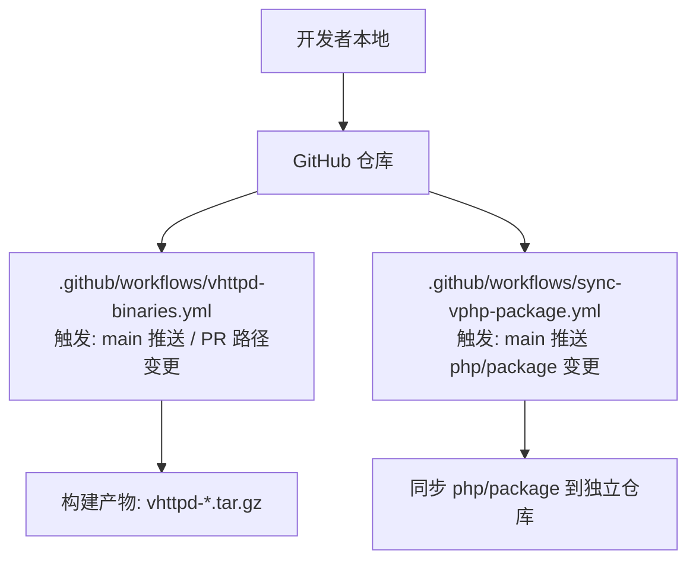
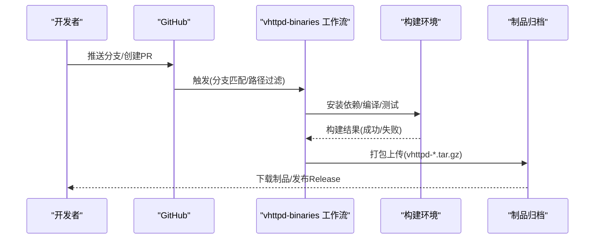
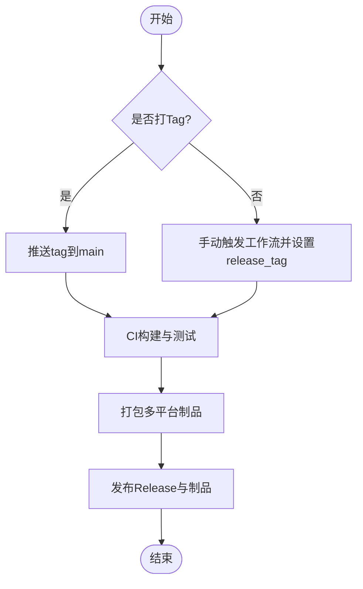
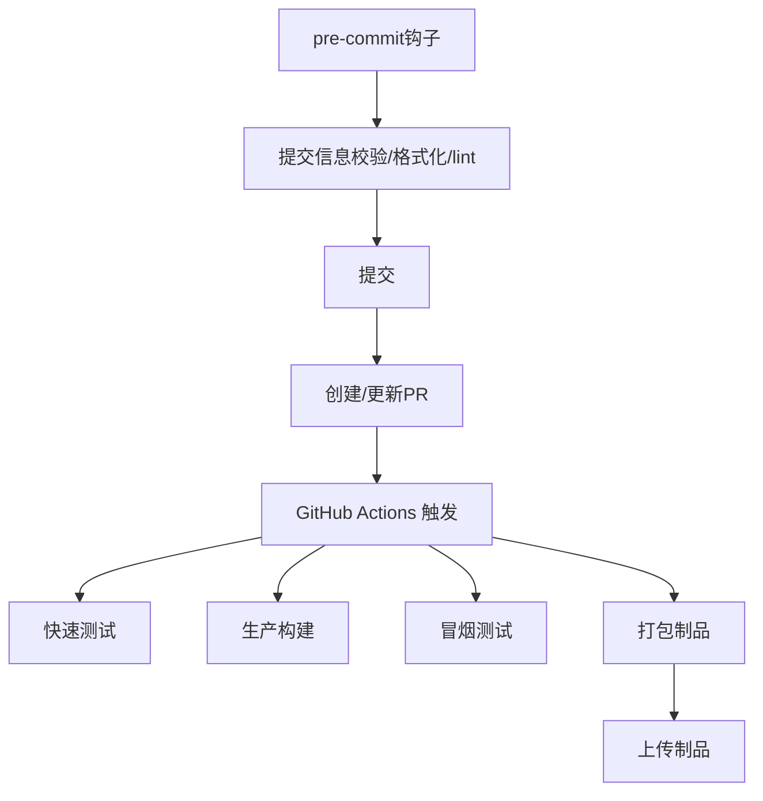
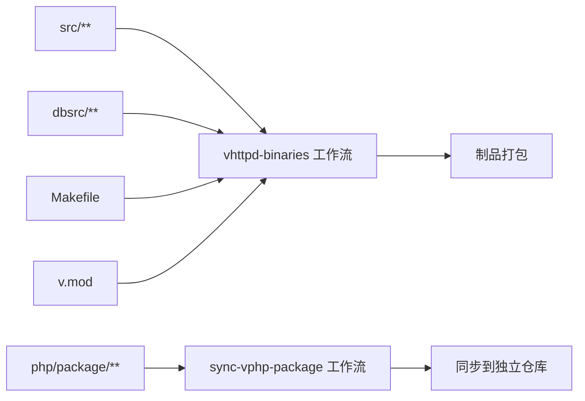

# Git工作流和提交规范

<cite>
**本文引用的文件**   
- [README.md](file://README.md)
- [.github/workflows/vhttpd-binaries.yml](file://.github/workflows/vhttpd-binaries.yml)
- [.github/workflows/sync-vphp-package.yml](file://.github/workflows/sync-vphp-package.yml)
- [Makefile](file://Makefile)
- [scripts/install_ubuntu_from_source.sh](file://scripts/install_ubuntu_from_source.sh)
</cite>

## 目录
1. [简介](#简介)
2. [项目结构](#项目结构)
3. [核心组件](#核心组件)
4. [架构总览](#架构总览)
5. [详细组件分析](#详细组件分析)
6. [依赖分析](#依赖分析)
7. [性能考虑](#性能考虑)
8. [故障排查指南](#故障排查指南)
9. [结论](#结论)
10. [附录](#附录)

## 简介
本文件为 vhttpd 仓库的完整 Git 工作流程与提交信息规范，覆盖分支管理策略、Pull Request 流程、提交信息格式、版本发布流程、Git 钩子与自动化检查工具配置建议，以及常见操作最佳实践与问题解决方案。内容基于仓库现有 CI/CD 与构建脚本进行梳理，并给出可落地的团队约定与落地步骤。

## 项目结构
仓库采用多语言混合工程（V、PHP、TypeScript/JavaScript），并通过 GitHub Actions 执行构建与打包。与 Git 工作流直接相关的根级工件包括：
- 工作流定义：.github/workflows/*.yml
- 构建入口：Makefile
- 安装与依赖准备脚本：scripts/*.sh
- 顶层说明与使用说明：README.md

**图示来源**
- [.github/workflows/vhttpd-binaries.yml:1-171](file://.github/workflows/vhttpd-binaries.yml#L1-L171)
- [.github/workflows/sync-vphp-package.yml:1-48](file://.github/workflows/sync-vphp-package.yml#L1-L48)

**章节来源**
- [README.md:279-326](file://README.md#L279-L326)
- [.github/workflows/vhttpd-binaries.yml:1-171](file://.github/workflows/vhttpd-binaries.yml#L1-L171)
- [.github/workflows/sync-vphp-package.yml:1-48](file://.github/workflows/sync-vphp-package.yml#L1-L48)

## 核心组件
- 分支模型
  - main：受保护的稳定主干，所有合并目标分支
  - feature/*：功能开发分支，命名如 feature/xxx
  - fix/*：缺陷修复分支，命名如 fix/xxx
  - release/*：预发布分支，命名如 release/vX.Y.Z
  - hotfix/*：紧急修复分支，命名如 hotfix/xxx
- 提交信息规范（Conventional Commits）
  - 类型：feat, fix, docs, style, refactor, perf, test, build, ci, chore, revert
  - 可选作用域：模块或子系统名，如 (config), (worker), (vjsx)
  - 描述：简洁明了，使用祈使句，避免无意义前缀
  - 示例：feat(worker): 增加队列超时配置项
- Pull Request 要求
  - 关联 Issue 或任务编号
  - 自测通过（单元测试、端到端冒烟）
  - 变更影响面评估与回滚方案
  - 文档更新（如有用户可见变更）
- 代码审查与合并标准
  - 至少一名维护者批准
  - CI 全绿（构建、测试、打包）
  - 无未决冲突
  - 变更符合提交信息与分支策略
- 版本发布流程
  - 版本号遵循语义化版本（MAJOR.MINOR.PATCH）
  - 打 tag 后由 CI 自动构建多平台二进制并发布制品
  - 变更日志随 tag 自动生成（GitHub Releases）
- Git 钩子与自动化检查
  - 推荐启用 pre-commit 钩子：lint、格式化、提交信息校验
  - CI 中已包含快速测试与构建验证
- 常见问题与排障
  - 依赖缺失、QuickJS 源未就绪、权限不足等

**章节来源**
- [README.md:279-326](file://README.md#L279-L326)
- [README.md:412-426](file://README.md#L412-L426)
- [.github/workflows/vhttpd-binaries.yml:1-171](file://.github/workflows/vhttpd-binaries.yml#L1-L171)

## 架构总览
下图展示从开发者到制品产出的端到端流水线，涵盖触发条件、构建环境与产物打包。

**图示来源**
- [.github/workflows/vhttpd-binaries.yml:1-171](file://.github/workflows/vhttpd-binaries.yml#L1-L171)

## 详细组件分析

### 分支管理策略
- main
  - 保护规则：禁止直接推送；仅允许通过 PR 合并
  - 触发点：对 main 的推送将触发二进制构建
- feature/*
  - 用于新功能开发，完成后发起 PR 至 main
- fix/*
  - 用于缺陷修复，完成后发起 PR 至 main
- release/*
  - 用于版本候选，完成后可打 tag 进入发布
- hotfix/*
  - 用于线上紧急修复，完成后立即合并至 main 并打 tag

**章节来源**
- [.github/workflows/vhttpd-binaries.yml:5-20](file://.github/workflows/vhttpd-binaries.yml#L5-L20)

### Pull Request 流程
- 创建 PR
  - 选择目标分支 main
  - 填写变更摘要、影响范围、测试情况
- 代码审查
  - 至少一名维护者审阅并批准
  - 关注接口契约、错误处理、可观测性与兼容性
- 合并标准
  - CI 全部通过
  - 无未解决评论
  - 符合提交信息规范与分支策略

[本节为通用流程说明，不直接分析具体文件]

### 提交信息格式规范
- 结构
  - <type>(<scope>): <subject>
  - 可选 body 与 footer
- 类型约定
  - feat: 新功能
  - fix: 缺陷修复
  - docs: 文档变更
  - style: 不影响逻辑的样式/格式化
  - refactor: 重构
  - perf: 性能优化
  - test: 测试相关
  - build: 构建系统或外部依赖变更
  - ci: CI/CD 变更
  - chore: 其他杂项
  - revert: 回滚提交
- 质量要求
  - 主题行不超过 72 字符
  - 使用祈使句，避免“我做了...”
  - 必要时在 body 补充动机与影响面

[本节为通用规范说明，不直接分析具体文件]

### 版本发布流程
- 版本策略
  - 语义化版本：主版本(破坏性变更)、次版本(新增功能)、修订号(缺陷修复)
- 触发方式
  - 推送 tag（例如 vhttpd-0.1.0）自动触发构建与发布
  - 也可手动触发工作流并指定 release_tag
- 产物与发布
  - 生成多平台 tar.gz 包
  - 自动生成 Release Notes（含制品摘要）

**图示来源**
- [README.md:412-426](file://README.md#L412-L426)
- [.github/workflows/vhttpd-binaries.yml:1-171](file://.github/workflows/vhttpd-binaries.yml#L1-L171)

**章节来源**
- [README.md:412-426](file://README.md#L412-L426)
- [.github/workflows/vhttpd-binaries.yml:1-171](file://.github/workflows/vhttpd-binaries.yml#L1-L171)

### Git 钩子与自动化检查
- 本地 pre-commit 钩子建议
  - 提交信息校验（conventional-commits）
  - 代码风格与格式化（V/PHP/TS 对应工具）
  - 轻量静态检查（lint）
- CI 内置检查
  - 快速单元测试
  - 生产构建
  - 冒烟测试与帮助命令校验
  - 制品打包与上传

**图示来源**
- [.github/workflows/vhttpd-binaries.yml:127-171](file://.github/workflows/vhttpd-binaries.yml#L127-L171)

**章节来源**
- [.github/workflows/vhttpd-binaries.yml:127-171](file://.github/workflows/vhttpd-binaries.yml#L127-L171)

### 常见 Git 操作最佳实践
- 小步提交，原子化变更
- 频繁 rebase 保持历史整洁（在协作分支上谨慎使用 force push）
- 合并前确保本地最新（rebase 或 merge origin/main）
- 使用标签标记重要里程碑与发布
- 变更涉及配置时，附带最小可复现示例或说明

[本节为通用实践说明，不直接分析具体文件]

### 问题解决方案
- 依赖缺失
  - 现象：构建阶段缺少系统库或 pkg-config 条目
  - 处理：参考 README 的依赖安装与 doctor 检查
- QuickJS 源未就绪
  - 现象：vjsx 构建失败
  - 处理：确保 ensure-quickjs.sh 可用并按工作流方式准备源码
- 权限问题
  - 现象：写入受限目录失败
  - 处理：按脚本提示调整目录所有权或使用 sudo
- 冲突解决
  - 使用 git mergetool 或 IDE 可视化合并
  - 冲突解决后重新运行测试与构建

**章节来源**
- [README.md:210-247](file://README.md#L210-L247)
- [scripts/install_ubuntu_from_source.sh:97-124](file://scripts/install_ubuntu_from_source.sh#L97-L124)

## 依赖分析
- 工作流触发与路径过滤
  - vhttpd-binaries：监听 src/**、dbsrc/**、Makefile、v.mod、工作流自身
  - sync-vphp-package：监听 php/package/** 与工作流自身
- 构建与打包
  - 使用 Makefile 目标进行构建与测试
  - 工作流内执行 make prod 与打包脚本

**图示来源**
- [.github/workflows/vhttpd-binaries.yml:5-20](file://.github/workflows/vhttpd-binaries.yml#L5-L20)
- [.github/workflows/sync-vphp-package.yml:4-10](file://.github/workflows/sync-vphp-package.yml#L4-L10)

**章节来源**
- [.github/workflows/vhttpd-binaries.yml:5-20](file://.github/workflows/vhttpd-binaries.yml#L5-L20)
- [.github/workflows/sync-vphp-package.yml:4-10](file://.github/workflows/sync-vphp-package.yml#L4-L10)
- [Makefile](file://Makefile)

## 性能考虑
- 合理拆分提交，减少大变更带来的合并成本
- 使用增量构建与缓存（CI 中可通过 actions/cache 提升速度）
- 控制 PR 规模，便于审查与回归定位
- 在本地先跑快速测试，再提交以减少 CI 阻塞

[本节为通用指导，不直接分析具体文件]

## 故障排查指南
- 构建失败
  - 检查依赖安装步骤与 pkg-config 条目
  - 确认 V 编译器与 CC 环境变量
- 测试失败
  - 优先复现本地失败用例，缩小范围
  - 查看工作流日志中的测试输出
- 制品异常
  - 核对打包脚本与 RPATH 设置
  - 使用 runtime_doctor 进行环境自检

**章节来源**
- [README.md:279-326](file://README.md#L279-L326)
- [README.md:349-366](file://README.md#L349-L366)

## 结论
通过明确的分支模型、严格的提交信息规范、标准化的 PR 流程与完善的 CI 流水线，vhttpd 能够在保证质量的同时高效迭代。建议在团队内推广上述约定，并结合本地钩子与 CI 检查形成闭环，持续提升交付效率与稳定性。

[本节为总结性内容，不直接分析具体文件]

## 附录
- 常用命令速查
  - 创建功能分支：git checkout -b feature/xxx
  - 提交规范：git commit -m "feat(scope): subject"
  - 同步上游：git fetch origin && git rebase origin/main
  - 打标签：git tag -a vhttpd-0.1.0 -m "Release v0.1.0" && git push origin --tags
- 参考
  - 构建与分发说明见 README
  - CI 工作流定义见 .github/workflows

[本节为补充信息，不直接分析具体文件]