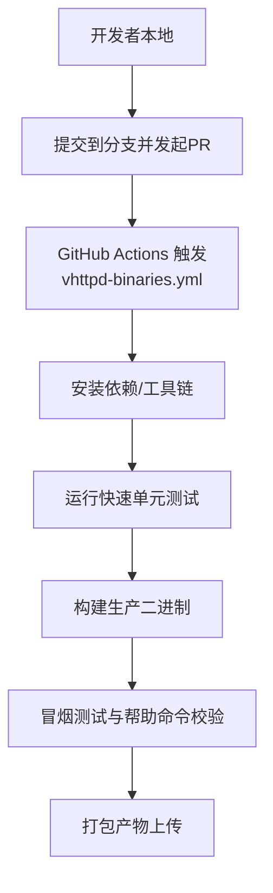
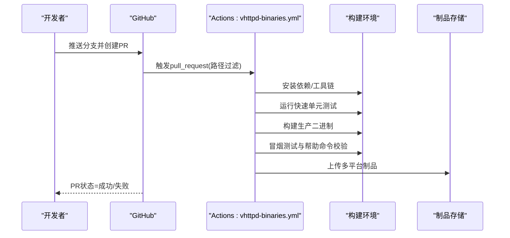
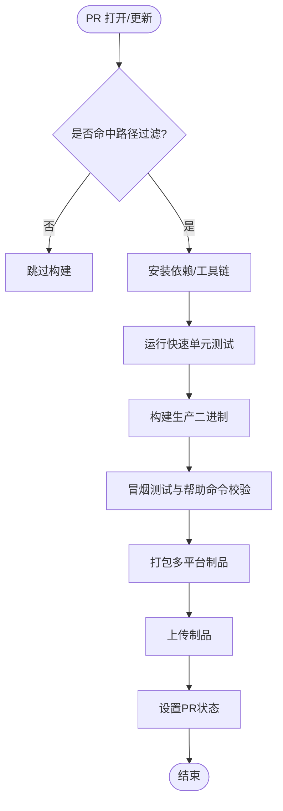
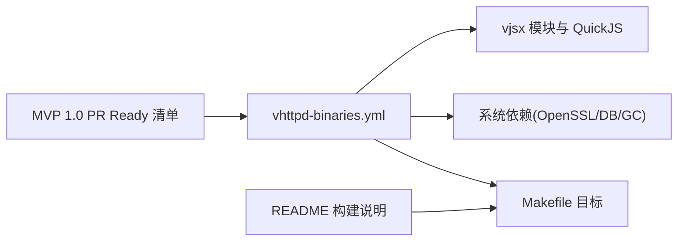

# Pull Request流程

<cite>
**本文引用的文件**
- [README.md](file://README.md)
- [.github/workflows/vhttpd-binaries.yml](file://.github/workflows/vhttpd-binaries.yml)
- [.github/workflows/sync-vphp-package.yml](file://.github/workflows/sync-vphp-package.yml)
- [Makefile](file://Makefile)
- [docs/MVP_1_0_PR_READY.md](file://docs/MVP_1_0_PR_READY.md)
</cite>

## 目录
1. [简介](#简介)
2. [项目结构](#项目结构)
3. [核心组件](#核心组件)
4. [架构总览](#架构总览)
5. [详细组件分析](#详细组件分析)
6. [依赖关系分析](#依赖关系分析)
7. [性能与质量考量](#性能与质量考量)
8. [故障排查指南](#故障排查指南)
9. [结论](#结论)
10. [附录：PR模板与最佳实践](#附录pr模板与最佳实践)

## 简介
本文件为 vhttpd 仓库的 Pull Request（PR）工作流程与规范，覆盖 PR 创建要求、代码审查流程、合并标准、状态管理与自动化检查，并提供 PR 模板与最佳实践。目标是确保变更可追溯、可验证、可回滚，并在多平台构建与测试环境下保持一致的质量基线。

## 项目结构
与 PR 工作流直接相关的仓库结构与配置如下：
- GitHub Actions 工作流定义位于 .github/workflows/
- 构建与测试入口由 Makefile 提供
- 文档中提供了 MVP 1.0 的 PR Ready 清单，可作为合并前验收参考

图表来源
- [.github/workflows/vhttpd-binaries.yml:1-171](file://.github/workflows/vhttpd-binaries.yml#L1-L171)
- [README.md:256-270](file://README.md#L256-L270)

章节来源
- [README.md:256-270](file://README.md#L256-L270)
- [.github/workflows/vhttpd-binaries.yml:1-171](file://.github/workflows/vhttpd-binaries.yml#L1-L171)

## 核心组件
- 构建与测试入口
  - 使用 make 目标驱动构建与测试，如 test-fast、prod、test-e2e 等
- CI 流水线
  - vhttpd-binaries.yml：在 pull_request 事件下对受影响的源码路径执行构建与测试，产出多平台制品
  - sync-vphp-package.yml：用于将 php/package 同步至独立仓库（非 PR 主流程，但影响发布）
- 验收清单
  - docs/MVP_1_0_PR_READY.md：提供构建、启动、数据面/管理面分离、Worker 计数、重启 API、优雅停止、基准冒烟、CI 制品等验收项

章节来源
- [README.md:256-270](file://README.md#L256-L270)
- [.github/workflows/vhttpd-binaries.yml:1-171](file://.github/workflows/vhttpd-binaries.yml#L1-L171)
- [.github/workflows/sync-vphp-package.yml:1-48](file://.github/workflows/sync-vphp-package.yml#L1-L48)
- [docs/MVP_1_0_PR_READY.md:1-104](file://docs/MVP_1_0_PR_READY.md#L1-L104)

## 架构总览
下图展示了从 PR 创建到制品产出的端到端流程，以及关键触发条件与产物。

图表来源
- [.github/workflows/vhttpd-binaries.yml:14-20](file://.github/workflows/vhttpd-binaries.yml#L14-L20)
- [.github/workflows/vhttpd-binaries.yml:127-171](file://.github/workflows/vhttpd-binaries.yml#L127-L171)

## 详细组件分析

### PR 创建要求
- 关联 Issue
  - 建议在 PR 描述中引用相关 Issue 编号，便于追踪问题与需求来源
- 变更范围说明
  - 明确本次 PR 的目标、影响范围、风险点与回滚策略
  - 如涉及配置或运行时行为变化，需补充兼容性说明
- 描述模板
  - 建议包含：背景与动机、变更内容、影响面、测试与验证方式、回滚方案
  - 若涉及 MVP 1.0 特性，可对照 MVP 1.0 PR Ready 清单逐项自检

章节来源
- [docs/MVP_1_0_PR_READY.md:1-104](file://docs/MVP_1_0_PR_READY.md#L1-L104)

### 代码审查流程
- 审查者分配
  - 至少指定一名具备该模块经验的审查者；涉及跨模块变更时增加相关维护者
- 审查标准
  - 正确性：逻辑与边界处理完备，错误码与日志清晰
  - 可维护性：命名与结构清晰，避免过度耦合
  - 可测试性：新增/修改用例覆盖关键路径
  - 安全性：敏感信息不入库/入日志，权限校验到位
  - 性能：无显著退化，必要时提供基准对比
- 反馈处理
  - 针对每条意见给出明确回应与修复计划
  - 小改动可直接追加提交，大改动建议分步提交并附说明

[本节为通用流程说明，无需特定文件来源]

### 合并标准
- CI 检查通过
  - 必须通过 vhttpd-binaries.yml 中的构建与测试任务
- 至少一个审查者批准
  - 审查通过后标记为 Approved
- 冲突解决验证
  - 合并前需基于最新主干进行 rebase 或 merge，确保无冲突且 CI 再次通过
- 额外验收（可选）
  - 对于 MVP 1.0 相关变更，建议完成 MVP 1.0 PR Ready 清单中的关键项

章节来源
- [.github/workflows/vhttpd-binaries.yml:14-20](file://.github/workflows/vhttpd-binaries.yml#L14-L20)
- [docs/MVP_1_0_PR_READY.md:1-104](file://docs/MVP_1_0_PR_READY.md#L1-L104)

### PR 状态管理与自动化检查
- 触发条件
  - 当 PR 涉及 src/**、dbsrc/**、Makefile、v.mod、.github/workflows/vhttpd-binaries.yml 时自动触发
- 构建矩阵
  - Linux amd64、macOS Intel、macOS ARM64 并行构建
- 测试与冒烟
  - 运行快速单元测试
  - 构建生产二进制
  - 执行冒烟测试与 --help 校验
- 制品输出
  - 打包并上传多平台制品，供后续发布或人工验证

图表来源
- [.github/workflows/vhttpd-binaries.yml:14-20](file://.github/workflows/vhttpd-binaries.yml#L14-L20)
- [.github/workflows/vhttpd-binaries.yml:127-171](file://.github/workflows/vhttpd-binaries.yml#L127-L171)

章节来源
- [.github/workflows/vhttpd-binaries.yml:1-171](file://.github/workflows/vhttpd-binaries.yml#L1-L171)

### 安全漏洞检测与代码质量扫描
- 当前仓库未内置专门的安全扫描或静态质量检查任务
- 建议在 PR 阶段引入以下能力（按需启用）：
  - 静态分析：V 语言静态检查、lint 规则
  - 安全扫描：依赖漏洞扫描、密钥泄露检测
  - 覆盖率统计：单元测试覆盖率阈值
- 这些能力可通过 GitHub Actions 扩展实现，并与现有构建矩阵集成

[本节为通用建议，无需特定文件来源]

## 依赖关系分析
- 外部依赖
  - V 编译器、系统库（OpenSSL、SQLite、MySQL/PostgreSQL 客户端、Boehm GC 等）
  - vjsx 模块与 QuickJS 源树（由工作流脚本准备）
- 内部依赖
  - README 中提供的构建与分发说明与 CI 工作流保持一致
  - MVP 1.0 PR Ready 清单作为验收依据

图表来源
- [.github/workflows/vhttpd-binaries.yml:1-171](file://.github/workflows/vhttpd-binaries.yml#L1-L171)
- [README.md:256-270](file://README.md#L256-L270)
- [docs/MVP_1_0_PR_READY.md:1-104](file://docs/MVP_1_0_PR_READY.md#L1-L104)

章节来源
- [.github/workflows/vhttpd-binaries.yml:1-171](file://.github/workflows/vhttpd-binaries.yml#L1-L171)
- [README.md:256-270](file://README.md#L256-L270)
- [docs/MVP_1_0_PR_READY.md:1-104](file://docs/MVP_1_0_PR_READY.md#L1-L104)

## 性能与质量考量
- 构建与测试
  - 使用并行矩阵提升效率，仅在受影响路径变更时触发
- 回归与基准
  - 可在 PR 中加入轻量级基准或回归脚本，确保关键路径性能稳定
- 制品一致性
  - 多平台制品应附带一致的版本信息与校验和，便于发布与回滚

[本节为通用指导，无需特定文件来源]

## 故障排查指南
- 构建失败
  - 检查依赖安装步骤与 pkg-config 配置是否正确
  - 确认 V 编译器与 cc/clang 版本兼容
- 测试失败
  - 查看快速单元测试与冒烟测试日志，定位具体断言失败点
- 制品缺失
  - 确认打包与上传步骤是否执行成功，检查制品名称与路径
- 本地复现
  - 使用 README 中的构建与运行说明，在本地复现 CI 环境

章节来源
- [.github/workflows/vhttpd-binaries.yml:47-82](file://.github/workflows/vhttpd-binaries.yml#L47-L82)
- [.github/workflows/vhttpd-binaries.yml:127-171](file://.github/workflows/vhttpd-binaries.yml#L127-L171)
- [README.md:256-270](file://README.md#L256-L270)

## 结论
本流程以 CI 为核心保障，结合明确的 PR 创建与审查规范，确保变更在多平台构建与测试环境中保持高质量与可追溯性。通过制品化与清单式验收，进一步降低合并风险并提升发布稳定性。

[本节为总结性内容，无需特定文件来源]

## 附录：PR模板与最佳实践

### PR 模板（建议）
- 标题
  - 简明扼要，体现变更主题与影响范围
- 关联 Issue
  - 引用 Issue 编号与简要说明
- 变更内容
  - 列出主要改动点，区分功能、修复、重构、文档等
- 影响面与兼容性
  - 说明对配置、API、运行时行为的影响及兼容性策略
- 测试与验证
  - 列出新增/修改的测试用例与验证步骤
- 回滚方案
  - 简述回滚步骤与注意事项
- 备注
  - 其他需要关注的事项（如依赖升级、环境变量变更等）

[本节为通用模板建议，无需特定文件来源]

### 最佳实践
- 小步快跑
  - 将大变更拆分为多个小 PR，降低审查难度与合并风险
- 自测先行
  - 在本地完成构建、测试与冒烟后再提交 PR
- 及时响应
  - 对审查意见尽快回复与修复，保持 PR 活跃
- 文档同步
  - 涉及用户可见变更时，同步更新文档与示例
- 安全合规
  - 避免提交敏感信息，遵循最小权限原则

[本节为通用建议，无需特定文件来源]