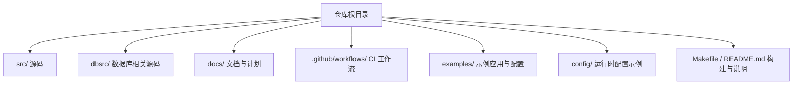
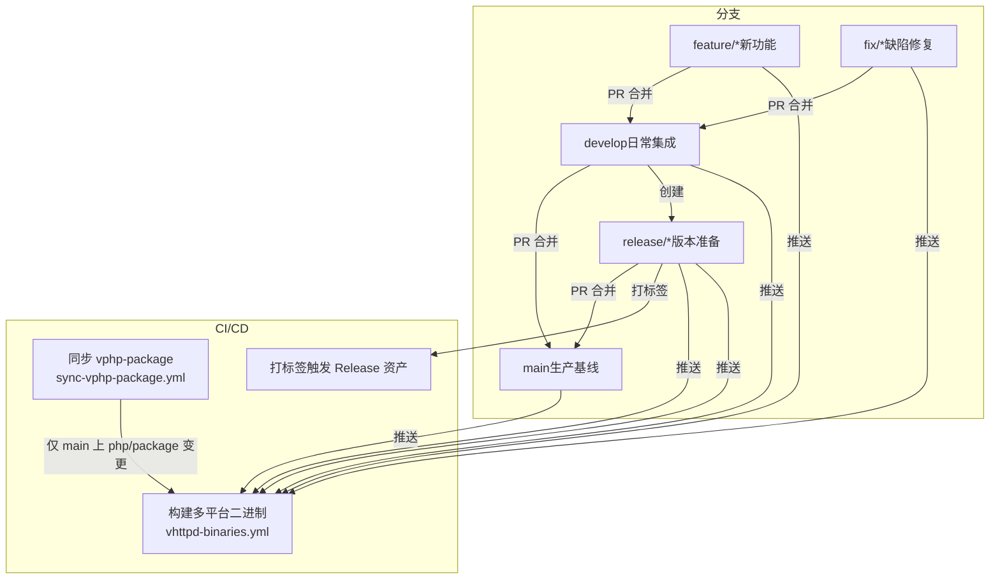
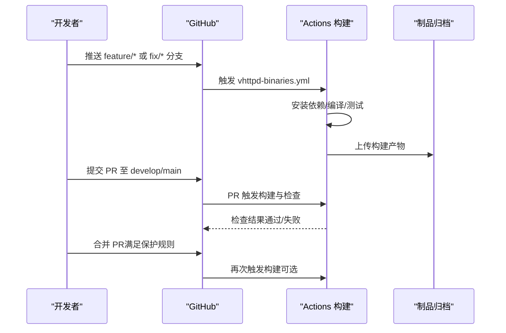
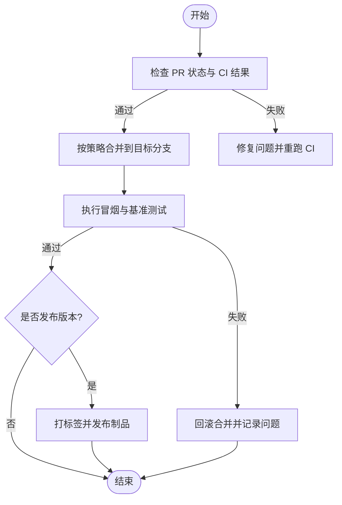
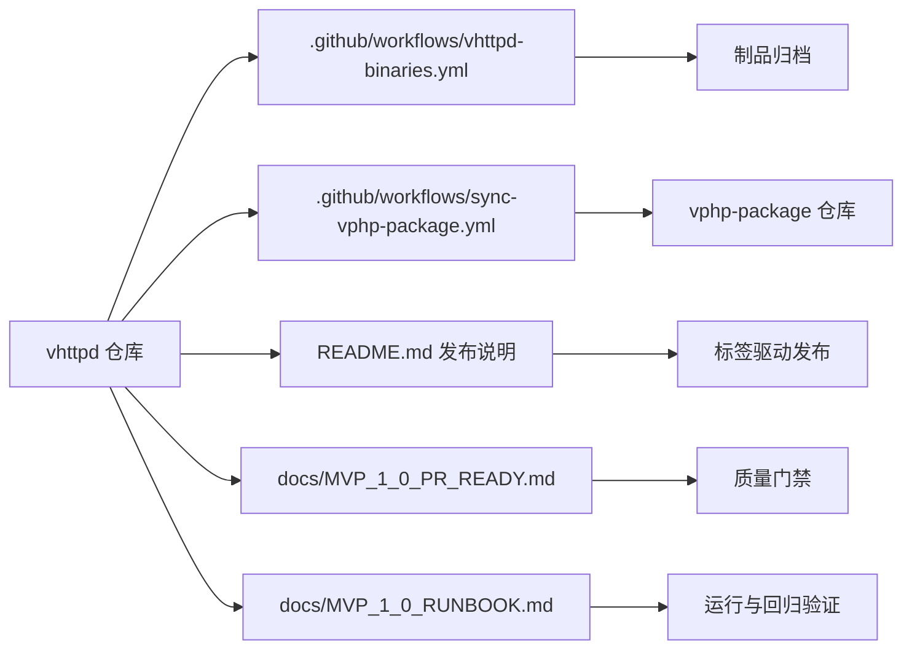

# 分支管理策略

<cite>
**本文引用的文件**   
- [README.md](file://README.md)
- [.github/workflows/vhttpd-binaries.yml](file://.github/workflows/vhttpd-binaries.yml)
- [.github/workflows/sync-vphp-package.yml](file://.github/workflows/sync-vphp-package.yml)
- [docs/MVP_1_0_PR_READY.md](file://docs/MVP_1_0_PR_READY.md)
- [docs/MVP_1_0_RUNBOOK.md](file://docs/MVP_1_0_RUNBOOK.md)
</cite>

## 目录
1. [引言](#引言)
2. [项目结构](#项目结构)
3. [核心组件](#核心组件)
4. [架构总览](#架构总览)
5. [详细组件分析](#详细组件分析)
6. [依赖分析](#依赖分析)
7. [性能考虑](#性能考虑)
8. [故障排查指南](#故障排查指南)
9. [结论](#结论)
10. [附录](#附录)

## 引言
本文件定义 VHTTPD 项目的分支管理策略，覆盖主分支、开发分支、功能分支、修复分支与发布分支的命名规范、创建时机、合并策略与生命周期管理；并给出分支保护规则、权限控制与自动化流程配置建议。同时提供最佳实践与常见场景处理方案，确保团队在持续集成与交付过程中保持一致性与可追溯性。

## 项目结构
仓库采用“源码 + 文档 + 示例 + 工作流”的组织方式：
- 源码位于 src/ 与 dbsrc/，构建脚本与依赖说明集中在 README.md 与 Makefile
- 文档集中于 docs/，包含运行手册与验收清单
- GitHub Actions 工作流位于 .github/workflows/，负责二进制构建与子模块同步
- 示例与配置文件位于 examples/ 与 config/

[本节为概念性概述，不直接分析具体文件，故无章节来源]

## 核心组件
围绕分支管理的核心要素包括：
- 分支模型与命名规范
- 触发条件与生命周期
- 合并策略与质量门禁
- 保护规则与权限控制
- 自动化流水线（CI/CD）

结合仓库现有工作流与文档，当前已具备以下能力：
- main 分支推送或 PR 时触发多平台二进制构建与打包
- 对 php/package 变更进行自动同步到独立仓库
- 通过标签触发 Release 资产生成（见 README 中发布说明）

**章节来源**
- [README.md:414-426](file://README.md#L414-L426)
- [.github/workflows/vhttpd-binaries.yml:1-21](file://.github/workflows/vhttpd-binaries.yml#L1-L21)
- [.github/workflows/sync-vphp-package.yml:1-48](file://.github/workflows/sync-vphp-package.yml#L1-L48)

## 架构总览
下图展示基于 GitFlow 的分支模型与关键自动化节点。该图映射了仓库中的实际工作流触发点与产物路径。

**图表来源**
- [.github/workflows/vhttpd-binaries.yml:1-21](file://.github/workflows/vhttpd-binaries.yml#L1-L21)
- [.github/workflows/sync-vphp-package.yml:1-48](file://.github/workflows/sync-vphp-package.yml#L1-L48)
- [README.md:414-426](file://README.md#L414-L426)

## 详细组件分析

### 分支模型与命名规范
- 主分支 main
  - 用途：生产环境发布基线，稳定可用
  - 命名：main
  - 创建时机：初始化仓库即存在
  - 合并策略：仅接受来自 release/* 的合并；禁止直接推送
  - 生命周期：长期存在
- 开发分支 develop
  - 用途：日常开发与集成测试
  - 命名：develop
  - 创建时机：从 main 首次切出后建立
  - 合并策略：接受来自 feature/* 与 fix/* 的合并
  - 生命周期：长期存在
- 功能分支 feature/*
  - 用途：实现新特性或增量改进
  - 命名：feature/<描述>（例如 feature/add-mcp-streaming）
  - 创建时机：从 develop 切出
  - 合并策略：完成自测与评审后合入 develop
  - 生命周期：短期，完成后删除
- 修复分支 fix/*
  - 用途：修复缺陷或紧急问题
  - 命名：fix/<问题编号或简述>（例如 fix/crash-on-upstream-timeout）
  - 创建时机：从 develop 切出；若需热修可直接从 main 切出并走 hotfix 流程（见下文）
  - 合并策略：合入 develop；必要时再合入 main 并打标签
  - 生命周期：短期，完成后删除
- 发布分支 release/*
  - 用途：版本发布准备、回归验证、补丁累积
  - 命名：release/vX.Y.Z（例如 release/v1.2.0）
  - 创建时机：从 develop 切出，进入冻结期
  - 合并策略：验证通过后合入 main 与 develop，随后删除
  - 生命周期：短中期，发布完成后删除

[本节为通用策略说明，未直接分析具体文件，故无章节来源]

### 分支保护规则与权限控制
- 受保护分支
  - main：禁止直接推送；必须通过 Pull Request 合并；至少一名维护者审批；要求 CI 全部通过
  - develop：建议开启保护，限制直接推送；PR 合并需通过 CI
  - release/*：仅允许维护者操作；合并前需完成回归检查
- 权限建议
  - 维护者：拥有 main/release 的合并权与标签权
  - 开发者：可创建 feature/* 与 fix/*，提交 PR 至 develop/main
  - 机器人账号：用于自动化任务（如子模块同步），使用最小必要权限
- 强制检查项
  - 代码风格与静态检查
  - 单元测试与快速端到端冒烟测试
  - 多平台构建成功（Linux/macOS）
  - 二进制可用性校验（--help、错误参数返回非零等）

[本节为通用策略说明，未直接分析具体文件，故无章节来源]

### 自动化流程配置与触发点
- 二进制构建与打包（多平台）
  - 触发：push 到 main、develop、feature/*、fix/*、release/*；以及 PR 事件
  - 行为：安装依赖、编译、运行快速测试、打包产物、上传工件
  - 参考：.github/workflows/vhttpd-binaries.yml
- 子模块同步
  - 触发：push 到 main 且变更路径包含 php/package/** 或脚本与工作流文件
  - 行为：将 php/package 同步到独立仓库 vphp-package，支持可选 release_tag
  - 参考：.github/workflows/sync-vphp-package.yml
- 标签驱动发布
  - 触发：推送标签（例如 vhttpd-0.1.0）
  - 行为：自动生成 Release 资产与说明
  - 参考：README.md 中“Release options”段落

**图表来源**
- [.github/workflows/vhttpd-binaries.yml:1-21](file://.github/workflows/vhttpd-binaries.yml#L1-L21)
- [.github/workflows/vhttpd-binaries.yml:127-171](file://.github/workflows/vhttpd-binaries.yml#L127-L171)

**章节来源**
- [.github/workflows/vhttpd-binaries.yml:1-21](file://.github/workflows/vhttpd-binaries.yml#L1-L21)
- [.github/workflows/vhttpd-binaries.yml:127-171](file://.github/workflows/vhttpd-binaries.yml#L127-L171)
- [.github/workflows/sync-vphp-package.yml:1-48](file://.github/workflows/sync-vphp-package.yml#L1-L48)
- [README.md:414-426](file://README.md#L414-L426)

### 合并策略与质量门禁
- 合并目标
  - feature/* → develop
  - fix/* → develop（紧急修复可从 main 切出，先合入 main 再合入 develop）
  - release/* → main 与 develop
- 质量门禁
  - 构建通过：多平台产物生成成功
  - 冒烟测试通过：二进制 --help 正常、错误参数返回非零
  - 文档与清单：MVP 验收清单逐项验证
- 回滚策略
  - 通过标签与制品归档定位历史版本
  - 优先回滚制品而非代码；必要时回退提交并重新发布

**图表来源**
- [docs/MVP_1_0_PR_READY.md:1-104](file://docs/MVP_1_0_PR_READY.md#L1-L104)
- [.github/workflows/vhttpd-binaries.yml:127-171](file://.github/workflows/vhttpd-binaries.yml#L127-L171)

**章节来源**
- [docs/MVP_1_0_PR_READY.md:1-104](file://docs/MVP_1_0_PR_READY.md#L1-L104)
- [docs/MVP_1_0_RUNBOOK.md:1-143](file://docs/MVP_1_0_RUNBOOK.md#L1-L143)

### 生命周期管理与清理
- 分支存活期
  - feature/*、fix/*：合并后立即删除本地与远端分支
  - release/*：发布完成后立即删除
- 清理建议
  - 定期清理 stale 分支
  - 保留 main 与 develop 作为长期分支
  - 标签用于永久版本标识

[本节为通用策略说明，未直接分析具体文件，故无章节来源]

### 常见场景与处理方案
- 新增功能
  - 从 develop 切出 feature/*，提交 PR 至 develop，CI 通过后合并
- 紧急修复
  - 从 main 切出 fix/hotfix-*，先在 main 合并并打标签，再合入 develop
- 版本发布
  - 从 develop 切出 release/vX.Y.Z，冻结变更，回归通过后合入 main 与 develop，打标签并生成制品
- 子模块同步
  - 修改 php/package 后推送到 main，自动同步到 vphp-package 仓库

**章节来源**
- [.github/workflows/sync-vphp-package.yml:1-48](file://.github/workflows/sync-vphp-package.yml#L1-L48)
- [README.md:414-426](file://README.md#L414-L426)

## 依赖分析
- 外部依赖
  - GitHub Actions：构建、测试、打包、上传制品
  - 独立仓库 vphp-package：由工作流自动同步
- 内部依赖
  - 工作流与 README 发布说明共同构成“标签→制品”的发布链路
  - MVP 验收清单与运行手册为质量门禁与回归验证依据

**图表来源**
- [.github/workflows/vhttpd-binaries.yml:1-21](file://.github/workflows/vhttpd-binaries.yml#L1-L21)
- [.github/workflows/sync-vphp-package.yml:1-48](file://.github/workflows/sync-vphp-package.yml#L1-L48)
- [README.md:414-426](file://README.md#L414-L426)
- [docs/MVP_1_0_PR_READY.md:1-104](file://docs/MVP_1_0_PR_READY.md#L1-L104)
- [docs/MVP_1_0_RUNBOOK.md:1-143](file://docs/MVP_1_0_RUNBOOK.md#L1-L143)

**章节来源**
- [.github/workflows/vhttpd-binaries.yml:1-21](file://.github/workflows/vhttpd-binaries.yml#L1-L21)
- [.github/workflows/sync-vphp-package.yml:1-48](file://.github/workflows/sync-vphp-package.yml#L1-L48)
- [README.md:414-426](file://README.md#L414-L426)
- [docs/MVP_1_0_PR_READY.md:1-104](file://docs/MVP_1_0_PR_READY.md#L1-L104)
- [docs/MVP_1_0_RUNBOOK.md:1-143](file://docs/MVP_1_0_RUNBOOK.md#L1-L143)

## 性能考虑
- 构建并行矩阵：多平台并行构建提升产出效率
- 缓存与依赖预装：在 CI 中预装系统依赖与工具链，减少冷启动时间
- 制品体积优化：仅打包必要脚本与库，避免冗余

[本节为通用指导，未直接分析具体文件，故无章节来源]

## 故障排查指南
- 构建失败
  - 检查依赖安装步骤与 pkg-config 配置
  - 确认 QuickJS 源与 vjsx 模块链接正确
  - 查看构建日志与错误输出
- 冒烟测试失败
  - 验证二进制 --help 输出与错误参数返回码
  - 检查环境变量与路径配置
- 子模块同步失败
  - 确认 secrets 配置与令牌权限
  - 检查目标仓库地址与分支名

**章节来源**
- [.github/workflows/vhttpd-binaries.yml:47-82](file://.github/workflows/vhttpd-binaries.yml#L47-L82)
- [.github/workflows/vhttpd-binaries.yml:139-149](file://.github/workflows/vhttpd-binaries.yml#L139-L149)
- [.github/workflows/sync-vphp-package.yml:30-48](file://.github/workflows/sync-vphp-package.yml#L30-L48)

## 结论
本策略以 GitFlow 为基础，结合仓库现有的 CI 工作流与发布说明，明确了各分支的职责、命名、合并与生命周期管理，并通过保护规则与自动化流程保障质量与一致性。建议在团队内推广该策略，并在后续迭代中逐步完善保护规则与门禁项，以提升交付稳定性与可追溯性。

[本节为总结性内容，未直接分析具体文件，故无章节来源]

## 附录
- 术语
  - 制品：构建产出的可执行包与脚本集合
  - 冒烟测试：快速验证基本功能的测试用例
  - 质量门禁：合并前的自动化检查与人工审核要求
- 参考
  - 构建与分发说明：README.md
  - 二进制构建工作流：.github/workflows/vhttpd-binaries.yml
  - 子模块同步工作流：.github/workflows/sync-vphp-package.yml
  - MVP 验收清单：docs/MVP_1_0_PR_READY.md
  - MVP 运行手册：docs/MVP_1_0_RUNBOOK.md

**章节来源**
- [README.md:414-426](file://README.md#L414-L426)
- [.github/workflows/vhttpd-binaries.yml:1-21](file://.github/workflows/vhttpd-binaries.yml#L1-L21)
- [.github/workflows/sync-vphp-package.yml:1-48](file://.github/workflows/sync-vphp-package.yml#L1-L48)
- [docs/MVP_1_0_PR_READY.md:1-104](file://docs/MVP_1_0_PR_READY.md#L1-L104)
- [docs/MVP_1_0_RUNBOOK.md:1-143](file://docs/MVP_1_0_RUNBOOK.md#L1-L143)