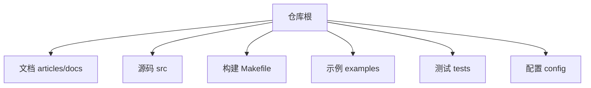
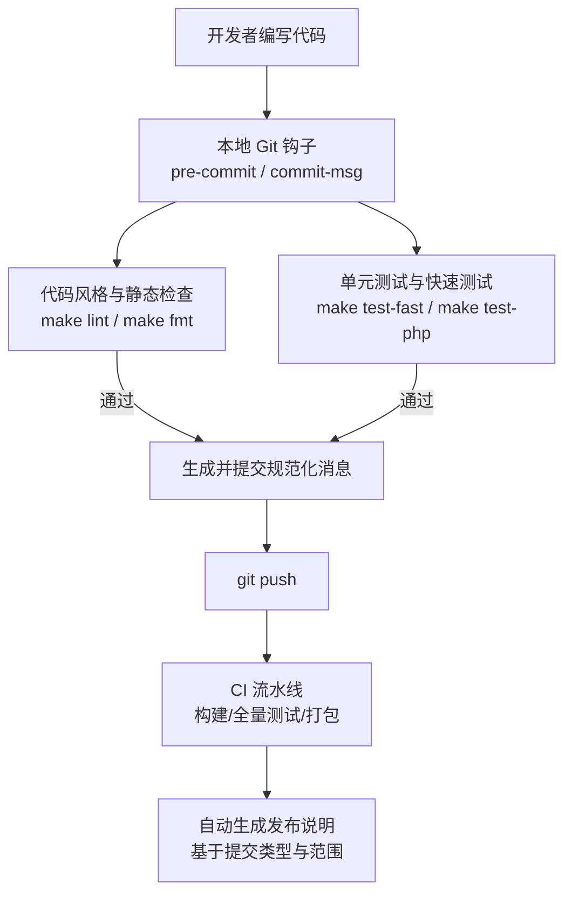
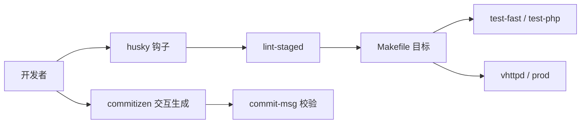

# 提交信息规范

<cite>
**本文引用的文件**   
- [README.md](file://README.md)
- [Makefile](file://Makefile)
- [14-future.md](file://articles/14-future.md)
</cite>

## 目录
1. [引言](#引言)
2. [项目结构](#项目结构)
3. [核心组件](#核心组件)
4. [架构总览](#架构总览)
5. [详细组件分析](#详细组件分析)
6. [依赖分析](#依赖分析)
7. [性能考虑](#性能考虑)
8. [故障排查指南](#故障排查指南)
9. [结论](#结论)
10. [附录](#附录)

## 引言
本规范旨在为 vhttpd 仓库制定统一的 Git 提交信息格式，确保变更历史清晰、可检索、可自动化生成发布说明。规范覆盖：
- 提交类型前缀与使用场景
- 主题行与详细描述的结构与约束
- 影响范围（scope）的命名约定
- 示例与工具集成建议（commitizen、husky、lint-staged）
- 提交前检查与自动化流程

## 项目结构
vhttpd 是一个多协议、多执行器的运行时网关，包含 HTTP/WebSocket/流式响应、MCP、上游调度、Worker 池与管理面等模块。仓库中已存在对“提交规范”的简要描述，可作为本规范的参考来源之一。



[本节不直接分析具体代码文件，故无章节来源]

## 核心组件
从提交信息规范的角度，仓库中与贡献流程相关的“核心组件”包括：
- 构建与测试入口：通过 Makefile 提供统一命令，便于在 CI 或本地运行 lint/test/build
- 贡献指引片段：在文章中对提交类型与示例做了简要说明，可作为规范基线

**章节来源**
- [Makefile:158-199](file://Makefile#L158-L199)
- [14-future.md:286-304](file://articles/14-future.md#L286-L304)

## 架构总览
下图展示“开发者提交 → 本地钩子 → 校验/格式化 → 推送 → CI”的整体工作流，以及各阶段如何与仓库现有脚本和规则衔接。



[该图为概念性流程图，未映射到具体源文件，故无图示来源]

## 详细组件分析

### 提交信息结构与语法
- 基本结构
  - 类型前缀(scope): 主题行
  - 空一行
  - 详细描述（可选但推荐）
  - 影响范围列表（可选）
  - 破坏性变更标记（可选）
- 主题行
  - 使用祈使句，动词开头，首字母小写
  - 长度建议不超过 72 字符
  - 不要以句号结尾
- 详细描述
  - 解释“为什么做”而非“做了什么”，补充必要上下文
  - 每行建议不超过 72 字符，段落之间用空行分隔
  - 如需列出关联问题，可在末尾添加引用
- 影响范围 scope
  - 使用小写字母、数字、连字符，如 admin、worker、mcp、websocket、config、php、vjsx、stream、relay、provider、feishu、openai、codex、dispatch、executor、runtime、admin_state、state_store、dbx、cachex、jsonutils、logging、plugin、server_lifecycle、upstream、worker、ws、api、command、config、dispatch、executor、feishu、jsonutils、logging、plugin、provider、relay、runtime_plan、server_lifecycle、state_store、upstream、worker、ws、admin、admin_state_store、api、cachex、codex、command、config、dbx、dispatch、executor、feishu、jsonutils、logging、plugin、provider、relay、runtime_plan、server_lifecycle、state_store、upstream、worker、ws
  - 若涉及多个范围，可用逗号分隔；若不确定，可省略

### 类型前缀与使用场景
- feat: 新增功能或能力
- fix: 修复缺陷或回归
- docs: 仅文档更新（含 README、articles、docs）
- style: 不影响逻辑的代码风格调整（空格、分号、注释等）
- refactor: 重构（不改变外部行为）
- perf: 性能优化（需附带基准或指标）
- test: 增加或修改测试用例
- chore: 构建、依赖、工具链、CI 等非业务变更
- ci: 仅 CI 相关变更（workflow、脚本）
- build: 构建系统或打包相关变更
- revert: 回滚某次提交
- breaking: 破坏性变更（通常配合 #BREAKING CHANGE 正文）

说明：
- 以上类型与仓库文章中给出的类型保持一致并适度扩展，便于工程化落地。
- 当变更同时涉及多种类型时，优先选择最能表达意图的类型，并在正文中说明其他方面。

**章节来源**
- [14-future.md:286-304](file://articles/14-future.md#L286-L304)

### 主题行与详细描述示例
- 示例（新功能）
  - 类型: feat
  - 范围: mcp
  - 主题: 添加采样能力支持
  - 详情: 引入采样策略与阈值控制，提升长会话下的稳定性与资源利用率
- 示例（缺陷修复）
  - 类型: fix
  - 范围: worker
  - 主题: 修复内存泄漏问题
  - 详情: 定位到事件回调未释放导致的累积增长，补充清理路径
- 示例（文档更新）
  - 类型: docs
  - 范围: readme
  - 主题: 更新快速开始指南
  - 详情: 修正安装步骤中的环境变量与端口说明

注意：上述示例用于说明结构与语气，实际提交请使用仓库内真实变更内容。

**章节来源**
- [14-future.md:300-304](file://articles/14-future.md#L300-L304)

### 影响范围（scope）命名约定
- 使用仓库中存在的模块名作为范围，保持与源码目录一致的小写形式
- 常见范围举例：admin、worker、mcp、websocket、config、php、vjsx、stream、relay、provider、feishu、openai、codex、dispatch、executor、runtime、admin_state、state_store、dbx、cachex、jsonutils、logging、plugin、server_lifecycle、upstream、worker、ws、api、command、config、dispatch、executor、feishu、jsonutils、logging、plugin、provider、relay、runtime_plan、server_lifecycle、state_store、upstream、worker、ws
- 若变更跨越多个范围，使用逗号分隔，例如：worker, stream

**章节来源**
- [14-future.md:286-304](file://articles/14-future.md#L286-L304)

### 提交前检查与自动化工具集成
- 本地钩子
  - pre-commit：运行代码风格与静态检查、快速测试
  - commit-msg：校验提交信息是否符合规范（类型、范围、主题行长度等）
- 常用工具
  - commitizen：交互式生成符合规范的提交信息
  - husky：管理 Git 钩子
  - lint-staged：仅对暂存文件运行检查，提高速度
- 与仓库现有命令对接
  - 使用 Makefile 提供的目标进行统一调用，例如：
    - 快速测试：make test-fast
    - PHP 测试：make test-php
    - 构建与产物：make vhttpd / make prod
- 建议在 CI 中复用相同命令，保证本地与远程一致性

**章节来源**
- [Makefile:158-199](file://Makefile#L158-L199)

### 与仓库现有规则的衔接
- 仓库已在文章中对提交类型与示例给出基础定义，本规范在此基础上细化了范围命名、正文约束与工具链建议
- 构建与测试命令集中在 Makefile，提交前检查应复用这些目标，避免重复实现

**章节来源**
- [14-future.md:286-304](file://articles/14-future.md#L286-L304)
- [Makefile:158-199](file://Makefile#L158-L199)

## 依赖分析
提交信息规范本身不引入代码依赖，但在工程实践中需要以下工具链支撑：
- 本地开发环境：husky、commitizen、lint-staged、commitlint（或等效校验器）
- CI 环境：复用 Makefile 目标，确保与本地一致



[该图为概念性依赖图，未映射到具体源文件，故无图示来源]

## 性能考虑
- 提交前检查应尽量轻量，优先使用 lint-staged 仅处理暂存文件
- 将耗时测试拆分为 fast/slow，默认只跑 fast，必要时显式触发全量测试
- 利用缓存与并行执行减少等待时间

[本节为通用指导，不涉及具体文件分析]

## 故障排查指南
- 提交被拒绝
  - 检查是否通过 commit-msg 校验（类型、范围、主题行长度）
  - 确认 pre-commit 是否全部通过（lint/test）
- 本地与 CI 不一致
  - 确认本地与 CI 使用的 Makefile 目标一致
  - 检查环境变量与依赖版本差异
- 提交信息不规范导致无法生成发布说明
  - 使用 commitizen 生成标准格式
  - 在正文中添加 #BREAKING CHANGE 以标记破坏性变更

[本节为通用指导，不涉及具体文件分析]

## 结论
通过统一的提交信息规范与工具链集成，vhttpd 可获得更清晰的变更历史、更好的可追溯性与自动化发布能力。建议团队在本地与 CI 两端共同落实规范，持续迭代完善。

[本节为总结性内容，不涉及具体文件分析]

## 附录

### 完整提交信息模板
```
type(scope): 主题行

详细描述（可选）

影响范围（可选）

破坏性变更（可选）
```

### 类型与范围速查
- 类型：feat、fix、docs、style、refactor、perf、test、chore、ci、build、revert、breaking
- 范围：参考上文“影响范围命名约定”

**章节来源**
- [14-future.md:286-304](file://articles/14-future.md#L286-L304)