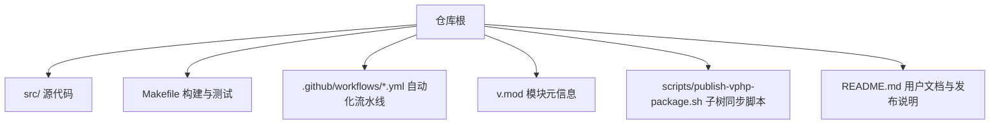
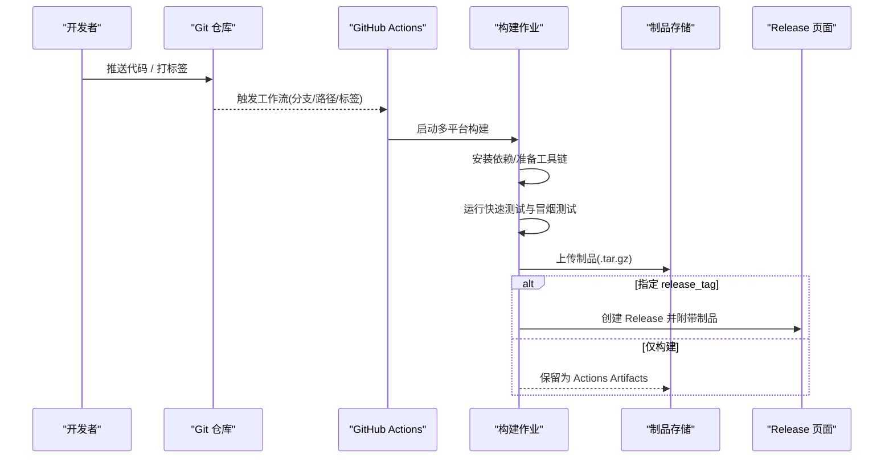
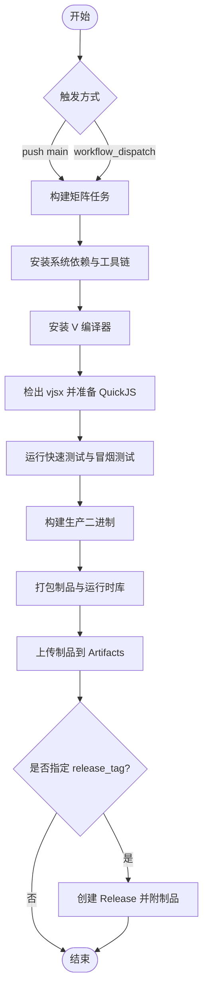
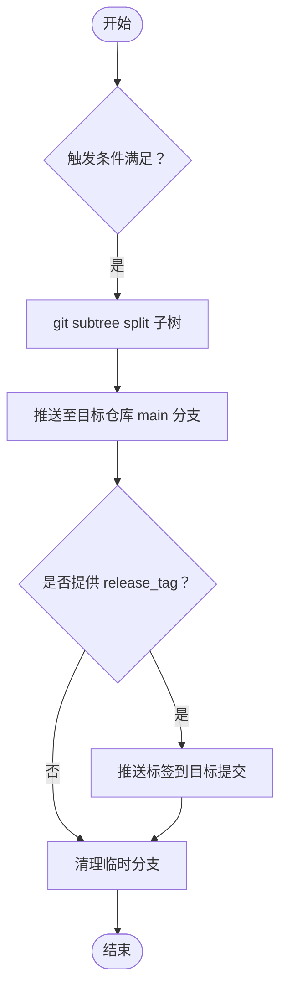
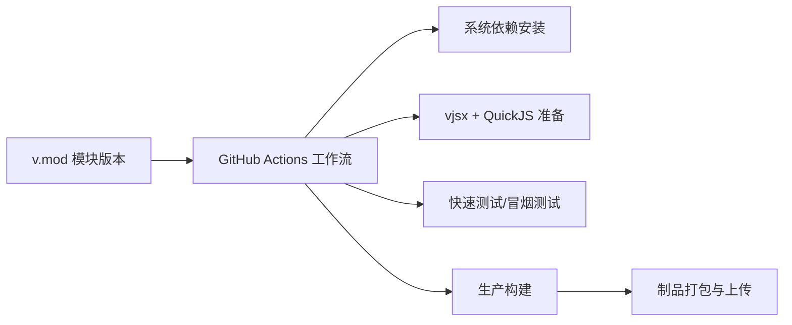

# 版本发布流程

<cite>
**本文引用的文件**   
- [README.md](file://README.md)
- [.github/workflows/vhttpd-binaries.yml](file://.github/workflows/vhttpd-binaries.yml)
- [.github/workflows/sync-vphp-package.yml](file://.github/workflows/sync-vphp-package.yml)
- [Makefile](file://Makefile)
- [scripts/publish-vphp-package.sh](file://scripts/publish-vphp-package.sh)
- [v.mod](file://v.mod)
</cite>

## 目录
1. [引言](#引言)
2. [项目结构](#项目结构)
3. [核心组件](#核心组件)
4. [架构总览](#架构总览)
5. [详细组件分析](#详细组件分析)
6. [依赖关系分析](#依赖关系分析)
7. [性能与稳定性考量](#性能与稳定性考量)
8. [故障排查指南](#故障排查指南)
9. [结论](#结论)
10. [附录](#附录)

## 引言
本文件为 vhttpd 项目的“版本发布流程和规范”的权威说明，覆盖以下目标：
- 版本号管理策略（语义化版本控制 SemVer）及主/次/补丁含义
- 发布检查清单（代码冻结、测试验证、文档更新、依赖检查）
- 发布分支管理（从开发分支创建、发布候选、热修复流程）
- 发布标签与变更记录维护规范
- 自动化发布流程配置（GitHub Actions 工作流、二进制打包、包管理器发布）
- 回滚与紧急修复处理方案

## 项目结构
与版本发布直接相关的仓库结构与关键位置如下：
- 源码与构建入口：src、Makefile
- 模块元信息：v.mod（包含模块名与当前版本）
- 自动化流水线：.github/workflows/vhttpd-binaries.yml、.github/workflows/sync-vphp-package.yml
- 辅助脚本：scripts/publish-vphp-package.sh
- 用户文档与发布指引：README.md

**图表来源** 
- [Makefile:1-199](file://Makefile#L1-L199)
- [v.mod:1-7](file://v.mod#L1-L7)
- [.github/workflows/vhttpd-binaries.yml:1-171](file://.github/workflows/vhttpd-binaries.yml#L1-L171)
- [.github/workflows/sync-vphp-package.yml:1-48](file://.github/workflows/sync-vphp-package.yml#L1-L48)
- [scripts/publish-vphp-package.sh:1-35](file://scripts/publish-vphp-package.sh#L1-L35)
- [README.md:279-426](file://README.md#L279-L426)

**章节来源**
- [Makefile:1-199](file://Makefile#L1-L199)
- [v.mod:1-7](file://v.mod#L1-L7)
- [.github/workflows/vhttpd-binaries.yml:1-171](file://.github/workflows/vhttpd-binaries.yml#L1-L171)
- [.github/workflows/sync-vphp-package.yml:1-48](file://.github/workflows/sync-vphp-package.yml#L1-L48)
- [scripts/publish-vphp-package.sh:1-35](file://scripts/publish-vphp-package.sh#L1-L35)
- [README.md:279-426](file://README.md#L279-L426)

## 核心组件
- 构建与测试
  - Makefile 提供 build/prod/test-fast/test-e2e 等目标，用于本地与 CI 环境下的编译与快速测试。
- 模块版本
  - v.mod 声明模块名称与版本，作为模块级版本信息的单一事实源。
- 二进制制品发布
  - GitHub Actions 工作流在 push main 或手动触发时，构建多平台产物并上传到 Actions Artifacts；支持通过 workflow_dispatch 指定 release_tag 以生成 Release 资产。
- PHP 包同步
  - 另一个工作流将 php/package 子树同步至独立仓库 vphp-package，并可附带可选的 release_tag。

**章节来源**
- [Makefile:96-104](file://Makefile#L96-L104)
- [Makefile:160-177](file://Makefile#L160-L177)
- [v.mod:1-7](file://v.mod#L1-L7)
- [.github/workflows/vhttpd-binaries.yml:1-171](file://.github/workflows/vhttpd-binaries.yml#L1-L171)
- [.github/workflows/sync-vphp-package.yml:1-48](file://.github/workflows/sync-vphp-package.yml#L1-L48)

## 架构总览
下图展示从代码变更到制品发布的端到端流程，包括分支、标签、CI 构建、制品归档与发布。

**图表来源** 
- [.github/workflows/vhttpd-binaries.yml:1-171](file://.github/workflows/vhttpd-binaries.yml#L1-L171)
- [README.md:279-426](file://README.md#L279-L426)

## 详细组件分析

### 1. 版本号管理策略（SemVer）
- 采用语义化版本控制（SemVer）：主版本.次版本.补丁版本
  - 主版本：不兼容的 API/行为变更
  - 次版本：向后兼容的功能新增
  - 补丁版本：向后兼容的问题修复
- 模块版本来源
  - v.mod 中的 version 字段为模块级版本信息，应与 Git 标签保持一致，便于外部引用与可追溯性。
- 标签命名建议
  - 使用 vX.Y.Z 格式（例如 v0.1.0），与 README 中示例保持一致。

**章节来源**
- [v.mod:1-7](file://v.mod#L1-L7)
- [README.md:414-426](file://README.md#L414-L426)

### 2. 发布检查清单
建议在每次正式发版前逐项核对：
- 代码冻结
  - 合并所有待发布功能到发布分支，关闭非必要的变更窗口。
- 测试验证
  - 本地执行快速测试与端到端测试，确保构建与冒烟用例通过。
- 文档更新
  - 更新 README 中与版本相关的使用说明、发行说明与已知问题。
- 依赖检查
  - 确认系统依赖与第三方库版本满足构建要求（OpenSSL、DB 客户端、Boehm GC 等）。
- 制品校验
  - 下载各平台制品进行基础可用性验证（帮助输出、错误参数返回失败等）。

**章节来源**
- [Makefile:160-177](file://Makefile#L160-L177)
- [README.md:279-366](file://README.md#L279-L366)

### 3. 发布分支管理
- 推荐分支模型
  - main：稳定主干，持续集成构建
  - release/X.Y：发布候选分支，用于冻结与回归
  - hotfix/Y：紧急修复分支，基于最近稳定标签或 release 分支创建
- 分支与触发
  - 当前二进制构建工作流监听 main 分支的代码变更，适合在 release 分支合并后触发最终构建。
- 发布候选与热修复
  - 在 release 分支完成回归测试后，打标签并触发工作流生成制品；hotfix 流程同理，但需优先回归最小范围变更。

[本节为通用流程建议，未直接分析具体文件]

### 4. 发布标签与变更记录维护规范
- 标签规范
  - 使用 vX.Y.Z 格式，对应一次完整且经过验证的发布。
- 变更记录
  - 利用 GitHub Releases 自动生成变更摘要，并在发布说明中补充重要变更、破坏性变更与升级注意事项。
- 标签与模块版本一致性
  - 确保 v.mod 的版本与 Git 标签一致，避免下游混淆。

**章节来源**
- [README.md:414-426](file://README.md#L414-L426)
- [v.mod:1-7](file://v.mod#L1-L7)

### 5. 自动化发布流程配置

#### 5.1 二进制制品构建与发布（GitHub Actions）
- 触发条件
  - push main 且受影响的文件路径包含 src、dbsrc、Makefile、v.mod、工作流文件本身
  - 支持 workflow_dispatch 手动触发，并可传入 release_tag 参数
- 构建矩阵
  - Linux amd64、macOS Intel、macOS ARM64
- 构建步骤要点
  - 安装系统依赖（Linux/macOS）
  - 安装 V 编译器
  - 检出 vjsx 模块并确保 QuickJS 源码
  - 运行快速单元测试与冒烟测试
  - 构建生产二进制
  - 打包制品（包含运行时库与脚本）
  - 上传制品到 Actions Artifacts
  - 若指定 release_tag，则创建 Release 并发布制品
- 产物内容
  - 二进制、README、安装与诊断脚本、runtime/libs 等

**图表来源** 
- [.github/workflows/vhttpd-binaries.yml:1-171](file://.github/workflows/vhttpd-binaries.yml#L1-L171)
- [README.md:279-426](file://README.md#L279-L426)

**章节来源**
- [.github/workflows/vhttpd-binaries.yml:1-171](file://.github/workflows/vhttpd-binaries.yml#L1-L171)
- [README.md:279-426](file://README.md#L279-L426)

#### 5.2 PHP 包同步（vphp-package）
- 触发条件
  - push main 且影响 php/package 目录或发布脚本与工作流文件
  - 支持 workflow_dispatch 手动触发，并可传入 release_tag
- 同步逻辑
  - 使用 git subtree split 将 php/package 拆分到临时分支
  - 强制推送到目标仓库的 main 分支
  - 如提供 release_tag，则将标签指向该提交
- 安全要求
  - 需要配置 VPHP_PACKAGE_PUSH_TOKEN 密钥

**图表来源** 
- [.github/workflows/sync-vphp-package.yml:1-48](file://.github/workflows/sync-vphp-package.yml#L1-L48)
- [scripts/publish-vphp-package.sh:1-35](file://scripts/publish-vphp-package.sh#L1-L35)

**章节来源**
- [.github/workflows/sync-vphp-package.yml:1-48](file://.github/workflows/sync-vphp-package.yml#L1-L48)
- [scripts/publish-vphp-package.sh:1-35](file://scripts/publish-vphp-package.sh#L1-L35)

### 6. 回滚与紧急修复处理方案
- 回滚策略
  - 通过回退到上一个稳定标签对应的提交，重新触发构建并创建新的补丁版本标签
- 紧急修复（Hotfix）
  - 从最近稳定标签或 release 分支拉出 hotfix 分支
  - 最小化变更，快速回归测试
  - 合并后打补丁标签并触发构建
- 制品替换
  - 新标签构建完成后，替换线上部署使用的制品版本，并记录变更日志

[本节为通用流程建议，未直接分析具体文件]

## 依赖关系分析
- 构建依赖
  - OpenSSL、DB 客户端（MySQL/PostgreSQL/SQLite）、Boehm GC、pkg-config、patchelf 等
- 模块依赖
  - vjsx 模块与 QuickJS 源码由工作流自动准备
- 测试依赖
  - 快速测试与端到端测试在构建前后执行，确保基本正确性

**图表来源** 
- [v.mod:1-7](file://v.mod#L1-L7)
- [.github/workflows/vhttpd-binaries.yml:1-171](file://.github/workflows/vhttpd-binaries.yml#L1-L171)

**章节来源**
- [v.mod:1-7](file://v.mod#L1-L7)
- [.github/workflows/vhttpd-binaries.yml:1-171]

## 性能与稳定性考量
- 构建优化
  - 使用并行矩阵构建不同平台，缩短整体交付时间
- 制品体积
  - 打包时包含必要运行时库，减少部署环境差异带来的问题
- 测试分层
  - 快速测试先行，失败即阻断后续构建，提高反馈速度

[本节为通用指导，未直接分析具体文件]

## 故障排查指南
- 构建失败
  - 检查系统依赖是否安装成功（Linux/macOS 分别有相应安装步骤）
  - 确认 V 编译器与 vjsx 模块是否正确准备
- 测试失败
  - 查看快速测试与冒烟测试输出，定位失败用例
- 制品异常
  - 下载对应平台制品，执行帮助命令与错误参数用例进行冒烟验证
- 包同步失败
  - 确认 VPHP_PACKAGE_PUSH_TOKEN 已配置且有效
  - 检查目标仓库权限与分支保护规则

**章节来源**
- [.github/workflows/vhttpd-binaries.yml:47-149](file://.github/workflows/vhttpd-binaries.yml#L47-L149)
- [.github/workflows/sync-vphp-package.yml:35-47](file://.github/workflows/sync-vphp-package.yml#L35-L47)

## 结论
通过统一的 SemVer 策略、严格的发布检查清单、清晰的分支与标签规范，以及完善的自动化流水线，vhttpd 实现了跨平台二进制制品的稳定构建与发布。配合 PHP 包的子树同步机制，进一步提升了生态内其他产物的发布效率与一致性。

[本节为总结，未直接分析具体文件]

## 附录

### A. 常用命令与目标
- 构建与测试
  - make prod：构建生产二进制
  - make test-fast：运行快速测试
  - make test-e2e：运行端到端测试
- 依赖与环境
  - make deps-core / deps-vjsx / deps-db / deps-full：安装依赖
  - make doctor：环境健康检查

**章节来源**
- [Makefile:96-122](file://Makefile#L96-L122)
- [Makefile:160-177](file://Makefile#L160-L177)

### B. 发布操作参考
- 标签发布
  - 创建并推送 vX.Y.Z 标签，触发工作流自动构建与发布
- 手动触发
  - 在 Actions 界面选择工作流，设置 release_tag 后运行

**章节来源**
- [README.md:414-426](file://README.md#L414-L426)
- [.github/workflows/vhttpd-binaries.yml:1-24](file://.github/workflows/vhttpd-binaries.yml#L1-L24)