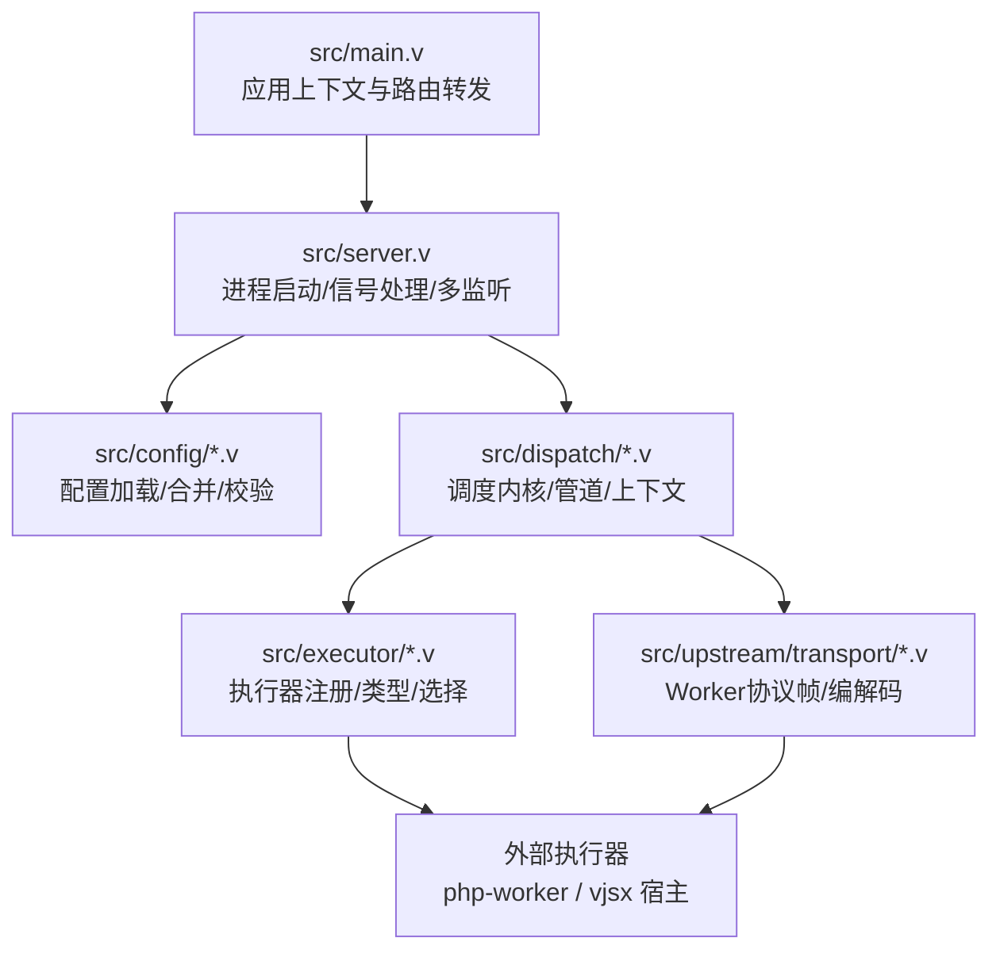
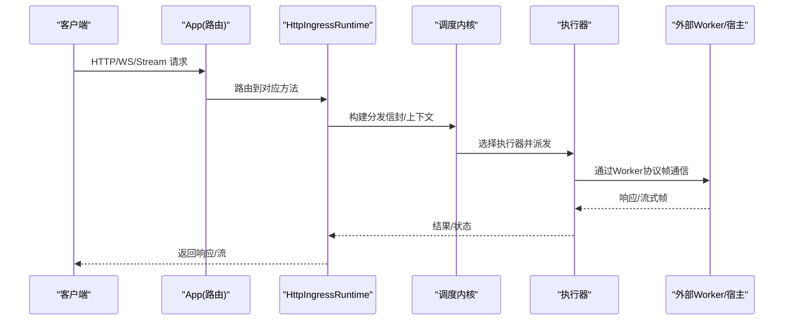
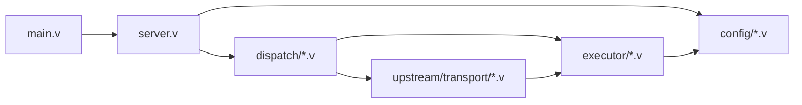

# V语言编码规范

<cite>
**本文引用的文件**   
- [README.md](file://README.md)
- [main.v](file://src/main.v)
- [server.v](file://src/server.v)
- [config.v](file://src/config/config.v)
- [runtime_config.v](file://src/config/runtime_config.v)
- [v2_config.v](file://src/config/v2_config.v)
- [kernel.v](file://src/dispatch/kernel.v)
- [pipeline.v](file://src/dispatch/pipeline.v)
- [context.v](file://src/dispatch/context.v)
- [types.v](file://src/executor/types.v)
- [registry.v](file://src/executor/registry.v)
- [worker_protocol.v](file://src/upstream/transport/worker_protocol.v)
</cite>

## 目录
1. [引言](#引言)
2. [项目结构](#项目结构)
3. [核心组件](#核心组件)
4. [架构总览](#架构总览)
5. [详细组件分析](#详细组件分析)
6. [依赖关系分析](#依赖关系分析)
7. [性能与并发注意事项](#性能与并发注意事项)
8. [代码审查检查清单](#代码审查检查清单)
9. [结论](#结论)
10. [附录：命名与格式示例对照](#附录命名与格式示例对照)

## 引言
本规范面向VHTTPD项目的V语言开发，统一命名约定、文件组织、注释风格、格式化要求与代码审查流程。规范基于仓库现有实现与模块边界提炼，确保新增或修改代码与既有风格一致，提升可维护性与协作效率。

## 项目结构
- 顶层以功能域划分模块目录（如 src/admin、src/config、src/dispatch、src/executor、src/upstream、src/ws 等），每个目录内按职责进一步拆分文件。
- 入口与服务器生命周期位于 src/main.v 与 src/server.v；配置解析集中在 src/config/*；调度内核在 src/dispatch/*；执行器模型在 src/executor/*；上游协议与帧定义在 src/upstream/transport/*。
- 测试文件与业务文件同目录放置，便于定位与维护。

图示来源
- [main.v:1-117](file://src/main.v#L1-L117)
- [server.v:1-372](file://src/server.v#L1-L372)
- [config.v:1-800](file://src/config/config.v#L1-L800)
- [kernel.v:1-151](file://src/dispatch/kernel.v#L1-L151)
- [types.v:1-449](file://src/executor/types.v#L1-L449)
- [worker_protocol.v:1-277](file://src/upstream/transport/worker_protocol.v#L1-L277)

章节来源
- [README.md:1-800](file://README.md#L1-L800)
- [main.v:1-117](file://src/main.v#L1-L117)
- [server.v:1-372](file://src/server.v#L1-L372)

## 核心组件
- 应用与上下文
  - App 组合了中间件、静态资源处理器与数据面运行时，并暴露控制面运行时。
  - Context 扩展了请求上下文与请求ID上下文，贯穿整个请求链路。
- 服务器与生命周期
  - 负责参数解析、时区配置、单/多监听模式、信号处理与优雅关停。
- 配置系统
  - 支持 TOML 配置、变量展开、站点级覆盖、默认值合并与运行时校验。
- 调度内核
  - 将不同协议（HTTP/Stream/MCP/WebSocket）统一为内核分发信封，构造 DispatchContext 并交由执行器处理。
- 执行器模型
  - 内置执行器（none/php/php-cgi/vjsx）通过工厂与生命周期抽象接入，提供统一的运行期选择与能力描述。
- 上游协议
  - Worker 协议定义了 HTTP/流式/MCP/WebSocket 的帧结构与错误分类，作为主进程与外部 worker 的契约。

章节来源
- [main.v:10-23](file://src/main.v#L10-L23)
- [server.v:137-372](file://src/server.v#L137-L372)
- [config.v:394-424](file://src/config/config.v#L394-L424)
- [kernel.v:1-151](file://src/dispatch/kernel.v#L1-L151)
- [types.v:65-127](file://src/executor/types.v#L65-L127)
- [worker_protocol.v:4-112](file://src/upstream/transport/worker_protocol.v#L4-L112)

## 架构总览
下图展示了从客户端到执行器的整体调用路径，以及管理面与观测面的关键节点。

图示来源
- [main.v:83-116](file://src/main.v#L83-L116)
- [kernel.v:30-121](file://src/dispatch/kernel.v#L30-L121)
- [worker_protocol.v:4-112](file://src/upstream/transport/worker_protocol.v#L4-L112)

## 详细组件分析

### 命名约定
- 包名与模块名
  - 使用小写英文单词，必要时用下划线分隔复合词（例如 upstream、websocket）。
  - 模块声明与文件名保持一致，避免大小写混用。
- 类型与结构体
  - 采用帕斯卡命名（PascalCase），如 ServerConfig、WorkerConfig、DispatchContext、AdminRuntimeStats。
  - 对外暴露的类型与方法一律大写开头，内部辅助类型可小写开头但需保持语义清晰。
- 函数与方法
  - 公共函数与方法使用帕斯卡命名（如 load_vhttpd_config、merge、build_executor）。
  - 私有函数使用小驼峰（如 decode_paths_config_map、escape_regex_literal）。
- 常量与枚举
  - 常量使用全大写下划线（如 known_long_flags、vhttpd_version）。
  - 枚举成员使用小驼峰（如 response、stream、upstream_plan）。
- 变量与字段
  - 局部变量使用短小精悍的小驼峰（如 cfg、err、parts）。
  - 结构体字段使用小驼峰，并通过 toml/json 标签映射外部键名（如 read_timeout_ms、app_entry）。
- 接口与回调
  - 接口名以行为动词结尾（如 PipelineDispatcher），方法名表达动作（dispatch、id）。
  - 回调类型使用 Fn 后缀（如 PluginStreamFrameFn）。

章节来源
- [config.v:6-112](file://src/config/config.v#L6-L112)
- [v2_config.v:3-118](file://src/config/v2_config.v#L3-L118)
- [types.v:9-35](file://src/executor/types.v#L9-L35)
- [pipeline.v:114-118](file://src/dispatch/pipeline.v#L114-L118)
- [worker_protocol.v:4-112](file://src/upstream/transport/worker_protocol.v#L4-L112)

### 文件组织结构规范
- 模块划分
  - 按领域分目录：admin、config、dispatch、executor、upstream、ws、provider、relay 等。
  - 每个目录包含该领域的核心类型、运行时、测试与工具文件。
- 文件命名
  - .v 源文件使用小写加下划线（如 runtime_config.v、worker_protocol.v）。
  - 测试文件与业务文件同名 + _test.v（如 store_test.v、agent_state_test.v）。
- 入口与装配
  - 应用入口 main.v 仅做最小装配与路由转发，复杂逻辑下沉至子模块。
  - server.v 集中进程级生命周期与信号处理。
- 配置分层
  - config.v 定义基础结构体与加载；runtime_config.v 提供 merge/with_site 等运行时合并策略；v2_config.v 定义新版计划型配置结构。

章节来源
- [main.v:1-23](file://src/main.v#L1-L23)
- [server.v:1-136](file://src/server.v#L1-L136)
- [config.v:448-482](file://src/config/config.v#L448-L482)
- [runtime_config.v:540-605](file://src/config/runtime_config.v#L540-L605)
- [v2_config.v:1-118](file://src/config/v2_config.v#L1-L118)

### 代码注释格式
- 单行注释
  - 使用 // 进行简短说明，置于语句上方或行尾，保持简洁明确。
- 多行注释
  - 用于段落性说明或复杂逻辑前置解释，建议放在函数/结构体顶部。
- 文档注释
  - 对公共 API 添加目的、参数与返回值说明，便于自动生成文档与 IDE 提示。
- 锁序与并发约定
  - 在关键文件中以注释形式声明锁层级与获取顺序，避免死锁。
- 变更与TODO
  - 使用 TODO/FIXME 标注待办事项，附带责任人或问题编号。

章节来源
- [server.v:3-24](file://src/server.v#L3-L24)

### 代码格式化要求
- 缩进与空格
  - 使用空格缩进，禁止使用制表符；每层缩进固定宽度。
- 换行与对齐
  - 长表达式与参数列表合理换行，保持可读性；结构体字段对齐以提升扫描效率。
- 导入分组
  - 标准库、第三方库、本地模块分组导入，组间空一行。
- 错误处理
  - 优先使用 ? 传播错误，并在上层统一处理；避免吞掉错误。
- 日志与追踪
  - 关键路径输出结构化日志，携带 request_id/trace_id 以便跨层追踪。

[本节为通用规范说明，不直接分析具体文件]

### 代码审查检查清单
- 正确性
  - 是否遵循锁序与 defer 释放？是否存在潜在死锁风险？
  - 错误分支是否完备？是否遗漏必要清理？
- 一致性
  - 命名是否符合本规范？是否引入不一致的旧风格？
  - 配置文件字段是否与结构体标签一致？
- 可维护性
  - 是否将复杂逻辑拆分为独立函数/模块？
  - 是否补充必要的注释与文档注释？
- 性能与安全
  - 是否存在不必要的拷贝与大对象传递？
  - 是否对用户输入进行校验与限制？
- 测试与可观测性
  - 是否补充单元测试/集成测试？
  - 是否增加关键指标与事件日志？

[本节为通用规范说明，不直接分析具体文件]

## 依赖关系分析
- 模块耦合
  - main.v 依赖 server.v 与 dispatch 子系统；server.v 依赖 config、executor、upstream.transport。
  - dispatch 子系统依赖 executor 与 transport 协议；executor 依赖 config 与运行时选择。
- 外部依赖
  - 通过 veb/http/urllib 复用底层 HTTP 栈；与外部 php-worker/vjsx 宿主通过 Unix Socket 与 Worker 协议交互。
- 循环依赖规避
  - 通过 ExecutorFactory 函数指针打破 main 与 executor 的循环依赖。

图示来源
- [main.v:1-23](file://src/main.v#L1-L23)
- [server.v:25-31](file://src/server.v#L25-L31)
- [registry.v:263-278](file://src/executor/registry.v#L263-L278)

章节来源
- [registry.v:263-278](file://src/executor/registry.v#L263-L278)
- [server.v:25-31](file://src/server.v#L25-L31)

## 性能与并发注意事项
- 锁粒度与顺序
  - 严格遵循已声明的锁层级，先高后低，defer 释放，避免长时间持有全局锁。
- 零拷贝与缓冲
  - 尽量复用 map/slice，减少重复分配；大数据传输使用流式帧与 base64 字段按需启用。
- 超时与背压
  - 队列容量与超时参数应结合负载调优；对上游连接设置合理的重试与退避策略。
- 资源清理
  - 所有打开的连接/文件句柄必须保证关闭；进程退出时清理临时文件与套接字。

章节来源
- [server.v:3-24](file://src/server.v#L3-L24)
- [worker_protocol.v:12-29](file://src/upstream/transport/worker_protocol.v#L12-L29)

## 代码审查检查清单
- 命名与风格
  - 类型/函数/变量/常量命名符合规范；无遗留的不一致风格。
- 结构与组织
  - 新代码放入合适模块目录；测试文件与源码并列。
- 配置与契约
  - 新增配置项同步更新结构体与标签；对外协议帧字段完整且稳定。
- 并发与资源
  - 锁序正确；defer 释放；无内存泄漏与僵尸进程。
- 可观测性
  - 关键路径有日志/事件；request_id/trace_id 贯穿。
- 测试覆盖
  - 新增/修改逻辑具备相应测试用例；回归测试通过。

[本节为通用规范说明，不直接分析具体文件]

## 结论
本规范从命名、组织、注释、格式与审查五个维度统一 VHTTPD 的 V 语言实践。配合仓库现有的模块化设计与清晰的协议边界，有助于降低协作成本、提升稳定性与可演进性。建议在 PR 中显式对照本清单逐项自检。

[本节为总结性内容，不直接分析具体文件]

## 附录：命名与格式示例对照
- 变量名
  - 推荐：cfg、err、parts、req_id
  - 避免：C、E、P、RID
- 函数名
  - 推荐：load_vhttpd_config、merge、build_executor
  - 避免：LoadCfg、MergeCfg、BuildExe
- 类型名
  - 推荐：ServerConfig、DispatchContext、WorkerResponse
  - 避免：server_config、dispatch_context、worker_response
- 常量名
  - 推荐：known_long_flags、vhttpd_version
  - 避免：KnownLongFlags、Version
- 文件组织
  - 推荐：src/config/runtime_config.v、src/executor/registry.v
  - 避免：Src/Config/RuntimeConfig.V、src/EXECUTOR/Registry.V

[本节为示例对照，不直接分析具体文件]