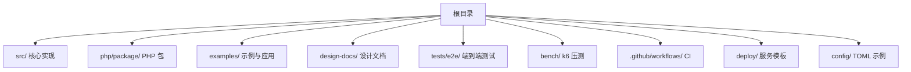
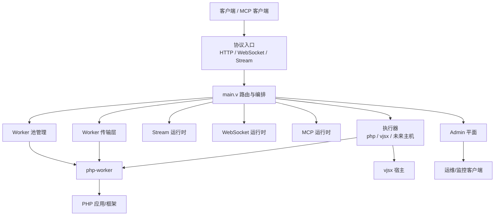
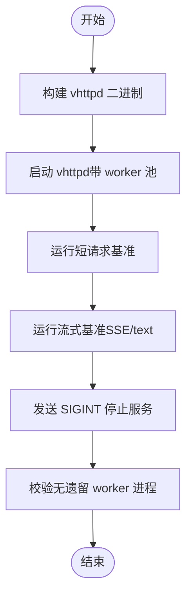
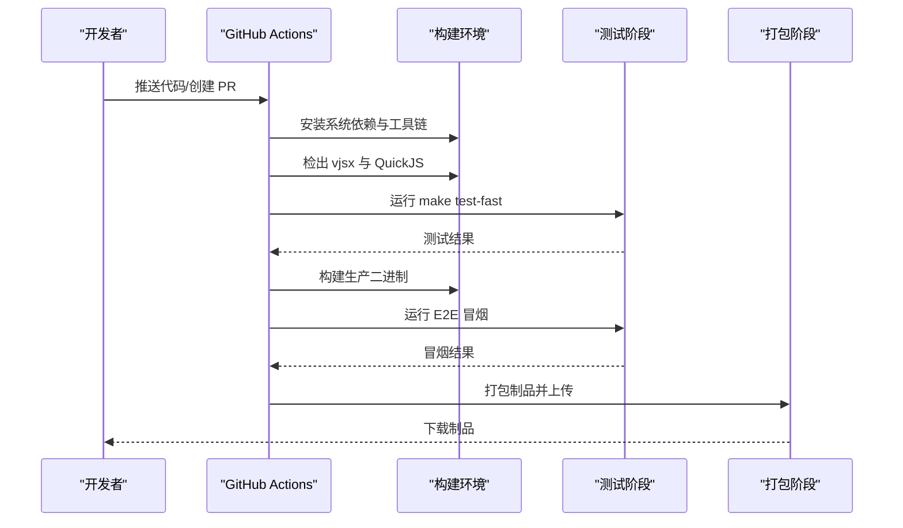
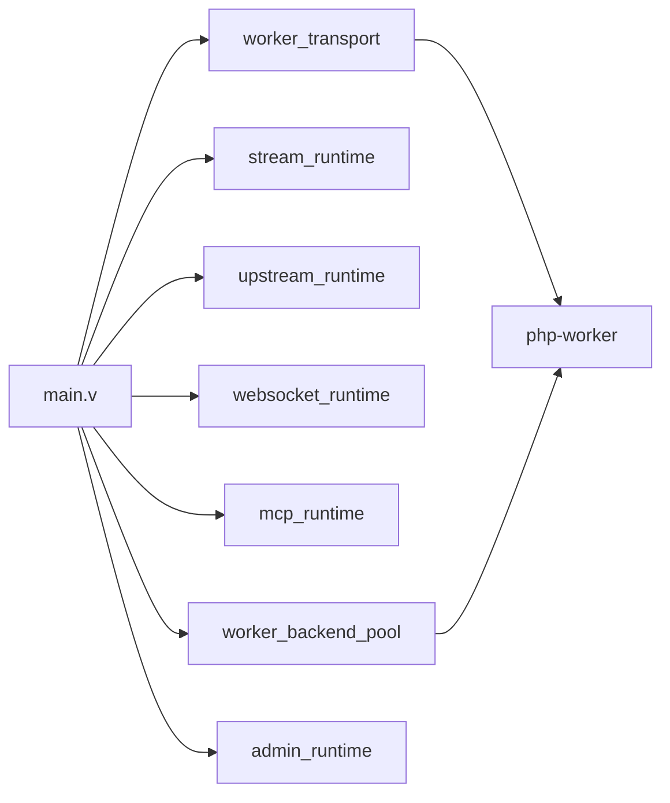

# 代码规范和贡献指南

<cite>
**本文引用的文件**   
- [README.md](file://README.md)
- [Makefile](file://Makefile)
- [tests/README.md](file://tests/README.md)
- [bench/README.md](file://bench/README.md)
- [design-docs/OVERVIEW.md](file://design-docs/OVERVIEW.md)
- [design-docs/ARCHITECTURE_REFACTOR_BASELINE.md](file://design-docs/ARCHITECTURE_REFACTOR_BASELINE.md)
- [design-docs/CONFIGURATION_MODEL_V2.md](file://design-docs/CONFIGURATION_MODEL_V2.md)
- [.github/workflows/vhttpd-binaries.yml](file://.github/workflows/vhttpd-binaries.yml)
- [src/main.v](file://src/main.v)
- [articles/14-future.md](file://articles/14-future.md)
</cite>

## 更新摘要
**所做更改**
- 更新了文档组织方式，反映新的 design-docs 目录结构
- 增强了设计文档管理策略的说明
- 更新了配置模型 V2 的相关规范
- 完善了架构重构基线的参考
- 更新了测试和基准测试的最新实践

## 目录
1. [简介](#简介)
2. [项目结构](#项目结构)
3. [核心组件](#核心组件)
4. [架构总览](#架构总览)
5. [详细组件分析](#详细组件分析)
6. [依赖分析](#依赖分析)
7. [性能考虑](#性能考虑)
8. [故障排查指南](#故障排查指南)
9. [结论](#结论)
10. [附录](#附录)

## 简介
本指南面向 vhttpd 的开发者与贡献者，统一 V 语言编码风格、Git 工作流、测试与基准规范、质量检查与自动化流程，以及社区参与和问题反馈流程。目标是让新成员快速上手，使现有贡献更高效、可预期且可维护。

## 项目结构
仓库采用"按功能域分层 + 示例与文档分离"的组织方式：
- src：V 语言核心实现（HTTP/WebSocket/Stream/MCP/Worker/Provider 等）
- php/package：PHP 侧包与运行时桥接
- examples：多场景示例应用与配置
- design-docs：架构与设计文档（新的文档组织方式）
- tests/e2e：端到端与冒烟测试脚本
- bench：k6 压测脚本与说明
- .github/workflows：CI 构建与制品打包
- deploy：systemd/launchd 服务模板
- config：TOML 配置示例

章节来源
- [README.md:1-150](file://README.md#L1-L150)
- [design-docs/OVERVIEW.md:1-320](file://design-docs/OVERVIEW.md#L1-L320)

## 核心组件
- 协议入口与编排：main.v 负责入站路由与高层编排
- Worker 传输契约：长度前缀 JSON 帧，定义请求/响应/流事件
- 执行器模型：php-worker、vjsx 等逻辑执行器抽象
- 运行面：HTTP、WebSocket、Stream（SSE/text）、MCP、WebSocket Upstream
- Admin 平面：运行时快照、Worker 控制、Upstream 观测

章节来源
- [design-docs/OVERVIEW.md:120-220](file://design-docs/OVERVIEW.md#L120-L220)
- [src/main.v:1-117](file://src/main.v#L1-L117)

## 架构总览
vhttpd 作为可编程运行时网关，将多种协议接入统一为 Exchange/Pipeline，再调度不同执行器与上游。

图表来源
- [README.md:84-126](file://README.md#L84-L126)

章节来源
- [README.md:84-126](file://README.md#L84-L126)

## 详细组件分析

### V 语言编码风格约定
- 命名规范
  - 模块名使用小写下划线或短横线（遵循 V 惯例），类型与方法使用大驼峰
  - 常量使用全大写加下划线
  - 私有字段与方法以下划线开头或在模块内可见性控制
- 文件组织
  - 每个模块一个文件；测试文件与源码同目录，命名 *_test.v
  - 复杂模块拆分为子目录并按职责划分（如 admin、executor、upstream）
- 注释格式
  - 行内注释使用 //，块级注释使用 /* ... */
  - 公共 API 建议提供简要说明，复杂逻辑补充"为什么"的注释
- 错误处理
  - 避免在生产代码中使用 panic；优先返回 error 或使用 ! 类型
  - 对静默忽略的错误点补充注释说明原因或记录日志
- 并发与锁
  - 明确锁层级顺序并在获取多锁处添加注释说明
  - 避免死锁风险，尽量缩小临界区范围
- 配置与 CLI
  - 使用 TOML 配置与结构化解析，CLI flags 与配置项保持一致
  - 环境变量回退策略清晰，变量名以 VHTTPD_* 为主

章节来源
- [src/main.v:1-117](file://src/main.v#L1-L117)

### Git 工作流与提交信息规范
- 分支管理
  - main：稳定分支，受保护
  - feature/*：新功能开发
  - fix/*：缺陷修复
  - docs/*：文档更新
  - chore/*：构建/工具变更
- Pull Request 流程
  - 在 PR 中描述变更动机、影响范围与验证步骤
  - 必须通过 CI（构建、单元测试、E2E 冒烟）
  - 至少一名维护者审查通过后合并
- 提交信息规范
  - 类型(scope): 描述
  - 类型包括 feat、fix、docs、style、refactor、test、chore
  - 示例见文章中的规范段落

章节来源
- [articles/14-future.md:286-304](file://articles/14-future.md#L286-L304)

### 测试编写规范
- 单元与集成测试
  - 测试文件与源码同目录，命名 *_test.v
  - 使用 Makefile 目标自动发现与分类运行：
    - make test-fast：排除 inproc 与 db 相关测试
    - make test-inproc：仅运行 inproc_* 测试
    - make test-codexbot：仅运行 codexbot 相关测试
- 端到端测试
  - 位于 tests/e2e，独立 shell 脚本，无需外部依赖
  - 先 make build，再运行 bash tests/e2e/run.sh 或 smoke_test.sh
- 覆盖率与门禁
  - 建议在 CI 中引入覆盖率统计并设置核心模块最低覆盖率阈值
  - 将测试失败作为阻断发布的门禁条件

章节来源
- [tests/README.md:1-38](file://tests/README.md#L1-L38)
- [Makefile:158-199](file://Makefile#L158-L199)

### 性能测试与基准测试指导
- 工具与环境
  - 使用 k6 进行 HTTP 与 Stream 基准测试
  - 安装 k6 后参考 bench/README.md 的变量约定与命令
- 短请求基准
  - 默认目标路径与基础 URL 可通过环境变量覆盖
  - 直接运行 k6 run bench/k6_short.js
- 流式基准（SSE/text）
  - 启动专用 benchmark 应用后，分别运行 SSE 与 text 模式
  - 推荐两组对比矩阵：固定 token 数变化间隔（隔离传输开销）、固定间隔变化 token 数（验证线性扩展）
- 主机回归脚本
  - 一键完成构建、启动、压测、清理与进程残留校验
  - 支持跳过 k6 仅验证生命周期

图表来源
- [bench/README.md:24-57](file://bench/README.md#L24-L57)

章节来源
- [bench/README.md:1-158](file://bench/README.md#L1-L158)

### 代码质量检查与自动化流程
- CI 流水线
  - 触发条件：push/main、PR（限定路径）
  - 步骤：安装依赖、克隆 vjsx 模块、准备 QuickJS、运行 fast 测试、构建生产二进制、E2E 冒烟、打包制品
- 本地构建与分发
  - 使用 make deps-core、make prod、make build-prod
  - 产物包含二进制、runtime libs、安装与诊断脚本
- 质量门禁建议
  - 在 CI 中增加覆盖率报告与阈值检查
  - 新增配置字段时自动生成 CLI help，减少手工同步成本

图表来源
- [.github/workflows/vhttpd-binaries.yml:1-171](file://.github/workflows/vhttpd-binaries.yml#L1-L171)

章节来源
- [.github/workflows/vhttpd-binaries.yml:1-171](file://.github/workflows/vhttpd-binaries.yml#L1-L171)
- [README.md:256-366](file://README.md#L256-L366)

### 社区贡献与问题反馈流程
- 你可以做什么
  - 修复错别字、完善 API 文档、翻译文档、编写教程与示例
- 问题反馈
  - 报告 Bug 需提供版本、操作系统、复现步骤、期望与实际行为、相关日志
  - 功能请求需说明使用场景、期望功能、可能方案与优先级
- 社区参与
  - 回答问题、分享经验、组织活动、撰写博客与视频

章节来源
- [articles/14-future.md:306-356](file://articles/14-future.md#L306-L356)

### 设计文档管理策略

#### 新的文档组织结构
项目现已采用集中化的设计文档管理策略，所有架构和设计相关文档统一存放在 `design-docs/` 目录下：

- **OVERVIEW.md**：产品定义和架构总览
- **ARCHITECTURE_REFACTOR_BASELINE.md**：架构重构基线状态
- **CONFIGURATION_MODEL_V2.md**：配置模型 V2 规范
- **其他专项设计文档**：针对特定功能的详细设计

#### 设计文档编写规范
- 每个设计文档应包含明确的标题和状态标识
- 使用 Mermaid 图表展示架构图和数据流
- 保持文档间的交叉引用关系
- 定期更新文档状态，反映实际实现进度

#### 配置模型 V2 规范
新的配置模型采用统一的资源分类方法：
- server：进程级行为配置
- listeners：网络绑定和 TLS 终止
- control：管理和内部控制面板暴露
- observability：日志、事件、指标和追踪导出
- resources：共享数据库、缓存、存储、密钥等基础设施
- engines：执行运行时（PHP worker、PHP CGI、VJSX）
- adapters：应用程序协议入口/出口实现
- transforms：可编程或原生交换转换
- policies：可重用的限制、缓存、安全和响应行为
- pipelines：匹配和有序数据流
- relays：跨节点中继端点

章节来源
- [design-docs/OVERVIEW.md:1-320](file://design-docs/OVERVIEW.md#L1-L320)
- [design-docs/ARCHITECTURE_REFACTOR_BASELINE.md:1-200](file://design-docs/ARCHITECTURE_REFACTOR_BASELINE.md#L1-L200)
- [design-docs/CONFIGURATION_MODEL_V2.md:1-200](file://design-docs/CONFIGURATION_MODEL_V2.md#L1-L200)

## 依赖分析
- 内部依赖
  - main.v 协调各运行时模块（Transport、Stream、Upstream、Ws、Mcp、Pool、Admin）
  - Worker 传输契约由 worker_protocol.v 定义，确保 vhttpd 与 php-worker 的帧格式一致
- 外部依赖
  - OpenSSL、Boehm GC、SQLite/MySQL/PostgreSQL 客户端库
  - vjsx 模块与 QuickJS 源码（构建期）
- 构建与分发
  - Makefile 提供 deps-core/prod/build-prod 等目标
  - CI 根据平台安装依赖并打包制品

图表来源
- [README.md:84-126](file://README.md#L84-L126)
- [src/main.v:1-117](file://src/main.v#L1-L117)

章节来源
- [README.md:84-126](file://README.md#L84-L126)
- [src/main.v:1-117](file://src/main.v#L1-L117)

## 性能考虑
- 流式传输优化
  - 合理设置 chunk_size 与 interval_ms，平衡吞吐与时延
  - 使用 Group A/B 对比矩阵评估传输开销与可扩展性
- Worker 池调优
  - 根据负载调整 pool_size、queue_capacity 与 queue_timeout_ms
  - 关注队列满与超时错误类，必要时扩容或限流
- 资源与内存
  - 启用 Boehm GC 并监控内存增长
  - 避免长连接持有过多状态，及时释放资源

## 故障排查指南
- 常见错误类
  - worker_queue_full：队列已满，返回 503
  - worker_queue_timeout：等待超时，返回 504
- 定位方法
  - 查看 Admin 平面运行时快照与事件日志
  - 使用 runtime_doctor.sh 检查环境与依赖
- 日志与指标
  - 事件日志 NDJSON，可按模块/Provider 细化日志级别
  - 建议暴露 Prometheus/OpenMetrics 指标以便监控

章节来源
- [design-docs/OVERVIEW.md:229-252](file://design-docs/OVERVIEW.md#L229-L252)
- [README.md:349-366](file://README.md#L349-L366)

## 结论
通过统一的编码风格、清晰的 Git 工作流、完善的测试与基准体系、严格的 CI 质量门禁与可观测性实践，vhttpd 能够在保持高性能与可扩展性的同时，提升协作效率与交付质量。新的设计文档管理策略有助于更好地组织和维护架构知识，建议持续完善覆盖率门禁、配置校验与 CLI 自动生成，进一步降低维护成本。

## 附录
- 快速开始
  - 安装依赖：make deps-core
  - 构建：make prod
  - 运行：./vhttpd --config config/vhttpd.example.toml
- 常用命令
  - 测试：make test-fast、make test-inproc、make test-codexbot
  - 压测：bash bench/run_host_regression.sh
  - 打包：CI 自动产出制品，也可本地复制 scripts 与 runtime/libs
- 设计文档导航
  - 架构总览：design-docs/OVERVIEW.md
  - 配置模型：design-docs/CONFIGURATION_MODEL_V2.md
  - 架构重构：design-docs/ARCHITECTURE_REFACTOR_BASELINE.md

章节来源
- [README.md:256-366](file://README.md#L256-L366)
- [bench/README.md:24-57](file://bench/README.md#L24-L57)
- [design-docs/OVERVIEW.md:297-320](file://design-docs/OVERVIEW.md#L297-L320)