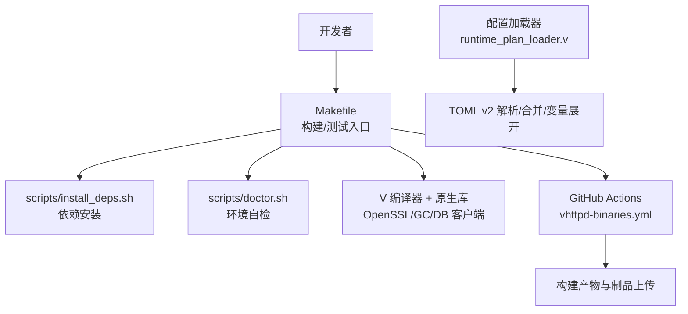
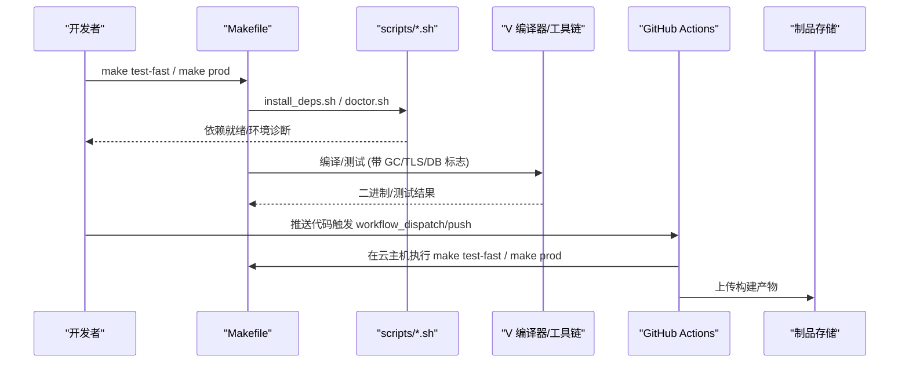
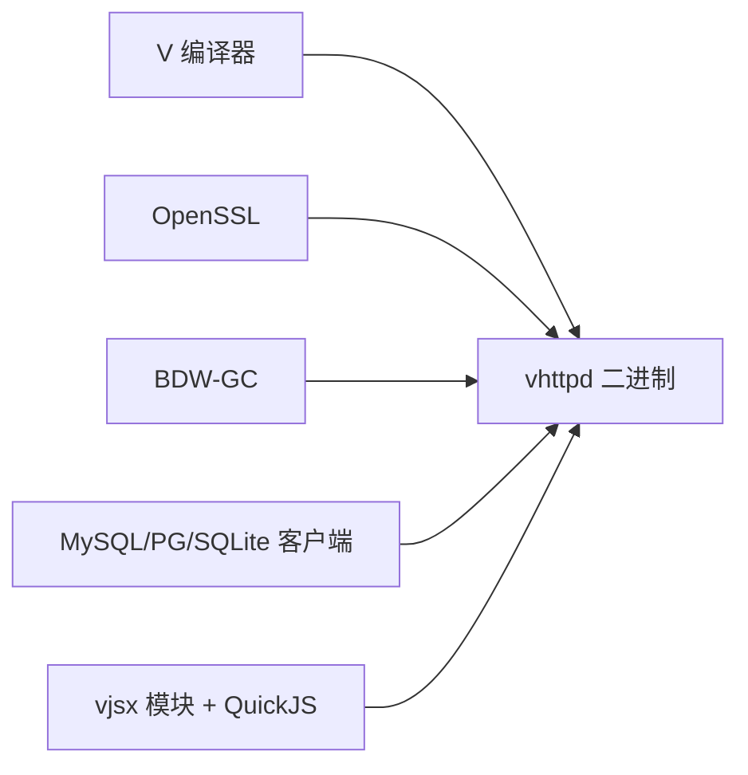

# 代码质量检查和自动化

<cite>
**本文引用的文件**   
- [README.md](file://README.md)
- [Makefile](file://Makefile)
- [.github/workflows/vhttpd-binaries.yml](file://.github/workflows/vhttpd-binaries.yml)
- [.github/workflows/sync-vphp-package.yml](file://.github/workflows/sync-vphp-package.yml)
- [scripts/install_deps.sh](file://scripts/install_deps.sh)
- [scripts/doctor.sh](file://scripts/doctor.sh)
- [src/config/runtime_plan_loader.v](file://src/config/runtime_plan_loader.v)
- [src/server_logic_test.v](file://src/server_logic_test.v)
</cite>

## 目录
1. [简介](#简介)
2. [项目结构](#项目结构)
3. [核心组件](#核心组件)
4. [架构总览](#架构总览)
5. [详细组件分析](#详细组件分析)
6. [依赖分析](#依赖分析)
7. [性能考虑](#性能考虑)
8. [故障排查指南](#故障排查指南)
9. [结论](#结论)
10. [附录](#附录)

## 简介
本文件面向“代码质量检查与自动化”目标，结合仓库现有构建、测试与 CI 配置，给出：
- 静态代码分析与风格检查的集成建议（语法、风格、复杂度）
- 持续集成流水线（构建、测试、质量门禁）现状与扩展点
- 本地开发环境工具安装与环境自检方法
- CI/CD 中质量检查环节与失败处理机制
- 自定义规则与扩展开发指引
- 质量报告解读与改进建议

说明：当前仓库未内置专门的静态分析或安全扫描工具链。本文在尊重现有实现的前提下，提供可落地的集成方案与最佳实践，并明确标注哪些能力已具备、哪些需要新增。

## 项目结构
围绕质量与自动化的关键位置如下：
- 顶层构建与测试入口：Makefile
- CI 工作流：.github/workflows/*.yml
- 本地依赖安装与环境自检：scripts/*.sh
- 配置加载与校验（TOML v2）：src/config/runtime_plan_loader.v
- 单元测试与行为断言：src/*_test.v 与 php/package/tests

图表来源
- [Makefile:1-199](file://Makefile#L1-L199)
- [.github/workflows/vhttpd-binaries.yml:1-171](file://.github/workflows/vhttpd-binaries.yml#L1-L171)
- [scripts/install_deps.sh:1-138](file://scripts/install_deps.sh#L1-L138)
- [scripts/doctor.sh:1-108](file://scripts/doctor.sh#L1-L108)
- [src/config/runtime_plan_loader.v:86-117](file://src/config/runtime_plan_loader.v#L86-L117)

章节来源
- [Makefile:1-199](file://Makefile#L1-L199)
- [README.md:256-271](file://README.md#L256-L271)

## 核心组件
- 构建与测试编排（Makefile）
  - 提供 build/prod/test-fast/test-php/test-e2e 等目标，统一编译参数、GC/TLS/DB 开关与测试发现策略。
- CI 流水线（GitHub Actions）
  - 多平台构建（Linux/macOS），安装 V 编译器与依赖，运行快速单测，打包制品并上传。
- 本地依赖与环境自检（scripts）
  - install_deps.sh：按模式安装系统包与 vjsx 模块；doctor.sh：检测命令、pkg-config 条目与 QuickJS 源码可用性。
- 配置加载与校验（TOML v2）
  - runtime_plan_loader.v：严格解析 TOML、变量展开、include 合并与键校验，为运行时计划生成提供基础。

章节来源
- [Makefile:1-199](file://Makefile#L1-L199)
- [.github/workflows/vhttpd-binaries.yml:1-171](file://.github/workflows/vhttpd-binaries.yml#L1-L171)
- [scripts/install_deps.sh:1-138](file://scripts/install_deps.sh#L1-L138)
- [scripts/doctor.sh:1-108](file://scripts/doctor.sh#L1-L108)
- [src/config/runtime_plan_loader.v:86-117](file://src/config/runtime_plan_loader.v#L86-L117)

## 架构总览
下图展示从本地到 CI 的质量相关流程：本地通过 Makefile 驱动构建与测试，CI 复用相同目标执行快速单测与构建，最终产出制品。

图表来源
- [Makefile:1-199](file://Makefile#L1-L199)
- [.github/workflows/vhttpd-binaries.yml:1-171](file://.github/workflows/vhttpd-binaries.yml#L1-L171)
- [scripts/install_deps.sh:1-138](file://scripts/install_deps.sh#L1-L138)
- [scripts/doctor.sh:1-108](file://scripts/doctor.sh#L1-L108)

## 详细组件分析

### 构建与测试编排（Makefile）
- 构建目标
  - build/prod/build-prod：准备源码阶段、设置 TLS/GC/DB 标志、输出二进制。
  - deps-core/deps-vjsx/deps-db/deps-full：调用 scripts/install_deps.sh 安装依赖。
  - doctor：调用 scripts/doctor.sh 进行环境自检。
- 测试目标
  - test-fast：自动发现 src 下非 inproc/db 的单测文件与模块目录，逐个执行。
  - test-php：遍历 php/package/tests 下的 *_test.php 并执行。
  - test-e2e：执行 tests/e2e/run.sh。
  - test-inproc/test-codexbot*：针对特定场景的测试集合。
- 质量门禁建议
  - 将 test-fast 作为 PR 必过门禁；对关键路径增加 test-codexbot-fast 子集。
  - 在 prod 构建后增加 smoke 步骤（如 --help 与错误参数返回码校验）。

章节来源
- [Makefile:1-199](file://Makefile#L1-L199)

### CI 流水线（GitHub Actions）
- 触发条件
  - push/main 分支变更（受 paths 过滤）、pull_request、workflow_dispatch。
- 矩阵构建
  - ubuntu-latest、macos-15-intel、macos-15，分别产出 linux-amd64、macos-amd64、macos-arm64。
- 关键步骤
  - 安装系统依赖（Linux apt、macOS brew）
  - 安装 V 编译器（从指定仓库克隆并构建）
  - 检出 vjsx 模块并确保 managed QuickJS 源码
  - 运行 make test-fast
  - 构建生产二进制 make prod
  - Smoke 测试与制品打包上传
- 质量门禁建议
  - 将 test-fast 失败视为阻断；prod 构建失败直接中止。
  - 可在后续阶段加入静态分析与安全扫描（见下文“扩展建议”）。

章节来源
- [.github/workflows/vhttpd-binaries.yml:1-171](file://.github/workflows/vhttpd-binaries.yml#L1-L171)

### 本地依赖与环境自检（scripts）
- install_deps.sh
  - 支持 core/vjsx/db/full 四种模式，自动安装 OpenSSL、BDW-GC、MySQL/PostgreSQL/SQLite 客户端、pkg-config 等。
  - 管理 vjsx 模块与 QuickJS 源码（优先使用 ../quickjs，否则拉取托管源码）。
- doctor.sh
  - 检查 v、pkg-config、openssl、bdw-gc 等命令与 pkg-config 条目。
  - 验证 vjsx 模块路径与 ensure-quickjs.sh 脚本存在性，确认 QuickJS 源码可用。
  - 提示 sqlite3/mysql_config/mariadb_config/pg_config 是否可用。

章节来源
- [scripts/install_deps.sh:1-138](file://scripts/install_deps.sh#L1-L138)
- [scripts/doctor.sh:1-108](file://scripts/doctor.sh#L1-L108)

### 配置加载与校验（TOML v2）
- 严格解析与合并
  - decode_v2_config_strict：TOML 解析、键校验、provider 规格与扩展选项注入、匹配查询应用。
  - decode_v2_config_text_with_includes：变量与路径展开、include 递归加载与去环、合并策略。
- 质量意义
  - 通过严格键校验与 include 合并，降低配置漂移风险，提升可维护性与可观测性。
  - 建议在 CI 中增加“仅解析不运行”的配置校验步骤，提前拦截非法配置。

章节来源
- [src/config/runtime_plan_loader.v:86-117](file://src/config/runtime_plan_loader.v#L86-L117)

### 测试与行为断言（示例）
- server_logic_test.v 中包含对 CLI 参数解析、站点配置别名映射、执行器规格暴露等的断言，可作为新增功能回归测试的参考范式。

章节来源
- [src/server_logic_test.v:1702-1777](file://src/server_logic_test.v#L1702-L1777)
- [src/server_logic_test.v:1167-1203](file://src/server_logic_test.v#L1167-L1203)

## 依赖分析
- 构建期依赖
  - V 编译器、C 编译器、OpenSSL、BDW-GC、数据库客户端（MySQL/MariaDB、PostgreSQL、SQLite）、pkg-config。
- 运行时依赖
  - 二进制打包时通过 bundle_runtime_libs.sh 收集缺失的动态库，配合 RPATH/@loader_path 实现免系统库部署。
- 外部模块
  - vjsx 模块与托管 QuickJS 源码用于嵌入式 JS/TS 运行时。

图表来源
- [Makefile:1-199](file://Makefile#L1-L199)
- [README.md:256-271](file://README.md#L256-L271)

章节来源
- [Makefile:1-199](file://Makefile#L1-L199)
- [README.md:256-271](file://README.md#L256-L271)

## 性能考虑
- 构建优化
  - 使用 prod 构建开启 -prod 与 -nocache，减少调试开销。
  - 合理选择 GC 后端（默认 boehm），避免不必要的内存分配。
- 测试优化
  - 使用 test-fast 聚焦无网络/非 inproc 用例，缩短反馈周期。
  - 按需拆分 codexbot 生命周期测试，避免每次全量执行。

[本节为通用指导，无需具体文件引用]

## 故障排查指南
- 构建失败
  - 使用 make doctor 定位缺少的命令或 pkg-config 条目。
  - 若缺少 vjsx/QuickJS，先执行 make deps-vjsx 或 make deps-full。
- 运行期动态库缺失
  - 使用 scripts/bundle_runtime_libs.sh 收集缺失库，确保发布包包含 runtime/libs。
- 配置问题
  - 通过 TOML v2 严格解析与 include 合并逻辑，尽早发现键名错误或循环 include。
- CI 失败
  - 检查 matrix 平台依赖安装步骤；确认 V 编译器版本与依赖兼容。
  - 查看 test-fast 日志定位失败用例，必要时缩小范围复现。

章节来源
- [scripts/doctor.sh:1-108](file://scripts/doctor.sh#L1-L108)
- [scripts/install_deps.sh:1-138](file://scripts/install_deps.sh#L1-L138)
- [src/config/runtime_plan_loader.v:86-117](file://src/config/runtime_plan_loader.v#L86-L117)
- [.github/workflows/vhttpd-binaries.yml:1-171](file://.github/workflows/vhttpd-binaries.yml#L1-L171)

## 结论
- 现有仓库已具备完善的构建与测试编排、跨平台 CI 流水线与本地环境自检能力。
- 尚未内置静态分析、代码风格与安全扫描工具链，但可通过 Makefile 与 GitHub Actions 无缝扩展。
- 建议在 PR 门禁中加入轻量级静态分析与配置校验，逐步引入覆盖率与基准测试，形成闭环质量保障。

[本节为总结性内容，无需具体文件引用]

## 附录

### 本地开发环境：安装与自检
- 安装依赖
  - 核心依赖：make deps-core
  - 含 vjsx：make deps-vjsx 或 make deps-full
- 环境自检
  - make doctor
- 构建与运行
  - make vhttpd / make prod
  - 参考 README 中的运行与 TOML 配置说明

章节来源
- [Makefile:1-199](file://Makefile#L1-L199)
- [README.md:256-271](file://README.md#L256-L271)

### 持续集成流水线：现状与扩展
- 现状
  - 触发：push/main、PR、手动触发
  - 矩阵：Linux/macOS 多架构
  - 步骤：安装依赖 → 安装 V → 检出 vjsx → 确保 QuickJS → 运行 test-fast → 构建 prod → 打包上传
- 扩展建议（静态分析/风格/复杂度）
  - 在 test-fast 之前新增步骤：
    - V 语言静态检查：启用 V 编译器警告级别与可选 linter（如 vlint）
    - PHP 侧：在 php/package 中引入 composer dev 依赖（PHPStan/Psalm），并在 CI 中执行
    - 复杂度阈值：在 CI 中统计函数/模块复杂度，超过阈值则失败
  - 在 prod 构建之后新增步骤：
    - 安全扫描：对依赖树与源码进行漏洞扫描（例如 trivy 或 osv-scanner）
    - 许可证合规：扫描第三方依赖许可证
- 质量门禁
  - 任何一步失败即中断流水线；制品仅在全部通过后上传

章节来源
- [.github/workflows/vhttpd-binaries.yml:1-171](file://.github/workflows/vhttpd-binaries.yml#L1-L171)
- [Makefile:1-199](file://Makefile#L1-L199)

### 自定义检查规则与扩展开发
- 在 Makefile 中新增目标
  - 例如 lint-v、lint-php、complexity、security-scan，便于本地一键运行与 CI 复用。
- 在 CI 中新增 job/step
  - 复用已有 matrix 与缓存策略，保持并行度与速度。
- 配置化规则
  - 将规则阈值与忽略列表外置为配置文件（JSON/YAML/TOML），由脚本读取，便于团队协商与演进。

[本节为通用指导，无需具体文件引用]

### 质量报告解读与改进建议
- 构建与测试报告
  - 关注 test-fast 失败用例与堆栈；对不稳定用例添加重试或隔离。
- 静态分析报告
  - 优先修复高严重级别问题；对误报建立白名单并记录原因。
- 安全扫描报告
  - 评估漏洞影响面，制定升级或替代方案；对无法立即修复的风险项登记缓解措施。
- 配置校验报告
  - 根据 TOML v2 解析错误信息修正键名、路径与 include 关系，避免运行时异常。

[本节为通用指导，无需具体文件引用]