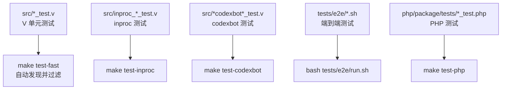
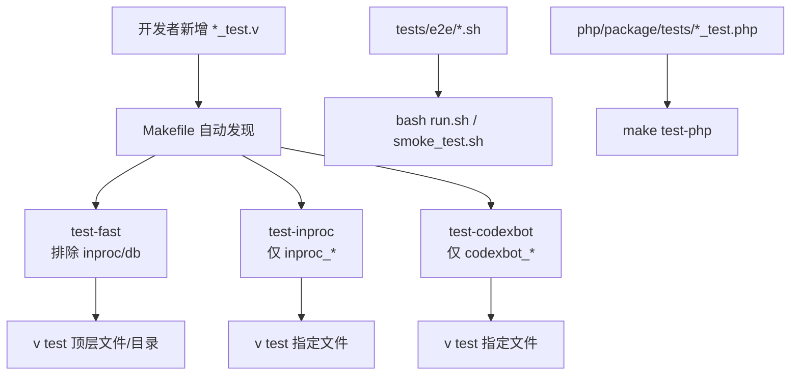
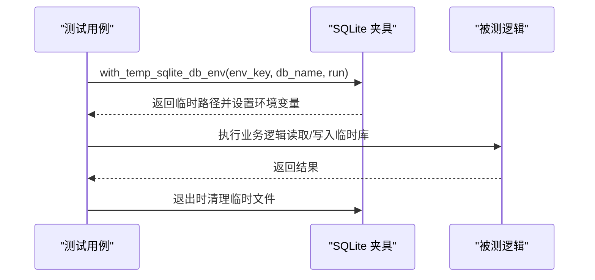
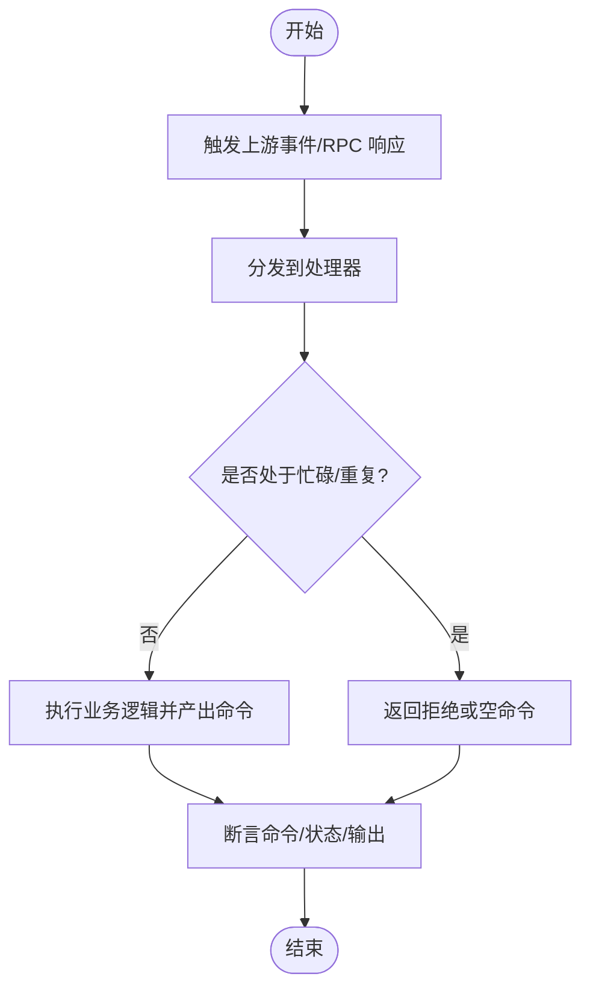
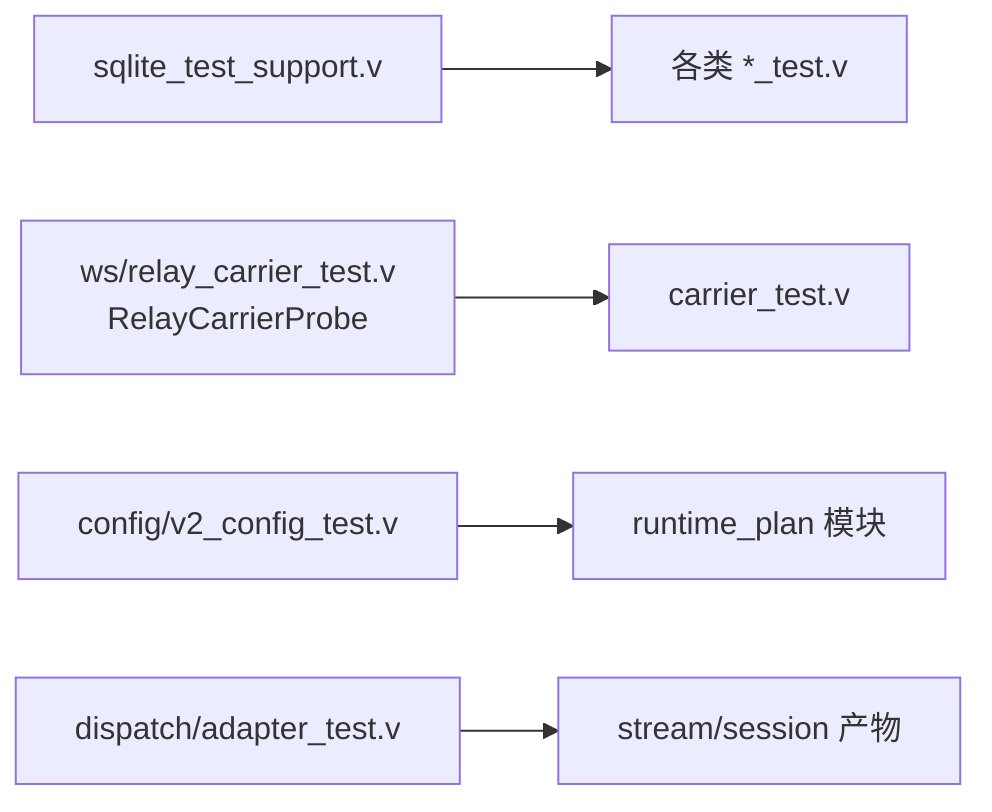

# 单元测试规范

<cite>
**本文引用的文件**   
- [README.md](file://README.md)
- [Makefile](file://Makefile)
- [tests/README.md](file://tests/README.md)
- [src/sqlite_test_support.v](file://src/sqlite_test_support.v)
- [src/admin_apps_runtime_test.v](file://src/admin_apps_runtime_test.v)
- [src/config/v2_config_test.v](file://src/config/v2_config_test.v)
- [src/dispatch/adapter_test.v](file://src/dispatch/adapter_test.v)
- [src/relay/carrier_test.v](file://src/relay/carrier_test.v)
- [src/ws/relay_carrier_test.v](file://src/ws/relay_carrier_test.v)
- [src/inproc_vjsx_executor_codexbot_core_test.v](file://src/inproc_vjsx_executor_codexbot_core_test.v)
- [php/package/tests/profiler_test.php](file://php/package/tests/profiler_test.php)
- [bench/README.md](file://bench/README.md)
- [docs/refactor_0601.md](file://docs/refactor_0601.md)
</cite>

## 目录
1. [引言](#引言)
2. [项目结构](#项目结构)
3. [核心组件](#核心组件)
4. [架构总览](#架构总览)
5. [详细组件分析](#详细组件分析)
6. [依赖分析](#依赖分析)
7. [性能考虑](#性能考虑)
8. [故障排查指南](#故障排查指南)
9. [结论](#结论)
10. [附录](#附录)

## 引言
本规范面向 VHTTPD 项目的单元测试编写与组织，目标是统一测试命名、结构与断言风格，明确数据准备与异步测试方法，并给出覆盖率与基准测试要求。文档基于仓库现有实现与既有测试样例提炼而成，确保可落地执行。

## 项目结构
VHTTPD 的测试采用“就近放置 + 自动发现”的模式：
- 单元测试与源码同目录（`src/`），以 `*_test.v` 命名，由 Makefile 自动发现并分类运行。
- E2E 测试位于 `tests/e2e/`，使用 shell 脚本驱动编译后的二进制。
- PHP 侧测试位于 `php/package/tests/`，遵循 PHP 测试约定。

图示来源
- [Makefile:37-71](file://Makefile#L37-L71)
- [tests/README.md:13-22](file://tests/README.md#L13-L22)

章节来源
- [tests/README.md:13-22](file://tests/README.md#L13-L22)
- [Makefile:37-71](file://Makefile#L37-L71)

## 核心组件
本节总结当前仓库中已存在的测试实践与工具，作为规范的依据与参考。

- 测试发现与分类
  - 顶层 `src/*_test.v` 通过 `find` 自动收集；子模块测试按目录运行以保证模块上下文完整。
  - 三类目标：快速单元（排除 inproc/db）、inproc、codexbot。
- 数据库测试数据管理
  - 提供 SQLite 临时库路径生成与清理工具，支持在环境变量注入后自动恢复。
- 断言与错误处理
  - 大量使用 `assert` 进行基本类型与集合断言；对异常场景通过返回错误码或错误消息断言。
- 模拟与夹具
  - 通过闭包探针（如 `RelayCarrierProbe`）与运行时上下文回调构造轻量模拟对象。
- 异步与事件流
  - 通过事件分发函数与状态快照验证协程/事件链路；结合时间控制与环境变量调节超时/老化行为。
- 基准测试
  - 外部 k6 压测脚本用于流式传输基准；尚未引入 V 内置 `@bench` 测试。

章节来源
- [Makefile:37-71](file://Makefile#L37-L71)
- [src/sqlite_test_support.v:1-32](file://src/sqlite_test_support.v#L1-L32)
- [src/dispatch/adapter_test.v:1-77](file://src/dispatch/adapter_test.v#L1-L77)
- [src/relay/carrier_test.v:1-41](file://src/relay/carrier_test.v#L1-L41)
- [src/ws/relay_carrier_test.v:1-141](file://src/ws/relay_carrier_test.v#L1-L141)
- [src/inproc_vjsx_executor_codexbot_core_test.v:1-424](file://src/inproc_vjsx_executor_codexbot_core_test.v#L1-L424)
- [bench/README.md:79-158](file://bench/README.md#L79-L158)

## 架构总览
下图展示测试在构建与运行时的关系，以及不同测试类型的覆盖范围。

图示来源
- [Makefile:37-71](file://Makefile#L37-L71)
- [tests/README.md:13-22](file://tests/README.md#L13-L22)

## 详细组件分析

### 测试文件命名与组织
- 命名约定
  - V 单元测试：`<被测试模块>_test.v`，放在与被测代码相同目录。
  - 特殊类别：`inproc_*_test.v`、`*codexbot*_test.v` 分别由独立目标运行。
- 组织结构
  - 顶层 `src/*_test.v` 可直接作为文件运行；子模块测试需以目录方式运行，以便加载同级模块。
- 建议
  - 保持就近放置，避免跨目录引用导致模块上下文缺失。
  - 将共享夹具放入被测模块目录下的 `_helpers.v` 或单独文件，并通过模块导入复用。

章节来源
- [tests/README.md:13-22](file://tests/README.md#L13-L22)
- [Makefile:37-71](file://Makefile#L37-L71)

### 断言库与断言风格
- 基本类型断言
  - 使用 `assert` 比较标量、字符串、数组长度与元素值。
- 复杂对象比较
  - 针对结构化输出，逐字段断言关键字段（如 kind/status/target/metadata）。
- 异常与错误路径
  - 通过断言错误码、错误消息或结果标志位来验证失败路径。
- 推荐
  - 为每个用例聚焦单一职责，断言尽量具体且可解释。
  - 对易变字段（如时间戳、随机 ID）使用模式匹配或忽略策略。

章节来源
- [src/admin_apps_runtime_test.v:1-77](file://src/admin_apps_runtime_test.v#L1-L77)
- [src/config/v2_config_test.v:1-109](file://src/config/v2_config_test.v#L1-L109)
- [src/dispatch/adapter_test.v:1-77](file://src/dispatch/adapter_test.v#L1-L77)
- [src/relay/carrier_test.v:1-41](file://src/relay/carrier_test.v#L1-L41)

### 测试数据准备最佳实践
- 测试夹具创建
  - 使用最小可用配置构造输入对象，只包含断言所需字段。
  - 示例：在配置解析测试中直接构造 TOML 文本并解码为结构体，再断言各域。
- 模拟对象使用
  - 通过闭包探针记录调用参数与返回值，替代真实依赖（如 WebSocket 发送、关闭）。
  - 示例：`RelayCarrierProbe` 捕获连接状态、发送帧与关闭动作。
- 数据库测试数据管理
  - 使用临时 SQLite 文件路径生成器，并在 defer 中清理 `.sqlite`、`.wal`、`.shm`。
  - 通过环境变量注入临时库路径，保证测试隔离与幂等。

图示来源
- [src/sqlite_test_support.v:1-32](file://src/sqlite_test_support.v#L1-L32)

章节来源
- [src/config/v2_config_test.v:1-109](file://src/config/v2_config_test.v#L1-L109)
- [src/ws/relay_carrier_test.v:1-141](file://src/ws/relay_carrier_test.v#L1-L141)
- [src/sqlite_test_support.v:1-32](file://src/sqlite_test_support.v#L1-L32)

### 异步代码测试方法
- 协程与事件监听
  - 通过事件分发函数触发下游处理，随后断言命令序列、状态变化与输出内容。
  - 示例：Codex 回调链路由测试，验证 RPC 响应、通知与流追加的顺序与内容。
- 超时与老化
  - 通过环境变量控制老化阈值（如活跃流过期时间），配合 `time.sleep` 验证超时分支。
- 并发与去重
  - 在同一会话/线程内并行请求应被拒绝或合并；跨 lane 的去重需验证最终一致性。

图示来源
- [src/inproc_vjsx_executor_codexbot_core_test.v:1-424](file://src/inproc_vjsx_executor_codexbot_core_test.v#L1-L424)

章节来源
- [src/inproc_vjsx_executor_codexbot_core_test.v:1-424](file://src/inproc_vjsx_executor_codexbot_core_test.v#L1-L424)

### 覆盖率与基准测试
- 覆盖率
  - 建议在 CI 中引入覆盖率门禁，对核心模块设定最低覆盖率阈值。
- 基准测试
  - 当前使用 k6 进行流式传输基准；尚未引入 V 内置 `@bench` 测试。
  - 建议逐步补充 CPU/内存热点路径的基准用例，并与回归脚本联动。

章节来源
- [docs/refactor_0601.md:87-100](file://docs/refactor_0601.md#L87-L100)
- [bench/README.md:79-158](file://bench/README.md#L79-L158)

### 常见测试模式与示例路径
- 配置解析与校验
  - 示例：解析 TOML 配置并断言各域映射正确性。
  - 路径：[src/config/v2_config_test.v](file://src/config/v2_config_test.v)
- 适配器/管道产物断言
  - 示例：断言 stream/session/relay 产物的协议无关目标与元数据。
  - 路径：[src/dispatch/adapter_test.v](file://src/dispatch/adapter_test.v)
- 载体能力与错误追踪
  - 示例：禁用载体的发送/关闭返回可追踪的错误事件。
  - 路径：[src/relay/carrier_test.v](file://src/relay/carrier_test.v)
- WebSocket 载体集成
  - 示例：通过探针验证编码帧、取消帧与连接关闭语义。
  - 路径：[src/ws/relay_carrier_test.v](file://src/ws/relay_carrier_test.v)
- 应用快照与管线组装
  - 示例：断言应用、监听器、管线与资源聚合结果。
  - 路径：[src/admin_apps_runtime_test.v](file://src/admin_apps_runtime_test.v)
- PHP 侧辅助断言
  - 示例：使用 assertArrayHasKey 等断言报告结构完整性。
  - 路径：[php/package/tests/profiler_test.php](file://php/package/tests/profiler_test.php)

章节来源
- [src/config/v2_config_test.v:1-109](file://src/config/v2_config_test.v#L1-L109)
- [src/dispatch/adapter_test.v:1-77](file://src/dispatch/adapter_test.v#L1-L77)
- [src/relay/carrier_test.v:1-41](file://src/relay/carrier_test.v#L1-L41)
- [src/ws/relay_carrier_test.v:1-141](file://src/ws/relay_carrier_test.v#L1-L141)
- [src/admin_apps_runtime_test.v:1-77](file://src/admin_apps_runtime_test.v#L1-L77)
- [php/package/tests/profiler_test.php:138-165](file://php/package/tests/profiler_test.php#L138-L165)

## 依赖分析
测试之间的耦合主要来源于共享夹具与运行时上下文：
- 共享夹具
  - SQLite 夹具：`src/sqlite_test_support.v` 提供临时库路径与清理。
  - 探针夹具：`src/ws/relay_carrier_test.v` 中的 `RelayCarrierProbe` 用于模拟底层 IO。
- 模块边界
  - 子模块测试必须按目录运行，以确保能访问同级模块定义。
- 外部依赖
  - E2E 与基准测试依赖外部工具（k6、shell 环境）。

图示来源
- [src/sqlite_test_support.v:1-32](file://src/sqlite_test_support.v#L1-L32)
- [src/ws/relay_carrier_test.v:1-141](file://src/ws/relay_carrier_test.v#L1-L141)
- [src/config/v2_config_test.v:1-109](file://src/config/v2_config_test.v#L1-L109)
- [src/dispatch/adapter_test.v:1-77](file://src/dispatch/adapter_test.v#L1-L77)

章节来源
- [src/sqlite_test_support.v:1-32](file://src/sqlite_test_support.v#L1-L32)
- [src/ws/relay_carrier_test.v:1-141](file://src/ws/relay_carrier_test.v#L1-L141)
- [src/config/v2_config_test.v:1-109](file://src/config/v2_config_test.v#L1-L109)
- [src/dispatch/adapter_test.v:1-77](file://src/dispatch/adapter_test.v#L1-L77)

## 性能考虑
- 基准测试现状
  - 使用 k6 进行流式传输基准，适合评估 SSE/text 在不同 token 数与间隔下的吞吐与延迟。
- 建议
  - 逐步引入 V 内置 `@bench` 测试，覆盖关键路径（如帧编解码、调度器、适配器）。
  - 将基准纳入 CI 回归，设置阈值告警。

章节来源
- [bench/README.md:79-158](file://bench/README.md#L79-L158)

## 故障排查指南
- 测试未自动发现
  - 确认文件名符合 `*_test.v` 规则，且未被 Makefile 过滤条件排除。
- 子模块测试无法编译
  - 改为按目录运行，使 V 能加载同级模块文件。
- 数据库相关测试不稳定
  - 检查临时库清理是否生效，避免残留 WAL/SHM 影响后续用例。
- 异步用例偶发失败
  - 增加等待与重试，或使用环境变量控制老化/超时参数，确保确定性。

章节来源
- [tests/README.md:13-22](file://tests/README.md#L13-L22)
- [Makefile:37-71](file://Makefile#L37-L71)
- [src/sqlite_test_support.v:1-32](file://src/sqlite_test_support.v#L1-L32)

## 结论
本规范总结了 VHTTPD 当前的测试实践与改进方向：就近放置与自动发现、最小化夹具与探针模拟、明确的断言风格、完善的异步与事件流测试方法，以及覆盖率与基准测试的演进路线。遵循本规范有助于提升测试稳定性、可维护性与回归效率。

## 附录
- 常用命令速查
  - 快速单元：`make test-fast`
  - inproc 测试：`make test-inproc`
  - codexbot 测试：`make test-codexbot`
  - PHP 测试：`make test-php`
  - E2E 测试：`bash tests/e2e/run.sh`
- 参考文档
  - 测试套件说明：[tests/README.md](file://tests/README.md)
  - 重构建议（含测试工程建议）：[docs/refactor_0601.md](file://docs/refactor_0601.md)
  - 项目概览与运行说明：[README.md](file://README.md)