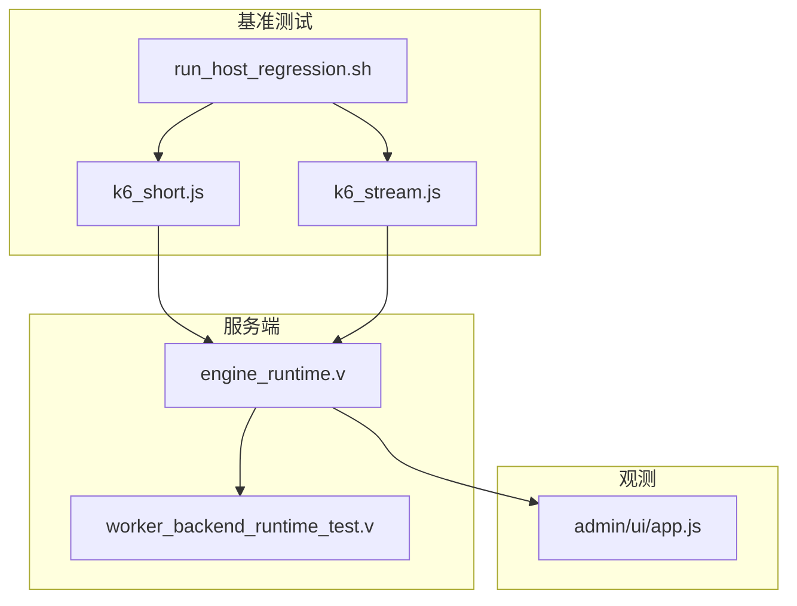
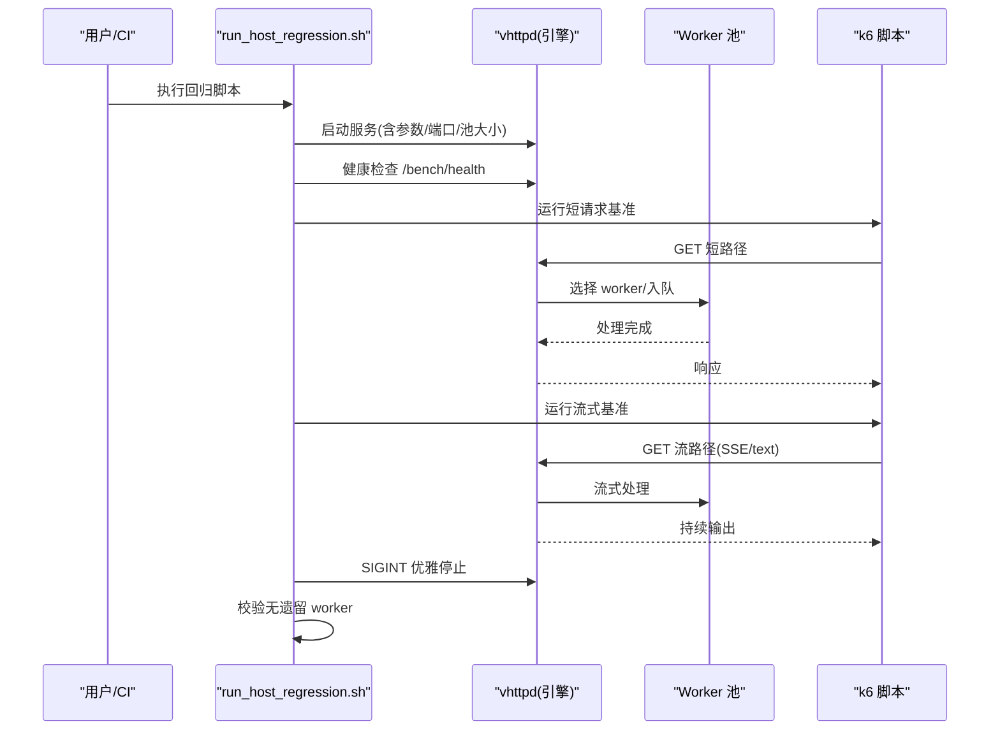
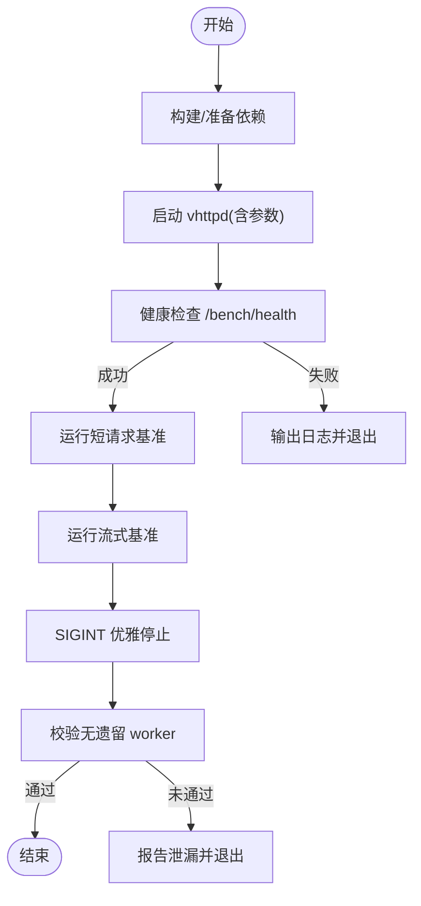
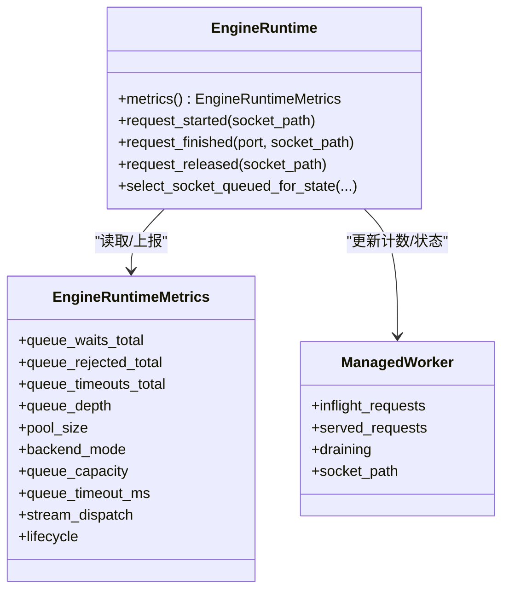
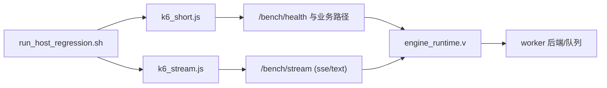

# 性能测试规范

<cite>
**本文引用的文件**   
- [bench/README.md](file://bench/README.md)
- [bench/k6_short.js](file://bench/k6_short.js)
- [bench/k6_stream.js](file://bench/k6_stream.js)
- [bench/run_host_regression.sh](file://bench/run_host_regression.sh)
- [src/engine_runtime.v](file://src/engine_runtime.v)
- [src/worker_backend_runtime_test.v](file://src/worker_backend_runtime_test.v)
- [admin/ui/app.js](file://admin/ui/app.js)
</cite>

## 目录
1. [引言](#引言)
2. [项目结构](#项目结构)
3. [核心组件](#核心组件)
4. [架构总览](#架构总览)
5. [详细组件分析](#详细组件分析)
6. [依赖关系分析](#依赖关系分析)
7. [性能考量](#性能考量)
8. [故障排查指南](#故障排查指南)
9. [结论](#结论)
10. [附录](#附录)

## 引言
本规范面向 vhttpd 的性能测试与基准测试，覆盖指标定义、压力测试工具使用（k6）、基准回归流程、内存与并发分析方法、以及优化建议。文档基于仓库内现有脚本与运行时实现进行说明，确保可复现与可落地。

## 项目结构
与性能测试直接相关的目录与文件：
- bench：k6 压测脚本与主机回归脚本
- src：引擎运行时与队列/工作进程管理逻辑
- admin/ui：观测面板展示部分指标

图表来源
- [bench/run_host_regression.sh:1-130](file://bench/run_host_regression.sh#L1-L130)
- [bench/k6_short.js:1-44](file://bench/k6_short.js#L1-L44)
- [bench/k6_stream.js:1-52](file://bench/k6_stream.js#L1-L52)
- [src/engine_runtime.v:1-361](file://src/engine_runtime.v#L1-L361)
- [src/worker_backend_runtime_test.v:1-427](file://src/worker_backend_runtime_test.v#L1-L427)
- [admin/ui/app.js:656-675](file://admin/ui/app.js#L656-L675)

章节来源
- [bench/README.md:1-158](file://bench/README.md#L1-L158)
- [bench/run_host_regression.sh:1-130](file://bench/run_host_regression.sh#L1-L130)
- [bench/k6_short.js:1-44](file://bench/k6_short.js#L1-L44)
- [bench/k6_stream.js:1-52](file://bench/k6_stream.js#L1-L52)
- [src/engine_runtime.v:1-361](file://src/engine_runtime.v#L1-L361)
- [src/worker_backend_runtime_test.v:1-427](file://src/worker_backend_runtime_test.v#L1-L427)
- [admin/ui/app.js:656-675](file://admin/ui/app.js#L656-L675)

## 核心组件
- k6 短请求基准脚本：定义 VU 增长阶段、阈值（失败率、延迟分位）与断言，用于快速回归。
- k6 流式基准脚本：针对 SSE/text 流场景，配置更长超时与更宽松的阈值，验证流式吞吐与稳定性。
- 主机回归脚本：一键构建、启动服务、健康检查、执行两类 k6 用例、优雅停止并校验无僵尸 worker。
- 引擎运行时：提供队列容量/超时、等待/拒绝/超时计数、池大小等关键指标；维护 inflight/served 计数与最大请求数触发排空重启。
- 观测面板：聚合 HTTP 请求/错误、路由、WebSocket、运行时长等指标，便于定位瓶颈。

章节来源
- [bench/k6_short.js:11-30](file://bench/k6_short.js#L11-L30)
- [bench/k6_stream.js:12-31](file://bench/k6_stream.js#L12-L31)
- [bench/run_host_regression.sh:18-130](file://bench/run_host_regression.sh#L18-L130)
- [src/engine_runtime.v:98-110](file://src/engine_runtime.v#L98-L110)
- [src/engine_runtime.v:234-249](file://src/engine_runtime.v#L234-L249)
- [src/engine_runtime.v:293-360](file://src/engine_runtime.v#L293-L360)
- [admin/ui/app.js:656-675](file://admin/ui/app.js#L656-L675)

## 架构总览
从端到端视角，基准测试由 shell 编排，驱动 k6 对目标路径发起请求或建立长连接，服务端通过引擎运行时选择后端执行器与 worker 池，返回响应或流式数据。

图表来源
- [bench/run_host_regression.sh:56-130](file://bench/run_host_regression.sh#L56-L130)
- [bench/k6_short.js:32-43](file://bench/k6_short.js#L32-L43)
- [bench/k6_stream.js:33-51](file://bench/k6_stream.js#L33-L51)
- [src/engine_runtime.v:140-155](file://src/engine_runtime.v#L140-L155)

## 详细组件分析

### 指标定义与采集
- 响应时间：k6 的 http_req_duration 百分位（p95/p99），在短请求与流式脚本中分别设置阈值。
- 吞吐量：由 k6 报告汇总（RPS），结合 VU 曲线与阶段策略评估。
- 资源利用率：通过系统监控（CPU/内存/IO）与内核态统计（队列深度、等待/拒绝/超时计数）综合判断。
- 错误率：k6 的 http_req_failed 比率；服务端队列满/超时也会产生拒绝与超时计数。
- 队列与池状态：队列容量、当前等待数、超时/拒绝累计、池大小、生命周期模式等。

章节来源
- [bench/k6_short.js:25-29](file://bench/k6_short.js#L25-L29)
- [bench/k6_stream.js:26-30](file://bench/k6_stream.js#L26-L30)
- [src/engine_runtime.v:98-110](file://src/engine_runtime.v#L98-L110)
- [src/engine_runtime.v:234-249](file://src/engine_runtime.v#L234-L249)
- [admin/ui/app.js:656-675](file://admin/ui/app.js#L656-L675)

### 压力测试工具与脚本
- 变量约定：统一以 VHTTPD_* 前缀命名，兼容旧名。
- 短请求基准：ramping-vus 阶段化加压，阈值要求失败率极低且 p95/p99 满足 SLA。
- 流式基准：针对 SSE/text 两种模式，延长超时与放宽阈值，断言包含事件片段或有效负载。
- 推荐对比矩阵：固定 tokens 变间隔（隔离传输开销）、固定间隔变 tokens（验证线性扩展）。

章节来源
- [bench/README.md:3-15](file://bench/README.md#L3-L15)
- [bench/README.md:59-100](file://bench/README.md#L59-L100)
- [bench/README.md:102-158](file://bench/README.md#L102-L158)
- [bench/k6_short.js:1-44](file://bench/k6_short.js#L1-L44)
- [bench/k6_stream.js:1-52](file://bench/k6_stream.js#L1-L52)

### 基准回归流程（一键回归）
- 构建与准备：按需构建 vhttpd 与依赖，检测 k6 是否安装。
- 启动与就绪：以指定 host/port/pool_size 启动，轮询 /bench/health 直至就绪。
- 执行基准：依次运行短请求与流式基准。
- 优雅退出与清理：发送 SIGINT，等待进程退出，校验无遗留 php-worker 子进程。
- 日志与事件：保留 stdout 与事件日志，便于问题回溯。

图表来源
- [bench/run_host_regression.sh:18-130](file://bench/run_host_regression.sh#L18-L130)

章节来源
- [bench/run_host_regression.sh:1-130](file://bench/run_host_regression.sh#L1-L130)

### 队列与 Worker 行为（并发与背压）
- 队列容量与超时：当队列满时直接拒绝；排队等待超过超时则返回“队列超时”。
- 等待/拒绝/超时计数：分别统计，便于区分拥塞类型。
- 最大请求数与排空：达到 max_requests 后标记 draining，空闲后自动重启槽位。
- inflight/served 计数：精确跟踪每个 worker 的请求处理情况。

图表来源
- [src/engine_runtime.v:98-110](file://src/engine_runtime.v#L98-L110)
- [src/engine_runtime.v:234-249](file://src/engine_runtime.v#L234-L249)
- [src/engine_runtime.v:293-360](file://src/engine_runtime.v#L293-L360)

章节来源
- [src/worker_backend_runtime_test.v:111-175](file://src/worker_backend_runtime_test.v#L111-L175)
- [src/worker_backend_runtime_test.v:177-246](file://src/worker_backend_runtime_test.v#L177-L246)
- [src/engine_runtime.v:293-360](file://src/engine_runtime.v#L293-L360)

### 观测与诊断
- 观测面板聚合：HTTP 请求/错误、路由数量、WebSocket 会话、运行时长等。
- 队列与池信息：通过运行时 metrics 暴露队列深度、容量、超时、池大小等。
- 事件日志：回归脚本输出事件日志，辅助定位异常。

章节来源
- [admin/ui/app.js:656-675](file://admin/ui/app.js#L656-L675)
- [src/engine_runtime.v:234-249](file://src/engine_runtime.v#L234-L249)
- [bench/run_host_regression.sh:29-34](file://bench/run_host_regression.sh#L29-L34)

## 依赖关系分析
- 回归脚本依赖 k6 与 vhttpd 二进制，依赖环境变量控制目标地址、路径、流模式与池大小。
- k6 脚本依赖目标服务的 /bench/health 与流接口，断言响应状态与内容。
- 引擎运行时依赖 worker 后端与 executor 接口，负责调度、队列与生命周期。

图表来源
- [bench/run_host_regression.sh:56-130](file://bench/run_host_regression.sh#L56-L130)
- [bench/k6_short.js:32-43](file://bench/k6_short.js#L32-L43)
- [bench/k6_stream.js:33-51](file://bench/k6_stream.js#L33-L51)
- [src/engine_runtime.v:140-155](file://src/engine_runtime.v#L140-L155)

章节来源
- [bench/README.md:1-158](file://bench/README.md#L1-L158)
- [src/engine_runtime.v:1-361](file://src/engine_runtime.v#L1-L361)

## 性能考量
- 指标基线：为短请求与流式场景分别设定 p95/p99 与失败率阈值，纳入 CI 门禁。
- 场景矩阵：按“固定 tokens 变间隔”和“固定间隔变 tokens”两组对比，分离传输开销与扩展性。
- 队列与池：关注 queue_capacity、queue_timeout_ms、queue_waiting_requests、pool_size 的变化趋势。
- 背压与降级：队列满拒绝与超时是重要信号，需结合应用层重试/熔断策略。
- 资源利用：结合系统级 CPU/内存/IO 与内核队列指标，定位热点路径。

[本节为通用指导，不直接分析具体文件]

## 故障排查指南
- 服务未就绪：健康检查失败时查看 stdout 日志，必要时检查 Unix domain socket 支持与 worker 命令路径。
- 队列超时/拒绝：若频繁出现“队列超时/队列满”，应提升 pool_size 或增大 queue_capacity/timeout。
- 僵尸进程：回归脚本会校验无遗留 php-worker，若发现泄漏，检查优雅停止与 worker 生命周期。
- 流式异常：确认流模式与路径参数一致，检查服务端流处理与客户端断言条件。

章节来源
- [bench/run_host_regression.sh:72-88](file://bench/run_host_regression.sh#L72-L88)
- [bench/run_host_regression.sh:104-130](file://bench/run_host_regression.sh#L104-L130)
- [src/worker_backend_runtime_test.v:111-175](file://src/worker_backend_runtime_test.v#L111-L175)

## 结论
本规范将 k6 压测、回归脚本与引擎运行时指标有机结合，形成可重复、可度量、可回归的性能工程体系。通过明确的指标定义、场景矩阵与自动化回归，能够快速发现性能退化并定位瓶颈。

[本节为总结，不直接分析具体文件]

## 附录
- 变量约定与示例：详见基准 README 中的统一命名与示例命令。
- 推荐对比矩阵：见“Group A/B”组合，便于隔离传输开销与验证线性扩展。
- 回归脚本用法：支持跳过 k6 仅验证生命周期，或自定义端口与池大小。

章节来源
- [bench/README.md:3-15](file://bench/README.md#L3-L15)
- [bench/README.md:102-158](file://bench/README.md#L102-L158)
- [bench/run_host_regression.sh:40-57](file://bench/run_host_regression.sh#L40-L57)