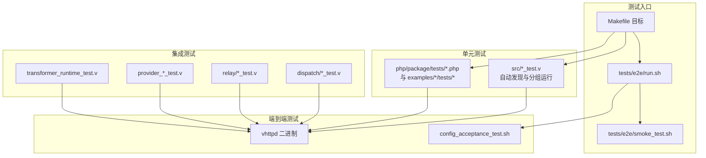
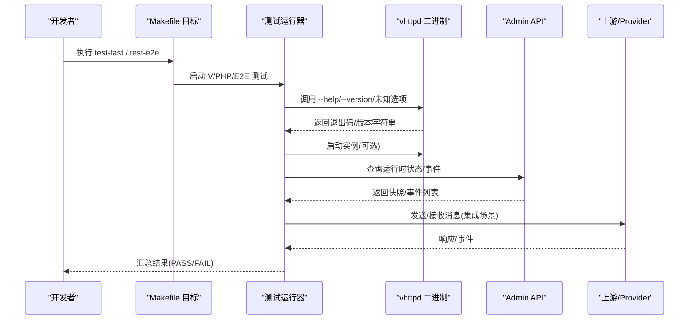
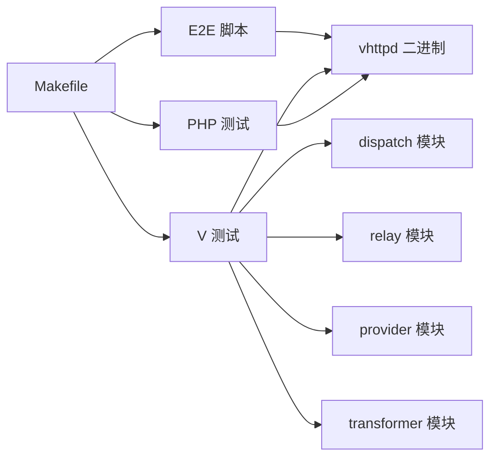

# 测试编写规范

<cite>
**本文引用的文件**   
- [README.md](file://README.md)
- [Makefile](file://Makefile)
- [tests/README.md](file://tests/README.md)
- [tests/e2e/run.sh](file://tests/e2e/run.sh)
- [tests/e2e/smoke_test.sh](file://tests/e2e/smoke_test.sh)
- [examples/codexbot-app/tests/TestCase.php](file://examples/codexbot-app/tests/TestCase.php)
- [examples/codexbot-app/tests/Pest.php](file://examples/codexbot-app/tests/Pest.php)
- [src/dispatch/plan_validation_test.v](file://src/dispatch/plan_validation_test.v)
- [src/relay/outbound_test.v](file://src/relay/outbound_test.v)
- [src/relay/delivery_test.v](file://src/relay/delivery_test.v)
- [src/relay/events_test.v](file://src/relay/events_test.v)
- [src/relay/response_completion_test.v](file://src/relay/response_completion_test.v)
- [src/provider_registry_test.v](file://src/provider_registry_test.v)
- [src/transformer_runtime_test.v](file://src/transformer_runtime_test.v)
- [docs/PROTOCOL_PIPELINE_IMPLEMENTATION_PLAN.md](file://docs/PROTOCOL_PIPELINE_IMPLEMENTATION_PLAN.md)
- [docs/refactor_0601.md](file://docs/refactor_0601.md)
</cite>

## 目录
1. [引言](#引言)
2. [项目结构](#项目结构)
3. [核心组件](#核心组件)
4. [架构总览](#架构总览)
5. [详细组件分析](#详细组件分析)
6. [依赖分析](#依赖分析)
7. [性能考虑](#性能考虑)
8. [故障排查指南](#故障排查指南)
9. [结论](#结论)
10. [附录](#附录)

## 引言
本规范面向 vhttpd 项目的测试编写与最佳实践，覆盖单元测试、集成测试、端到端（E2E）测试、性能与基准测试、覆盖率要求与报告生成、调试技巧与常见问题排查，以及测试数据与环境配置。目标是让不同背景的贡献者都能快速上手并保持一致的测试质量与可维护性。

## 项目结构
vhttpd 的测试体系由三类组成：
- 单元测试：V 语言测试与 PHP 测试并存。V 测试与源码同目录组织，PHP 测试位于示例应用与包内 tests 目录。
- 集成测试：通过 V 测试对运行时模块进行组合验证，覆盖适配器契约、变换器一致性等。
- 端到端测试：基于 shell 脚本驱动已编译的二进制，无需外部依赖即可执行冒烟与配置验收用例。

图示来源
- [Makefile:145-199](file://Makefile#L145-L199)
- [tests/README.md:1-38](file://tests/README.md#L1-L38)
- [tests/e2e/run.sh:1-15](file://tests/e2e/run.sh#L1-L15)
- [tests/e2e/smoke_test.sh:1-62](file://tests/e2e/smoke_test.sh#L1-L62)

章节来源
- [tests/README.md:1-38](file://tests/README.md#L1-L38)
- [Makefile:145-199](file://Makefile#L145-L199)

## 核心组件
- 测试发现与执行
  - V 单元测试：通过 Makefile 自动发现 src 下 *_test.v 及子模块目录，支持 fast/inproc/codexbot 多组目标。
  - PHP 测试：通过 Makefile 遍历 php/package/tests 下的 *_test.php 直接以 php 命令执行。
  - E2E 测试：tests/e2e/run.sh 作为统一入口，顺序执行冒烟与配置验收脚本。
- 测试分类与范围
  - 纯单元：协议解析、匹配器、能力校验、错误分类等。
  - 变换器一致性：同一 fixture 在原生 V 与 VJSX 实现上等价。
  - 适配器契约：HTTP、事件、流、WebSocket、MCP、Relay 交付等。
  - 集成：跨层流程如 HTTP->Worker->Response、WebSocket、Stream、Relay 重连等。
  - 回归：WordPress/WooCommerce、OpenAI 流式、Feishu、Paseo 等。

章节来源
- [Makefile:37-82](file://Makefile#L37-L82)
- [Makefile:163-199](file://Makefile#L163-L199)
- [docs/PROTOCOL_PIPELINE_IMPLEMENTATION_PLAN.md:688-750](file://docs/PROTOCOL_PIPELINE_IMPLEMENTATION_PLAN.md#L688-L750)

## 架构总览
下图展示测试如何与运行时交互，包括 CLI 参数、配置加载、调度管道、提供者与上游等关键路径。

图示来源
- [tests/e2e/smoke_test.sh:1-62](file://tests/e2e/smoke_test.sh#L1-L62)
- [tests/e2e/run.sh:1-15](file://tests/e2e/run.sh#L1-L15)
- [README.md:84-126](file://README.md#L84-L126)

## 详细组件分析

### 单元测试编写规范（V）
- 命名与组织
  - 文件名遵循 *_test.v，与源码同目录或子模块目录；Makefile 会自动发现并按目录运行以保证模块上下文完整。
  - 按功能域划分：dispatch、relay、provider、transformer 等。
- 断言与风格
  - 使用 assert 表达预期；复杂对象建议比较关键字段，避免过度耦合内部结构。
  - 失败时尽量输出上下文信息（trace_id、channel_id、frame_id 等），便于定位。
- 典型模式
  - 构造最小化计划/状态，注入服务与交换对象，验证行为与诊断信息。
  - 针对不可用后端、非法输入、能力不匹配等边界条件设计用例。

参考实现路径
- [src/dispatch/plan_validation_test.v:1-45](file://src/dispatch/plan_validation_test.v#L1-L45)
- [src/relay/outbound_test.v:1-43](file://src/relay/outbound_test.v#L1-L43)
- [src/relay/delivery_test.v:85-107](file://src/relay/delivery_test.v#L85-L107)
- [src/relay/events_test.v:85-149](file://src/relay/events_test.v#L85-L149)
- [src/relay/response_completion_test.v:145-198](file://src/relay/response_completion_test.v#L145-L198)
- [src/provider_registry_test.v:600-663](file://src/provider_registry_test.v#L600-L663)
- [src/transformer_runtime_test.v:48-291](file://src/transformer_runtime_test.v#L48-L291)

章节来源
- [tests/README.md:13-22](file://tests/README.md#L13-L22)
- [Makefile:37-82](file://Makefile#L37-L82)
- [src/dispatch/plan_validation_test.v:1-45](file://src/dispatch/plan_validation_test.v#L1-L45)
- [src/relay/outbound_test.v:1-43](file://src/relay/outbound_test.v#L1-L43)
- [src/relay/delivery_test.v:85-107](file://src/relay/delivery_test.v#L85-L107)
- [src/relay/events_test.v:85-149](file://src/relay/events_test.v#L85-L149)
- [src/relay/response_completion_test.v:145-198](file://src/relay/response_completion_test.v#L145-L198)
- [src/provider_registry_test.v:600-663](file://src/provider_registry_test.v#L600-L663)
- [src/transformer_runtime_test.v:48-291](file://src/transformer_runtime_test.v#L48-L291)

### 单元测试编写规范（PHP）
- 命名与组织
  - 使用 PHPUnit TestCase 基类，示例中提供 Tests\TestCase 抽象基类。
  - Feature 用例通过 Pest 扩展至 tests/Feature 目录。
- 断言与风格
  - 使用框架提供的断言方法；保持用例聚焦单一职责。
- 参考实现路径
  - [examples/codexbot-app/tests/TestCase.php:1-11](file://examples/codexbot-app/tests/TestCase.php#L1-L11)
  - [examples/codexbot-app/tests/Pest.php:1-6](file://examples/codexbot-app/tests/Pest.php#L1-L6)

章节来源
- [examples/codexbot-app/tests/TestCase.php:1-11](file://examples/codexbot-app/tests/TestCase.php#L1-L11)
- [examples/codexbot-app/tests/Pest.php:1-6](file://examples/codexbot-app/tests/Pest.php#L1-L6)

### 集成测试编写方法
- 测试环境搭建
  - 优先使用内存态/无网络的最小化状态构造，必要时启用 SQLite 等轻量存储。
  - 通过 RuntimeServices 与 Exchange 模拟上下游交互。
- 依赖模拟
  - 为 Carrier、Provider、Transformer 等构建最小可用桩或空实现，仅暴露必要接口。
- 数据准备
  - 使用工厂函数构造 ResourceRef、WireFrame、OutboundOutcome 等核心数据结构，确保字段完整且稳定。
- 参考实现路径
  - [src/relay/outbound_test.v:1-43](file://src/relay/outbound_test.v#L1-L43)
  - [src/relay/delivery_test.v:85-107](file://src/relay/delivery_test.v#L85-L107)
  - [src/relay/events_test.v:85-149](file://src/relay/events_test.v#L85-L149)
  - [src/relay/response_completion_test.v:145-198](file://src/relay/response_completion_test.v#L145-L198)
  - [src/provider_registry_test.v:600-663](file://src/provider_registry_test.v#L600-L663)
  - [src/transformer_runtime_test.v:48-291](file://src/transformer_runtime_test.v#L48-L291)

章节来源
- [src/relay/outbound_test.v:1-43](file://src/relay/outbound_test.v#L1-L43)
- [src/relay/delivery_test.v:85-107](file://src/relay/delivery_test.v#L85-L107)
- [src/relay/events_test.v:85-149](file://src/relay/events_test.v#L85-L149)
- [src/relay/response_completion_test.v:145-198](file://src/relay/response_completion_test.v#L145-L198)
- [src/provider_registry_test.v:600-663](file://src/provider_registry_test.v#L600-L663)
- [src/transformer_runtime_test.v:48-291](file://src/transformer_runtime_test.v#L48-L291)

### 端到端测试实现方式
- 测试场景设计
  - 冒烟测试：CLI 帮助、版本输出、未知选项拒绝等基础能力。
  - 配置验收：TOML 配置加载、变量展开、站点/监听器组合等。
- 浏览器自动化
  - 当前仓库未包含浏览器自动化用例；如需引入，建议在 e2e 目录下新增独立脚本，并通过环境变量隔离端口与临时目录。
- API 测试
  - 通过 Admin API 获取运行时快照、事件与活动，验证系统状态与链路追踪。
- 参考实现路径
  - [tests/e2e/run.sh:1-15](file://tests/e2e/run.sh#L1-L15)
  - [tests/e2e/smoke_test.sh:1-62](file://tests/e2e/smoke_test.sh#L1-L62)
  - [README.md:84-126](file://README.md#L84-L126)

章节来源
- [tests/e2e/run.sh:1-15](file://tests/e2e/run.sh#L1-L15)
- [tests/e2e/smoke_test.sh:1-62](file://tests/e2e/smoke_test.sh#L1-L62)
- [README.md:84-126](file://README.md#L84-L126)

### 性能测试与基准测试指导
- 指标定义
  - 吞吐（QPS）、延迟（P50/P95/P99）、资源占用（CPU/内存）、连接数与队列长度。
- 工具与脚本
  - bench 目录提供 k6 脚本与回归运行脚本，可用于压测与回归检测。
- 回归检测
  - 在 CI 中固定数据集与负载模型，对比历史基线阈值，超阈即告警。
- 参考实现路径
  - [bench/README.md](file://bench/README.md)
  - [bench/k6_short.js](file://bench/k6_short.js)
  - [bench/k6_stream.js](file://bench/k6_stream.js)
  - [bench/run_host_regression.sh](file://bench/run_host_regression.sh)

章节来源
- [bench/README.md](file://bench/README.md)
- [bench/k6_short.js](file://bench/k6_short.js)
- [bench/k6_stream.js](file://bench/k6_stream.js)
- [bench/run_host_regression.sh](file://bench/run_host_regression.sh)

### 测试覆盖率要求与报告生成
- 现状与建议
  - 当前仓库未内置覆盖率门禁；建议在 CI 中增加覆盖率收集与阈值检查，核心模块（kernel_dispatch、worker_backend、logic_executor）覆盖率不低于 60%。
  - 建议将测试目录逐步迁移至 tests/unit、tests/integration、tests/inproc，并通过 v test 递归运行，减少 Makefile 硬编码。
- 参考依据
  - [docs/refactor_0601.md:94-109](file://docs/refactor_0601.md#L94-L109)

章节来源
- [docs/refactor_0601.md:94-109](file://docs/refactor_0601.md#L94-L109)

### 测试调试技巧与常见问题排查
- 常见现象
  - 二进制缺失导致 E2E 失败：需先执行 make build。
  - 未知选项或短选项被拒绝：应返回非零退出码。
  - 版本输出格式不符合预期：需匹配语义化版本正则。
- 调试步骤
  - 单独运行冒烟脚本定位问题；查看 Admin API 快照与事件日志；缩小到具体模块的 *_test.v 用例复现。
- 参考实现路径
  - [tests/e2e/smoke_test.sh:14-53](file://tests/e2e/smoke_test.sh#L14-L53)

章节来源
- [tests/e2e/smoke_test.sh:14-53](file://tests/e2e/smoke_test.sh#L14-L53)

### 测试数据管理与测试环境配置最佳实践
- 数据管理
  - 使用最小化、可重复的数据构造；避免真实外部依赖；必要时使用内存态或 SQLite。
  - 将 fixture 与测试分离，集中存放于 fixtures 目录，按需加载。
- 环境配置
  - 通过 TOML 配置与 CLI 参数组合控制端口、根目录、事件日志路径等；利用变量展开复用配置片段。
  - 多监听/多站点模式下，每个站点拥有独立运行时与执行器选择，便于并行与隔离。
- 参考实现路径
  - [README.md:437-617](file://README.md#L437-L617)
  - [tests/e2e/fixtures](file://tests/e2e/fixtures)

章节来源
- [README.md:437-617](file://README.md#L437-L617)
- [tests/e2e/fixtures](file://tests/e2e/fixtures)

## 依赖分析
测试与运行时的依赖关系如下：
- Makefile 负责发现与分发测试任务，串联 V 与 PHP 测试以及 E2E 脚本。
- E2E 脚本依赖已编译的二进制，并通过 CLI 与 Admin API 与运行时交互。
- 各模块测试依赖对应运行时模块的公开接口与数据结构。

图示来源
- [Makefile:145-199](file://Makefile#L145-L199)
- [tests/e2e/run.sh:1-15](file://tests/e2e/run.sh#L1-L15)
- [tests/e2e/smoke_test.sh:1-62](file://tests/e2e/smoke_test.sh#L1-L62)

章节来源
- [Makefile:145-199](file://Makefile#L145-L199)
- [tests/e2e/run.sh:1-15](file://tests/e2e/run.sh#L1-L15)
- [tests/e2e/smoke_test.sh:1-62](file://tests/e2e/smoke_test.sh#L1-L62)

## 性能考虑
- 测试分层
  - 快测优先：fast 目标排除 inproc 与 db 相关用例，保证本地迭代效率。
  - 慢测隔离：inproc 与 codexbot 生命周期用例单独目标，避免阻塞主流程。
- 资源隔离
  - E2E 与集成测试使用独立端口与临时目录，避免并发冲突。
- 可观测性
  - 结合事件日志与 Admin API 快照，定位性能瓶颈与异常路径。

[本节为通用指导，不直接分析具体文件]

## 故障排查指南
- 二进制不存在
  - 现象：E2E 报错找不到 vhttpd 二进制。
  - 处理：先执行 make build，再运行测试。
- 未知选项/短选项
  - 现象：传入不支持的参数后退出码非零。
  - 处理：修正参数或确认期望行为。
- 版本输出格式
  - 现象：版本字符串不符合预期格式。
  - 处理：检查构建产物与版本注入逻辑。
- 配置加载
  - 现象：TOML 变量展开或站点/监听器映射异常。
  - 处理：核对配置优先级与路径解析规则。

章节来源
- [tests/e2e/smoke_test.sh:14-53](file://tests/e2e/smoke_test.sh#L14-L53)
- [README.md:437-617](file://README.md#L437-L617)

## 结论
本规范明确了 vhttpd 的测试分层、组织方式与执行策略，提供了从单元到 E2E 的完整实践指引。建议后续推进测试目录隔离、覆盖率门禁与 Mock/契约测试完善，进一步提升稳定性与可维护性。

[本节为总结性内容，不直接分析具体文件]

## 附录
- 测试策略清单（来自实现计划文档）
  - 纯单元、变换器一致性、适配器契约、集成、回归等类别与覆盖范围。
- 参考实现路径
  - [docs/PROTOCOL_PIPELINE_IMPLEMENTATION_PLAN.md:688-750](file://docs/PROTOCOL_PIPELINE_IMPLEMENTATION_PLAN.md#L688-L750)

章节来源
- [docs/PROTOCOL_PIPELINE_IMPLEMENTATION_PLAN.md:688-750](file://docs/PROTOCOL_PIPELINE_IMPLEMENTATION_PLAN.md#L688-L750)