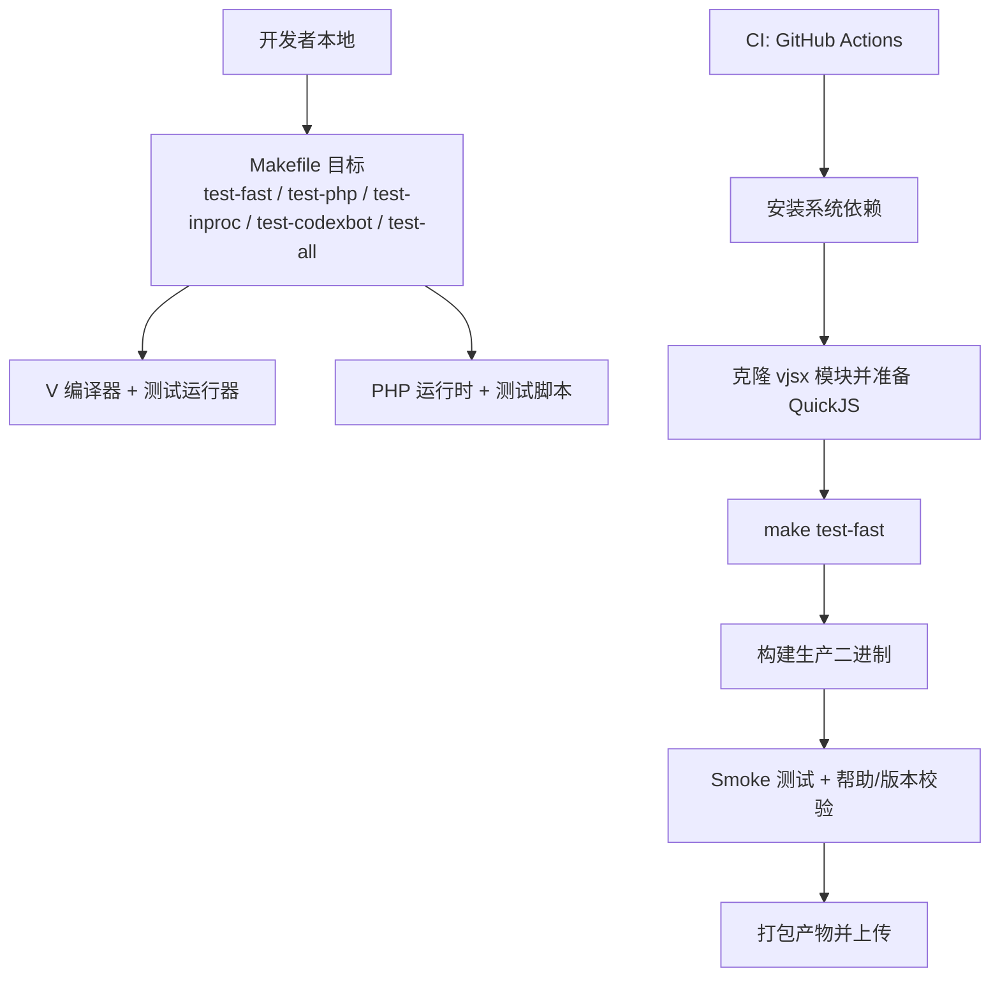
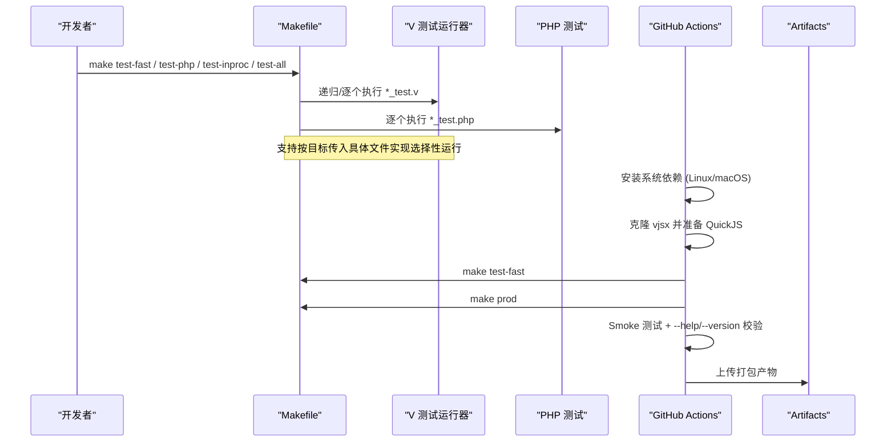
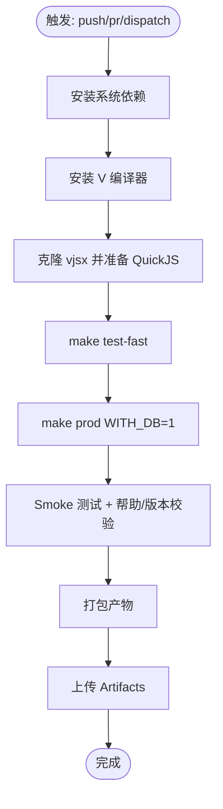
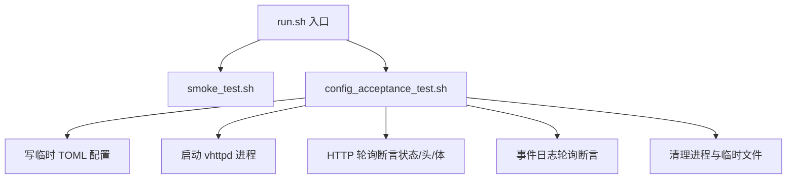
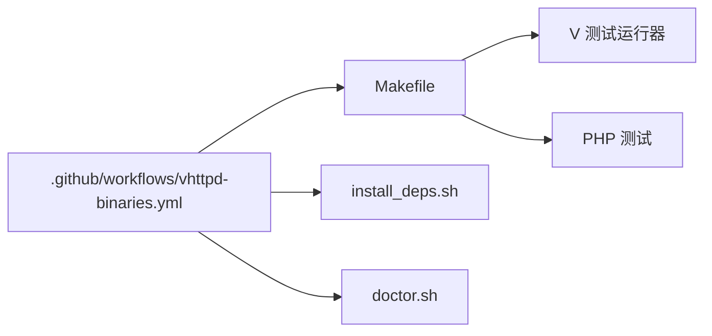

# 测试自动化

<cite>
**本文引用的文件**   
- [Makefile](file://Makefile)
- [.github/workflows/vhttpd-binaries.yml](file://.github/workflows/vhttpd-binaries.yml)
- [tests/e2e/run.sh](file://tests/e2e/run.sh)
- [tests/e2e/smoke_test.sh](file://tests/e2e/smoke_test.sh)
- [tests/e2e/config_acceptance_test.sh](file://tests/e2e/config_acceptance_test.sh)
- [scripts/install_deps.sh](file://scripts/install_deps.sh)
- [scripts/doctor.sh](file://scripts/doctor.sh)
- [README.md](file://README.md)
</cite>

## 目录
1. [简介](#简介)
2. [项目结构](#项目结构)
3. [核心组件](#核心组件)
4. [架构总览](#架构总览)
5. [详细组件分析](#详细组件分析)
6. [依赖关系分析](#依赖关系分析)
7. [性能与并行执行](#性能与并行执行)
8. [故障排查指南](#故障排查指南)
9. [结论](#结论)
10. [附录](#附录)

## 简介
本规范面向 vhttpd 项目的测试自动化与 CI/CD 集成，覆盖以下目标：
- 统一测试执行命令与参数配置（含过滤、选择性运行）
- 持续集成流水线（GitHub Actions）触发条件、失败通知与产物管理
- 测试报告与覆盖率输出（HTML、JUnit、覆盖率统计）
- 测试环境管理与依赖自动安装（脚本化、可缓存）
- 调试与排障（日志收集、断点调试、问题复现）
- 维护最佳实践与版本兼容性保证

## 项目结构
仓库内与测试自动化直接相关的目录与文件：
- Makefile：定义构建与测试目标，支持按文件/目录选择、分组执行
- .github/workflows/vhttpd-binaries.yml：CI 工作流，包含依赖安装、编译、快速测试、打包与上传
- tests/e2e/*：端到端测试入口与用例脚本
- scripts/*：依赖安装与环境检查脚本

图示来源
- [Makefile:145-199](file://Makefile#L145-L199)
- [.github/workflows/vhttpd-binaries.yml:127-171](file://.github/workflows/vhttpd-binaries.yml#L127-L171)

章节来源
- [Makefile:1-199](file://Makefile#L1-L199)
- [.github/workflows/vhttpd-binaries.yml:1-171](file://.github/workflows/vhttpd-binaries.yml#L1-L171)
- [tests/e2e/run.sh:1-15](file://tests/e2e/run.sh#L1-L15)

## 核心组件
- 测试编排与筛选（Makefile）
  - 自动发现 V 单元测试文件，排除重型 inproc 与网络相关 db 测试
  - 提供多组目标：test-fast、test-php、test-inproc、test-codexbot、test-codexbot-fast、test-codexbot-lifecycle、test-all
  - 支持通过命令行目标直接指定单个 *.v 或 *.php 文件进行选择性运行
- 端到端测试套件（tests/e2e）
  - run.sh 作为统一入口，顺序执行冒烟与配置验收测试
  - smoke_test.sh 验证二进制基本能力（--help/--version/未知选项）
  - config_acceptance_test.sh 启动 vhttpd 实例，基于 HTTP/事件日志断言配置场景
- CI 流水线（GitHub Actions）
  - 在构建前执行 make test-fast
  - 构建生产二进制后执行 Smoke 测试
  - 打包产物并上传到 GitHub Actions Artifacts
- 环境与依赖管理（scripts）
  - install_deps.sh：跨平台安装构建依赖、拉取 vjsx 模块与 managed QuickJS 源码
  - doctor.sh：检查 v、pkg-config、OpenSSL、bdw-gc、vjsx、QuickJS、sqlite3、mysql_config/pg_config 等

章节来源
- [Makefile:37-82](file://Makefile#L37-L82)
- [Makefile:145-199](file://Makefile#L145-L199)
- [tests/e2e/run.sh:1-15](file://tests/e2e/run.sh#L1-L15)
- [tests/e2e/smoke_test.sh:1-62](file://tests/e2e/smoke_test.sh#L1-L62)
- [tests/e2e/config_acceptance_test.sh:1-120](file://tests/e2e/config_acceptance_test.sh#L1-L120)
- [.github/workflows/vhttpd-binaries.yml:127-171](file://.github/workflows/vhttpd-binaries.yml#L127-L171)
- [scripts/install_deps.sh:1-138](file://scripts/install_deps.sh#L1-L138)
- [scripts/doctor.sh:1-108](file://scripts/doctor.sh#L1-L108)

## 架构总览
下图展示从本地开发到 CI 的端到端流程，包括测试分层、产物与报告。

图示来源
- [Makefile:145-199](file://Makefile#L145-L199)
- [.github/workflows/vhttpd-binaries.yml:47-171](file://.github/workflows/vhttpd-binaries.yml#L47-L171)

## 详细组件分析

### 测试执行命令与参数配置
- 快速单元与模块测试
  - 目标：test-fast
  - 行为：自动发现顶层 *_test.v 与子目录 *_test.v 所在目录，跳过 inproc_* 与 db_* 测试
  - 选择性运行：可直接将目标指向具体 *.v 文件，例如 make test-fast src/foo/bar_test.v
- PHP 测试
  - 目标：test-php
  - 行为：遍历 php/package/tests 下 *_test.php 并逐一执行
  - 选择性运行：make test-php path/to/test_file.php
- In-proc 与 Codexbot 专项
  - 目标：test-inproc、test-codexbot、test-codexbot-fast、test-codexbot-lifecycle
  - 行为：分别针对 inproc_*_test.v 与 codexbot 相关测试集执行
- 全量测试
  - 目标：test-all
  - 行为：对 src 目录整体执行测试（包含重型测试）
- 端到端测试
  - 目标：test-e2e
  - 行为：调用 tests/e2e/run.sh，依次执行冒烟与配置验收测试

建议用法
- 本地快速反馈：make test-fast
- 仅运行某个 V 测试：make test-fast src/path/file_test.v
- 仅运行某个 PHP 测试：make test-php php/package/tests/some_test.php
- 完整回归：make test-all && make test-e2e

章节来源
- [Makefile:37-82](file://Makefile#L37-L82)
- [Makefile:145-199](file://Makefile#L145-L199)

### 持续集成流水线（GitHub Actions）
- 触发条件
  - push 至 main 分支且路径匹配 src/**、dbsrc/**、Makefile、v.mod、.github/workflows/vhttpd-binaries.yml
  - pull_request 且路径匹配同上
  - workflow_dispatch 手动触发
- 关键步骤
  - 安装系统依赖（Linux/macOS）
  - 安装 V 编译器
  - 克隆 vjsx 模块并准备 managed QuickJS 源码
  - 执行 make test-fast（阻断式）
  - 构建生产二进制（WITH_DB=1、VPHP_V_GC=boehm）
  - Smoke 测试（--help、--version、未知选项返回非零）
  - 打包产物并上传 Artifacts
- 失败通知机制
  - 当前未显式配置通知；建议在 job 失败时增加通知步骤（如 Slack/Discord Webhook 或邮件），或在 PR 中启用评论通知

图示来源
- [.github/workflows/vhttpd-binaries.yml:1-171](file://.github/workflows/vhttpd-binaries.yml#L1-L171)

章节来源
- [.github/workflows/vhttpd-binaries.yml:1-171](file://.github/workflows/vhttpd-binaries.yml#L1-L171)

### 测试报告与覆盖率
- 现状
  - 当前 Makefile 与 CI 未内置 HTML/JUnit 报告与覆盖率生成
- 建议方案
  - V 测试覆盖率：在 CI 中使用 V 支持的覆盖率开关（例如 -coverage）并在失败时设置阈值门禁
  - PHP 测试覆盖率：使用 PHPUnit 的 --coverage-html、--coverage-text、--coverage-clover、--log-junit 等参数生成报告与 JUnit XML
  - 报告归档：在 CI 中将生成的报告与覆盖率工件上传为 Artifacts，便于下载与分析
- 参考示例（来自第三方包 composer.json 中的命令片段）
  - 可在项目中引入类似命令以生成 HTML 与 JUnit 报告

章节来源
- [examples/laravel/vendor/ramsey/collection/composer.json:88-103](file://examples/laravel/vendor/ramsey/collection/composer.json#L88-L103)
- [examples/laravel/vendor/ramsey/uuid/composer.json:93-109](file://examples/laravel/vendor/ramsey/uuid/composer.json#L93-L109)

### 测试环境管理与依赖自动安装
- 本地环境准备
  - 安装核心依赖：make deps-core
  - 安装 vjsx 依赖：make deps-vjsx
  - 安装 DB 依赖：make deps-db
  - 一键全量：make deps-full
  - 环境自检：make doctor
- 脚本职责
  - install_deps.sh：根据 OS 安装必要库、确保 vjsx 模块与 managed QuickJS 源码可用
  - doctor.sh：检查 v、pkg-config、OpenSSL、bdw-gc、vjsx、QuickJS、sqlite3、mysql_config/pg_config 等
- CI 环境
  - 已在 GitHub Actions 中安装 Linux/macOS 所需依赖，并准备 vjsx 与 QuickJS

章节来源
- [Makefile:109-123](file://Makefile#L109-L123)
- [scripts/install_deps.sh:1-138](file://scripts/install_deps.sh#L1-L138)
- [scripts/doctor.sh:1-108](file://scripts/doctor.sh#L1-L108)
- [.github/workflows/vhttpd-binaries.yml:47-116](file://.github/workflows/vhttpd-binaries.yml#L47-L116)

### 端到端测试与配置验收
- 入口：tests/e2e/run.sh
  - 顺序执行冒烟与配置验收测试
- 冒烟测试：tests/e2e/smoke_test.sh
  - 校验 --help、--version、未知选项返回非零
- 配置验收：tests/e2e/config_acceptance_test.sh
  - 动态创建临时目录与配置文件
  - 启动 vhttpd 进程，轮询 HTTP 响应与事件日志
  - 断言 v1/v2 配置、缺失引用、WebSocket/Relay 等场景

图示来源
- [tests/e2e/run.sh:1-15](file://tests/e2e/run.sh#L1-L15)
- [tests/e2e/smoke_test.sh:1-62](file://tests/e2e/smoke_test.sh#L1-L62)
- [tests/e2e/config_acceptance_test.sh:1-120](file://tests/e2e/config_acceptance_test.sh#L1-L120)

章节来源
- [tests/e2e/run.sh:1-15](file://tests/e2e/run.sh#L1-L15)
- [tests/e2e/smoke_test.sh:1-62](file://tests/e2e/smoke_test.sh#L1-L62)
- [tests/e2e/config_acceptance_test.sh:1-120](file://tests/e2e/config_acceptance_test.sh#L1-L120)

### Docker 容器化测试（建议）
- 目的：隔离依赖、提升可重复性与并行度
- 建议策略
  - 使用官方 V 镜像或自维护镜像，预装 OpenSSL、BDW GC、SQLite/MySQL/PostgreSQL 客户端
  - 挂载源码与工作目录，复用 V 编译器缓存与 vjsx 模块缓存
  - 在容器中执行 make test-fast、make test-php、make test-e2e
  - 将报告与覆盖率产物写入挂载卷供后续分析
- 注意
  - 当前仓库未提供 Dockerfile；可按上述策略自行补充

[本节为概念性建议，不直接分析具体文件]

## 依赖关系分析
- Makefile 与测试目标
  - 自动发现 *_test.v 与 *_test.php，支持按目标选择
  - 提供分组目标（fast/inproc/codexbot/all）
- CI 与 Makefile
  - CI 在构建前执行 make test-fast，构建后执行 Smoke 测试
- 脚本与工具链
  - install_deps.sh 负责依赖安装与 vjsx/QuickJS 准备
  - doctor.sh 用于环境自检

图示来源
- [Makefile:37-82](file://Makefile#L37-L82)
- [Makefile:145-199](file://Makefile#L145-L199)
- [.github/workflows/vhttpd-binaries.yml:127-171](file://.github/workflows/vhttpd-binaries.yml#L127-L171)
- [scripts/install_deps.sh:1-138](file://scripts/install_deps.sh#L1-L138)
- [scripts/doctor.sh:1-108](file://scripts/doctor.sh#L1-L108)

章节来源
- [Makefile:37-82](file://Makefile#L37-L82)
- [Makefile:145-199](file://Makefile#L145-L199)
- [.github/workflows/vhttpd-binaries.yml:127-171](file://.github/workflows/vhttpd-binaries.yml#L127-L171)
- [scripts/install_deps.sh:1-138](file://scripts/install_deps.sh#L1-L138)
- [scripts/doctor.sh:1-108](file://scripts/doctor.sh#L1-L108)

## 性能与并行执行
- 现状
  - 当前 Makefile 串行执行每个测试文件/目录
- 优化建议
  - 使用 V 测试运行器的并行选项（若可用）或在 Makefile 中引入 xargs/parallel 对 fast 测试进行并发执行
  - 将重型 inproc/codexbot 测试放入独立 job 或阶段，避免阻塞主流程
  - 在 CI 中开启矩阵并行（不同 OS/架构）已存在，可进一步拆分测试阶段
- 风险与注意事项
  - 并发可能带来端口/临时文件竞争，需确保 e2e 测试使用随机端口与隔离目录（现有脚本已采用随机 PID/临时目录）

[本节为通用指导，不直接分析具体文件]

## 故障排查指南
- 常见错误定位
  - 构建依赖缺失：运行 make doctor 查看缺失项
  - vjsx/QuickJS 未就绪：运行 make deps-vjsx 或 scripts/install_deps.sh vjsx
  - 环境变量与路径：确认 VJS_QUICKJS_PATH、VHTTPD_VJSX_ROOT 等是否按预期设置
- 日志收集
  - e2e 配置验收测试会将 vhttpd 标准输出重定向到临时日志文件，失败时会打印最近若干行日志
  - 可通过修改 config_acceptance_test.sh 中的轮询与断言逻辑增强诊断信息
- 断点调试
  - V 测试：在本地 IDE 中打断点并直接运行对应 *_test.v
  - PHP 测试：使用 Xdebug 或 IDE 调试器运行 *_test.php
  - 端到端：在 config_acceptance_test.sh 中暂停启动进程，手动 curl 与 tail 日志进行交互式排查
- 问题复现
  - 使用 e2e 提供的临时目录与随机端口，确保每次运行互不影响
  - 将失败时的日志与请求/响应保存到工件中，便于回溯

章节来源
- [scripts/doctor.sh:1-108](file://scripts/doctor.sh#L1-L108)
- [scripts/install_deps.sh:1-138](file://scripts/install_deps.sh#L1-L138)
- [tests/e2e/config_acceptance_test.sh:1-120](file://tests/e2e/config_acceptance_test.sh#L1-L120)

## 结论
- 本项目已具备完善的测试分层与 CI 基础：快速单元、PHP 测试、inproc/codexbot 专项、端到端冒烟与配置验收
- 建议在 CI 中补齐覆盖率与报告产出，并引入失败通知机制
- 推荐引入 Docker 容器化以提升可重复性与并行度
- 通过 Makefile 的选择性运行与 e2e 的隔离设计，可有效缩短反馈周期并降低排障成本

[本节为总结性内容，不直接分析具体文件]

## 附录
- 常用命令速查
  - 安装依赖：make deps-core | make deps-vjsx | make deps-db | make deps-full
  - 环境自检：make doctor
  - 快速测试：make test-fast
  - PHP 测试：make test-php
  - 端到端：make test-e2e
  - 全量测试：make test-all
- 参考文档
  - README 中关于依赖、构建、分发与服务管理的说明可作为部署与运维参考

章节来源
- [Makefile:109-123](file://Makefile#L109-L123)
- [README.md:210-271](file://README.md#L210-L271)