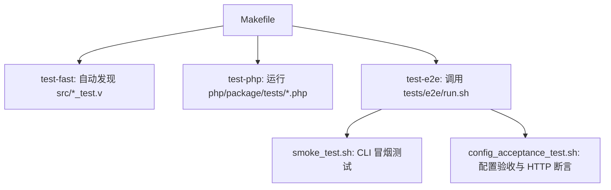
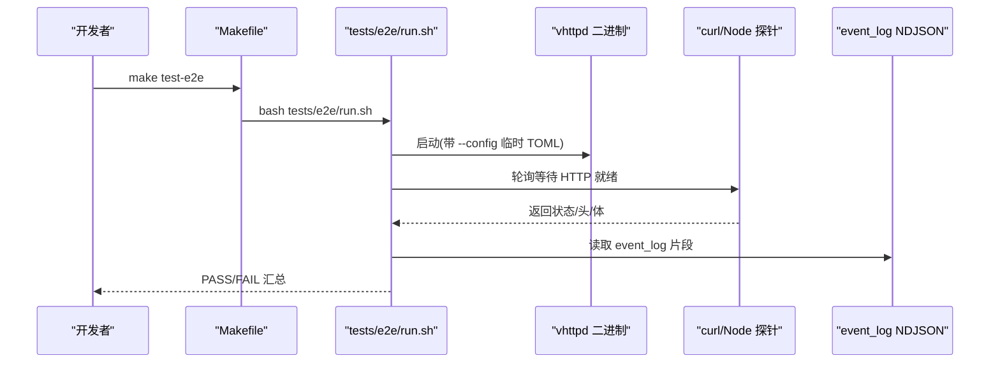
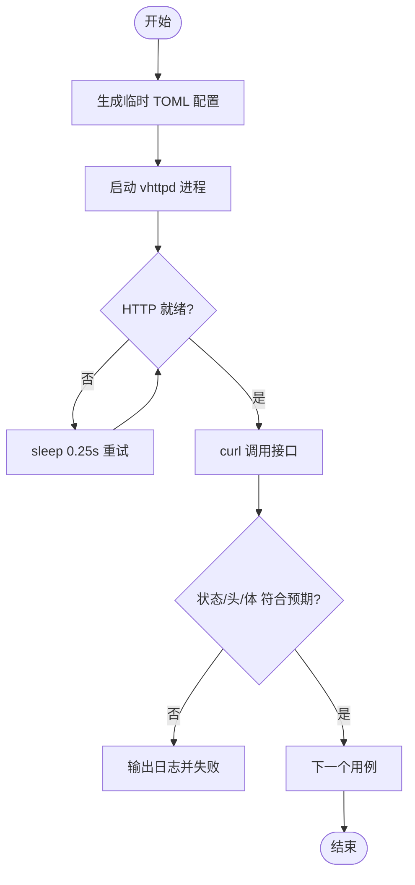
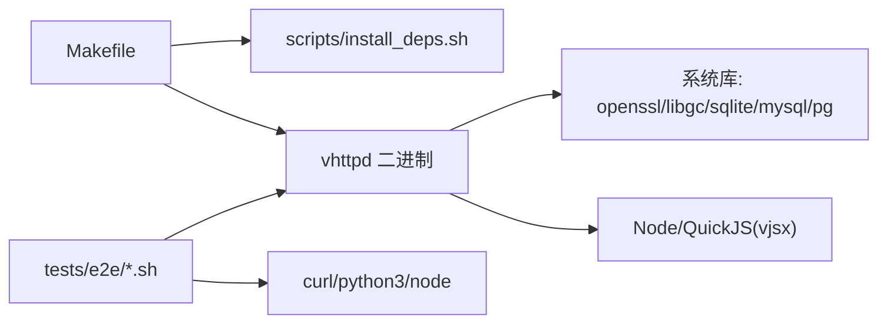

# 集成测试规范

<cite>
**本文引用的文件**   
- [README.md](file://README.md)
- [Makefile](file://Makefile)
- [tests/README.md](file://tests/README.md)
- [tests/e2e/run.sh](file://tests/e2e/run.sh)
- [tests/e2e/smoke_test.sh](file://tests/e2e/smoke_test.sh)
- [tests/e2e/config_acceptance_test.sh](file://tests/e2e/config_acceptance_test.sh)
- [src/logic_executor_test.v](file://src/logic_executor_test.v)
- [src/openai_runtime_test.v](file://src/openai_runtime_test.v)
- [src/server_logic_test.v](file://src/server_logic_test.v)
- [src/websocket_upstream_runtime_test.v](file://src/websocket_upstream_runtime_test.v)
- [src/dispatch/exchange_test.v](file://src/dispatch/exchange_test.v)
- [src/mcp_exchange_projection_test.v](file://src/mcp_exchange_projection_test.v)
- [src/inproc_vjsx_executor_test.v](file://src/inproc_vjsx_executor_test.v)
- [examples/codexbot-app/phpunit.xml](file://examples/codexbot-app/phpunit.xml)
- [bench/k6_stream.js](file://bench/k6_stream.js)
</cite>

## 目录
1. [引言](#引言)
2. [项目结构](#项目结构)
3. [核心组件](#核心组件)
4. [架构总览](#架构总览)
5. [详细组件分析](#详细组件分析)
6. [依赖关系分析](#依赖关系分析)
7. [性能与可观测性考虑](#性能与可观测性考虑)
8. [故障排查指南](#故障排查指南)
9. [结论](#结论)
10. [附录：端到端场景清单与最佳实践](#附录端到端场景清单与最佳实践)

## 引言
本规范面向 vhttpd 的集成测试编写与维护，目标是建立一套可复现、可隔离、可扩展的测试体系。内容覆盖测试环境搭建（依赖服务启动、配置准备、网络端口管理）、外部服务模拟与 Mock 策略、端到端场景设计（用户旅程、API、WebSocket）、测试数据生命周期管理、分布式系统测试指导（多进程通信、负载均衡、故障注入），以及测试执行流程与结果分析的最佳实践。

## 项目结构
vhttpd 的测试分为三类：
- 快速单元测试：与源码同目录的 V 测试文件，通过 Makefile 自动发现并运行
- PHP 包测试：位于 php/package/tests 下的 PHP 测试
- E2E 集成测试：位于 tests/e2e 的 Shell 脚本，直接驱动编译后的 vhttpd 二进制进行验证

图示来源
- [Makefile:158-171](file://Makefile#L158-L171)
- [tests/e2e/run.sh:1-15](file://tests/e2e/run.sh#L1-L15)
- [tests/e2e/smoke_test.sh:1-62](file://tests/e2e/smoke_test.sh#L1-L62)
- [tests/e2e/config_acceptance_test.sh:1-120](file://tests/e2e/config_acceptance_test.sh#L1-L120)

章节来源
- [tests/README.md:1-38](file://tests/README.md#L1-L38)
- [Makefile:37-67](file://Makefile#L37-L67)
- [Makefile:158-171](file://Makefile#L158-L171)

## 核心组件
- 构建与依赖
  - 提供 deps-core、deps-vjsx、deps-db、deps-full 等目标以安装基础依赖
  - doctor 用于检查当前环境的命令、pkg-config 条目和 vjsx 所需资源
- 构建产物
  - make build / make prod 生成 vhttpd 二进制，支持 DB 开关与 TLS 后端选择
- 测试入口
  - test-fast：自动扫描 src 下 *_test.v（排除 inproc_* 与 db_*）
  - test-php：遍历 php/package/tests 下 *_test.php
  - test-e2e：统一入口 tests/e2e/run.sh，依次执行冒烟与配置验收

章节来源
- [README.md:210-247](file://README.md#L210-L247)
- [Makefile:96-107](file://Makefile#L96-L107)
- [Makefile:109-122](file://Makefile#L109-L122)
- [Makefile:163-177](file://Makefile#L163-L177)

## 架构总览
下图展示集成测试在 vhttpd 中的位置与交互：测试通过 Makefile 触发，E2E 脚本拉起 vhttpd 进程，使用 curl 或 Node 探针访问 HTTP/WebSocket 接口，校验响应体、头部、状态码及事件日志。

图示来源
- [Makefile:160-161](file://Makefile#L160-L161)
- [tests/e2e/run.sh:1-15](file://tests/e2e/run.sh#L1-L15)
- [tests/e2e/config_acceptance_test.sh:41-97](file://tests/e2e/config_acceptance_test.sh#L41-L97)

## 详细组件分析

### 测试环境搭建规范
- 依赖与环境
  - 使用 make deps-* 系列目标安装必要依赖；使用 make doctor 校验环境
  - 若需 vjsx 能力，确保 QuickJS 源可用（本地 ../quickjs 或 .deps/quickjs）
- 构建产物
  - 先执行 make build 或 make prod 生成 vhttpd 二进制
  - 生产构建默认日志级别 warn，可通过环境变量 VHTTPD_LOG_LEVEL 调整
- 配置文件
  - 使用 TOML 配置，支持变量展开 ${section.key} 与 ${env.NAME:-default}
  - E2E 中动态生成临时 TOML，避免污染仓库配置
- 网络与端口
  - 使用 free_port 工具函数随机分配端口，避免冲突
  - 监听地址优先使用 127.0.0.1，仅对需要暴露的场景开放 0.0.0.0
- 进程与清理
  - 启动子进程记录 PID，EXIT 钩子统一 kill + wait
  - 所有临时目录基于 TMPDIR 或 /tmp 前缀，测试结束清理

章节来源
- [README.md:210-247](file://README.md#L210-L247)
- [README.md:437-517](file://README.md#L437-L517)
- [tests/e2e/config_acceptance_test.sh:37-50](file://tests/e2e/config_acceptance_test.sh#L37-L50)
- [tests/e2e/config_acceptance_test.sh:17-27](file://tests/e2e/config_acceptance_test.sh#L17-L27)

### 外部服务模拟与 Mock 策略
- HTTP 客户端模拟
  - 使用 curl 发起请求，配合 wait_http_* 系列函数轮询等待期望状态/头/体
  - 针对 POST/文本/JSON 分别封装专用函数，减少重复代码
- WebSocket 连接测试
  - 使用 Node 探针 websocket-probe.mjs 连接 WS 端点，写入 out 文件供断言
  - 结合 write_websocket_dispatch_config 构造最小 WS 站点
- 数据库连接池测试
  - 通过启用 DB 构建 WITH_DB=1，并在测试中使用内存 SQLite（由 V_TEST_FLAGS 控制）
  - 参考 openai_runtime_test.v 中创建临时配置与路径，避免持久化影响
- 文件系统操作隔离
  - 所有 I/O 使用 os.temp_dir() 派生路径，defer 清理
  - 事件日志 pid_file/event_log 均指向临时目录，避免跨用例污染

章节来源
- [tests/e2e/config_acceptance_test.sh:76-122](file://tests/e2e/config_acceptance_test.sh#L76-L122)
- [tests/e2e/config_acceptance_test.sh:749-785](file://tests/e2e/config_acceptance_test.sh#L749-L785)
- [src/openai_runtime_test.v:88-135](file://src/openai_runtime_test.v#L88-L135)
- [src/server_logic_test.v:3402-3443](file://src/server_logic_test.v#L3402-L3443)

### 端到端测试场景设计方法
- 用户旅程测试
  - 以“健康检查 -> 业务路由 -> 上游处理”为主线，验证端到端链路
  - 使用 write_v2_hello_config 或 write_relay_public_config 构造最小站点
- API 接口测试
  - 覆盖 GET/POST/HEAD 等方法，校验状态码、关键 Header、Body 片段
  - 使用 expect_http_status_contains_once/wait_http_header_contains 等工具
- WebSocket 连接测试
  - 构造 WS listener + vjsx engine，发送 open/message/close 事件，断言命令序列
  - 使用 inproc_vjsx_executor_test.v 中的模式，在进程内编排 WS 帧

图示来源
- [tests/e2e/config_acceptance_test.sh:41-97](file://tests/e2e/config_acceptance_test.sh#L41-L97)
- [tests/e2e/config_acceptance_test.sh:202-250](file://tests/e2e/config_acceptance_test.sh#L202-L250)

章节来源
- [tests/e2e/config_acceptance_test.sh:480-542](file://tests/e2e/config_acceptance_test.sh#L480-L542)
- [tests/e2e/config_acceptance_test.sh:643-747](file://tests/e2e/config_acceptance_test.sh#L643-L747)
- [src/inproc_vjsx_executor_test.v:2385-2427](file://src/inproc_vjsx_executor_test.v#L2385-L2427)

### 测试数据生命周期管理
- 数据创建
  - 使用临时目录存放配置、应用入口、事件日志、pid 文件
  - 通过 write_*_config 函数集中生成配置，便于复用与扩展
- 数据清理
  - EXIT 钩子统一终止子进程并删除临时目录
  - 每个测试用例内部使用 defer 清理自身产生的文件
- 状态重置
  - 每次用例启动新的 vhttpd 实例，避免共享状态
  - 对于 WS/Relay 场景，使用独立端口与节点 ID，防止会话串扰
- 并发隔离
  - 随机端口避免端口竞争
  - 不同用例使用不同临时根目录，避免文件锁冲突

章节来源
- [tests/e2e/config_acceptance_test.sh:17-27](file://tests/e2e/config_acceptance_test.sh#L17-L27)
- [tests/e2e/config_acceptance_test.sh:37-50](file://tests/e2e/config_acceptance_test.sh#L37-L50)
- [src/server_logic_test.v:3402-3443](file://src/server_logic_test.v#L3402-L3443)

### 分布式系统测试指导
- 多进程通信测试
  - 使用 relay public/agent 双进程模型，验证 Hub-Agent 间消息转发
  - 通过写固定响应适配器与 health 路由，确认代理可达性与回传正确性
- 负载均衡测试
  - 在同一机器上并行启动多个 agent，使用不同端口与 node_id，观察分发行为
  - 结合 admin/runtime 快照查看各节点活动
- 故障注入测试
  - 主动关闭某个 agent 进程，验证 hub 重连与 pending channel 上限行为
  - 修改配置后通过运行时计划替换机制预览/应用变更，观察热更新效果

章节来源
- [tests/e2e/config_acceptance_test.sh:643-747](file://tests/e2e/config_acceptance_test.sh#L643-L747)
- [src/websocket_upstream_runtime_test.v:1-49](file://src/websocket_upstream_runtime_test.v#L1-L49)
- [src/server_logic_test.v:842-1154](file://src/server_logic_test.v#L842-L1154)

### 测试执行流程与结果分析最佳实践
- 执行流程
  - 本地：make build && make test-e2e
  - CI：在构建制品前执行 test-fast 与 test-inproc，确保核心逻辑稳定
- 结果分析
  - 关注 PASS/FAIL 计数与最后 N 行日志
  - 失败时打印最近 80 行 event_log，辅助定位问题
- 覆盖率与门禁
  - 建议引入覆盖率统计并对核心模块设置阈值
  - 将冒烟测试纳入发布门禁，确保二进制具备基本可用性

章节来源
- [Makefile:158-171](file://Makefile#L158-L171)
- [tests/e2e/config_acceptance_test.sh:472-478](file://tests/e2e/config_acceptance_test.sh#L472-L478)
- [docs/refactor_0601.md:253-267](file://docs/refactor_0601.md#L253-L267)

## 依赖关系分析
- 构建与测试依赖
  - Makefile 负责依赖安装、构建、测试入口编排
  - E2E 脚本依赖 curl、python3（free_port）、node（WS 探针）
- 运行时依赖
  - vhttpd 二进制依赖 OpenSSL 或 mbedtls、DB 客户端库、GC 运行时
  - vjsx 模式依赖 Node 运行时与 QuickJS 源

图示来源
- [Makefile:109-122](file://Makefile#L109-L122)
- [README.md:210-247](file://README.md#L210-L247)
- [tests/e2e/config_acceptance_test.sh:37-50](file://tests/e2e/config_acceptance_test.sh#L37-L50)

章节来源
- [Makefile:109-122](file://Makefile#L109-L122)
- [README.md:210-247](file://README.md#L210-L247)

## 性能与可观测性考虑
- 压测脚本
  - bench/k6_stream.js 提供流式场景压测模板，可按需调整 VUS 与阈值
- 可观测性
  - 使用 event_log NDJSON 记录运行时事件，E2E 中可直接 grep 关键字
  - Admin API 暴露运行时快照，便于诊断 worker 与 upstream 状态

章节来源
- [bench/k6_stream.js:1-51](file://bench/k6_stream.js#L1-L51)
- [tests/e2e/config_acceptance_test.sh:472-478](file://tests/e2e/config_acceptance_test.sh#L472-L478)

## 故障排查指南
- 常见问题
  - 二进制未找到：确保已执行 make build
  - 端口占用：使用 free_port 动态分配，避免硬编码
  - 配置错误：expect_vhttpd_config_failure 会打印期望匹配与最后日志
- 定位步骤
  - 查看 exit code 与 last log
  - 抓取最近 80 行 event_log
  - 针对 WS 场景，检查 ws 探针输出文件

章节来源
- [tests/e2e/smoke_test.sh:14-18](file://tests/e2e/smoke_test.sh#L14-L18)
- [tests/e2e/config_acceptance_test.sh:52-74](file://tests/e2e/config_acceptance_test.sh#L52-L74)
- [tests/e2e/config_acceptance_test.sh:472-478](file://tests/e2e/config_acceptance_test.sh#L472-L478)

## 结论
本规范围绕 vhttpd 的集成测试构建了从环境搭建、Mock 策略、端到端场景、数据生命周期到分布式测试的全流程指导。通过 Makefile 与 E2E 脚本的协同，实现了低耦合、高可维护的测试体系。建议在后续迭代中逐步引入覆盖率门禁与更丰富的契约测试，进一步提升质量保障能力。

## 附录：端到端场景清单与最佳实践
- 场景清单
  - 健康检查与版本信息
  - 配置解析与错误提示
  - HTTP 路由与固定响应
  - WebSocket 握手与消息往返
  - Relay Hub-Agent 转发与重连
  - OpenAI 网关映射与工具调用流式输出
- 最佳实践
  - 用例自包含：每个用例拥有独立的临时目录与端口
  - 幂等与可重复：不依赖外部状态，失败可重试
  - 明确断言：状态码、关键头、Body 片段、事件日志关键字
  - 失败可见：打印最后日志与上下文，缩短排障时间

章节来源
- [tests/e2e/smoke_test.sh:20-57](file://tests/e2e/smoke_test.sh#L20-L57)
- [tests/e2e/config_acceptance_test.sh:480-542](file://tests/e2e/config_acceptance_test.sh#L480-L542)
- [src/openai_gateway_integration_test.v:901-934](file://src/openai_gateway_integration_test.v#L901-L934)