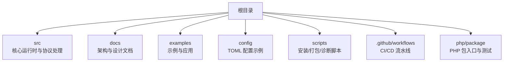
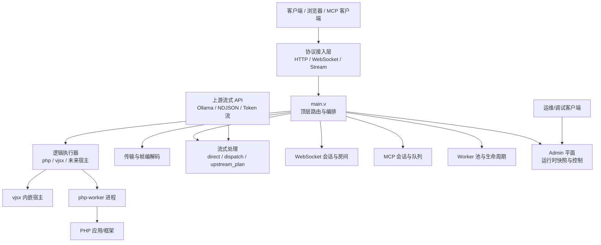
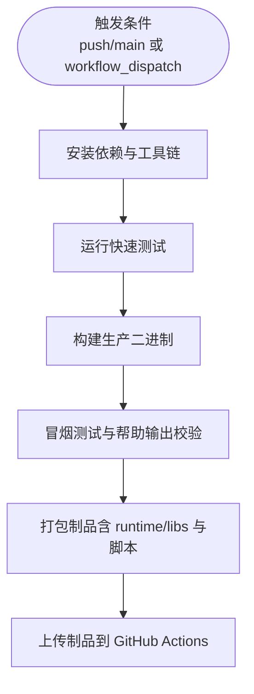

# 社区贡献指南

<cite>
**本文引用的文件**   
- [README.md](file://README.md)
- [OVERVIEW.md](file://docs/OVERVIEW.md)
- [vhttpd-binaries.yml](file://.github/workflows/vhttpd-binaries.yml)
- [sync-vphp-package.yml](file://.github/workflows/sync-vphp-package.yml)
</cite>

## 目录
1. [简介](#简介)
2. [项目结构](#项目结构)
3. [核心组件](#核心组件)
4. [架构总览](#架构总览)
5. [详细组件分析](#详细组件分析)
6. [依赖分析](#依赖分析)
7. [性能考虑](#性能考虑)
8. [故障排查指南](#故障排查指南)
9. [结论](#结论)
10. [附录](#附录)

## 简介
本指南面向希望参与 vhttpd 项目的贡献者，涵盖问题报告、功能请求、新功能开发流程、文档与代码贡献步骤、行为准则与沟通规范、新贡献者入门资源，以及贡献认可与激励机制。目标是让不同背景的参与者都能高效、安全地做出贡献。

## 项目结构
仓库采用“源码 + 文档 + 示例 + 配置 + 工作流”的清晰分层：
- src：核心运行时与协议处理模块（V 语言）
- docs：架构与设计文档、运行手册、协议说明等
- examples：多语言应用示例与配置
- config：TOML 配置文件示例
- scripts：安装、打包、诊断脚本
- .github/workflows：CI/CD 构建与发布流水线
- php/package：PHP 侧包入口与测试

章节来源
- [README.md:1-120](file://README.md#L1-L120)
- [OVERVIEW.md:1-60](file://docs/OVERVIEW.md#L1-L60)

## 核心组件
- 协议接入面：HTTP、WebSocket、Stream（SSE/text）、MCP Streamable HTTP
- 执行模型：逻辑执行器（php-worker、vjsx 内嵌），统一通过 executor 选择
- 运行时能力：上游流式执行、外部 worker 编排、内嵌 host 执行、worker 传输与池管理、可观测性与 admin 平面
- 关键路径：/admin/*（运行时快照、worker 控制）、/gateway/*（内置网关发送 API）、/mcp（MCP 传输）、/:path（数据面路由）

章节来源
- [README.md:45-126](file://README.md#L45-L126)
- [README.md:698-730](file://README.md#L698-L730)
- [OVERVIEW.md:165-228](file://docs/OVERVIEW.md#L165-L228)

## 架构总览
下图展示了客户端到 vhttpd 运行时、执行器与外部 worker 的整体交互关系。

图表来源
- [README.md:84-126](file://README.md#L84-L126)

章节来源
- [README.md:84-126](file://README.md#L84-L126)

## 详细组件分析

### 问题报告与分类标准
- 报告渠道：使用 GitHub Issues 提交问题
- 建议包含信息：
  - 环境信息：操作系统、vhttpd 版本、构建方式（本地或 CI 制品）
  - 复现步骤：最小化配置与调用序列
  - 期望与实际结果：包括错误码、日志片段、事件日志路径
  - 相关路径：/admin/runtime、/admin/workers、/events/stream 等
- 分类标准：
  - Bug：功能异常、崩溃、超时、错误码不符合预期
  - 性能：吞吐下降、延迟升高、内存/CPU 异常
  - 兼容性：平台、TLS/DB 驱动、PHP 版本差异
  - 文档：缺失、过时、不准确
  - 增强：新功能、体验优化、可观测性改进

章节来源
- [README.md:698-730](file://README.md#L698-L730)
- [README.md:1009-1030](file://README.md#L1009-L1030)
- [README.md:1101-1115](file://README.md#L1101-L1115)

### 功能请求流程
- 需求讨论：在 Issue 中描述背景、目标用户、收益与风险
- 方案设计：参考现有架构文档（如 OVERVIEW、RUNTIME_MODULE_MAP）评估影响面
- 实现步骤：先提供最小可行方案（MVP），再迭代完善
- 验收标准：明确接口契约、配置项、可观测指标与回归用例

章节来源
- [OVERVIEW.md:1-60](file://docs/OVERVIEW.md#L1-L60)
- [README.md:128-150](file://README.md#L128-L150)

### 新功能开发参与方式
- 需求讨论：Issue 中定义范围与边界，确认是否属于 executor 或 surface 扩展
- 方案设计：遵循“veb 为 HTTP 事实来源”的设计原则，保持 vhttpd 薄层定位
- 实现步骤：
  - 新增/修改 src 下对应模块（如 stream_runtime、upstream_runtime、websocket_runtime、mcp_runtime）
  - 更新 TOML 配置与 CLI 参数（参见 README 中的多监听与站点 DSL）
  - 补充示例与文档（examples、docs）
  - 增加测试（单元测试、端到端）
- 评审与合并：PR 需通过 CI 构建与测试，确保二进制产物可用

章节来源
- [README.md:152-174](file://README.md#L152-L174)
- [README.md:533-617](file://README.md#L533-L617)
- [OVERVIEW.md:272-296](file://docs/OVERVIEW.md#L272-L296)

### 文档贡献指南
- 文档结构：
  - docs：架构、设计、运行手册、协议契约
  - articles：教程与案例
  - README：产品概览与快速上手
- 写作规范：
  - 术语一致（surface、executor、upstream_plan、dispatch 等）
  - 图示优先，配合流程图/时序图解释复杂流程
  - 链接到具体源文件与行号，便于追溯
- 翻译流程：
  - 以英文原文为准，中文译文保持术语对齐
  - 变更通过 PR 同步，CI 仅校验构建与基本语法

章节来源
- [OVERVIEW.md:297-320](file://docs/OVERVIEW.md#L297-L320)
- [README.md:128-150](file://README.md#L128-L150)

### 代码贡献步骤
- Fork 仓库并创建分支：基于 main 分支，按功能命名
- 本地构建与验证：
  - 安装依赖：make deps-core / make deps-db / make deps-vjsx
  - 构建：make vhttpd / make prod
  - 运行与自检：./vhttpd --help；检查 /admin 与 /events/stream
- 提交代码：
  - 小步提交，清晰的 commit message
  - 附带必要测试与文档更新
- 发起 PR：
  - 描述变更动机、影响面、测试覆盖
  - 等待 CI 构建与测试通过
- 发布与制品：
  - CI 构建 Linux/macOS 二进制并上传制品
  - 支持 workflow_dispatch 手动触发

章节来源
- [README.md:210-271](file://README.md#L210-L271)
- [README.md:279-346](file://README.md#L279-L346)
- [README.md:428-436](file://README.md#L428-L436)
- [vhttpd-binaries.yml:1-171](file://.github/workflows/vhttpd-binaries.yml#L1-L171)

### 社区行为准则与沟通规范
- 尊重与包容：理性讨论，避免人身攻击
- 透明与协作：公开讨论、记录决策、引用依据
- 质量优先：代码可读性、可维护性、可测试性
- 安全合规：不泄露敏感信息，遵循最小权限原则

[本节为通用规范说明，无需列出具体文件来源]

### 新贡献者入门指导与资源
- 快速上手：
  - 阅读 README 与 OVERVIEW，了解产品定位与运行面
  - 使用示例配置启动服务，访问 /admin 查看运行时状态
- 学习顺序：
  - 先看 OVERVIEW，再读 README，最后查阅 RUNTIME_MODULE_MAP
  - 针对特定能力（stream/upstream/MCP/WebSocket）参考对应文档
- 常用命令与路径：
  - 构建：make deps-core && make vhttpd
  - 运行：./vhttpd --host 127.0.0.1 --port 18081
  - 观察：GET /admin/runtime、GET /events/stream

章节来源
- [OVERVIEW.md:297-320](file://docs/OVERVIEW.md#L297-L320)
- [README.md:428-436](file://README.md#L428-L436)
- [README.md:698-730](file://README.md#L698-L730)

### 贡献者认可与激励机制
- 认可方式：
  - 合并 PR 后在变更日志或发布说明中致谢
  - 对长期贡献者在里程碑公告中点名感谢
- 激励建议：
  - 设立“月度贡献者”展示
  - 对高质量文档与示例给予额外曝光
  - 邀请活跃贡献者参与技术路线讨论

[本节为通用机制说明，无需列出具体文件来源]

## 依赖分析
- 构建与发布流水线：
  - vhttpd-binaries.yml：跨平台构建、打包、上传制品
  - sync-vphp-package.yml：将 php/package 子树同步至独立仓库
- 依赖要点：
  - Linux/macOS 原生库（OpenSSL、MySQL/PostgreSQL、SQLite、Boehm GC）
  - vjsx 模块与受管 QuickJS 源码准备
  - V 编译器与工具链

图表来源
- [vhttpd-binaries.yml:1-171](file://.github/workflows/vhttpd-binaries.yml#L1-L171)

章节来源
- [vhttpd-binaries.yml:1-171](file://.github/workflows/vhttpd-binaries.yml#L1-L171)
- [sync-vphp-package.yml:1-48](file://.github/workflows/sync-vphp-package.yml#L1-L48)

## 性能考虑
- 流式处理：优先使用 stream direct/dispatch/upstream_plan 模式，减少缓冲与拷贝
- Worker 池：合理设置 pool_size、queue_capacity、read_timeout_ms，避免队列溢出与超时
- 可观测性：利用 /admin/runtime 与事件日志进行瓶颈定位
- 构建优化：prod 构建默认 warn 级别日志，可通过环境变量调整

章节来源
- [README.md:191-209](file://README.md#L191-L209)
- [README.md:270-271](file://README.md#L270-L271)
- [OVERVIEW.md:229-252](file://docs/OVERVIEW.md#L229-L252)

## 故障排查指南
- 常见问题定位：
  - 队列满：返回 503，x-vhttpd-error-class: worker_queue_full
  - 队列超时：返回 504，x-vhttpd-error-class: worker_queue_timeout
  - 未知选项：CLI 参数校验失败
- 调试手段：
  - 访问 /admin/runtime 查看运行时快照
  - 订阅 /events/stream 获取 SSE ping 事件
  - 使用 /dispatch 调试桥接端点（查询 method/path）
  - 检查 Feishu 活动与消息发送端点

章节来源
- [OVERVIEW.md:229-252](file://docs/OVERVIEW.md#L229-L252)
- [README.md:1101-1115](file://README.md#L1101-L1115)
- [README.md:1009-1030](file://README.md#L1009-L1030)

## 结论
通过本指南，贡献者可快速理解 vhttpd 的定位与架构，掌握问题报告、功能请求、开发与文档贡献流程，并利用 CI 制品与可观测接口进行验证与排障。建议在贡献前充分阅读 OVERVIEW 与 README，并在 PR 中提供清晰的动机、设计与测试覆盖。

## 附录
- 推荐学习顺序：OVERVIEW → README → RUNTIME_MODULE_MAP
- 关键路径速查：/admin/*、/gateway/*、/mcp、/:path
- 构建与运行：make deps-* → make vhttpd/prod → ./vhttpd --help

章节来源
- [OVERVIEW.md:297-320](file://docs/OVERVIEW.md#L297-L320)
- [README.md:698-730](file://README.md#L698-L730)
- [README.md:210-271](file://README.md#L210-L271)