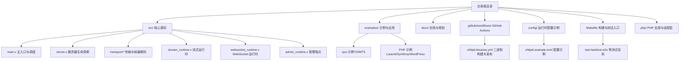
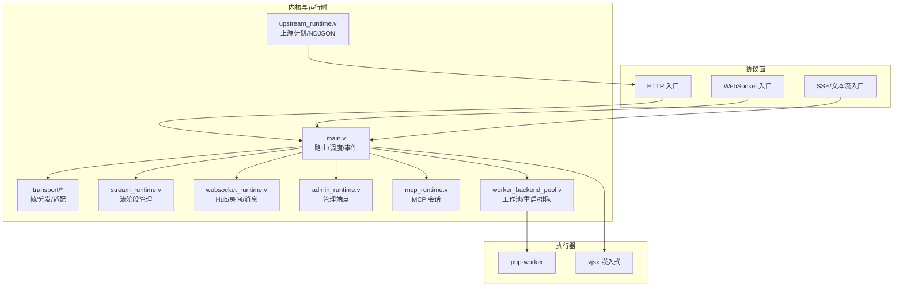
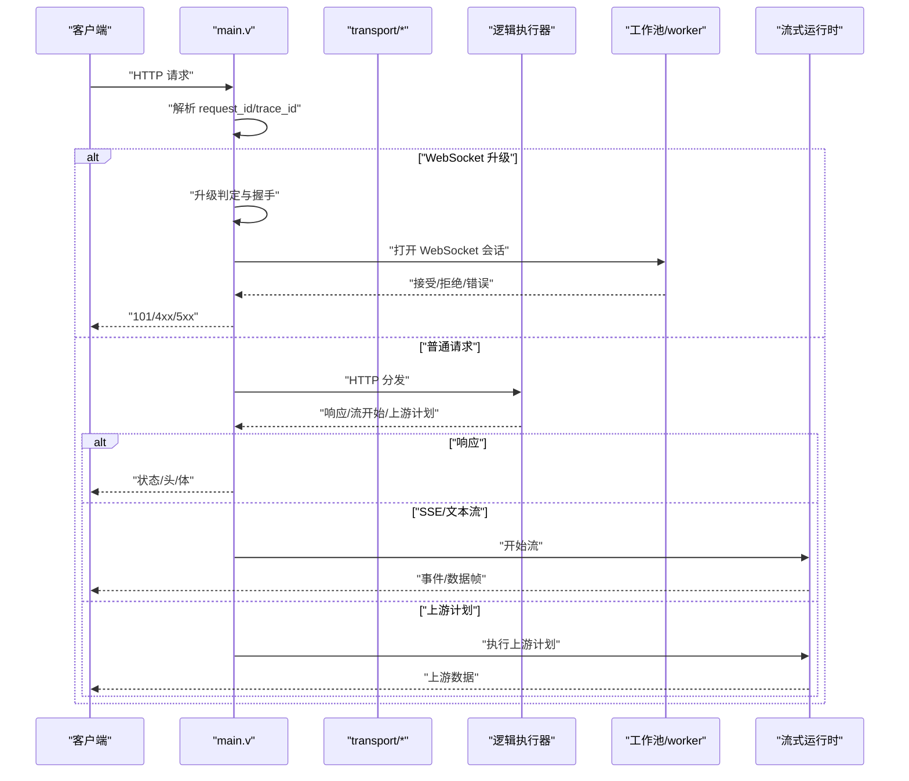
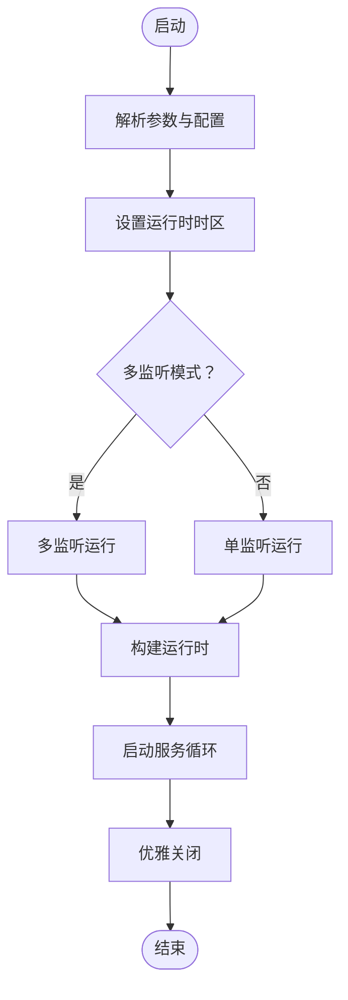
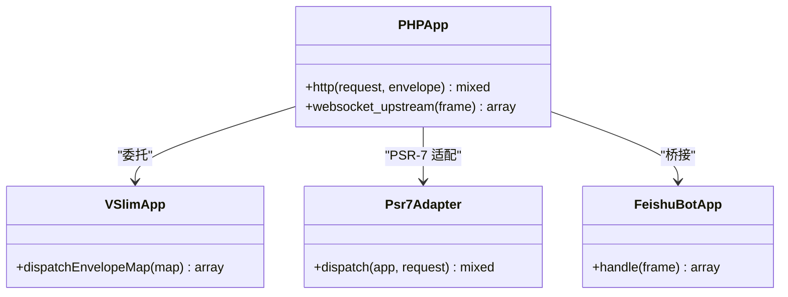
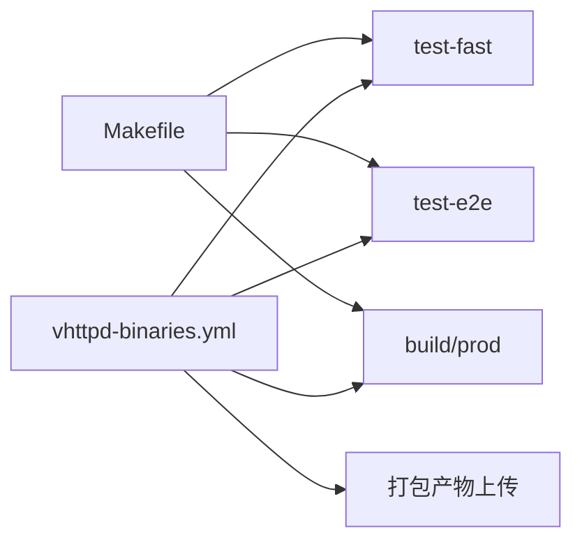

# 代码质量保证

<cite>
**本文引用的文件**
- [README.md](file://README.md)
- [v.mod](file://v.mod)
- [.github/workflows/vhttpd-binaries.yml](file://.github/workflows/vhttpd-binaries.yml)
- [Makefile](file://Makefile)
- [config/vhttpd.example.toml](file://config/vhttpd.example.toml)
- [src/main.v](file://src/main.v)
- [src/server.v](file://src/server.v)
- [php/app.php](file://php/app.php)
- [examples/codexbot-app/composer.json](file://examples/codexbot-app/composer.json)
</cite>

## 目录
1. [简介](#简介)
2. [项目结构](#项目结构)
3. [核心组件](#核心组件)
4. [架构总览](#架构总览)
5. [详细组件分析](#详细组件分析)
6. [依赖关系分析](#依赖关系分析)
7. [性能考量](#性能考量)
8. [故障排查指南](#故障排查指南)
9. [结论](#结论)
10. [附录](#附录)

## 简介
本指南面向 vhttpd 项目的代码质量保证，覆盖 V 语言、TypeScript（vjsx）与 PHP 三类代码风格要求，提供静态分析与安全扫描建议、持续集成流程与自动化测试配置、代码覆盖率与质量门禁建议、代码审查流程与最佳实践，以及重构与遗留代码处理策略。目标是帮助团队在多语言混合的运行时系统中建立一致、可维护、可演进的质量基线。

## 项目结构
vhttpd 是基于 V 语言构建的独立应用运行时，围绕“传输/工作池/流式/可观测性”的内核设计，支持多种逻辑执行器（php-worker、vjsx 嵌入式、WebSocket 上游等）。项目采用模块化组织，核心源码位于 src/，示例与文档在 examples/ 与 docs/，CI 在 .github/workflows/，构建与测试通过 Makefile 统一管理。

图表来源
- [README.md: 1-126:1-126](file://README.md#L1-L126)
- [Makefile: 1-139:1-139](file://Makefile#L1-L139)
- [.github/workflows/vhttpd-binaries.yml: 1-171:1-171](file://.github/workflows/vhttpd-binaries.yml#L1-L171)

章节来源
- [README.md: 1-126:1-126](file://README.md#L1-L126)
- [Makefile: 1-139:1-139](file://Makefile#L1-L139)

## 核心组件
- 主入口与调度：负责请求路由、WebSocket 升级、流式响应分发、事件日志与统计上报。
- 服务器生命周期：解析命令行与配置、初始化运行时、启动/停止服务。
- 传输与帧编解码：统一的 worker 与客户端之间的帧协议，支撑 SSE、文本流与 WebSocket。
- 流式运行时：支持阶段 1/2/3 的上游/下游流生命周期管理。
- WebSocket 运行时：连接注册、房间/成员、消息桥接与关闭处理。
- 管理端点：运行时快照、上游状态、活动事件等调试与运维接口。
- PHP 适配层：PSR-7/15 兼容的请求适配、回调桥接与 vjsx 嵌入式运行时。

章节来源
- [src/main.v: 1-800:1-800](file://src/main.v#L1-L800)
- [src/server.v: 1-237:1-237](file://src/server.v#L1-L237)

## 架构总览
vhttpd 将协议面（HTTP/WebSocket/Stream）与运行时面（上游、工作池、管理端、MCP）解耦，通过逻辑执行器抽象统一接入 PHP 与 vjsx。下图展示主要模块交互与职责边界：

图表来源
- [README.md: 84-126:84-126](file://README.md#L84-L126)
- [src/main.v: 1-800:1-800](file://src/main.v#L1-L800)

## 详细组件分析

### 组件 A：主入口与调度（src/main.v）
- 职责：请求/升级判定、上下文注入（request_id、trace_id）、执行器分发、流式/上游模式选择、事件日志与统计。
- 关键流程：HTTP 请求进入后根据是否 WebSocket 升级分流；若启用流式分发策略则走 dispatch 模式；否则交由逻辑执行器处理；对于流式响应，按 SSE 或透传路径处理。
- 错误分类：将后端错误映射为超时/传输/工作器运行时等类别，便于统计与告警。
- 可观测性：事件日志、HTTP 统计、运行时跟踪文件。

图表来源
- [src/main.v: 566-648:566-648](file://src/main.v#L566-L648)
- [src/main.v: 392-493:392-493](file://src/main.v#L392-L493)

章节来源
- [src/main.v: 566-648:566-648](file://src/main.v#L566-L648)
- [src/main.v: 392-493:392-493](file://src/main.v#L392-L493)

### 组件 B：服务器生命周期（src/server.v）
- 职责：参数校验、配置加载、时区设置、单实例/多监听模式切换、运行时构建与启停。
- 锁序与并发：定义严格的全局锁层级，避免死锁；函数需按层级顺序获取锁并在所有分支释放。
- 命令行选项：覆盖配置文件与环境变量，支持 PHP 与 vjsx 执行器参数。

图表来源
- [src/server.v: 171-201:171-201](file://src/server.v#L171-L201)
- [src/server.v: 203-218:203-218](file://src/server.v#L203-L218)

章节来源
- [src/server.v: 171-201:171-201](file://src/server.v#L171-L201)
- [src/server.v: 203-218:203-218](file://src/server.v#L203-L218)

### 组件 C：PHP 应用适配（php/app.php）
- 职责：将 vhttpd 与 VSlim/PSR-7/15 适配，提供 HTTP 与 WebSocket 上游回调入口。
- 设计要点：严格类型声明、清晰的入站/出站映射、对 envelope 的兼容处理。

图表来源
- [php/app.php: 1-56:1-56](file://php/app.php#L1-L56)

章节来源
- [php/app.php: 1-56:1-56](file://php/app.php#L1-L56)

### 组件 D：配置与运行（config/vhttpd.example.toml）
- 覆盖路径、服务器、文件、运行时、工作池、执行器、PHP、管理端、静态资源与 Feishu 上游等。
- 变量展开：字符串字段支持 ${section.key} 与 ${env.NAME} 形式，便于跨环境复用。

章节来源
- [config/vhttpd.example.toml: 1-67:1-67](file://config/vhttpd.example.toml#L1-L67)

## 依赖关系分析
- 构建与测试：Makefile 提供构建、测试、依赖安装与演示脚本；CI 使用 GitHub Actions 构建多平台二进制并进行快速单元测试与端到端验证。
- 依赖发现：自动扫描 src/ 下的 *_test.v 文件，排除重型与数据库相关测试以加速 CI。
- 依赖安装：按 profile 安装核心、vjsx、DB、全量依赖，并提供 doctor 脚本诊断环境。

图表来源
- [Makefile: 114-139:114-139](file://Makefile#L114-L139)
- [.github/workflows/vhttpd-binaries.yml: 25-171:25-171](file://.github/workflows/vhttpd-binaries.yml#L25-L171)

章节来源
- [Makefile: 114-139:114-139](file://Makefile#L114-L139)
- [.github/workflows/vhttpd-binaries.yml: 25-171:25-171](file://.github/workflows/vhttpd-binaries.yml#L25-L171)

## 性能考量
- 流式路径：SSE 与文本流应避免不必要的缓冲与阻塞；WebSocket 消息桥接需控制并发与锁粒度。
- 工作池：合理设置队列容量与超时、最大请求数与重启退避，防止雪崩。
- 日志与事件：事件日志写入需异步或批量化，避免阻塞请求路径。
- 二进制构建：生产构建启用 -prod 与 -nocache，TLS 后端可选 openssl 或 mbedtls，结合 DB 开关优化体积与启动时间。

章节来源
- [src/main.v: 618-625:618-625](file://src/main.v#L618-L625)
- [src/server.v: 171-201:171-201](file://src/server.v#L171-L201)
- [.github/workflows/vhttpd-binaries.yml: 133-149:133-149](file://.github/workflows/vhttpd-binaries.yml#L133-L149)

## 故障排查指南
- 常见问题定位
  - 请求无响应：检查工作池状态、队列是否满、worker 是否存活与重启退避。
  - WebSocket 无法升级：确认请求头、方法与握手流程，查看桥接回调中的错误类与 trace_id。
  - 流式输出异常：区分 SSE 与透传路径，关注 start/content-type 判定与帧序列。
- 运维接口
  - 管理端点：/admin/runtime/* 与 /admin/runtime/upstreams/websocket/* 提供运行时快照与事件。
  - 事件日志：/events/stream 与运行时事件日志文件用于回放与分析。
- CI 与本地一致性
  - CI 中已包含快速单元测试与端到端验证，确保本地 doctor 与依赖安装一致。

章节来源
- [src/main.v: 700-713:700-713](file://src/main.v#L700-L713)
- [src/main.v: 765-800:765-800](file://src/main.v#L765-L800)
- [.github/workflows/vhttpd-binaries.yml: 127-149:127-149](file://.github/workflows/vhttpd-binaries.yml#L127-L149)

## 结论
通过明确的代码风格、静态分析与安全扫描建议、完善的 CI 流程、可观测性与质量门禁，vhttpd 能够在多语言混合的复杂运行时中保持高质量与高可维护性。建议持续完善测试矩阵、覆盖率门槛与代码审查清单，推动重构与遗留代码的有序迁移。

## 附录

### 代码规范与编码标准

- V 语言
  - 命名：模块小写，结构体与公共字段 PascalCase，私有字段 camelCase；函数与常量遵循语义清晰的命名。
  - 并发：严格遵守锁层级顺序，使用 defer 释放锁；避免在持有高层锁时调用外部回调。
  - 错误处理：显式错误传播与分类，区分超时、传输、工作器运行时等错误类别。
  - 注释与文档：关键流程与并发点添加注释；对外接口与配置项提供文档链接。
  - 示例参考：主入口与服务器生命周期文件展示了良好的结构与注释风格。

- TypeScript（vjsx）
  - 类型：优先使用强类型定义，避免 any；导出 API 明确入参/返回值结构。
  - 异步：Promise/async 函数需正确处理异常与超时；避免阻塞主线程。
  - 导入：按功能模块拆分，避免循环依赖；统一相对路径与别名。
  - 示例参考：示例应用与协议文件展示了模块化与类型约束的实践。

- PHP
  - 类型：启用 declare(strict_types=1)，严格类型参数与返回值。
  - PSR：遵循 PSR-7/15，适配 VSlim；请求/响应映射清晰，头信息处理一致。
  - 回调：回调入口统一，错误路径返回标准化结构，便于上层捕获与记录。
  - 示例参考：php/app.php 展示了 HTTP 与 WebSocket 上游回调的实现方式。

章节来源
- [src/server.v: 82-87:82-87](file://src/server.v#L82-L87)
- [php/app.php: 1-56:1-56](file://php/app.php#L1-L56)

### 静态分析与安全扫描
- V 语言
  - 使用 V 自带的类型系统与编译期检查；建议在 CI 中开启更严格的编译标志。
  - 对并发与锁使用进行专项检查，确保锁层级与释放顺序正确。
- TypeScript
  - 使用类型检查工具（如 tsc）与 ESLint（TS 规则），启用 no-any 与 strict 模式。
  - 对导入路径与循环依赖进行静态扫描。
- PHP
  - 使用 PHPStan 或 Psalm 进行静态分析，结合 PSR-12 代码风格检查。
  - 对回调与外部输入进行入参校验与类型断言。

[本节为通用指导，不直接分析具体文件]

### 持续集成与自动化测试
- 已有
  - GitHub Actions 工作流：构建多平台二进制、安装依赖、运行快速单元测试与端到端验证、打包产物。
  - Makefile：统一构建、测试与依赖安装入口，支持不同测试子集。
- 建议
  - 增加覆盖率报告收集与阈值门禁（例如：整体覆盖率不低于 X%，关键模块不低于 Y%）。
  - 将数据库相关测试分离为独立 job，避免 CI 资源争用。
  - 引入安全扫描（Secrets、依赖漏洞）与性能回归检测（基准测试）。

章节来源
- [.github/workflows/vhttpd-binaries.yml: 25-171:25-171](file://.github/workflows/vhttpd-binaries.yml#L25-L171)
- [Makefile: 114-139:114-139](file://Makefile#L114-L139)

### 代码覆盖率与质量门禁
- 覆盖率建议
  - 总体：≥ 70%
  - 关键模块（main.v、server.v、transport/*、websocket_runtime.v、stream_runtime.v）：≥ 80%
  - PHP 适配层：≥ 75%
- 门禁策略
  - PR 必须通过 CI 快速测试与端到端验证。
  - 新增/修改功能需补充单元测试，覆盖率未达标禁止合并。
  - 高风险变更（并发、网络、流式）需额外评审与回归测试。

[本节为通用指导，不直接分析具体文件]

### 代码审查流程与最佳实践
- 审查清单
  - 并发与锁：是否遵循锁层级顺序，是否在持有高层锁时调用外部回调。
  - 错误处理：错误分类是否清晰，是否记录 trace_id 与错误类。
  - 可观测性：是否产生必要的事件日志与统计指标。
  - 配置与环境：是否支持变量展开与环境覆盖，文档是否同步更新。
- 最佳实践
  - 小步提交，聚焦单一变更；每个 PR 仅解决一个问题。
  - 重要变更附带测试用例与变更说明。
  - 对外接口变更需同步更新文档与示例。

[本节为通用指导，不直接分析具体文件]

### 重构指南与遗留代码处理策略
- 重构原则
  - 保持行为不变，逐步替换内部实现；确保测试覆盖稳定。
  - 对并发敏感区域进行隔离与保护，避免在重构期间引入竞态。
- 遗留代码处理
  - 识别历史遗留模块与分支，制定迁移计划与替代方案。
  - 为遗留代码添加注释与废弃提示，逐步替换为新实现。
  - 对于外部依赖（如特定扩展）提供替代路径或降级策略。

[本节为通用指导，不直接分析具体文件]